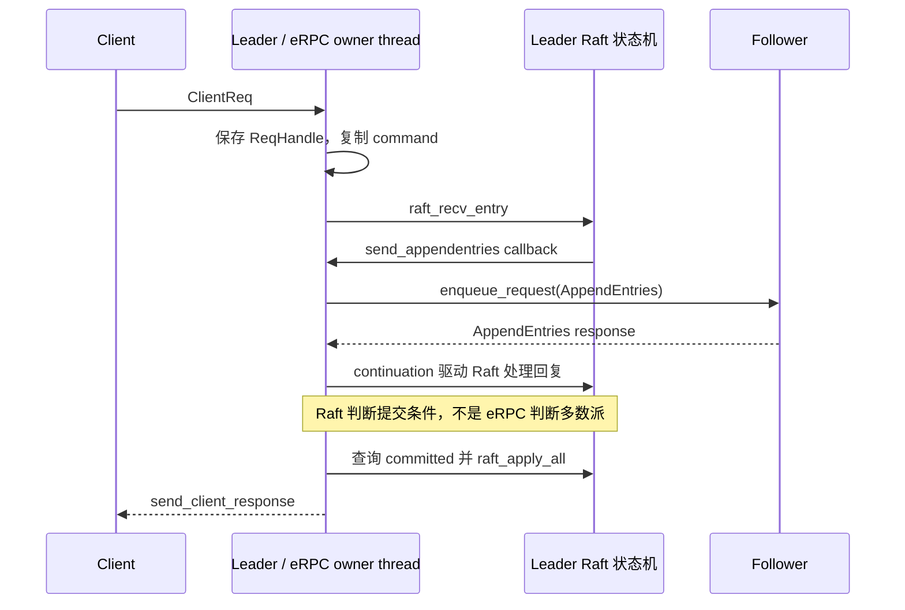

---
tags:
  - Linux
  - RPC
  - eRPC
  - Benchmark
  - Raft
  - 论文复现
aliases:
  - eRPC Benchmark 实验
  - eRPC Raft 论文复现
阅读次数: 0
---

# 18.12 eRPC Benchmark 与 Raft 论文复现实验

[[3.Linux/18. 高级网络编程与 RPC/18.10 eRPC 核心架构：Session、MsgBuf、Event Loop 与 Transport|18.10 eRPC 核心架构：Session、MsgBuf、Event Loop 与 Transport]] 解释了应用如何正确使用 Rpc、Session 和 MsgBuffer；[[3.Linux/18. 高级网络编程与 RPC/18.11 eRPC 高性能数据路径：Zero-Copy、Credit、重传与拥塞处理|18.11 eRPC 高性能数据路径：Zero-Copy、Credit、重传与拥塞处理]] 解释了数据包为什么会等待、复制或重传。本篇把这些机制变成**可复查的源码实验、性能实验和 Raft 适配实验**。

> [!important] 这是实验手册，不是实测报告
> 本笔记核对了官方源码、配置和论文，但没有在当前环境完成 NIC 部署、eRPC 编译、跨机运行或故障注入。下面的命令是待在实验机器执行的步骤；表格中的论文数值是历史结果，空白记录项不是已完成的数据。
>
> 代码基线固定为 `erpc-io/eRPC` 提交 `de83dab3eab4a0fb19bfc4881c11d4a6b89ff17d`，核验日期 2026-09-07。论文基线为 NSDI 2019 的正式版本。二者不是同一个版本，不能混合成一个未经说明的“复现”。

## 1. 先定义完成了哪一种实验

| 层级 | 要回答的问题 | 合格的证据 | 还不能声称什么 |
|---|---|---|---|
| A：功能跑通 | 会话能否建立，请求能否执行，continuation 是否收到预期结果？ | 双端日志、消息校验、正确的资源生命期 | 达到了论文性能 |
| B：性能复查 | 特定软硬件、消息大小、并发度下，延迟和吞吐怎样变化？ | 固定版本、运行清单、原始样本/直方图、多次重复与瓶颈观测 | 完整复刻 2019 环境 |
| C：Raft 适配 | eRPC 回调能否正确驱动 Raft 消息、计时和提交？ | 稳定集群的提交记录、客户端结果、状态机核对 | 完成了崩溃恢复、Snapshot 或生产级 KV |
| D：严格复现/扩展 | 能否解释与论文图表的差异，或验证额外故障语义？ | 对齐工作负载、计时边界、硬件与补丁；单独的正确性实验 | 换了硬件与语义仍可直接比较绝对数值 |

第一目标可以只是 A，但报告必须写 A；达到 B 后再做 C。不要把“启动成功”和“论文复现成功”都写成一个绿色勾。

这里沿用 [[8.高性能存储/0. 数据路径硬件基础/0.8 Benchmark 基本方法|0.8 Benchmark 基本方法]] 的控制变量原则。*Systems Performance* 第 2 版第 12 章强调：基准需要结合运行时观测，确认被测路径和瓶颈，而不是只执行工具再抄结果。[B1]

## 2. 读论文前先冻结版本差异

| 观察项 | 原始设计/常见概括 | 本提交中实际需要核对的内容 |
|---|---|---|
| 零拷贝 | 论文讨论避免发送侧复制的设计 | DPDK TX 代码把消息复制到 mbuf；IB 后端非 inline 路径使用 SGE，不能混称全后端零拷贝 |
| 拥塞与 pacing | 端点进行拥塞控制与发送调度 | request 路径经过 pacing 决策；`kick_rfr_st()` 仍有 RFR pacing TODO |
| 节点失效 | 包重传和节点故障是不同问题 | 数据路径扫描中的服务器故障检测分支为 `if (false)`；相关客户端故障测试未启用 |
| 延迟工作负载 | 需要固定消息大小比较分布 | `apps/latency` 会轮换请求大小，直方图不随每次大小切换清空 |
| Raft 持久化 | 论文的低延迟 Raft 实验是内存工作负载 | `apps/smr` 默认 `kUsePmem=false`；不能把返回成功视为落 SSD |
| Raft 完整性 | Raft 算法包含多个工程组成部分 | 当前应用明确不支持 Snapshot、日志压缩和配置变更 |

前四项是源码审查结论，不是性能测量结论。[S1][S2][S3][S4] **代码包含 memcpy，不等于已经证明 memcpy 是当前机器的性能瓶颈；存在重传路径，也不等于已经证明节点故障能正确收敛。**

### 2.1 论文的数值要按计时位置读取

正式论文 §7.1 / 表 6 的 eRPC Raft 结果如下：[P1]

| 计时位置 | 中位数 | P99 |
|---|---:|---:|
| Client：端到端请求/响应 | 5.5 μs | 6.3 μs |
| Leader：复制提交相关处理区间 | 3.1 μs | 3.4 μs |

这是三副本**内存** KV 实验；论文的客户端工作负载为单客户端、16 B key、64 B value，并从约一百万个 key 中均匀选择。不要将上述数值解释为 SSD `fsync` 后的持久化延迟。[P1]

README 另写了 5.3 μs 的摘要结果。对正式论文表格进行复现时，本笔记采用表 6 的 5.5 μs，不拼接两个数值作为同一个测量。[S1][P1]

同样，论文中的单核“处理约 10M RPC/s”包含端点双向工作：发起 RPC 与处理对端发来的 RPC。它不能未经换算就写成“单纯 server 每秒完成 10M 个客户端请求”。报告必须定义一次 operation 的计数方式。[P1]

## 3. 实验环境：先记录，再调参

### 3.1 两张网络地图

先画清楚**内核管理网络**和**用户态数据网络**。Nexus 的 URI 使用内核可达的管理地址，数据面端口由 Transport 选择。不能把 DPDK 已接管、无法再由内核处理的接口地址直接当作控制面地址。[S1][S5]

第一次实验建议使用两台独占或负载可控的 Linux 机器。Raft 实验再扩展为三个 server 进程加一个 client 进程，优先让 client 与 server 不争抢同一物理核。这是实验安排，不是用户已经拥有的硬件条件。

还有一个版本限制：README 对 DPDK NIC 的表述较宽，但本提交 `DpdkTransport::resolve_phy_port()` 会断言驱动名为 `net_mlx4`、`net_mlx5` 或 `mlx5_pci`。因此不能承诺“任何 DPDK 网卡都能直接运行这个提交”。先核对具体 PMD，若需要适配补丁，应单独记录并验证。[S13]

没有合适 NIC 时可以进行源码走读、状态机推演和记录模板准备；不能把软件模拟或普通回环测试的性能标成用户态 NIC 数据路径性能。

### 3.2 保存最小环境清单

在每台实验机的 eRPC checkout 根目录执行下列**只读采集**。脚本不会绑定网卡、改 MTU、预留 hugepage 或关闭防火墙。

```bash
# Bash，Linux-only。当前目录应是已检出的 eRPC 仓库。
set -euo pipefail
mkdir -p results
stamp=$(date -u +%Y%m%dT%H%M%SZ)
{
  date -u
  uname -a
  git rev-parse HEAD
  git status --short
  cmake --version
  c++ --version
  lscpu
  if command -v numactl >/dev/null 2>&1; then numactl --hardware; fi
  grep -E 'Huge|MemAvailable' /proc/meminfo
  ulimit -l
  if command -v pkg-config >/dev/null 2>&1; then
    pkg-config --modversion libdpdk 2>/dev/null || printf 'libdpdk: not resolved\n'
  fi
} > "results/environment-$stamp.txt" 2>&1
```

另外记录 NIC 型号、PCIe 链路、固件、驱动/PMD、NUMA 归属、链路速率、MTU、交换机配置和具体 CPU 绑定。可以对**实际存在的内核接口**执行 `ethtool -i`；用户态独占或不同驱动模型下，不保证内核接口仍暴露完整统计。

[[8.高性能存储/0. 数据路径硬件基础/0.5 NUMA CPU 亲和性与内存亲和性|0.5 NUMA CPU 亲和性与内存亲和性]] 是解释“CPU、消息缓冲与 NIC 是否跨 NUMA”所需的前置笔记。只写“运行了 numactl”不够，记录实际绑核结果和内存落点，区分物理核与 SMT sibling。

### 3.3 Hugepage 不是越多越好

上游 README 给出了当时的 hugepage/共享内存配置要求，具体分配还受 Transport 的队列、mbuf 池和 NUMA 配置影响。[S1][S12] 对实验机器应记录每个 NUMA node 的页大小、预留量和空闲量，先确认可用内存，再按实际需求配置。

不要直接在共享机器照抄全局 unlimited 配置，不要通过未知脚本批量修改网络。网卡由哪种 PMD 驱动、是否需要设备绑定，应按照**该硬件与驱动的官方说明**处理；本笔记不提供跨驱动通用的“绑定命令”。

## 4. 建立可重建的代码基线

### 4.1 使用独立实验 checkout

以下命令只用于新建的实验目录，**不是修改 Obsidian 仓库**。固定完整 SHA，而不是每次使用不断变化的分支顶端。

```bash
# Bash。父目录中尚不存在 eRPC 时执行。
set -euo pipefail
git clone https://github.com/erpc-io/eRPC.git eRPC
cd eRPC
git checkout --detach de83dab3eab4a0fb19bfc4881c11d4a6b89ff17d
git rev-parse HEAD
# 后续实验补丁单独保存；不要将教材或此 checkout 塞入笔记仓库。
```

当前 `autorun_helpers.h` 把进程配置路径写成 `../eRPC/scripts/autorun_process_file`。因此保留目录名 `eRPC` 并从其根目录启动，是避免该相对路径问题的最小做法。更改目录结构时，需要显式修改并记录这个适配补丁。[S6]

### 4.2 选择应用的方式：不是猜一个 `-DAPP`

CMake 读取 `scripts/autorun_app_file` 的内容选择应用。文件不存在时，相关配置路径会提前返回。当前构建系统把运行文件放到源码目录的 `build/` 中，即使另设 CMake build directory，也要看它的实际输出路径。[S3]

下面以**已安装兼容 DPDK 和相关依赖**为前提；不是依赖安装脚本，也不代表所有新版 DPDK 都兼容：

```bash
# 在 eRPC 根目录执行。当前 checkout 作为专用实验副本使用。
set -euo pipefail
printf '%s\n' latency > scripts/autorun_app_file
cmake -S . -B cmake-build \
  -DTRANSPORT=dpdk -DPERF=ON -DLOG_LEVEL=warn
cmake --build cmake-build --target hello_server hello_client latency -j2
```

构建失败时保存编译器输出、CMakeCache 和补丁。该项目有旧版 CMake 最低版本声明、`-march=native`、严格警告选项和驱动 API 依赖；**配置成功不能证明 ABI、驱动和运行环境已经匹配**。[S3]

采用 InfiniBand 时使用对应 `TRANSPORT=infiniband`；RoCE 是此后端的额外构建选项 `ROCE=ON`，不是默认 DPDK Ethernet 路径的别名。[S1][S3] 不同后端应使用不同 checkout 或清楚隔离生成物，因为本提交多个构建目录仍可向同一个源码 `build/` 输出。

本提交允许第一个 DPDK 应用以 primary 方式启动，不是任何单进程实验都必须先运行 daemon。但同机多个 eRPC 进程涉及 primary/secondary 及专用 ownership memzone，不能直接把双机命令改为同机多开；需要检查 `erpc_dpdk_daemon` 的初始化和共享资源流程。[S13]

### 4.3 功能测试与性能构建分开

`PERF=OFF` 启用调试与测试，性能会显著不同；它不能作为论文性能基线。上游提示 DPDK 测试需要两个端口并使用专用测试脚本，不能在任意单端口机器上把所有 `ctest` 失败都归因于 RPC 逻辑。[S1][S3]

检查本提交 `packet_loss_test` 与 `server_failure_test` 的构建状态：前者启用，后者在 CMake 中被注释掉。**未编译、未执行的测试没有“通过”这一状态。**

## 5. 先跑 Hello World，再检查自己的生命周期

修改 `hello_world/common.h` 中的 server/client hostname 为真实管理网络主机名，确认管理 UDP 端口、Rpc ID 与数据端口映射，再分别运行构建得到的 `hello_server`、`hello_client`。[S1][S5]

第一次成功的证据应包括：双方 session 建立、server 收到请求、client continuation 到达，以及返回数据符合示例协议。客户端只退出而没有响应日志，不算成功。

官方最小示例不是完整的超时与生命周期工程模板。例如 `hello_world/client.cc` 运行固定时长的事件循环后删除 Rpc，不能据此推导“运行 100 ms 就表示请求必定完成”。自己扩展示例时，应采用 [[3.Linux/18. 高级网络编程与 RPC/18.10 eRPC 核心架构：Session、MsgBuf、Event Loop 与 Transport|18.10 eRPC 核心架构：Session、MsgBuf、Event Loop 与 Transport]] 的 owner-thread 规则、Pending 状态和缓冲借用边界。[S5]

> [!warning] Pending 与退出
> 应用等待时间到达，不会自动取消 eRPC 对 MsgBuffer 的引用。要么继续推进并等待明确完成，要么进入经过源码和测试验证的端点关闭流程。不要让栈上的 callback tag、MsgBuffer 描述符先析构，再假设后台网络活动会自行停止。

## 6. 单 RPC 延迟：避免测到“混合分布”

### 6.1 先解释官方 latency 程序到底在做什么

本提交 `apps/latency/latency.cc` 包含这些会直接影响结果解读的行为：[S4]

| 行为 | 对实验解释的影响 |
|---|---|
| 请求大小在 64 B 至 1024 B 之间轮换，默认响应为 8 B | 不是固定 32 B / 32 B workload |
| continuation 收到响应后立即发下一次请求 | 单客户端闭环；慢响应同时压低下一次请求的到达速度 |
| 首个请求缓冲按最大值分配，开始发送前没有立即缩到 `req_size_` | 初始请求的实际长度需要检查，不能只看变量初值 |
| 直方图在预热期、分钟边界清空，而非每次消息大小变化时清空 | 一个输出行标注的请求大小，不保证对应纯粹的该大小分布 |
| 服务端主要调整 response 长度，客户端核对长度 | 不是完整 payload 正确性测试 |

因此直接运行原程序，首先得到的是**该程序本身定义的工作负载结果**。准备固定消息大小的性能图时，应创建一个小而可审查的实验补丁，而不是把混合输出重命名成固定大小测试。

### 6.2 固定大小改造的最小要求

建议每个进程运行只测一个 `(request_bytes, response_bytes)` 组合：在第一条请求前显式 resize；关闭按秒轮换大小；预热结束后再开始采样；计时区间内不做日志打印、buffer 分配或直方图导出。每次试验结束先停止发新请求、完成或明确记账已有请求，再导出统计。

这是一份**实验改造要求**，不是宣称上游已有 `--req_size` 参数。本提交应以源码中真正的 `DEFINE_*` 和常量为准，不能虚构 CLI 参数。

适合入门的一组配置为 32/32 B、64/8 B、256/64 B、单包边界附近、超过单包边界的请求或响应。具体最大 payload 由所选 Transport 决定，不把 Ethernet MTU 直接当作 eRPC application payload 上限。

可以采用“5 s 预热、30 s 采样、重复 5 次”的初始实验安排；这些时长是本笔记建议，不是论文规定或已执行记录。达到更极端的分位数时，应根据样本量延长采样，而不是只增加输出小数位。

### 6.3 分清三个计时区间

```text
应用排队延迟：计划产生请求 → 进入 enqueue_request
RPC 完成延迟：进入 enqueue_request → continuation 可见响应
端到端响应时间：计划产生请求 → 业务结果可交付
```

闭环测试适合建立低负载基础延迟，但对“固定外部到达率下排队会多严重”没有直接答案。如果扩展为按目标速率发请求，要记录**计划到达时间**、实际提交时间、排队与拒绝，避免把由于阻塞而根本没发出的请求从延迟统计中抹掉。这是从负载发生方式推导出的测量要求，不是 eRPC 的一个现成配置开关。

### 6.4 启动配置示例

以两台机器的管理主机名 `node-a`、`node-b` 为例，替换成自己实际可解析的名称，在所有节点保存相同的进程文件：

```text
node-a 31850 0
node-b 31850 0
```

它放在 `scripts/autorun_process_file`；三列是 hostname、管理 UDP port、NUMA node。`apps/latency/config` 中的测试时长、server 数量与 NUMA-port 映射也必须与本机对应。[S6][S7]

审核 `scripts/do.sh` 使用的环境变量、权限和命令后，从 eRPC 根目录分别运行：

```bash
# node-a：启动 process 0，绑定到已确认的 NUMA node 0。
./scripts/do.sh 0 0
```

```bash
# node-b：启动 process 1，绑定到已确认的 NUMA node 0。
./scripts/do.sh 1 0
```

脚本会通过 sudo 与 numactl 启动程序，并加载 `apps/<app>/config`。它不是自动安装驱动、创建正确 hugepage 或修复 NIC 配置的工具。初始化报错先排查具体 PMD、端口、队列和内存条件，不反复添加 root 权限碰运气。[S7][S12]

## 7. 吞吐与扩展性：一次只改变一个规模

官方 `apps/` 包含 `small_rpc_tput`、`large_rpc_tput`、`server_rate`、`congestion` 等应用。构建时仍通过 `autorun_app_file` 选择；运行前必须读取各自源码和配置，不能把 `latency` 的参数直接复制过去。[S1][S3]

以下是实验矩阵，不是已取得的性能数据：

| 实验 | 自变量 | 保持不变的因素 | 关键输出 |
|---|---|---|---|
| 小包并发 | 每客户端 outstanding 数 | payload、核数、session 数、NIC | offered/completed RPC/s、P99、CPU、backlog |
| 线程扩展 | owner-thread / Rpc 数 | 每线程负载、绑核原则 | 总吞吐、每核吞吐、队列/内存资源 |
| 会话扩展 | 每 Rpc 的 Session 数 | 总 offered load | 常驻内存、cache/TLB、P99、建连成本 |
| 大消息 | 请求/响应大小分别变化 | 线程数、链路、credit 配置 | 有效 payload 带宽、CPU、RFR/CR、重传 |
| 汇聚 | 同时指向一个 receiver 的发送端数 | 业务处理和总/单流负载定义 | 接收丢包、排队、流间公平、尾延迟 |

outstanding 超过 session 请求窗口时，当前源码会使用 backlog；它不是无界免费扩展能力。测试既要看完成吞吐，也要看应用持有多少 Pending buffer。只看吞吐平台、不看内存增长，很容易把过载伪装成稳定运行。[S2]

### 7.1 报告有效负载带宽，而不是只报网卡速率

若每秒成功完成 `R` 个请求，请求与响应应用字节分别为 `Q`、`S`：

```text
请求方向有效负载带宽 = R × Q × 8 bit/s
响应方向有效负载带宽 = R × S × 8 bit/s
```

包头、CR、RFR、重传、链路开销不包含在这两个值里。全双工两个方向分别报告；把两方向相加后，不应与单方向标称线速直接比较。协议包数计算见 [[3.Linux/18. 高级网络编程与 RPC/18.11 eRPC 高性能数据路径：Zero-Copy、Credit、重传与拥塞处理|18.11 eRPC 高性能数据路径：Zero-Copy、Credit、重传与拥塞处理]]。

### 7.2 用观测解释拐点

从低负载逐渐提高并发，观察何时开始出现排队或吞吐不再增长。在少量诊断轮次中采集 CPU cycles、指令、cache miss、分配/复制热点和 NIC/PMD 计数；正式测量轮次与重型 tracing 轮次分开，记录观测开销。[B1]

DPDK 绕过内核 socket 数据路径时，不能仅凭内核 UDP 统计就判断全部数据包是否丢失。`tc netem` 是否真的位于被测包的路径上，也必须先用计数或抓包验证；只给管理接口加 delay，可能只影响建连而没有影响稳态 RPC。

## 8. 丢包与超时实验：先证明注入点有效

最小实验应区分 request、response、CR、RFR 的损失，并保留注入位置、概率/规则、随机种子与构建开关。优先从上游 `packet_loss_test` 和 `rpc_fault_inject` 的实际实现入手；没有读懂故障注入接口时，不编造运行参数。[S3]

每次试验至少记录：请求的逻辑标识、client 提交/完成、server handler 调用次数、重传计数、响应校验，以及是否出现超时但最终仍收到结果。

期望验证的是“同一个仍可识别的逻辑请求是否被重复交付”，而不是“丢包后程序还活着”。把 server 进程杀死与随机丢几个数据包分开；本提交的故障检测缺口使两者不能共享一份通过报告。[S2]

> [!warning] 降低 RTO 不是修复节点故障恢复
> 较小 RTO 可以改变重传速度，也可能增加误重传；它不会自动补上未启用的 failure detection、reset、上层重试和资源清理。应用重试还必须面对“原请求可能已经执行”的不确定性。[B2]

## 9. Raft：复现的是 `apps/smr`，不是自己虚构一个 benchmark

### 9.1 先看当前应用的边界

本提交使用 `apps/smr/` 及其 `willemt_raft` 代码；`smr/config` 设置四个进程，其中三个是 Raft server。源码默认 `kUsePmem=false`、value 32 B、key 为 `size_t`，与正式论文的 16 B key / 64 B value 不同。[S8][S9]

在常见 64 位 ABI 上，`size_t` key 通常为 8 B，但应在实际编译环境检查 `sizeof`、结构体 padding 和编码路径。当前 native struct 形式不能未经审查就作为跨 ABI 的可移植 wire format。

`leader_saveinfo` 只有一个活动客户端请求槽位；handler 中有 `assert(!leader_sav.in_use)`。因此本应用不能简单增加任意数量的并发 client，就宣称正在测同一个 Raft workload。[S10]

### 9.2 构建和拓扑

在单独的 SMR 实验 checkout 中选择应用：

```bash
# 同样假设 Transport 与依赖已正确安装；在 eRPC 根目录执行。
set -euo pipefail
printf '%s\n' smr > scripts/autorun_app_file
cmake -S . -B cmake-build \
  -DTRANSPORT=dpdk -DPERF=ON -DLOG_LEVEL=warn
cmake --build cmake-build --target smr -j2
```

为三个 server 和一个 client 配置四行 `autorun_process_file`，例如：

```text
raft-a 31850 0
raft-b 31850 0
raft-c 31850 0
client-a 31850 0
```

这些是示例主机名，不是实验机的真实地址。process 0–2 为 server，process 3 为 client；分别使用经核对的 NUMA 参数运行 `scripts/do.sh`。`smr.cc` 还会对工作线程绑核，因此需要检查内部 core 选择是否适配机器，而不是只看外层 numactl。[S8]

所有会话连接完成和 Raft leader 形成是两个不同阶段。先检查 session，再检查 Raft 消息、定时与 leader 状态。

### 9.3 Transport 回调怎样推动 Raft

源码中的主要适配点如下：[S10][S11]

| Raft / 应用操作 | eRPC 适配要点 |
|---|---|
| `send_requestvote` / `send_appendentries` | 编码请求并异步发送，continuation 将回复交还 Raft 状态机 |
| client request handler | 判断 leader；需要跨 handler 返回保存的命令必须复制到独立存储 |
| `raft_periodic` | 与网络事件循环交替推进，不能因一直轮询某个 RPC 而饿死 Raft 定时器 |
| `raft_recv_entry` | 接收一条候选日志，并不等于已经可以向 client 报成功 |
| `raft_msg_entry_response_committed` | 应用查询这条日志的提交状态 |
| `raft_apply_all` / apply callback | 将已提交日志应用到状态机 |
| `send_client_response` | 在满足应用成功条件后，使用保存的 ReqHandle 发回响应 |

当前 `client_req_handler()` 保存 ReqHandle，但将消息中的命令复制到自己的 log-entry pool。**这是“句柄可跨回调、RX 请求数据不可随意跨回调”的实际案例。** 本文第一篇的生命期规则在这里不是抽象要求，而是会直接影响 Raft 日志正确性的约束。



这是稳定 leader、正常执行路径的简化图；省略了另一个 follower、重试和选举。三副本的多数派为两副本，但“收到任意两个应答”不够：必须由 Raft 依据当前状态、日志与提交规则判断。eRPC continuation 只是某一次通信的完成，不能代替共识协议。

### 9.4 Client 延迟与 Leader 延迟必须分别采集

`kAppMeasureCommitLatency` 在本提交默认关闭；关闭时 leader 的相关打印值可能是 `-1`，不能把它当作真实延迟。开启后，应核对 `server.h` 中起止打点位置，再与论文表 6 的对应区间比较。[S9][S10]

一次对外响应时间可按执行路径分析为：client→leader 通信、leader 排队与业务、共识复制等待、状态机应用、leader→client 通信。它不是各项彼此独立的普适加法公式；并行复制、流水线和批处理会改变重叠关系。

### 9.5 DRAM、持久化和崩溃恢复分开验收

默认 DRAM 模式下，persist-term、persist-vote 和日志回调不会因此自动向 SSD 发出持久化 I/O。Snapshot、日志压缩和配置变更的回调明确标记不支持。[S11]

因此需要分成三个结论：

**内存性能实验**验证故障前的提交与延迟；**持久化扩展**额外定义日志、term、voted_for 的落盘顺序和确认点；**恢复实验**验证重启后是否恢复正确状态。切换一个 `kUsePmem` 常量，不能单独证明上述所有性质。

持久化边界可复习 [[8.高性能存储/1. Linux IO路径/1.4 fsync fdatasync 与持久化语义|1.4 fsync fdatasync 与持久化语义]]。将内存基线改成 SSD WAL + fsync 的版本，应标成新实验，不能用它和论文的 DRAM 数字直接得出“网络层退化了几十倍”。

### 9.6 不能只用“还能写”验证 Raft 正确性

先为命令定义可追踪的 ID，记录 invocation、response、提交位置和状态机结果。在隔离的测试环境中逐步增加 follower 停顿、leader 失效、重连、重启等场景；每一种场景独立描述失败模型和通过条件。

对于已向客户端确认的命令，要追踪之后是否仍可见且结果一致；对于无响应的命令，要保留“可能执行、可能未执行”的不确定状态。重新发送需要自己的业务去重设计，不能仅凭新 session 中的一次成功 RPC 推导 exactly-once。[B2]

本提交存在故障检测及 SMR 功能缺口；这些扩展首先是需要开发和验证的工作项，不是现成 demo 已经通过的能力。

## 10. 最小成果包与记录模板

一次实验至少保留源码 SHA、完整差异补丁、构建配置、每台机器的环境清单、进程拓扑、启动命令、原始输出/直方图、异常与超时记录。不要只保存经过平滑的一张图。[B1]

建议每次运行生成以下记录。所有空项都需要实际测量后填写：

```text
实验 ID / UTC 时间：
eRPC SHA / 实验补丁：
Transport / DPDK 或 rdma-core / driver / firmware：
CPU / 核绑定 / NUMA / hugepage / NIC / 链路 / MTU：
请求 / 响应应用字节数；编码方式：
进程 / 线程 / Session / outstanding 数：
负载模式：闭环 / 外部到达率；预热与采样时间：
offered / completed / failed / timed-out / still-pending：
P50 / P99 / P99.9；样本数；直方图范围与溢出数：
有效 payload 吞吐；方向；RPC 计数定义：
CPU 与 NIC/PMD 观测；重传；异常：
Raft 副本数 / key-value 大小 / 持久化模式 / 计时位置：
与论文一致的条件 / 不一致的条件：
结论与未验证部分：
```

最终学习验收可以分四步：能解释 Hello World 的对象生命期；能画出固定 workload 的延迟/吞吐变化且说明瓶颈；能用源码解释一次 response 丢失的恢复；能追踪一条 Raft 命令从接收到提交、应用、回复的全过程。没有完成的步骤保留为待验证，不填写虚构结果。

## 11. 参考资料

- [B1] Brendan Gregg，*Systems Performance: Enterprise and the Cloud*，第 2 版，2020，第 12 章 Benchmarking，重点 §§12.1、12.3、12.4。用途：基准设计、主动观测、环境与结果审查。
- [B2] Martin Kleppmann，*Designing Data-Intensive Applications*，第 1 版，2017，第 4 章 “The problems with remote procedure calls (RPCs)”，印刷页 134–135。用途：超时不确定性与业务重试边界。
- [P1] Anuj Kalia、Michael Kaminsky、David G. Andersen，*Datacenter RPCs can be General and Fast*，USENIX NSDI 2019，§6、§7.1、表 6：[正式论文](https://www.usenix.org/system/files/nsdi19-kalia.pdf)。复现数值按正式版本，不与 README 摘要混用。
- [S1] eRPC [`README.md`](https://github.com/erpc-io/eRPC/blob/de83dab3eab4a0fb19bfc4881c11d4a6b89ff17d/README.md)，网络支持、运行示例、Benchmark 应用组织及历史环境说明。
- [S2] eRPC [`rpc_pkt_loss.cc`](https://github.com/erpc-io/eRPC/blob/de83dab3eab4a0fb19bfc4881c11d4a6b89ff17d/src/rpc_impl/rpc_pkt_loss.cc)、[`rpc_kick.cc`](https://github.com/erpc-io/eRPC/blob/de83dab3eab4a0fb19bfc4881c11d4a6b89ff17d/src/rpc_impl/rpc_kick.cc)、[`rpc_req.cc`](https://github.com/erpc-io/eRPC/blob/de83dab3eab4a0fb19bfc4881c11d4a6b89ff17d/src/rpc_impl/rpc_req.cc)、[`dpdk_transport_datapath.cc`](https://github.com/erpc-io/eRPC/blob/de83dab3eab4a0fb19bfc4881c11d4a6b89ff17d/src/transport_impl/dpdk/dpdk_transport_datapath.cc)，故障检测缺口、RFR、backlog 与 TX 复制。
- [S3] eRPC [`CMakeLists.txt`](https://github.com/erpc-io/eRPC/blob/de83dab3eab4a0fb19bfc4881c11d4a6b89ff17d/CMakeLists.txt)，语言标准、APP 文件、Transport、PERF、输出路径与测试目标。
- [S4] eRPC [`apps/latency/latency.cc`](https://github.com/erpc-io/eRPC/blob/de83dab3eab4a0fb19bfc4881c11d4a6b89ff17d/apps/latency/latency.cc)，真实 workload、打点、直方图和循环发请求。
- [S5] eRPC [`hello_world/common.h`](https://github.com/erpc-io/eRPC/blob/de83dab3eab4a0fb19bfc4881c11d4a6b89ff17d/hello_world/common.h)、[`hello_world/client.cc`](https://github.com/erpc-io/eRPC/blob/de83dab3eab4a0fb19bfc4881c11d4a6b89ff17d/hello_world/client.cc)、[`src/nexus.h`](https://github.com/erpc-io/eRPC/blob/de83dab3eab4a0fb19bfc4881c11d4a6b89ff17d/src/nexus.h)，最小程序与控制网络。
- [S6] eRPC [`src/util/autorun_helpers.h`](https://github.com/erpc-io/eRPC/blob/de83dab3eab4a0fb19bfc4881c11d4a6b89ff17d/src/util/autorun_helpers.h)，进程配置格式和相对路径。
- [S7] eRPC [`scripts/do.sh`](https://github.com/erpc-io/eRPC/blob/de83dab3eab4a0fb19bfc4881c11d4a6b89ff17d/scripts/do.sh)、[`apps/latency/config`](https://github.com/erpc-io/eRPC/blob/de83dab3eab4a0fb19bfc4881c11d4a6b89ff17d/apps/latency/config)，实际启动路径与配置。
- [S8] eRPC [`apps/smr/smr.cc`](https://github.com/erpc-io/eRPC/blob/de83dab3eab4a0fb19bfc4881c11d4a6b89ff17d/apps/smr/smr.cc)、[`apps/smr/config`](https://github.com/erpc-io/eRPC/blob/de83dab3eab4a0fb19bfc4881c11d4a6b89ff17d/apps/smr/config)，进程角色、线程和拓扑。
- [S9] eRPC [`apps/smr/smr.h`](https://github.com/erpc-io/eRPC/blob/de83dab3eab4a0fb19bfc4881c11d4a6b89ff17d/apps/smr/smr.h)，消息格式、默认 DRAM、应用常量和计时开关。
- [S10] eRPC [`apps/smr/server.h`](https://github.com/erpc-io/eRPC/blob/de83dab3eab4a0fb19bfc4881c11d4a6b89ff17d/apps/smr/server.h)，请求复制、ReqHandle、Raft 计时、提交查询与回复。
- [S11] eRPC [`apps/smr/log_callbacks.h`](https://github.com/erpc-io/eRPC/blob/de83dab3eab4a0fb19bfc4881c11d4a6b89ff17d/apps/smr/log_callbacks.h)，日志与持久化回调及未支持的功能。
- [S12] eRPC [`src/transport_impl/dpdk/dpdk_init.cc`](https://github.com/erpc-io/eRPC/blob/de83dab3eab4a0fb19bfc4881c11d4a6b89ff17d/src/transport_impl/dpdk/dpdk_init.cc)，端口、队列、mempool 和 NUMA 初始化条件。
- [S13] eRPC [`src/transport_impl/dpdk/dpdk_transport.cc`](https://github.com/erpc-io/eRPC/blob/de83dab3eab4a0fb19bfc4881c11d4a6b89ff17d/src/transport_impl/dpdk/dpdk_transport.cc)，实际 PMD 断言、primary/secondary 及 daemon 相关初始化分支。

所有 [S] 固定于 `de83dab3eab4a0fb19bfc4881c11d4a6b89ff17d`，访问/核验日期为 2026-09-07。实验矩阵、验收层级和记录模板是为学习组织的工程方案；不是教材、论文或上游项目已执行的测试报告。
