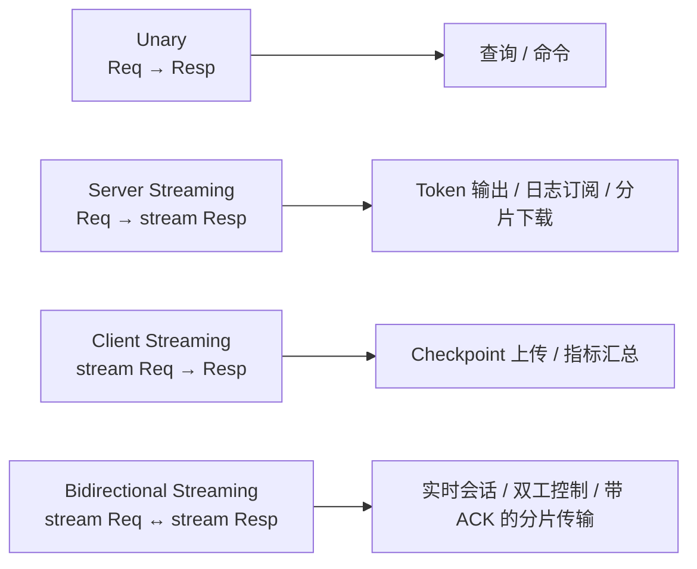
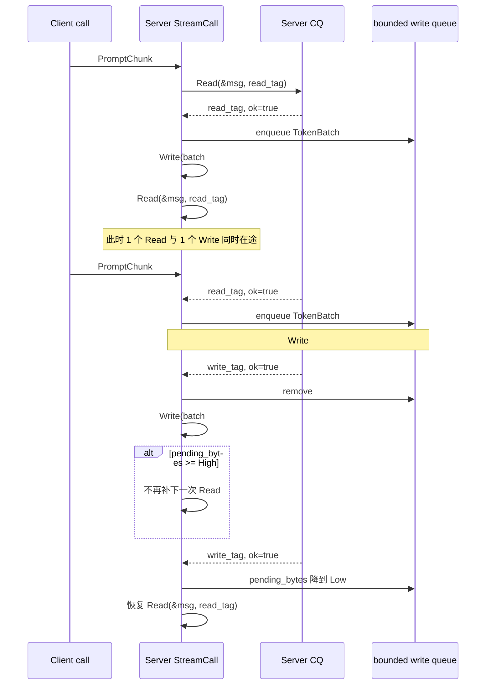
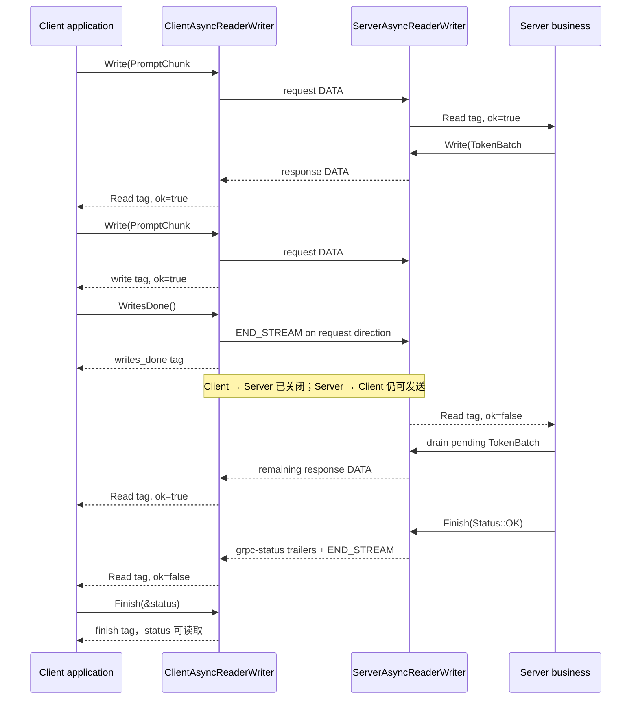

---
tags:
  - Linux
  - 网络编程基础
  - 应用层协议
  - RPC
  - gRPC
  - StreamingRPC
  - CompletionQueue
  - HTTP2
  - 流控
  - 背压
aliases:
  - gRPC Streaming RPC
  - gRPC 双向流
  - gRPC Flow Control
  - gRPC Backpressure
阅读次数: 0
---

# 18.8 gRPC 流式 RPC 与背压流控 (Streaming RPC & Flow Control)

[[18.2 gRPC]] 建立了 IDL、protobuf、HTTP/2 与 Unary RPC 的整体模型；[[18.5 gRPC Completion Queue：异步 Add RPC]] 又把一次 Unary 调用拆成 `Request → Finish → CQ tag` 的异步生命周期。本篇继续处理更接近生产环境的问题：**一次 RPC 不再只有一问一答，而是在同一个调用中持续收发多条消息。**

这会立刻引出三个 Unary 示例里不明显的问题：

1. `Read()` 和 `Write()` 可以同时在途，CQ tag 的返回顺序不固定，单一线性状态枚举不再够用；
2. HTTP/2 有自己的流量窗口，但它只能保护传输层缓冲，不能替应用决定队列上限、丢弃策略或业务确认；
3. 客户端调用 `WritesDone()` 只关闭**客户端到服务端**的写方向，服务端仍可继续返回消息，最终状态还要通过 `Finish()` 获取。

> [!note] API 范围与版本
> 本篇使用 **C++17、Linux、gRPC C++ Completion Queue API**。截至 2026-08-30，gRPC C++ 官方最佳实践更推荐新项目使用 Callback API；这里仍选择 CQ，是为了延续 [[18.5 gRPC Completion Queue：异步 Add RPC]]，把 tag、并发操作和对象生命周期完整展开。具体接口应以项目实际安装版本的 `grpcpp` 头文件为准。[^grpc-cpp-best]

---

## 1. 四种 RPC 形态不是四个语法糖



| 形态 | `.proto` | 谁持续写 | 常见结束条件 |
|---|---|---|---|
| Unary | `rpc F(Req) returns (Resp)` | 双方各 1 条 | 单条请求与单条响应完成 |
| 服务端流 | `rpc F(Req) returns (stream Resp)` | 服务端 | 服务端写完并返回状态 |
| 客户端流 | `rpc F(stream Req) returns (Resp)` | 客户端 | 客户端半关闭后，服务端返回单条结果 |
| 双向流 | `rpc F(stream Req) returns (stream Resp)` | 双方 | 两个方向按各自协议结束 |

双向流的两个消息方向彼此独立，并且各自保持发送顺序。应用可以“先收完再回”、交替读写，也可以让两个方向持续并行。[^grpc-core]

> [!tip] AI Token 输出不一定需要双向流
> 单次 prompt 发出后只持续接收 token，**服务端流**通常已经足够。只有当客户端还要在生成过程中继续发送音频帧、prompt 增量、工具结果、控制命令或业务 credit 时，双向流才真正有价值。

---

## 2. 双向流的正确心智模型：一个 RPC，两个独立方向

不要把 Bidirectional Streaming 想成“循环调用很多次 Unary”。更准确的模型是：

```text
一个 gRPC call / 一个 HTTP/2 stream
├── client → server：0..N 条请求消息，最后由客户端 half-close
└── server → client：0..M 条响应消息，最后由服务端 status/trailers 结束
```

在 C++ 异步流式 API 中，有两个必须同时成立的不变量：

- 同一条流上，**最多只能有 1 个 `Read` 在途**；
- 同一条流上，**最多只能有 1 个 `Write` 在途**；
- 但 1 个 `Read` 与 1 个 `Write` 可以同时在途。

因此，下面这种 Unary 风格的单状态机容易出错：

```cpp
// 错误方向：一个 state_ 无法表达“Read 和 Write 同时在途”。
enum class State {
    Reading,
    Writing,
    Finishing,
};
```

真实状态至少是两个正交维度：

```text
读方向：Idle / ReadInFlight / Paused / Closed
写方向：Idle / WriteInFlight / Draining / Closed
调用：Accepting / Active / FinishInFlight / Retired
```

这也是为什么双向流需要为 `Accept`、`Read`、`Write`、`WritesDone`、`Finish` 使用**不同且稳定的 tag**，而不是把整个 `CallData*` 当成无法区分操作种类的单一 tag。

---

## 3. 教学协议：流式上传 prompt，流式返回 token batch

下面的接口故意保持简单：每个 `PromptChunk` 都带一个业务序号，服务端可以持续返回 `TokenBatch`。客户端发送最后一个 prompt 分片后调用 `WritesDone()`，不再额外发送“EOF 消息”。

```proto
syntax = "proto3";

package streamdemo;

service Inference {
  rpc StreamGenerate(stream PromptChunk) returns (stream TokenBatch);
}

message PromptChunk {
  uint64 sequence = 1;
  bytes data = 2;
}

message TokenBatch {
  uint64 sequence = 1;
  repeated string tokens = 2;
  bool final_batch = 3;
}
```

这里要区分两种“结束”：

- **RPC 生命周期结束**：客户端再也不会发送消息，使用 `WritesDone()`；
- **RPC 内一个逻辑回合结束**：流还要继续复用，应在 protobuf 中定义 `turn_end`、`request_id` 或 `oneof control`，不能每回合都调用 `WritesDone()`。

`sequence` 不是 HTTP/2 stream ID。它是业务层字段，可用于关联、去重、确认或恢复；HTTP/2 stream ID 只在当前连接内标识这次调用，不能替代业务协议。

---

## 4. CQ tag 设计：先让每个完成事件可辨认

### 4.1 操作 tag

```cpp
#include <cstddef>
#include <cstdint>
#include <deque>
#include <iostream>
#include <memory>
#include <optional>
#include <string>
#include <unordered_map>
#include <utility>

#include <grpcpp/grpcpp.h>

#include "streaming.grpc.pb.h"

class StreamCall;

// 注册表的完整声明必须先于 StreamCall 的成员函数定义，
// 这样 OnAccept() 才能合法调用 owner_.CreateListener()。
// 析构函数放到 StreamCall 完整定义之后实现，以安全持有 unique_ptr<StreamCall>。
class StreamRegistry final {
public:
    StreamRegistry(streamdemo::Inference::AsyncService& service,
                   grpc::ServerCompletionQueue& cq);
    ~StreamRegistry();

    StreamRegistry(const StreamRegistry&) = delete;
    StreamRegistry& operator=(const StreamRegistry&) = delete;

    void CreateListener();
    void Dispatch(void* raw_tag, bool ok);

private:
    streamdemo::Inference::AsyncService& service_;
    grpc::ServerCompletionQueue& cq_;
    std::unordered_map<StreamCall*, std::unique_ptr<StreamCall>> calls_;
};

enum class ServerOp {
    Accept,
    Read,
    Write,
    Finish,
};

struct ServerTag {
    StreamCall* call{};  // 非 owning：真正所有权在 StreamRegistry。
    ServerOp op{};       // 明确本次 CQ completion 属于哪种操作。
};

struct QueuedBatch {
    streamdemo::TokenBatch message;
    std::size_t bytes{};
};
```

每个 `ServerTag` 都是 `StreamCall` 的成员，因此只要调用对象仍由注册表持有，tag 地址就稳定。CQ 返回 tag 后，dispatcher 先找回 `StreamCall`，再按 `op` 分发。

### 4.2 为什么不能在 `Finish` tag 前释放对象

一次流式调用长期持有：

```text
ServerContext
ServerAsyncReaderWriter
Read 的目标消息
写队列与水位计数
所有 operation tags
最终 grpc::Status
```

`Read()` 的目标对象会在未来由 runtime 填充，所以必须活到对应 Read tag 返回。当前 gRPC C++ 异步 `Write()` 的头文件说明 runtime 不保留源消息引用，调用返回后即可释放源对象；本例仍把当前写消息保留到 Write tag 返回，使“队列字节何时扣减”与“写操作何时完成”保持同一条清晰规则。[^grpc-async-stream]

---

## 5. 服务端 StreamCall：一个 Read 与一个 Write 交叉驱动

下面的实现使用**单个 CQ 轮询线程**。这样同一个 `StreamCall` 的 tag 虽然返回顺序不确定，但状态修改仍被 dispatcher 串行化。若多个线程同时轮询同一个 CQ，必须再给每个 call 加互斥或 strand，不能让 `OnRead()` 与 `OnWrite()` 并发修改同一队列。

### 5.1 状态与不变量

```cpp
class StreamCall final {
public:
    StreamCall(streamdemo::Inference::AsyncService& service,
               grpc::ServerCompletionQueue& cq,
               StreamRegistry& owner);

    void StartAccept();

    // 返回 true 表示所有异步操作已经结束，注册表可以删除本对象。
    [[nodiscard]] bool OnEvent(ServerOp op, bool ok);

private:
    static constexpr std::size_t kHighWatermarkBytes = 4U * 1024U * 1024U;
    static constexpr std::size_t kLowWatermarkBytes = 1U * 1024U * 1024U;

    void OnAccept(bool ok);
    void OnRead(bool ok);
    void OnWrite(bool ok);

    void IssueRead();
    void EnqueueBatch(streamdemo::TokenBatch batch);
    void MaybeStartWrite();
    void MaybeResumeRead();
    void MaybeFinish();
    void AbortTransport(std::string reason);

    [[nodiscard]] streamdemo::TokenBatch
    BuildBatch(const streamdemo::PromptChunk& input) const;

    streamdemo::Inference::AsyncService& service_;
    grpc::ServerCompletionQueue& cq_;
    StreamRegistry& owner_;

    grpc::ServerContext context_;
    grpc::ServerAsyncReaderWriter<streamdemo::TokenBatch,
                                  streamdemo::PromptChunk> stream_;

    streamdemo::PromptChunk read_message_;
    std::deque<QueuedBatch> pending_writes_;
    std::optional<QueuedBatch> active_write_;
    std::size_t pending_bytes_{};  // active + queued 的序列化大小估计。

    bool read_in_flight_{};
    bool read_paused_{};
    bool read_side_done_{};
    bool stop_reading_{};
    bool write_in_flight_{};
    bool finish_in_flight_{};

    grpc::Status final_status_{grpc::Status::OK};

    ServerTag accept_tag_{this, ServerOp::Accept};
    ServerTag read_tag_{this, ServerOp::Read};
    ServerTag write_tag_{this, ServerOp::Write};
    ServerTag finish_tag_{this, ServerOp::Finish};
};
```

关键不变量：

```text
read_in_flight_  == true  → 不得再次调用 Read()
write_in_flight_ == true  → 不得再次调用 Write()
finish_in_flight_ == true → 不得再启动 Read/Write/Finish
调用 Finish() 前          → 读、写操作都已退出在途状态
```

### 5.2 接受新调用并补充 listener

```cpp
StreamCall::StreamCall(
    streamdemo::Inference::AsyncService& service,
    grpc::ServerCompletionQueue& cq,
    StreamRegistry& owner)
    : service_(service),
      cq_(cq),
      owner_(owner),
      stream_(&context_) {}

void StreamCall::StartAccept() {
    service_.RequestStreamGenerate(
        &context_,
        &stream_,
        &cq_,
        &cq_,
        &accept_tag_);
}

void StreamCall::OnAccept(bool ok) {
    if (!ok) {
        // 常见于 server / CQ 正在关闭；不再对该 listener 启动任何操作。
        return;
    }

    // 当前 listener 已经绑定一个真实 RPC，先补下一名 listener，
    // 避免处理当前调用期间没有对象等待新连接。
    owner_.CreateListener();

    // 双向流一旦接受，就可以让一个 Read 在途；后续 Write 可独立启动。
    IssueRead();
}
```

这与 [[18.5 gRPC Completion Queue：异步 Add RPC]] 的“先补 listener，再处理当前调用”是同一规则。区别是当前调用不会马上 `Finish()`，而会长期维护两个方向的操作。

### 5.3 Read 完成：生产响应并按水位决定是否继续读

```cpp
void StreamCall::IssueRead() {
    if (read_in_flight_ || read_paused_ || read_side_done_ ||
        stop_reading_ || finish_in_flight_) {
        return;
    }

    read_message_.Clear();
    read_in_flight_ = true;
    stream_.Read(&read_message_, &read_tag_);
}

streamdemo::TokenBatch StreamCall::BuildBatch(
    const streamdemo::PromptChunk& input) const {
    streamdemo::TokenBatch batch;
    batch.set_sequence(input.sequence());

    // 教学占位逻辑必须保持短小、非阻塞。
    // 真实模型推理、磁盘写入或压缩工作应送入有界 worker 队列，
    // 完成后再回到该 call 的串行执行上下文入队响应。
    batch.add_tokens("accepted");
    batch.add_tokens(std::to_string(input.data().size()) + "B");
    return batch;
}

void StreamCall::OnRead(bool ok) {
    read_in_flight_ = false;

    if (!ok) {
        // 正常情况下表示客户端已经 WritesDone；调用失败或取消也可能
        // 让 Read 返回 ok=false，因此不能仅凭这一位断言 RPC 成功。
        read_side_done_ = true;

        // 不在这里凭空制造“最终业务消息”。如果协议需要 final_batch，
        // 应由真实业务状态决定，并在读方向结束前或 worker 完成后显式入队。
        // 这里仅排空已经产生的响应，然后发送最终 grpc::Status。
        MaybeStartWrite();
        MaybeFinish();
        return;
    }

    // 如果此前因传输错误请求终止，当前 Read 可能与取消发生竞态而仍成功。
    // 此时不再处理或继续发起 Read，只等待安全 Finish。
    if (stop_reading_) {
        read_side_done_ = true;
        read_message_.Clear();
        MaybeFinish();
        return;
    }

    EnqueueBatch(BuildBatch(read_message_));
    read_message_.Clear();

    // Read completion 可以启动 Write；若此前已有 Write 在途，
    // MaybeStartWrite() 只把消息留在有界队列中。
    MaybeStartWrite();

    // EnqueueBatch() 可能把队列推过高水位。只有未暂停时才补下一次 Read。
    IssueRead();
}
```

`ok=false` 在服务端读方向上表达“再也读不到下一条消息”，但原因可能是有序 half-close、取消、deadline 或传输失败。业务若必须准确区分，应结合最终状态、`ServerContext` 的取消通知与自己的协议状态，而不是把所有 `Read(false)` 都当成功 EOF。

### 5.4 写队列：高水位暂停，低水位恢复

```cpp
void StreamCall::EnqueueBatch(streamdemo::TokenBatch batch) {
    const std::size_t bytes = batch.ByteSizeLong();
    pending_bytes_ += bytes;
    pending_writes_.push_back(QueuedBatch{std::move(batch), bytes});

    if (pending_bytes_ >= kHighWatermarkBytes) {
        read_paused_ = true;
    }
}

void StreamCall::MaybeStartWrite() {
    if (write_in_flight_ || pending_writes_.empty() ||
        finish_in_flight_) {
        return;
    }

    active_write_.emplace(std::move(pending_writes_.front()));
    pending_writes_.pop_front();

    write_in_flight_ = true;
    stream_.Write(active_write_->message, &write_tag_);
}

void StreamCall::MaybeResumeRead() {
    if (read_paused_ && !read_side_done_ && !stop_reading_ &&
        pending_bytes_ <= kLowWatermarkBytes) {
        read_paused_ = false;
        IssueRead();
    }
}

void StreamCall::OnWrite(bool ok) {
    write_in_flight_ = false;

    if (active_write_) {
        if (active_write_->bytes <= pending_bytes_) {
            pending_bytes_ -= active_write_->bytes;
        } else {
            pending_bytes_ = 0;  // 防御性保护；正常状态不应进入该分支。
        }
        active_write_.reset();
    }

    if (!ok) {
        AbortTransport("peer stopped accepting response messages");
        return;
    }

    // 写完一条后先继续排空队列；如果积压已下降到 Low，再恢复 Read。
    MaybeStartWrite();
    MaybeResumeRead();
    MaybeFinish();
}
```

高、低两个水位形成**滞回（hysteresis）**：

```text
pending >= High → 暂停补 Read
pending <= Low  → 恢复补 Read
```

如果只使用一个阈值，队列会在临界点附近频繁暂停和恢复。水位应同时按**字节数、消息数和最老消息等待时间**监控；只按消息数会忽略单条消息大小差异，只按字节数又可能忽略大量小对象的管理开销。

> [!warning] 不再调用 `Read()` 不是绝对内存硬上限
> gRPC runtime、HTTP/2、TLS、TCP 和内核 socket 可能已经缓存了在途数据。应用还应配置单消息大小限制、总队列预算、并发流数量和 admission control。水位控制的是“继续扩大应用工作集的速度”，不是让所有下层缓冲瞬间归零。

### 5.5 传输失败与 Finish

```cpp
void StreamCall::AbortTransport(std::string reason) {
    final_status_ = grpc::Status(
        grpc::StatusCode::CANCELLED,
        std::move(reason));

    stop_reading_ = true;
    read_paused_ = false;

    // 丢弃尚未提交给 gRPC 的业务响应，防止无界积压继续存在。
    pending_writes_.clear();
    pending_bytes_ = active_write_ ? active_write_->bytes : 0;

    if (read_in_flight_) {
        // 让尚在途的 Read 尽快返回 tag；对象仍保留到它真正完成。
        context_.TryCancel();
    } else {
        read_side_done_ = true;
    }

    MaybeFinish();
}

void StreamCall::MaybeFinish() {
    if (finish_in_flight_ || !read_side_done_ ||
        write_in_flight_ || !pending_writes_.empty()) {
        return;
    }

    finish_in_flight_ = true;
    stream_.Finish(final_status_, &finish_tag_);
}

bool StreamCall::OnEvent(ServerOp op, bool ok) {
    switch (op) {
    case ServerOp::Accept:
        OnAccept(ok);
        return !ok;

    case ServerOp::Read:
        OnRead(ok);
        return false;

    case ServerOp::Write:
        OnWrite(ok);
        return false;

    case ServerOp::Finish:
        // 本设计只在没有 Read/Write 在途时调用 Finish，
        // 因而 Finish tag 返回后可以安全移除整个 call。
        return true;
    }

    return true;
}
```

服务端异步流的 `Finish()` 不应与其他操作并发。本实现只有在：

```text
读方向已结束
AND 没有 Write 在途
AND 写队列为空
AND 尚未提交 Finish
```

时才调用它。这样 Finish tag 是对象的最后一个事件，注册表可以在它返回后释放 `ServerContext`、stream、消息和 tags。[^grpc-server-stream]

---

## 6. 注册表与 CQ dispatcher：所有权仍然必须明确

```cpp
StreamRegistry::StreamRegistry(
    streamdemo::Inference::AsyncService& service,
    grpc::ServerCompletionQueue& cq)
    : service_(service), cq_(cq) {}

// 此处 StreamCall 已经是完整类型，unique_ptr<StreamCall> 可以安全析构。
StreamRegistry::~StreamRegistry() = default;

void StreamRegistry::CreateListener() {
    auto call = std::make_unique<StreamCall>(service_, cq_, *this);
    StreamCall* raw = call.get();
    calls_.emplace(raw, std::move(call));
    raw->StartAccept();
}

void StreamRegistry::Dispatch(void* raw_tag, bool ok) {
    auto* tag = static_cast<ServerTag*>(raw_tag);
    const auto it = calls_.find(tag->call);

    if (it == calls_.end()) {
        // 正常设计不应出现悬空 tag；实际程序应记录严重错误并终止。
        return;
    }

    if (it->second->OnEvent(tag->op, ok)) {
        calls_.erase(it);
    }
}
```

服务端事件循环只做 tag 解复用：

```cpp
StreamRegistry registry(service, *cq);
registry.CreateListener();

void* raw_tag = nullptr;
bool ok = false;

while (cq->Next(&raw_tag, &ok)) {
    registry.Dispatch(raw_tag, ok);
}
```

关停顺序仍然是：

```text
停止接收新业务
→ server->Shutdown(deadline)
→ cq->Shutdown()
→ 持续 Next()，直到返回 false
→ 最后销毁 registry / service / server
```

不能在调用 `cq->Shutdown()` 后立刻释放所有 call；队列中仍可能有 `Accept(false)`、`Read(false)`、`Write(false)` 或 `Finish` tag，需要完整 drain。[^grpc-async]

---

## 7. `Read()` 与 `Write()` 如何交叉驱动



图中最重要的不是固定顺序，而是约束：

- Read tag 先回来还是 Write tag 先回来都合法；
- 两个方向可以并行；
- 同一方向只能串行提交操作；
- 每次完成都可能改变另一方向是否继续推进。

这与 [[18.3 非阻塞 RPC：epoll + 状态机]] 中“读事件生产响应、写完成释放输出缓冲、HighWaterMark 暂停输入”的结构是同一个问题，只是 epoll 事件被 CQ operation tag 替代。

---

## 8. HTTP/2 `WINDOW_UPDATE`：它解决什么，不解决什么

![[3_18_18_8_1.svg|1240]]

标准 gRPC over HTTP/2 把一条 RPC 映射到一个 HTTP/2 stream；连续的 gRPC length-prefixed messages 被放进 DATA frame，**DATA frame 边界与 gRPC message 边界没有一一对应关系**。客户端请求方向的结束最终由 HTTP/2 `END_STREAM` 表达。[^grpc-http2]

### 8.1 两级窗口

HTTP/2 同时维护：

| 窗口 | 作用域 | 耗尽后的影响 |
|---|---|---|
| stream window | 单个 HTTP/2 stream | 当前 RPC 的 DATA 不能继续发送 |
| connection window | 整条 HTTP/2 connection | 该连接上所有 streams 的 DATA 都受限制 |

发送端能继续发送的 DATA 字节数受两个窗口共同限制：

$$
Sendable \le \min(W_{stream}, W_{connection})
$$

接收端消费数据并释放缓冲后，发送 `WINDOW_UPDATE` 增加信用：

- `stream_id != 0`：更新指定 stream；
- `stream_id == 0`：更新整个 connection。

RFC 9113 的初始默认窗口是 65,535 octets，但端点可以通过 SETTINGS 和 `WINDOW_UPDATE` 调整；具体 gRPC 实现可能使用不同调优值，不能把 65,535 当作应用固定常量。HTTP/2 规定只有 DATA frame 消耗流控窗口，HEADERS、WINDOW_UPDATE 等控制帧不消耗该信用。[^rfc9113]

### 8.2 `WINDOW_UPDATE` 不是业务 ACK

收到窗口更新只能说明：

```text
接收端 HTTP/2 / gRPC transport 又愿意接收更多字节
```

它不能证明：

```text
token 已渲染给用户
checkpoint 分片已经 fsync
指标已经聚合入库
远端业务事务已经提交
```

同理，Write tag 返回也不能证明对端业务已经处理。gRPC 官方流控说明明确提醒：把值写入 stream，只表示它已经交给框架处理缓冲和发送，并不等于已经到达或被对端消费。[^grpc-flow]

需要端到端完成语义时，必须把 ACK 设计进业务协议，例如：

```proto
message CheckpointAck {
  uint64 shard_id = 1;
  bytes checksum = 2;
  bool durable = 3;
}
```

只有接收端在校验、落盘并完成要求的持久化步骤后返回该 ACK，发送端才能把对应 shard 从重试窗口中移除。这个思想与消息系统“处理完成后再确认”相同。[^ddia-ack]

---

## 9. 三层背压：传输流控不能替代应用水位

### 9.1 第 1 层：HTTP/2 transport flow control

作用：避免某一方无限向对端 transport 缓冲灌 DATA。

局限：

- 只看字节信用，不理解业务成本；
- 不知道一条 1 KiB 消息会触发 1 μs 还是 10 s 的计算；
- 不知道消息能否丢弃、合并或降采样；
- 不表示业务完成。

### 9.2 第 2 层：gRPC 操作门禁

C++ CQ API 通过“同一方向最多一个操作在途”限制调用方式。它防止多个 `Write()` 无序叠加，却不会自动限制你自己在 `std::deque` 中积累多少待写消息。

因此下面的代码仍然会 OOM：

```cpp
// 错误：生产速度长期大于网络发送速度，pending 没有上限。
for (;;) {
    pending.push_back(ProduceAnotherReply());
}
```

### 9.3 第 3 层：应用有界队列与生产速率

应用必须定义：

```text
High / Low watermark
最大消息数
最大总字节数
最大排队年龄
超限策略
恢复条件
```

常见超限策略取决于语义：

| 场景 | 合理策略示例 |
|---|---|
| 大模型 token | 暂停/减慢解码，缩小 batch；通常不能静默丢 token |
| Checkpoint 分片 | 限制 in-flight shard；超时重试；必须校验与业务 ACK |
| 日志 | 可按级别采样、丢弃低优先级或落盘缓冲 |
| 监控指标 | 合并最新值、聚合、降采样；避免逐条无限排队 |
| 控制命令 | 通常拒绝或超时，不应让陈旧命令排很久后再执行 |

《Designing Data-Intensive Applications》把慢消费者下的选择概括为：丢弃、缓冲或施加背压；缓冲必须是有界的，否则只是把故障推迟成内存或磁盘耗尽。[^ddia-backpressure]

---

## 10. 客户端 `WritesDone()`：只关闭写半边

客户端异步双向流的关键接口是：

```cpp
std::unique_ptr<grpc::ClientAsyncReaderWriter<
    streamdemo::PromptChunk,
    streamdemo::TokenBatch>> stream;
```

正常生命周期：

```text
PrepareAsyncStreamGenerate
→ StartCall
→ Read 与 Write 可交叉
→ 最后一个 Write tag 返回
→ WritesDone
→ 继续 Read，直到 Read tag 的 ok=false
→ Finish 获取 grpc::Status
```

### 10.1 客户端操作 tag

```cpp
class BidiClientCall;

enum class ClientOp {
    Start,
    Read,
    Write,
    WritesDone,
    Finish,
};

struct ClientTag {
    BidiClientCall* call{};
    ClientOp op{};
};
```

### 10.2 最小完整状态机

```cpp
#include <chrono>
#include <deque>
#include <memory>
#include <optional>
#include <utility>

class BidiClientCall final {
public:
    using Stub = streamdemo::Inference::Stub;

    BidiClientCall(Stub& stub,
                   grpc::CompletionQueue& cq,
                   std::deque<streamdemo::PromptChunk> inputs)
        : stub_(stub), cq_(cq), inputs_(std::move(inputs)) {}

    void Start() {
        context_.set_deadline(
            std::chrono::system_clock::now() + std::chrono::seconds(30));

        stream_ = stub_.PrepareAsyncStreamGenerate(&context_, &cq_);
        stream_->StartCall(&start_tag_);
    }

    // 返回 true 表示 Finish tag 已返回，可释放本对象。
    [[nodiscard]] bool OnEvent(ClientOp op, bool ok) {
        switch (op) {
        case ClientOp::Start:
            OnStart(ok);
            return false;
        case ClientOp::Read:
            OnRead(ok);
            return false;
        case ClientOp::Write:
            OnWrite(ok);
            return false;
        case ClientOp::WritesDone:
            OnWritesDone(ok);
            return false;
        case ClientOp::Finish:
            ReportFinalStatus();
            return true;
        }
        return true;
    }

private:
    void OnStart(bool ok) {
        if (!ok) {
            write_side_done_ = true;
            read_side_done_ = true;
            MaybeFinish();
            return;
        }

        IssueRead();
        MaybeWriteOrHalfClose();
    }

    void IssueRead() {
        if (read_in_flight_ || read_side_done_ || finish_in_flight_) {
            return;
        }

        incoming_.Clear();
        read_in_flight_ = true;
        stream_->Read(&incoming_, &read_tag_);
    }

    void OnRead(bool ok) {
        read_in_flight_ = false;

        if (!ok) {
            read_side_done_ = true;
            MaybeFinish();
            return;
        }

        Consume(incoming_);
        incoming_.Clear();
        IssueRead();
    }

    void MaybeWriteOrHalfClose() {
        if (write_in_flight_ || writes_done_in_flight_ ||
            write_side_done_ || finish_in_flight_) {
            return;
        }

        if (!inputs_.empty()) {
            active_write_.emplace(std::move(inputs_.front()));
            inputs_.pop_front();

            write_in_flight_ = true;
            stream_->Write(*active_write_, &write_tag_);
            return;
        }

        // 只有最后一个 Write tag 已返回、队列为空时才 half-close。
        writes_done_in_flight_ = true;
        stream_->WritesDone(&writes_done_tag_);
    }

    void OnWrite(bool ok) {
        write_in_flight_ = false;
        active_write_.reset();

        if (!ok) {
            write_side_done_ = true;
            inputs_.clear();
            context_.TryCancel();
            MaybeFinish();
            return;
        }

        MaybeWriteOrHalfClose();
    }

    void OnWritesDone(bool ok) {
        writes_done_in_flight_ = false;
        write_side_done_ = true;

        if (!ok) {
            context_.TryCancel();
        }

        // 这里不能把 RPC 当作完成；接收方向可能还有很多 TokenBatch。
        MaybeFinish();
    }

    void MaybeFinish() {
        if (finish_in_flight_ || !write_side_done_ || !read_side_done_ ||
            write_in_flight_ || writes_done_in_flight_ || read_in_flight_) {
            return;
        }

        finish_in_flight_ = true;
        stream_->Finish(&status_, &finish_tag_);
    }

    void Consume(const streamdemo::TokenBatch& batch) {
        std::cout << "batch sequence=" << batch.sequence()
                  << ", tokens=" << batch.tokens_size()
                  << ", final=" << std::boolalpha
                  << batch.final_batch() << '\n';
    }

    void ReportFinalStatus() const {
        if (!status_.ok()) {
            std::cerr << "StreamGenerate failed: code="
                      << status_.error_code()
                      << ", message=" << status_.error_message() << '\n';
        }
    }

    Stub& stub_;
    grpc::CompletionQueue& cq_;
    grpc::ClientContext context_;
    grpc::Status status_;

    std::unique_ptr<grpc::ClientAsyncReaderWriter<
        streamdemo::PromptChunk,
        streamdemo::TokenBatch>> stream_;

    std::deque<streamdemo::PromptChunk> inputs_;
    std::optional<streamdemo::PromptChunk> active_write_;
    streamdemo::TokenBatch incoming_;

    bool read_in_flight_{};
    bool read_side_done_{};
    bool write_in_flight_{};
    bool writes_done_in_flight_{};
    bool write_side_done_{};
    bool finish_in_flight_{};

    ClientTag start_tag_{this, ClientOp::Start};
    ClientTag read_tag_{this, ClientOp::Read};
    ClientTag write_tag_{this, ClientOp::Write};
    ClientTag writes_done_tag_{this, ClientOp::WritesDone};
    ClientTag finish_tag_{this, ClientOp::Finish};
};
```

这个示例预先准备输入队列，因此不需要解决“业务线程如何安全唤醒 CQ 所有者”的问题。真实交互式客户端若从其他线程持续加入消息，至少还要：

- 用互斥保护生产队列；
- 用 `grpc::Alarm`、eventfd 或自己的 executor 把“有新数据”投递回串行状态机；
- 确保外部线程不直接与 CQ 线程同时修改 call 状态；
- 让关闭请求与最后一个 Write completion 正确排序。

### 10.3 `WritesDone` 的三个常见误解

| 误解 | 正确语义 |
|---|---|
| `WritesDone` 会关闭整个 RPC | 只 half-close 客户端写方向 |
| `WritesDone` tag 返回就是 RPC 成功 | 只是该写半关闭操作完成；最终结果看 `Finish` 的 status |
| 调用后就不用再 `Read` | 服务端仍可继续写，客户端应读到 `ok=false` |

C++ API 明确把 `WritesDone()` 定义为客户端流的 half-close，并允许它与 `Read()` 并行。[^grpc-writes-done]

---

## 11. 半关闭的完整时序



在线路上，如果客户端没有剩余 DATA，但要结束请求方向，gRPC over HTTP/2 会发送带 `END_STREAM` 的空 DATA frame。这个动作与 TCP 连接的 `shutdown(SHUT_WR)` 类似：本端不再发送，但仍可以继续接收。[^grpc-http2][^unp-half-close]

> [!important] Half-close 不等于 graceful business completion
> TCP FIN、HTTP/2 END_STREAM、`WritesDone()` 都只描述一个传输方向不再产生字节。若业务要求“最后一片已校验并持久化”，仍然需要业务 ACK 或最终结果字段。

---

## 12. 防止流式死锁：双方都写、不读最危险

gRPC 官方流控文档提醒：如果双方使用同步读写或手动流控，并且都大量写入却不读取，可能互相等待而死锁。[^grpc-flow]

典型错误：

```text
客户端：先连续写 10 GiB，再开始 Read
服务端：先连续写 10 GiB，再开始 Read
```

双方的 stream / connection window 与缓冲都可能耗尽，于是：

```text
客户端 Write 等服务端 Read
服务端 Write 等客户端 Read
双方都不推进 Read
```

CQ 版本的基本防线是：

- 调用接受后尽早保持一个 `Read` 在途；
- 一个 `Write` 在途时仍允许另一方向继续 `Read`；
- 队列达到 High 时只暂停生产性读取，不阻塞 CQ 线程；
- 不在 CQ handler 中做长时间计算、磁盘 I/O 或等待条件变量；
- 对必须等待对端动作的协议设置 deadline / idle timeout / progress timeout。

---

## 13. 可观测性：看窗口之前，先看自己的积压

高层 gRPC C++ API 通常不会直接给业务代码一个稳定的“当前 HTTP/2 stream window”指标。生产系统应先暴露自己真正能控制的量：

| 指标 | 用途 |
|---|---|
| `stream_in_messages_total` / `stream_out_messages_total` | 观察消息速率 |
| `stream_in_bytes_total` / `stream_out_bytes_total` | 观察字节速率 |
| `pending_write_messages` | 待写消息数 |
| `pending_write_bytes` | 当前业务输出积压 |
| `pending_write_oldest_seconds` | 排队延迟是否失控 |
| `read_paused` / `read_paused_seconds` | 背压是否持续生效 |
| `grpc_write_completion_seconds` | 写操作完成延迟 |
| `application_ack_lag` | 端到端业务落后量 |
| `grpc_status_code` | 调用最终结果 |
| deadline / cancellation / peer | 生命周期与故障定位 |

Linux 侧还可以用 `ss -tiepm`、`netstat` 或 eBPF 观察 socket 的 `Recv-Q`、`Send-Q`、RTT、重传和内存，但它们是**连接级**信息。一个 HTTP/2 connection 可能复用多条 RPC stream，socket 队列不能直接告诉你是哪一个 RPC 的业务队列在积压。UNP 与 TLPI 对 `Recv-Q`、`Send-Q` 的含义有明确说明；《Linux 多线程服务端编程》也把持续增长的队列视为服务端阻塞、对端过慢或网络故障的预警信号。[^unp-queues][^tlpi-netstat][^muduo-queues]

---

## 14. 生产设计：不同业务不能共用同一种背压策略

### 14.1 AI Token 与实时音频

- 单向 token 输出优先考虑 Server Streaming；
- 实时语音、prompt 增量、工具结果回传适合 Bidi Streaming；
- 对输出队列设字节和时间水位，避免慢客户端拖住模型会话；
- 慢到超过预算时，明确取消会话或降低生成速率，不能无限缓存 token；
- “已发送 token”不等于用户已显示或消费，确有需要时增加客户端 progress ACK。

### 14.2 分布式 Checkpoint

- 大分片不要仅依赖 Write completion；
- 每个 shard 带 ID、offset、长度、checksum；
- 限制未确认 shard 数量和总字节；
- 接收端完成校验与要求的持久化后再 ACK；
- 重连后按已确认位置恢复，避免整流重传；
- 超大对象还应评估对象存储、RDMA 或专用数据面，gRPC 负责控制与元数据。

### 14.3 日志与监控指标

- 日志可按级别丢弃或转本地持久队列；
- gauge 可合并为最新值，counter 可批量聚合；
- 不可丢审计事件需要单独持久化与确认路径；
- 过载时优先保护服务本身，避免“为了不丢监控而拖垮业务”。

---

## 15. 常见错误

### 15.1 每个 Read completion 都无条件继续 `Read()`

如果业务输出已经积压，继续读只会把更多工作带入进程。应根据有界队列水位决定是否补下一次 Read。

### 15.2 同时提交两个 `Write()`

同一 stream 最多一个 Write 在途。第二次 Write 必须等第一次 write tag 返回后再提交。

### 15.3 用一个 `CallData*` tag 却不记录操作种类

双向流中 Read 和 Write tag 可交错返回。必须能区分事件，否则状态机会把写完成误当读完成。

### 15.4 在 CQ handler 中执行模型推理或阻塞 I/O

CQ 轮询线程是事件推进器，不是工作线程。长任务会拖住其他流的完成事件，形成队头阻塞。

### 15.5 把 Write completion 当成 peer ACK

它不是“对端业务已经处理”。端到端确认必须由业务消息表达。

### 15.6 `WritesDone()` 后立刻销毁 client call

服务端可能还在返回消息，Finish status 也尚未到达。必须继续 Read，并等 Finish tag。

### 15.7 服务端在 Read/Write 在途时直接删除对象

CQ 之后仍会返回携带旧 tag 的事件，造成 use-after-free。所有在途操作都必须被 drain。

### 15.8 只有 High，没有 Low

单阈值会在边界处频繁启停。High/Low 滞回可以稳定控制。

### 15.9 只看 HTTP/2 窗口，不看应用队列

窗口不了解业务计算、落盘和确认成本。真正的 OOM 往往发生在应用自己的 pending queue。

### 15.10 把 half-close 当成取消

`WritesDone()` 是有序结束写方向；`TryCancel()`、deadline 与连接故障是异常终止。它们的最终状态和清理策略不同。

---

## 16. 面试与自测

> [!question]- 为什么双向流不能只用一个 `Reading/Writing/Finishing` 状态枚举？
> 因为一个 Read 与一个 Write 可以同时在途，且 tag 返回顺序不固定。状态是两个方向的组合，而不是单一线性阶段。

> [!question]- C++ CQ 流式 API 允许多少个并发操作？
> 同一 stream 最多一个 Read 和一个 Write 在途；Read 与 Write 可以互相并行。`Finish` 应在其他操作退出后提交。

> [!question]- `WINDOW_UPDATE` 表示对端已经处理了消息吗？
> 不表示。它只补充 HTTP/2 字节信用，说明接收端 transport 又有容量。业务处理完成需要应用 ACK。

> [!question]- 为什么 High/Low 水位要分开？
> 为了形成滞回，避免队列在单一阈值附近高频暂停和恢复。

> [!question]- 客户端 `WritesDone()` 后还能收到服务端消息吗？
> 能。它只关闭 client→server 方向，server→client 方向持续到服务端 Finish 和客户端读到 EOF。

> [!question]- 服务端 `Read` tag 的 `ok=false` 一定是正常 half-close 吗？
> 不一定。取消、deadline 或传输故障也可能终止读取，必须结合最终 status 和取消通知判断。

> [!question]- 暂停调用 `Read()` 是否能严格限制全部内存？
> 不能。runtime、HTTP/2、TLS、TCP 和内核中可能已有在途缓冲；还需单消息限制、总预算和并发准入。

> [!question]- 为什么一个慢 stream 可能影响同连接的其他 RPC？
> HTTP/2 除 stream window 外还有 connection window。若连接级信用耗尽，该连接上其他 DATA 也会受限。

---

## 17. 关键要点

1. Streaming RPC 是一条长期调用，不是很多次 Unary 的语法包装。
2. Bidirectional Streaming 包含两个独立、有序的消息方向。
3. C++ CQ 中最多一个 Read 与一个 Write 在途，但二者可以同时存在。
4. Read/Write tag 可交错返回，必须使用可区分操作种类的稳定 tag。
5. HTTP/2 用 stream window 与 connection window 约束 DATA 字节。
6. `WINDOW_UPDATE`、Write completion、业务 ACK 是三种不同层次的“完成”。
7. gRPC transport flow control 不能替应用决定队列上限与过载策略。
8. 应用至少维护 High/Low、水量、消息数和最老排队时间。
9. `WritesDone()` 只 half-close 客户端写方向；客户端仍要继续 Read 并最终 Finish。
10. Finish tag 与 CQ drain 才是异步对象安全释放的边界。

---

## 18. 与相邻笔记的关系

- [[18.1 RPC 协议模板]]：理解业务消息、请求关联、错误边界与端到端确认为什么不能交给 TCP。
- [[18.2 gRPC]]：理解 `.proto`、四种 RPC 形态、protobuf 与 gRPC over HTTP/2。
- [[18.3 非阻塞 RPC：epoll + 状态机]]：对照输入事件、输出缓冲、写完成与高水位回调。
- [[18.5 gRPC Completion Queue：异步 Add RPC]]：本篇直接复用 CQ tag、listener 补充、注册表所有权与 drain shutdown。
- [[18.6 io_uring 非阻塞 RPC]]：比较内核 I/O completion 与 gRPC operation completion 的语义边界。
- [[18.7 RDMA Verbs 与 CQ 非阻塞 RPC]]：比较 gRPC CQ 与 RDMA CQ；二者都有完成事件，但资源、传输与确认语义不同。

---

## 参考资料

### 教材与项目 Sources

- W. Richard Stevens, Bill Fenner, Andrew M. Rudoff, *UNIX Network Programming, Volume 1: The Sockets Networking API*, 3rd ed.：Section 2.11 “Buffer Sizes and Limitations”、Section 6.7 `shutdown` 与 half-close、socket 队列与 TCP 流控相关章节。[^unp-half-close]
- Michael Kerrisk, *The Linux Programming Interface*, Chapter 61 “Sockets: Advanced Topics”，Section 61.7 `netstat` 的 `Recv-Q` / `Send-Q` 解释。[^tlpi-netstat]
- 陈硕，《Linux 多线程服务端编程：使用 muduo C++ 网络库》：Section 6.4.1 “TCP 网络编程本质论”、Section 7.4.2 “为什么 non-blocking 网络编程中应用层 buffer 是必需的”、Section 8.9 的 WriteComplete / HighWaterMark 设计。[^muduo-buffer]
- Martin Kleppmann, *Designing Data-Intensive Applications*, Chapter 11 “Stream Processing”：慢消费者下的 dropping、buffering、backpressure，以及处理完成后的 acknowledgment。[^ddia-backpressure]

### 官方规范与文档

- gRPC, *Core concepts, architecture and lifecycle*，访问日期：2026-08-30。[^grpc-core]
- gRPC, *C++ Best Practices*，访问日期：2026-08-30。[^grpc-cpp-best]
- gRPC, *Asynchronous-API tutorial — C++*，访问日期：2026-08-30。[^grpc-async]
- gRPC, *Flow Control*，访问日期：2026-08-30。[^grpc-flow]
- gRPC C++ API / `include/grpcpp/support/async_stream.h`，访问日期：2026-08-30。[^grpc-async-stream]
- gRPC, *gRPC over HTTP/2*，访问日期：2026-08-30。[^grpc-http2]
- IETF, RFC 9113, *HTTP/2*, Sections 5.2 and 6.9。[^rfc9113]

[^grpc-core]: https://grpc.io/docs/what-is-grpc/core-concepts/
[^grpc-cpp-best]: https://grpc.io/docs/languages/cpp/best_practices/
[^grpc-async]: https://grpc.io/docs/languages/cpp/async/
[^grpc-flow]: https://grpc.io/docs/guides/flow-control/
[^grpc-async-stream]: https://github.com/grpc/grpc/blob/master/include/grpcpp/support/async_stream.h
[^grpc-server-stream]: https://grpc.github.io/grpc/cpp/classgrpc_1_1_server_async_reader_writer_interface.html
[^grpc-writes-done]: https://grpc.github.io/grpc/cpp/classgrpc_1_1_client_async_reader_writer_interface.html
[^grpc-http2]: https://github.com/grpc/grpc/blob/master/doc/PROTOCOL-HTTP2.md
[^rfc9113]: https://www.rfc-editor.org/rfc/rfc9113.html#section-5.2
[^unp-half-close]: W. Richard Stevens, Bill Fenner, Andrew M. Rudoff, *UNIX Network Programming, Volume 1*, 3rd ed., Sections 2.11 and 6.7.
[^unp-queues]: W. Richard Stevens, Bill Fenner, Andrew M. Rudoff, *UNIX Network Programming, Volume 1*, 3rd ed., TCP client/server examples and socket queue observations.
[^tlpi-netstat]: Michael Kerrisk, *The Linux Programming Interface*, Section 61.7 “Monitoring Sockets: netstat”.
[^muduo-buffer]: 陈硕，《Linux 多线程服务端编程：使用 muduo C++ 网络库》，Sections 6.4.1, 7.4.2, 8.9.
[^muduo-queues]: 陈硕，《Linux 多线程服务端编程：使用 muduo C++ 网络库》，服务线程阻塞时 `Recv-Q` / `Send-Q` 积压示例。
[^ddia-backpressure]: Martin Kleppmann, *Designing Data-Intensive Applications*, Chapter 11, “When consumers cannot keep up with producers”.
[^ddia-ack]: Martin Kleppmann, *Designing Data-Intensive Applications*, Chapter 11, “Acknowledgments and redelivery”.
