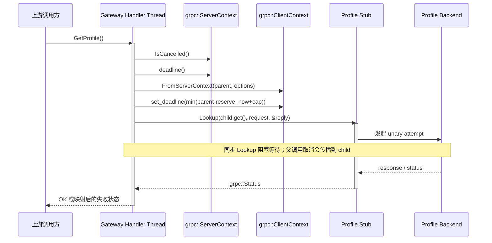
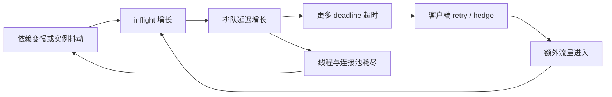
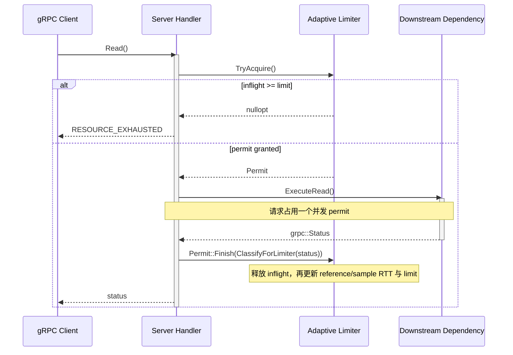
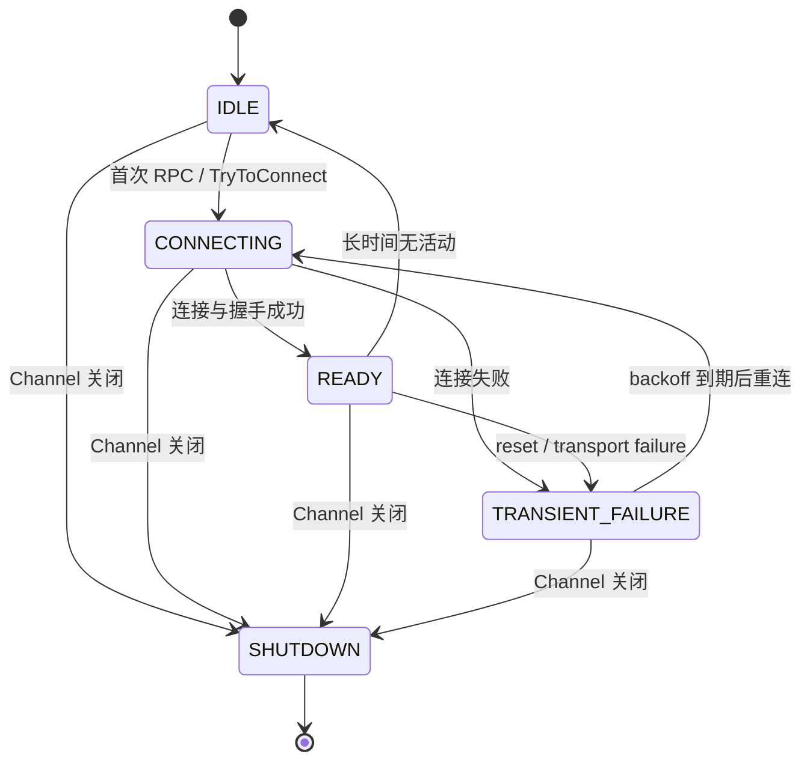
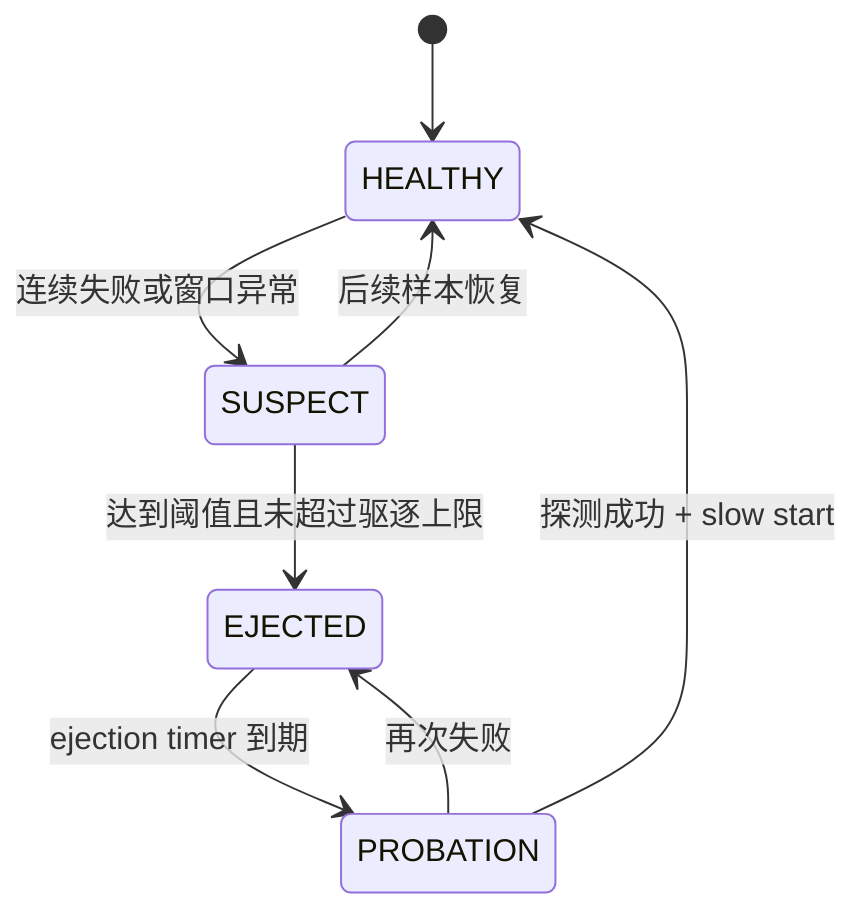

---
tags:
  - Linux
  - 网络编程
  - RPC
  - gRPC
  - 分布式系统
  - 服务治理
  - OpenTelemetry
aliases:
  - RPC 服务治理
  - gRPC Deadline Propagation
  - Adaptive Concurrency Limit
  - Hedged Requests
  - Client-side Load Balancing
阅读次数: 0
---

# 18.9 RPC 治理：超时传递、自适应限流、对冲重试与负载均衡

> [!abstract] 本篇定位
> [[18.1 RPC 协议模板]]解决“消息怎样被编码、发送、关联和解码”，[[18.2 gRPC]]解决“怎样用 gRPC 实现服务接口”，[[18.5 gRPC Completion Queue：异步 Add RPC]]解决“异步调用怎样拥有状态与生命周期”。本篇继续回答生产环境中的下一组问题：**一次逻辑调用最多可以活多久、最多可以占用多少并发、失败后还能额外发几次、下一次 attempt 应该选择哪个实例，以及这些决策如何形成闭环。**

RPC 治理的目标不是让请求“永不失败”，而是让失败满足四个条件：

1. **有界**：deadline、并发和额外 attempt 都有上限；
2. **可控**：系统在排队开始堆积时主动削峰，而不是等线程、连接和内存耗尽；
3. **可归因**：能区分逻辑调用、单次 attempt、后端实例和治理策略本身；
4. **可恢复**：故障实例能暂时退出流量面，也能经过探测和慢启动重新加入。

## 1. 先统一术语：Call、Attempt、Subchannel 不是一回事

| 术语 | 含义 | 典型生命周期 |
|---|---|---|
| **Logical Call** | 应用层看到的一次 RPC 调用 | 从 API 被调用，到最终成功、失败或取消；可包含多个 attempts |
| **Attempt** | 真正向某个后端发起的一次网络尝试 | 一次 LB pick、一次 subchannel 选择和一次请求/响应交换 |
| **Deadline** | 本地绝对时间点，超过后调用不再有价值 | 覆盖整个 logical call，而不是每次 attempt 重新计时 |
| **Timeout** | 从当前时刻开始还能等待多久 | gRPC 在网络上传递 `grpc-timeout` 这种相对时长 |
| **Name Resolver** | 把逻辑服务名解析为地址列表和相关配置 | 随服务发现、DNS 或 xDS 更新而变化 |
| **Subchannel** | Channel 到某个候选后端的连接状态单元 | `IDLE / CONNECTING / READY / TRANSIENT_FAILURE / SHUTDOWN` |
| **Picker** | 每个 attempt 的快速选址逻辑 | 位于调用热路径，必须快速、无阻塞或近似无阻塞 |
| **Outlier Detection** | 根据被动错误和成功率暂时驱逐异常实例 | 与主动健康检查互补，不等同于永久摘除 |

这里最重要的区分是：

> **一次 logical call 可以有多个 attempts，但所有 attempts 必须共享同一个 deadline，并共同消耗一个有界的 attempt budget。**

## 2. RPC 治理全景：主路径与反馈闭环

![[图片/SVG/3_18_18_9_1.svg|1240]]

图中主路径依次回答：

- **上下文预算**：还剩多少时间？属于哪条 Trace？
- **候选实例选择**：哪些 endpoint 仍然可用？本次应该挑谁？
- **准入与尝试预算**：当前是否允许新增 inflight？还允许发 retry 或 hedge 吗？
- **后端实例池**：哪个 attempt 先得到可提交的结果？其他 attempt 怎样取消？

反馈路径则把 `p99`、排队延迟、连接错误、健康状态和预算消耗回写给控制器。它不是一次性的配置，而是持续运行的反馈系统。

> [!note] 本文中的工程综合
> gRPC 规范定义了 deadline、retry/hedging Service Config、resolver、subchannel 和 picker 等机制；`D_child = min(...)` 中的返回预留、把 retry 与 hedge 纳入同一个比例预算、以及“主动健康 + 被动异常驱逐 + 慢启动”的组合，是本文基于多项资料整理出的工程策略，并非单一 gRPC 规范强制规定。

---

## 3. 超时与链路传播：Deadline 必须只减不增

### 3.1 Deadline 与 `grpc-timeout` 的关系

调用方通常在 API 中设置一个**绝对 deadline**：

\[
D_0 = t_{start} + T_{budget}
\]

在 HTTP/2 请求头中，gRPC 使用相对时长 `grpc-timeout` 传输剩余预算。协议允许的单位包括小时、分钟、秒、毫秒、微秒和纳秒；省略该字段时，服务端通常按“无限 timeout”处理。gRPC 在跨进程传播 deadline 时，会把绝对时间换算为已扣除本地耗时的剩余 timeout，从而避免把不同机器的墙上时钟偏差直接带入协议。[^grpc-deadline]

例如，入口客户端给出 `800 ms` 总预算：

```text
Client -> Gateway: grpc-timeout ≈ 800m
Gateway 本地消耗 110 ms 后：剩余约 690 ms
Gateway -> Profile: grpc-timeout 不得重新变回 800m
```

运行时最终选择哪一种单位、是否因编码精度发生向上取整，属于实现细节；应用层应关心的是**剩余时间单调减少**，而不是字符串必须恰好等于某个值。

### 3.2 逐级递减的工程公式

一个中间服务既要尊重父调用，也要给自己留下序列化、回包和清理时间。可采用：

\[
D_{child} = \min\left(D_{parent} - R_{return},\; t_{now} + T_{method\_cap}\right)
\]

其中：

- `D_parent`：入口调用传入的绝对 deadline；
- `R_return`：给当前服务回包、日志和取消清理预留的时间；
- `T_method_cap`：该依赖调用自身允许占用的最大时间；
- 若 `D_parent - R_return <= now`，应立即失败，不再制造一个注定超时的下游 RPC。

这条公式保证了两件事：

1. 子调用不会比父调用活得更久；
2. 即使父调用给了很长时间，某个依赖也不能独占全部预算。

### 3.3 级联 deadline 时序

```mermaid
sequenceDiagram
    participant Client as 入口客户端
    participant Gateway as Gateway Handler
    participant Profile as Profile Service
    participant Store as Storage Service

    Client->>Gateway: GetProfile(deadline = now + 800 ms)
    activate Gateway
    Note over Gateway: 鉴权与解析消耗约 90 ms
    Gateway->>Profile: FetchProfile(timeout <= 670 ms)
    activate Profile
    Note over Profile: 业务处理消耗约 120 ms
    Profile->>Store: ReadUser(timeout <= 510 ms)
    activate Store
    Note over Store: 所有下游共享入口 deadline

    alt Store 在剩余预算内返回
        Store-->>Profile: OK
        deactivate Store
        Profile-->>Gateway: OK
        deactivate Profile
        Gateway-->>Client: OK
    else 剩余预算已不足
        Store-->>Profile: DEADLINE_EXCEEDED / CANCELLED
        deactivate Store
        Profile-->>Gateway: 停止派生工作
        deactivate Profile
        Gateway-->>Client: DEADLINE_EXCEEDED
    end
    deactivate Gateway
```

这张图揭示了一个源码片段不容易表现的事实：**超时不是每一跳各自拥有一块完整预算，而是所有服务共同消费同一条时间轴。**

### 3.4 C++17：从 `ServerContext` 构造更短的 child context

下面的 helper 使用 gRPC C++ `ClientContext::FromServerContext()` 建立父子关系，再把 child deadline 收紧。`FromServerContext()` 可以按 `PropagationOptions` 传播 deadline 和 cancellation；W3C TraceContext 仍应由 OpenTelemetry instrumentation 或 interceptor 注入/提取，不能把两者混为一谈。[^grpc-cpp-context]

```cpp
// C++17，Linux / gRPC C++。
#include <algorithm>
#include <chrono>
#include <memory>

#include <grpcpp/grpcpp.h>

using WallClock = std::chrono::system_clock;

std::unique_ptr<grpc::ClientContext> MakeChildContext(
    const grpc::ServerContext& parent,
    std::chrono::milliseconds method_cap,
    std::chrono::milliseconds return_reserve) {
    const auto now = WallClock::now();
    const auto parent_deadline = parent.deadline();

    // 剩余时间连当前层的回包与清理都不够时，直接返回失败信号。
    if (parent_deadline <= now + return_reserve) {
        return nullptr;
    }

    grpc::PropagationOptions options;
    options.enable_deadline_propagation()
           .enable_cancellation_propagation();

    // child 的生命周期必须覆盖完整的下游 RPC，且不能复用于第二次 RPC。
    auto child = grpc::ClientContext::FromServerContext(parent, options);

    const auto inherited_cap = parent_deadline - return_reserve;
    const auto local_method_cap = now + method_cap;
    child->set_deadline(std::min(inherited_cap, local_method_cap));
    return child;
}
```

在同步 unary handler 中使用：

```cpp
// 假设这些 request/reply/stub 类型由 protoc 生成。
grpc::Status GatewayServiceImpl::GetProfile(
    grpc::ServerContext* parent,
    const GetProfileRequest* request,
    GetProfileReply* reply) {
    if (parent->IsCancelled()) {
        return {grpc::StatusCode::CANCELLED, "upstream already cancelled"};
    }

    auto child = MakeChildContext(
        *parent,
        std::chrono::milliseconds{250},  // 依赖调用自身上限
        std::chrono::milliseconds{30});  // 给当前层回包与清理留余量

    if (!child) {
        return {grpc::StatusCode::DEADLINE_EXCEEDED,
                "insufficient downstream deadline budget"};
    }

    ProfileLookupRequest downstream_request;
    downstream_request.set_user_id(request->user_id());
    ProfileLookupReply downstream_reply;

    const grpc::Status status = profile_stub_->Lookup(
        child.get(), downstream_request, &downstream_reply);
    if (!status.ok()) {
        return {status.error_code(),
                "profile dependency: " + status.error_message()};
    }

    reply->set_display_name(downstream_reply.display_name());
    return grpc::Status::OK;
}
```



这张图补出了同步 API 隐藏的等待区间：handler 线程会阻塞在 `Lookup()`，而 child context 必须一直存活到该调用结束。

> [!warning] 不要用传输层 timeout 冒充 RPC deadline
> `SO_RCVTIMEO`、`SO_SNDTIMEO`、TCP 重传计时器、HTTP/2 keepalive 和 RPC deadline 解决的是不同问题。[[7.6 TCP协议基础]]负责可靠字节流；RPC deadline 描述的是“这项业务结果何时失去价值”。仅设置 socket timeout 无法正确覆盖排队、LB、重试、服务端计算和回包的总耗时。UNP 对 socket timeout 的讨论可作为底层背景，但不能替代端到端 deadline。[^unp-timeout]

### 3.5 流式 RPC 的额外注意

- `grpc-timeout` 通常约束**整条流**的生命期，而不是每条 message 单独续期；
- 长连接若需要“30 秒没有新 message 就断开”，应另设应用层 idle timeout；
- 流已经消费了部分数据后再重试，可能产生重复、断点和顺序问题，不能沿用 unary RPC 的简单重试策略；
- deadline 到期后，服务端仍需主动停止自己派生出的线程、磁盘 I/O 或下游 RPC，取消信号不会自动回滚业务副作用。

---

## 4. TraceContext：同一条 Trace，不同的 Span

### 4.1 W3C `traceparent` 格式

OpenTelemetry 默认使用 W3C TraceContext 进行跨进程传播。典型头部为：[^w3c-trace][^otel-context]

```text
traceparent: 00-4bf92f3577b34da6a3ce929d0e0e4736-00f067aa0ba902b7-01
             ^^ ^------------------------------^ ^--------------^ ^^
           version          trace-id               parent-id      flags
```

| 字段 | 长度 | 语义 |
|---|---:|---|
| `version` | 1 byte / 2 hex | 当前常见版本为 `00` |
| `trace-id` | 16 bytes / 32 hex | 标识整条分布式 trace，跨服务保持一致 |
| `parent-id` | 8 bytes / 16 hex | 调用方当前 span 的标识；每次向下游发送时通常会更新 |
| `trace-flags` | 1 byte / 2 hex | 包含 sampled 等标志 |
| `tracestate` | 可选 | 保存厂商扩展信息，不能替代标准字段 |

### 4.2 TraceID 与 SpanID 的传播规则

```text
Client Span       trace=AAA, span=111
  └─ Gateway Span trace=AAA, span=222, parent=111
       └─ DB Call trace=AAA, span=333, parent=222
```

因此：

- `TraceID` 用来把完整调用链串起来；
- `SpanID` 描述当前操作；
- 下游收到的 `parent-id` 是调用方用于这次出站调用的 span，而不是永远复用入口 span；
- 不要把 TraceID 当作幂等键。Trace 可能被采样、重启或跨信任边界重写；业务去重应使用独立的 `request_id / idempotency_key`。

### 4.3 Retry / Hedge 怎样建模

OpenTelemetry 的通用 RPC client span应覆盖整个逻辑调用，包括内部 retry；gRPC 原生观测模型又明确区分 `call` 与 `attempt`。推荐采用两层结构：[^otel-rpc][^grpc-otel]

```text
CLIENT span: ProfileService/GetProfile     ← logical call
  ├─ Attempt #1: backend-a, UNAVAILABLE
  └─ Attempt #2: backend-b, OK              ← retry 或 hedge
```

至少记录：

- logical call：最终状态、总持续时间、attempt 数量、总 deadline；
- attempt：序号、类型（original/retry/hedge/transparent）、endpoint、单次持续时间和状态；
- loser hedge 被取消时，不要把它错误地统计成独立用户请求失败；
- metrics 标签中不要放 TraceID、SpanID、完整用户 ID 等高基数字段。

> [!warning] 信任边界
> 外部请求可以伪造 `traceparent`，`tracestate` 与 baggage 也可能泄露内部信息。进入受信网络时应验证或重建上下文；baggage 中禁止放口令、令牌和 PII。

---

## 5. 为什么固定 QPS 限流会在长尾延迟下失效

### 5.1 QPS 只限制到达率，不限制系统里滞留的工作量

Little's Law 给出稳定系统中的基本关系：

\[
L = \lambda W
\]

- `L`：平均并发中的请求数；
- `λ`：平均到达率，即 QPS；
- `W`：平均响应时间。

同样是 `1000 QPS`：

| 平均延迟 | 估算 inflight `L = λW` |
|---:|---:|
| `20 ms` | `20` |
| `200 ms` | `200` |
| `2 s` | `2000` |

如果依赖抖动把延迟放大 10 倍，而入口 token bucket 仍允许相同 QPS，系统中的 inflight 也会放大约 10 倍。线程、连接、内存、CQ tag、请求对象和下游连接池随后一起被占满。

### 5.2 长尾会形成正反馈



固定 QPS 无法识别“每个请求占用资源多久”。当 `p99/p999` 毛刺、fan-out 或 noisy neighbor 出现时，队列先增长，timeout 又触发额外 attempts，最终演化为雪崩。DDIA 强调，高分位延迟常由排队和头阻塞主导；一次页面或聚合请求 fan-out 到多个下游时，总体尾延迟由最慢的子请求决定。[^ddia-tail]

### 5.3 QPS 限流仍然有价值

自适应并发不是 token bucket 的替代品，两者控制不同维度：

| 机制 | 控制对象 | 适合解决 |
|---|---|---|
| QPS / Rate Limit | 单位时间的请求数 | 租户配额、成本、滥用、外部合同 |
| Concurrency Limit | 同时在系统内的请求数 | 排队、线程/连接/内存占用、依赖变慢 |
| Deadline | 单个 logical call 最长生命期 | 无界等待、过期工作 |
| Attempt Budget | 额外 attempts 占原始流量的比例 | retry storm、hedge 放大 |

生产系统通常需要四者同时存在。

---

## 6. 自适应并发限制：在排队形成前主动减载

### 6.1 控制目标

自适应并发限制把“允许的 inflight”类比为 TCP 的拥塞窗口：

- 延迟接近低负载基线时，说明还可能有余量，缓慢增加 limit；
- sample RTT 持续偏离基线时，说明 standing queue 正在形成，降低 limit；
- timeout、过载拒绝或连接失败是更强的 loss signal，应快速回退；
- `inflight >= limit` 时立即拒绝或向上游施加背压，不能再进入一个无界等待队列。

Netflix `concurrency-limits` 明确指出：固定 RPS 阈值在扩缩容和动态依赖条件下很快失效，延迟可以用于估计排队，timeout 与 reject 可作为回退信号。[^netflix-limit]

### 6.2 Vegas、Gradient2、Envoy Gradient 与 CoDel 的共同思想

#### Vegas 风格：估计队列中的请求数

\[
Q_{estimate} = L \left(1 - \frac{RTT_{min}}{RTT_{sample}}\right)
\]

- `RTT_sample ≈ RTT_min`：估计排队接近 0；
- `RTT_sample` 增大：估计队列增长；
- 依据 `α/β` 阈值小步增减 limit。

#### Gradient2：看短期与长期延迟是否持续分离

Gradient2 不永久依赖单一历史 `minRTT`，而是比较短窗口和长窗口的指数平均：

- 短期均值暂时上升，可能只是 burst；
- 短期均值持续高于长期均值，代表排队趋势；
- 趋势持续时间越长，回退越积极。

#### Envoy Gradient：用基线与采样窗口直接更新 limit

\[
gradient = \frac{minRTT + B}{sampleRTT}
\]

\[
limit_{new} = gradient \cdot limit_{old} + \sqrt{limit_{old}}
\]

`B` 是允许自然波动的 buffer，`sqrt(limit)` 是探测 headroom。Envoy 会周期性在低并发窗口重新测量 `minRTT`，并要求控制器能够覆盖目标 cluster 的全部并发，否则反馈模型失真。[^envoy-gradient]

#### CoDel 思想：关注“持续排队造成的等待”，不要只看队列长度

CoDel 原本是网络队列管理算法。它跟踪 packet sojourn time，并用最近窗口的局部最小值判断 standing queue；短 burst 应被容忍，持续存在的额外等待才触发动作。把这一思想迁移到 RPC 时，应理解为：[^codel]

- 关注请求在队列或调用链中实际等待了多久；
- 避免因单个离群点立刻砍掉大量并发；
- 又不能用过度平滑的均值掩盖长期排队。

> [!important] 不是同一个算法
> Vegas、Gradient2、Envoy Gradient 和 CoDel 的状态、公式与适用层次并不相同。本文把它们放在一起，是为了提炼共同控制思想：**延迟是排队信号；区分 burst 与 standing queue；增量探测、快速回退。**不要声称“下面的示例就是 Gradient2 或 CoDel 的完整实现”。

### 6.3 控制器应采集哪些样本

| 样本 | 用途 | 注意事项 |
|---|---|---|
| `inflight` | 执行准入判断 | 应在所有返回路径释放 |
| `reference/min RTT` | 估计无排队基线 | 必须周期性重测或允许老化，不能永久保存历史最小值 |
| `sample RTT` | 估计当前排队 | 用窗口分位数往往比单样本或均值稳定 |
| timeout / overload reject | 强回退信号 | 调用方主动取消、参数错误不应当作容量不足 |
| endpoint / method class | 分层控制 | 快慢方法混在同一控制器会互相污染 |
| health-check sample | 通常排除 | 健康检查过轻，会把基线拉得不现实地低 |

### 6.4 C++17 教学实现：RAII Permit + 延迟反馈

下面的实现用于展示资源所有权与控制路径：

- `TryAcquire()` 成功时增加 `inflight` 并返回一个独占 `Permit`；
- `Permit::Finish()` 或析构时必定释放配额；
- `Outcome::kIgnore` 防止调用方取消、鉴权失败等样本污染容量估计；
- 成功样本更新低延迟基线和快速 EWMA；
- 过载样本执行乘法回退。

它是**受 Gradient 控制器启发的教学实现**，不是生产级 Gradient2：没有窗口分位数、分片计数、周期性 minRTT 探测、冷启动隔离和多优先级配额。

#### `adaptive_concurrency_limiter.h`

```cpp
#pragma once

#include <chrono>
#include <cstddef>
#include <mutex>
#include <optional>

class AdaptiveConcurrencyLimiter {
public:
    using Clock = std::chrono::steady_clock;

    enum class Outcome {
        kSuccess,   // 记录 RTT，参与正常增减控制。
        kOverload,  // 超时、过载拒绝等强信号，触发快速回退。
        kIgnore     // 调用方取消、参数错误等，不污染容量估计。
    };

    class Permit {
    public:
        Permit(AdaptiveConcurrencyLimiter& owner,
               Clock::time_point start) noexcept;

        Permit(const Permit&) = delete;
        Permit& operator=(const Permit&) = delete;
        Permit(Permit&& other) noexcept;
        Permit& operator=(Permit&&) = delete;
        ~Permit();

        // 调用后 Permit 失效；重复调用不会重复释放 inflight。
        void Finish(Outcome outcome) noexcept;

    private:
        AdaptiveConcurrencyLimiter* owner_;
        Clock::time_point start_;
    };

    explicit AdaptiveConcurrencyLimiter(double initial_limit = 16.0,
                                        double max_limit = 1024.0);

    // 超过当前并发上限时立即返回 nullopt，而不是继续排队。
    [[nodiscard]] std::optional<Permit> TryAcquire();

    [[nodiscard]] std::size_t limit() const;
    [[nodiscard]] std::size_t inflight() const;

private:
    void OnComplete(Clock::duration elapsed, Outcome outcome) noexcept;

    mutable std::mutex mutex_;
    std::size_t inflight_{0};
    double limit_;
    const double max_limit_;
    double reference_rtt_ms_{0.0};
    double sample_rtt_ms_{0.0};
};
```

#### `adaptive_concurrency_limiter.cpp`

```cpp
#include "adaptive_concurrency_limiter.h"

#include <algorithm>
#include <cmath>
#include <utility>

AdaptiveConcurrencyLimiter::Permit::Permit(
    AdaptiveConcurrencyLimiter& owner,
    Clock::time_point start) noexcept
    : owner_(&owner), start_(start) {}

AdaptiveConcurrencyLimiter::Permit::Permit(Permit&& other) noexcept
    : owner_(std::exchange(other.owner_, nullptr)),
      start_(other.start_) {}

AdaptiveConcurrencyLimiter::Permit::~Permit() {
    // 未显式 Finish() 仍必须释放 inflight；原因未知，不作为拥塞信号。
    Finish(Outcome::kIgnore);
}

void AdaptiveConcurrencyLimiter::Permit::Finish(Outcome outcome) noexcept {
    if (owner_ == nullptr) {
        return;
    }

    AdaptiveConcurrencyLimiter* owner = std::exchange(owner_, nullptr);
    owner->OnComplete(Clock::now() - start_, outcome);
}

AdaptiveConcurrencyLimiter::AdaptiveConcurrencyLimiter(
    double initial_limit,
    double max_limit)
    : limit_(std::clamp(initial_limit,
                        1.0,
                        std::max(1.0, max_limit))),
      max_limit_(std::max(1.0, max_limit)) {}

std::optional<AdaptiveConcurrencyLimiter::Permit>
AdaptiveConcurrencyLimiter::TryAcquire() {
    std::lock_guard<std::mutex> lock(mutex_);

    const std::size_t allowed = static_cast<std::size_t>(
        std::max(1.0, std::floor(limit_)));
    if (inflight_ >= allowed) {
        return std::nullopt;
    }

    ++inflight_;
    return std::optional<Permit>{std::in_place, *this, Clock::now()};
}

std::size_t AdaptiveConcurrencyLimiter::limit() const {
    std::lock_guard<std::mutex> lock(mutex_);
    return static_cast<std::size_t>(
        std::max(1.0, std::floor(limit_)));
}

std::size_t AdaptiveConcurrencyLimiter::inflight() const {
    std::lock_guard<std::mutex> lock(mutex_);
    return inflight_;
}

void AdaptiveConcurrencyLimiter::OnComplete(
    Clock::duration elapsed,
    Outcome outcome) noexcept {
    const double rtt_ms =
        std::chrono::duration<double, std::milli>(elapsed).count();

    std::lock_guard<std::mutex> lock(mutex_);
    if (inflight_ > 0) {
        --inflight_;
    }

    if (outcome == Outcome::kIgnore) {
        return;
    }
    if (outcome == Outcome::kOverload || rtt_ms <= 0.0) {
        limit_ = std::max(1.0, limit_ * 0.70);
        return;
    }

    // 低延迟基线：新低值立即采用；没有新低值时缓慢老化，
    // 避免永久保留一个已不符合当前部署条件的历史最小值。
    if (reference_rtt_ms_ == 0.0 || rtt_ms < reference_rtt_ms_) {
        reference_rtt_ms_ = rtt_ms;
    } else {
        constexpr double kBaselineAging = 0.001;
        reference_rtt_ms_ =
            (1.0 - kBaselineAging) * reference_rtt_ms_ +
            kBaselineAging * rtt_ms;
    }

    // 快 EWMA 近似当前 sampleRTT。生产实现更适合按窗口聚合
    // p90/p95，并排除健康检查、取消和冷启动样本。
    constexpr double kSampleAlpha = 0.20;
    sample_rtt_ms_ = sample_rtt_ms_ == 0.0
                         ? rtt_ms
                         : (1.0 - kSampleAlpha) * sample_rtt_ms_ +
                               kSampleAlpha * rtt_ms;

    // 受 Gradient 控制器启发：排队增大时 gradient 下降；
    // sqrt(limit) 提供继续探测可用容量的 headroom。
    const double buffered_reference = reference_rtt_ms_ * 1.10;
    const double gradient = std::clamp(
        buffered_reference / std::max(sample_rtt_ms_, 0.001),
        0.50,
        1.00);
    const double target = gradient * limit_ + std::sqrt(limit_);

    constexpr double kLimitAlpha = 0.20;
    limit_ = std::clamp((1.0 - kLimitAlpha) * limit_ +
                            kLimitAlpha * target,
                        1.0,
                        max_limit_);
}
```

#### 在 gRPC handler 中使用

```cpp
AdaptiveConcurrencyLimiter::Outcome ClassifyForLimiter(
    const grpc::Status& status) {
    if (status.ok()) {
        return AdaptiveConcurrencyLimiter::Outcome::kSuccess;
    }

    switch (status.error_code()) {
    case grpc::StatusCode::RESOURCE_EXHAUSTED:
    case grpc::StatusCode::UNAVAILABLE:
        return AdaptiveConcurrencyLimiter::Outcome::kOverload;

    // DEADLINE_EXCEEDED 只有在确认主要时间消耗来自本地排队或
    // 依赖拥塞时才作为 overload；过短的调用方 deadline 应忽略。
    case grpc::StatusCode::DEADLINE_EXCEEDED:
    case grpc::StatusCode::CANCELLED:
    default:
        return AdaptiveConcurrencyLimiter::Outcome::kIgnore;
    }
}

grpc::Status LimitedServiceImpl::Read(
    grpc::ServerContext*,
    const ReadRequest* request,
    ReadReply* reply) {
    auto permit = limiter_.TryAcquire();
    if (!permit) {
        return {grpc::StatusCode::RESOURCE_EXHAUSTED,
                "adaptive concurrency limit reached"};
    }

    const grpc::Status status = ExecuteRead(*request, reply);
    permit->Finish(ClassifyForLimiter(status));
    return status;
}
```



这张图揭示了 RAII 的关键价值：**不论正常返回、异常还是提前退出，permit 都必须释放；否则限流器自身会“泄漏并发槽位”。**

### 6.5 生产化时还要补什么

1. **热路径减锁**：`inflight` 用原子计数或分片计数，窗口聚合与 limit 更新放到控制线程；
2. **按方法/工作类别分池**：轻量读、重计算和批处理不能共享一个无差别 limit；
3. **优先级与保底配额**：实时流量可借用批处理余量，批处理不能饿死关键控制 RPC；
4. **shadow mode**：先只计算建议 limit 和“本应拒绝数”，观察稳定性后再实际拦截；
5. **上下界与变化速率**：限制单窗口最大增减，避免控制器振荡；
6. **样本清洗**：排除 health check、调用方取消、冷启动、已知 GC pause 和无关 4xx 类错误；
7. **两级限制**：全局 limiter 保护调用方资源，per-endpoint limiter 防止一个慢实例吞掉全部 permits。

> [!warning] 状态码是治理契约的一部分
> `RESOURCE_EXHAUSTED` 常表示配额或资源耗尽，`UNAVAILABLE` 常表示暂时不可用。两者都不能默认无脑重试。服务端、Service Config 和业务语义必须共同约定哪些状态可重试，并用 pushback 或预算限制额外流量。

---

## 7. 长尾抑制：Retry 与 Hedging 的区别

### 7.1 两种策略不是同一件事

| 策略 | 触发时机 | 主要目标 | 代价 |
|---|---|---|---|
| Retry | 前一次 attempt 已失败 | 恢复瞬时错误 | 增加完成时间和额外流量 |
| Hedge | 前一次 attempt 尚未完成，但已超过延迟阈值 | 绕过慢实例或偶发毛刺 | 同时占用多个后端资源 |

Hedging 可以理解为“在确认失败之前就启动一次有控制的重试”。它对 `p99/p999` 毛刺有效，但前提是慢 attempt 只是少数，并且第二个 backend 的延迟近似独立。《The Tail at Scale》展示了用少量额外资源降低大规模 fan-out 尾延迟的思想。[^tail-scale]

### 7.2 正确的对冲流程

1. 启动 attempt #1；
2. 等待 `hedgingDelay`，它应来自近期延迟分布，而不是固定为 0；
3. 若调用尚未提交、deadline 仍充足、attempt budget 仍有余量，则启动 attempt #2；
4. attempt #2 应尽量选择**不同的健康实例**；
5. 第一个可提交的成功结果成为 logical call 结果；
6. 取消其余 attempts，并释放 permit、连接和缓冲区；
7. fatal status、server pushback 或 deadline 到期可以提前终止整个调用。

```mermaid
sequenceDiagram
    participant App as Client Application
    participant Orchestrator as Call Orchestrator
    participant Budget as Attempt Budget
    participant A as Backend A
    participant B as Backend B

    App->>Orchestrator: GetMetadata(deadline)
    activate Orchestrator
    Orchestrator->>A: Attempt #1
    activate A
    Note over Orchestrator: 等待 hedgingDelay

    alt A 已及时成功
        A-->>Orchestrator: OK
        deactivate A
        Orchestrator-->>App: commit result
    else A 仍未完成
        Orchestrator->>Budget: TryConsume(1 extra attempt)
        alt budget granted
            Budget-->>Orchestrator: token
            Orchestrator->>B: Attempt #2（不同 endpoint）
            activate B
            B-->>Orchestrator: OK（先成功）
            deactivate B
            Orchestrator->>A: TryCancel()
            A-->>Orchestrator: CANCELLED / late result ignored
            deactivate A
            Orchestrator-->>App: commit B result
        else budget exhausted
            Budget-->>Orchestrator: deny
            A-->>Orchestrator: 原 attempt 最终结果
            deactivate A
            Orchestrator-->>App: commit A result / timeout
        end
    end
    deactivate Orchestrator
```

### 7.3 哪些请求可以 hedge

适合：

- 只读查询；
- 内容寻址读取；
- 带独立幂等键且服务端实现了去重的写入；
- 两个 attempts 的副作用可以安全重复。

不适合：

- 扣款、发券、提交调度命令等非幂等写；
- 已经开始返回流数据的 RPC；
- 大对象上传、checkpoint 写入等会显著放大带宽和内存的操作；
- 后端已普遍过载，此时 hedge 只会加速雪崩。

> [!danger] 取消不等于回滚
> loser attempt 收到取消时，服务端可能已经完成数据库写入或设备控制。客户端“只采用一个结果”并不能消除重复副作用。必须依赖真正的幂等语义或服务端去重。

### 7.4 gRPC Service Config 示例

下面展示规范层面的配置结构：[^grpc-hedge][^grpc-retry]

```json
{
  "methodConfig": [
    {
      "name": [
        {
          "service": "rpcdemo.ProfileService",
          "method": "GetProfile"
        }
      ],
      "timeout": "0.800s",
      "hedgingPolicy": {
        "maxAttempts": 2,
        "hedgingDelay": "0.040s",
        "nonFatalStatusCodes": ["UNAVAILABLE"]
      }
    }
  ],
  "retryThrottling": {
    "maxTokens": 10,
    "tokenRatio": 0.1
  }
}
```

含义：

- `maxAttempts` 包括 original attempt；
- `hedgingDelay` 省略或为 0 时可能同时发出多个 attempts，风险很高；
- deadline 覆盖整条 hedging chain，不会因 attempt #2 开始而重置；
- 收到成功结果后取消其他 attempts；
- `nonFatalStatusCodes` 之外的错误可以使 logical call 立即提交失败；
- `grpc-retry-pushback-ms` 可让服务端要求延迟下一次 attempt 或停止重试。

> [!warning] 运行时支持矩阵必须实测
> gRPC 各语言对 custom resolver、custom LB 和 hedging 的实现进度不同。官方 hedging guide 当前仍没有提供 C++ 示例。C++ 项目应以实际 gRPC 版本的 release notes、集成测试和故障注入结果为准；若运行时不满足需求，可在应用层 orchestrator、Envoy 或 service mesh 中实现，但只能保留一个真正负责 retry/hedge 的层。

---

## 8. Retry Budget：限制“额外流量比例”，而不只是每次最多重试几次

### 8.1 为什么只有 `maxAttempts` 不够

假设 A 调 B、B 调 C、C 调 D，每层都允许最多 4 attempts。最坏情况下，一个入口请求可放大到：

\[
4^3 = 64\text{ 次下游 attempts}
\]

单调用上限并没有限制整个时间窗口里的额外流量。故障发生时，大量请求同时进入 retry，会形成 retry storm。

### 8.2 滚动窗口预算

可定义：

\[
ExtraAttempts \le r \cdot OriginalRequests + m \cdot WindowSeconds
\]

- `r`：允许额外流量占原始请求的比例，例如 `0.2`；
- `m`：低流量时每秒的最小 allowance；
- `OriginalRequests`：不含 retries/hedges 的入口 logical calls；
- `ExtraAttempts`：所有 retry 和 hedge 的新增 attempts。

例如 10 秒窗口内有 `10,000` 个原始请求，`r=0.2`、`m=10/s`：

\[
ExtraAttempts \le 0.2 \times 10000 + 10 \times 10 = 2100
\]

这意味着额外流量最多约为原始流量的 21%，而不是每个请求都机械重试三次。Linkerd 的 retry budget 使用 `retryRatio + minRetriesPerSecond + ttl` 表达同一类思想。[^retry-budget]

### 8.3 Retry 与 Hedge 必须消费同一个预算

| 事件 | 是否消费 extra-attempt budget |
|---|---|
| original attempt | 否 |
| failure-based retry | 是 |
| delayed hedge | 是 |
| transparent retry | 视实现与风险策略单独统计，但必须可观测 |
| loser cancellation | 不返还已经消耗的后端工作量 |

如果 retry 和 hedge 各有一套互不相知的预算，系统仍然可能被二者叠加放大。

### 8.4 gRPC `retryThrottling` 与比例预算不同

`retryThrottling` 维护一个按 server name 统计的 token count：失败减少 token，成功按 `tokenRatio` 恢复；token 低于阈值时停止后续 retry/hedge。它主要反映“服务是否处于持续失败状态”。比例 Retry Budget 则直接限制额外 attempts 相对原始流量的规模。

两者可以同时使用：

- `maxAttempts`：限制单个 call；
- `retryThrottling`：在持续失败时全局刹车；
- rolling Retry Budget：限制额外流量比例；
- deadline：限制所有 attempts 的总时间。

---

## 9. 客户端负载均衡：Resolver → Subchannel → Picker

### 9.1 gRPC 客户端选址链

```text
Target URI
   ↓
Name Resolver
   ├─ endpoint addresses
   └─ service config
          ↓
Load Balancing Policy
   ├─ maintain Subchannels
   └─ build Picker
          ↓
每个 attempt 在热路径调用 Picker
```

gRPC 默认通常使用 DNS resolver；resolver 也可以来自 xDS 或其他服务发现系统。LB policy 得到地址列表后维护 subchannels，并生成 picker。`pick_first` 是常见默认策略，`round_robin` 可以通过 Service Config 配置；其他策略和自定义接口的可用性取决于语言实现。[^grpc-lb]

### 9.2 Subchannel 状态机



`READY` 只说明 transport 可用，不一定代表具体业务服务处于 `SERVING`。真正可选的 endpoint 集合应近似为：

\[
Eligible = READY \cap SERVING \cap \neg EJECTED
\]

当没有 `READY` endpoint 时，wait-for-ready 可以让 RPC 等待连接恢复，但 deadline 仍然继续流逝。延迟敏感接口若无界使用 wait-for-ready，会把连接故障变成调用方队列堆积。

### 9.3 Round-Robin、P2C 与一致性哈希

| 策略 | Pick 方式 | 优点 | 主要风险 | 适用场景 |
|---|---|---|---|---|
| Round-Robin | 在健康实例间轮转 | 简单、确定、无需负载状态 | 不知道实例当前 inflight；慢实例仍按同频率接流量 | 同构实例、请求成本接近 |
| P2C / Least Request | 随机采样两个健康实例，选 active requests 更少者 | `O(1)`、抗 herd、能绕开暂时繁忙实例 | 依赖本地负载估计；请求成本差异大时仅看数量不够 | 实例延迟动态变化、短 RPC |
| Consistent Hash | 对 tenant/key 做哈希映射 | 实例变更时减少 key 重映射；提升缓存/状态局部性 | 热 key、负载倾斜、粘住慢实例；成员变更仍会重映射一部分 key | cache affinity、分片路由、会话黏性 |

Envoy 的 least-request 默认可使用 two-choice：随机挑选两个健康 host，选择 active requests 更少者；ring-hash 则提供一致性哈希，并可额外限制单实例相对平均负载。[^envoy-lb]

> [!important] P2C 与一致性哈希不是所有 gRPC C++ 版本的内建 Picker
> 这两项在架构上属于 picker 策略，但实际落地可能由 custom LB、xDS、Envoy 或 service mesh 完成。不要仅凭 Service Config 名称假定当前 C++ runtime 已经支持。

### 9.4 Picker 还要理解 attempt 语义

- retry/hedge 应尽量避开刚失败或仍然很慢的 endpoint；
- P2C 的 active count 应按**attempt**计数，而不是 logical call；
- loser hedge 取消后必须及时减少 active count；
- consistent hash 的首选实例被 ejected 时，需要定义 fallback，而不是继续粘住；
- 对不同方法成本差异较大时，可使用加权 active load，而非简单请求个数。

---

## 10. 健康检查与异常实例驱逐

### 10.1 主动健康检查

gRPC 定义了标准 `grpc.health.v1.Health` 服务：

- `Check`：单次查询；适合集中监控或较低频探测；
- `Watch`：服务状态变化时持续通知；比大量客户端轮询更适合规模化使用；
- 应按具体 service 更新状态，不能只报告进程是否存活。[^grpc-health]

主动健康检查能发现“服务明确知道自己不可服务”，但可能发现不了：

- 只有某类请求超时；
- 连接偶发 reset；
- 某实例成功率显著低于同组实例；
- 实例仍返回 OK，但 `p99` 已明显恶化。

### 10.2 被动 Outlier Detection

被动检测使用真实业务流量观察：

- 连续连接失败、reset、timeout；
- 连续可归因于实例的 server errors；
- 一段窗口内成功率显著低于同组；
- failure percentage 超过阈值。

在自定义治理层中，还可以把“延迟持续高于同组实例”作为降权或进入 `SUSPECT` 的信号；但这不是 Envoy 标准 outlier detection 已内建的等价判据。Envoy 的异常驱逐会先判断错误异常，再检查最大驱逐比例；重复异常可延长驱逐时间。gRPC 状态需要映射后才能参与错误分类。[^envoy-outlier]

### 10.3 驱逐必须可恢复且有上限

推荐生命周期：



工程约束：

1. 设置 `max_ejection_percent`，防止一次网络抖动把整个 cluster 摘空；
2. 本地连接失败与服务端业务错误分开统计；
3. `INVALID_ARGUMENT / PERMISSION_DENIED` 等调用方或权限错误不能归罪于实例；
4. 重新加入时使用 probation/slow start，避免刚恢复的实例被流量瞬间打满；
5. 主动健康检查成功是否立即解除驱逐，要按故障类型配置；
6. 记录 ejection reason、持续时间、次数和 resolver 版本，便于追责。

---

## 11. 一次完整调用的决策时序

```mermaid
sequenceDiagram
    participant App as Client Application
    participant Channel as gRPC Channel
    participant Resolver as Name Resolver
    participant Picker as Picker
    participant Guard as Limiter + Attempt Budget
    participant A as Subchannel A
    participant B as Subchannel B

    App->>Channel: Call(deadline, TraceContext)
    activate Channel
    Channel->>Resolver: 读取当前 endpoint snapshot
    Resolver-->>Channel: addresses + service config
    Channel->>Picker: Pick(eligible endpoints)
    Picker-->>Channel: Subchannel A
    Channel->>Guard: TryAcquire(original attempt)

    alt deadline 或 concurrency 已耗尽
        Guard-->>Channel: deny
        Channel-->>App: DEADLINE_EXCEEDED / RESOURCE_EXHAUSTED
    else original attempt admitted
        Guard-->>Channel: permit
        Channel->>A: Attempt #1
        activate A
        Note over Channel: logical call timer 与 hedge timer 同时运行

        alt A 在 hedge delay 前成功
            A-->>Channel: OK
            deactivate A
            Channel->>Guard: release permit + record sample
            Channel-->>App: commit result
        else A 仍未完成且预算允许 hedge
            Channel->>Guard: TryConsume(extra attempt)
            Guard-->>Channel: extra token
            Channel->>Picker: Pick(exclude A)
            Picker-->>Channel: Subchannel B
            Channel->>B: Attempt #2
            activate B
            B-->>Channel: OK
            deactivate B
            Channel->>A: TryCancel()
            A-->>Channel: CANCELLED / ignored late result
            deactivate A
            Channel->>Guard: release two permits + record attempts
            Channel-->>App: commit B result
        else budget denied or deadline expires
            Channel->>A: TryCancel()
            A-->>Channel: final status
            deactivate A
            Channel->>Guard: release permit + record failure
            Channel-->>App: final failure
        end
    end
    deactivate Channel
```

此图把四类状态放到同一条时间线上：deadline 属于 logical call，picker 和 permit 属于 attempt，resolver/health 决定候选集合，first valid result 决定提交点。

---

## 12. 可观测性：平均值不够，必须同时看 Call 与 Attempt

《Systems Performance》强调使用分位数观察延迟，因为平均值会掩盖 burst 和 outlier；对服务应同时观察 rate、errors、duration，并把 saturation/queueing 作为独立信号。[^systems-performance]

### 12.1 推荐指标

| 层次 | 指标 |
|---|---|
| Logical Call | `call.duration` histogram、最终 status、attempts per call、remaining deadline at start/end |
| Attempt | `attempt.started`、`attempt.duration`、endpoint、attempt type、单次 status、bytes |
| Limiter | `inflight`、`limit`、blocked count、reference/min RTT、sample RTT、gradient、update reason |
| Retry/Hedge | extra-attempt rate、budget remaining、hedge win rate、loser cancel latency、pushback count |
| Resolver/LB | resolver version、endpoint count、pick policy、no-ready count、per-endpoint active attempts |
| Health/Outlier | subchannel state、health status、ejection reason、ejection duration、probation result |
| Tail | p50、p90、p95、p99、p99.9；client-side end-to-end 与 server-side 分开 |

gRPC 的原生 OpenTelemetry 指标包含 `grpc.client.attempt.started`、`grpc.client.attempt.duration` 和 logical call duration 等；通用 OTel RPC 指标则使用 `rpc.client.call.duration`。迁移时应明确命名与语义，避免把两个系列直接相加。[^grpc-otel][^otel-rpc]

### 12.2 必须能回答的排障问题

- p99 上升时，`inflight/limit` 是否同步上升？
- timeout 发生前，时间花在 resolver、LB queue、连接、server queue 还是业务计算？
- retries/hedges 增加后，成功率真的改善了吗，还是只增加了负载？
- hedge 赢的是哪些 endpoints？是否总是同一组实例落后？
- 被驱逐实例的主要原因是 local-origin failure 还是 server status？
- deadline 在哪一跳被耗尽？是否某层重新放大了预算？
- 同一 Trace 中有多少 attempts？最终提交的是哪一个？

### 12.3 Cardinality 与安全

禁止把以下字段直接作为 metrics label：

- TraceID / SpanID；
- request ID；
- 完整 URL、用户 ID、对象 key；
- 未归一化的 endpoint 错误字符串。

这些信息适合进入 trace/log，并通过 exemplars 或受控字段关联；metrics 应使用 method、status、attempt type、cluster 等有限集合。

---

## 13. 常见错误与修正

| 错误做法 | 后果 | 修正 |
|---|---|---|
| 每一跳都设置“新的 1 秒” | 深链路总时长无界 | 传播父 deadline，只能收紧 |
| 只设固定 QPS | 依赖变慢时 inflight 爆炸 | rate limit + adaptive concurrency |
| 使用平均延迟驱动控制器 | 长尾被掩盖 | 窗口分位数 + standing queue 信号 |
| 所有 timeout 都算 overload | 调用方过短 deadline 误伤容量 | 按来源和已消耗时间分类 |
| 所有层都自动 retry | 指数级流量放大 | 只保留一个负责层 + 全链路 budget |
| `maxAttempts` 很小就认为安全 | 大量请求仍可同时重试 | 再加 rolling ratio budget |
| 对非幂等写做 hedge | 重复副作用 | 幂等键 + 服务端去重，或禁止 hedge |
| `hedgingDelay = 0` | 正常请求也成倍复制 | 用 p95/p99 或自适应延迟触发 |
| hedge 仍选同一 endpoint | 绕不开慢实例 | picker 排除 previous host |
| `READY` 就当业务健康 | 服务存活但不可服务 | 合并 transport、health 和 outlier |
| 永久驱逐异常实例 | 容量持续下降 | 有界 ejection + probation + slow start |
| TraceID 充当幂等键 | 采样/重建导致语义错误 | 独立业务 request ID |
| 无 deadline 地 wait-for-ready | 故障转化为无限排队 | 始终设置 realistic deadline |

---

## 14. 推荐落地顺序

### 阶段 1：先让调用有界、可观察

- 所有客户端 RPC 设置 realistic deadline；
- C++ 派生调用使用 `FromServerContext()` 或等价机制传播 deadline/cancellation；
- 接入 W3C TraceContext；
- 建立 logical call 与 attempt 两层 histogram 和 status 指标。

### 阶段 2：先固定并发保护，再自适应

- 先用保守固定 concurrency cap 验证拒绝路径；
- 控制器以 shadow mode 输出建议 limit；
- 对比 `sampleRTT / referenceRTT / blocked / p99` 后再启用动态拦截。

### 阶段 3：有预算地恢复失败

- 只对明确的瞬时错误启用 retry；
- 配置指数退避、jitter、server pushback 和 rolling budget；
- 确保整个调用栈只有一个负责自动 retry 的层。

### 阶段 4：只在高价值只读接口引入 hedge

- 通过历史分布确定 hedging delay；
- 限制 `maxAttempts=2` 起步；
- 强制不同 endpoint；
- 观察 hedge win rate、额外负载和 loser cancel latency。

### 阶段 5：升级 Picker 与异常驱逐

- 同构稳定实例先用 round-robin；
- 实例负载差异明显时评估 P2C；
- 只有真正需要 affinity 时才上 consistent hash；
- 主动 health 与被动 outlier 联动，配置最大驱逐比例和慢启动。

---

## 15. 总结

RPC 治理可以压缩为四条不变量：

1. **时间预算只减不增**：absolute deadline 在本地使用，`grpc-timeout` 在链路上传递剩余时长；
2. **并发接近容量拐点而非资源耗尽点**：用延迟和失败反馈动态调整 inflight limit；
3. **一个 logical call 的额外 attempts 有统一预算**：retry 和 hedge 共享 deadline，也共享 retry budget；
4. **Picker 只从 eligible 实例中选择**：resolver、subchannel、health 和 outlier detection 共同定义候选集合。

治理系统不是几个互相独立的开关。过短 deadline 会制造假超时，过强 retry 会破坏限流，错误的 picker 会让 hedge 失效，错误分类又会把健康实例驱逐。只有把**预算、准入、尝试、选址和观测**放在同一条反馈闭环里，RPC 才真正具备生产弹性。

---

## 参考资料

### 教材与项目 Sources

[^ddia-tail]: Martin Kleppmann, *Designing Data-Intensive Applications*, 1st Edition, O'Reilly, 2017. Chapter 1 “Describing Performance”, pp. 13–17；Chapter 8 “Timeouts and Unbounded Delays”, pp. 281–286.

[^systems-performance]: Brendan Gregg, *Systems Performance: Enterprise and the Cloud*, 2nd Edition, Pearson, 2020. Chapter 2（latency、statistics、percentiles、queueing）与 Chapter 5（application RED methodology）。

[^unp-timeout]: W. Richard Stevens, Bill Fenner, Andrew M. Rudoff, *UNIX Network Programming, Volume 1: The Sockets Networking API*, 3rd Edition. Chapter 14.2 “Socket Timeouts”.

### 规范、官方文档与论文

[^grpc-deadline]: gRPC, “Deadlines” 与 `grpc/grpc` 仓库 `doc/PROTOCOL-HTTP2.md`. https://grpc.io/docs/guides/deadlines/ ; https://github.com/grpc/grpc/blob/master/doc/PROTOCOL-HTTP2.md （访问日期：2026-08-30）。

[^grpc-cpp-context]: gRPC C++ API, `grpc::ClientContext`, `grpc::PropagationOptions`, `grpc::ServerContext`. https://grpc.github.io/grpc/cpp/classgrpc_1_1_client_context.html ; https://github.com/grpc/grpc/blob/master/include/grpcpp/client_context.h （访问日期：2026-08-30）。

[^w3c-trace]: W3C, *Trace Context*, `traceparent` / `tracestate`. https://www.w3.org/TR/trace-context/ （访问日期：2026-08-30）。

[^otel-context]: OpenTelemetry, “Context propagation” 与 Propagators API. https://opentelemetry.io/docs/concepts/context-propagation/ （访问日期：2026-08-30）。

[^otel-rpc]: OpenTelemetry Semantic Conventions, RPC spans / metrics / gRPC. https://opentelemetry.io/docs/specs/semconv/rpc/ （访问日期：2026-08-30）。

[^grpc-otel]: gRPC Proposal A66 “OpenTelemetry Metrics” 与 A45 “Retry Statistics”. https://github.com/grpc/proposal/blob/master/A66-otel-stats.md ; https://github.com/grpc/proposal/blob/master/A45-retry-stats.md （访问日期：2026-08-30）。

[^netflix-limit]: Netflix, `concurrency-limits` README（Vegas、Gradient2、gRPC limiter integration）. https://github.com/Netflix/concurrency-limits （访问日期：2026-08-30）。

[^envoy-gradient]: Envoy, “Adaptive Concurrency”. https://www.envoyproxy.io/docs/envoy/latest/configuration/http/http_filters/adaptive_concurrency_filter.html （访问日期：2026-08-30）。

[^codel]: RFC 8289, *Controlled Delay Active Queue Management*, 2018. https://www.rfc-editor.org/rfc/rfc8289.html

[^tail-scale]: Jeffrey Dean, Luiz André Barroso, “The Tail at Scale”, *Communications of the ACM*, Vol. 56, No. 2, 2013.

[^grpc-hedge]: gRPC, “Request Hedging”. https://grpc.io/docs/guides/request-hedging/ （访问日期：2026-08-30）。

[^grpc-retry]: gRPC, “Retry” 与 gRFC A6 “Client Retries”. https://grpc.io/docs/guides/retry/ ; https://github.com/grpc/proposal/blob/master/A6-client-retries.md （访问日期：2026-08-30）。

[^retry-budget]: Linkerd, “How we designed retries in Linkerd 2.2”. https://linkerd.io/2019/02/22/how-we-designed-retries-in-linkerd-2-2/ （访问日期：2026-08-30）。

[^grpc-lb]: gRPC, “Custom Load Balancing Policies”, “Custom Name Resolution” 与 “Service Config”. https://grpc.io/docs/guides/custom-load-balancing/ ; https://grpc.io/docs/guides/custom-name-resolution/ ; https://grpc.io/docs/guides/service-config/ （访问日期：2026-08-30）。

[^grpc-health]: gRPC, “Health Checking”. https://grpc.io/docs/guides/health-checking/ （访问日期：2026-08-30）。

[^envoy-lb]: Envoy, Least Request 与 Ring Hash LB policy. https://www.envoyproxy.io/docs/envoy/latest/api-v3/extensions/load_balancing_policies/least_request/v3/least_request.proto ; https://www.envoyproxy.io/docs/envoy/latest/api-v3/extensions/load_balancing_policies/ring_hash/v3/ring_hash.proto （访问日期：2026-08-30）。

[^envoy-outlier]: Envoy, “Outlier Detection”. https://www.envoyproxy.io/docs/envoy/latest/intro/arch_overview/upstream/outlier （访问日期：2026-08-30）。
