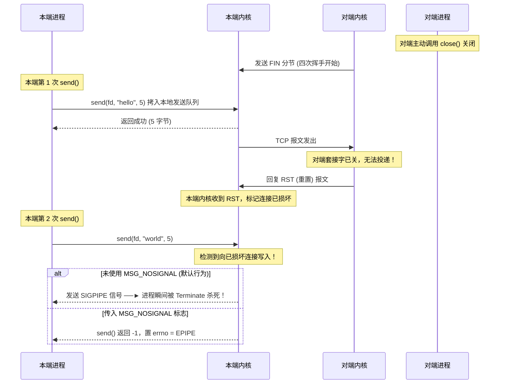
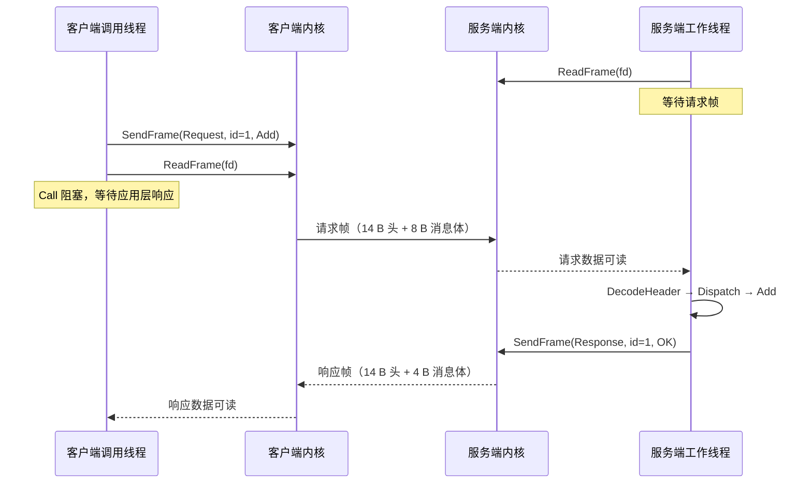
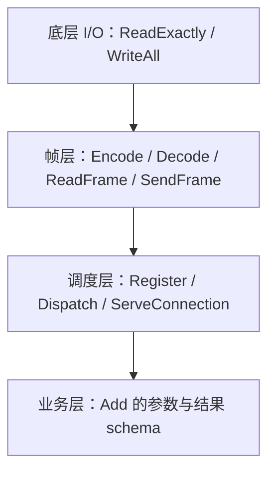

---
tags:
  - Linux
  - 网络编程基础
  - 应用层协议
  - RPC
aliases:
  - RPC Protocol Template
  - 自定义RPC协议
阅读次数: 0
---

# 7.4.1 RPC 协议模板

RPC（Remote Procedure Call，远程过程调用）让你像调用本地函数一样去调用另一台机器上的函数：客户端说「帮我执行这个操作，参数是这些」，服务端执行完，把结果或者错误送回来。

相似之处仅限于写法。网络会延迟，连接会断，请求会超时，同一个操作可能被执行两次。这些本地调用不会遇到的麻烦，调用方一个都躲不掉。

本文定义一个教学用的二进制 RPC 协议：跑在已经建好的 TCP 连接上，每帧由 14 字节固定头加变长消息体组成，再配一份单连接、串行调用的 C++20 实现。这份实现只讲三件事：协议有哪些字段，字节流怎么切成一帧一帧，什么错误该在哪一层处理。认证、加密、取消、重试、多路复用都没有，别直接搬去线上。

## 1. RPC 协议必须约定的内容

本地调用一个函数时，参数怎么传、函数在哪、返回值怎么拿回来，这些都由编译器、ABI 和调用栈替你安排好了。跨机器调用没有这些帮手，所有信息都得写进协议里。一个最小的请求-响应 RPC，至少要约定这五件事：

| 问题 | 协议中的对应机制 | 本文的具体约定 |
|:---|:---|:---|
| 调用哪项服务 | 操作标识 | 请求帧中的 16 位 `code` 解释为方法号 |
| 参数和返回值如何表示 | 消息编码规则 | `body` 保存该方法规定的字节序列 |
| TCP 字节流如何切成消息 | 帧边界 | 固定头中的 `body_len` 指定消息体长度 |
| 响应属于哪个请求 | 关联标识 | 服务端在响应中原样返回 `request_id` |
| 远端执行是否成功 | 应用层状态 | 响应帧中的 16 位 `code` 解释为状态码 |

TCP 给你的只是一条按序、可靠的**字节流**。你调用几次 `write()`，对方并不知道；服务端的业务逻辑跑没跑成功，TCP 更管不着。所以本协议里的「成功响应」只意味着一件事：服务端按协议规则生成了一个成功结果。它跟 TCP 的 ACK 是两码事，见 [[7.6 TCP协议基础]] 和 [[8.9 TCP的粘包和拆包]]。

> [!warning] 超时不等于没执行
> 客户端还没收到响应就超时、断线、或者进程挂了，此时光看网络状态，你根本判断不出服务端到底有没有开始执行、有没有执行完、有没有提交。「创建订单」「扣减库存」这类非幂等操作，绝不能闭眼重试；正确做法是业务请求带一个可持久化的幂等键，由服务端负责去重。

## 2. 线路格式与有效性规则

![[图片/SVG/3_7_7_4_1_1.svg|1240]]

### 2.1 帧格式

每一帧 = 14 字节固定头 + `body_len` 个字节的消息体。所有多字节整数一律用网络字节序（big-endian）。表里的偏移量是协议的一部分，跟 C++ 结构体在内存里怎么对齐没有半点关系。

| 偏移 | 字段 | 长度 | 请求帧含义 | 响应帧含义 |
|:---:|:---|:---:|:---|:---|
| 0 | `magic` | 2 B | 固定为 `0x5243` | 固定为 `0x5243` |
| 2 | `version` | 1 B | 固定为 `1` | 固定为 `1` |
| 3 | `type` | 1 B | `1`（Request） | `2`（Response） |
| 4 | `request_id` | 4 B | 客户端分配的非零标识 | 原样回送 |
| 8 | `code` | 2 B | 方法号 | 状态码 |
| 10 | `body_len` | 4 B | 请求体长度 | 响应体长度 |
| 14 | `body` | 变长 | 序列化后的参数 | 序列化后的结果或错误详情 |

`body_len` 上限 1 MiB。消息体长度可以是 0，比如无参数的操作，或者不带错误详情的响应。接收端要先把 14 字节头读满，检查完头字段和长度上限，再去读消息体——千万别拿某一次 `read()` 的返回值当帧边界用。

### 2.2 状态码与协议错误

| 状态码 | 名称 | 含义 | 是否返回响应 |
|:---:|:---|:---|:---:|
| 0 | `OK` | 方法已成功执行 | 是 |
| 1 | `NO_SUCH_METHOD` | 服务端未注册该方法号 | 是 |
| 2 | `INVALID_ARGUMENT` | 消息体不符合该方法的编码约定 | 是 |
| 3 | `HANDLER_ERROR` | 方法执行期间发生未预期错误 | 是 |

下面这几种情况属于**协议或传输失败**，接收端该做的是关掉连接并记下原因，而不是回一个业务错误响应：`magic`、版本号或帧类型不对；`body_len` 超限；读消息体读到一半遇上 EOF；客户端收到的响应对不上当前这次调用。走到这一步，双方已经没法确信后面的字节还能按同一套规则解释了，继续读下去只会读出垃圾。

### 2.3 本文使用的消息体示例

如果只说「`body` 里放任意字节」，那等于什么都没约定。下面的代码只注册一个方法，把消息体的字节布局说死：

| 方法号 | 名称 | 请求体 | 成功响应体 | 额外约束 |
|:---:|:---|:---|:---|:---|
| 1 | `Add` | 两个网络序 `uint32_t`，共 8 B | 一个网络序 `uint32_t`，共 4 B | 无符号加法溢出返回 `INVALID_ARGUMENT` |

真实系统一般用 Protobuf、FlatBuffers 或者受约束的 JSON 来定义消息 schema，字段怎么演进也有一套兼容规则。注意 `version` 管的只是帧头格式这一层，每个方法自己的消息兼容性还得自己设计。

## 3. 最小实现

下面的代码针对 Linux 和 C++20。建连、监听、`accept()` 不在本文范围，可参见 [[8.2 TCP服务端]]。示例里每条连接同一时刻只允许一个请求在途，所以 `RpcClient` 不是线程安全的，也不支持并发调用。

![[图片/SVG/3_7_7_4_1_2.svg|1390]]

图里的七层对应下面三小节的代码：读代码时先认准某个函数属于哪一层，再看它把什么交给下一层。底部把 `AddViaRpc(client, 3, 4)` 这一次往返的 40 个字节逐字段摊开——请求 22 字节、响应 18 字节，两帧的字段偏移完全一致，变的只有 `type`、`code` 和 `body_len` 三处取值。

### 3.1 数据结构、精确读写与编解码

`FrameHeader` 只是进程内的一个数据结构。哪怕在某个平台上 `sizeof(FrameHeader)` 恰好等于 14，也不能把整个结构体直接 `send()` 出去。编译器可能在字段之间插入 padding；多字节整数在内存中的顺序取决于主机是大端还是小端；枚举的底层表示也不应该直接拿来当线路格式。这里虽然显式把 `FrameType` 的底层类型指定为 `std::uint8_t`，仍然只是让源码里的类型更明确，并没有让整个结构体自动变成协议头。按常见对齐规则，`code` 后面可能为了对齐 `body_len` 补两个字节，`sizeof(FrameHeader)` 甚至会是 16。即使使用 `#pragma pack` 强行压成 14 字节，也只绕开了部分 padding 问题，不能替代字节序转换、固定偏移和字段校验。

这段源码把“进程内对象”和“线路上的字节”分成了几层，每层只处理自己的问题：

- `FrameHeader` 和 `Frame` 是进程内的数据模型。前者保存已经解析好的字段值，后者再把消息体挂上去，方便服务端分发、客户端校验。它们描述的是“这帧是什么”，不是“这帧在内存里应该长什么样”。
- `ReadExactly` 和 `WriteAll` 是最底层的 I/O 辅助函数。它们不理解 `magic`、`request_id` 或 `body_len`，只负责把指定数量的字节读满或写完，并处理 `EINTR`。这样上层就不用在每个收发路径里重复写短读、短写的循环。
- `EncodeHeader` 和 `DecodeHeader` 是序列化边界。它们按照协议规定的偏移量逐字段写入或读取 14 个字节，负责 `hton*`/`ntoh*`、枚举转字节以及头字段合法性检查。这里的偏移量指的是线路缓冲区中的位置，不是 `FrameHeader` 在进程内的成员偏移。`DecodeHeader` 还会在分配消息体前检查 `body_len` 上限，避免对端用一个伪造的长度诱导进程申请过大的内存。
- `SendFrame` 和 `ReadFrame` 才处理“帧”这个概念。前者先生成线路格式的头，再把头和消息体交给 `WriteAll`；后者先精确读头，解析出 `body_len`，再精确读消息体。TCP 只提供字节流，发送一次还是两次 `send()` 都不是帧边界，真正的边界只有头里的 `body_len`。
- `ProtocolError` 和 `RemoteError` 把错误分开。前者说明字节流已经不能按协议继续解释，连接通常应该关闭；后者说明对端返回了一帧合法的业务失败响应，协议还没有坏，连接可以继续使用。

```cpp
// ---- POSIX / 网络头文件 ----
#include <arpa/inet.h>   // htons/htonl/ntohs/ntohl：主机字节序 ↔ 网络字节序转换
#include <sys/socket.h>  // send()、MSG_NOSIGNAL 等 socket API
#include <unistd.h>      // read()、close() 等 POSIX I/O

// ---- C++ 标准库 ----
#include <array>            // std::array：固定长度数组，用于存放 14 字节帧头
#include <cerrno>           // errno：系统调用出错时的错误码
#include <cstddef>          // std::byte、std::size_t
#include <cstdint>          // std::uint8_t / uint16_t / uint32_t：精确宽度整数
#include <cstring>          // std::memcpy：逐字节拷贝，避免对齐和类型双关问题
#include <functional>       // std::function：用于服务端的方法处理器回调
#include <limits>           // std::numeric_limits：溢出检测
#include <optional>         // std::optional：ReadFrame 用它表示"对端已正常关闭"
#include <span>             // std::span：不拥有内存的连续视图（C++20）
#include <stdexcept>        // std::runtime_error / std::invalid_argument 等异常基类
#include <string>           // std::string / std::to_string
#include <system_error>     // std::system_error：把 errno 包装成异常
#include <unordered_map>    // std::unordered_map：方法号 → 处理器的查找表
#include <utility>          // std::move / std::pair
#include <vector>           // std::vector：变长消息体的容器

// 为字节容器起个别名，后面所有"消息体"相关的代码都用它
using Bytes = std::vector<std::byte>;

// ---- 协议常量 ----
// 魔数 0x5243 = ASCII 'R','C'（Remote Call 的缩写），
// 接收端靠它做最基本的"这是不是我们的协议"判断
// inline：保证ODR，防止头文件被多次定义
// constexpr：编译即确认的const常量
// uint16_t：两字节长的int，保证以字节流传输
inline constexpr std::uint16_t kMagic = 0x5243;

// 帧头格式的版本号，目前只有版本 1；
// 将来改帧头布局时递增，接收端据此选择解析方式
inline constexpr std::uint8_t kVersion = 1;

// 帧头固定长度：2(magic) + 1(version) + 1(type) + 4(request_id)
//              + 2(code) + 4(body_len) = 14 字节
inline constexpr std::size_t kHeaderLen = 14;

// 消息体上限 1 MiB，防止对端发一个巨大的 body_len
// 让接收端分配几个 GB 的内存——这是最基本的资源保护
inline constexpr std::uint32_t kMaxBodyLen = 1024 * 1024;

// 帧类型：区分"这一帧是请求还是响应"
// 底层类型固定为 uint8_t，在线路上占 1 字节
enum class FrameType : std::uint8_t {
    Request = 1,   // 客户端 → 服务端
    Response = 2,  // 服务端 → 客户端
};

// 响应帧中 code 字段的含义——应用层状态码
// 注意：这些状态码只出现在响应帧里；请求帧的 code 字段是方法号，含义完全不同
enum class StatusCode : std::uint16_t {
    Ok = 0,               // 方法成功执行，body 里是结果
    NoSuchMethod = 1,     // 服务端没注册这个方法号
    InvalidArgument = 2,  // 消息体不符合该方法的编码约定
    HandlerError = 3,     // 方法执行期间抛出了未预期异常
};

// 帧头的进程内表示——注意这只是一个"方便操作"的结构体，
// 绝不能直接 memcpy/send 到网络上，因为：
//   1. 编译器可能在字段之间插入填充字节（padding）
//   2. 多字节整数的存储顺序取决于 CPU 架构（大端/小端）
//   3. 未显式指定底层类型时，enum class 的表示由实现决定；
//      即使显式指定，也不能把 C++ 对象布局当成线路格式
// 必须经过 EncodeHeader/DecodeHeader 逐字段编解码
struct FrameHeader {
    std::uint16_t magic;       // 线路偏移 0：魔数
    std::uint8_t version;      // 线路偏移 2：版本号
    FrameType type;            // 线路偏移 3：帧类型（Request / Response）
    std::uint32_t request_id;  // 线路偏移 4：请求标识（非零）
    std::uint16_t code;        // 线路偏移 8：请求帧=方法号，响应帧=状态码
    std::uint32_t body_len;    // 线路偏移 10：消息体字节数
};

// 一个完整的帧 = 帧头 + 消息体
struct Frame {
    FrameHeader header;
    Bytes body;  // 长度由 header.body_len 决定，可以为空
};

// ---- 两种异常，对应两种不同严重程度的错误 ----

// ProtocolError：帧头非法、长度超限、帧内截断等——
// 连接的字节流已经不可信，调用方应关闭连接
class ProtocolError : public std::runtime_error {
public:
    using std::runtime_error::runtime_error;
};

// RemoteError：服务端正常返回了一个非 OK 的业务状态码——
// 协议本身没坏，只是这次调用在业务层失败了，连接还能继续用
class RemoteError : public std::runtime_error {
public:
    explicit RemoteError(std::uint16_t status)
        : std::runtime_error("RPC remote status=" + std::to_string(status)),
          status_(status) {}

    // 让调用方能拿到具体的状态码，决定如何处理
    std::uint16_t status() const noexcept { return status_; }

private:
    std::uint16_t status_;
};
```

#### 3.1.1 深度剖析：底层 I/O 适配与异常防御机制

![[图片/SVG/3_7_7_4_1_3.svg|1240]]

真正让 RPC 协议能在 TCP 字节流上稳定工作的基石，是 `ReadExactly` 和 `WriteAll` 对 **“部分完成（Partial I/O）”**、**“EOF 边界判定”** 以及 **“系统信号异常”** 的底层封装。

##### 1. 内核视角：为什么 TCP 通信必须处理“短读”与“短写”？
- **TCP 是无边界的字节流**：在 Linux 内核协议栈中，TCP 接收队列（`sk_receive_queue`）和发送队列（`sk_write_queue`）只负责按序排布字节流。网络分段（MSS）与 IP 分片（MTU）会导致数据切分到达，内核不会保留应用层调用 `send()` 的消息边界。
- **`read()` 的尽力而为（Best-Effort）语义**：调用 `read(fd, buf, count)` 时，`count` 仅表示用户态缓冲区的最大接收上限。只要内核接收缓冲区有数据（哪怕只有 1 字节），`read()` 就会立刻拷贝并返回实际读取字节数（**短读 Short Read**），绝不会为了等待凑满 `count` 而继续阻塞。
- **`send()` 的内核缓冲区限制**：调用 `send(fd, buf, count, ...)` 仅代表将数据拷入内核发送缓冲区。当网络拥塞或发送缓冲区可用空间不足时，`send()` 同样只拷入部分数据并返回实际写入量（**短写 Short Write**）。
- **处理原则**：**一次 `read()` 不等于一整帧，一次 `send()` 也不等于整帧发完**。调用方必须在用户态维护 `offset` 偏移量，通过循环推进直到完成目标字节数。

##### 2. 状态机视角：ReadExactly 的三种 EOF 结局判定
TCP 中的 EOF 由对端发送 `FIN` 分节触发（`read()` 返回 `0`）。`ReadExactly` 之所以将 EOF 严格分为三种结局，是因为相同的文件结束符在协议不同的阶段具有截然不同的语义：

| 状态结局                       | 触发条件                                          | 协议语义                                         | 处理动作                                     |
| :------------------------- | :-------------------------------------------- | :------------------------------------------- | :--------------------------------------- |
| **`ReadState::Complete`**  | `offset == out.size()`                        | 目标缓冲区已全部读满，读到了这帧的完整数据，TCP连接依旧存活              | 将数据交付上层解析                                |
| **`ReadState::Eof`**       | 在读取帧头时 `offset == 0` 遇到 `read() == 0`         | 对端在上一帧完整结束后**在帧边界正常优雅关闭（Graceful Shutdown）** | `ReadFrame` 返回 `std::nullopt`，外层服务循环优雅结束 |
| **`ReadState::Truncated`** | 读帧头时 `offset > 0` 遇到 EOF；或在读已由帧头声明的消息体时遇到 EOF | **帧在半途被截断**（对端崩溃或网络异常），协议流式状态机损坏             | 抛出 `ProtocolError`，直接关闭连接                |

> [!important] 消息体截断的特殊性
> 如果帧头已经成功解码且声明了 `body_len = 100`，接下来在读取消息体时，哪怕消息体的第 1 个字节都还没读到就遇到了 EOF，`ReadFrame` 也必须将其判定为 `Truncated` 而不是正常 `Eof`。因为帧头已经做出了长度承诺，此时连接断开代表整帧数据残缺。

##### 3. 操作系统信号与异常视角：EINTR 与 SIGPIPE 防御
- **`EINTR`（系统调用中断）**：当线程阻塞在 `read()` 或 `send()` 上时，若进程捕获到操作系统信号（如 `SIGALRM`、`SIGCHLD` 等），内核会中断阻塞调用并返回 `-1`，将 `errno` 设为 `EINTR`。此时 TCP 连接毫发无损，只需 `if (errno == EINTR) continue;` 无损重试。
- **`SIGPIPE` 与 `MSG_NOSIGNAL`（防进程猝死）**：
  1. 当对端已调用 `close()` 关闭连接，本端第 1 次 `send()` 会把数据写入本地发送队列并返回成功，对端收到后将回复 `RST` 报文；
  2. 若本端向已收到 `RST` 的连接执行第 2 次写入，Linux 内核默认会向本进程发送 **`SIGPIPE` 信号**；
  3. POSIX 规范中 `SIGPIPE` 的默认动作为 **Terminate（直接终止进程）**，导致服务瞬间崩溃；
  4. 传入 **`MSG_NOSIGNAL`** 标志可禁止产生该信号，让 `send()` 返回 `-1` 并置 `errno = EPIPE`。C++ 代码通过捕获 `std::system_error` 即可安全记录错误并清理连接。

###### 核心机制对比：EINTR vs SIGPIPE / EPIPE

| 维度 | `EINTR`（系统调用被中断） | `SIGPIPE` / `EPIPE`（管道破裂） |
| :--- | :--- | :--- |
| **触发原因** | 阻塞 I/O 时捕获到与该连接无关的外部操作系统信号（如 `SIGALRM`、`SIGCHLD`）。 | 试图向一个已经收到 `RST`、对端已经关闭销毁的死连接写入数据。 |
| **TCP 连接状态** | **完美存活（Healthy）**，两端协议栈状态正常。 | **彻底坏死（Broken / Closed）**，对端已不复存在。 |
| **数据是否能继续发** | **能**，无损重试即可继续传输。 | **绝不能**，写入永远无法送达。 |
| **正确处理动作** | `if (errno == EINTR) continue;`（无损重试） | **严禁 continue！** 必须停止写入，捕获异常并调用 `close(fd)` 清理连接。 |

###### 两次发送触发 SIGPIPE / EPIPE 的时序还原



> [!danger] 避坑陷阱：严禁把 `SIGPIPE / EPIPE` 当作 `EINTR` 去 `continue`
> - `EINTR` 属于可恢复的瞬态干扰，`continue` 会在下一次循环中重新阻塞或成功收发；
> - 但如果对 `errno == EPIPE` 执行 `continue` 重试，由于对端连接已死，每一次 `send()` 都会以 0 微秒耗时瞬间返回 `-1` 并置 `errno = EPIPE`。这会导致 `while (offset < input.size())` 陷入 **100% CPU 死循环（Busy-loop）**，彻底卡死工作线程！
> - 因此，`WriteAll` 中仅对 `errno == EINTR` 进行重试，遇到包括 `EPIPE` 在内的其他错误一律抛出 `std::system_error` 终止写入。


##### 4. I/O 模型边界：阻塞模式 vs 非阻塞模式
- **阻塞模式（当前实现）**：缓冲区无数据或满时线程自动睡眠，可在 `ReadExactly` / `WriteAll` 内部通过 `while` 循环同步等待完成；
- **非阻塞模式（迁移考量）**：当系统调用遇到 `EAGAIN` / `EWOULDBLOCK` 时，**严禁在 `while` 循环内盲目轮询（会导致 CPU 100% 忙等）**。必须配合 I/O 多路复用（`epoll` / `poll`）及应用层缓冲区（InputBuffer / OutputBuffer）进行事件驱动调度（参见 [[13.6 Reactor模式与EventLoop]]）。

```cpp
// ReadExactly 的三种结局
enum class ReadState {
    Complete,   // 已读满请求的全部字节
    Eof,        // 还没读到任何字节就遇到 EOF——对端在帧边界正常关闭
    Truncated,  // 读到了一部分字节后遇到 EOF——帧被截断，属于协议错误
};

// 从 fd 精确读取 out.size() 个字节到 out 中
// 为什么需要循环？因为 read() 是"尽力而为"的系统调用，
// 一次 read() 返回的字节数可以少于你请求的数量（短读），
// 只有循环读满才能保证拿到完整的一帧头 / 一帧体
ReadState ReadExactly(int fd, std::span<std::byte> out) {
    std::size_t offset = 0;  // 已经读到的字节数
    while (offset < out.size()) {
        // 从 fd 读取，写入 out 缓冲区中尚未填充的部分
        const ssize_t n = ::read(fd, out.data() + offset, out.size() - offset);

        if (n == 0) {
            // read 返回 0 表示 EOF（对端关闭了连接）
            // 如果一个字节都没读到（offset==0），说明对端在帧边界干净关闭——正常情况
            // 如果已经读了一部分（offset>0），说明帧被截断——协议错误
            return offset == 0 ? ReadState::Eof : ReadState::Truncated;
        }
        if (n < 0) {
            // EINTR：read 被信号中断，没读到任何数据，重试即可
            if (errno == EINTR) continue;
            // 其他负值：真正的 I/O 错误，把 errno 包装成异常抛出
            throw std::system_error(errno, std::generic_category(), "read");
        }
        // n > 0：成功读到 n 个字节，推进偏移量继续读
        offset += static_cast<std::size_t>(n);
    }
    return ReadState::Complete;
}

// 把 input 中的全部字节写入 fd，保证写完
// 使用 send() 而非 write()，因为 send() 支持 MSG_NOSIGNAL 标志
void WriteAll(int fd, std::span<const std::byte> input) {
    std::size_t offset = 0;  // 已经发送的字节数
    while (offset < input.size()) {
        // MSG_NOSIGNAL：当对端已关闭连接时，send 返回 EPIPE 错误，
        // 而不是发送 SIGPIPE 信号把整个进程杀死。
        // 这是 Linux 特有的标志，macOS/BSD 上用 setsockopt(SO_NOSIGPIPE) 代替
        const ssize_t n = ::send(fd, input.data() + offset,
                                 input.size() - offset, MSG_NOSIGNAL);
        if (n < 0) {
            // EINTR：被信号中断，重试
            if (errno == EINTR) continue;
            // 其他错误（包括 EPIPE）：抛异常
            throw std::system_error(errno, std::generic_category(), "send");
        }
        // send 在非阻塞模式下可能返回 0（虽然阻塞模式几乎不会），
        // 保险起见当异常处理
        if (n == 0) throw std::runtime_error("send returned zero");
        offset += static_cast<std::size_t>(n);
    }
}

// 把进程内的 FrameHeader 结构体编码为 14 字节的网络字节序字节数组
// 关键操作：htons() 把 16 位整数从主机序转为网络序（大端），
//          htonl() 把 32 位整数从主机序转为网络序，主机小端转换为网络序的大端，顺序翻转。
// 为什么用 memcpy 而不是强制类型转换？
//   因为直接写 *(uint16_t*)(out+offset) = wire 违反严格别名规则（strict aliasing），
//   属于未定义行为；memcpy 是标准规定的安全逐字节拷贝方式
std::array<std::byte, kHeaderLen> EncodeHeader(const FrameHeader& h) {
    std::array<std::byte, kHeaderLen> out{};  // 值初始化，全部清零

    // put16/put32：在 out 数组的指定偏移处写入网络序整数
    const auto put16 = [&](std::size_t offset, std::uint16_t value) {
        const std::uint16_t wire = htons(value);  // 主机序 → 网络序
        std::memcpy(out.data() + offset, &wire, sizeof(wire));
    };
    const auto put32 = [&](std::size_t offset, std::uint32_t value) {
        const std::uint32_t wire = htonl(value);  // 主机序 → 网络序
        std::memcpy(out.data() + offset, &wire, sizeof(wire));
    };

    // 按协议规定的偏移量逐字段写入
    put16(0, h.magic);                          // 偏移 0：魔数（2B）
    out[2] = static_cast<std::byte>(h.version); // 偏移 2：版本号（1B，无需转序）
    out[3] = static_cast<std::byte>(h.type);    // 偏移 3：帧类型（1B，无需转序）
    put32(4, h.request_id);                     // 偏移 4：请求 ID（4B）
    put16(8, h.code);                           // 偏移 8：方法号/状态码（2B）
    put32(10, h.body_len);                      // 偏移 10：消息体长度（4B）
    return out;
}

// 从 14 字节的网络字节序字节数组解码出 FrameHeader 结构体
// 解码的同时做完整性校验——不合法的帧头直接抛 ProtocolError
FrameHeader DecodeHeader(std::span<const std::byte> input) {
    // 首先确认输入长度，这是最基本的防御
    if (input.size() != kHeaderLen) throw ProtocolError("invalid header size");

    // get16/get32：从 input 的指定偏移处读取网络序整数并转为主机序
    const auto get16 = [&](std::size_t offset) {
        std::uint16_t wire = 0;
        std::memcpy(&wire, input.data() + offset, sizeof(wire));
        return ntohs(wire);  // 网络序 → 主机序
    };
    const auto get32 = [&](std::size_t offset) {
        std::uint32_t wire = 0;
        std::memcpy(&wire, input.data() + offset, sizeof(wire));
        return ntohl(wire);  // 网络序 → 主机序
    };

    // 帧类型校验：只接受 Request(1) 和 Response(2)
    // std::to_integer 把 std::byte 转为整数值（C++17）
    const auto type_value = std::to_integer<std::uint8_t>(input[3]);
    if (type_value != static_cast<std::uint8_t>(FrameType::Request) &&
        type_value != static_cast<std::uint8_t>(FrameType::Response)) {
        throw ProtocolError("unknown frame type");
    }

    // 用 C++20 指定初始化器（designated initializers）构造 FrameHeader
    FrameHeader h{
        .magic = get16(0),
        .version = std::to_integer<std::uint8_t>(input[2]),
        .type = static_cast<FrameType>(type_value),
        .request_id = get32(4),
        .code = get16(8),
        .body_len = get32(10),
    };
    // 逐项校验——任何一项不满足就说明这不是一个有效帧
    if (h.magic != kMagic) throw ProtocolError("unexpected magic");
    if (h.version != kVersion) throw ProtocolError("unsupported version");
    if (h.request_id == 0) throw ProtocolError("zero request_id is reserved");
    if (h.body_len > kMaxBodyLen) throw ProtocolError("body_len exceeds limit");
    return h;
}
```

发送时把头和消息体拼进同一个缓冲区一次发走；接收时仍然按协议规定分两次精确读取。这里要拎清楚一点：发一次还是发两次 `send()`，都不构成帧边界，帧边界只由 `body_len` 决定。拼缓冲区纯粹是为了少一次系统调用、让发送路径简单点。

```cpp
// 构造并发送一个完整的帧（帧头 + 消息体）
// 参数说明：
//   fd         - 已连接的 TCP socket 文件描述符
//   type       - 帧类型（Request 或 Response）
//   request_id - 请求标识，客户端分配，服务端原样回送
//   code       - 请求帧里是方法号，响应帧里是状态码
//   body       - 消息体（可以为空）
void SendFrame(int fd, FrameType type, std::uint32_t request_id,
               std::uint16_t code, std::span<const std::byte> body) {
    // 发送前校验：这些是编程错误，在发送侧就拦住，不要让非法帧流入网络
    if (request_id == 0) throw ProtocolError("zero request_id");
    if (body.size() > kMaxBodyLen) throw std::length_error("body too large");

    // 填充帧头结构体
    const FrameHeader h{
        .magic = kMagic,
        .version = kVersion,
        .type = type,
        .request_id = request_id,
        .code = code,
        .body_len = static_cast<std::uint32_t>(body.size()),
    };
    // 将帧头编码为 14 字节网络序
    const auto raw_header = EncodeHeader(h);

    // 把帧头和消息体拼进同一个缓冲区，然后一次 WriteAll 发走
    // 这样做纯粹是为了减少系统调用次数（少一次 send），
    // 不是因为"必须一次发完"——TCP 是字节流，分几次发都行，
    // 帧边界只由 body_len 字段决定，和 send 调用次数无关
    Bytes wire; // 相当于 std::vector<std::byte> wire;
	
	// 1. 预分配内存：告诉 vector 一共需要 (14 + body长度) 字节的空间
	//    好处：避免 vector 在追加数据时反复重新分配内存（realloc），提升性能
	wire.reserve(raw_header.size() + body.size());
	
	// 2. 先把 14 字节的帧头推进缓冲区
	wire.insert(wire.end(), raw_header.begin(), raw_header.end());
	
	// 3. 紧接着把消息体追加在帧头后面
	wire.insert(wire.end(), body.begin(), body.end());
	
	// 4. 调用 WriteAll，把拼好的完整一帧数据一次性发出去
	WriteAll(fd, wire);
}

// 从 fd 读取一个完整的帧
// 返回 std::optional<Frame>：
//   有值  - 成功读到一帧
//   无值  - 对端在帧边界干净关闭连接（正常 EOF）
//   抛异常 - 帧头被截断 / 消息体被截断 / 帧头校验失败
std::optional<Frame> ReadFrame(int fd) {
    // 第一步：精确读取 14 字节帧头
    std::array<std::byte, kHeaderLen> raw_header{};
    const ReadState header_state = ReadExactly(fd, raw_header);

    // 帧边界的干净 EOF：对端在上一帧结束后关闭连接，这是正常流程
    if (header_state == ReadState::Eof) return std::nullopt;

    // 帧头被截断：读到几个字节后遇到 EOF，连接在帧中间断了——协议错误
    if (header_state == ReadState::Truncated) {
        throw ProtocolError("connection closed in header");
    }

    // 第二步：解码帧头（内部会做 magic/version/type/长度 等校验）
    Frame frame{
        .header = DecodeHeader(raw_header),
        .body = {},
    };

    // 第三步：根据 body_len 分配缓冲区，精确读取消息体
    // body_len 可以是 0（无参数的请求或无详情的错误响应）
    frame.body.resize(frame.header.body_len);
    const ReadState body_state = ReadExactly(fd, frame.body);

    // 消息体被截断也是协议错误——帧头说有 N 字节，实际没读满就 EOF 了
    if (body_state != ReadState::Complete) {
        throw ProtocolError("connection closed in body");
    }
    return frame;
}
```

### 3.2 服务端分发

服务端只接受 `Request` 帧。这里要区分两类错误：查不到方法号、参数格式不对，这些是能预料到的应用错误，回一个对应状态码就行，连接照常用；帧类型不对、长度超限这些是协议错误，抛出去由连接的所有者接住并关闭连接。分开处理的意义在于，别把已经损坏的输入继续当业务数据往下喂。

```cpp
class RpcServer {
public:
    // Handler 类型：接收消息体（参数），返回消息体（结果）
    // 如果参数不合法，应抛 std::invalid_argument；
    // 其他异常会被捕获为 HandlerError
    // > Handler 是一个通用函数包装器：输入「任意长度的只读字节流切片」，输出「任意长度的全新结果字节数组」。
    using Handler = std::function<Bytes(std::span<const std::byte>)>;

    // 注册一个方法：method 是方法号，handler 是处理函数
    // 方法号 0 被保留，不允许注册
    void Register(std::uint16_t method, Handler handler) {
        if (method == 0) throw std::invalid_argument("method zero is reserved");
        handlers_[method] = std::move(handler);
    }

    // 服务一条 TCP 连接：循环读取请求帧 → 分发 → 发送响应帧
    // ReadFrame 返回 nullopt 时（对端正常关闭），循环结束
    void ServeConnection(int fd) {
        while (auto frame = ReadFrame(fd)) {
            // 服务端只处理 Request 帧；收到 Response 帧说明对端行为异常——
            // 这是协议错误，抛出后由连接的所有者关闭连接
            if (frame->header.type != FrameType::Request) {
                throw ProtocolError("server received a non-request frame");
            }
            // 分发到对应 handler 并拿到 [状态码, 响应体]
            auto [status, result] = Dispatch(frame->header.code, frame->body);
            // 原样回送 request_id，让客户端能校验"这个响应对应哪个请求"
            SendFrame(fd, FrameType::Response, frame->header.request_id,
                      static_cast<std::uint16_t>(status), result);
        }
        // 循环自然结束 = 对端在帧边界关闭了连接，连接正常结束
    }

private:
    // 根据方法号查找 handler 并调用，返回 [状态码, 响应体]
    // 这里区分两类错误：
    //   1. 应用错误（NoSuchMethod / InvalidArgument / HandlerError）
    //      → 返回状态码，连接继续可用
    //   2. 协议错误（帧类型不对等）
    //      → 在 ServeConnection 层抛异常，关闭连接
    std::pair<StatusCode, Bytes>
    Dispatch(std::uint16_t method, std::span<const std::byte> args) {
        // 查找方法号对应的 handler
        const auto it = handlers_.find(method);
        if (it == handlers_.end()) return {StatusCode::NoSuchMethod, {}};

        try {
            // 调用 handler，成功则返回 Ok + 结果
            return {StatusCode::Ok, it->second(args)};
        } catch (const std::invalid_argument&) {
            // handler 认为参数不合法（如长度不对、数值溢出）
            return {StatusCode::InvalidArgument, {}};
        } catch (...) {
            // handler 内部发生了其他未预期异常
            // 用 catch(...) 兜底，防止单个方法的 bug 导致整个服务进程崩溃
            return {StatusCode::HandlerError, {}};
        }
    }

    // 方法号 → 处理函数的映射表
    std::unordered_map<std::uint16_t, Handler> handlers_;
};
```

### 3.3 串行客户端

`Call` 先发请求，再读一个完整响应回来。这个模型下，上一次调用没完成，下一次就发不出去，所以同一条连接上不可能出现乱序响应。既然如此，为什么还要严格校验 `request_id`？一是能发现对端接错了、或者收到了上一次超时残留的响应；二是把线路格式先留稳定，将来改成多路复用时帧格式不用动。

```cpp
// 串行 RPC 客户端：同一时刻只允许一个请求在途
// 不是线程安全的——如果要多线程共享，需要外部加锁或改为多路复用模型
class RpcClient {
public:
    // 接收一个已经 connect() 成功的 socket fd
    explicit RpcClient(int fd) : fd_(fd) {}

    // 发起一次 RPC 调用：发送请求帧，阻塞等待响应帧，返回响应体
    // 参数：method = 方法号，args = 序列化后的参数
    // 返回：服务端返回的消息体（结果的原始字节）
    // 异常：ProtocolError = 协议级错误；RemoteError = 业务级错误
    Bytes Call(std::uint16_t method, std::span<const std::byte> args) {
        // 分配一个单调递增的请求 ID
        const std::uint32_t id = NextRequestId();

        // 发送请求帧：类型 = Request，code 字段 = 方法号
        SendFrame(fd_, FrameType::Request, id, method, args);

        // 阻塞读取一个完整的响应帧
        auto frame = ReadFrame(fd_);

        // 四重校验，任何一项不满足都说明连接状态已不可信
        if (!frame) throw ProtocolError("peer closed before response");
        // 客户端只应收到 Response 帧
        if (frame->header.type != FrameType::Response) {
            throw ProtocolError("client received a non-response frame");
        }
        // 校验 request_id：确认这个响应确实对应我刚才发的请求
        // 串行模型下这个校验看似多余，但能发现：
        //   1. 对端实现错误（回送了错误的 ID）
        //   2. 上一次超时残留的响应被当前调用读到了
        if (frame->header.request_id != id) {
            throw ProtocolError("response request_id mismatch");
        }
        // 业务状态码不是 OK → 抛 RemoteError，让调用方决定如何处理
        // 注意这里不是 ProtocolError——协议本身没坏，只是业务层失败了
        if (frame->header.code != static_cast<std::uint16_t>(StatusCode::Ok)) {
            throw RemoteError(frame->header.code);
        }
        // 一切正常，返回响应体（移动语义避免拷贝）
        return std::move(frame->body);
    }

private:
    // 生成下一个请求 ID：从 1 开始单调递增
    // uint32_t 溢出后回绕到 0，但 0 是保留值（协议规定 request_id 必须非零），
    // 所以跳过 0 继续用 1
    std::uint32_t NextRequestId() {
        std::uint32_t id = next_id_++;
        if (id == 0) id = next_id_++;
        return id;
    }

    int fd_;                       // 已连接的 socket 文件描述符
    std::uint32_t next_id_ = 1;    // 下一个可用的请求 ID
};
```

### 3.4 `Add` 的消息编码与调用

下面两个辅助函数把 `uint32_t` 明确编码成 4 个网络序字节。客户端和服务端共享的是这份**消息定义**，不是某个 C++ 结构体，这也是为什么不能图省事直接传结构体。

```cpp
// ---- 消息体的编解码辅助函数 ----
// 这两个函数定义了"一个 uint32_t 在线路上怎么表示"：4 字节、网络字节序
// 客户端和服务端共享的是这份"消息定义"，不是某个 C++ 结构体

// 向字节容器 out 的末尾追加一个网络序的 uint32_t
void AppendU32(Bytes& out, std::uint32_t value) {
    const std::uint32_t wire = htonl(value);  // 主机序 → 网络序（大端）
    const std::size_t offset = out.size();     // 记住当前末尾位置
    out.resize(offset + sizeof(wire));         // 扩展 4 字节空间
    std::memcpy(out.data() + offset, &wire, sizeof(wire));  // 拷贝进去
}

// 从 4 字节的视图中读出一个主机序的 uint32_t
std::uint32_t ReadU32(std::span<const std::byte> input) {
    // 严格校验：必须恰好 4 字节，多了少了都是调用方的编码错误
    if (input.size() != sizeof(std::uint32_t)) {
        throw std::invalid_argument("uint32 field must be 4 bytes");
    }
    std::uint32_t wire = 0;
    std::memcpy(&wire, input.data(), sizeof(wire));
    return ntohl(wire);  // 网络序 → 主机序
}

// Add 方法的方法号，客户端和服务端共享这个常量
inline constexpr std::uint16_t kMethodAdd = 1;

// 在服务端注册 Add 方法
// Add 的消息 schema：请求体 = 两个 uint32_t（共 8 字节），
//                    响应体 = 一个 uint32_t（共 4 字节）
void RegisterAdd(RpcServer& server) {
    server.Register(kMethodAdd, [](std::span<const std::byte> args) {
        // 校验请求体长度：两个 uint32_t = 8 字节
        if (args.size() != 8) {
            // 抛 std::invalid_argument → Dispatch 捕获后返回 InvalidArgument 状态码
            throw std::invalid_argument("Add request must contain two uint32 values");
        }

        // 从请求体中解码两个操作数
        // args.first(4)：前 4 字节 = 第一个操作数
        // args.subspan(4, 4)：从第 4 字节开始取 4 字节 = 第二个操作数
        const std::uint32_t a = ReadU32(args.first(4));
        const std::uint32_t b = ReadU32(args.subspan(4, 4));

        // 溢出检测：如果 a + b 会超过 uint32_t 上限，拒绝执行
        // 判断方法：b > MAX - a 等价于 a + b > MAX，但不会在比较时发生溢出
        if (b > std::numeric_limits<std::uint32_t>::max() - a) {
            throw std::invalid_argument("uint32 addition overflow");
        }

        // 计算结果并编码为 4 字节响应体
        Bytes result;
        result.reserve(4);
        AppendU32(result, a + b);
        return result;
    });
}

// 客户端侧的封装：把"调用 Add 方法"包装成一个普通的 C++ 函数
// 调用方看到的是 uint32_t AddViaRpc(client, 3, 4) → 7，
// 底层的序列化、网络传输、反序列化全被藏起来了——这就是 RPC 的意义
std::uint32_t AddViaRpc(RpcClient& client, std::uint32_t a, std::uint32_t b) {
    // 构造请求体：两个 uint32_t，共 8 字节
    Bytes args;
    args.reserve(8);
    AppendU32(args, a);  // 前 4 字节：第一个操作数
    AppendU32(args, b);  // 后 4 字节：第二个操作数

    // 发起 RPC 调用并等待响应
    // Call 内部会处理发送、接收、校验 request_id 和状态码
    const Bytes reply = client.Call(kMethodAdd, args);

    // 从响应体中解码结果
    return ReadU32(reply);
}

// ---- 使用示例 ----
// 服务端建立监听并 accept() 后：
// RpcServer server;
// RegisterAdd(server);                    // 注册 Add 方法
// server.ServeConnection(accepted_fd);    // 阻塞服务这条连接

// 客户端完成 connect() 后：
// RpcClient client{connected_fd};
// const std::uint32_t sum = AddViaRpc(client, 3, 4);  // 返回 7
```

一次 `Call(kMethodAdd, ...)` 的等待关系如下。注意 TCP 的确认只能证明字节被对方传输层收下了，而 `Call` 什么时候返回，取决于服务端处理完之后发回来的那个 RPC 响应帧。



图里有两个等待点，它们决定了阻塞式 RPC 的资源开销：服务端线程卡在等下一个请求，客户端线程卡在等结果。两条线程都被占着，什么也干不了。客户端这边的等待必须配一个调用级 deadline，否则对端不回你就一直挂着。如果改成事件驱动或协程实现，可读事件和计时器交给 [[13.6 Reactor模式与EventLoop]] 管理，业务线程就不用干等了。

## 4. `request_id` 与并发调用的边界

当前实现一次只发一个请求，响应自然按顺序回来，`request_id` 在这里的作用就是核对一下「这个响应确实是我这次调用的」。想在同一条连接上同时挂多个调用，要改的是**实现模型**，帧格式一个字节都不用动：

1. 发送前将 `request_id -> promise/callback/coroutine handle` 登记到待完成表；
2. 由单独的读取循环持续读取 `Response` 帧；
3. 按 `request_id` 查表并完成对应等待者；
4. 对共享连接上的写入加串行化，并为待完成表设置 deadline、上限和连接失败后的整体清理逻辑。

服务端那边也一样，得能并发执行方法、能协调多个响应的写入顺序，才谈得上「后发的请求先返回」。这不是给串行示例硬加的设定，而是另一个层级的实现工作：线程安全、背压、取消语义，一样都不能少。HTTP/2 的 stream identifier、很多消息协议里的 correlation id，干的都是同一件关联的活，但各自的生命周期和并发规则由各自协议规定。

## 5. 从模板到生产 RPC

| 本文模板       | 生产系统通常额外具备的能力          |
| :--------- | :--------------------- |
| 手写方法号与字段编码 | IDL、代码生成、schema 兼容性检查  |
| 单连接串行调用    | 连接池、多路复用、背压与流量控制       |
| 固定状态码      | 可观察的错误模型、错误详情、服务端日志与指标 |
| 调用方自行阻塞    | deadline、取消传播、限流与隔离    |
| 明文 TCP 连接  | TLS、双向认证、授权与密钥轮换       |
| 无重试策略      | 基于幂等性、错误类型和预算的受控重试     |
| 单个固定地址     | 服务发现、负载均衡与健康检查         |

拿 gRPC 举例：服务接口和消息 schema 写在 `.proto` 文件里，编码、解码、客户端桩代码全部自动生成。但它并没有消灭帧边界、关联标识和失败语义这些问题，只是把这些约定标准化，然后塞进库里替你处理。

## 6. 关键要点

1. RPC 是请求-响应协议，不是本地函数调用的等价替代；超时之后对方到底执行没执行，通常判断不出来。
2. TCP 没有消息边界，读长度前缀必须循环读，而且要给对端报来的长度设上限。
3. 线路上的字节布局必须逐字段编码，不能依赖 `sizeof`、结构体填充或本机字节序。
4. 业务错误回状态码；头部非法、长度超限、帧内截断属于连接级协议错误，直接关连接。
5. 示例里的 `Add` 把请求体和响应体的字节布局说死了，客户端和服务端照同一份 schema 解释数据。
6. `request_id` 在串行模型里用来校验，在并发模型里用来关联；想支持并发，还得配独立的读取循环、待完成表和写入协调。
7. 生产级 RPC 除了协议本身正确，还得处理 deadline、幂等性、认证、资源上限和可观测性。

## 参考资料

- W. Richard Stevens, Bill Fenner, Andrew M. Rudoff, *UNIX Network Programming, Volume 1: The Sockets Networking API*, 3rd ed., Chapters 5 and 6.
- RFC 9293, *Transmission Control Protocol (TCP)*.
- IEEE Std 1003.1-2024, `read()` 与 `send()` 的接口语义。
- Protocol Buffers Documentation, *Encoding* 与 *Updating a Message Type*。

## 7. 设计哲学：为什么这份 RPC 模板要这样写

读完实现后仍然觉得“每一行都认识，但合起来写不出来”，通常不是语法问题，而是还没有抓住代码背后的**不变量**。所谓设计哲学，就是无论以后把 `Add` 换成查询、下单还是文件传输，仍然不能被破坏的几条原则。

### 7.1 先接受现实：TCP 只给字节流，不给消息边界

RPC 想传的是“一次请求”和“一次响应”，而 TCP 只看到连续的字节。发送端调用两次 `send()`，接收端可能一次 `read()` 全部拿到，也可能分成很多次拿到；反过来，多个 `send()` 也可能在一次 `read()` 中粘在一起。

因此，**帧格式不是装饰，而是给字节流重新建立边界**：固定 14 字节头告诉接收端消息体有多长，`ReadExactly` 保证头和体都读满后才交给上层。这里的关键不是“这次发送是否一次完成”，而是“接收端能否从任意位置继续确定下一帧从哪里开始”。

> [!tip] 记忆方式
> 不要把 TCP 想成快递包裹，要把它想成一根水管。`body_len` 是水管中写在数据里的刻度，`ReadExactly` 是按刻度取水；`send()` 和 `read()` 的次数都不是边界。

### 7.2 进程内对象和线路格式必须分家

`FrameHeader` 方便 C++ 代码访问字段，但它不是协议头本身。结构体可能有 padding，整数在不同 CPU 上可能采用不同字节序，枚举的底层表示也不应成为跨机器的隐含约定。把结构体直接 `memcpy` 或 `send` 出去，等于把编译器和当前机器的实现细节偷偷写进协议。

所以这里有两个世界：

| 世界 | 关心的问题 | 对应代码 |
|:---|:---|:---|
| 进程内模型 | 如何方便地读写字段、分发业务 | `FrameHeader`、`Frame` |
| 线路上的契约 | 每个字节位于哪里、采用什么字节序 | `EncodeHeader`、`DecodeHeader`、`AppendU32`、`ReadU32` |

编解码函数就是两者之间的**防火墙**：它把“平台相关的对象布局”转换成“平台无关的协议契约”，也把对端输入的每个字段校验后才交给业务层。以后修改结构体成员顺序，不应该改变线路格式；以后升级线路格式，也不应该迫使业务代码理解字节偏移。

### 7.3 借用输入，移动输出：所有权沿着调用链单向流动

服务端收到的请求体已经存放在 `Frame::body` 中，业务处理只需要观察它，不应该再复制一份。因此 `Handler` 接收 `std::span<const std::byte>`：它表达的是“只读、连续、**不拥有**这段内存的窗口”。这个窗口不能逃出本次调用的生命周期，也不能被异步任务保存下来。

处理结果则相反：结果由业务函数新产生，需要交给发送层继续使用，所以用 `Bytes` 表达独立所有权。`Dispatch` 返回它，`SendFrame` 读取它，客户端最后用 `std::move(frame->body)` 把结果交给调用方。这里的移动不是“把字节神奇地传过去”，而是转移 `vector` 的缓冲区所有权，避免不必要的深拷贝。

可以把这条规则概括成：

```text
输入：借用（span<const byte>） ──只读观察──▶ 业务处理
输出：产生（Bytes/vector）    ──移动所有权──▶ 发送或调用方
```

这也是一个很实用的接口判断标准：**函数不会取得所有权，就用视图；函数要把结果交出去，就返回拥有资源的对象。**

### 7.4 协议坏了关连接，业务失败回响应

错误处理的核心不是“捕获越多异常越好”，而是先判断**错误属于哪一个故障域**：

| 错误类型 | 例子 | 为什么这样处理 |
|:---|:---|:---|
| 协议/传输错误 | `magic` 错、版本不支持、长度超限、帧读到一半 EOF、响应 `request_id` 不匹配 | 字节流已经无法可靠解释；继续读取可能把垃圾当成下一帧，因此关闭连接 |
| 业务错误 | 方法不存在、参数不合法、处理器执行失败 | 当前帧仍然是合法协议；返回状态码，连接可以继续服务后续请求 |

这条边界让故障具有**局部性**：一个客户端传错参数，不会拖垮整条连接；一个协议实现已经失步的客户端，也不会被“伪装成业务错误”继续放行。`ProtocolError` 和 `RemoteError` 的两个异常类型，正是把这条边界落实到 C++ 类型系统中。

### 7.5 三层职责：像搭积木一样重写

不要从 `RpcServer` 的大循环开始背代码。可以按依赖方向逐层恢复：



1. **先写水管工**：给定 fd 和缓冲区，循环处理短读、短写、`EINTR`、EOF；发送端用 `MSG_NOSIGNAL` 防止 `SIGPIPE` 终止进程。
2. **再写打包员**：固定 14 字节偏移，逐字段做网络字节序转换，并在分配 body 前校验长度上限。
3. **最后写调度员**：请求帧交给方法号对应的 handler，handler 的可预期失败转换成状态码，合法结果再封装成响应帧。

这样每一层都只有一个问题：底层不懂 RPC，帧层不懂 `Add`，业务层也不必知道 `read()` 为什么会短读。层与层之间的接口一旦稳定，剩下的代码只是把同一套不变量重复应用。

### 7.6 写不出来时，先问自己这五个问题

1. **我现在处理的是字节流、帧，还是业务对象？** 不同层不要越权。
2. **这段内存是谁拥有的，生命周期到哪里？** 借用就用 `span`，转移就用 `Bytes`/移动语义。
3. **我是否明确知道下一段数据有多长？** 不知道就还不能解析，更不能直接分配或访问。
4. **这个错误会不会让后续字节失去意义？** 会就是协议错误；不会就应该尽量留在业务层。
5. **如果把 `Add` 换成另一个方法，哪些代码仍然不该改变？** `ReadExactly`、编解码、帧校验和错误边界应该保持不变，变化的只应是方法号与消息 schema。

掌握这几条后，这份模板就不再是需要逐行背诵的 800 行代码，而是一组可以迁移到其他协议的判断规则：**先建立边界，再明确表示；输入借用、输出转移所有权；协议错误隔离连接，业务错误留在响应；每层只承担自己的职责。**
