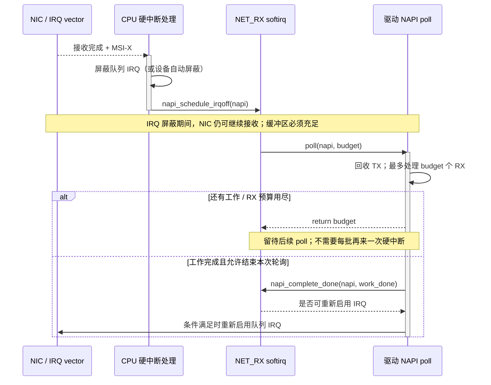
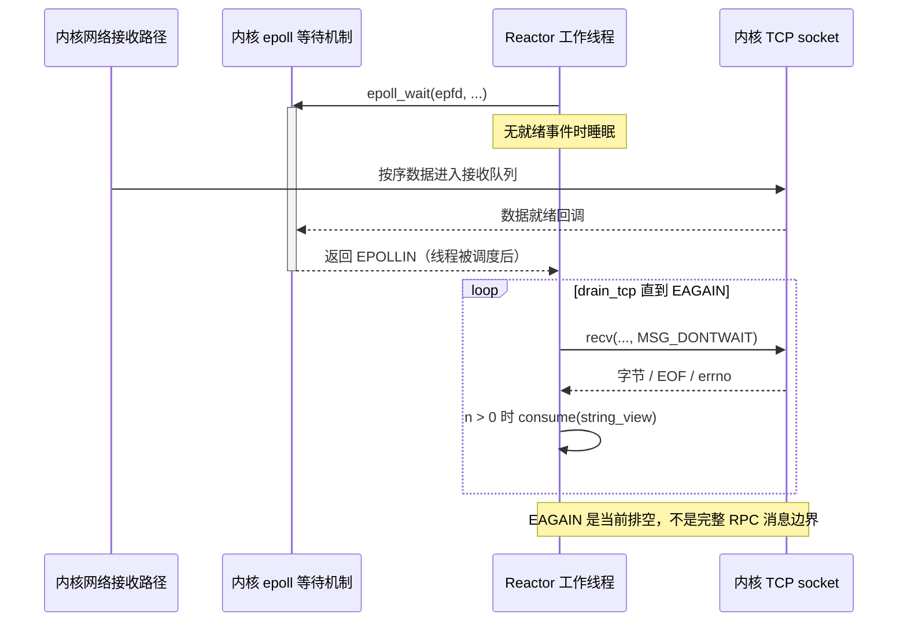

---
tags:
  - Linux
  - 高性能网络
  - RX
  - DMA
  - NAPI
  - softirq
  - sk_buff
aliases:
  - Linux RX 数据路径
  - 从网卡到 socket
  - Linux 收包路径
阅读次数: 0
created: 2026-09-11
source_baseline: Linux v6.8 源码；官方滚动文档核对于 2026-09-11
status: 预览稿
---

# 19.1 Linux RX 数据路径：NIC、DMA、RX Ring、MSI-X、NAPI、softirq 与 skb

> [!abstract] 本篇要建立的模型
> 一次普通收包不是“网卡发中断，CPU 把包搬进 socket”，而是：**驱动预先交付接收缓冲区 → NIC DMA 写入 → 驱动批量发现完成 → 协议栈处理 → socket 数据就绪 → 应用读取。**
> 阅读时一直追问四件事：**数据在哪里？谁在执行？谁持有缓冲区？现在等的是什么？**

## 1. 范围：先走通一条真实路径，再讨论变体

主线选择**物理以太网 NIC、普通内核 TCP/IP 栈、IPv4、本机已建立的 TCP 连接**，从收到数据帧讲到普通 `recv/recvmsg` 把字节交给用户缓冲区。不展开连接建立、转发、桥接、隧道、TLS、XDP 程序实现和 RDMA verbs。

机制面向现代 Linux；具体驱动示例固定到 **Linux `v6.8` 的 `ixgbe`**。固定版本是为了能够复查，不表示用户机器运行该版本，也不把 `ixgbe` 的寄存器、ring 格式和页回收方式推广到所有 NIC。官方滚动文档中的新接口，也不能直接假定在 `v6.8` 或 Ubuntu 当前安装的内核中可用。[^rx-driver][^napi]

> [!note] 与现有笔记的接口
> [[18.7 RDMA Verbs 与 CQ 非阻塞 RPC]]讨论用户态如何管理 QP/CQ 与完成事件。本篇先补上它要对照的**普通 socket 收包路径**；[[18.11 零拷贝序列化与内存传递]]解释消息表示与拷贝，本篇进一步定位普通接收侧的 user/kernel 边界。

## 2. 全路径：数据移动和执行通知不是一条线

![[图片/SVG/3_19_19_1_1.svg|900]]

图中实线表示主要的数据/处理推进，虚线表示通知与唤醒。**MSI-X 不携带整包内容；唤醒也不等于应用已经执行。** NIC 写的是驱动准备的主机内存，而不是任意用户进程的 `buf`。[^dma][^msi]

| 阶段 | 主要执行者 | 数据/控制对象 | 完成这一步还不意味着什么 |
|---|---|---|---|
| 准备接收资源 | 驱动，通常在初始化或 refill 中 | RX descriptor、DMA 映射、接收页 | 尚未收到包 |
| 收到帧并 DMA | NIC | 接收缓冲区、设备完成信息 | 尚未经过 TCP 校验与排序 |
| IRQ 通知 | CPU 的中断处理程序 | IRQ vector、NAPI 实例 | 没有逐包执行完整协议栈 |
| NAPI poll | 默认通常在 softirq 上下文 | 完成的 RX 条目、skb；可能还有 TX 完成 | 尚未证明应用可读取 |
| 协议栈与 socket | 当前网络处理上下文，或后续 backlog 处理 | TCP 状态、接收队列、乱序队列 | 应用可能还没有获得 CPU |
| `recv/recvmsg` | 应用线程进入内核 | skb 数据 → 用户缓冲区 | 一个返回值不是一条完整 RPC |

这是阶段图，不是每包固定调用链。GRO 批处理、RPS、socket 锁、busy polling、threaded NAPI 都会改变实际分支和执行上下文。[^napi][^scaling]

## 3. NIC、RX Ring 与 DMA：先交缓冲区，后收数据

### 3.1 RX Ring 主要放描述符，不等于“包数组”

典型设计中，RX descriptor ring 位于**主机可被设备 DMA 访问的内存**，由驱动设置其基址。描述符告诉 NIC 可使用的缓冲区地址、长度等信息；包的字节位于这些地址指向的接收缓冲区。NIC 自己也可能有片上 FIFO、缓存和队列状态，不能把它们与主机内存中的 ring 混为一谈。

完成通知有硬件差异：有的在原描述符上回写长度/状态，有的使用独立 completion queue。`ixgbe v6.8` 收包循环检查回写长度，再用 `dma_rmb()` 约束后续读取；因此“所有驱动都只检查 DD 位”同样不准确。[^rx-driver]

![[图片/SVG/3_19_19_1_2.svg|900]]

**“一个包对应一个 descriptor”也不是通用定律。** 一个大帧可能跨多个缓冲区；一个接收页也可能切成片段使用。环大小、buffer 大小、MTU、页大小和驱动策略共同决定映射。[^rx-driver]

### 3.2 DMA 地址不是 CPU 虚拟地址

CPU 用虚拟地址访问内存；设备使用 DMA 地址，可能经 IOMMU 映射到主机物理内存。驱动应使用 DMA API 得到 `dma_addr_t`，不能把普通指针直接塞进描述符并假定跨平台可用。

常见 RX payload 映射方向是 `DMA_FROM_DEVICE`：**从设备写向主机内存**；TX 则常见 `DMA_TO_DEVICE`。映射方向取决于设备如何访问该区域，而不是“CPU 看起来在读还是写”。XDP_TX 等复用路径可能需要不同映射策略。[^dma]

### 3.3 所有权是使用权和引用生命周期，不只是一个布尔值

| 阶段 | 谁可以做什么 | 驱动必须保证的边界 |
|---|---|---|
| 驱动准备 | 分配或取出接收页，建立映射，填 descriptor | 发布前资源真实可用 |
| 已交给 NIC | NIC 可以把接收字节写入指定区域 | CPU 不能同时把区域当稳定数据消费或覆盖 |
| 设备报告完成 | 驱动确认写回，并按 DMA API 完成必要同步 | 先确认完成/可见性，再读取 payload |
| 上交协议栈 | skb 引用全部或部分接收数据 | 不能因 ring 槽可复用就覆盖仍被引用的页 |
| 引用释放 | 页面或片段具备回收条件 | 回收、重新同步并 refill 后才可再次交设备 |

ring 槽位可以装上**另一块**缓冲区继续收包；旧缓冲区则可能仍由 skb 持有。把“descriptor 已经清理”和“旧 payload 现在可覆盖”画成同一个事件，会导致对 zero-copy 和页复用的根本误解。支持 page pool 的驱动可以降低分配、映射和回收开销，但这不是每个驱动都使用的统一实现；`ixgbe` 的示例应按自身页复用代码阅读。[^page-pool][^rx-driver]

> [!warning] coherent 不等于无需排序
> cache 可见性、CPU/设备访问顺序、缓冲区生命周期是三个问题。coherent 映射不自动保证所有描述符字段按协议顺序被设备观察；`dma_rmb/wmb` 也不能代替 streaming DMA 所需的 map/unmap 或 sync 操作。不能用 `volatile` 或普通 C++ 原子操作替代设备驱动的 DMA/MMIO 协议。[^dma]

## 4. MSI-X → NAPI：中断负责通知，不负责逐包跑完协议栈

MSI/MSI-X 是设备通过消息写入触发中断的机制。MSI-X 支持多个 vector，使多队列设备可以更细地分配中断处理；**RX queue、TX queue、IRQ vector、NAPI instance 并不强制一一对应**。常见 combined channel 会让一个 NAPI 实例服务一组 RX/TX 队列。[^msi][^napi]

在典型的 IRQ 驱动模式下，设备/驱动暂时屏蔽对应队列事件中断，调度 NAPI，随后由 poll 批量处理。这样不会要求每收到一个包就执行一次完整硬中断流程。设备的 interrupt coalescing 与 NAPI 的批处理相互配合，但不是同一个机制。[^napi]

### 4.1 一次调度的时序



图里 NIC 并没有因 IRQ 被屏蔽而停止收包。真正需要持续维持的是 **refill 和消费速度**，不是“让 CPU 每包都收到中断”。上图解释常见模式；busy polling、软件延迟 IRQ、threaded NAPI 需要按相应配置另看。[^napi]

### 4.2 budget 的三个容易混淆的口径

`poll(napi, budget)` 的 `budget` 限制这次 RX 工作。在所选普通 softirq 路径中，单次 poll 的预算通常取该 NAPI 实例的 weight；`net_rx_action` 再按各次返回的工作量扣减一轮的 `net.core.netdev_budget`，并检查 `netdev_budget_usecs`。它不是简单把“全局剩余包数”原样传给每个驱动，单轮也可能跨过全局阈值后才退出。三者都不是 RX ring 长度。[^net-sysctl][^net-core]

当仍有工作时，驱动返回 `budget` 请求继续处理。恰好处理满 `budget`、同时队列刚好为空，是需要专门遵循 NAPI 约定的边界，不能简单套用“为空就 complete”。`budget == 0` 可以用于仅处理 skb TX 完成的场景：不做 RX/page-pool/XDP 操作，也不调用 `napi_complete_done()`。这也是读驱动代码时必须保留的分支。[^napi]

对于“恰好用满预算但已无工作”，官方 API 给出的选择包括：不 complete、返回 `budget`，接受后续再 poll；或在满足结束条件后 complete，并返回 `budget - 1`。不要同时 complete 又让返回值宣称仍需继续 poll。[^napi]

## 5. softirq、ksoftirqd 与 CPU：在哪里跑，决定在哪里拥塞

softirq 是内核的延后处理机制，不是一条固定线程。普通模式下，网络工作可以在中断返回等位置执行；需要延期的工作也可能由每 CPU 的 `ksoftirqd/N` 继续执行。threaded NAPI 则使用专用线程，是另一种配置，不能与 `ksoftirqd` 混为一谈。[^softirq][^napi]

因此，观察到“应用 CPU 不高”不能推出“机器还有足够收包能力”。流量可能集中到少量 RX 队列和 CPU，而应用线程在别处运行。

| 机制 | 主要决定什么 | 不直接决定什么 |
|---|---|---|
| RSS | NIC 根据哈希/分类规则选择 RX 硬件队列 | 应用线程在哪个 CPU 上执行 |
| IRQ affinity | 某个 IRQ 由哪些 CPU 处理 | 所有后续网络处理必定留在该 CPU |
| RPS | skb 进入栈后选择协议处理 CPU | NIC DMA 时使用哪个硬件 RX 队列 |
| RFS | 尽量将协议处理靠近消费该流的应用 CPU | 不保证任意调度条件下都零迁移 |
| NUMA 放置 | NIC、缓冲区和处理 CPU 的局部性 | 不自动修复队列分配不均 |

RSS 通常按流分配，**增加队列数不等于一个 TCP 流会均匀分摊到所有 CPU**。RPS 可能引入跨 CPU 入队、IPI 与缓存迁移；它是可测量的取舍，不是开启后必然更快的开关。[^scaling]

## 6. skb：元数据和包内容分离，消除“层层复制”的错觉

`struct sk_buff` 是网络包的元数据对象，包字节在它引用的缓冲区里。它记录长度、协议、设备、校验和状态、各层头部偏移、队列关联等信息。不能把它理解为固定大小的“以太网帧结构体”。[^skb]

沿图 2 的布局理解：`head` 指向 head buffer；`data` 标识当前可见数据起点；`tail` 标识线性数据末尾；`end` 标识线性存储区末尾。常见实现中的 `tail/end` 可能按偏移保存，应通过 helper 理解，不要把示意图当字段类型声明。`skb_shared_info` 还可以引用 page frags 或其他 skb。[^skb]

去掉某一层头部，经常只是调整数据视图和偏移，而不是复制整包。`skb_clone()` 也主要复制元数据并共享数据引用；这与“深拷贝 payload”不同。另一方面，小包复制、header pull-up、线性化或驱动策略仍可能发生真实复制，所以不能把“skb 传递”写成绝对零拷贝。[^skb][^rx-driver]

`skb->len` 是当前逻辑数据总长度，`data_len` 表示非线性部分的长度；线性长度可通过 `skb_headlen()` 理解。`truesize` 用于内存开销记账，不等于线路长度或应用 payload 长度。因而“socket 缓冲额度是 1 MB”不能直接换算成“恰好装下 1 MB 用户数据”。[^skb]

GRO 在满足协议条件时把多个接收包合并为更大的逻辑处理单元，以减少上层处理开销。合并不意味着多个线上的 TCP 段变成了一条应用消息，也不意味着 NIC 本来就收到超 MTU 的以太网帧。[^offload]

> [!tip] 每提一次“包数”，先写观察位置
> 线上的帧数、RX 完成数、GRO 前后 skb 数、TCP 字节数、`recv()` 次数，是不同口径。它们不应被强行设成相等。

## 7. 从协议栈进入 socket：接收队列、乱序队列和 backlog 不一样

从 NIC 接收到 IPv4 包后，内核还需要完成链路层分类、IP 校验/路由、本地交付、TCP socket 查找与状态处理。中间还可能经过 packet tap、ingress 处理、netfilter 等分支。本篇的主线是**最终投递给本机已建立连接**，不是宣称所有包必经相同 helper。[^net-core][^ip-input][^tcp-ipv4]

### 7.1 四个“接收队列”不能混叫

| 队列 | 放在哪里 / 服务谁 | 存放的是什么 | 压力意味着什么 |
|---|---|---|---|
| RX descriptor ring | 驱动与 NIC | 描述符与缓冲区引用 | 完成清理或 refill 跟不上 |
| 每 CPU 网络 backlog | 网络核心，常见于 RPS 等路径 | 待继续进入栈的 skb | CPU 接收处理入口积压 |
| `sk_backlog` | 单个 socket | 因 socket 正被进程持锁而延后处理的输入 | 不是“用户还没 read 的正常字节队列” |
| TCP receive / out-of-order queues | TCP socket | 已可按序交付的数据 / 暂时有缺口的数据 | 应用慢，或网络乱序/丢包等，需区分 |

NAPI 直达协议栈的路径不必先经过每 CPU backlog；`net.core.netdev_max_backlog` 也不是所有 RX 路径的总缓冲上限。TCP 对 socket 锁的竞争还会改变处理发生的时机。[^scaling][^tcp-ipv4][^net-sysctl]

TCP 只向应用暴露符合其流语义的数据。后面的段先到了，但前面缺一段时，不能因为“NIC 已收到很多字节”就认为普通 `recv()` 能按完整顺序读到这些字节。UDP 则保留数据报边界，不采用 TCP 的可靠重排/重传语义。[^tcp-input][^tcp-man][^udp-man]

### 7.2 数据就绪 → epoll 就绪 → 应用执行：至少隔着调度

socket 的数据就绪回调通常唤醒等待者，并可触发 epoll 的回调/就绪通知。线程变成 runnable，不等于已经获得 CPU；应用还需要真正调用读取函数，普通路径才把数据复制到它提供的缓冲区。[^sock][^epoll-code][^recv]

`EPOLLIN` 是 readiness，不是“一条新消息已经搬进用户内存”。EOF、错误以及其他线程先行消费，都要求应用依据实际系统调用返回值处理。ET 模式常见做法是使用非阻塞读取并持续读到 `EAGAIN`；这不是协议拆包器，RPC 帧边界仍由应用解析。[^epoll][^recv]

## 8. Modern C++ 示例：收到可读事件后，读到暂时无数据

下面是**可嵌入已有 Reactor 的接收 helper**，不是完整服务端。`fd` 由调用者管理；`consume` 必须及时消费或复制收到的数据，不能保留对栈上 buffer 的 `string_view`。适用 TCP 数据接收，不把返回 `0` 推广为 UDP 的“对端关闭”。[^recv]

先准备类型与头文件，使用 C++17；头文件和类型声明没有跨主体的执行时序，因此不另画图。

```cpp
#include <array>
#include <cerrno>
#include <string_view>
#include <system_error>
#include <sys/socket.h>

enum class RxResult { Drained, PeerClosed };
```

`Drained` 表示这次已经读到 `EAGAIN`，不是“连接永久没有数据”。函数以调用级别的 `MSG_DONTWAIT` 保证不因为暂时没数据而睡眠。

```cpp
template<class Consumer>
RxResult drain_tcp(int fd, Consumer&& consume) {
    std::array<char, 16 * 1024> buffer{};
    for (;;) {
        const auto n = ::recv(fd, buffer.data(), buffer.size(), MSG_DONTWAIT);
        if (n > 0) {
            consume(std::string_view(buffer.data(), static_cast<std::size_t>(n)));
            continue;
        }
        if (n == 0) return RxResult::PeerClosed;
        const int error = errno;
        if (error == EINTR) continue;
        if (error == EAGAIN || error == EWOULDBLOCK)
            return RxResult::Drained;
        throw std::system_error(error, std::generic_category(), "recv");
    }
}
```



图揭示了代码外的等待位置：**线程通常在 `epoll_wait` 中等 readiness，而不是让 `recv(MSG_DONTWAIT)` 等网卡。** 如果应用对每个连接设置读取预算，需要把未排空连接放入自己的 ready 队列继续调度，不能在 ET 下提前停读后只等下一次边沿。示例优先展示正确性；生产环境还要防止单个持续热连接长时间占用线程。[^epoll]

## 9. 源码阅读地图：先认识入口，别背一条“万能栈”

| 阶段 | Linux `v6.8` 文件 / 入口 | 阅读时要回答的问题 |
|---|---|---|
| IRQ 与 NAPI | `drivers/net/ethernet/intel/ixgbe/ixgbe_main.c`：`ixgbe_msix_clean_rings`、`ixgbe_poll` | 谁屏蔽 IRQ？谁 complete？TX 是否在同一 poll 回收？ |
| RX 完成与 buffer | 同文件：`ixgbe_clean_rx_irq`、`ixgbe_get_rx_buffer`、`ixgbe_alloc_rx_buffers` | 何时读 completion？何时同步/复用内存？ |
| 通用接收入口 | `net/core/dev.c`：`net_rx_action`、`__netif_receive_skb_core` 及 list 路径 | budget 在哪里减？何时走 RPS/ingress？ |
| IPv4 本地交付 | `net/ipv4/ip_input.c`：`ip_rcv`、`ip_list_rcv`、`ip_local_deliver` | 本地交付和转发在哪里分叉？ |
| TCP socket 与锁 | `net/ipv4/tcp_ipv4.c`：`tcp_v4_rcv`、`tcp_v4_do_rcv` | 何时进 `sk_backlog`？ |
| TCP 排序与接收 | `net/ipv4/tcp_input.c`：`tcp_rcv_established`、`tcp_data_queue` 等 | 快路径/慢路径是否都经过同一函数？ |
| 拷贝给用户 | `net/ipv4/tcp.c`：`tcp_recvmsg`、`tcp_recvmsg_locked` | 读取何时返回、何时等待？ |
| socket → epoll | `net/core/sock.c`、`fs/eventpoll.c` | 数据就绪回调如何关联等待队列？ |

这张表是**导航入口，不是保证每包依次命中的调用栈**。GRO 批量入口可能走 list 版本；TCP 快路径可能不经过你选的慢路径探针；inline/helper 也可能无法直接挂 kprobe。源码入口用固定 tag，实际观测用运行内核的符号和 tracepoint 清单。[^rx-driver][^net-core][^ip-input][^tcp-input]

## 10. Ubuntu 观测实验：先建立证据，再改参数

> [!warning] 实验边界
> 主实验需要两台授权的测试主机，经目标物理 NIC 通信。`localhost` 不经过这张物理网卡的 RX DMA/MSI-X；VM 的 virtio 也不能当作物理 NIC 驱动证据。命令中的接口、地址需要替换。以下给出实验方案，不包含伪造的实测性能结果。

### 10.1 先拍一张不改配置的快照

使用前确认安装了相应工具。不同 NIC 不一定支持所有 ethtool 查询；`Operation not supported` 是能力信息，不代表实验失败。

```bash
IF=enp1s0                          # 改为实际接收接口
uname -r
ip -br link show dev "$IF"
ethtool -i "$IF"                   # 驱动、固件、总线位置
ethtool -l "$IF"                   # channels，不等同于完整 ring 拓扑
ethtool -g "$IF"                   # ring 配置容量，不是实时占用
ethtool -c "$IF"                   # interrupt coalescing
ethtool -k "$IF"                   # GRO/checksum 等能力与开关
ethtool -x "$IF"                   # RSS indirection，设备可能不支持
```

这些命令查询控制面状态，不是一段需要时序图的网络收发示例。它们的作用是确定“实验测的究竟是哪条路径”。把 `uname -r`、驱动/固件、MTU、channels、offload 状态写入实验报告。[^ethtool]

### 10.2 同时观察 NIC、CPU 和 socket

下面两组命令在压测前后各保存一次，并比较**增量**。不要把启动以来累计总数当作该次实验的数据。

```bash
ip -s link show dev "$IF"
ethtool -S "$IF"
grep -E 'NET_RX|NET_TX' /proc/softirqs
cat /proc/interrupts
cat /proc/net/softnet_stat
```

`ethtool -S` 的名字和口径受驱动影响；`/proc/softirqs` 的计数不是包数。`softnet_stat` 前三列在所选 `v6.8` 源码中依次是 `processed`、`dropped`、`time_squeeze`，以十六进制显示；后续列与 CPU 标识须对照运行版本，不能直接把行号当 CPU 编号。[^stats][^softnet]

```bash
ss -tinm                          # TCP 状态、队列、内存；必要时按连接过滤
nstat -asz                        # 协议计数器快照
mpstat -P ALL 1                    # 看单 CPU，不只看总平均
sysctl net.core.netdev_budget net.core.netdev_budget_usecs
sysctl net.core.netdev_max_backlog
```

`time_squeeze` 增长提示接收 softirq 遇到预算/时间限制，**不是丢包计数**。软件 backlog 的 `dropped` 也不能包办 NIC 缺缓冲、协议层丢弃和 socket 缓冲溢出的所有情况。`ss` 的 `Recv-Q` 是 socket 层观察值，不是 RX ring 实时占用。[^softnet][^net-core][^ss]

### 10.3 最小对照：单流与多流

接收机单独终端启动服务；发送机连接接收机的物理接口地址。只对自己控制的实验主机运行。

```bash
# 接收机
iperf3 -s

# 发送机：一次只运行一条测试
iperf3 -c <RX_HOST_IP> -t 30 -O 3 -P 1
iperf3 -c <RX_HOST_IP> -t 30 -O 3 -P 8
```

这是同一应用的启动参数对照，不再另画协议时序图；真实设备收发关系已在图 1 中给出。设计假设是：**若单流受某个 RX CPU 限制，而多流能分散到更多队列，多流可能提高总吞吐。** 未观察到 CPU/IRQ/queue 分布变化时，不能仅凭吞吐变化归因于 RSS；连接级 TCP 行为和 iperf3 版本/线程实现同样可能影响结果。[^iperf]

另做小请求负载时，应记录应用 p50/p99、每请求 CPU 和包率；iperf3 大流吞吐本身不能证明小 RPC 的尾延迟。

### 10.4 分层诊断表

| 观察到的证据 | 优先检查 | 不能直接得出的结论 |
|---|---|---|
| NIC 的 missed/no-buffer 类计数增长 | RX refill、驱动/NAPI 消费、IRQ/NUMA、突发 | 单凭字段名就认定唯一根因 |
| 一个 CPU 的网络处理很忙，其余空闲 | RSS 分布、单流限制、IRQ affinity、RPS | “CPU 总利用率低，所以不是 CPU 问题” |
| `time_squeeze` 增长 | 该 CPU 的接收工作量和预算竞争 | “已经发生同样数量的丢包” |
| TCP `Recv-Q` 持续增长 | 应用读取速度、工作线程调度、业务停顿 | “一定是 RX ring 太小” |
| UDP `RcvbufErrors` 增长 | socket 接收缓冲与消费者速度 | “调大 netdev backlog 就会解决” |
| 吞吐尚可但应用 p99 高 | coalescing、调度、CPU 迁移、应用排队 | “带宽没满，所以网络栈没问题” |

表中是诊断顺序，不是指标到根因的机械一一映射。调参时固定负载、记录原值、每次只改一个因素，并在隔离环境验证恢复方法；不提供脱离硬件和负载的“万能最优值”。

## 11. 和 AF_XDP、eRPC、RDMA 怎么接起来

从本篇出发学习其他数据路径，应先定位变化边界：是否继续构造 skb、是否继续进入普通 socket 队列、用户缓冲区由谁管理、完成事件允许释放哪一份资源？例如 AF_XDP 通过 XDP 与 UMEM 建立另一套缓冲区收发模型，copy/zero-copy 模式取决于驱动能力与配置；它不能简化为一个通用的“更快 recv”。[^afxdp]

[[18.13 eRPC 高性能数据路径：Zero-Copy、Credit、重传与拥塞处理]]中的自管 transport、credit 和消息缓冲区，应与这里的资源生命周期逐项对照。[[19.2 Linux TX 数据路径：sendmsg、qdisc、GSO、TX Ring、Doorbell 与 DMA|下一篇 TX 数据路径]]则把方向反过来：用户字节何时进入内核、何时成为 descriptor、何时真正允许回收。

## 12. 自测与收口

**问题 1：`epoll_wait` 返回可读时，NIC 是否刚好正在 DMA？**
不一定。DMA 可能早已结束，数据已进入 socket 队列；线程只是现在才被调度。busy-poll 模式又可能使等待/读取调用参与 NAPI 处理，必须结合配置回答。

**问题 2：把 RX ring 调大能解决应用读取太慢吗？**
不能作为一般结论。两个瓶颈位于不同层；更大 ring 可能吸收短时突发，但不能让持续落后的消费者突然获得更高处理能力，还可能增加排队。

**问题 3：NAPI 是否保证永远不使用中断？**
不保证。常见模式仍靠中断启动，再批量 poll；busy polling 和 threaded NAPI 是另外的执行选择。

**问题 4：为何 skb 引用的页没有立即回到 NIC？**
因为 ring 槽可用与旧 payload 最后一个引用释放是不同边界。必须先满足内存生命周期与 DMA 同步要求。

**问题 5：如何证明已掌握？**
在两台测试机上提交一份包含版本、NIC/驱动、队列/IRQ/CPU 对应关系、单流/多流结果、各层计数器增量和一个可证伪归因的实验记录；同时能够画出图 1，并把每条箭头说成“数据移动、控制通知或所有权交接”。

> [!summary] 一句话复述
> **NIC 把帧写入预置接收缓冲区；NAPI 批量接管完成并推进协议栈；socket 的数据就绪让应用有机会读取，而不是直接替应用完成读取。**

## Sources

以下为本篇实际使用的官方文档和固定版本源码入口。2026-09-11 的当前 Project/conversation 文件检索与列表均未返回教材，因此**未引用未实际读取的教材，也未编造书页号**。源码地图中未逐段展开的入口用于复查，不表示已对全文件逐行审计。实验方案与图示为本篇原创整理，未声称完成物理 NIC 压测。

[^rx-driver]: Linux `v6.8`，`drivers/net/ethernet/intel/ixgbe/ixgbe_main.c`。实际核对 RX 清理、IRQ/NAPI 段；`ixgbe_clean_rx_irq`、`ixgbe_msix_clean_rings`、`ixgbe_poll`。[固定版本源码](https://github.com/torvalds/linux/blob/v6.8/drivers/net/ethernet/intel/ixgbe/ixgbe_main.c)。
[^napi]: Linux Kernel Documentation，*NAPI*；Driver API、Scheduling and IRQ masking、Instance to queue mapping、Busy polling、Threaded NAPI。[官方文档](https://docs.kernel.org/networking/napi.html)。
[^dma]: Linux Kernel Documentation，*Dynamic DMA mapping Guide*；CPU and DMA addresses、consistent/streaming DMA、ownership/synchronization。[官方文档](https://docs.kernel.org/core-api/dma-api-howto.html)。
[^msi]: Linux Kernel Documentation，*The MSI Driver Guide HOWTO*。[官方文档](https://docs.kernel.org/PCI/msi-howto.html)。
[^page-pool]: Linux Kernel Documentation，*Page Pool API*；allocation、DMA synchronization、recycling。[官方文档](https://docs.kernel.org/networking/page_pool.html)。
[^softirq]: Linux `v6.8`，`kernel/softirq.c`；`__do_softirq`、`run_ksoftirqd`。[源码入口](https://github.com/torvalds/linux/blob/v6.8/kernel/softirq.c)。
[^scaling]: Linux Kernel Documentation，*Scaling in the Linux Networking Stack*；RSS、RPS、RFS。[官方文档](https://docs.kernel.org/networking/scaling.html)。
[^skb]: Linux Kernel Documentation，*struct sk_buff*；geometry、clones、shared payload。[官方文档](https://docs.kernel.org/networking/skbuff.html)。
[^offload]: Linux Kernel Documentation，*Segmentation Offloads*；GRO/GSO。[官方文档](https://docs.kernel.org/networking/segmentation-offloads.html)。
[^net-sysctl]: Linux Kernel Documentation，*Documentation for /proc/sys/net/*；netdev_budget、netdev_budget_usecs、netdev_max_backlog。[官方文档](https://docs.kernel.org/admin-guide/sysctl/net.html)。
[^net-core]: Linux `v6.8`，`net/core/dev.c`；接收入口、NAPI 和 softirq 预算。[源码入口](https://github.com/torvalds/linux/blob/v6.8/net/core/dev.c)。
[^ip-input]: Linux `v6.8`，`net/ipv4/ip_input.c`；IPv4 接收与本地交付。[源码入口](https://github.com/torvalds/linux/blob/v6.8/net/ipv4/ip_input.c)。
[^tcp-ipv4]: Linux `v6.8`，`net/ipv4/tcp_ipv4.c`；socket 查找、锁与 backlog。[源码入口](https://github.com/torvalds/linux/blob/v6.8/net/ipv4/tcp_ipv4.c)。
[^tcp-input]: Linux `v6.8`，`net/ipv4/tcp_input.c`；TCP established 数据处理与队列。[源码入口](https://github.com/torvalds/linux/blob/v6.8/net/ipv4/tcp_input.c)。
[^sock]: Linux `v6.8`，`net/core/sock.c`；socket 数据就绪与等待队列。[源码入口](https://github.com/torvalds/linux/blob/v6.8/net/core/sock.c)。
[^epoll-code]: Linux `v6.8`，`fs/eventpoll.c`；`ep_poll_callback` 等。[源码入口](https://github.com/torvalds/linux/blob/v6.8/fs/eventpoll.c)。
[^recv]: Linux man-pages，`recv(2)`。[手册](https://man7.org/linux/man-pages/man2/recv.2.html)。
[^epoll]: Linux man-pages，`epoll(7)`；readiness 与 ET 的非阻塞处理模式。[手册](https://man7.org/linux/man-pages/man7/epoll.7.html)。
[^tcp-man]: Linux man-pages，`tcp(7)`；可靠、按序、面向字节流。[手册](https://man7.org/linux/man-pages/man7/tcp.7.html)。
[^udp-man]: Linux man-pages，`udp(7)`；数据报语义与接收边界。[手册](https://man7.org/linux/man-pages/man7/udp.7.html)。
[^ethtool]: ethtool 项目手册，`ethtool(8)`；查询 channels、ring、coalescing、offload、RSS、统计。[手册](https://man7.org/linux/man-pages/man8/ethtool.8.html)。
[^stats]: Linux Kernel Documentation，*Interface statistics*；设备统计口径与驱动相关统计。[官方文档](https://docs.kernel.org/networking/statistics.html)。
[^softnet]: Linux `v6.8`，`net/core/net-procfs.c`，`softnet_seq_show`；实际核对前三列与 CPU 标识。[固定版本源码](https://github.com/torvalds/linux/blob/v6.8/net/core/net-procfs.c)。
[^ss]: iproute2 项目手册，`ss(8)`、`nstat(8)`。[ss](https://man7.org/linux/man-pages/man8/ss.8.html)；[nstat](https://man7.org/linux/man-pages/man8/nstat.8.html)。
[^iperf]: ESnet，*Invoking iperf3*；服务端、时长、omit 与 parallel 参数。[官方文档](https://software.es.net/iperf/invoking.html)。
[^afxdp]: Linux Kernel Documentation，*AF_XDP*。[官方文档](https://docs.kernel.org/networking/af_xdp.html)。
