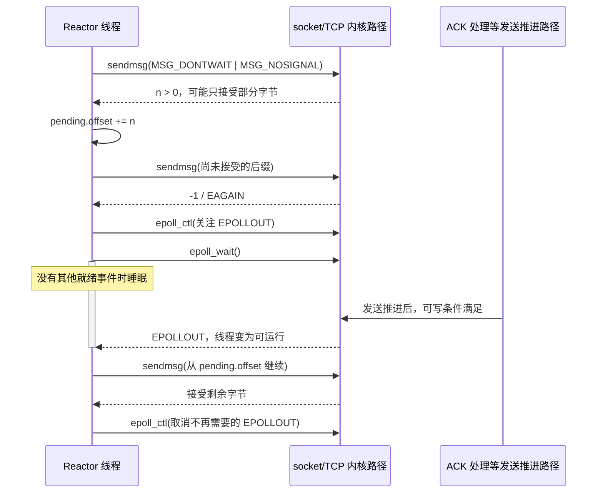

---
tags:
  - Linux
  - 高性能网络
  - TX
  - sendmsg
  - qdisc
  - GSO
  - TSO
  - DMA
  - BQL
aliases:
  - Linux TX 数据路径
  - 从 sendmsg 到网卡
  - Linux 发包路径
阅读次数: 0
created: 2026-09-11
source_baseline: Linux v6.8 源码；官方滚动文档核对于 2026-09-11
status: 预览稿
---

# 19.2 Linux TX 数据路径：sendmsg、qdisc、GSO、TX Ring、Doorbell 与 DMA

> [!abstract] 本篇要建立的模型
> 普通 TCP 发送的主线是：**应用提交字节 → TCP 组织并控制发送 → 网络层/邻居层 → qdisc/设备队列 → 驱动准备 DMA 描述符 → Doorbell 发布 → NIC 读取并发送 → 驱动回收。**
> 但“完成”不只有一种：**系统调用接受字节、设备完成、TCP 确认、业务确认**是四种不同承诺。

## 1. 范围与前置：不是把 RX 的箭头全部反过来

本篇讨论**已建立的普通 TCP socket、IPv4、本机主动发送、物理以太网 NIC**。默认没有 `MSG_ZEROCOPY`、TLS、隧道和用户态 bypass；零拷贝只在生命周期对照中出现。机制以现代 Linux 为背景，驱动实例固定为 **Linux `v6.8` 的 `ixgbe`**，不假定所有网卡采用相同寄存器、完成队列和批量策略。[^ixgbe][^driver]

[[19.1 Linux RX 数据路径：NIC、DMA、RX Ring、MSI-X、NAPI、softirq 与 skb|RX 笔记]]已解释 DMA、NAPI、skb 和通知/数据的区别。这里要补上发送侧特有的三层控制：**socket 是否还能接收字节、TCP 此刻允许发多少、网卡队列此刻还能接收多少工作。** 这三件事可能分别被不同因素阻塞。

![[图片/SVG/3_19_19_2_1.svg|900]]

图中向下的箭头是提交/处理路径；回收箭头只释放对应层的资源。一次 `sendmsg` 可以在返回前已经推进到设备，也可以只是把数据留在内核等待后续发送。因此不要把“函数返回”画成所有硬件操作开始前的统一时间分界。[^send][^tcp-code]

## 2. 从 sendmsg 开始：交的是字节，不是“已经发出的包”

### 2.1 三类返回值，三种处理责任

| 返回值 | 普通 TCP 发送的含义 | 调用方下一步 |
|---|---|---|
| `n > 0` | 本次接受了前 `n` 字节；可以是部分接受 | 推进偏移，只重试尚未接受的后缀 |
| `-1`，`EAGAIN/EWOULDBLOCK` | 非阻塞调用此刻不能继续接受数据 | 保留未发送数据，等待可写或主动调度重试 |
| `-1`，其他错误 | 如连接错误、参数错误、中断等，按 errno 处理 | `EINTR` 可重试；连接错误进入明确的失败路径 |

`sendmsg` 成功**不承诺对端已经收到**，更不承诺对端程序处理或持久化了数据。阻塞 socket 也可能返回短写；非阻塞只是“不在这里等可用空间”，不是跳过内核协议栈。[^send]

### 2.2 iovec 为什么不自动等于零拷贝

`msghdr` 中的 `msg_iov` 可以描述多段用户缓冲区。例如 RPC header 和 body 无需先拼接到一个大数组；但在本篇的普通 TCP 路径中，payload 通常仍被复制到内核管理的发送存储。网络栈可把数据放进线性区域或页片段，不能据此断言“每个 iovec 都对应一个 skb/descriptor”。[^tcp-code]

[[18.11 零拷贝序列化与内存传递]]已经区分“省掉用户态拼接”与“省掉 user→kernel 复制”。本篇定位的是这之后的路径：即使 NIC 用 DMA 从内核页读取，前面的 CPU 复制仍可能已经发生。

> [!warning] 用户缓冲区何时能改写？
> 普通复制式发送中，成功接受的前 `n` 字节不再要求原用户缓冲区保持不变；未接受的后缀必须保留。启用 `MSG_ZEROCOPY` 后不能套用这个规则：相关用户内存需按完成通知管理，不能仅凭 `sendmsg` 返回就复用。[^zerocopy]

### 2.3 系统调用次数、skb 数、线路包数不是同一计量单位

TCP 面向字节流。多个小 `sendmsg` 可能被合并组织，一次大 `sendmsg` 也可能形成多个 skb；GSO/TSO 又允许一个较大的 skb 最终形成多个线路 TCP segment。MTU 限制的是相应链路/IP 包大小，并不把应用每次 `sendmsg` 的长度强制限制为一个 MTU。[^tcp-man][^offload]

## 3. TCP 先决定“能不能发”，不是有字节就立即敲 Doorbell

### 3.1 发送存储、待发送数据与重传责任

TCP 必须记住哪些字节尚未发送、哪些已发送但尚未被确认。Linux 用发送队列、重传相关结构、序列号和 skb 引用等表示这些状态；具体组织方式随版本演进。不要把它简化为“send buffer 只有一个连续字节数组”，也不要把 TCP 保存的 payload 与驱动持有的那个 skb 指针混为一物。[^tcp-code][^tcp-output][^skb]

典型发送可以给下层创建独立的 skb 元数据，而共享 payload 存储。**驱动回收自己的 skb/引用后，TCP 仍可能为重传保留数据。** 这是后面“TX 完成不等于 TCP ACK”的内存基础，而不仅是名词区别。[^skb][^driver]

### 3.2 至少四个闸门

| 闸门 | 要保护/限制什么 | 常见线索 |
|---|---|---|
| socket 发送内存 | 当前 socket 和系统内存资源 | `sendmsg` 短写、`EAGAIN`、`ss -m` |
| 接收窗口 `rwnd` | 对端 TCP 接收能力 | window 变化、接收端消费速度 |
| 拥塞窗口 `cwnd` 与在途数据 | 网络拥塞控制 | RTT、重传、cwnd、拥塞算法状态 |
| pacing / packetization | 发送时机与批量组织 | pacing rate、qdisc、`MSG_MORE`/cork 等配置 |

这些限制并非一组固定顺序的独立函数调用。`cwnd` 通常用 segment 数量表达，`rwnd` 常按字节表达；直接对两者写 `min(cwnd, rwnd)` 而不统一单位就是错误。SACK、恢复状态、pacing 和具体算法会进一步改变发送判定。[^tcp-output][^tcp-man][^ip-sysctl]

**推理例子，不是机器实测：** 在链路速率为 25 Gbit/s、RTT 为 100 μs 的假设下，带宽时延积为 `25×10⁹÷8×100×10⁻⁶ = 312,500 B`，约 305 KiB。这说明“为了维持在途数据量需要多少窗口”与“TX ring 放多少描述符”不是同一个问题；后者还取决于分段、分片、设备格式和完成回收。

### 3.3 TX 也依赖 RX

TCP ACK 从接收路径到达，推进已确认序列号、重传清理和窗口相关状态，可能让后续发送继续。于是一个表面上的“发送吞吐低”，可能包含 ACK 处理被延迟、对端接收窗口受限等因素，不能只看 TX Ring。[^tcp-input]

### 3.4 TSQ 与 BQL 不是同一个限额

Linux 还在 TCP 发送路径中执行 TCP Small Queues（TSQ）相关检查，限制单个 socket 向下层堆积过多数据；`tcp_write_xmit` 可在 `tcp_small_queue_check` 处暂停推进。它面向单 socket 的下层占用，而第 6 节的 BQL 面向设备 TX queue 的提交/完成反馈。`cwnd`、TSQ、BQL 分别约束协议在途、单 socket 下层积压和设备队列，不能混成一个“发送窗口”。[^tcp-output][^dql]

## 4. 从 TCP 到设备：IP、邻居层与 qdisc 各管什么

### 4.1 先拿到正确的下一跳和链路层信息

在选定的 IPv4 主线中，TCP 的输出会进入 IP 输出路径，经路由结果、适用的 Netfilter hook、邻居层处理，最终调用设备发送入口。邻居信息尚未解析时可能先等待 ARP；配置了路由策略、防火墙或隧道时又会出现分支。[^ip-output]

源码导航可以从 `tcp_write_xmit`、`__tcp_transmit_skb`、`ip_queue_xmit`、`ip_finish_output2`、`dev_queue_xmit/__dev_queue_xmit` 开始。**这些是定位入口，不是宣称每个包都依次执行所有同名函数**；缓存、协议、版本与设备类型会改变具体路径。

### 4.2 qdisc 是软件调度，不是 TX Ring 的别名

qdisc（queueing discipline）提供软件排队与调度机制，具体算法决定如何进行公平调度、整形、主动队列管理等；不能把所有 qdisc 都视为普通 FIFO。多队列设备还可能在根/子 qdisc 与硬件 TX queue 之间形成层次关系。[^net-core][^qdisc][^tc]

| 层次 | 存放/表示的内容 | 谁释放压力 |
|---|---|---|
| TCP 发送与重传状态 | 字节序列、skb/页引用、协议状态 | TCP ACK、失败处理、发送推进 |
| qdisc 软件队列 | 待调度的 skb/流状态 | dequeue、调度时机、下层恢复可用 |
| 驱动 TX Ring | DMA 描述符、软件回收元数据 | NIC 完成 + 驱动清理 |
| NIC 内部 FIFO/流水线 | 设备内部排队与传输状态 | 设备发送流水线 |

qdisc 有时能在队列空、状态允许时直接运行发送，某些设备采用 `noqueue`。所以“所有包都一定在 qdisc 中等待一次”也不准确。**路径存在一个调度入口，不等于每次必有排队延迟。**[^net-core][^qdisc]

### 4.3 发送未必都在 NET_TX_SOFTIRQ 中执行

应用线程发起系统调用时，可以在其内核执行路径中推进网络发送和 qdisc 运行；遇到需要延后继续运行的 qdisc，网络 softirq 机制又可能接手。因此下面两句都不成立：

- “TX 全部由应用线程同步做完。”
- “每次 `sendmsg` 都先唤醒 `NET_TX_SOFTIRQ`，再由它发送。”

驱动 TX 完成清理还经常放在 NAPI poll 中；默认 NAPI 网络 poll 与 `NET_RX_SOFTIRQ` 相关。**`NET_RX`/`NET_TX` 名称不是按线路方向严格划分的全部 CPU 成本。**[^net-core][^qdisc][^napi][^ixgbe]

### 4.4 XPS：选队列，不是代替 qdisc

XPS（Transmit Packet Steering）让发送队列选择利用 CPU 或接收队列映射，有助于减少锁竞争并改善局部性。它决定“映射到哪个 TX queue”；qdisc 决定“如何排队/何时调度”；NUMA 决定数据和执行的内存局部性。这三者不能互相替代。[^scaling]

## 5. GSO、TSO 与 Scatter-Gather：拆开三件常被混写的事

![[图片/SVG/3_19_19_2_2.svg|900]]

### 5.1 一个大 skb 是内核表示，不是线上超大以太网帧

GSO（Generic Segmentation Offload）允许协议栈用大 skb 加上分段元数据描述多段数据。关键字段包括 `gso_type`、`gso_size`；发送路径再依据设备能力决定由软件分段，还是交给硬件完成适用的分段卸载。TSO（TCP Segmentation Offload）是 TCP 分段的硬件卸载能力；GSO 与 TSO 不是互斥的两套协议。[^offload][^net-core]

**图示只为解释分段：** 假定 MTU 1500、IPv4 头 20 B、TCP 头 20 B、无 TCP 选项与隧道、协商 MSS 未进一步降低，TCP payload 上限为 `1500−20−20 = 1460 B`。5840 B payload 就对应四段 1460 B。启用 TCP timestamp、封装或采用不同 MTU 时，应重新计算，不能把 1460 当常数。

### 5.2 两条路线，目标都是合法的线路分段

**设备不支持所需 offload：** 内核在相应验证/分段阶段把大 skb 切分成多个可发送的 skb，再交驱动。具体检查位置和函数可能随版本变化。

**设备支持相应 TSO：** 驱动把头部长度、MSS、校验和信息和 DMA 片段描述交给 NIC；NIC 在发送时生成各段应有的头部与校验和。`ixgbe` 中可以沿 TSO/context descriptor 设置与 `ixgbe_tx_map` 观察这两类信息如何分别填入。[^offload][^ixgbe]

TX skb 的 `CHECKSUM_PARTIAL` 配合校验和起点/偏移等信息，表达“校验和尚需下层按约定完成”，而不是“这个包已经算错”。驱动需要核验能力并设置硬件信息，必要时走软件帮助路径；接收侧的校验和状态要按 RX 契约另看。[^ixgbe][^offload]

这不是 IP fragmentation。TCP segmentation 生成多个 TCP segment，各自形成适用的 IP 包；IP fragmentation 则是将一个 IP 数据报拆成 IP 分片，重组层次不同。诊断时不能把二者混称“网卡把一个 IP 包随意切开”。[^ip-output][^offload]

### 5.3 Scatter-Gather 解决内存布局，不负责确定 segment 大小

skb payload 可以跨线性区域与多段页片段。Scatter-Gather DMA 让设备读取多块不连续的 DMA 地址；这不要求 CPU 先把全部数据拼成一块连续内存。一个较长内存区域也可能因为设备每个 descriptor 的长度上限而被拆成多个 descriptor。[^ixgbe][^dma]

所以需要分别计数：**应用写入次数、skb 数、DMA 区域数、descriptor 数、线路 packet 数。** 它们没有通用的一比一关系。Scatter-Gather 不等于 TSO；TSO 也不自动避免最初的 user→kernel copy。

### 5.4 为什么 tcpdump 会让人误判

抓包点若位于 TX 分段/校验和卸载之前，可能观察到大于 MTU 的软件表示，或尚未由硬件补完的校验和；RX 上的 GRO 也会影响观察到的聚合形态。判断线路上真正传了什么，应结合抓包位置、offload 状态与对端/外部抓包，而不是仅凭本机的一张截图认定“网卡违规发巨包”。[^offload][^pcap]

## 6. 驱动入口：NETDEV_TX_OK 是所有权契约，不是送达证明

### 6.1 ndo_start_xmit 接管一个什么对象

通用网络发送路径最终调用设备的 `ndo_start_xmit` 回调。驱动检查队列资源、处理必要的 offload 元数据、建立 DMA 映射并填写描述符；完成后还必须在有限时间内回收其持有的 skb，不能要求“再来一个新包才能释放旧包”。[^driver]

| 驱动结果/动作 | 所有权含义 | 不能理解成什么 |
|---|---|---|
| `NETDEV_TX_OK` | 驱动已接管该 skb 的处置责任 | 不保证实际发送，更不保证远端收到 |
| `NETDEV_TX_BUSY` | 未接管，调用方仍需持有并重试 | 不能一边保留/释放 skb，一边返回 BUSY |
| stop queue | 暂停向相关队列继续提交 | 不是关闭整个网卡，也不是终止 TCP |
| wake queue | 回收后允许继续推进提交 | 不是直接完成某个应用请求 |

正常运行应提前停队列，而不是把频繁返回 BUSY 当常态流控。内核驱动文档还强调 stop/wake 并发条件：检查可用描述符、发布停止状态、再次确认资源，必须避免“完成已经发生，但队列永久睡着”的竞态。[^driver][^ixgbe]

### 6.2 BQL：按字节约束驱动中的在途排队

BQL（Byte Queue Limits）用驱动报告的已提交与已完成字节反馈，动态调节允许压入驱动队列的数据量。其目标是在保持设备有工作可做的同时，避免大量数据无控制地滞留在驱动/设备侧，使更多排队留在软件调度可以管理的位置。它是 queue 层的控制，不是 TCP 的 `cwnd`、接收窗口或通用链路整形器。[^driver][^dql]

`ixgbe_tx_map` 中的 `netdev_tx_sent_queue` 对应提交记账，TX 清理路径更新完成记账。能否观察到 `byte_queue_limits` sysfs 项取决于内核配置、设备和驱动是否支持相应机制；目录不存在不能靠手工创建文件“启用”。[^ixgbe][^sysfs]

## 7. DMA 与 Doorbell：先让工作可见，再告诉 NIC 去取

### 7.1 DMA_TO_DEVICE 不是“CPU 把包塞进网卡”

发送侧使用 DMA API 将数据映射为设备可访问的 DMA 地址；典型方向为 `DMA_TO_DEVICE`。CPU 虚拟地址、CPU 物理地址、设备 DMA 地址并不总相同；IOMMU 和平台实现决定转换与可访问性。`dma_map_*` 还可能涉及缓存维护或 bounce buffer，不能把“调用了 DMA API”自动等同于“任何机器都没有复制”。[^dma]

在 `ixgbe v6.8` 的普通 TX 映射路径中，线性头部使用 `dma_map_single`，页片段使用 `skb_frag_dma_map`；驱动把 DMA 地址和长度写入 TX descriptors，并保存稍后解除映射与释放引用所需的软件元数据。映射失败要撤销已建立的映射并走失败清理，而不是发布半个合法请求。[^ixgbe]

### 7.2 发布顺序是硬件协议的一部分

概念顺序是：**准备 payload/映射 → 填描述符 → 满足内存可见性与顺序要求 → 发布 tail/doorbell**。驱动不能只更新 tail，然后赌 NIC 稍后才读描述符。

固定版本的 `ixgbe_tx_map` 在发布前使用 `wmb()`，随后更新软件状态，并在适当条件下 `writel(i, tx_ring->tail)`。这里仅用于说明这个驱动的实现，**不是在教所有驱动统一照抄一个 barrier**。DMA 一致性、DMA 同步、CPU 内存屏障和 MMIO 访问器各自承担不同职责，必须结合设备手册与平台 API。`volatile` 无法取代这些契约。[^ixgbe][^dma]

### 7.3 Doorbell 不承载整个 payload，也不一定每包写一次

Doorbell 通常是某种 MMIO 寄存器/设备定义的通知机制，告诉设备哪些新描述符可以消费。大部分 payload 由设备通过 DMA 读取，不是 CPU 用寄存器逐字节写入。不同 NIC 的通知结构可能不同，不能把 `tail register` 当成唯一设计。

`ixgbe` 的发送路径在 `!netdev_xmit_more()` 或队列停止等条件下写 tail，允许合并部分 doorbell 更新。批量可以摊薄通知开销，但会改变提交时机；**吞吐收益与等待时间是需要测量的权衡，不是“越晚敲越快”**。[^ixgbe]

## 8. TX 完成：回收描述符，不替 TCP 和业务层作决定

![[图片/SVG/3_19_19_2_3.svg|900]]

### 8.1 驱动在回收什么

NIC 按设备定义报告发送工作完成后，驱动清理完成项，解除适用的 DMA 映射、释放驱动引用、推进 clean 指针、更新完成统计，并在资源允许时唤醒队列。具体硬件完成的精确定义以设备规格为准；驱动必须依据能安全回收相关资源的契约行动。[^driver][^ixgbe]

RX 笔记中的 `ixgbe_poll` 同时调用 TX 清理与 RX 清理。因此“发送流量高而 NET_RX CPU 成本增长”并不自相矛盾；要把 TX reclaim 与实际接收协议栈成本分开观察。[^ixgbe][^napi]

### 8.2 四种完成，四种承诺

| 事件 | 能证明什么 | 不能证明什么 |
|---|---|---|
| 普通 `sendmsg` 返回 `n` | 本次接受前 `n` 字节；原用户缓冲的已接受前缀可复用 | 不能证明已上线路或远端收到 |
| 设备 TX 完成被驱动处理 | 对应驱动资源可按契约回收/推进 | 不能证明 TCP 已确认或业务完成 |
| TCP 累计 ACK 覆盖相应序列 | 对端 TCP 已确认该字节范围 | 不能证明远端应用读取、计算或持久化 |
| 明确定义的应用 ACK | 应用协议所约定的结果 | 未约定持久化就不能推断已落盘 |

这是一张**语义表，不是四个回调固定按行发生的时序表**。本机对 TX completion 的观察可被中断合并、poll 和调度延后，不能要求软件总在处理远端 ACK 之前先处理该包的 TX 回收；业务 ACK 的语义也必须由应用协议自己定义。[^send][^driver][^tcp-input]

> [!important] 三种“内存可以释放”也要分清
> 普通复制式发送的用户原始 buffer、驱动引用的 skb/DMA 资源、TCP 为重传保留的 payload，不是同一个所有者，也不一定在同一时刻释放。

### 8.3 MSG_ZEROCOPY 是另一套用户内存契约

开启 `SO_ZEROCOPY` 后，应用可以在适合的发送上使用 `MSG_ZEROCOPY`，并从 socket error queue 读取相关完成通知。它可能发生复制回退；完成通知用于确定该批用户内存何时可复用，**不是远端业务成功通知，也不能直接当作逐包硬件 CQE**。[^zerocopy]

具体错误队列解析、发送计数和完成区间管理留在[[18.11 零拷贝序列化与内存传递]]；本篇只给出它应插入的生命周期位置，避免复制粘贴另一篇的整套实现。

## 9. C++17 示例：短写、EAGAIN 与 EPOLLOUT 的正确职责

下面用**拥有数据的发送状态**保存尚未提交的后缀。代码仅针对已连接 TCP、普通复制式非阻塞发送，不承接 `MSG_ZEROCOPY` 内存通知，不处理 TLS。调用方负责 socket 生命周期，并保证同一发送状态不会被多个线程并发修改。

先准备头文件与状态；`std::string` 持有内容，`offset` 记录被内核接受的位置，避免临时 `string_view` 在等待 EPOLLOUT 时悬空。

```cpp
#include <sys/socket.h>
#include <sys/uio.h>
#include <cerrno>
#include <cstddef>
#include <stdexcept>
#include <string>
#include <system_error>

struct PendingSend {
    std::string bytes;
    std::size_t offset = 0;
};
```

这段仅声明资源，不存在跨线程时间关系。发送函数中的 `sendmsg` 使用一段 iovec 是为了聚焦**提交进度**；扩展为 header/body 多段 iovec 时，仍必须准确推进跨段偏移，而不是简单重发整条消息。

```cpp
bool flush_tcp(int fd, PendingSend& pending) {
    if (pending.offset > pending.bytes.size())
        throw std::logic_error("invalid send offset");
    while (pending.offset < pending.bytes.size()) {
        iovec part{pending.bytes.data() + pending.offset,
                   pending.bytes.size() - pending.offset};
        msghdr msg{};
        msg.msg_iov = &part;
        msg.msg_iovlen = 1;
        const auto n = ::sendmsg(fd, &msg, MSG_DONTWAIT | MSG_NOSIGNAL);
        if (n > 0) {
            pending.offset += static_cast<std::size_t>(n);
            continue;
        }
        if (n == 0) throw std::runtime_error("sendmsg made no progress");
        const int error = errno;
        if (error == EINTR) continue;
        if (error == EAGAIN || error == EWOULDBLOCK) return false;
        throw std::system_error(error, std::generic_category(), "sendmsg");
    }
    return true;
}
```



图揭示的是：**EPOLLOUT 用来重试向 socket 提交，不是报告这次 RPC 已发到远端。** `flush_tcp` 返回 `true` 只说明该状态中的字节已经全部被接受。`MSG_NOSIGNAL` 防止此调用引发 SIGPIPE，错误仍通过返回值/errno 处理。[^send][^epoll]

生产 Reactor 还应给每连接设置公平性预算，不能让一个持续可写的大连接独占循环。使用 ET 时，若主动在 EAGAIN 之前因预算退出，必须将仍有工作的连接留在本地 ready 队列或实现明确的重调度，不可完全依赖未来出现新的边沿。LT 模式下也应在无待发数据时取消不必要的 EPOLLOUT 关注，避免空转。

## 10. 源码阅读地图：从所有权问题倒着查

| 问题 | 固定版本源码入口 | 阅读时标注什么 |
|---|---|---|
| 用户字节怎样组织进 TCP 发送存储 | `net/ipv4/tcp.c`，`tcp_sendmsg_locked` | copy/页引用、内存不足、返回字节数 |
| 何时允许发送下一批 | `net/ipv4/tcp_output.c`，`tcp_write_xmit` | cwnd、窗口、pacing、skb 状态 |
| TCP 如何向下层交出 skb | 同上，`__tcp_transmit_skb` | clone/共享 payload、协议头、发送回调 |
| 怎样进入邻居层和设备 | `net/ipv4/ip_output.c` | route、hook、neighbor、output |
| qdisc 与驱动回调在哪里连接 | `net/core/dev.c`、`net/sched/sch_generic.c` | queue 选择、bypass、dequeue、重调度 |
| DMA 和 Doorbell 的顺序 | `ixgbe_main.c`，`ixgbe_tx_map` | mapping、desc、`wmb`、`writel` |
| 描述符何时能再次使用 | 同上，`ixgbe_clean_tx_irq`、`ixgbe_poll` | 完成状态、unmap、释放、wake |
| 为重传留下的数据何时不再需要 | `net/ipv4/tcp_input.c` | ACK 范围、重传清理、引用释放 |

阅读驱动时务必配合同一型号硬件手册；源码中的 status 位和 doorbell 语义不是跨 NIC 的公共 ABI。本表是导航地图，不是每包函数调用的稳定接口，也不表示已逐行审计整套协议栈。[^tcp-code][^tcp-output][^net-core][^qdisc][^ixgbe]

## 11. Ubuntu 实验：先找队列，再测成本，不盲调缓冲

### 11.1 只读记录：不要从 loopback 推断物理 NIC

以下命令不修改队列、offload 或 sysctl。先用 `ip -br link` 选择实际测试接口；物理机、虚拟机和容器可见的层次不同，部分查询返回不支持是正常现象。不要把 virtio/veth 的结果当作某块物理 NIC 的 PCIe 行为。

```bash
ip -br link
IF=enp3s0                   # 改成实际测试接口
uname -r
ethtool -i "$IF"
ethtool -k "$IF"
ethtool -g "$IF"
ethtool -l "$IF"
tc -s qdisc show dev "$IF"
ip -s link show dev "$IF"
ethtool -S "$IF"
ss -tinm
```

`-k` 看 offload 能力/当前设置；标记 `[fixed]` 的特性不能随意改变。`-g` 看到的是 ring 参数，不是实时填充量；`tc -s` 的 backlog 是软件 qdisc 口径，不是 NIC FIFO 占用。`ss` 则从 socket/TCP 侧观察发送内存、队列、RTT 与窗口等。必须记录**测试前后增量和具体字段含义**，不能把各层累计包数直接相减当作准确丢包数。[^ethtool][^tc][^ss][^stats]

下面只读 TX queue 的 BQL 状态。先确认目录存在，防止把设备不支持误判为“限额是 0”。

```bash
for q in /sys/class/net/"$IF"/queues/tx-*; do
    [ -d "$q/byte_queue_limits" ] || continue
    echo "== $q =="
    for item in limit limit_min limit_max inflight; do
        file="$q/byte_queue_limits/$item"
        [ -r "$file" ] && printf '%s: ' "$item" && cat "$file"
    done
done
```

这些文件只反映相应接口公开的队列控制状态，不是抓取单个 TCP 连接的包；瞬时采样还可能错过突发。脚本以本机公开字段为准，并不保证每个内核版本都提供所有项。[^sysfs]

### 11.2 最小对照矩阵

对自己控制的两台测试机建立物理路径，保持应用、CPU 绑定策略、MTU、链路、数据量和测量时长一致。先固定当前 offload，不要一上来全关。

| 对照 | 观察 | 可以检验的假设 |
|---|---|---|
| 单连接大流 vs 多连接大流 | 吞吐、每 CPU 使用率、TX queue 分布 | 是否有单流/单核/队列局部瓶颈 |
| 小消息 vs 大消息 | 请求/秒、每请求 CPU、p50/p99 | 批量收益是否以等待时间为代价 |
| offload 原配置 vs 单项可控变化 | CPU、吞吐、抓包形态、尾延迟 | 分段工作是否从 NIC 转到 CPU |
| 相同大流下加入小请求 | qdisc backlog、小请求 p99 | 驱动/软件排队是否影响交互延迟 |

若要改动 TSO/GSO、qdisc、ring 或 IRQ，**只在隔离实验机进行**，事先记录原值、确定依赖关系和完整恢复步骤，每轮仅改变一个因素。这里不提供可能扰动远程连接的“一键网络优化脚本”。

iperf3 可用于固定时长、连接数的大流对照；但它不替代应用级小请求延迟测试。每轮至少保存应用结果、设备统计增量、qdisc 统计、socket 信息和 CPU 分布，重复实验以区分稳定变化和噪声。[^iperf]

### 11.3 看到这些现象时，先分层

| 现象 | 优先排查 | 不应直接采用的解释 |
|---|---|---|
| `sendmsg` 频繁 EAGAIN | socket 发送内存、对端窗口、ACK、应用生产速度 | “TX Ring 一定满了” |
| qdisc backlog 长期增长 | 调度/整形配置、下层 drain 速度、竞争流 | “需要无上限扩大 ring” |
| TX timeout / queue 停滞 | 驱动完成、IRQ/NAPI、设备状态、队列唤醒 | “TCP ACK 慢所以驱动不应回收” |
| 关 TSO 后 CPU 明显升高 | 软件分段成本、包率、核分布 | “TSO 就是绕过 TCP 协议栈” |
| 本机抓包大包/校验和异常 | 抓包点与 offload | “线上一定发了坏包” |
| 吞吐不错但小请求 p99 恶化 | 批量等待、qdisc/设备排队、CPU 调度 | “链路利用率高说明全部健康” |

**另一个仅用于量纲检查的例子：** 以 10 Gbit/s 持续服务某队列，若有 1 MB 数据在你前面，仅串行发送这些数据的时间约为 `1,000,000×8÷10¹⁰ = 0.8 ms`。这不是某网卡的实测排队时延；它只解释为什么“增大队列能吸收突发”与“增大队列不会影响延迟”不能同时无条件成立。

## 12. 自测与收口

**问题 1：普通 `sendmsg` 返回 4096，能立即重用原缓冲区吗？**
本篇复制式前提下，可以复用被接受的这 4096 字节；但不能说对端已收到。若使用 `MSG_ZEROCOPY`，必须遵守另一套完成通知契约。

**问题 2：为什么一次大 skb 可能对应多个 descriptor，又产生更多或更少的线路包？**
因为内存布局/descriptor 长度限制决定 DMA 描述方式，GSO/TSO/MSS 决定线路分段；两者是不同维度。

**问题 3：为什么 TX 完成不能立即删掉全部 TCP 重传数据？**
它只结束设备/驱动这一侧的使用；未被 TCP 确认的 payload 仍可能需要重传，生命周期由其他引用与协议状态控制。

**问题 4：为什么 EPOLLOUT 一直触发，却不能证明业务成功？**
因为它反映本机 socket 可写条件；业务成功要等待应用协议定义的响应，甚至还要区分“已接收”“已执行”和“已持久化”。

**问题 5：为什么继续学 RDMA/DPDK 前要学这条路径？**
只有明确 socket、TCP、qdisc、DMA、descriptor 和完成分别承担什么责任，才知道 bypass 绕过哪些层，以及上层需要接回哪些流控、可靠性和内存管理责任。

> [!summary] 一句话复述
> **sendmsg 接受字节，TCP 决定发什么和何时发，qdisc/驱动组织下发，Doorbell 发布工作，NIC DMA 读取并发送，完成只按对应层的契约释放资源。**

## Sources

本篇使用官方文档与固定版本源码建立机制和导航地图；未声称它是某台 Ubuntu 主机的实际调用栈，也未声称已完成物理 NIC benchmark。当前 Project/conversation Sources 检索未返回教材，故未引用未读取的教材或虚构页码。所有数值算例均在正文明确了假设。

[^send]: Linux man-pages，`send(2)`；返回值、部分接受、flags、无送达保证。[手册](https://man7.org/linux/man-pages/man2/send.2.html)。
[^tcp-man]: Linux man-pages，`tcp(7)`；字节流与 TCP socket 语义。[手册](https://man7.org/linux/man-pages/man7/tcp.7.html)。
[^tcp-code]: Linux `v6.8`，`net/ipv4/tcp.c`；`tcp_sendmsg_locked`。[固定版本源码](https://github.com/torvalds/linux/blob/v6.8/net/ipv4/tcp.c)。
[^tcp-output]: Linux `v6.8`，`net/ipv4/tcp_output.c`；发送条件、skb clone、向 IP 输出。[源码入口](https://github.com/torvalds/linux/blob/v6.8/net/ipv4/tcp_output.c)。
[^tcp-input]: Linux `v6.8`，`net/ipv4/tcp_input.c`；ACK 与重传队列处理。[源码入口](https://github.com/torvalds/linux/blob/v6.8/net/ipv4/tcp_input.c)。
[^ip-output]: Linux `v6.8`，`net/ipv4/ip_output.c`；IP 输出、邻居层、fragmentation。[源码入口](https://github.com/torvalds/linux/blob/v6.8/net/ipv4/ip_output.c)。
[^ip-sysctl]: Linux Kernel Documentation，*IP Sysctl*；TCP 发送、pacing 与内存相关设置。[官方文档](https://docs.kernel.org/networking/ip-sysctl.html)。
[^skb]: Linux Kernel Documentation，*struct sk_buff*；shared data、clones、TCP payload 保存。[官方文档](https://docs.kernel.org/networking/skbuff.html)。
[^offload]: Linux Kernel Documentation，*Segmentation Offloads*。[官方文档](https://docs.kernel.org/networking/segmentation-offloads.html)。
[^pcap]: Wireshark 项目 Wiki，*CaptureSetup/Offloading*；抓包点与分段、校验和卸载。[项目文档](https://wiki.wireshark.org/CaptureSetup/Offloading)。
[^dma]: Linux Kernel Documentation，*Dynamic DMA mapping Guide*。[官方文档](https://docs.kernel.org/core-api/dma-api-howto.html)。
[^driver]: Linux Kernel Documentation，*Network devices*；Transmit path、queue stop/wake、skb ownership。[官方文档](https://docs.kernel.org/networking/driver.html)。
[^ixgbe]: Linux `v6.8`，`drivers/net/ethernet/intel/ixgbe/ixgbe_main.c`；实际核对 `ixgbe_tx_map`、`ixgbe_poll` 等段落，导航包括 TSO 与 TX 清理。[固定版本源码](https://github.com/torvalds/linux/blob/v6.8/drivers/net/ethernet/intel/ixgbe/ixgbe_main.c)。
[^net-core]: Linux `v6.8`，`net/core/dev.c`；`__dev_queue_xmit`、发送验证与调度入口。[固定版本源码](https://github.com/torvalds/linux/blob/v6.8/net/core/dev.c)。
[^qdisc]: Linux `v6.8`，`net/sched/sch_generic.c`；dequeue、direct xmit、qdisc run/reschedule。[固定版本源码](https://github.com/torvalds/linux/blob/v6.8/net/sched/sch_generic.c)。
[^dql]: Linux `v6.8`，`lib/dynamic_queue_limits.c`；自适应队列限额实现与注释。[源码](https://github.com/torvalds/linux/blob/v6.8/lib/dynamic_queue_limits.c)。
[^sysfs]: Linux `v6.8`，`net/core/net-sysfs.c`；TX queue 的 BQL sysfs 属性。[源码](https://github.com/torvalds/linux/blob/v6.8/net/core/net-sysfs.c)。
[^napi]: Linux Kernel Documentation，*NAPI*；RX/TX poll、budget 与执行上下文。[官方文档](https://docs.kernel.org/networking/napi.html)。
[^scaling]: Linux Kernel Documentation，*Scaling in the Linux Networking Stack*；XPS。[官方文档](https://docs.kernel.org/networking/scaling.html)。
[^zerocopy]: Linux Kernel Documentation，*MSG_ZEROCOPY*；通知与用户内存生命周期。[官方文档](https://docs.kernel.org/networking/msg_zerocopy.html)。
[^epoll]: Linux man-pages，`epoll(7)`。[手册](https://man7.org/linux/man-pages/man7/epoll.7.html)。
[^ethtool]: ethtool 项目，`ethtool(8)`。[手册](https://man7.org/linux/man-pages/man8/ethtool.8.html)。
[^tc]: iproute2 项目，`tc(8)`；qdisc 与 statistics。[手册](https://man7.org/linux/man-pages/man8/tc.8.html)。
[^ss]: iproute2 项目，`ss(8)`。[手册](https://man7.org/linux/man-pages/man8/ss.8.html)。
[^stats]: Linux Kernel Documentation，*Interface statistics*。[官方文档](https://docs.kernel.org/networking/statistics.html)。
[^iperf]: ESnet，*Invoking iperf3*。[官方文档](https://software.es.net/iperf/invoking.html)。
