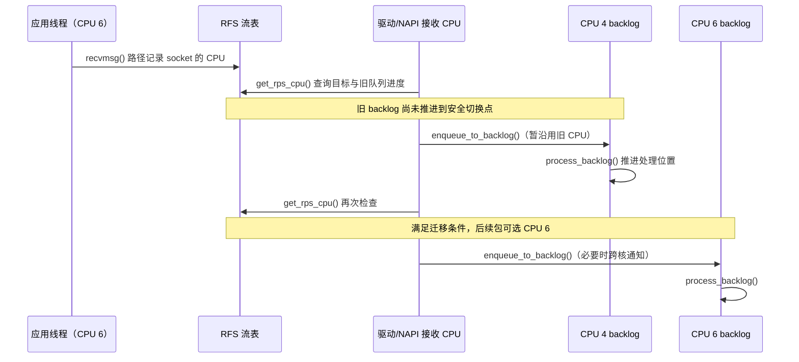

---
tags:
  - Linux
  - 高性能网络
  - NUMA
  - RSS
  - 性能调优
aliases:
  - 19.3 多队列网卡与 CPU/NUMA 亲和
  - RSS、RPS、RFS、XPS 与 IRQ Affinity
status: 待确认
created: 2026-09-11
updated: 2026-09-11
阅读次数: 0
---

# 19.3 多队列网卡与 CPU/NUMA 亲和：RSS、RPS、RFS、XPS 与 IRQ Affinity

> **高性能网络调优不是把所有“负载均衡”开关打开，而是明确每一段工作的执行者，再让队列、CPU、内存和设备的高频访问尽量保持局部性。**
>
> RSS 决定接收队列，IRQ Affinity 约束中断投递 CPU，RPS/RFS 可以改变上层收包处理 CPU，XPS 参与选择发送队列。它们既不是同一个开关，也不自动把应用线程和物理内存一起搬过去。[^scaling][^irq][^numa]

## 1. 本篇解决什么问题

假设服务器装有一张高速网卡，却出现“网口没跑满，某个 CPU 已经很忙”的现象。先不要直接增加队列、绑满全部逻辑 CPU，或者开启 RPS。应先确定：**流量进入了哪个硬件队列，哪个 CPU 在收描述符，哪个 CPU 在执行协议栈，哪个线程在消费 socket，内存又在哪里。**

本篇讨论的是 Linux 普通 TCP/UDP socket 数据路径中的多核分工。原生 XDP、AF_XDP、硬件 RDMA 和 DPDK 都可能改变路径，不能把这里的全部开关原封不动地套过去。RDMA/DPDK 的可迁移原则与不可迁移接口放在第 11 节。

理解“线程位置不等于内存位置”，先看 [[0.5 NUMA CPU 亲和性与内存亲和性]]；理解“中断发生不等于应用线程立即得到 CPU”，看 [[0.6 Interrupt Busy Polling 与 Context Switch]]。本篇只补网络队列与这些基础之间的映射，不重复讲完整 RX/TX 驱动路径。

> [!note] 环境与证据边界
> 以 Linux 主线文档描述的通用机制为基线。网卡型号、驱动、内核配置、固件、虚拟化环境会改变功能支持和映射方式。以下命令用于 Ubuntu/Linux 实验机，接口名、CPU、IRQ 均须替换；示例数值不是推荐生产配置，也不是本机实测结果。

## 2. 先分清五个“选择器”

![[图片/SVG/3_19_19_3_1.svg|900]]

**读图：实线表示基本交接，虚线表示可选的软件转交。** RSS 只把包放进某个接收队列；后续 IRQ、软件转发和线程调度才决定各段代码在哪里运行。图中的队列—向量—CPU 一一对应，是为了讲解而设的示例，不是硬件或 Linux 的普遍保证。“桶 0 / 4 → Q0”表示两个桶映射同一队列，不表示同一稳定流在两个桶之间轮转。[^scaling][^napi]

| 机制 | 主要输入 | 选择的对象 | 没有替你完成的事情 |
| --- | --- | --- | --- |
| RSS：Receive Side Scaling | 硬件可识别的报文头字段、哈希、重定向表 | RX 硬件队列 | 不直接指定应用 CPU，不把一个 TCP 流拆到所有队列 |
| IRQ Affinity | 某个 IRQ 的允许 CPU 集合 | 硬件中断可投递的 CPU | 不保证整个协议栈或应用都在该 CPU |
| RPS：Receive Packet Steering | 软件流哈希、目标 CPU 位图 | 后续接收处理的 CPU/backlog | 不迁移硬中断，不免除原 CPU 上的驱动收包工作 |
| RFS：Receive Flow Steering | 流状态、应用最近处理 socket 的 CPU | 更接近应用的接收处理 CPU | 不移动应用线程，不迁移 DMA 缓冲区 |
| XPS：Transmit Packet Steering | 发送 CPU，或关联的 RX 队列 | TX 队列 | 不负责调度线程，也不负责设定 TX 完成中断 CPU |

这张表描述典型职责，而不是说一个包只会经过其中一个机制。RSS 后面仍然可以接 RPS/RFS；XPS 则位于发送侧。[^scaling]

还要区分三种数量：**队列数量**决定有多少并行服务通道，**Ring 深度**决定每个通道能容纳多少待处理项，**worker 数量**决定应用有多少执行者。增加 Ring 深度不会凭空增加处理能力，增加 worker 也不会自动让 RSS 将单流均匀拆开。

## 3. RSS：从“包头”映射到“硬件队列”

### 3.1 典型过程：哈希不是直接取 CPU 编号

网卡按照当前配置提取字段，计算哈希，再使用重定向表选择 RX 队列：

```text
报文头字段 → RSS hash → indirection table 中的桶 → RX queue
```

常见 TCP/UDP 情况使用地址、端口等字段；网卡可能采用 Toeplitz 等哈希。实际参与哈希的字段、对称 RSS、隧道内层/外层解析、独立 RSS context 或硬件流规则，都依赖设备和驱动。不能仅凭“五元组”三个字，就推断所有协议、分片和隧道包具有相同分流行为。[^scaling]

**重定向表的作用是把很多哈希桶映射到较少的队列。** 例如 128 个桶映射到 8 个队列；修改桶分布，可以改变流量落到各队列的概率，但不意味着理解了每条流的业务成本。

### 3.2 为什么一条连接跑不满，八条连接却可以

在哈希字段和配置稳定时，同一流通常落到同一 RX 队列。这样更容易保留流内顺序，也减少同一连接状态在多个 CPU 之间来回传递。代价是：一个“大象流”可能把单个队列或一个执行核心压满，而其他队列仍然空闲。[^scaling]

因此应该区分两个问题：

| 观察 | 优先检查 |
| --- | --- |
| 单连接吞吐低，多连接明显改善 | 单流队列、单核协议栈、应用线程、TCP 窗口或发送端上限 |
| 多连接仍集中在少数队列 | RSS 表、有效哈希字段、隧道解析、硬件流规则、工作负载分布 |
| 队列包数均匀，CPU 使用率不均匀 | 报文处理成本差异、其他任务、CPU 频率、NUMA、SMT 共享 |

“流数均匀”“包数均匀”“字节数均匀”“CPU 时间均匀”不是同一件事。优化的目标也不是让监控图完全对称，而是避免瓶颈资源饱和，并满足业务 SLO。

### 3.3 队列开到最大未必更快

更多 RX 队列可以增加并行度，但也会增加队列状态、缓冲资源和可能的中断来源；在启用中断合并时，流量被摊到更多低负载队列，还可能改变每队列的批量效果。应从**足以避免单队列饱和的队列数**开始对照测试，而不是把“最大 combined channels”当成最佳值。[^scaling]

`ethtool -l` 中的 channel，是围绕中断及其服务队列的配置概念。一个 combined channel 常同时服务 RX/TX；它不等于“两条完全独立的接收通路”。队列、NAPI 实例、MSI-X 向量之间常有近似对应关系，但必须查看真实驱动映射。[^napi]

## 4. IRQ Affinity：先找对中断，再谈绑核

### 4.1 为什么绑了 IRQ，业务仍可能跑到别的核

典型 NAPI 路径中，IRQ 处理程序调度 NAPI，接收工作随后在相应上下文中推进。但 RPS 可以把上层处理转交给别的 CPU，应用线程还有独立调度策略；threaded NAPI、busy polling 等模式也会改变执行上下文。**IRQ 的位置只是路径上的一个点。**[^napi]

MSI-X 允许设备使用多个中断向量，但不要假定“IRQ 号等于队列号”，也不要只用接口名在 `/proc/interrupts` 中搜索：驱动可能使用 PCI 地址、驱动内部名称或组合队列名称。

### 4.2 只读建立拓扑基线

下面先记录设备身份、CPU 拓扑及 RSS 配置，目的是知道“硬件支持什么”和“现在实际用了什么”，不是立刻修改：

```bash
IFACE=enp65s0f0             # 替换成实验网口，不要照抄管理口
DEV="/sys/class/net/$IFACE"
test -d "$DEV" || { echo "接口不存在"; exit 1; }
uname -r
ethtool -i "$IFACE"
ethtool -l "$IFACE"
ethtool -x "$IFACE"
lscpu -e=CPU,CORE,SOCKET,NODE,ONLINE
numactl --hardware
for f in numa_node local_cpulist; do
    test ! -r "$DEV/device/$f" || cat "$DEV/device/$f"
done
```

`numa_node` 为 `-1` 表示没有提供可用的 NUMA 节点信息，不能解释为 node 0。容器、虚拟网卡或某些平台也可能没有相应设备属性。CPU 编号必须与 `CORE/SOCKET/NODE` 一起看，不能把两个 SMT 逻辑线程直接当成两个完整物理核心。

对有 PCI MSI/MSI-X 属性的设备，可以枚举其 IRQ；这里只展示，不修改全部向量：

```bash
for entry in "$DEV"/device/msi_irqs/*; do
    test -e "$entry" || continue
    irq=${entry##*/}
    awk -v key="$irq:" '$1 == key {print}' /proc/interrupts
    for f in smp_affinity_list effective_affinity_list; do
        test ! -r "/proc/irq/$irq/$f" || {
            printf '%s %s: ' "$irq" "$f"
            cat "/proc/irq/$irq/$f"
        }
    done
done
```

这些向量可能包含管理、异步事件或其他非数据队列。应结合驱动队列名称和负载期间的计数增量识别数据面向量，不能批量把它们全改成同一个 CPU。

### 4.3 “设置成功”不等于“确实在那个 CPU 上处理”

`/proc/irq/<IRQ>/smp_affinity_list` 使用 CPU 列表，例如 `4-7`；`smp_affinity` 使用十六进制位图。前者适合人工设置，后者便于程序化表达。内核是否能按请求执行，还受中断控制器、在线 CPU、managed IRQ 和驱动行为等影响。[^irq]

仅在有维护窗口、已确认向量身份的实验机上，才进行这样的单项修改：

```bash
IRQ=123                    # 用上一步确认的 IRQ 替换
CPU=4                      # 已确认属于 NIC 本地节点的在线 CPU
cat "/proc/irq/$IRQ/smp_affinity_list" > "irq-$IRQ.before"
printf '%s\n' "$CPU" | sudo tee "/proc/irq/$IRQ/smp_affinity_list"
cat "/proc/irq/$IRQ/smp_affinity_list"
test ! -r "/proc/irq/$IRQ/effective_affinity_list" || \
    cat "/proc/irq/$IRQ/effective_affinity_list"
```

保存原值是为了可逆；读 `effective_affinity_list` 是为了核对有效配置；再观察 `/proc/interrupts` 的**前后增量**，才知道负载期间的实际投递情况。`irqbalance` 可能覆盖人工配置，生产环境应协调其策略，而不是无条件停掉整机服务。[^scaling][^irq]

实验结束后可用保存值恢复：

```bash
cat "irq-$IRQ.before" | sudo tee "/proc/irq/$IRQ/smp_affinity_list"
```

这条恢复命令只恢复相应 IRQ 的允许列表；它不会恢复期间修改过的队列数量、RSS 表、irqbalance 策略或其他设置。

## 5. RPS 与 RFS：把后续工作交给谁

### 5.1 RPS 是软件接收分流，不是“软件多队列网卡”

驱动取得报文、构建/处理接收对象以后，接收路径可以使用 RPS 选择另一个 CPU，把工作放入该 CPU 的 backlog，并在需要时触发跨核通知。**原始 RX 队列的描述符处理与最初接收成本仍然存在。**[^scaling]

RPS 可能适合硬件队列少、但协议栈处理较重的场景；若 RSS 已经把工作合理分散到足够的 CPU，额外 RPS 可能增加 backlog 操作、IPI 和缓存迁移成本。先在设备本地 NUMA 节点内评估，再考虑跨节点，不要默认全机 CPU 都应进入 `rps_cpus`。

例如 CPU 4 收到某个包，RPS 选择 CPU 6。收益是 CPU 6 承担了后续协议栈工作；代价是 CPU 4 和 CPU 6 之间新增了生产—消费关系。若 CPU 4 的瓶颈已经是驱动收包或无法及时回收描述符，RPS 不一定能解决。

### 5.2 RFS 跟随应用局部性，不替应用绑核

RPS 的普通策略主要根据哈希选 CPU。RFS 则利用应用最近在什么 CPU 上处理该 socket 的信息，尝试让后续收包处理靠近应用。内核维护全局 socket-flow 表和每 RX 队列的 flow 表；其目标是减少协议栈状态与应用处理之间的缓存交接。[^scaling]

如果应用从 CPU 4 迁到 CPU 6，RFS 不能简单让“旧包在 CPU 4，新包立即去 CPU 6”，否则可能引入处理顺序问题。它会参考旧目标 backlog 的推进情况，在合适的条件下更新目标 CPU。下面是省略实现细节的机制时序，不是每个内核版本的逐行调用栈：



图中的“等待”是**流的目标切换要等旧 backlog 推进**，不表示 `recvmsg()` 必然阻塞，也不表示接收 CPU 停在那里忙等。RFS 的价值在于兼顾局部性与流内处理顺序，而不是越快迁移越好。[^scaling]

### 5.3 两级流表、RPS 位图和 aRFS 分开看

| 项目 | 含义 | 检查点 |
| --- | --- | --- |
| `rx-N/rps_cpus` | 普通 RPS 的目标 CPU 位图 | `0` 关闭该队列的普通 RPS 分流 |
| `net.core.rps_sock_flow_entries` | RFS 的全局 socket-flow 表规模 | 全局资源，不只影响当前接口 |
| `rx-N/rps_flow_cnt` | 该 RX 队列的 RFS flow 表规模 | 只设全局表而不检查每队列表不够 |
| accelerated RFS | 根据应用局部性驱动硬件流转向 | 需要内核、驱动、硬件及流规则支持 |

全局 32768 项、8 个 RX 队列各 4096 项，是方便理解“全局表＋分队列表”的示例，不是对所有服务器的容量推荐。流表碰撞、活跃流规模和内存开销都需要考虑。RFS 的应用 CPU 目标与普通 RPS 的哈希候选列表也不是完全等价的约束，不能机械认为所有 RFS 流都只能落在 `rps_cpus` 描述的集合中。[^scaling]

aRFS 将“应用靠近哪个 CPU”的信息进一步用于硬件流规则；它不是 RSS 的另一个名字，也不是只开一个 sysctl 就必然生效。

### 5.4 只读检查当前软件分流配置

下面同时查看普通 RPS、RFS 的两个层次和 XPS 映射，避免只盯一个开关。文件不存在通常表示当前环境没有对应接口，不能擅自创建 sysfs 文件：

```bash
sysctl net.core.rps_sock_flow_entries
for q in "$DEV"/queues/rx-* "$DEV"/queues/tx-*; do
    test -d "$q" || continue
    for f in rps_cpus rps_flow_cnt xps_cpus xps_rxqs; do
        test -r "$q/$f" || continue
        printf '%s: ' "$q/$f"
        cat "$q/$f"
    done
done
```

`rps_flow_cnt` 与全局 entries 是表容量，其他几个 `*_cpus` / `xps_rxqs` 是位图，不能因为输出都是数字就按相同单位解读。[^scaling]

## 6. XPS：发送队列的所有权与局部性

发送端同样可能因为多个 CPU 竞争同一 TX 队列而产生额外成本。XPS 通过发送 CPU 或关联 RX 队列选择 TX 队列，帮助建立更清晰的发送侧分工。[^scaling]

| 文件 | 位图里的编号是什么 | 示例含义 |
| --- | --- | --- |
| `tx-0/xps_cpus` | CPU 编号 | `10` 是十六进制，表示 CPU 4 |
| `tx-0/xps_rxqs` | RX 队列编号 | `1` 表示 RX queue 0，不是 CPU 1 |

基于 RX 队列的选择有助于请求—响应处理维持对应关系；在可用时可先尝试此映射，再回退到 CPU 映射。内核也会为流保留队列选择信息，避免每个包随意改队列造成顺序问题。具体生效还受 socket、驱动选择逻辑和队列配置影响。[^scaling]

**不要把 XPS 理解为“把 sendmsg 线程搬到目标 CPU”。** 应用在哪个 CPU 执行，由调度和线程亲和性决定；TX completion 在哪里被处理，又是另一组映射。

### 6.1 十六进制掩码最容易抄错

CPU 4–7 对应低 32 位中的 bit 4–7，即 `f0`，不是字符串 `4-7`。超过 32 个 CPU 时，Linux cpumask 文本按逗号分隔的 32 位块表达，高位块在左侧。下面只计算字符串，不改系统：

```python
# 保存为 cpumask.py；运行示例：python3 cpumask.py 4 5 6 7
import sys

cpus = {int(arg) for arg in sys.argv[1:]}
if not cpus or min(cpus) < 0:
    raise SystemExit("请提供至少一个非负 CPU 编号")
bits = sum(1 << cpu for cpu in cpus)
words = []
while bits:
    words.append(f"{bits & 0xffffffff:08x}")
    bits >>= 32
print(",".join(reversed(words)))
```

使用集合是为了避免重复 CPU 编号使加法错误进位；每次取低 32 位再逆序，是为了符合高位块在前的表示方式。结果 `000000f0` 与 `f0` 表示相同的低位掩码。这个程序只做纯计算，因此不需要线程时序图。它也不检查指定 CPU 是否在线或属于正确 NUMA 节点，这些必须另查。

## 7. NUMA：优化的对象是一条路径，不是一个进程

![[图片/SVG/3_19_19_3_2.svg|900]]

**读图：比较两次跨节点的交接，而不是只看 worker 被绑在哪。** 网卡本地的内存可能对远端 worker 不本地；worker 本地的用户缓冲也可能对网卡不本地。

应分别记录 NIC 所在节点、IRQ/NAPI CPU、协议栈目标 CPU、worker CPU、用户内存页和驱动接收缓冲的分配位置。应用的 `numactl --membind` 约束应用分配策略，**不能据此推断所有内核 RX 缓冲都已经移到该节点**；只改 CPU affinity 也不会自动迁移既有页。[^numa]

| 策略 | 可能收益 | 需要验证的代价 |
| --- | --- | --- |
| 网络处理与 worker 同一物理核/逻辑 CPU | 少一次跨核交接，缓存可能更热 | 协议栈与应用争用执行时间，突发时尾延迟可能变差 |
| 同 NUMA 节点、不同物理核心 | 保持节点局部性，同时分离 CPU 预算 | 多一次跨核交接，必须测缓存和通知成本 |
| 将处理分散到远端节点 | 可利用额外 CPU 容量 | 跨节点内存、缓存一致性和互联流量可能增加 |

这里没有“必须完全同核”的定律。一般优先争取**节点内闭环**，再比较同核与同节点分核。这个原则对应 [[0.5 NUMA CPU 亲和性与内存亲和性]] 中“线程、物理页、PCIe 设备位置分别检查”的方法。

例如，先设置 CPU/内存策略再启动应用：

```bash
# 仅为语法示例：先确认 CPU 4-7 与 node 0 真属于同一局部性域
numactl --physcpubind=4-7 --membind=0 ./server
# 对已运行程序，查看各线程当前 CPU；psr 不是完整的允许 CPU 集合
PID=1234                 # 替换为另一个终端中已运行服务的 PID
ps -L -p "$PID" -o pid,tid,psr,comm
```

启动时的亲和性可能被程序自己的绑核逻辑覆盖；`psr` 只是观察到的执行 CPU。还要检查每个线程的 `Cpus_allowed_list`，并用 `numastat -p <pid>`、`/proc/<pid>/numa_maps` 等观察用户页位置。CPU 集合允许迁移，也不意味着 CPU 被这个进程独占。

## 8. 一套可复现的实验：先定位，再改一个变量

### 8.1 基线必须同时覆盖发送端与接收端

两台机器使用同一网络路径，记录内核、驱动、固件、MTU、队列数、RSS 表、IRQ 映射、offload、coalescing 和 CPU/NUMA 配置。否则“RSS 变好了”可能实际来自 TSO、GRO、中断合并或发送端线程数的变化。

配置快照用来复核和回滚，不能当成自动恢复脚本：

```bash
OUT="net-baseline-$(date +%Y%m%d-%H%M%S)"
mkdir -p "$OUT"
ethtool -i "$IFACE" > "$OUT/driver.txt"
ethtool -l "$IFACE" > "$OUT/channels.txt"
ethtool -x "$IFACE" > "$OUT/rss.txt"
ethtool -k "$IFACE" > "$OUT/features.txt"
ethtool -c "$IFACE" > "$OUT/coalesce.txt"
ethtool -S "$IFACE" > "$OUT/stats.before.txt"
cp /proc/interrupts "$OUT/interrupts.before.txt"
cp /proc/softirqs "$OUT/softirqs.before.txt"
```

某些功能不支持时，应保留错误信息并注明，而不是把空输出当成“功能关闭”。队列数变化可能重建 IRQ、RSS 或队列目录，所以修改 `ethtool -L` 后必须重新枚举，不能继续沿用旧 IRQ 号。[^ethtool]

### 8.2 用单流与多流回答不同问题

在受控测试机的服务端运行 `iperf3 -s`。客户端将下面的文档示例地址替换为真实、获授权的实验地址：

```bash
iperf3 --version
iperf3 -c 192.0.2.10 -P 1 -t 30 -O 5 -J > one-flow.json
iperf3 -c 192.0.2.10 -P 8 -t 30 -O 5 -J > eight-flows.json
iperf3 -c 192.0.2.10 -P 8 -R -t 30 -O 5 -J > reverse.json
```

`-P` 改变连接数量，`-R` 反转数据传输方向，`-O` 排除初始阶段。iperf3 3.16 起，多流测试使用独立流线程；不同版本的负载生成能力可能不同，必须记录版本和两端 CPU 使用率。**这组测试不是小包线速测试，也不能给出业务 RPC 的 p99。**[^iperf]

### 8.3 建议的对照矩阵

每组保持持续时间、流数、报文/业务形态和其他配置不变；先预热，再重复测量，保留全部样本而不只选最好的一次。

| 组别 | 只改变什么 | 主要验证的问题 |
| --- | --- | --- |
| A | 原始配置 | 当前真实瓶颈和噪声水平 |
| B | 单流 → 多流 | 瓶颈能否通过多连接并行绕开 |
| C | 已识别的数据 IRQ 映射 | 中断/接收 CPU 是否集中或跨节点 |
| D | 普通 RPS 关闭与本地 CPU 集合 | 多一次软件分流是否值得 |
| E | 固定 worker 后比较 RFS | 应用局部性是否减少缓存交接成本 |
| F | 同节点同核 → 同节点分核 | 少交接与少争用之间的取舍 |
| G | 有控制地改变应用 CPU/内存节点 | 是否存在可重复的 NUMA 敏感性 |

这里的“只改变”意味着**必须检查间接变化**。例如队列数变化可能影响 RSS、IRQ 和批量行为，它不是严格的孤立变量；应把所有连带变化记录进实验报告，而不是隐去。

### 8.4 观测到什么，才能支持结论

| 证据 | 能帮助回答 | 不能直接推出 |
| --- | --- | --- |
| `mpstat -P ALL 1` | 哪些 CPU 忙，用户/内核/软中断时间如何分布 | `%soft` 高就一定是 NIC 驱动问题 |
| `/proc/interrupts` 增量 | 哪个向量在哪些 CPU 投递 | 中断次数等于包数 |
| `/proc/softirqs` 增量 | 各 CPU 软中断活动分布 | `NET_RX` 次数等于接收 skb 或线速包数 |
| `ethtool -S` 增量 | 驱动提供的每队列包数、丢包、缺缓冲等 | 不同驱动同名/近似名计数器语义完全一致 |
| 应用吞吐与延迟分布 | 优化是否真的改善业务 | 只有吞吐变高就一定更好 |
| 用户页分布与 CPU 拓扑 | 应用局部性是否符合预期 | 已证明内核 RX 页位置相同 |

网络统计具有设备层、协议栈层和应用层等不同口径；对比时先对齐含义和采样窗口。驱动私有统计尤其不能只看字段名字就跨机比较。[^stats]

## 9. 从症状到假设，而不是从症状到“万能 sysctl”

| 症状 | 优先假设 | 下一步验证 | 常见误操作 |
| --- | --- | --- | --- |
| 一个 RX 队列很热 | 单流/哈希集中/流规则定向 | 对比多流、RSS 表及 per-queue 增量 | 把 Ring 加大当作增加算力 |
| 一个 CPU 很热，RPS 后仍很热 | 最初驱动/NAPI 工作是瓶颈 | 区分接收与上层协议热点 | 继续扩大全机 RPS 掩码 |
| 修改 IRQ 后自动变回 | irqbalance 或其他管理策略介入 | 对比时间线与服务配置 | 循环强写，与管理器互相覆盖 |
| CPU 看起来分散，吞吐反而下降 | IPI、缓存迁移、跨 NUMA 成本 | 本地集合对照、CPU/内存位置检查 | 只追求负载曲线平均 |
| 平均吞吐提高，p99 恶化 | 核争用、批处理、排队增加 | 控制负载测尾延迟和队列压力 | 不记录 offload/coalescing 的变化 |

最后一项需要结合本组的 [[19.4 NIC Offload 与中断优化：Checksum、GRO、GSO、TSO、LRO 与 Interrupt Moderation]]：亲和性决定“谁处理”，卸载与批处理决定“每次处理多少”。二者不能混在一次实验中同时大改。

## 10. 学完后应能画出的一张映射表

为自己的机器填表，而不是背默认值：

| 流量/服务 | RSS 或硬件规则 | RX 队列 | IRQ/有效 CPU | RPS/RFS CPU | worker CPU | 用户页节点 | TX/XPS |
| --- | --- | --- | --- | --- | --- | --- | --- |
| 实验服务 A | 待实测 | 待实测 | 待实测 | 待实测 | 待实测 | 待实测 | 待实测 |

“待实测”不是缺失的理论，而是每台机器必须补齐的现场证据。若不能填出这些列，现阶段最有价值的工作是观测，不是继续堆配置。

## 11. 与 RDMA、DPDK 的共同基础和边界

| 路径 | 主要队列/执行者 | 仍然重要的共同原则 | 不能直接照搬的部分 |
| --- | --- | --- | --- |
| Linux TCP/UDP socket | RX/TX 队列、NAPI、协议栈、应用线程 | 队列所有权、局部内存、核预算、观测 | 本文主要讨论对象 |
| 硬件 RDMA verbs | QP、CQ、MR、CQ poller 或事件处理线程 | NIC/内存/CPU 局部性，完成处理的归属 | 普通 netdev 的 RPS/XPS 不等于 verbs 数据路径分流 |
| DPDK PMD | ethdev RX/TX 队列、mbuf pool、lcore | 每队列明确所有者，本地内存池与设备拓扑 | 普通内核 RPS/RFS 不是 PMD 收包路径的一环 |

DPDK 的典型轮询数据面由应用配置队列及 offload，并按 burst 收发；一般不应让多个 lcore 无协调地同时操作同一个 RX 队列。某些 TX 路径存在明确声明的多线程能力，应按 PMD 的 capability 判断，而不是把例外当默认。控制事件和部分节能/中断模式仍可能使用中断，所以“DPDK 永远完全没有中断”也是错的。[^dpdk]

硬件 RDMA 的 `ibv_poll_cq()` 与基于 completion channel 的 `ibv_get_cq_event()` 是不同完成发现模式；后者可能等待事件。轮询时应关注 poller 与 CQ/内存的局部性，事件模式还需要看通知、唤醒与调度路径。软件 RDMA 实现不能直接套用“硬件旁路”的全部假设。[^rdma-poll][^rdma-event]

**真正可迁移的能力，是画出资源和所有权，而不是记住同一组 ethtool 命令。**

## 12. 自检：用一句原因回答

**问：把 RX 队列从 8 调到 32，单 TCP 流就能用满 32 个核心吗？** 不能。稳定 RSS 通常保持同一流落到同一队列；需要区分单流瓶颈与多流扩展性。[^scaling]

**问：RPS 把包交给 CPU 6，说明硬中断也搬到 CPU 6 了吗？** 不说明。RPS 改变的是后续接收处理目标，IRQ 有自己的亲和性配置。[^scaling]

**问：RFS 的目标是 CPU 6，为什么不立刻把所有新包切过去？** 因为旧 CPU 的 backlog 可能还有该流的数据，需要兼顾处理顺序与局部性。[^scaling]

**问：worker 绑到 NIC 本地节点，NUMA 优化就完成了吗？** 没有。既有用户页、驱动缓冲、IRQ/NAPI、后续协议处理都需要分别检查。[^numa]

**问：XPS 的 `xps_rxqs=1` 表示 CPU 1 吗？** 不表示；它是 RX 队列位图，最低位对应 RX queue 0。[^scaling]

---

## 参考资料与版本口径

本稿实际核验的是以下官方文档。访问日期：**2026-09-11**。未取得本项目教材正文，故不列未经核验的教材页码；运行示例与性能假设由本稿组织，尚未在用户硬件上执行。

[^scaling]: Linux Kernel Documentation, [Scaling in the Linux Networking Stack](https://docs.kernel.org/networking/scaling.html)，RSS、RPS、RFS、Accelerated RFS 与 XPS 章节。接口支持、默认值与实现细节以目标内核/驱动为准。
[^irq]: Linux Kernel Documentation, [SMP IRQ affinity](https://docs.kernel.org/core-api/irq/irq-affinity.html)，IRQ CPU 位图与允许列表。
[^napi]: Linux Kernel Documentation, [NAPI](https://docs.kernel.org/networking/napi.html)，处理上下文、队列映射、调度与预算。
[^numa]: Linux Kernel Documentation, [NUMA Memory Policy](https://docs.kernel.org/admin-guide/mm/numa_memory_policy.html)，任务、地址范围与分配策略。
[^ethtool]: ethtool 上游手册，[ethtool(8)](https://man7.org/linux/man-pages/man8/ethtool.8.html)，channels、RSS、features、coalescing 和统计命令。
[^iperf]: ESnet, [Invoking iperf3](https://software.es.net/iperf/invoking.html)，并行流、线程、反向测试与测试参数。
[^stats]: Linux Kernel Documentation, [Interface statistics](https://docs.kernel.org/networking/statistics.html)，标准统计、驱动私有统计和采集接口。
[^dpdk]: DPDK Programmer’s Guide, [Poll Mode Driver / Ethernet Device API](https://doc.dpdk.org/guides/prog_guide/ethdev/ethdev.html)，本次访问页面版本为 26.07.0；PMD、队列使用、NUMA 和 burst 模式。不要据此假定目标机器版本相同。
[^rdma-poll]: rdma-core 上游手册，[ibv_poll_cq(3)](https://man7.org/linux/man-pages/man3/ibv_poll_cq.3.html)，轮询完成队列。
[^rdma-event]: rdma-core 上游手册，[ibv_get_cq_event(3)](https://man7.org/linux/man-pages/man3/ibv_get_cq_event.3.html)，completion channel 事件与等待。
