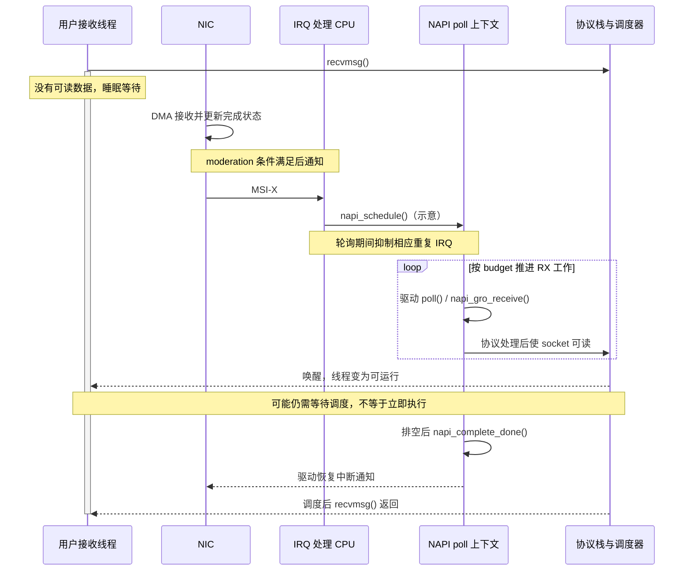

---
tags:
  - Linux
  - 高性能网络
  - NIC-Offload
  - NAPI
  - 性能调优
aliases:
  - 19.4 NIC Offload 与中断优化
  - GRO、GSO、TSO 与中断合并
status: 待确认
created: 2026-09-11
updated: 2026-09-11
阅读次数: 0
---

# 19.4 NIC Offload 与中断优化：Checksum、GRO、GSO、TSO、LRO 与 Interrupt Moderation

> **高速网络的成本不仅取决于“每秒搬多少字节”，还取决于“每秒处理多少包、多少 skb、多少次通知”。卸载和批处理改变的是这些成本的承担者与发生次数，不是让所有工作凭空消失。**

## 1. 先区分四个容易混在一起的数量

| 数量 | 在哪里数 | 主要代表什么 |
| --- | --- | --- |
| 线上帧/包数 | 物理链路、NIC 接收/发送侧 | 链路按多细的粒度传输 |
| 内核 skb 数 | 协议栈特定观察点 | 软件按多细的粒度处理数据 |
| IRQ/完成通知数 | 中断向量、事件统计 | CPU 被通知了多少次 |
| 系统调用/业务请求数 | 应用线程、业务协议 | 应用以什么粒度提交与消费 |

它们不一一对应。TSO 允许一个较大的发送对象对应多个线上 TCP 段；GRO 可以把多个兼容接收段聚合成更大的处理对象；中断合并使一次通知覆盖多个事件。**一次 `sendmsg()` 也不保证对应一个 skb 或一个线上包。**[^seg][^napi][^coalesce]

在 [[19.3 多队列网卡与 CPU-NUMA 亲和：RSS、RPS、RFS、XPS 与 IRQ Affinity]] 中，我们决定了各段工作的执行者。本篇继续回答：每个执行者要处理多少对象，哪些工作交给硬件，哪些等待是批量化带来的。

> [!note] 范围和实验约束
> 以普通 Linux Ethernet/TCP/IP 数据路径为主。所有开关都要核对内核、驱动、固件、协议及报文布局；“支持某能力”“功能已开启”“这个包实际使用硬件卸载”是三个不同层次。示例仅用于受控实验机；没有在用户机器上执行，也没有提供虚构跑分。[^features]

## 2. 为什么 100/200/400G 的小包首先考验 CPU

### 2.1 一个只用于建立直觉的计算模型

设名义 MAC 比特率为 $R$，以太网帧长 $L$ **包含 FCS**。按经典以太网口径，另计 8 B 前导码/SFD 和 12 B 帧间隙，则理论帧率为：

$$
\mathrm{pps} = \frac{R}{8(L+20)}
$$

下面是该模型的计算值，不是设备承诺或实测。64 B 表示最小以太网帧，不是 64 B UDP payload；1518 B 表示无 VLAN、IP MTU 为 1500 的完整常见帧长。表中忽略物理编码/FEC 等额外口径差异，不把名义链路带宽当成应用有效吞吐。[^ethernet]

| 名义单向带宽 | 64 B 帧 | 1518 B 帧 |
| --- | ---: | ---: |
| 100 Gbit/s | 148.81 Mpps | 8.13 Mpps |
| 200 Gbit/s | 297.62 Mpps | 16.25 Mpps |
| 400 Gbit/s | 595.24 Mpps | 32.51 Mpps |

如果再作一个理想化假设：16 个物理核，每核每秒 30 亿周期，所有周期都能用于收包，则最小帧情况下的总预算为：

$$
\text{cycles/frame} = \frac{16\times3\times10^9}{\mathrm{pps}}
$$

对应 100/200/400G，分别约 **322.6、161.3、80.6 cycles/frame**。真实系统还要承担缓存未命中、内存访问、协议状态、队列操作、应用逻辑和操作系统工作，因此这个预算不是可达到性能的预测，而是说明：**当每包固定开销必须发生上亿次时，CPU 很容易先耗尽。**

### 2.2 “摊薄”到底摊薄了什么

可以用下面的非严格成本分解来组织观测，而不是把它当成可直接拟合的硬件公式：

$$
C \approx Bc_{byte}+P_{wire}c_{rx}+P_{stack}c_{stack}
      +I c_{irq}+S c_{syscall}+C_{app}+C_{handoff}
$$

其中，$B$ 是处理字节量，$P_{wire}$ 是线上包数，$P_{stack}$ 是某协议栈阶段的对象数，$I$ 是通知次数，$S$ 是系统调用次数；$C_{handoff}$ 表示跨 CPU/NUMA 交接等成本。

这个模型提醒我们：GRO 主要减少部分上层处理对象数，但不会让已经在线上传输的包消失；中断合并主要减少通知，不等于做了 TCP 分段；TSO 减轻 CPU 分段工作，但最终仍要传出符合链路约束的帧。[^seg][^coalesce]

## 3. 一张表分清 Checksum、GSO、TSO、GRO、LRO

| 机制 | 主要方向/位置 | 工作变化 | 不要误认为 |
| --- | --- | --- | --- |
| Checksum offload | TX/RX，协议栈与 NIC 协作 | 把支持的校验和计算或验证交给硬件 | 加密认证、Ethernet FCS，或“所有检查都取消” |
| GSO | TX，内核通用分段框架 | 用大对象携带分段元数据，必要时软件分段 | 必须把大包直接发上线；或与 TSO 互斥 |
| TSO | TX，支持的 NIC | NIC 将 TCP 大对象分成多个段并完成相关处理 | 对所有 UDP/QUIC 报文都有效 |
| GRO | RX，通常在软件接收路径，也有硬件能力 | 合并同一流中符合条件的报文，减少后续处理粒度 | 减少已经到达网卡的线上包数 |
| LRO | RX，具体由驱动/硬件实现 | 更偏向大块聚合的接收优化 | 与 GRO 的语义和转发安全性完全相同 |
| Interrupt moderation | 完成通知/中断侧 | 合并或调节通知时机 | 修改 TCP MSS、IP MTU 或应用消息边界 |

GRO/GSO 的设计具有对应关系；支持硬件 GRO 的能力也不等于传统硬件 LRO。Linux 对硬件 GRO 的可重新分段等行为有更严格要求，不能仅凭“都是接收大包”就混为一谈。[^seg][^features]

## 4. Checksum：数据并非坏了，只是观察时机不同

### 4.1 从“谁负责最后一步”理解发送卸载

发送栈可以先准备校验和相关元数据，把剩余计算留给 NIC。`CHECKSUM_PARTIAL` 表示需要按约定完成校验和处理，`csum_start` 和 `csum_offset` 描述计算起点及结果字段位置；如果路径不支持相应卸载，内核可以走软件补算。[^checksum]

这不同于“不校验”。更不是密码学完整性保护，也不应与以太网 FCS 混为同一层的机制。IPv6 没有 IPv4 那样的 IP 头校验和，并不意味着 TCP/UDP 的相关校验义务也都消失。

### 4.2 `skb->ip_summed` 不是一个简单的“好/坏”布尔值

| 常见状态 | 应怎样理解 |
| --- | --- |
| `CHECKSUM_NONE`（RX） | 设备未为此包提供验证结果，后续可能需要软件处理 |
| `CHECKSUM_UNNECESSARY`（RX） | 对所标识的受支持协议，已有足够验证信息，可避免重复验证 |
| `CHECKSUM_COMPLETE`（RX） | 提供了计算结果/贡献，不能不看协议与伪头处理就当作“全部已验证” |
| `CHECKSUM_PARTIAL` | 常见于发送卸载，仍需按元数据完成剩余计算 |

这里前三行按接收语义理解；发送时 `CHECKSUM_NONE` 通常表示协议已经完成校验和或不需要校验和，不是要求 NIC 补算。`CHECKSUM_PARTIAL` 也可能出现在虚拟化或特定接收处理路径，不能只凭它断言一定在物理网卡发送侧。嵌套协议、封装深度与驱动填写方式都会影响这些字段的解释。本表只用于避免误读；精确语义应看目标内核 `skbuff.h` 的注释和 checksum 文档，不能从状态名字猜全部行为。[^skb][^checksum]

### 4.3 为什么发送端抓包会显示校验和错误

主机抓包点可能位于 NIC 完成校验和之前，此时看到的是“待完成”的发送对象，而不是线上最终报文。同样，本机可能抓到尚未分段的发送大对象，或者经过接收聚合的大对象。[^capture]

排障顺序应当是：记录抓包位置和卸载状态，再使用理解清楚卸载行为的另一观察点、镜像/TAP 等验证。**对端主机也可能启用 GRO，换到对端抓包不自动等于看到了原始线上分段。**

## 5. GSO 与 TSO：大对象并不意味着巨型线上帧

![[图片/SVG/3_19_19_4_1.svg|900]]

**读图：中间的分段可以在 CPU 或 NIC 执行，但右侧线上仍然是多个段。** 下半部分的 GRO 是接收后的聚合，不是把发送端的网络帧在链路里合并。

图以 IPv4、TCP 无选项、IP MTU 1500、MSS 1460 作理想示例：5840 B TCP payload 可以分成四个 1460 B payload 的段。实际 MSS 会受选项、路径 MTU 和封装等因素影响；一次应用写入也不保证恰好形成图中的大 skb。

### 5.1 GSO：内核保留“大对象＋如何拆”的信息

GSO 不只是一个“把包变大”的按钮。协议栈可以用较大对象携带 `gso_size`、`gso_type` 等元数据，把部分 per-packet 工作推迟。如果后续设备无法完成所需分段，就在合适位置执行软件分段。[^seg]

因此，关闭 TSO 后仍可能看到 GSO 开启：上层继续以大对象工作，只是最终分段由 CPU 承担。不能把“GSO 仍然 on”解释为“TSO 其实没有关掉”。

### 5.2 TSO：把 TCP 分段与相关处理交给硬件

TSO 要求设备理解对应报文布局，并根据元数据生成各段头部、序列信息、长度和校验和等。它依赖发送校验和等能力；关闭 TX checksum 可能连带关闭相关分段卸载。隧道封装还需要对应的内外层能力，不能只看总开关。[^seg][^features]

从实验归因看，`tx-checksum off` 常常不是一个只改变 checksum 的干净实验，因为其他 feature 可能发生依赖联动。必须读回全部相关状态，说明真正改变了哪些路径。

### 5.3 四个重要边界

**不改变 MTU 的约束。** 主机内部存在大 skb，不等于线上发送同样大的 Ethernet 帧；也不能把 GSO 当成必须配置巨帧才能工作。[^seg]

**不等于零拷贝。** 分段卸载描述“谁拆包”，零拷贝描述“是否避免特定数据拷贝”。两者可以组合，但一个成立不能证明另一个成立。

**TSO 不等于 UDP segmentation。** UDP 分段卸载有自己的语义与能力要求；把一个大缓冲拆成多个 UDP datagram，也不等于 IP fragmentation。QUIC 基于 UDP，不能仅靠打开 TSO 就推断它获得了分段加速。[^seg]

**开启不等于每个包都能用。** 设备支持范围、封装、头布局和每包检查都可能使个别路径回退到软件。[^features]

## 6. GRO 与 LRO：减少上层处理次数，也要保留正确语义

### 6.1 GRO 不是任意拼接几个包

GRO 检查报文是否满足协议与流相关条件，将兼容报文聚合为较大的接收对象，再交给后续路径。它与 GSO 对应的重要目标，是让聚合对象能够在需要时重新分段，保持所需协议语义。[^seg]

它可能减少后续网络栈对多个小对象重复执行的工作，但原来的报文已经经过链路、NIC 接收和相应的驱动处理。聚合发生在哪一层，就主要从哪一层往后摊薄成本；不能用“GRO 聚合了 8 个包”断言所有收包开销都降低到八分之一。

也不要把“聚合”自动理解为复制成一块巨大连续内存。内核对象可以引用多个片段，真实内存布局由实现决定；是否减少拷贝，需要另外检查数据路径。

### 6.2 传统 LRO 的结果不应不加检查地拿去转发

传统 LRO 与 GRO 的约束不完全相同。主机终结连接、路由转发、桥接、隧道处理和虚拟交换机路径，对聚合后的可重建性与头部信息保留要求可能不同。

因此，本稿的实验原则是：**在转发、桥接或隧道路径上，不把“开启 LRO”作为无条件吞吐优化；先核实驱动和转发路径是否支持该组合。** 硬件 GRO 与传统硬件 LRO 也应分别查看 capability 和 feature，不能见到接收合并就统一称为 LRO。[^features]

### 6.3 GRO 一定让延迟变差吗

不能一概而论。聚合改变工作粒度，但经典 NAPI 默认不是为了等更多包而故意定时睡眠；接收批次、flush、软件重轮询参数以及硬件 moderation 才共同决定具体时机。CPU 已经饱和时，减少重复工作也可能缩短排队，从而改善尾延迟。[^napi]

应测的是目标业务的延迟分布，而不是从“有聚合”三个字直接推断 p99 必然上升。

## 7. 中断合并、NAPI 和 GRO 是三件事

### 7.1 硬件 moderation：通知可以晚一点、少一点

很多设备允许配置时间或事件数量条件，例如 `rx-usecs`、`rx-frames`。在某些常见模型下，达到时间或数量条件后触发通知；不同硬件和模式的计时起点、计数单位、粒度、上限及组合规则并不完全相同。[^coalesce]

![[图片/SVG/3_19_19_4_2.svg|900]]

**读图：这是“首个事件启动定时器，T=8 μs 或 N=4 先满足即通知”的教学模型，不是所有 NIC 的规范。** 低负载下，单个事件可能等到 8 μs；突发在 0、2、4、6 μs 到达四个事件，可以在 6 μs 达到数量阈值。

某些 CQE 模式会在后续事件到达时重置计时器，语义更接近等待一个空闲间隔。设备也可能提供单独的速率上限或粒度约束。因此 `rx-usecs=8` 不能被解释为所有情况下精确增加 8 μs，或者所有情况下都把等待严格限制在 8 μs 内。[^coalesce][^driver]

### 7.2 NAPI：已有工作按预算处理，不是默认等包计时器

典型流程是：中断处理程序调度 NAPI，并在适当时机抑制重复通知；NAPI poll 按 RX budget 等约束处理工作；仍有工作就继续安排处理；工作排空后完成 NAPI 并恢复通知。TX 完成回收与 RX budget 还存在不同规则，不能把 poll 返回值简单等同于所有完成项数量。[^napi]

下面用一个原本阻塞在 `recvmsg()` 的线程，说明硬件通知到应用继续运行之间还有哪些阶段：



真实驱动的屏蔽/恢复方式与调度 API 可能不同，协议递送也可能与 poll 批次交错。图要揭示的是：**IRQ 到达、数据进入 socket、线程被唤醒、线程真正运行，不是同一个时刻。**[^napi]

### 7.3 三者分别改变什么

| 机制 | 主要粒度 | 是否等价于“等待更多包” |
| --- | --- | --- |
| 硬件 interrupt moderation | 事件/完成通知 | 可能通过时间或数量条件推迟通知 |
| 经典 NAPI poll | 接收工作预算与调度 | 默认不为了攒批额外等待固定时间 |
| GRO | 协议兼容对象的聚合 | 不是通用的中断定时器 |

NAPI 还提供软件重轮询、`gro_flush_timeout`、`napi_defer_hard_irqs` 等可选控制。它们属于另外的参数层次，不能把名称带 GRO 的超时参数等同于“经典 GRO 总会额外等待”。busy polling 也不是在上述开关上简单加一个更激进的数字。通知与轮询的概念基础见 [[0.6 Interrupt Busy Polling 与 Context Switch]]。[^napi]

## 8. 吞吐、空闲 CPU 和 p99：同一个开关有不同负载区间

### 8.1 为什么“关闭中断合并一定最低延迟”不成立

低负载下，通知等待可能占较大比例，减小 moderation 时间有机会降低延迟。高负载下，更多中断和更小批次可能提高 CPU 成本，使服务能力下降；一旦到达率接近处理能力，额外排队又会抬高尾延迟。

因此实验至少要覆盖**轻载、目标负载和接近饱和**，同时记录吞吐、CPU 消耗、丢包与业务 p50/p99。这里是由成本和排队关系提出的实验假设，不是对所有驱动的固定性能结论。

### 8.2 Adaptive moderation 不是业务 SLO 控制器

Linux Net DIM 可以基于事件、包和字节统计等调整中断合并 profile，帮助适应负载变化。但它没有自动理解你的 RPC deadline 或 p99 SLO；启用 adaptive 后，手工静态参数也可能不再以预想方式控制行为。测试静态参数前应确认 adaptive 状态，并记录驱动支持的实际组合。[^dim]

### 8.3 TX moderation 不是 TCP pacing

TX 中断合并通常主要影响**发送完成如何通知/回收**，不能直接当成控制报文何时发上线的 pacing 开关。较晚回收可能影响描述符复用、队列压力和应用可继续提交的时机；这与直接限制 TCP 发送节奏不同。部分设备有额外发送聚合机制，应看具体驱动，不把所有 `tx-usecs` 解释为同一种功能。[^coalesce]

## 9. 工具实践：先保存，再改变一个机制

### 9.1 确认功能与当前有效状态

先只读，不假定所有网卡都支持这些选项：

```bash
IFACE=enp65s0f0             # 替换为获授权的实验网口
ethtool -i "$IFACE"
ethtool -k "$IFACE"
ethtool -c "$IFACE"
ethtool -g "$IFACE"
ethtool -S "$IFACE"
ip -s link show dev "$IFACE"
```

`-k` 中的 `[fixed]` 表示该特性不能通过相应配置切换。`-c` 是中断合并状态，`-g` 是 Ring 参数，二者不是同一组设置。驱动可能拒绝不支持的值，也可能按硬件粒度处理；改变后必须读回。[^ethtool][^driver]

先保存基线，以便按原值恢复，而不是“测试完一律改回 on”：

```bash
OUT="offload-baseline-$(date +%Y%m%d-%H%M%S)"
mkdir -p "$OUT"
ethtool -k "$IFACE" > "$OUT/features.before.txt"
ethtool -c "$IFACE" > "$OUT/coalesce.before.txt"
ethtool -g "$IFACE" > "$OUT/rings.before.txt"
ethtool -S "$IFACE" > "$OUT/stats.before.txt"
cp /proc/interrupts "$OUT/interrupts.before.txt"
```

文本快照不是可直接执行的恢复文件。恢复时逐项使用已保存值，对照 `ethtool -k/-c` 读回，并确认 adaptive、相关依赖和对端状态都回到原配置。

### 9.2 先测试 TSO，不把 checksum 一起关闭

下面只改变 TSO，目的是区分硬件分段与软件处理成本，而不是证明“关得越多越准确”：

```bash
# 仅在测试前已记录原值、设备支持该切换时执行
sudo ethtool -K "$IFACE" tso off
ethtool -k "$IFACE"
```

读回 TSO、GSO 和 TX checksum 等相关项。若 GSO 仍开，软件仍可能在靠后位置分段；若驱动联动了其他 feature，就把它记录为多项配置变化，而不是强行称作纯 TSO 实验。测试结束恢复**原来的** TSO 状态，不假定原来必为 on。[^seg][^features]

接收侧可另做 GRO 对照，不与前一项同时变化：

```bash
sudo ethtool -K "$IFACE" gro off
ethtool -k "$IFACE"
```

GRO 关闭后应比较上层 CPU 成本、吞吐和延迟分布，并检查是否存在独立的硬件接收合并能力。不能仅凭一个 `gro: off` 就宣称已经完全排除了所有接收侧聚合路径。

### 9.3 中断合并实验不要把 `0` 当万能关闭值

先确认驱动支持静态模式和参数含义，再作单参数步进。下面的 8 μs 只用于展示语法，不是建议值：

```bash
sudo ethtool -C "$IFACE" adaptive-rx off rx-usecs 8
ethtool -c "$IFACE"
```

还要保持并记录 `rx-frames`、相关 IRQ/CQE 模式和其他限制条件；否则实际触发可能被另一个阈值主导。设备不支持某个字段时不要绕过错误继续推断。特定驱动还可能有几微秒的量化粒度或额外中断率限制，须以本机驱动文档和读回结果为准。[^coalesce][^driver]

### 9.4 抓包只用于验证特定假设

在受控实验中限定抓包数量，避免无上限抓包本身改变性能或收集不必要的数据：

```bash
sudo tcpdump -i "$IFACE" -nn -s 0 -c 200 -w offload-sample.pcap
```

这条命令等待收集到限定数量的包，低流量时可能持续等待，可中断结束。保存文件包含实际报文内容，应仅在获授权环境使用并妥善处理。它适合验证 checksum/分段观察点，不适合与最终高精度跑分混在同一轮中比较。主机抓包结果应结合卸载状态解释。[^capture]

## 10. Benchmark：用不同工作负载检验不同机制

### 10.1 不能只跑一个大流量 TCP 测试

| 工作负载 | 控制变量 | 必须收集的指标 | 主要检验什么 |
| --- | --- | --- | --- |
| 大块 TCP、多连接 | 流数、方向、CPU 映射、持续时间 | goodput、两端 CPU、重传、队列统计 | 分段/聚合的 CPU 收益 |
| 小请求 RPC | 消息大小、请求到达率、并发、连接数 | p50/p99、超时、吞吐、CPU | 通知等待与核争用 |
| 小 UDP datagram | payload、发送速率、流数、丢包容忍度 | 实际线侧口径、接收率、丢包、CPU | 高包速率与接收处理能力 |
| 间歇突发 | 突发长度、间隔、负载峰值 | 每批延迟分布、队列压力、丢包 | moderation 与 Ring 吸收能力 |

推荐记录至少一个轻载点、一个目标业务负载点和一个压力点，重复运行并保留分布。报告应同时显示吞吐和延迟，不把吞吐收益掩盖的超时或尾延迟当成“优化成功”。

### 10.2 iperf3 能测什么，不能测什么

iperf3 适合构建 TCP/UDP 吞吐对照；它的版本、多流线程实现和发送端能力都会影响结果。TCP 的 `-l` 主要控制应用读写缓冲尺寸，**不是指定线上 TCP 帧长**；UDP 的长度选项也不能不加头部就当作 Ethernet 帧长。UDP jitter 不是业务请求的 p99。[^iperf]

RPC 延迟应由实际协议或具有明确消息模型的负载生成器测量；标明是在同一时钟上测 RTT，还是跨主机单向计时。软件时间戳、硬件时间戳、应用完成时间处于不同观察点，不能混用成同一个“网络延迟”。[^timestamp]

### 10.3 三条可验证的实验假设

**假设 A：当前 bulk TCP 是 CPU 分段受限。** 保持连接数、CPU 与接收侧配置不变，对比 TSO 开关；如果吞吐、发送 CPU 热点或每字节 CPU 成本产生稳定变化，才进一步讨论分段卸载收益。

**假设 B：轻载 RPC 的主要额外等待来自 moderation。** 保持业务到达率、绑定和 offload 不变，逐步改变静态 RX 时间参数，检查 p99 是否随之变化；若 adaptive、数量阈值或软件重轮询仍在主导，就不能归因于单一时间参数。

**假设 C：CPU 已接近饱和，关闭合并反而增加尾延迟。** 在相同目标负载下，比较中断增量、CPU、排队、超时和延迟分布；只有这些证据能够闭合，才说明“小批次增加开销”的解释在本机成立。

这里提出的是实验方案，没有预填“改善 20%”或“降低 5 μs”等未经测量的结论。

## 11. 排障时最容易掉进的坑

| 误判 | 更可靠的解释或检查 |
| --- | --- |
| 抓到 64 KB 对象，所以 MTU 已经是 64 KB | 可能处于 TSO/GSO 分段前或 GRO 聚合后；确认抓包位置 |
| TX checksum 显示错误，所以 NIC 发坏包 | 可能尚未完成硬件补算；检查线上/其他可信观察点 |
| 中断次数少了 90%，CPU 就该降低 90% | 描述符、协议栈、字节处理、应用逻辑仍需执行 |
| NAPI budget 是“攒够这么多包才处理” | budget 是一次处理的预算，不是默认等待阈值 |
| GRO、LRO、硬件 GRO 都是同一个开关 | 实现与语义约束不同，必须分别检查 |
| `rx-usecs=0` 就代表所有形式的延迟等待都关闭 | 数量阈值、adaptive、驱动模式和软件重轮询可能仍存在 |
| Ring 扩容后不丢包，处理能力就提高了 | 可能只是暂存更多数据；持续过载仍会排队或溢出 |
| RDMA 慢，把 TCP TSO 打开就能解决 | 硬件 verbs 数据路径不是普通 TCP skb 分段路径 |

表中机制依据见 segmentation、NAPI、feature 与 ethtool 文档；具体故障仍需现场观测，不以症状代替证据。[^seg][^napi][^features][^coalesce]

从队列角度做一个自己的简单推导：若到达率持续大于服务率，增加 $Q$ 个可用缓冲只能额外容纳有限积压，约能延后 $Q/(\lambda-\mu)$ 的溢出时间。这个理想模型忽略突发和多层队列，但足以说明“更深”不等于“更快”。

## 12. 连接到 DPDK/RDMA：迁移成本模型，不迁移错误的接口假设

DPDK ethdev 同样有 checksum、segmentation 等能力，但由设备 capability、端口/队列配置及 mbuf 元数据共同决定；Linux `ethtool -K` 并不能普遍代表 PMD 实际数据路径的配置。轮询 burst 摊薄开销的思想与 NAPI 批量处理相通，但控制接口、对象和执行上下文不同。[^dpdk]

硬件 RDMA 中要另查 WQE/CQE、完成通知策略、CQ poller、MR 所在内存以及 NIC/PCIe 路径。CQ 轮询与 completion event 等待有不同的发现成本；不要把 Ethernet netdev 的 TCP 分段和普通 IRQ 参数当成所有 RDMA 数据面行为的直接控制器。[^rdma]

本篇与 [[19.3 多队列网卡与 CPU-NUMA 亲和：RSS、RPS、RFS、XPS 与 IRQ Affinity]] 合起来形成两张检查表：**一张追踪工作归谁，另一张追踪工作粒度与等待发生在哪里。**

## 13. 自检：把开关翻译成机制

**问：GSO 与 TSO 可以同时开启吗？** 可以。GSO 是通用分段框架，支持硬件时可由 TSO 完成分段，不支持时可走软件路径。[^seg]

**问：GRO 把八个报文合并后，网卡只接收了一个线上包吗？** 没有。聚合发生在接收之后，原始线上包和前段接收成本已经发生。[^seg]

**问：为什么降低 moderation 时间后，高负载 p99 反而可能恶化？** 更小批次、更多通知可能增加 CPU 成本；处理能力下降后，排队增长可抵消甚至超过通知等待的减少。应把它作为负载相关假设实测，而不是当作必然结果。

**问：把 TX checksum 关掉测 CPU 开销，为什么不能直接归因于校验和？** 可能连带禁用 TSO 等依赖能力，导致实验同时改变多个机制。[^seg][^features]

**问：NAPI poll 达到 budget，表示线程应睡眠等下一次硬中断吗？** 通常不是。仍有工作时继续安排轮询处理；排空后才按相应规则完成并恢复通知。[^napi]

---

## 参考资料与版本口径

实际核验资料如下，访问日期 **2026-09-11**。本稿没有引用未取得正文的教材章节或页码。理论帧率与 cycles/frame 是明确假设下的计算；图中数字是教学模型；性能实验未在用户设备执行。

[^ethernet]: IETF / RFC Editor, [RFC 2544，Appendix B: Maximum frame rates reference](https://www.rfc-editor.org/rfc/rfc2544.html#appendix-B)，列出 Ethernet 前导部分 64 bits、Frame 8 × N bits、Gap 96 bits 的计算口径。本稿将该口径代入 100/200/400 Gbit/s 作理论量级推导，不声称 RFC 2544 给出了这些高速网卡的实测性能。
[^seg]: Linux Kernel Documentation, [Segmentation Offloads](https://docs.kernel.org/networking/segmentation-offloads.html)，TSO、GSO、GRO、UDP 与隧道分段。
[^checksum]: Linux Kernel Documentation, [Checksum Offloads](https://docs.kernel.org/networking/checksum-offloads.html)，发送校验和元数据、能力与回退路径。
[^skb]: Linux Kernel 源码，[include/linux/skbuff.h](https://github.com/torvalds/linux/blob/master/include/linux/skbuff.h)，`sk_buff` 与 `ip_summed` 各状态注释；另见 [sk_buff 文档](https://docs.kernel.org/networking/skbuff.html)。源码符号按目标内核版本复核。
[^features]: Linux Kernel Documentation, [Netdev features mess and how to get out from it alive](https://docs.kernel.org/networking/netdev-features.html)，feature 依赖、每包检查以及硬件 GRO 与 LRO 的边界。
[^napi]: Linux Kernel Documentation, [NAPI](https://docs.kernel.org/networking/napi.html)，预算、通知、软件合并、处理上下文和 busy polling。
[^coalesce]: Linux Kernel Documentation, [Ethtool netlink interface](https://docs.kernel.org/networking/ethtool-netlink.html)，COALESCE_GET/SET 与 CQE mode 的计时语义。
[^dim]: Linux Kernel Documentation, [Net DIM — Generic Network Dynamic Interrupt Moderation](https://docs.kernel.org/networking/net_dim.html)，采样指标与动态 profile 选择。
[^driver]: Linux Kernel Documentation, [Intel i40e driver](https://docs.kernel.org/networking/device_drivers/ethernet/intel/i40e.html)，中断合并、参数粒度与驱动特有约束；仅作为“硬件语义不统一”的实例，不代表所有 NIC。
[^ethtool]: ethtool 上游手册，[ethtool(8)](https://man7.org/linux/man-pages/man8/ethtool.8.html)，功能、Ring、中断合并和统计的查询/修改命令。
[^capture]: Wireshark 项目文档，[CaptureSetup/Offloading](https://wiki.wireshark.org/CaptureSetup/Offloading)，卸载对 checksum 与 segmentation 抓包观察的影响。
[^iperf]: ESnet, [Invoking iperf3](https://software.es.net/iperf/invoking.html)，并行流、读写缓冲、UDP 测试和版本行为。
[^timestamp]: Linux Kernel Documentation, [Timestamping](https://docs.kernel.org/networking/timestamping.html)，软件/硬件及收发不同阶段的时间戳观察点。
[^dpdk]: DPDK Programmer’s Guide, [Poll Mode Driver / Ethernet Device API](https://doc.dpdk.org/guides/prog_guide/ethdev/ethdev.html)，本次访问页面为 26.07.0；offload capability、配置、队列和 burst。
[^rdma]: rdma-core 上游手册，[ibv_poll_cq(3)](https://man7.org/linux/man-pages/man3/ibv_poll_cq.3.html) 与 [ibv_get_cq_event(3)](https://man7.org/linux/man-pages/man3/ibv_get_cq_event.3.html)，完成轮询与事件模式。
