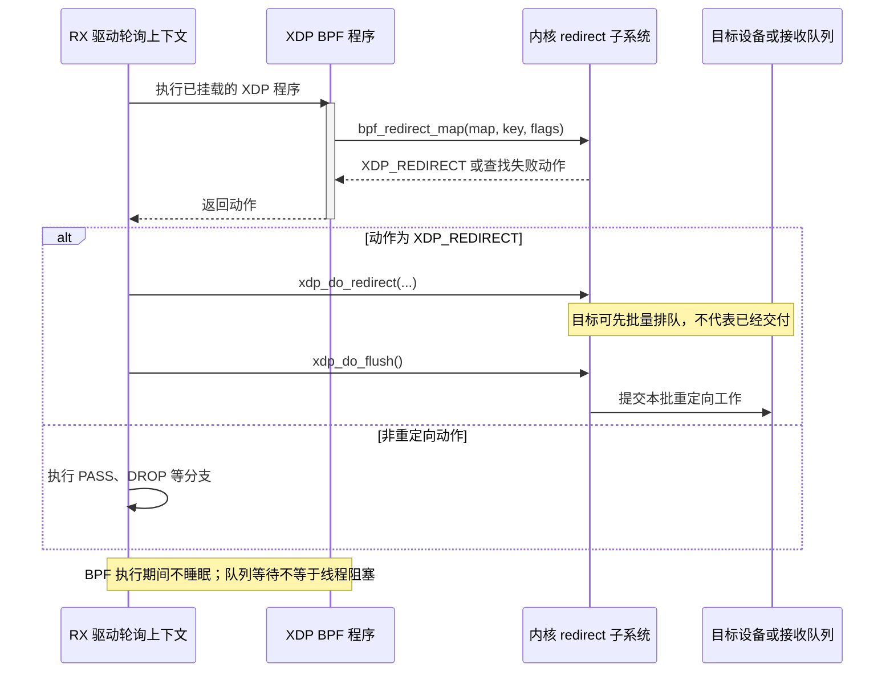
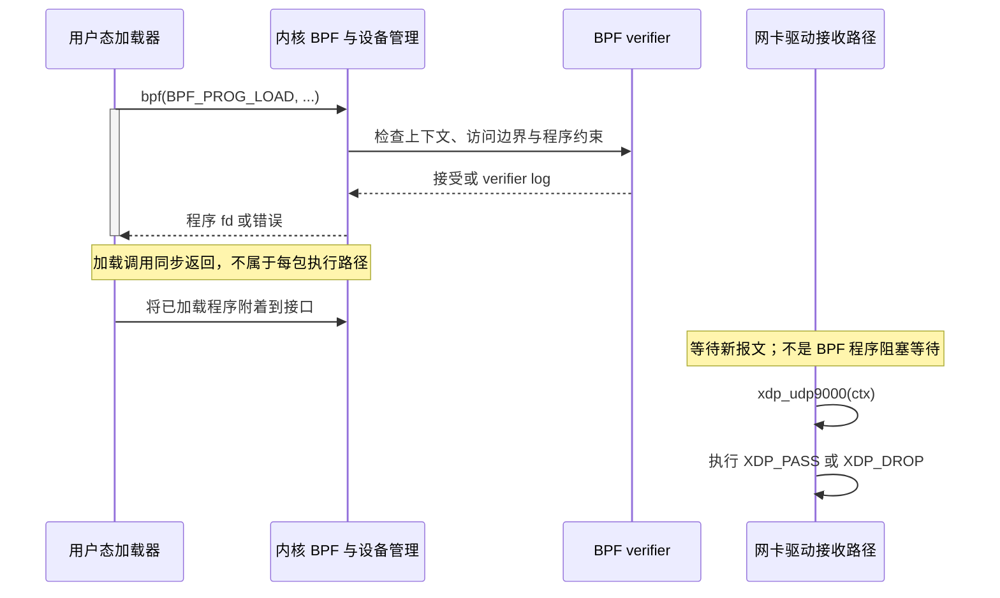
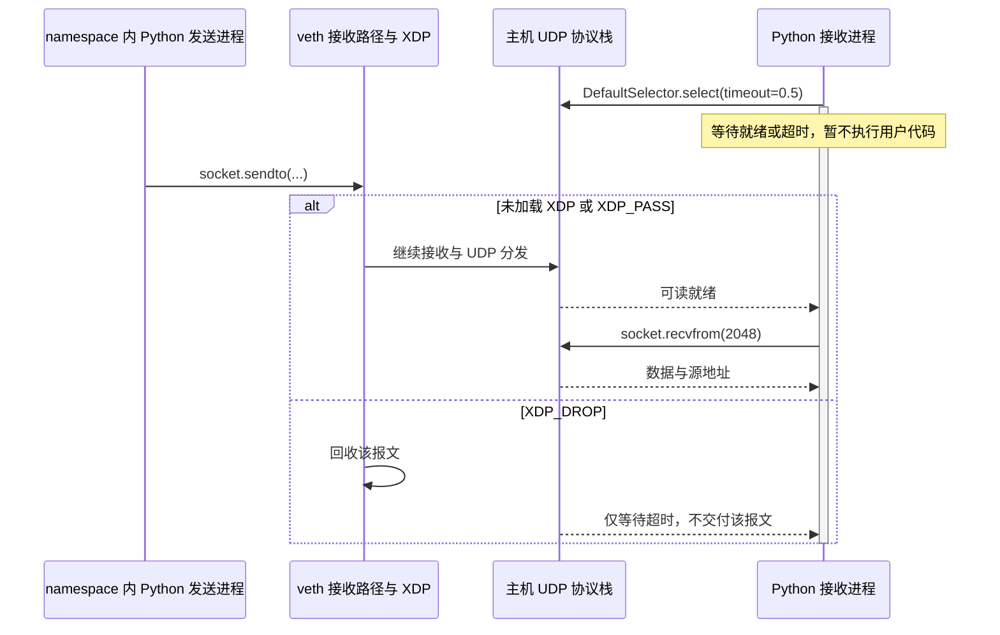

---
tags:
  - Linux
  - 高性能网络
  - XDP
  - eBPF
aliases:
  - XDP Hook 与 Driver Mode
  - XDP_PASS XDP_DROP XDP_REDIRECT
status: 已完成
created: 2026-09-11
updated: 2026-09-11
阅读次数: 0
---

# 19.5 XDP 与 eBPF 高速数据路径：Hook、XDP_PASS/DROP/REDIRECT 与 Driver Mode

> **XDP 的主要收益，不是“让 TCP 换一种写法”，而是在普通网络协议栈的大量工作开始之前，决定一个包是否还值得继续处理。** 学习时应始终回答三个问题：程序在哪里执行、当前持有什么报文表示、返回动作把所有权交给谁。

## 1. 本篇的落点与资料边界

前面的网络数据路径主题回答“网卡、队列、中断、CPU 如何协作”。本篇开始讨论“在这条路径上插入可编程决策”；下一篇 [[19.6 AF_XDP：UMEM、Fill-Completion Ring、Zero-Copy 与 Queue Binding|19.6 AF_XDP]] 进一步说明如何把选中的包交给用户态，以及如何管理承载这些包的内存。

DMA 与地址映射沿用 [[8.高性能存储/0. 数据路径硬件基础/0.3 DMA IOMMU 与 Pinned Memory|0.3 DMA、IOMMU 与 Pinned Memory]] 的模型。本篇不重复讲 PCIe DMA，不把 XDP 描述成“无需设备与内存传输”的机制。中断与轮询的基本取舍见 [[8.高性能存储/0. 数据路径硬件基础/0.6 Interrupt Busy Polling 与 Context Switch|0.6 Interrupt、Busy Polling 与 Context Switch]]。

**资料分工**：项目教材 *Systems Performance* 第 2 版 §10.4.3 提供 XDP 与内核旁路的定位，§10.5.6 提供观测成本的背景；具体 Hook、helper、加载方式和驱动边界由 Linux 官方文档、UAPI 与 xdp-project 资料补充。教材没有系统展开当前 AF_XDP 四环 API，不把后文接口细节归因给教材。[^book]

**适用口径**：Linux-only；主线采用 Linux 6.x 的通用机制。示例的内核程序使用 **BPF C**，不是普通用户态 C++；用户态库接口参照 libxdp / xdp-tools **v1.6.3**。实际能力取决于运行内核、发行版回移补丁、驱动、网卡固件与工具版本，不能仅凭“6.x”判断支持全部特性。

---

## 2. 先把四个容易混用的名称分开

| 名称 | 它是什么 | 它不是什么 |
| --- | --- | --- |
| eBPF | 程序加载、校验、执行、map 与受控内核接口组成的机制 | 不是一个固定的网络 Hook |
| XDP | 适用于高速报文处理的程序类型、执行入口和动作语义 | 不是 TCP/UDP 传输协议 |
| Native / Driver XDP | 驱动接收路径中的 XDP 执行方式 | 不是把程序自动卸载到网卡 |
| AF_XDP / XSK | 与 XDP 配合的用户态报文收发接口 | 不是给 `recvfrom()` 打开一个加速开关 |

同样是 eBPF，挂到 tracepoint 的程序主要观测事件，挂到 TC 的程序面对 skb，挂到 XDP 的程序面对早期报文上下文。**程序类型与挂载位置，决定可用上下文、helper 和合法行为**；不能把一个 Hook 上的示例原样搬到另一个 Hook。[^verifier]

与 DPDK 的关系也不能仅用“谁绕过内核”二分。Native XDP 通常由 Linux 网卡驱动调用，仍与内核共存；AF_XDP 则让选定报文不必走普通 socket 协议栈。DPDK 的具体路径还要区分传统 PMD 与 AF_XDP PMD 等实现。真正应该对照的是：**哪些工作保留，哪些工作省去，哪些职责转交应用**。[^book][^pmd]

## 3. Hook 在哪里：三种模式不是三个连续阶段

![[图片/SVG/3_19_19_5_1.svg|1079]]

图中三个横向路径是**互斥的模式对照**，不是要求同一个包依次执行三个 XDP 程序。图只画典型物理网卡接收路径；veth、隧道和其他虚拟设备需看各自实现。

### 3.1 Native / Driver Mode

典型接收过程是：网卡 DMA 写入驱动准备的缓冲区，驱动在接收轮询中取得报文，以 `xdp_buff` 等内部表示调用 XDP 程序，然后依据动作继续、丢弃、发送或重定向。

关键边界是：**Native XDP 位于为普通协议栈构建 skb 之前**。若动作最终为 DROP，后续 skb 构建、协议层解析、普通 socket 分发等工作可以不做，但 NIC 收包、DMA、驱动轮询及 XDP 自身的成本已经发生。它不能挽回已经占用的链路带宽。[^xdp-paper]

这里的“Driver”描述入口，执行主体通常仍是**主机 CPU**。这和 NIC 上运行程序的 Hardware Offload 是不同概念。

### 3.2 Generic / SKB Mode

Generic XDP 借助已有 skb 执行 XDP 语义，对缺少 Native 支持的场景有兼容价值。但 skb 已经存在，因此不能声称它具有同样的“省掉早期 skb 工作”的收益。

它适合先验证解析与动作是否符合预期，**不适合拿它的性能结果代表 Native XDP 或 AF_XDP Zero-Copy**。虚拟设备还可能有自己的限制，所谓通用模式不等于所有设备与所有动作组合都保证可用。[^ip-link][^xdp-paper]

### 3.3 Hardware Offload Mode

程序被加载到支持相应 offload 能力的设备侧执行。它依赖设备指令、map、helper、报文访问与动作能力，不能假设“主机 verifier 接受”就意味着网卡可以执行。

Native 支持、Hardware Offload 支持、AF_XDP Zero-Copy 支持是**三个独立的能力问题**。选择驱动模式并不会自动满足后两者。[^ip-link][^af-xdp]

### 3.4 明确选择模式，禁止把 fallback 藏在实验里

以下是加载命令的不同选择，**一次只选择一种**，`IF` 必须是自己控制的实验接口：

```bash
# 驱动不支持时应失败；不要把失败悄悄变成另一组实验。
sudo ip link set dev "$IF" xdpdrv obj xdp_udp9000.bpf.o sec xdp

# 功能兼容实验；不能据此宣称 Native 性能。
sudo ip link set dev "$IF" xdpgeneric obj xdp_udp9000.bpf.o sec xdp

# 仅在设备明确支持程序卸载时使用。
sudo ip link set dev "$IF" xdpoffload obj xdp_udp9000.bpf.o sec xdp
```

普通 `xdp` 选择可能涉及兼容回退；测试报告应记录显式模式，并用 `ip -details link show dev "$IF"`、`bpftool net` 或 `xdp-loader status` 确认实际挂载。已有 libxdp dispatcher 或其他管理器时，必须通过原管理路径操作，不能用强制替换绕开其所有权。[^ip-link][^libxdp]

---

## 4. 返回动作：不是“返回一个成功码”

| 动作 | 意义 | 必须补上的边界 |
| --- | --- | --- |
| `XDP_PASS` | 允许报文继续当前接收路径 | 后续仍可能被协议栈、策略或资源限制丢弃 |
| `XDP_DROP` | 按策略丢弃该包并回收相应资源 | 通常不进入普通 socket 抓包路径 |
| `XDP_ABORTED` | 异常动作，进入异常处理/诊断路径 | 不应拿它代替常规策略丢弃 |
| `XDP_TX` | 从收到该包的设备发送出去 | 不自动改 MAC、IP、校验和，也不自动完成路由 |
| `XDP_REDIRECT` | 使用 helper 设置的目标执行重定向 | 目标入队、发送与交付仍可能失败 |

动作枚举是约定，不是按数值大小排列的优先级。helper 返回值也不能简单当作布尔成功失败处理。[^uapi][^helpers]

### 4.1 PASS 不等于“绕过防火墙后交付应用”

`XDP_PASS` 是“这一层不拦截”。报文随后如何经过 TC、路由、Netfilter、协议处理与 socket 分发，取决于设备与协议路径。

相反，提前 DROP、TX 或 REDIRECT 并最终离开普通栈的报文，不会再自动获得被绕过路径中的全部功能。若设计需要连接跟踪、NAT、访问控制或协议校验，必须明确这些功能由谁实现，不能假设“后面总会有内核兜底”。这是根据路径作出的**工程推论**，不是另一个隐式 XDP 服务。

### 4.2 TX 不等于“自动生成正确回复”

对入站帧直接返回 TX，设备只知道发送现有内容。构造 L2 回应至少应考虑 MAC；构造 IP 转发还涉及下一跳、TTL/Hop Limit、MTU、校验和以及邻居解析。

例如交换 MAC 后回发只能演示二层反射，不能据此称为完整 UDP echo 或 IP router。XDP 程序是否修改报文、修改后如何校验，是应用设计的一部分。

### 4.3 REDIRECT 分成“选择目标”和“执行转移”

仅写 `return XDP_REDIRECT` 没有为当前包指定有效目标，不构成正确的重定向实现。典型代码先调用 `bpf_redirect_map()`，再把它的返回动作交还调用者。[^redirect][^helpers]

---

## 5. REDIRECT：map 选目标，驱动完成批量转移

![[图片/SVG/3_19_19_5_2.svg|1079]]

图中的三类 map 决定的是**目标对象的种类**，而不是三套可以无条件互换的负载均衡算法。

| map | 目标 | 后续职责 | 不能据此推导的结论 |
| --- | --- | --- | --- |
| DEVMAP / DEVMAP_HASH | 网络设备 | 重定向发送、设备能力检查 | 不自动提供完整 IP 路由器语义 |
| CPUMAP | 目标 CPU 的处理队列 | 目标内核线程处理；可有二级 XDP 程序 | 不会迁移已经发生的 NIC DMA 与初始 RX 轮询 |
| XSKMAP | 已绑定的 AF_XDP socket | 向对应 XSK 的收包路径交付 | map 下标不能改变包来自哪个硬件 RX queue |

在 Native 路径中，`bpf_redirect_map()` 准备本 CPU 的重定向信息；返回 REDIRECT 后，驱动通过 `xdp_do_redirect()` 等机制入队，在本次 NAPI 处理的适当位置调用 `xdp_do_flush()` 提交批量工作。内核文档要求 flush 位于 `napi_complete_done()` 之前，处于相同 NAPI 上下文，以满足相应生命周期约束。**这是驱动职责，用户 BPF 程序不直接调用这些内核函数。**[^redirect]



这张时序图揭示了返回值没有表达的时间间隙：**程序已经选择 REDIRECT，包仍可能处于等待提交或被目标拒绝的阶段。**

### 5.1 fallback 只覆盖它定义的失败阶段

`bpf_redirect_map(map, key, XDP_PASS)` 的低两位参数指定 **map 查找失败时**返回的动作。它适合表达“没有用户态接收者时继续走内核”。

但一旦找到目标，后续因 queue 不匹配、资源不足或其他原因导致转移失败，不能假设内核会重新把包送入 PASS 分支。**查找失败的 fallback，不是任意下游失败的事务回滚。**[^helpers][^xskmap]

### 5.2 CPUMAP 不是 RPS 的别名

二者都可能改变后续处理的 CPU，但它们位于不同路径，操作的报文表示和队列也不同。CPUMAP 用于 XDP 重定向；RPS 属于常规接收栈的 CPU 分流。

在 Native XDP 之前已经选择了 RX 队列并执行了一部分驱动工作，因此调整 RPS 不能自动把这一段 XDP 执行搬到任意 CPU。需要分别检查 RX queue、IRQ/NAPI 实际 CPU、CPUMAP 目标 CPU、应用 worker 的位置。NUMA 局部性的基础理由见 [[8.高性能存储/0. 数据路径硬件基础/0.5 NUMA CPU 亲和性与内存亲和性|0.5 NUMA 亲和性]]。[^cpumap][^scaling]

---

## 6. 报文访问：先证明能读，再讨论读到了什么

BPF 程序通过 `struct xdp_md` 获取入口上下文。常见字段包括 `data`、`data_end`、`data_meta`、`ingress_ifindex`、`rx_queue_index`。`xdp_md` 是程序看到的接口；不要把它与驱动内部 `xdp_buff` 结构直接混为一谈。[^uapi]

### 6.1 两种正确性必须分开

**内存正确性**：本次访问是否在允许的范围内？访问某个头部之前，应证明整个头部都位于 `[data, data_end)` 中。变量长度头还需要验证长度字段及新边界。

**协议正确性**：报文头的版本、长度、分片、封装与校验和是否有效？通过 verifier 只说明满足其程序安全约束，不代表协议处理正确，也不证明这段程序具有低延迟。[^verifier]

### 6.2 解析器最常遗漏的边界

| 情况 | 错误直觉 | 正确处理方向 |
| --- | --- | --- |
| IPv4 options | IP 头永远 20 B | 使用 IHL，验证最小值和访问边界 |
| IPv4 fragment | 所有分片都带 UDP/TCP 头 | 区分首片、非首片与策略；示例直接交回普通栈 |
| VLAN / QinQ | EtherType 后面一定是 IP | 支持解析或明确排除；注意硬件剥离与 metadata |
| IPv6 扩展头 | 固定偏移就是 L4 | 有界遍历、逐层校验或明确不支持 |
| multi-buffer | `data_end - data` 就是整包长度 | 区分线性区域与完整报文；需要相应程序模式及接口 |
| `bpf_xdp_adjust_head()` 等 | 原指针仍然可用 | 重新取得 data/data_end，重做派生指针与边界证明 |

现代 BPF 并非“一切循环都禁止”；合法循环、复杂度与指令约束由当前 verifier 决定。也不要将 CO-RE 描述成“无视版本差异”：它不能创造缺失的 helper、驱动能力或设备 offload 支持。[^verifier][^rx-meta]

### 6.3 指针是借用，不是永久报文句柄

一次 XDP 调用中的报文指针不能随意保存到 map，作为以后可访问的稳定报文所有权。返回动作后，底层缓冲区可能被回收或移交。需要跨调用保留数据时，应使用允许的 map/value 表示或专门的数据通道，并承担复制、同步与容量成本。

---

## 7. 最小可读示例：仅丢弃指定 UDP 端口

目标：在隔离实验接口上，对**未带 VLAN 的、线性、未分片 IPv4 UDP，目的端口 9000**执行 DROP；其他报文返回 PASS。策略刻意保守，未知类型与不满足解析前提的报文不在这里处理。

> [!warning] 不是生产防火墙
> 分片、IPv6、VLAN 封装和畸形报文会走 PASS。代码不计算 IP/UDP checksum，也不实现抗绕过策略。这里演示的是边界证明与动作，不是安全产品。

将下面三个 C 代码块**按顺序拼接为一个文件** `xdp_udp9000.bpf.c`。代码没有用户态堆内存所有权；C 风格的报文指针转换是 BPF C/UAPI 的常见写法，不是要求在 C++ 用户态照搬裸指针所有权。

### 7.1 头文件与固定头部

先证明 Ethernet 和最小 IPv4 头完整，再读取其中的字段。不能“先读 protocol，再回头判断 IP 头是否越界”。

```c
#include <linux/bpf.h>
#include <linux/if_ether.h>
#include <linux/in.h>
#include <linux/ip.h>
#include <linux/udp.h>
#include <bpf/bpf_helpers.h>
#include <bpf/bpf_endian.h>

static __always_inline int is_udp9000(struct xdp_md *ctx)
{
    void *data = (void *)(long)ctx->data;
    void *end = (void *)(long)ctx->data_end;
    struct ethhdr *eth = data;
    if ((void *)(eth + 1) > end)
        return 0;
    if (eth->h_proto != bpf_htons(ETH_P_IP))
        return 0;
    struct iphdr *ip = (void *)(eth + 1);
    if ((void *)(ip + 1) > end)
        return 0;
    if (ip->version != 4 || ip->protocol != IPPROTO_UDP)
        return 0;
```

### 7.2 变量头长、分片与 UDP 长度

`0x3fff` 覆盖 IPv4 的 MF 和 fragment offset，不包含 DF。即使“首片看起来有 UDP 头”，也不让这个简化示例单独处理一组分片的首片。

```c
    if (bpf_ntohs(ip->frag_off) & 0x3fffU)
        return 0;
    __u32 ihl = (__u32)ip->ihl * 4U;
    if (ihl < sizeof(*ip) || ihl > 60U)
        return 0;
    if ((void *)ip + ihl > end)
        return 0;
    __u32 total = bpf_ntohs(ip->tot_len);
    if (total < ihl + sizeof(struct udphdr))
        return 0;
    if ((void *)ip + total > end)
        return 0;
    struct udphdr *udp = (void *)ip + ihl;
    if ((void *)(udp + 1) > end)
        return 0;
    __u32 udp_len = bpf_ntohs(udp->len);
    if (udp_len < sizeof(*udp) || udp_len > total - ihl)
        return 0;
    return udp->dest == bpf_htons(9000);
}
```

长度校验避免把以太网 padding 当成有效 UDP 数据，也防止固定偏移越界；但它仍然不等于完整的 IP/UDP 合法性验证。

### 7.3 入口只负责把判断变成动作

将解析与动作分离，后续改成统计、DEVMAP 转发或 XSKMAP 重定向时，可以保留解析器的测试边界，而不是复制多份容易漂移的头部访问代码。

```c
SEC("xdp")
int xdp_udp9000(struct xdp_md *ctx)
{
    return is_udp9000(ctx) ? XDP_DROP : XDP_PASS;
}

char LICENSE[] SEC("license") = "GPL";
```

这一段只做当前 RX 上下文中的有界解析，不包含睡眠、跨线程交接或异步等待，因此不另外画一张把 if/return 重抄一遍的时序图。加载与报文执行的时间关系见下一节。

---

## 8. 加载、验证与退出：把“编译成功”分成四道门

| 阶段 | 成功只说明什么 | 下一步仍可能失败在哪里 |
| --- | --- | --- |
| Clang 生成 ELF | 编译器接受代码并生成 BPF 指令 | verifier 可能拒绝 |
| 内核 load / verifier | 内核接受程序与 map | attach 模式或设备能力不满足 |
| attach 到接口 | 程序挂上目标位置 | 流量没到该接口、分类不命中 |
| 实际收发实验 | 本次环境与流量得到观察结果 | 不代表全封装、全负载与所有驱动通用 |



编译需要带 BPF 后端的 Clang、Linux UAPI 头以及 libbpf 开发头。下面的 multiarch include 是 Debian/Ubuntu 布局的常见处理；其他发行版应改用自身头文件布局。

```bash
# 先检查目标列表中确实有 bpf，而不只检查 clang 命令是否存在。
clang --print-targets
MULTIARCH=$(gcc -dumpmachine)
clang -O2 -g -target bpf -Wall -Wextra \
  -I"/usr/include/$MULTIARCH" \
  -c xdp_udp9000.bpf.c -o xdp_udp9000.bpf.o
```

权限、容器隔离、LSM、内核配置、发行版策略和资源限额都可能阻止加载。看到 `EPERM` 不应立即假定“程序逻辑错了”；看到 verifier 越界日志也不应先靠提高限额掩盖问题。保留完整日志与环境版本。

## 9. 隔离功能实验：先证明 DROP/PASS，不先追求线速

本节使用 veth + network namespace，不占用管理网卡。它**不验证真实 NIC 的 Native DMA 路径，也不验证 AF_XDP Zero-Copy**。每步确认成功再继续；失败后只清理本实验刚创建的对象。

### 9.1 建立仅属于本实验的接口

以下变量在后续 Bash 代码块沿用。若名称已存在，停止，不覆盖或删除已有对象。

```bash
NS=xdp195
HOST=vx195h
PEER=vx195p
if ip netns list | grep -Eq "^${NS}([[:space:]]|$)" || \
   ip link show "$HOST" >/dev/null 2>&1 || \
   ip link show "$PEER" >/dev/null 2>&1; then
  printf '%s\n' '实验名称已占用；停止并另选名称。' >&2
  exit 1
fi
sudo ip netns add "$NS"
sudo ip link add "$HOST" type veth peer name "$PEER"
sudo ip link set "$PEER" netns "$NS"
sudo ip address add 192.0.2.1/24 dev "$HOST"
sudo ip link set "$HOST" up
sudo ip -n "$NS" address add 192.0.2.2/24 dev "$PEER"
sudo ip -n "$NS" link set lo up
sudo ip -n "$NS" link set "$PEER" up
```

这里用文档示例地址构造不通外部网络的链路。挂载在 **HOST 的 ingress**，测试报文从 namespace 内的 PEER 发出。

### 9.2 先做未加载程序的基线

终端 A 运行下面的 Python 3 接收器。它管理两个 UDP socket，退出时显式关闭；只打印小规模实验结果，不用它测吞吐。

```python
import selectors
import socket
import time

sel = selectors.DefaultSelector()
sockets = []
try:
    for port in (9000, 9001):
        s = socket.socket(socket.AF_INET, socket.SOCK_DGRAM)
        sockets.append(s)
        s.bind(("192.0.2.1", port))
        s.setblocking(False)
        sel.register(s, selectors.EVENT_READ, port)
    deadline = time.monotonic() + 15
    while time.monotonic() < deadline:
        for key, _ in sel.select(timeout=0.5):
            try:
                data, peer = key.fileobj.recvfrom(2048)
            except BlockingIOError:
                continue
            print(key.data, peer, data, flush=True)
finally:
    sel.close()
    for s in sockets:
        s.close()
```

终端 B 在接收器的 15 秒运行窗口内发送两个报文。这里不是高压发包器：

```bash
sudo ip netns exec xdp195 python3 - <<'PYCODE'
import socket
with socket.socket(socket.AF_INET, socket.SOCK_DGRAM) as s:
    for port in (9000, 9001):
        s.sendto(b"xdp-lab", ("192.0.2.1", port))
PYCODE
```

接收器睡眠等待与被报文唤醒的关系如下。XDP DROP 分支不会唤醒等待该数据的 UDP 接收端：



### 9.3 挂载后重复同一实验

为优先验证语义，这里显式选择 Generic 模式。尝试 Native 时应单独卸载、显式换成 `xdpdrv`、检查结果，不能无提示地回退。

```bash
sudo ip link set dev "$HOST" xdpgeneric \
  obj xdp_udp9000.bpf.o sec xdp
ip -details link show dev "$HOST"
sudo bpftool net
sudo ip netns exec "$NS" ping -c 2 192.0.2.1
```

重新运行终端 A 接收器，并在终端 B 发送相同的两个包。

| 测试 | 未加载程序时的目标观察 | 加载示例后的目标观察 |
| --- | --- | --- |
| UDP 9000 | 接收器打印报文 | 不打印该报文 |
| UDP 9001 | 接收器打印报文 | 继续打印 |
| ping | 可通信 | 示例不匹配 ICMP，仍可通信 |
| ARP | 建立邻居项 | 示例不匹配 ARP，仍交给普通栈 |

这些是**预期结果，不是本笔记已经在用户设备上获得的实测数据**。有其他规则、路由、端口占用或 veth 配置错误时，基线本身就可能失败，必须先排除。

### 9.4 回滚

确认终端中的接收器已退出，然后仅卸载本实验接口上的程序并删除本实验对象。不要把下面接口名替换成生产口后盲目运行。

```bash
# 仅适用于上文由自己创建并独占的实验接口。
sudo ip link set dev "$HOST" xdpgeneric off
sudo ip link delete "$HOST"
sudo ip netns delete "$NS"
```

如创建中途失败，只执行对确已创建对象的清理；不能用批量删 namespace 或强制卸载全机 XDP 代替回滚。

---

## 10. 观测：tcpdump 看不到，不等于网卡没收到

教材提醒：绕开某条路径时，也可能绕开该路径上的统计与探针。Native XDP 提前消费报文，是这条提醒的直接应用。[^book]

按阶段收集证据，而不是只比较两个总包数：

| 层 | 推荐证据 | 证据的边界 |
| --- | --- | --- |
| NIC / RX queue | `ethtool -S`、队列统计、接口统计 | 字段名称、计数点与含义依驱动而异 |
| XDP 程序 | 自己定义的分动作/分队列计数器 | REDIRECT 计数只代表选择了动作 |
| redirect 后端 | XDP tracepoint、目标 map / 设备错误 | tracepoint 支持与字段以当前内核为准 |
| 普通协议栈 | tcpdump、socket 收包、协议计数 | 只能说明到达对应观察点的流量 |
| 用户态 XSK | RX/TX/CQ/FILL 的推进、XDP_STATISTICS | ring 数值与网线包数不能直接一一等同 |

使用 per-CPU map 统计可以减少热路径对共享计数器的竞争，但读端需按 CPU 聚合；不要每包 `bpf_printk()` 或把全量报文复制到日志后，再用此结果评价 XDP 极限性能。

下面先枚举存在的事件，避免假定所有内核暴露完全相同的名字：

```bash
sudo bpftool net
sudo bpftool prog show
sudo perf list 'xdp:*'
# 选用当前内核实际存在的事件；先小流量，再扩大观测窗口。
sudo perf stat -a -e xdp:xdp_redirect_err -- sleep 5
```

常见排查点包括 `xdp_redirect_err`、`xdp_redirect_map_err`、`xdp_exception` 以及目标设备发送错误。`xdpdump` 能在适当的 XDP 观察点帮助抓取报文，但它需要相应环境支持，也会增加成本，不能把“打开诊断工具后的性能”与无探针基线混在一起。[^redirect][^xdp-tools]

## 11. 性能实验必须保持相同工作量

“XDP_DROP 每秒处理更多包”并不自动证明“复杂 AF_XDP 服务比 TCP 服务更快”。这些路径承担的协议语义、payload 访问、排队与应用处理可能完全不同。

对比时至少固定：报文大小与封装、单流/多流、目的队列、动作、解析深度、payload 访问量、map 查询数、核数/频率、NUMA 放置、MTU、offload、中断合并、工具版本与统计窗口。

建议先建立小矩阵：

| 变量 | A 组 | B 组 | 应回答的问题 |
| --- | --- | --- | --- |
| Hook 模式 | Generic | Native | 相同逻辑下早期路径省掉了哪些工作？ |
| 程序复杂度 | 只返回 PASS | 解析后 PASS | 解析与 map 开销是否可观测？ |
| 丢弃位置 | 普通栈策略丢弃 | Native XDP_DROP | 早丢弃是否释放了后续 CPU 容量？ |
| CPU 放置 | RX 与 worker 同核 | 同 NUMA 不同核 | 谁与谁争用，是否增加调度或缓存成本？ |
| 负载区间 | 轻载 | 目标负载与接近饱和 | 吞吐改善有没有伴随 P99 恶化？ |

所有“更快”都是对具体实验的结论，不是配置项自带的保证。按队列看热点、同时看丢包与延迟，避免一个平均 CPU 百分比掩盖单核饱和。[^book]

## 12. 故障定位速查

| 现象 | 优先检查 | 不要先做什么 |
| --- | --- | --- |
| `xdpdrv` attach 失败 | 驱动支持、已有程序、MTU/模式限制、权限与日志 | 不要直接改成 Generic 并继续叫 Native 测试 |
| 程序挂上但不命中 | 真正 ingress、接口、VLAN/IPv6/分片、流量方向 | 不要假定所有包都是裸 IPv4 |
| tcpdump 没有包 | NIC/XDP 动作与观察位置 | 不要据此断言线上无流量 |
| REDIRECT 有计数，目标无收包 | 后端错误、目的设备能力、XSK queue、FILL 空闲帧 | 不要把 helper 返回当最终交付 |
| 单核满而全机闲 | RX/RSS、IRQ/NAPI CPU、CPUMAP 分布 | 不要只提高全局 backlog |
| 添加 XDP 后 P99 上升 | 新增解析/map/探针工作、CPU 争用、排队 | 不要只看平均吞吐得出获益结论 |

## 13. 自测：能否用路径而不是术语回答

**为什么 Native DROP 不等于零 DMA？** 主机中的程序要看到包，典型情况下 DMA 已经把包放入接收缓冲。省掉的是后续常规栈工作。

**Driver Mode 是不是 NIC Offload？** 不是。前者通常在主机驱动路径调用 BPF，后者将程序执行放到支持它的设备上。

**返回 PASS 后，包一定进入某个 socket 吗？** 不一定。后续协议、策略、路由或资源条件都可能阻止交付。

**`bpf_redirect_map(..., XDP_PASS)` 能在 XSK RX ring 满时自动回普通栈吗？** 不能这样依赖。fallback 对应 map 查找失败，不是下游失败的通用回滚。

**把 CPUMAP 的目标 CPU 改了，原 RX queue 的中断会跟着迁移吗？** 不会自动迁移。初始接收执行与后续重定向处理是不同的配置对象。

**下一步应该掌握什么？** 能解释 [[19.6 AF_XDP：UMEM、Fill-Completion Ring、Zero-Copy 与 Queue Binding|AF_XDP 的 frame 所有权与四个 Ring]]：把数据交给用户态之后，最大的正确性风险往往不再是记错一个动作，而是提前复用仍在被内核或设备使用的内存。

---

## 14. 参考资料与验证记录

教材采用概括与重新组织，不复制其图。图中路径为教学抽象，不表示所有驱动逐函数完全一致。

[^book]: Brendan Gregg, *Systems Performance: Enterprise and the Cloud*, 2nd ed., 2020. §10.4.3 “Software”，其中 “Kernel Bypass”（书内 p.523；项目 PDF 第 822–824 页附近）；§10.5.6 “Packet Sniffing”（项目 PDF 第 833–834 页）。实际阅读用于 XDP 定位、DMA/CPU scaling 背景与观测成本，不用于证明当前 XSK API 的全部细节。
[^xdp-paper]: Toke Høiland-Jørgensen et al., *The eXpress Data Path: Fast Programmable Packet Processing in the Operating System Kernel*, ACM CoNEXT 2018. [作者保存的论文](https://github.com/tohojo/xdp-paper/blob/master/xdp-the-express-data-path.pdf)。用于架构模型；性能数字与 2018 年实现不直接外推到当前硬件。
[^uapi]: Linux UAPI, [`include/uapi/linux/bpf.h`](https://github.com/torvalds/linux/blob/v6.12/include/uapi/linux/bpf.h)，`enum xdp_action`、`struct xdp_md`。固定 v6.12 用于接口名称定位。
[^verifier]: Linux Kernel Documentation, [eBPF verifier](https://docs.kernel.org/bpf/verifier.html)，访问日期 2026-09-11。
[^ip-link]: iproute2, [ip-link(8)](https://man7.org/linux/man-pages/man8/ip-link.8.html)，XDP mode 与 attach/detach 选项，访问日期 2026-09-11。
[^redirect]: Linux Kernel Documentation, [Redirect](https://docs.kernel.org/bpf/redirect.html)，helper → redirect → flush 及调试事件，访问日期 2026-09-11。
[^helpers]: Linux man-pages, [bpf-helpers(7)](https://man7.org/linux/man-pages/man7/bpf-helpers.7.html)，`bpf_redirect_map`、`bpf_xdp_adjust_head` 等，访问日期 2026-09-11。
[^xskmap]: Linux Kernel Documentation, [BPF_MAP_TYPE_XSKMAP](https://docs.kernel.org/bpf/map_xskmap.html)，访问日期 2026-09-11。
[^cpumap]: Linux Kernel Documentation, [BPF_MAP_TYPE_CPUMAP](https://docs.kernel.org/bpf/map_cpumap.html)，访问日期 2026-09-11。
[^scaling]: Linux Kernel Documentation, [Scaling in the Linux Networking Stack](https://docs.kernel.org/networking/scaling.html)，访问日期 2026-09-11。
[^rx-meta]: Linux Kernel Documentation, [XDP RX Metadata](https://docs.kernel.org/networking/xdp-rx-metadata.html)，访问日期 2026-09-11。
[^af-xdp]: Linux Kernel Documentation, [AF_XDP](https://docs.kernel.org/networking/af_xdp.html)，重点以 “Configuration Flags and Socket Options” 和 “Multi-Buffer Support” 的细分说明为准，访问日期 2026-09-11。
[^libxdp]: xdp-project, [libxdp README，v1.6.3](https://github.com/xdp-project/xdp-tools/blob/v1.6.3/lib/libxdp/README.org)，多程序管理与 AF_XDP helper 接口。
[^xdp-tools]: xdp-project, [xdp-tools，v1.6.3](https://github.com/xdp-project/xdp-tools/tree/v1.6.3)，`xdp-loader`、`xdpdump`、`xdp-monitor` 等工具。具体命令以安装版本的 `--help` 为准。
[^pmd]: DPDK Programmer / NIC Guides, [AF_XDP Poll Mode Driver](https://doc.dpdk.org/guides/nics/af_xdp.html)，访问日期 2026-09-11。

**验证范围**：已检查 Markdown 结构、链接目标、SVG 嵌入和示例的静态控制流。BPF C 在交付环境没有进行目标编译、verifier 加载或网卡 attach；交付环境的 Clang 不含 BPF 后端。namespace、veth 与性能步骤为可执行实验说明，未冒充已完成的用户机器实测。
