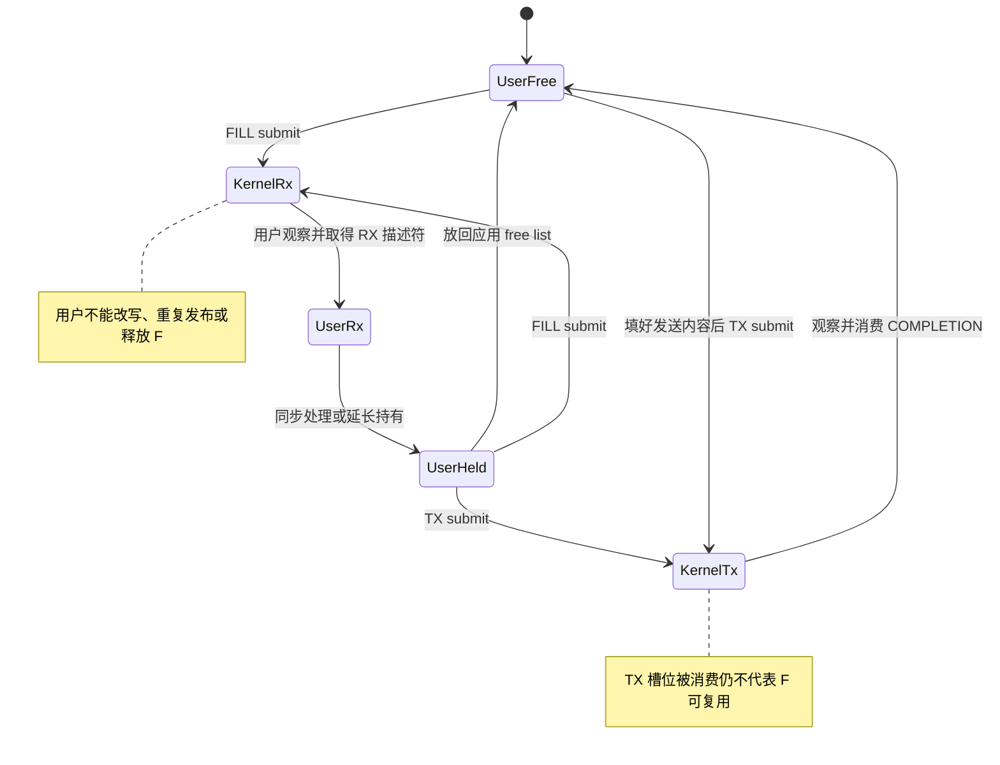
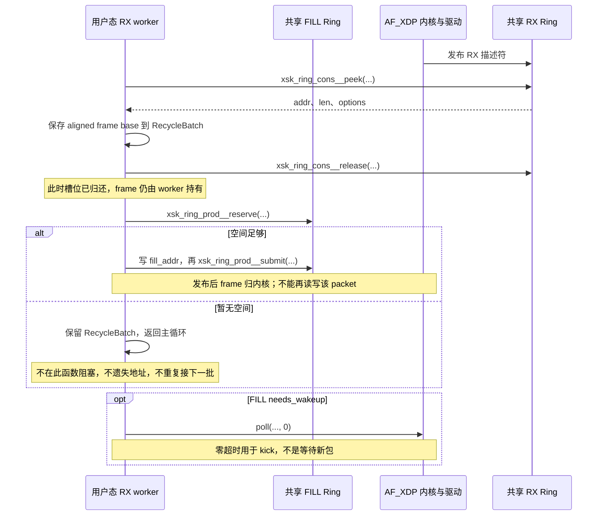

---
tags:
  - Linux
  - 高性能网络
  - AF_XDP
  - ZeroCopy
aliases:
  - AF_XDP 四环与 UMEM 所有权
  - XSK Queue Binding
status: 已完成
created: 2026-09-11
updated: 2026-09-11
阅读次数: 0
---

# 19.6 AF_XDP：UMEM、Fill/Completion Ring、Zero-Copy 与 Queue Binding

> **AF_XDP 最重要的不是记住四个 Ring 的名字，而是能在任意时刻说清：一个 UMEM frame 归谁，谁还可能读写它，什么事件允许它再次被使用。** 所谓 Zero-Copy，只是减少数据主体的 CPU 复制；队列推进、DMA、内存顺序、资源回收和协议职责都没有消失。

## 1. 与 XDP、普通 socket 和 RDMA 的边界

先读 [[19.5 XDP 与 eBPF 高速数据路径：Hook、XDP_PASS-DROP-REDIRECT 与 Driver Mode|19.5 XDP 与 eBPF 高速数据路径]]，理解 Native / Generic 模式和 `XDP_REDIRECT` 的两阶段含义。本篇以**一个 netdev、一个 RX queue、一个用户态 worker、一个非共享 UMEM**建立模型，再扩展到多队列和共享 UMEM。

| 接口 | 应用拿到的主要抽象 | 谁负责普通 TCP/IP 协议语义 |
| --- | --- | --- |
| TCP / UDP socket | 字节流或 UDP datagram | Linux 协议栈 |
| AF_XDP socket，简称 XSK | UMEM 中的报文及 RX/TX 描述符 | 被旁路的功能需由应用或其运行时承担 |
| RDMA verbs | QP、WR、CQE、MR 与远端访问语义 | 相应 RDMA 传输及应用协议；不是 AF_XDP Ring |

AF_XDP 保留 Linux 驱动和管理接口，但选定数据包可以绕开普通协议栈的较长路径。**它不是“自动加速现有 TCP socket”的库，也不是可以远程读写另一台机器内存的 RDMA 操作。** 以太网帧如何形成有效 IP/UDP/TCP 报文、ARP/ND 怎么办、需要何种可靠性，都应作为设计边界明确写出。[^af-xdp][^xskmap]

项目教材 *Systems Performance* 第 2 版提供内核旁路、共享 ring 和观测成本的背景；四环协议、queue binding 与当前配置接口依据 Linux 官方说明、UAPI 和 libxdp 源码展开，不把具体 API 伪装成教材原文。[^book]

**版本口径**：Linux-only；说明采用 Linux 6.x 常见机制，libxdp helper 的名称与行为核对 **xdp-tools v1.6.3**。用户态示例为 **C++17**；BPF 入口为 **BPF C**。不同内核、驱动和工具的可用能力必须实际探测。

---

## 2. 先认清对象，而不是先背调用顺序

| 对象 | 作用 | 生命周期要求 |
| --- | --- | --- |
| UMEM backing memory | 真正存放报文的数据内存 | 必须覆盖所有关联 socket、在途 DMA 与使用该内存的任务 |
| UMEM 注册对象 | 向内核描述这块内存及 chunk/headroom 等配置 | 解除前不能还有依赖它的 XSK |
| AF_XDP socket | 绑定某个设备与 queue 的收发端点 | 用户态持有句柄，内核维护相应队列与引用 |
| RX / TX Ring | 发布收到或要发送的描述符 | 属于对应 XSK；各自为 SPSC |
| FILL / COMPLETION Ring | 转移可收包帧与可回收发送帧 | 简单模型是一对；共享模型按资源域细分 |
| XSKMAP | 使 XDP 程序能够选择目标 XSK | map 中插入的是可解析为 socket 的 fd 引用，不是 UMEM 指针 |
| worker / frame allocator | 消费 Ring，分配、借出和回收帧 | 必须维持不重复借出、不提前释放的约束 |

RX-only 和 TX-only 都合法，至少配置一条 RX 或 TX Ring。使用 `xsk_socket__create()` 时，**RX-only 的 `tx` 参数传 `nullptr`，TX-only 的 `rx` 参数传 `nullptr`**；不要把“关闭哪个方向”与“保留哪个方向”说反。TX-only 的发送不依赖一个负责收包的 XDP 程序；它也不应无意义地往 FILL 填帧。[^xsk-header][^af-xdp]

## 3. UMEM：虚拟地址、offset、frame 和 packet 是四回事

### 3.1 内存在哪里

UMEM 是用户态分配并注册给内核的一段**虚拟连续**内存，可通过适当的 `mmap` 等方式建立。它不是“网卡板载内存”，也不要求物理页天然连续。内核负责相关页面与设备映射管理；普通 huge page 不是基础 AF_XDP 的必选条件，特殊布局和驱动能力另行确认。[^af-xdp][^xsk-core]

这里继续使用 [[8.高性能存储/0. 数据路径硬件基础/0.3 DMA IOMMU 与 Pinned Memory|DMA / IOMMU / Pinned Memory]] 的三个地址模型：

- 应用使用虚拟地址访问数据；
- AF_XDP 描述符使用 UMEM 的逻辑地址表示；
- 驱动与设备使用对应的 DMA address / IOVA。

把 descriptor 的 `addr` 强制转换成用户态指针是错误的；把它当作已经可交给设备的物理地址同样错误。

### 3.2 单帧 aligned 模式的例子

假设本实验配置：UMEM 为 16 MiB，chunk/frame size 为 4096 B，使用 aligned 模式，关闭 multi-buffer。

$$
N_{frames}=16\times 1024\times 1024 / 4096=4096
$$

这是**内存布局示例，不是性能推荐值**。chunk base 可以是 0、4096、8192……；报文起始地址可能还包含接收 headroom 等偏移。用户自定义 headroom、XDP 所需空间、报文长度和驱动限制共同决定可用容量，不能直接认为“4096 B chunk 就一定能收 4096 B payload”。

对普通 aligned 地址，访问报文数据通常经由 `xsk_umem__get_data(umem_base, desc.addr)`；回收到自己的 chunk allocator 时，应恢复对应 frame 身份。**读取报文要用报文起点，回收 frame 要用分配器约定的 frame 标识，二者不是永远同一个数。**[^xsk-header]

### 3.3 不要把 aligned 的掩码规则复制到 unaligned 模式

在 aligned 模式，地址归属可依据配置的 power-of-two chunk size 计算；同一 chunk 内不同偏移不能当成两块独立帧重复借出。

unaligned 模式允许不同的地址表达，并有 `xsk_umem__extract_addr()`、`xsk_umem__extract_offset()`、`xsk_umem__add_offset_to_addr()` 等辅助函数。应使用与当前模式匹配的 API 与分配器，不能盲目执行 `addr & ~(4096 - 1)`。注册了同一内存，不代表任意重叠的区间都能同时使用。[^af-xdp][^xsk-header]

---

## 4. 四个 Ring：传的是地址和描述符，不是四份报文副本

![[图片/SVG/3_19_19_6_1.svg|900]]

图上方是接收闭环，下方是发送闭环。**FILL 和 COMPLETION 不是另外两条数据 payload 通道，而是缓冲区所有权的交接通道。** 图采用单 XSK、非共享 UMEM 模型。

| Ring | 用户态角色 | 内核角色 | 主要条目 | 交接后的含义 |
| --- | --- | --- | --- | --- |
| FILL，FQ | producer | consumer | UMEM frame 地址 | 用户把空闲 frame 交给内核用于 RX |
| RX | consumer | producer | `xdp_desc`：addr、len、options | 内核把收到的报文交给用户 |
| TX | producer | consumer | `xdp_desc`：addr、len、options | 用户把要发送的 frame 交给内核 |
| COMPLETION，CQ | consumer | producer | 可回收 frame 地址 | 内核归还已处理的 TX frame 所有权 |

这些共享 Ring 是 **single-producer / single-consumer**，通常配置为 2 的幂大小。内核在实现内部处理自身协作；这不是让多个用户线程直接同时操作一个 producer/consumer 端的许可。[^xsk-header][^xsk-queue]

### 4.1 FILL 是接收缓冲供应，不是“要发出去的包”

没有持续补充可用帧，内核和 NIC 的接收路径最终会失去承载新包的空间。FILL 空不保证“此刻一个包也收不到”，因为驱动可能已经取走并持有一批 buffer；它表示供应链断了，缓存消耗完后会出现问题。

同理，看到 FILL 中很多空闲地址也不代表 RX 已经有数据。空闲承载能力与已到达报文是两类状态。

### 4.2 RX Ring 释放，不等于 UMEM frame 自动回收

`xsk_ring_cons__release(&rx, n)` 归还的是 **RX Ring 的描述符槽位**。它不自动把这些 frame 填回 FILL，不自动发往 TX，更不自动放回应用自己的 free list。

只有应用明确归还或转交 frame，缓冲区闭环才完成。遗漏这一步可能表现为“程序起初能收包，运行一会儿就没包了”，而不是立即出现明显的内存分配错误。

### 4.3 CQ 不是 RX 的完成通知，也不是远端 ACK

CQ 的角色是归还 **TX 相关 frame**，不是在 RX 后又确认一次收包。内核消费 TX Ring 的槽位，也不等于已经允许应用改写对应 frame；必须遵守完成侧的归还协议。

当前官方文档明确将 CQ 描述为所有权回收点，并说明某些被拒绝的非法 TX 描述符也会涉及回收。因此**不能把 CQ 条目当成成功上网线、更不能当成对端应用收到数据的证明**。针对旧内核，非法描述符与回收细节需核对实现，不能用最新描述猜测老版本错误路径；应用本身不应产生非法描述符。[^af-xdp][^xsk-core]

## 5. 所有权状态机：任一 frame 在同一时刻只能属于一个域

以一块 frame F 为例：



这里按“允许谁处理/复用”抽象状态，不要求内核内部恰好用这些枚举值。图也没有宣称 FQ 中每一块 frame 必定到达 RX：内核可能暂存、重用或在错误路径回收资源。

### 5.1 三种最危险的重复使用

**同一帧同时进入 FILL 和 TX。** NIC 可能把新入站报文写进仍在被发送路径读取的内存，表现为偶发数据破坏，而不一定触发崩溃。

**把 RX 数据指针交给异步任务后立即补回 FILL。** 指针数值没变，但其中数据已经可能被下一包覆盖。解决方向是显式延长 frame 持有、移交到带所有权的任务对象，或复制业务所需的小数据。

**释放 Ring 槽位之后继续读旧 descriptor。** 内核可覆盖那个槽位；需要保留的 addr/len/options 应在 release 前复制到自己的元数据对象。即使底层 packet frame 仍归用户，原 descriptor 槽位也不再归用户。

这些问题不是“加一个 `volatile`”可以修复的。必须修复所有权转移与发布顺序。

### 5.2 怎样检查自己有没有丢 frame

对应用设计一个互斥的状态分类，在一致快照下检查：

$$
N_{free}+N_{rx\_kernel}+N_{rx\_ready}+N_{app\_held}
+N_{tx\_kernel}+N_{cq\_ready}=N_{total}
$$

这是**工程审计模型**，不是把四个 Ring 的当前 occupancy 相加就能得到的内核公式。已经从 FILL 取走并放入硬件 RX ring 的帧、应用异步持有的帧、已离开 TX ring 但仍在途的帧，都可能不在四环可见槽位里。

调试构建可为每个 frame 记录状态与最近迁移序号，抓重复借出和异常状态转换；性能构建可降低这种审计的采样比例。审计开销本身也应计入测试口径。

---

## 6. Copy 与 Zero-Copy：必须说清省掉哪一次复制

![[图片/SVG/3_19_19_6_2.svg|900]]

图中蓝色与绿色路径对照的是**收到报文的数据主体**，不是完整的所有控制结构。两条路径都存在 CPU 调用和内存传输。

### 6.1 Copy Mode

典型路径是网卡先把数据 DMA 到驱动接收缓冲，XDP 选择目标 XSK 后，内核将报文数据复制到由 FILL 供应的 UMEM frame，再通过 RX Ring 交付应用。

与普通 socket 相比，接口与协议处理路径可能已经更短；但这不意味着该次 packet payload 的 CPU copy 已经消失。[^xsk-core]

### 6.2 Zero-Copy Mode

在支持它的驱动上，RX 使用与 UMEM 关联的缓冲，NIC 可以把报文直接 DMA 到这些主机内存页。用户拿到 RX 描述符后读取同一份数据，省掉典型 Copy Mode 中从驱动缓冲到 UMEM 的那次数据复制。

TX 侧同样需要对应的驱动能力与所有权协议；不能在取得一次 RX 收益后就推断所有传输、封装或跨设备转发都零拷贝。应用若随后把整个 payload 复制进另一个业务对象，端到端路径仍然包含那次复制。[^xsk-core][^xsk-pool]

### 6.3 两个配置维度必须独立记录

| XDP 执行位置 | XSK 数据模式 | 解释 |
| --- | --- | --- |
| Generic / SKB | Copy | 兼容与功能验证路径 |
| Native / Driver | Copy | XDP 入口较早，但向 UMEM 交付仍可包含复制 |
| Native / Driver | Zero-Copy | 需要额外的 AF_XDP ZC 驱动支持与合适配置 |
| Hardware Offload | 不作通用组合承诺 | 不应默认视为 Native + ZC 的“更高档位” |

**“用了 `-N` / Driver Mode”不能证明 Zero-Copy；“用了 AF_XDP”也不能证明 Zero-Copy。** 显式 `XDP_COPY` 强制 Copy；显式 `XDP_ZEROCOPY` 要求 ZC，不满足就应失败。不强制模式时可能发生 fallback。[^af-xdp]

### 6.4 从已经绑定的 socket 查询实际模式

下面是可集成到 C++17 程序中的完整查询函数，**不是独立 AF_XDP 程序**。参数是借用 fd，不负责 close。它使用真实 Linux UAPI；调用失败时抛出携带 errno 的异常，不能静默当作 Copy 模式。

```cpp
#include <linux/if_xdp.h>
#include <sys/socket.h>
#include <cerrno>
#include <stdexcept>
#include <system_error>

bool af_xdp_is_zero_copy(int borrowed_fd)
{
    xdp_options options{};
    socklen_t length = sizeof(options);
    if (::getsockopt(borrowed_fd, SOL_XDP, XDP_OPTIONS,
                     &options, &length) == -1) {
        throw std::system_error(errno, std::generic_category(),
                                "getsockopt(XDP_OPTIONS)");
    }
    if (length < sizeof(options)) {
        throw std::runtime_error("XDP_OPTIONS returned a short result");
    }
    return (options.flags & XDP_OPTIONS_ZEROCOPY) != 0;
}
```

控制路径在 `xsk_socket__create()` 成功后使用 `xsk_socket__fd()` 取得借用 fd，再调用该函数并写入实验元数据。查询到 ZC 只证明该 XSK 的模式，**不证明应用从收包到最终输出全程没有复制**。这段查询函数已经在交付环境以 C++17 编译并测试错误分支；没有在该环境创建真实 XSK 验证成功分支。

---

## 7. Queue Binding：XSKMAP 下标不是硬件转向开关

![[图片/SVG/3_19_19_6_3.svg|900]]

读图时固定一件事：这个包已经由设备 `ethX` 的 **RX queue 2**进入当前 XDP 上下文。map key 可以是 2、7 或其他合法下标；决定是否允许向某个 XSK 交付的，是**目标 XSK 绑定的设备与 queue 是否匹配来源**。[^xskmap][^xsk-core]

### 7.1 三个“编号”不能混为一谈

| 编号 | 由什么决定 | 修改它会发生什么 |
| --- | --- | --- |
| RX queue id | RSS、硬件 filter 或设备接收机制 | 改变初始接收队列；需对应设备能力 |
| XSKMAP key | BPF 程序与用户态共同约定 | 选择某个已注册 socket，不迁移来源 queue |
| CPU id | IRQ/NAPI 调度、线程 affinity 等 | 改变执行位置；不是 socket queue id |

常见习惯是 `key = ctx->rx_queue_index`，因为这样便于“一队列一个 XSK”。这是**软件映射约定**，不是 Linux 要求 map key 的数值必定等于 queue id。

所以，对 queue 2 的包，`map[7]` 指向同设备 queue 2 的 XSK 可以是合法设计；`map[2]` 指向 queue 5 的 XSK 则不能仅靠“下标写对了”通过检查。

### 7.2 如何让目标流量真正进入所绑定的 queue

先读当前 RSS indirection table、接收队列数和 per-queue 统计，再决定采用多流 RSS、设备支持的精确过滤或隔离实验的单队列配置。不要把所有 RX queue 都改成一条后，继续拿结果称作多队列扩展测试。

```bash
# 只读检查。IF 替换为实验接口，不在此处改动队列或过滤规则。
ethtool -l "$IF"
ethtool -x "$IF"
ethtool -n "$IF"
ethtool -S "$IF"
cat "/sys/class/net/$IF/device/numa_node"
lscpu -e=CPU,CORE,SOCKET,NODE,ONLINE
```

命令不被支持时保留错误与驱动信息，而不是自动写入替代设置。设备报告 NUMA node 为 `-1` 表示信息未知，不能简单解释为“所有节点等距”。精确 queue steering 的命令、匹配键与支持范围依驱动，需在隔离环境核对，不提供跨设备通用的强制写入配方。[^scaling]

### 7.3 绑 queue 不等于绑 CPU

一个起点是让 NIC、UMEM 所在节点、驱动处理 CPU 与 worker 保持合适局部性，依据 [[8.高性能存储/0. 数据路径硬件基础/0.5 NUMA CPU 亲和性与内存亲和性|NUMA 的线程—页面—设备模型]]检查，而不是仅看 `taskset` 输出。

普通 softirq 模式下，让重负载 worker 与驱动争同一个核可能有代价；经过明确配置的 busy-poll 模型又可能选择同核。**不存在“queue 2 就绑 CPU 2”或“永远同核”的通用规律。** 先看实际 IRQ/NAPI 位置，再做同核与同 NUMA 不同核的对照。[^napi][^example]

---

## 8. 一个最小 XSKMAP BPF 入口

下面是一份可保存为 `xsk_redirect.bpf.c` 的独立 **BPF C** 文件。它只演示“一条 queue 对应一个 map key”，不解析 UDP，也不接管全部设备的所有 queue。

```c
#include <linux/bpf.h>
#include <bpf/bpf_helpers.h>

struct {
    __uint(type, BPF_MAP_TYPE_XSKMAP);
    __uint(max_entries, 64);
    __type(key, __u32);
    __type(value, __u32);
} xsks_map SEC(".maps");

SEC("xdp")
int xsk_redirect(struct xdp_md *ctx)
{
    __u32 key = ctx->rx_queue_index;
    /* 未安装接收者时 PASS；不保证后端错误时回退。 */
    return bpf_redirect_map(&xsks_map, key, XDP_PASS);
}

char LICENSE[] SEC("license") = "GPL";
```

用户态在 UMEM、FILL、socket binding 都准备好后，将 `xsk_socket__fd()` 对应的 fd 写入约定 key。map 的 `max_entries = 64` 是示例上限，不代表设备恰好有 64 个 queue。若实际 queue id 超出范围，应调整 map 规划，而不是依赖 lookup 失败后“偶尔能工作”。

> [!warning] 该入口接管命中 queue 上的全部报文
> map 项一旦存在，ARP、IPv6、控制流量也可能被重定向，不能直接挂到 SSH 管理网口。实际应用通常先分类，只将自己负责的流量转给 XSK；未知或管理流量保留 PASS。可复用 [[19.5 XDP 与 eBPF 高速数据路径：Hook、XDP_PASS-DROP-REDIRECT 与 Driver Mode|19.5 的有界解析思路]]，但应按实际协议补齐支持范围。

`bpf_redirect_map()` 的 fallback 是查找失败动作。它不等价于“当 FILL 空了，就自动让 TCP/UDP socket 接收”，也不等价于“当 XSK queue 不匹配，就重新路由”。[^helpers][^xskmap]

## 9. libxdp 的 Ring API：reserve / submit 与 peek / release

当前用户态 AF_XDP helper 使用 `<xdp/xsk.h>`。旧教程常见 `<bpf/xsk.h>`；AF_XDP helper 从 libbpf 迁出后，应检查项目使用的是哪一套库，不要只改 include 路径却保留不匹配的链接与配置字段。[^libxdp]

| 操作 | 核心含义 | 不能误认为 |
| --- | --- | --- |
| producer `reserve(n)` | 预留本端可写槽位，推进本地 cached cursor | 内核已经看到这 n 条描述符 |
| producer `submit(n)` | 以正确发布顺序推进共享 producer | 每条 TX 已经发送完成 |
| consumer `peek(n)` | 观察已发布条目，取得本端可读位置 | 必须恰好返回 n 条 |
| consumer `release(n)` | 归还槽位，推进共享 consumer | UMEM 自动回到 free list |
| consumer `cancel(n)` | 回退尚未释放的本地消费预留 | 可以撤销已经发布给内核的 TX |
| `needs_wakeup()` | 判断是否需要额外 kick 以推进路径 | 判断是否有业务报文或是否收到远端 ACK |

在核对的 helper 实现中，producer reserve 对请求批量返回全部数量或 0；consumer peek 可以返回更小的可用数量。必须按实际返回值写代码，不能把 ring 暂时没有空间当成无害的“反正后面总会处理”。[^xsk-header]

发布顺序概括为：**先写条目和需要可见的数据，再发布 producer；先观察 producer，再读取条目；处理完元数据后再归还 consumer。** 直接用普通 load/store 或 `volatile` 重写共享索引，容易丢失跨核内存顺序要求。

---

## 10. C++17 收包回收片段：Ring 满时也不能丢失 frame

这里不手写一个省掉全部错误处理的“完整 AF_XDP 框架”。以下代码是可以集成的**RX-only 数据面片段**；完整 socket 建立与负载生成使用第 13 节官方 `xdpsock` 实验。

明确前提：aligned、4096 B chunk、单 buffer packet、关闭 `XDP_USE_SG`、同一个 worker 独占 RX consumer 与 FILL producer；FILL 容量至少为批量上限，传入的 Ring 已初始化并且生命周期足够长。示例只丢弃收到的包，不读取 payload，不提供 TX 或异步业务回调。

### 10.1 用固定数组保存“暂时无法补回 FILL”的所有权

不能在 reserve 失败后丢弃已经取出的 frame 地址。这里用固定大小待回收批次，避免热路径动态分配；状态对象不是 UMEM 所有者，但明确保留这些 frame 的借出记录。

```cpp
#include <xdp/xsk.h>
#include <array>
#include <cstdint>

constexpr __u32 batch_limit = 64;
constexpr __u64 frame_size = 4096;
struct RecycleBatch {
    std::array<__u64, batch_limit> frames{};
    __u32 count = 0;  // 这些 frame 仍由本 worker 持有。
};
```

### 10.2 先尝试归还上次积压，再接下一批

`reserve` 失败就保留原状态，不循环空转、不重复发布。`submit` 成功后这些 frame 不再归应用使用，计数清零只是删除本地的持有记录。

```cpp
bool flush_recycle(xsk_ring_prod& fill, RecycleBatch& batch)
{
    if (batch.count == 0)
        return true;
    __u32 index = 0;
    if (xsk_ring_prod__reserve(&fill, batch.count, &index)
        != batch.count)
        return false;
    for (__u32 i = 0; i < batch.count; ++i)
        *xsk_ring_prod__fill_addr(&fill, index + i) = batch.frames[i];
    xsk_ring_prod__submit(&fill, batch.count);
    batch.count = 0;
    return true;
}
```

### 10.3 释放 descriptor 槽位，但独立保存 frame 身份

在 release 前复制 descriptor 中需要的信息。这里恢复的是 **aligned chunk base**，只在上述固定配置下成立。积压地址被保留在 `batch` 中，因此 FILL 暂满时也不会把这些 frame 从所有权账本中“弄丢”。

```cpp
__u32 receive_drop(xsk_ring_cons& rx, xsk_ring_prod& fill,
                   RecycleBatch& batch)
{
    if (!flush_recycle(fill, batch))
        return 0;  // 返回主循环做 progress / wakeup，而非自旋。
    __u32 index = 0;
    const __u32 n = xsk_ring_cons__peek(&rx, batch_limit, &index);
    if (n == 0)
        return 0;
    for (__u32 i = 0; i < n; ++i) {
        const auto* desc = xsk_ring_cons__rx_desc(&rx, index + i);
        batch.frames[i] = desc->addr & ~(frame_size - 1);
    }
    batch.count = n;
    xsk_ring_cons__release(&rx, n);  // 只释放 RX 描述符槽位。
    (void)flush_recycle(fill, batch); // 失败则 count 保留到下一轮。
    return n;                       // 返回收割数量，不代表 FILL 已补回。
}
```



时序中两个归还点是不同的：**release 归还 descriptor，submit 交出 frame**。这就是不能把“一个 ring 函数调用完成”当成所有资源同时释放的原因。

### 10.4 主循环还必须做什么

每轮都要处理 need_wakeup / progress，包括 `receive_drop()` 返回 0 的路径。不能只有“收到包后才 kick”，否则在 FILL 耗尽导致 RX 不再产生包时，可能形成等待环。

该片段没有异步解析、共享 UMEM、TX、multi-buffer、关闭协议或初始化失败回滚，不应脱离前提作为完整应用发布。下面各节给出这些职责的边界。生产代码通常使用更完整的 free-frame allocator 与状态审计，而不是仅一个待回收批次。

---

## 11. need_wakeup：唤醒推进与等待就绪是两件事

在 bind 时启用 `XDP_USE_NEED_WAKEUP` 后，FILL 和 TX 这两个用户态 producer Ring 可以告知应用是否需要额外 syscall 来推进处理。它不是“永远零 syscall”承诺，也不是新的数据所有权协议。[^af-xdp][^xsk-core]

### 11.1 RX：补了 FILL，不一定已经重新启用接收

典型停顿是：FILL 与驱动预持有 buffer 消耗完，设备无法继续接收，相关路径设置 need_wakeup。应用发布新 frame 后，通过 `poll()` 等受支持的接口让内核重新推进接收。

下面也是**集成片段**：已启用 need_wakeup，fd 借用，FILL 已初始化。零超时表示不为了等新包而睡眠；内部系统调用仍有自己的执行成本。

```cpp
#include <poll.h>
#include <cerrno>
#include <system_error>
#include <xdp/xsk.h>

void kick_rx_if_needed(int fd, const xsk_ring_prod& fill)
{
    if (!xsk_ring_prod__needs_wakeup(&fill))
        return;
    pollfd pfd{fd, POLLIN, 0};
    const int rc = ::poll(&pfd, 1, 0);
    if (rc == -1 && errno != EINTR)
        throw std::system_error(errno, std::generic_category(), "poll(XSK)");
    if (rc > 0 && (pfd.revents & (POLLERR | POLLHUP | POLLNVAL)))
        throw std::system_error(EIO, std::generic_category(), "XSK poll state");
    // EINTR：保留所有状态，下一轮重新检查；0 也不等于故障。
}
```

`EINTR` 不转移任何新的 frame 所有权。生产主循环还应检查退出请求、错误状态与实际计数器，不可因为 kick 函数没有抛异常就认定收包链路恢复。

### 11.2 TX：submit 之后按需通知，不能因通知失败重发同一帧

TX 发布后，若 `xsk_ring_prod__needs_wakeup(&tx)` 为真，可按接口约定使用零 payload 的非阻塞 `sendto()` 来 kick。此时 payload 已经通过 TX 描述符给出；这个 syscall 不是再次复制一次业务报文。

当返回 `EAGAIN`、`EBUSY` 或被信号中断时，应按具体实现与主循环策略重试 progress、消费 CQ、检查错误，**不应把同一 frame 再发布进 TX，也不应因为 kick 失败立刻改写它**。最终错误处理需遵守关闭协议。非预期错误不能全部吞掉。[^xsk-core][^example]

### 11.3 Busy loop 不等于 Busy Poll

用户线程不断 `peek()`，只是反复查看共享 RX Ring；它不会凭空保证驱动在该线程上运行。内核 busy-poll 则涉及支持的接口、NAPI 与相关配置。

`poll()` 既可以用零超时 kick，也可以用非零超时等待事件；两种目的要分别写清。等待机制的基本取舍见 [[8.高性能存储/0. 数据路径硬件基础/0.6 Interrupt Busy Polling 与 Context Switch|0.6 Interrupt 与 Busy Polling]]。[^napi]

## 12. 初始化、失败回滚与停止顺序

### 12.1 推荐以“最后打开流量闸门”组织控制面

一个清晰的初始化方案是：先识别设备/queue 与 CPU/NUMA，建立并首次触碰 UMEM 内存，再注册 UMEM、配置 Ring、创建并绑定 XSK、填充初始 FILL。XDP 程序在未安装 map 项时走 PASS；**最后才发布有效的 XSKMAP 项**，让受控流量开始进入应用。

使用自定义入口时，检查 `XSK_LIBXDP_FLAGS__INHIBIT_PROG_LOAD` 及所用创建接口，避免“应用加载了一份程序，库又自动管理了另一份”的所有权混乱。map 更新成功也不保证之前未命中流量可以追回。[^xsk-header][^libxdp]

### 12.2 用 RAII 管依赖顺序，不只管单个 fd

| 资源 | 建议所有者 | 必须晚于它释放的依赖 |
| --- | --- | --- |
| XSK handle | 自定义 RAII wrapper / unique_ptr deleter | UMEM 注册对象和 backing memory |
| UMEM handle | 了解 `xsk_umem__delete()` 返回值的所有者 | backing memory |
| backing memory | mmap RAII 区域或稳定的已分配内存所有者 | 无，但不能早于任何使用者 |
| XSKMAP 管理权 | 创建或获授权维护此 map 的控制对象 | 要与 socket 关闭协调 |
| worker 与异步任务 | 应用生命周期对象 | 其借用的 frame 和所有 Ring |

`xsk_socket__fd()` 返回借用的内部 fd。用 libxdp handle 管理 socket 时，不能又让另一个独立 fd owner 重复 close 它。UMEM backing memory 的地址在注册后必须稳定，不能因容器扩容而迁移。

libxdp 创建函数的传统接口通常返回 **0 或负 errno**，系统调用则常用 **-1 + errno**。混用错误处理会打印错误的诊断。`xsk_umem__delete()` 可能因仍有依赖而返回 `-EBUSY`；不能忽略它后立即解除内存映射。[^xsk-header][^xsk-lib]

### 12.3 有界、可解释的停止流程

停止新流量进入当前 XSK，撤销或替换自己管理的 map 项；让 worker 停止提交新 TX；处理残余 RX，等待或回收 TX completion，并设置明确的关闭超时。然后退出并 join 使用这些 Ring/packet 的任务，删除所有关联 XSK，解除 UMEM 注册，最后释放 backing memory。

若在途工作未能在截止时间内正常排空，不要无限等待，也不要直接复用仍可能被设备访问的内存。应进入可观测的错误关闭路径，由 socket/驱动关闭过程解除依赖；共享 UMEM 要考虑所有 socket，而不仅是当前线程的一只 socket。

这是**基于资源依赖关系的工程方案**，不是允许用户跳过驱动 cleanup 的“快速退出技巧”。关闭期间 map 变更与已有接收处理可能重叠，必须保证对象仍存活到其真正不再被使用。

---

## 13. 完整实验优先使用官方 xdpsock

采用 xdp-project/bpf-examples 中的 `AF_XDP-example`。它来自原内核样例，提供 rxdrop、txpush 和 MAC-swap l2fwd 等微基准；这是有实际代码的参考项目，不是本文虚构的实验框架。[^example]

### 13.1 保存可复现版本，再准备实验接口

```bash
git clone --recurse-submodules https://github.com/xdp-project/bpf-examples.git
cd bpf-examples
git rev-parse HEAD
# 按该 checkout 的顶层 README / Makefile 安装依赖并构建。
# 构建完成后再进入 AF_XDP-example 使用 xdpsock。
```

本笔记核对了 `AF_XDP-example/xdpsock.c` 中 `-r`、`-N`、`-S`、`-c`、`-z` 的含义；运行时仍应先看当前 checkout 的 `./xdpsock --help`，记录 commit，不假定 main 永远不变。**不在管理接口上试“全部重定向”；使用专用网口与独立发包端。**

```bash
uname -r
ethtool -i "$IF"
ethtool -l "$IF"
ethtool -x "$IF"
ethtool -k "$IF"
ethtool -c "$IF"
# 编译完成后，在 AF_XDP-example 目录查看当前版本选项。
./xdpsock --help
```

### 13.2 明确比较 Copy 与 Zero-Copy

设 `IF` 为实验网口、`Q` 为流量真实到达的 queue、`APP_CPU` 为经过拓扑检查的 worker CPU。下面两条命令**分别运行**，第一组完全退出、确认其程序与资源已清理后再运行第二组。

```bash
# A：Native XDP + 强制 Copy。
sudo taskset -c "$APP_CPU" ./xdpsock -i "$IF" -q "$Q" -r -N -c

# B：Native XDP + 强制 Zero-Copy；不支持就应该失败并记录原因。
sudo taskset -c "$APP_CPU" ./xdpsock -i "$IF" -q "$Q" -r -N -z
```

`-r` 是 rxdrop：主要接收并回收，不等价于进行协议处理与实际业务。将其结果用作“这条底层数据路径的基线”，不要把它当成业务服务 QPS。Copy/ZC 比较要保持同一队列、同一 packet size、同样的 payload 访问与相同 CPU 预算。[^example]

### 13.3 发包与流量转向不能省略

从独立、受控的发包主机把以太网/IP 流量送到测试端口，先低速验证哪条 RX queue 在增长，再逐步增加 offered load。实际 XSK 绑定 queue 和收到的 flow hash 不匹配时，即使 `bind` 与 attach 都成功，也可能没有任何 RX 描述符。

初学可在隔离设备上选择明确可控的单队列实验；之后再扩展 RSS 多流、多队列。veth 能做功能练习，但不能证明物理网卡提供 UMEM 直接 DMA 的 Zero-Copy 路径。

### 13.4 一个最小实验记录表

| 项目 | 必须记录的内容 |
| --- | --- |
| 软件版本 | kernel、发行版、driver、firmware、libxdp、样例 commit |
| 路径 | XDP 模式、XSK Copy/ZC 实际查询结果、是否启用 SG |
| 放置 | NIC NUMA、UMEM 页位置、IRQ/NAPI CPU、worker CPU、SMT |
| 流量 | offered pps、帧长口径、封装、flow 数、RX queue、持续时间 |
| 工作量 | rxdrop / header parse / payload touch / l2fwd / 真实业务 |
| 资源 | 四环深度、UMEM 帧数、batch、need_wakeup、coalescing |
| 结果 | 接收/发送率、丢包、CPU、需要时的端到端 P50/P99 |

**计数边界**：NIC 线速帧、XDP 动作次数、AF_XDP 描述符数、应用报文数不是永远相同；multi-buffer 时一个 packet 对应多个 descriptor。rxdrop 本身没有应用层请求响应，不能从它的 pps 单独推导端到端 P99。

## 14. Shared UMEM：共享数据池，不是把 SPSC 变成 MPMC

### 14.1 同一设备、同一 queue

多个 XSK 可共享同一 UMEM，每个 socket 有自己的 RX/TX Ring；同一 `(netdev, queue_id)` 资源域使用同一对 FILL/CQ。应用必须给这对共享环安排明确的 producer/consumer 所有者，或者引入合适同步。

XDP 可以选择 map 中不同 socket，但这不会使共享环自动变成多生产者、多消费者。给每个 socket 一个线程，并不自动解决共享 FILL 与 CQ 的并发访问问题。

### 14.2 不同 queue 或不同设备

按照当前官方文档的共享 UMEM 专节，每个不同的 `(netdev, queue_id)` tuple 需要对应的 FILL/CQ pair；可使用适当的 `xsk_socket__create_shared()` 接口提供这些资源。不能把“整个 UMEM 永远只有一对 FILL/CQ”的简化入门图推广到所有共享场景。[^af-xdp][^xsk-header]

但即使这些 Ring 相互独立，底层帧池仍共享。**两个资源域不能同时借出同一块或重叠的 frame**。可以静态分区帧池，再通过专门的所有权通道做跨 worker 借还；不要仅因为地址处于同一 UMEM 就跳过内存生命周期检查。

### 14.3 为什么不一开始就共享

非共享、一队列一 worker 的起步模型更容易证明 SPSC 与 frame 唯一性。共享 UMEM 可用于减少某些转发路径上的数据复制或统一资源池，但会增加分配、跨队列协调与关闭处理的复杂度。这是**工程取舍**，并非“共享越多性能一定越好”。

---

## 15. Multi-buffer、metadata 与 offload 的版本边界

### 15.1 一个 packet 可以跨多个 frame

支持 multi-buffer 的组合可以使用 `XDP_USE_SG`，并要求相应的 XDP 程序模式，例如 `SEC("xdp.frags")`，以及匹配的内核、驱动和应用能力。

`xdp_desc.options` 中 `XDP_PKT_CONTD = 1` 表示当前 packet 还会继续；为 0 表示这是最后一段。即使完整 packet 已进入 RX Ring，应用一次 `peek(batch_limit)` 仍可能在 packet 中间截断，因此**组包状态必须跨 batch 保存**。[^af-xdp][^xsk-uapi]

如果业务要保留多个 fragment 的指针，必须等业务不再使用它们后才能回收每个 frame；不能在还没拿到最后一段时，先把第一段填回 FILL。固定 4096 B aligned 的第 10 节片段没有启用 SG，不能原样扩展成 jumbo packet 解析器。

### 15.2 长度与计数口径一起变化

$$
N_{descriptors}=\sum_{packet} N_{frames}(packet)
$$

这是帧/报文定义的直接计数关系。开启 SG 后 Ring capacity 是 descriptor capacity，未必等于可容纳的 packet 数。UMEM 的容量规划也应按 frame 数估算，而不是继续沿用“一条 RX 描述符等于一包”。

### 15.3 硬件 metadata 不是“原来的 skb 字段全部都在”

RX timestamp、RSS hash、VLAN 等信息是否可通过 XDP metadata 接口取得，取决于驱动实现。需要交给 AF_XDP 应用时，通常要设计明确的 metadata 格式、空间和版本；用户态不能假定每个 packet 前面都存在同样的私有头。[^rx-meta]

TX checksum、timestamp 等能力也有专门的 XSK TX metadata 接口与驱动支持要求。`ethtool -k` 显示普通 netdev offload 开启，不足以证明自己的 AF_XDP 报文获得同样处理。没有明确能力与配置时，应由应用保证需要的报文头与校验和正确。[^tx-meta]

### 15.4 读旧教程时要特别核对什么

| 常见旧写法或简化表述 | 当前阅读方式 |
| --- | --- |
| AF_XDP helper 位于 `<bpf/xsk.h>` | 核对库版本；本文使用 libxdp 的 `<xdp/xsk.h>` |
| Driver Mode 仍然只能 Copy | 与 Copy/ZC bind flags 专节、实际驱动支持一起看 |
| 每个 UMEM 永远只有一个 FILL/CQ pair | 区分相同 tuple 与跨 tuple 的共享模型 |
| 每包只有一个 frame | 核对 SG、程序 section 和 driver scatter 能力 |
| CQ 出现就是发送成功 | 只据此处理所有权；发送成功与端到端确认另有证据 |

这不是默默把旧材料“纠正后混写”，而是明确区分其适用范围。对于无法验证的历史内核错误路径，保留版本限定，不编造统一行为。

## 16. 性能与容量：不要靠加深 Ring 掩盖消费能力不足

缓冲区需要覆盖供应、在途、应用持有和回收延迟。根据 Little's law，在选定测量边界、稳定流量和单帧报文假设下，平均在途数量满足：

$$
E[N_{inflight}] = \lambda_{packets}\times E[T_{hold}]
$$

这是**容量推导起点，不是 pool size 推荐公式**：还要加上硬件预持有、批量发布、突发、尾部等待与安全余量；SG 时还要换成 frames 的口径。P99 hold time 不能简单代入后声称得到严格的池容量保证。

扩大 RX Ring 可以暂时吸收一部分突发，但不能让慢于输入速率的 worker 长期跟上。扩大 batch 可以摊薄固定开销，却可能增加等待与单次占核时间。反过来，过小的 batch 与过频 syscall 也可能提前消耗 CPU 预算。

建议按顺序实验：功能正确 → Copy 基线 → 强制 ZC 并验证 → NUMA 与 queue 放置 → batch/need_wakeup → 真实 payload 访问 → 多队列 → 共享或跨设备转发。每次只改变一个主要变量，同时记录丢包、CPU 和满足业务语义的延迟。[^book]

## 17. 排障表：先问停在哪个交接点

| 症状 | 应收集的证据 | 首要假设与检查 |
| --- | --- | --- |
| socket 创建失败 | 负 errno / errno、配置、版本、内存限额 | flags/尺寸/queue 无效，权限或驱动能力不符 |
| 强制 ZC bind 失败 | 驱动、固件、MTU、设备模式、已有绑定 | 不支持该组合；不是改成 Copy 后继续叫 ZC |
| NIC 有包，XSK 无 RX | per-queue 统计、XDP map/action、绑定 tuple | 流量在别的 queue；map 未安装或不匹配 |
| 刚启动有包，稍后停住 | frame 审计、FILL 供应、need_wakeup | 未回收 frame、FILL 饥饿、kick 缺失 |
| RX ring 满 | worker CPU、batch、持有时间、调度 | 应用消费或异步任务跟不上 |
| TX 越跑越慢 | CQ 消费、可用帧、在途计数、错误统计 | 没回收 completion 或错误提前复用 |
| 偶发包内容损坏 | frame 所有权与重复地址轨迹 | 同一 frame 同时进入不同域 |
| `tx_invalid_descs` 增长 | addr/len/options、边界、SG 组包 | 描述符有 bug；不能只提高 ring 深度 |
| 吞吐高但 P99 差 | 真实请求响应、排队、IRQ/worker 争用 | rxdrop 基准不能代替业务；批量和调度成本被隐藏 |

读取 `XDP_STATISTICS` 时使用当前 UAPI 的结构与返回长度，避免假设所有内核只有旧教程中的三个字段。驱动统计与 XSK 统计属于不同观察边界，应先理解字段再比较增量。[^xsk-uapi]

## 18. 自测与复述答案

**为什么有四环，而不是一条收发队列？** 报文描述符与缓冲区供给/回收是不同方向的交接，FILL 为 RX 提供承载空间，CQ 归还 TX 使用过的 frame；分离后才能清楚表达所有权。

**RX release 之后立刻访问 payload 是否永远错误？** 不应继续读已释放的 descriptor 槽位；但如果 frame 仍由应用持有且 packet 指针/元数据已安全保留，读取 payload 可以仍合法。真正禁止的是在 frame 已发布给 FILL/TX 或释放后继续使用。

**map key 是 7，socket 绑定 queue 2，能否收 queue 2 的包？** 可以，前提是来源设备相同且该 map 项确实指向可接收的 queue 2 XSK。key 是约定，不是硬件 queue 转向。

**为何 Driver Mode 不足以证明 ZC？** XDP 执行入口与 packet 交付是否复制是不同维度，必须显式约束 bind 并查询 `XDP_OPTIONS_ZEROCOPY`。

**CQ 出现以后，对端一定收到包了吗？** 不一定。CQ 是本地 frame 所有权回收；对端接收、协议确认和业务完成都属于别的事件。

**need_wakeup 为 0，是不是应用就不需要任何系统调用？** 它只描述相关 Ring 当下是否需要显式 kick，不覆盖程序的控制、等待、错误处理或其他系统调用。

**共享 UMEM 最应审查什么？** 每个 Ring 的 SPSC 端所有者，以及整个共享内存池的 frame 唯一性。分开两条 Ring 不能自动防止底层内存重叠。

---

## 19. 参考资料与验证记录

[^book]: Brendan Gregg, *Systems Performance: Enterprise and the Cloud*, 2nd ed., 2020. §10.4.3 “Software / Kernel Bypass”（书内 p.523；项目 PDF 第 822–824 页附近），§10.5.6 “Packet Sniffing”（项目 PDF 第 833–834 页）。用于旁路、DMA、共享 ring 与观测成本背景，不提供本文全部 AF_XDP API 细节。
[^af-xdp]: Linux Kernel Documentation, [AF_XDP](https://docs.kernel.org/networking/af_xdp.html)，重点阅读 “Rings”、“Configuration Flags and Socket Options”、“XDP_SHARED_UMEM”、“Multi-Buffer Support”，访问日期 2026-09-11。网页内存在历史性概述与更细的更新章节，本文已显式区分，不把概述推广为所有版本的实现保证。
[^xskmap]: Linux Kernel Documentation, [BPF_MAP_TYPE_XSKMAP](https://docs.kernel.org/bpf/map_xskmap.html)，访问日期 2026-09-11。
[^helpers]: Linux man-pages, [bpf-helpers(7)](https://man7.org/linux/man-pages/man7/bpf-helpers.7.html)，`bpf_redirect_map` 的 fallback 语义，访问日期 2026-09-11。
[^xsk-header]: xdp-project, [`headers/xdp/xsk.h`，v1.6.3](https://github.com/xdp-project/xdp-tools/blob/v1.6.3/headers/xdp/xsk.h)，Ring 操作、配置结构与地址 helper。
[^xsk-lib]: xdp-project, [`lib/libxdp/xsk.c`，v1.6.3](https://github.com/xdp-project/xdp-tools/blob/v1.6.3/lib/libxdp/xsk.c)，创建、销毁和资源依赖实现。
[^libxdp]: xdp-project, [libxdp README，v1.6.3](https://github.com/xdp-project/xdp-tools/blob/v1.6.3/lib/libxdp/README.org)，AF_XDP helper 迁移、加载管理与兼容性。
[^xsk-uapi]: Linux UAPI, [`include/uapi/linux/if_xdp.h`，v6.12](https://github.com/torvalds/linux/blob/v6.12/include/uapi/linux/if_xdp.h)，`sockaddr_xdp`、`xdp_desc`、bind flags、`xdp_statistics`、`xdp_options`。用于固定接口定位；更晚的错误回收说明不倒推为 v6.12 保证。
[^xsk-core]: Linux kernel, [`net/xdp/xsk.c`，v6.12](https://github.com/torvalds/linux/blob/v6.12/net/xdp/xsk.c)，收发、绑定与唤醒路径。错误路径仍需按运行版本复核。
[^xsk-pool]: Linux kernel, [`net/xdp/xsk_buff_pool.c`，v6.12](https://github.com/torvalds/linux/blob/v6.12/net/xdp/xsk_buff_pool.c)，XSK buffer pool 与设备映射关系。
[^xsk-queue]: Linux kernel, [`net/xdp/xsk_queue.h`，v6.12](https://github.com/torvalds/linux/blob/v6.12/net/xdp/xsk_queue.h)，Ring 生产消费、发布和消费顺序。
[^scaling]: Linux Kernel Documentation, [Scaling in the Linux Networking Stack](https://docs.kernel.org/networking/scaling.html)，访问日期 2026-09-11。
[^napi]: Linux Kernel Documentation, [NAPI](https://docs.kernel.org/networking/napi.html)，poll、IRQ、busy polling 的职责边界，访问日期 2026-09-11。
[^rx-meta]: Linux Kernel Documentation, [XDP RX Metadata](https://docs.kernel.org/networking/xdp-rx-metadata.html)，访问日期 2026-09-11。
[^tx-meta]: Linux Kernel Documentation, [AF_XDP TX Metadata](https://docs.kernel.org/networking/xsk-tx-metadata.html)，访问日期 2026-09-11。
[^example]: xdp-project/bpf-examples, [AF_XDP-example](https://github.com/xdp-project/bpf-examples/tree/main/AF_XDP-example)，已阅读 `README.org` 与 `xdpsock.c` 的 UMEM / socket 配置及参数定义。核对日期 2026-09-11；当次 `xdpsock.c` Git blob SHA 为 `1e59a29367c093b39ddccdeff5dcd7b669ff67be`。正式实验应另记录自己的 checkout commit。

**验证范围**：Markdown 链接、SVG 嵌入与 Ring 所有权路径已检查。`af_xdp_is_zero_copy()` 已完成 C++17 本地编译及无效 fd 错误分支测试；其余 libxdp 集成片段完成接口与静态逻辑检查，未在缺少 libxdp 开发环境的交付容器中编译。没有声称完成真实 XSK bind、verifier 加载、NIC DMA、ZC 或吞吐/尾延迟实测。
