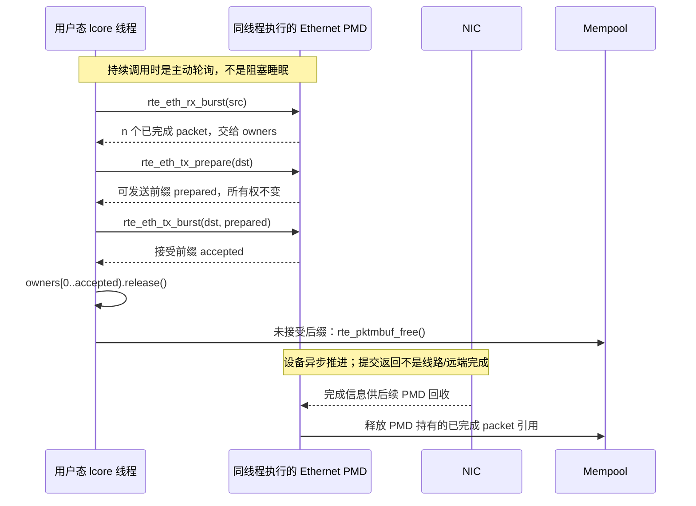
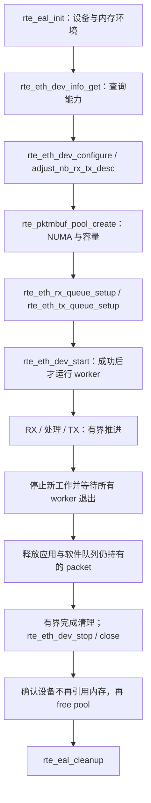

# 19.7 DPDK 数据平面：PMD、HugePage、mbuf、Mempool、RX/TX Burst 与 Poll Mode

> [!abstract] 本篇要建立的模型
> DPDK 不只是“把中断改成轮询”。典型直接访问硬件的 Ethernet PMD 把队列推进、报文处理和缓冲区管理组织在用户态：**应用线程调用 PMD，PMD 操作队列，NIC 执行 DMA，mbuf 的所有权在应用与驱动之间转移。**能否跑得快，取决于这条路径有没有多余复制、跨核交接、远端 NUMA 访问和无界排队。

> [!info] 版本与资料边界
> API 和命令以 **DPDK 24.11 系列**官方文档为基线，不表示这是最新版；Linux 对照采用 **6.8** 文档。叙述默认物理 Ethernet NIC、直接硬件 PMD、独占队列、常驻内存和普通主机缓冲区；mlx5 bifurcated driver、AF_XDP PMD、虚拟设备、inline 和外部内存属于需要另行核验的分支。教材负责解释体系结构与性能方法，具体 API 契约以官方资料为准。核验日期：2026-09-11。

前置硬件模型见 [[8.高性能存储/0. 数据路径硬件基础/0.3 DMA IOMMU 与 Pinned Memory|DMA、IOMMU 与固定内存]]：CPU 的指针、设备使用的 DMA 地址、内存的生命周期不是同一个概念。理解 [[8.高性能存储/0. 数据路径硬件基础/0.6 Interrupt Busy Polling 与 Context Switch|中断、忙轮询与上下文切换]] 后，本篇把这些机制落实到包处理。

## 1. 先分清：DPDK 提供了什么，没有提供什么

DPDK 是数据平面开发库集合。Ethernet PMD、EAL、mempool、mbuf、ring 等组件提供设备访问、内存管理与批量处理能力；**使用 Ethernet PMD 不会自动得到完整 TCP、HTTP、TLS 或可靠 RPC。**[D1][D2]

《Systems Performance》第 2 版 §10.4.3 把 DPDK 放在 kernel bypass 的语境下，也指出绕过传统路径会改变可观测性。本篇沿用这个定位，但不把教材的概括性表述解释成“应用直接读取网卡板载报文内存”：这里的典型缓冲区在**主机内存**，NIC 通过 DMA 读写它。[B1][D1][D2]

| 组件 | 管什么 | 不应误认为 |
|---|---|---|
| EAL | 环境初始化、设备探测、lcore 与内存基础设施 | 一套 TCP 协议栈 |
| Ethernet PMD | 某类设备的配置、RX/TX 队列操作与完成回收 | 自动运行的后台收包线程 |
| `rte_mbuf` | 报文元数据、数据区引用、分段与引用计数 | 网卡硬件 descriptor 本身 |
| `rte_mempool` | 固定大小对象的分配与归还 | 存放已收到报文的业务 FIFO |
| `rte_ring` | 软件对象/指针的队列化交接 | NIC 的 RX/TX descriptor ring |
| 应用数据面 | 分类、转发、协议状态、拥塞策略、业务语义 | DPDK 自动替你完成的部分 |

相对于常规 socket 路径，收益可能来自减少每包系统调用和通用栈处理、批量摊薄提交成本、复用内存、保持局部性；代价则是接管协议与资源治理。**删掉一个组件的开销，也可能删掉它原本提供的功能。**这是工程分工，不是单纯的快慢排名。

## 2. 全景：控制面仍依赖内核，快路径由用户线程推进

![[图片/SVG/3_19_19_7_1.svg|900]]

图中分开了三种动作：虚线为初始化和资源配置，蓝线为 NIC 与主机内存之间的 DMA，深色箭头为队列操作或控制通知。**PMD 与应用循环通常在同一个 lcore 线程中执行；并没有凭空增加一个“PMD 核”。**

### 2.1 EAL 先准备环境，才能讨论快路径

启动时需要明确可用设备、CPU affinity、内存来源、IOVA 模式和访问权限。`rte_eal_init()` 处理环境初始化；随后应用查询端口能力、配置队列和启动设备。设备映射、内存映射、IOMMU 设置等工作依然需要操作系统介入。[D2]

进入稳态后，应用反复调用 `rte_eth_rx_burst()` 和 `rte_eth_tx_burst()`。直接硬件 PMD 的常见实现通过读取主机内存中的完成信息推进 RX，通过填写 TX 描述符并发布给 NIC 推进发送。**“轮询”不等于每次都读一个昂贵的 MMIO 寄存器。**具体完成队列格式、门铃发布和批量回收由 PMD/硬件决定，不由应用自行模拟。[D1][D3]

### 2.2 三种后端，不能套同一张部署图

| 后端 | 内核的参与方式 | 部署上的关键限制 |
|---|---|---|
| VFIO 路径的直接 PMD | VFIO/IOMMU 等负责安全地暴露设备与 DMA 映射 | 交给 `vfio-pci` 的 PCI function 通常不再作为原来的内核网络接口使用 |
| mlx5 等 bifurcated 路径 | 内核驱动保留控制与资源管理，用户数据面使用自己的硬件队列 | **不要按 VFIO 教程解绑这类设备**；共存依赖具体 flow steering 配置 |
| AF_XDP PMD | DPDK Ethernet API 背后使用 AF_XDP 和内核 XDP/驱动机制 | PMD API 相同，不代表内核参与、复制次数与直接 PMD 相同 |

这三种情况分别由 Linux Drivers、mlx5 和 AF_XDP PMD 文档约束。[D4][D10][D11] 因而“DPDK 与 AF_XDP 必须二选一”和“所有 DPDK 都要解绑内核驱动”都不成立。

> [!warning] 管理面不能拿来做解绑实验
> 不要对承载 SSH、默认路由或存储连接的网口直接执行 `dpdk-devbind -b ...`。先确认独立管理路径、IOMMU group、原驱动、地址/路由恢复方案。`--noiommu-mode` 也不是普通权限错误的通用解决办法。[D4]

## 3. PMD、lcore、Queue：性能首先是所有权问题

`lcore` 是 DPDK 的逻辑执行单元概念，通常映射到具有 CPU affinity 的线程；不要把 lcore ID、Linux CPU ID、物理 core 和 SMT sibling 当成总是一一对应。NUMA 放置还要同时检查内存页和 PCIe 设备所在节点。[D2]

一个容易推理的起点是：**同一 RX queue 只有一个轮询者，同一 TX queue 只有一个发送者；不同队列可以由不同线程并行访问。**`RTE_ETH_TX_OFFLOAD_MT_LOCKFREE` 是 TX 共享队列的特定能力，不是所有 PMD 的默认保证，也不会自动保证业务消息顺序。[D1][D3][D7]

### 3.1 Run-to-completion

同一线程执行 `RX burst → 分类/处理 → TX burst`。它避免了每包跨线程交接，工作集比较集中，适合处理量可控的包处理逻辑。这里的 completion 指**本轮软件处理结束**，不是等待每个包的 NIC TX 完成，更不是等远端应用回复。[D1]

### 3.2 Pipeline

RX 线程把 mbuf 指针通过软件 ring 交给 worker，worker 再交给 TX 线程。它适合拆分重计算或专门阶段，但新增软件队列、同步、缓存行迁移和排队时间。交接通常只传指针，不代表没有 cache coherence 开销。[D1][D8]

使用 SPSC ring 时，必须真的只有一个 producer 和一个 consumer；MP/MC 的 ring 操作能力也只保护入队/出队，不保护多个线程同时修改同一个 mbuf 的内容。软件队列满了，要明确“未入队的对象归谁”，不能把失败当成所有权已经转移。

建议先从一队列一执行者的 run-to-completion 基线开始，再用热点证据决定是否分阶段。跨 NUMA 交接的额外代价，见 [[8.高性能存储/0. 数据路径硬件基础/0.5 NUMA CPU 亲和性与内存亲和性|CPU、内存与设备的 NUMA 亲和]]。

## 4. HugePage：优化地址转换，不是制造零拷贝

HugePage 增大页覆盖范围，可以缓解大内存工作集的 TLB 压力。《Computer Architecture: A Quantitative Approach》第 6 版附录 B.6 讨论了更大页与 TLB 项目的关系；它解释的是体系结构原理，不是 DPDK 的内存分配 API。[B2]

以**同一个 1 GiB 地址范围**作纯算术示意：4 KiB 页需要 262,144 个页映射，2 MiB 页需要 512 个，1 GiB 页需要 1 个。这不等于实际 TLB miss 分别减少同样倍数：硬件支持、各级 TLB 容量、访问局部性和映射方式仍决定结果。

### 4.1 六个经常被混为一谈的概念

| 概念 | 回答的问题 |
|---|---|
| VA | CPU 在当前地址空间里用哪个地址访问？ |
| PA | 页面对应哪段物理内存？ |
| IOVA | 设备发起 DMA 时使用哪个 I/O 地址？ |
| 内存固定/注册 | 设备使用期间，映射与 backing memory 能否保持有效？ |
| HugePage | 页大小及其地址转换粒度是什么？ |
| NUMA placement | 访问由哪个内存控制器服务，是否经过跨节点链路？ |

IOVA-as-VA 表示设备侧地址可以采用与 VA 对应的数值，不表示 NIC 在执行普通进程的 CPU 页表遍历。详细机制回到 [[8.高性能存储/0. 数据路径硬件基础/0.3 DMA IOMMU 与 Pinned Memory|DMA 地址与 IOMMU 映射]]。

### 4.2 三条必须保留的限制

**整个 pool 不天然是一块连续物理内存。**DPDK 动态内存分配并不普遍保证跨页 IOVA 连续；需要连续区域的组件应按 API 指定要求并检查失败，例如 `RTE_MEMZONE_IOVA_CONTIG`。[D2]

**大页不是所有 DPDK 配置的逻辑前提。**EAL 提供 `--no-huge` 等模式，但设备、IOVA 和内存后端约束仍可能使某条物理 DMA 路径不可用；不能拿软件 PMD 的成功运行证明直接硬件路径成立。[D2][D5]

**大页不会消除应用复制。**应用先生成一份 payload，再 `memcpy` 进 mbuf，复制仍然存在。THP 与显式 hugetlb 内存的管理方式也不能互相替代地描述；实验应记录实际采用的内存模式，而不只看一个“开启大页”的开关。

## 5. mbuf：报文描述与报文字节是两层对象

![[图片/SVG/3_19_19_7_2.svg|900]]

上半图画单 segment 的数据范围，下半图画一个 packet 跨两个 segment。图中的块宽仅为结构示意，不承诺固定 `sizeof(rte_mbuf)`、固定 headroom 或具体 PMD descriptor 字节数。

### 5.1 读懂几个字段就能定位多数生命周期错误

| 字段/关系 | 含义与限制 |
|---|---|
| `buf_addr` | 本 segment backing buffer 的 CPU 地址；不是报文数据起点 |
| `data_off` | 有效数据相对 buffer 起点的偏移；数据起点为 `buf_addr + data_off` |
| `data_len` | 当前 segment 的数据长度 |
| `pkt_len` | 整个 packet 的数据长度；链首提供总长度 |
| `nb_segs`、`next` | packet 的 segment 数量和链接关系 |
| `pool` | mbuf 最终应归还的对象池 |
| `ol_flags` 及长度元数据 | RX 状态、TX offload 意图等；必须按方向、配置与文档解释 |

对于普通线性 segment：`headroom = data_off`，`tailroom = buf_len - data_off - data_len`。对链式 packet，不能把链首的 `data_len` 当总长，也不能假定一次取数据指针后就能连续读取 `pkt_len` 字节。[D6]

Headroom 允许在前部插入协议头，tailroom 允许追加数据；空间不足时 helper 可能失败，不能直接越界写。需要跨 segment 读取时，应使用适当的 mbuf 读取 API 或逐段处理，而不是强制把整个 packet 当成连续结构体。

### 5.2 clone 不等于深拷贝，refcount 不等于可并发修改

`rte_pktmbuf_clone()` 可创建引用共享数据的间接 mbuf。好处是避免复制 payload；代价是共享数据必须活到最后一个引用释放。修改共享的协议头或 payload 前，需要证明它是独占、可写的，或显式复制到独立数据区。[D6]

外部 buffer 还有自己的生命周期与释放回调。**不能随手把 `ol_flags` 全部置零当作清理，因为其中也可能携带影响内存管理的标记。**本篇示例限定普通、独占、可写的 RX mbuf，不演示外部 buffer 或共享 clone 的发送准备。

### 5.3 四种计数不要强行对齐

一次应用消息可以分成多个 packet；一个 packet 可以由多个 mbuf segment 表示；一个 segment 的映射可能需要多个 descriptor；TSO 等 offload 又会改变实际线路包数。**`burst` 返回的 packet 数不是 DMA descriptor 数，更不是业务完成数。**[D3][D6]

## 6. Mempool：必须把缓冲区“被谁占着”算出来

Mempool 管理固定大小对象，默认可使用 ring-based handler，并可设置 per-lcore cache。cache 通过批量拿取/归还对象减少共享路径上的竞争，但也会使空闲对象暂时停留在某个 lcore 的 cache 中。[D9]

因此看到 RX 分配失败时，不要立刻得出“内存总量不足”或“必定泄漏”。还可能是 TX 回收没推进、业务长时间持有 packet、软件队列积压，或空闲对象分布不利。

### 6.1 一个可核算的 pool 容量模型

以下是**工程估算模型**，不是 DPDK 的固定公式。按每个 pool 分别估算互不重叠的持有集合：

$$
N_{pool} \geq N_{RX\ posted}+N_{TX\ held}+N_{app}+N_{swq}+N_{cache}+N_{reserve}
$$

其中 `RX posted` 是已交给 RX 路径的对象，`TX held` 是已接受但尚未归还的对象，`app` 是处理中的对象，`swq` 是软件队列对象，`cache` 是预留的缓存占用预算；reserve 吸收突发和估算误差。需要 clone、scatter 或独立业务重传缓冲时，还要计入相应对象，不能只数逻辑 packet。

教学例：两个 RX queue 各持有 1,024 个对象，两个 TX queue 合计最多持有 2,048 个，worker 同时持有 128 个，软件队列预算 1,024 个，cache 预算 512 个，reserve 1,024 个，则总预算为 **6,784 个对象**。这不是推荐配置；这些上界都要由真实队列深度、segment 数和 PMD 行为验证。

还有两个避免双计数的规则：一个已经从 RX 交到应用手里的 mbuf 不再属于 `RX posted`；同一个数据 buffer 的多份引用不等于多份 payload 内存，但 clone 元数据对象仍占用池容量。

## 7. RX/TX Burst：返回值就是所有权分界线

![[图片/SVG/3_19_19_7_3.svg|900]]

图用“收回 8 个、TX 接受前 5 个”展示前缀分裂。绿色块交给 PMD，琥珀色块仍由应用处置。下面的回收环说明：**TX 接受并不立即把对象还给 mempool。**

### 7.1 RX：收到的是已完成报文，不是等待请求

`rte_eth_rx_burst(port, queue, ptrs, limit)` 获取当前可取得的报文，最多 `limit` 个，不承诺攒满。返回 `n` 后，应用接管 `ptrs[0..n)`；驱动负责按自身策略补充 RX 缓冲。未返回的数组槽位不是新报文。[D3]

返回 0 既可能只是没有报文，也可能与链路、队列或资源异常有关；这个快路径 API 不返回完整错误诊断。要用控制面状态、统计计数和日志区分，不能把“连续空轮询”直接当链路断开。

### 7.2 TX prepare：校验/修正，不移交所有权

`rte_eth_tx_prepare()` 返回可继续发送的前缀长度 `p`。遇到首个不满足要求的 packet 会停止，后缀未处理；某些 PMD 不实现 prepare，此时返回全部数量也不是“所有需求已被完整检查”的证据。它可能修改 checksum 等数据，所以输入必须安全可写。[D3]

### 7.3 TX burst：只移交已接受前缀

`rte_eth_tx_burst(..., p)` 返回 `s` 后，应用必须按如下集合处理：

| 范围 | 所有权 | 正确处理 |
|---|---|---|
| `[0,s)` | 已交给 PMD | 应用不再访问或释放；由 PMD 完成后回收其引用 |
| `[s,p)` | 应用仍持有 | 有界重试、放入有界队列，或明确丢弃并释放 |
| `[p,n)` | 应用仍持有，prepare 未放行 | 记录 prepare 失败位置/原因；修复、另行处理或释放 |

API 的“sent”计数应理解为这次提交被 TX 路径接受，**不能推导出远端已收到**。回收可能在后续 TX 调用、支持的 `rte_eth_tx_done_cleanup()` 或停止/关闭流程中推进；应用不应直接释放自己记录的“猜测已完成”的地址。[D3]

更不能把 DPDK 的 TX 接受等同于 RDMA completion。RDMA 还有 opcode、CQ 状态和不同完成语义，见 [[8.高性能存储/4. RDMA 与 RoCE/4.3 QP WQE CQ 状态机|QP、WQE 与 CQ 状态机]]。

## 8. C++17 示例：用 RAII 正确处理 prepare 截断与 TX 短提交

这是一个**可嵌入已初始化 DPDK 应用的单轮转发 helper**，不是完整可启动的 DPDK 程序。把下列三个 C++ 代码块依次保存到同一个 `burst_once.cpp`，即可组成完整翻译单元；它不包含 `main()`。

前提是 src/dst 均为有效且已启动的端口/队列，调用线程拥有这些队列，pool 和设备活得比 helper 更久。输入为独占可写、非共享 clone 的普通报文；端口 MTU、scatter/TX multiseg、VLAN 和 offload 配置已经匹配。该 helper 不解析、不改写协议头，也不实现 IP 路由、TCP 重传或业务可靠性。[D3]

### 8.1 类型与资源释放：mbuf 必须还给 DPDK

这里使用自定义 deleter，而不是对 mbuf 使用 `delete`。原理对应《Effective Modern C++》Item 18 的独占所有权与自定义删除器。[B3]

```cpp
#include <array>
#include <cstddef>
#include <cstdint>
#include <memory>
#include <rte_errno.h>
#include <rte_ethdev.h>
#include <rte_mbuf.h>

constexpr std::uint16_t kBurst = 32; // 兼顾常见 vector PMD 的批大小约束。
struct MbufDeleter {
    void operator()(rte_mbuf* p) const noexcept {
        if (p != nullptr) rte_pktmbuf_free(p); // 释放整条 packet segment 链。
    }
};
using Packet = std::unique_ptr<rte_mbuf, MbufDeleter>;
struct Endpoint { std::uint16_t port; std::uint16_t queue; };
struct BurstStats {
    std::uint16_t received{}, accepted{}, tx_unsent{}, prepare_tail{};
    int prepare_errno{};
};
```

`Packet` 表达本函数持有的一份 packet 所有权，裸指针数组只用于与 C API 交互。`prepare_tail` 指“从首个失败 packet 起的未放行后缀”，**不表示后缀里的每个 packet 都坏了**。

### 8.2 先接管全部 RX 对象，再执行发送准备

RX 返回后立即把有效槽位纳入 RAII，后续任何普通返回路径都会归还仍归本函数所有的对象。`views` 是借用视图，不是第二份所有权。

```cpp
BurstStats forward_once(Endpoint src, Endpoint dst) noexcept {
    std::array<rte_mbuf*, kBurst> views{};
    std::array<Packet, kBurst> owners{};
    const auto n = rte_eth_rx_burst(src.port, src.queue,
                                    views.data(), kBurst);
    for (std::uint16_t i = 0; i < n; ++i) {
        owners[i].reset(views[i]);
    }
    if (n == 0) return {}; // 空轮询不睡眠，也不代表已经诊断出链路故障。

    const auto prepared = rte_eth_tx_prepare(dst.port, dst.queue,
                                             views.data(), n);
    // 必须立即保存；后续 DPDK 调用可能改变线程相关的错误信息。
    const int prep_error = prepared < n ? rte_errno : 0;
```

### 8.3 成功前缀 release，未接受后缀自动 free

本例选择**无重试丢弃策略**：避免无限 TX 重试占住 lcore，导致 RX 和完成回收得不到推进。业务需要重试时，应把未接受对象移动到有界队列，并为该队列设置对象数、字节数和等待期限上限。

```cpp
    const std::uint16_t accepted = prepared == 0 ? 0 :
        rte_eth_tx_burst(dst.port, dst.queue, views.data(), prepared);
    for (std::uint16_t i = 0; i < accepted; ++i) {
        (void)owners[i].release(); // PMD 已接管；这里绝不能 reset/free。
    }
    // 从 TX 返回到 release 之间没有可能抛出异常的业务操作。
    // 其余 unique_ptr 在返回时析构，释放未提交或未放行的 packet。
    return {n, accepted,
            static_cast<std::uint16_t>(prepared - accepted),
            static_cast<std::uint16_t>(n - prepared), prep_error};
}
```



图揭示了函数体看不见的时间边界：helper 返回以后，PMD 仍可能持有已接受的 buffer。最终 buffer 何时真正可复用取决于完成和引用释放，不取决于局部变量已经离开作用域。

安装匹配 DPDK 开发包的 Linux 主机上，可进行真实头文件编译检查：

```bash
# 三段 C++ 拼接为 burst_once.cpp；这里只生成目标文件，不是运行程序。
pkg-config --modversion libdpdk
g++ -std=c++17 -O2 -Wall -Wextra -Werror \
  $(pkg-config --cflags libdpdk) -c burst_once.cpp -o burst_once.o
```

**交付时的验证范围：**使用模拟 RX/prepare/TX 接口，对 0–32 个报文的 6,545 种合法前缀组合分别测试单段与双段 packet，共 **13,090 个用例**。在 GCC 14.2、C++17 和 AddressSanitizer/UndefinedBehaviorSanitizer 下通过；检查 accepted 前缀不被应用释放、其余对象及其 segment 链只释放一次，并检查 prepare 错误码在后续 TX 调用前保存。当前环境没有可用的 `libdpdk` 开发包与物理 PMD，未声称真实 DPDK 编译通过，也未进行 NIC DMA 测试。

## 9. 启动、退出和错误回滚：先停止使用者，再释放 backing memory



这是生命周期依赖图，不是可以省略错误分支的完整初始化程序。[D2][D3] 实际实现至少记录“EAL 是否成功、哪些端口配置过、哪些端口启动过、哪些 worker 已启动”。每一步失败只回滚已经成功获得的资源。

`pool_create` 的空指针、端口/队列配置的非零返回值、设备不支持所请求 offload，都必须在启动前处理。worker 不能继续使用已停止的 queue；退出时不能为了“清干净内存”而先释放可能仍被 NIC DMA 引用的 pool。若 stop/close 失败，应进入设备故障恢复，不能假装已完成安全释放。

应用层 RAII 不会替你证明“设备已停止 DMA”。它只能帮助执行已经设计正确的清理顺序。

## 10. Burst、Poll Mode 与背压：快路径也需要调度

### 10.1 最大批大小不等于人为凑批

RX burst 的参数规定一次最多拿多少；主动等待“积满 32 个才处理”是应用自己加的策略。低负载下，这种策略会拉长首包等待时间。需要软件 TX 聚合时，通常同时设置**批大小上限和 flush deadline**，并在空闲周期检查超时。[D1][D12]

减少门铃、批量读取 descriptor、预取和向量化可以减少平均每包工作，但大批处理也会推迟其他队列、控制事件和超时处理。没有一个对所有报文大小与负载都最优的 burst 值。

### 10.2 空轮询消耗的也是 CPU 预算

一颗核没有睡眠时可能长期显示高利用率，即使大部分循环只取到 0 个 packet。必须同时测“有用 packet 数、空轮询比例、每包成本、占用核数、能耗与尾延迟”，而不是仅凭 `%CPU` 判断优化成败。[B1][D12]

低负载节能可采用受支持的 RX interrupt/混合模式，但必须遵守驱动的检查—启用通知—再次检查等竞态处理约束；不能简单在 `n==0` 后永久睡眠。纯 Poll Mode 是一种策略，不是 DPDK 系统从此没有任何中断。[D2]

### 10.3 反压应该在哪一层停下来

TX ring 满只是局部资源信号。应用仍需为软件重试队列、RPC outstanding、重传 buffer 和流量准入设置上界。无限重试 TX、无限扩容软件队列、无限增加 pool，只是在不同地方隐藏同一条过载链。

一个实用的**工程调度原则**是每轮给 RX、业务处理、TX、完成清理和控制检查分配预算，再轮转处理其他队列。是否需要严格配额要由负载验证，但“只服务最忙的队列直到排空”在持续过载时不一定能结束。

## 11. 实验：先用官方 testpmd 建基线，再加自己的逻辑

### 11.1 只读预检查

以下命令用于记录环境，不会解绑网卡或修改大页配置。某条命令缺失时，先安装对应工具；不要把未执行当作检查通过。

```bash
uname -r
lscpu -e=CPU,CORE,SOCKET,NODE,ONLINE
numactl --hardware
lspci -nnk
grep -E 'HugePages|Hugepagesize|Hugetlb' /proc/meminfo
find /sys/kernel/iommu_groups -maxdepth 2 -type d
pkg-config --modversion libdpdk
dpdk-devbind.py --status
```

还应记录端口固件、PMD 名称、MTU、RSS、RX/TX offloads、CPU governor、SMT、内存节点，以及 NIC 对所需队列/segment/inline 的实际能力。绑核不是 NUMA 检查的终点。

### 11.2 双端口透明转发实验

拓扑为 `发生器 → DUT 端口 A → 用户态转发 → DUT 端口 B → 接收器`。使用独立测试网口；先按该 PMD 的官方指南完成设备、权限、hugepage 和驱动准备。下面仅负责启动已准备好的两个测试端口，不负责解绑。[D4][D13]

```bash
# 在 shell 中显式设置：TEST_PCI_A、TEST_PCI_B、TEST_LCORES。
# TEST_LCORES 至少含两个可用 CPU：一个 main lcore，一个转发 lcore。
: "${TEST_PCI_A:?请设置已准备好的测试端口 A PCI BDF}"
: "${TEST_PCI_B:?请设置已准备好的测试端口 B PCI BDF}"
: "${TEST_LCORES:?请设置与测试网卡拓扑匹配的 CPU 列表}"
sudo dpdk-testpmd -l "$TEST_LCORES" \
  -a "$TEST_PCI_A" -a "$TEST_PCI_B" -- \
  -i --nb-cores=1 --rxq=1 --txq=1 --burst=32 \
  --port-topology=paired --forward-mode=io
```

`io` 模式用于观察收发转交，并不实现完整路由或可靠传输；发送器需要使用能被测试端口接收的帧。硬件 steering、目的 MAC 或混杂模式设置不正确时，0 RX 不是 PMD 性能不足。

在 testpmd 交互终端执行以下命令；它们不是 Bash 命令。[D14]

```text
show port info all
show config fwd
show port stats all
start
show port stats all
show port xstats all
stop
quit
```

空闲与加压时分别记录统计差值。不要把启动以来的累计值直接除以本轮实验时长；`start` 后也不自动获得端到端延迟测量，需要发生器/接收器提供对应观测。

### 11.3 一次只改一组变量

| 实验 | 保持不变 | 主要观察 |
|---|---|---|
| burst 8 / 16 / 32 / 64 | 流量、核数、队列、offload | 实际批大小分布、吞吐、P99、空轮询 |
| 一队列与多队列 | 总核预算和业务工作一致 | RSS 是否分散、最忙队列、扩展效率 |
| 本地与跨 NUMA | 报文与负载完全相同 | cycles、LLC/TLB 事件、远端访问、P99 |
| pool/cache 容量 | TX 策略、queue depth 不变 | 分配失败、回收节奏、对象驻留分布 |
| `rxonly` 与 `io` | 同发生率和报文分布 | 只用于分解 RX 与转发成本，不作为同任务排名 |

依据《Systems Performance》§12.3.2 的 Active Benchmarking，应在压测运行时同时分析热点和资源限制，证明测到的是预期路径，而不是发生器单核、错误 flow rule 或下游瓶颈。[B1]

## 12. 排障：把每个计数放回它所在的层

| 现象/计数 | 优先排查 | 不能直接下的结论 |
|---|---|---|
| 一直 0 RX | 链路、MAC/steering、queue mapping、端口启动状态 | “已经证明驱动坏了” |
| `rx_nombuf` 增长 | pool 占用集合、cache、TX 回收和业务持有时间 | “只是把大页调大就好” |
| `imissed` 或驱动 RX drop | 队列服务速率、描述符和 PMD 计数定义 | “所有网络丢包都算在这里” |
| TX accepted 经常短于 prepared | TX 服务速率、完成回收、下游压力 | “应用可以释放已经接受的 mbuf” |
| 应用计数与物理端口计数不同 | PMD 软件计数、物理 xstats、内核共存流量 | “一定是重复发送” |
| CPU 高而 goodput 低 | 空轮询、热点、远端 NUMA、过载、无用重试 | “增加 lcore 必然更快” |

尤其 mlx5 bifurcated 模式下，物理端口级 xstats 可能包含内核路径流量；统计范围必须按 PMD 文档核对。[D10] 配套抓包工具也可能复制数据并扰动热点，不应在所有性能轮次中默认全量抓包。

## 13. 检查自己是否真正理解

**PMD 是否是另一个线程？**通常不是；它是调用线程正在执行的驱动代码。控制事件线程属于另一层问题。

**为什么收 32、TX 接受 20 后不能统一 free 32 个？**前 20 个已转移给 PMD，后 12 个仍归应用；统一释放会破坏异步 DMA 生命周期。

**为什么 burst=64 不是必须等到 64 个包？**它是调用上限；人为凑批才会增加等待。实际返回批大小要测。

**为什么有大页仍可能大量 memcpy？**大页优化页映射，应用序列化、MsgBuffer→mbuf、inline、跨后端转交都可能复制。

**为什么 pool 中“还有空闲”却某队列缺 mbuf？**观察口径、per-lcore cache、并发分配时点和持有集合不同；应先定位对象分布与回收。

**把这些机制与 XDP、AF_XDP、RDMA 放在一起怎么选？**继续阅读同包的 [[3.Linux/19. Linux 高性能网络数据路径/19.8 Kernel Networking vs XDP vs AF_XDP vs DPDK vs RDMA：数据路径、CPU 开销、零拷贝与适用边界|19.8 数据路径与适用边界]]。真实工程的复制边界还可对照 [[3.Linux/18. 高级网络编程与 RPC/04. 高性能 IO 与数据面/18.13 eRPC 高性能数据路径：Zero-Copy、Credit、重传与拥塞处理|eRPC 的后端与消息缓冲区分析]]，但其中结论必须保留其源码版本限定。

## 参考资料

以下教材均实际阅读了相关正文；没有把教材目录当成现代 DPDK API 的证明。官方在线资料访问日期：2026-09-11。

- **[B1] 教材** Brendan Gregg, *Systems Performance: Enterprise and the Cloud*, 2nd ed.，§10.4.3 Software 中 NIC Send and Receive、CPU Scaling、Kernel Bypass；§12.3.1–12.3.2 Passive/Active Benchmarking。
- **[B2] 教材** John L. Hennessy, David A. Patterson, *Computer Architecture: A Quantitative Approach*, 6th ed.，Appendix B.6，印刷页 B-58，页大小与 TLB 的讨论。
- **[B3] 教材** Scott Meyers, *Effective Modern C++*, 1st ed.，Item 18，pp.118–120：独占所有权、移动和自定义 deleter。它不讨论 DPDK 的所有权契约。
- **[D1] 官方** DPDK 24.11， [Ethernet Device Library / Poll Mode Driver](https://doc.dpdk.org/guides-24.11/prog_guide/ethdev/ethdev.html)。
- **[D2] 官方** DPDK 24.11， [Environment Abstraction Layer](https://doc.dpdk.org/guides-24.11/prog_guide/env_abstraction_layer.html)，重点为 Memory Mapping、Dynamic Memory Mode、IOVA Mode、外部内存。
- **[D3] 官方 API** DPDK 24.11， [rte_ethdev.h](https://doc.dpdk.org/api-24.11/rte__ethdev_8h.html)：`rte_eth_rx_burst`、`rte_eth_tx_prepare`、`rte_eth_tx_burst`、`rte_eth_tx_done_cleanup`、设备/队列配置接口。
- **[D4] 官方** DPDK 24.11， [Linux Drivers](https://doc.dpdk.org/guides-24.11/linux_gsg/linux_drivers.html)：VFIO、IOMMU、bifurcated driver 与绑定限制。
- **[D5] 官方** DPDK 24.11， [System Requirements](https://doc.dpdk.org/guides-24.11/linux_gsg/sys_reqs.html)：hugepage 与环境准备。
- **[D6] 官方** DPDK 24.11， [Packet (Mbuf) Library](https://doc.dpdk.org/guides-24.11/prog_guide/mbuf_lib.html)。
- **[D7] 官方** DPDK 24.11， [Thread Safety](https://doc.dpdk.org/guides-24.11/prog_guide/thread_safety.html)。同队列 TX 的特定例外以 [D3] capability 契约为准。
- **[D8] 官方** DPDK 24.11， [Ring Library](https://doc.dpdk.org/guides-24.11/prog_guide/ring_lib.html)。
- **[D9] 官方** DPDK 24.11， [Memory Pool Library](https://doc.dpdk.org/guides-24.11/prog_guide/mempool_lib.html)。
- **[D10] 官方实现文档** DPDK 24.11， [NVIDIA MLX5 Ethernet Driver](https://doc.dpdk.org/guides-24.11/nics/mlx5.html)：统计范围、inline 与驱动约束。
- **[D11] 官方** DPDK 24.11， [AF_XDP Poll Mode Driver](https://doc.dpdk.org/guides-24.11/nics/af_xdp.html)。
- **[D12] 官方** DPDK 24.11， [Writing Efficient Code](https://doc.dpdk.org/guides-24.11/prog_guide/writing_efficient_code.html)。
- **[D13] 官方工具** DPDK 24.11， [Testpmd: Running the Application](https://doc.dpdk.org/guides-24.11/testpmd_app_ug/run_app.html)。
- **[D14] 官方工具** DPDK 24.11， [Testpmd Runtime Functions](https://doc.dpdk.org/guides-24.11/testpmd_app_ug/testpmd_funcs.html)。

容量预算、调度建议和实验矩阵是基于上述契约提出的工程分析，不是教材或厂商给出的固定性能承诺。本篇没有提供未经实测的 Mpps、P99 或 CPU 降幅。
