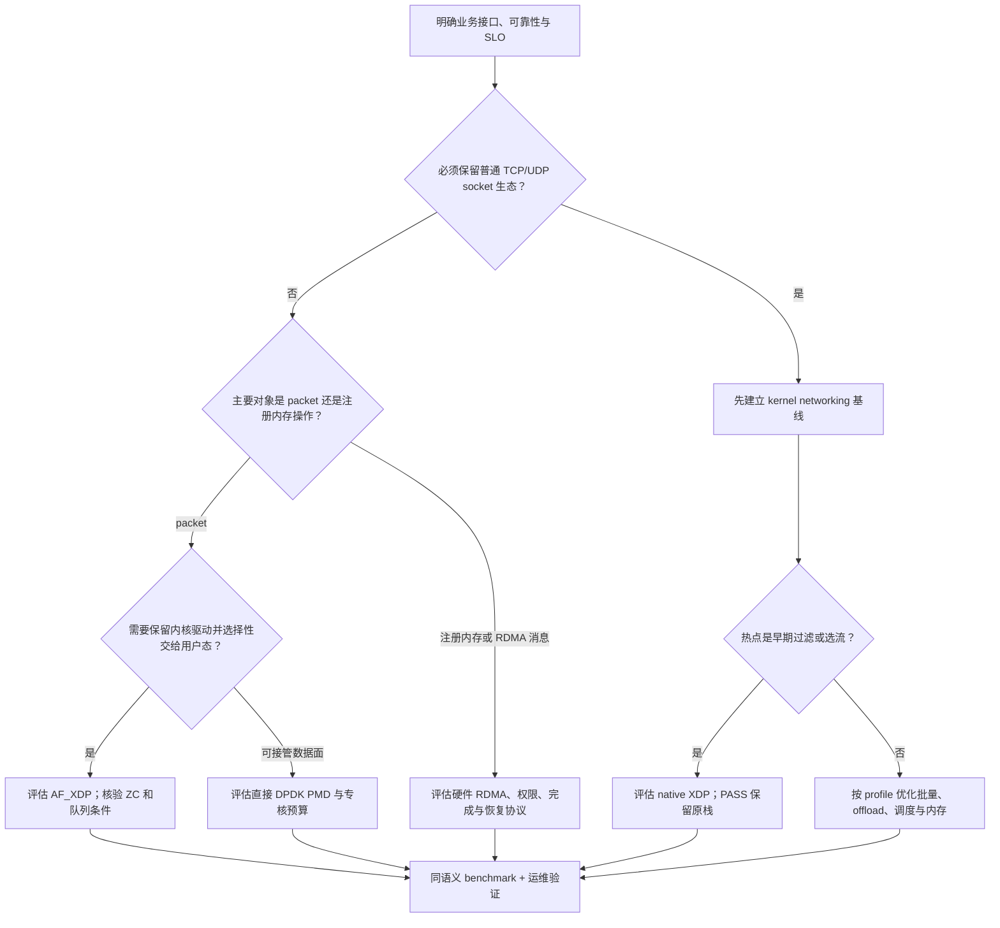

# 19.8 Kernel Networking vs XDP vs AF_XDP vs DPDK vs RDMA：数据路径、CPU 开销、零拷贝与适用边界

> [!abstract] 先问“谁做了什么”，再问“谁更快”
> Kernel Networking 提供通用网络与 socket 语义；XDP 提供早期可编程包处理；AF_XDP 把指定流量交给用户态共享内存接口；DPDK 提供多种数据平面库和 PMD 后端；硬件 RDMA 提供注册内存与传输卸载。**它们不处于同一个抽象层，也不是互斥的五种协议。**

> [!info] 比较口径与版本
> 默认比较 Linux 物理网卡上的普通 TCP/UDP socket、**native XDP**、AF_XDP 的 copy/zero-copy 两种模式、DPDK 直接硬件 Ethernet PMD，以及**硬件 RNIC 上的 RC RDMA**。Linux 机制以 6.8 文档、DPDK 以 24.11 系列文档为基线；RDMA 采用内核 userspace verbs 文档和 rdma-core API 手册。generic/offloaded XDP、AF_XDP PMD、Soft-RoCE、inline、ODP 等单独列为例外。核验日期：2026-09-11。这里不是最新版本支持矩阵，也不承诺特定网卡的实测性能。

[[3.Linux/19. Linux 高性能网络数据路径/19.7 DPDK 数据平面：PMD、HugePage、mbuf、Mempool、RX-TX Burst 与 Poll Mode|19.7 DPDK 数据平面]] 已解释 PMD、mbuf、mempool 与短 TX 提交。本篇不重复初始化代码，而是把数据路径、CPU 预算、复制边界和协议责任放到同一坐标系中。

## 1. “kernel bypass”不是一个布尔值

《Systems Performance》第 2 版 §10.4.3 一方面把 DPDK 归入 kernel bypass，另一方面强调 XDP 与已有内核栈集成，以及旁路路径对传统计数器和追踪工具的影响。[B1] 工程比较至少要拆成下面四个问题。

| 问题 | 应该记录的事实 |
|---|---|
| 控制面是否经过内核？ | 设备初始化、内存映射、队列创建、权限、路由或连接建立 |
| 逐包数据面经过哪些组件？ | 驱动、NAPI、XDP、skb、TCP/IP、socket、用户线程、PMD |
| payload 在哪些内存间移动？ | NIC DMA、内核 buffer→用户 buffer、应用 buffer→传输 buffer |
| 谁提供传输与业务保证？ | 校验、分段、可靠性、流控、拥塞控制、鉴权、业务去重与提交 |

用户态直接 PMD 仍依赖内核完成必要的控制面操作；native XDP 在内核执行，却能避开后续大段网络栈；硬件 RDMA 快路径可不逐次陷入内核，但注册和资源管理仍依赖内核。[K1][D1][R1]

因此，“在内核里就慢”“在用户态就快”“不调用 `recv()` 就完全没有系统调用”都不足以解释真实系统。

## 2. 接收全景：五个名字，至少六条值得区分的路径

![[图片/SVG/3_19_19_8_1.svg|1079]]

图以接收方向为主：AF_XDP 被拆成 copy 与 zero-copy 两行；RDMA 行画的是 **one-sided WRITE 的目标端**。XDP 行的 DROP 是终点、PASS 会继续常规路径，不能把它们当成同一份工作。所有框宽只表达结构，不表示测得的时间比例。

### 2.1 第一张对照表：应用究竟获得什么

| 方案 | 应用/程序面对的对象 | 通用 TCP/IP 责任在哪里 | 典型执行位置 |
|---|---|---|---|
| 普通 socket | TCP 字节流或 UDP datagram | 内核协议栈 | 内核收发处理 + 用户线程 |
| native XDP | 早期 packet context、包数据和 BPF map | PASS 后仍由内核处理；其他 action 本身不提供完整 TCP 会话处理 | 驱动 RX 路径中的 BPF 程序 |
| AF_XDP | UMEM frame 与 RX/TX descriptors | 重定向给用户态的流量由用户程序/上层栈承担 | 内核驱动/XDP + 用户线程 |
| DPDK 直接 PMD | `rte_mbuf*` packet burst | 应用或额外用户态协议栈承担 | 用户态 lcore + PMD |
| 硬件 RDMA | MR、QP、WR、CQ，SEND/RECV 或内存操作 | RNIC 实现对应 RDMA transport；它不是普通 socket TCP 栈 | 用户 verbs/provider + RNIC |

对照依据分别是 NAPI/XDP、AF_XDP、DPDK ethdev 与 userspace verbs 文档。[K1][K2][K3][D1][R1] 表中的“用户承担”不是“必须从零手写”，而是应明确引入哪个上层实现，并把它的成本算入。

### 2.2 第二张对照表：硬件与运维依赖

| 方案 | 必须确认的支持 | 内核网络工具的边界 |
|---|---|---|
| socket | 驱动、offload 和所需 socket 功能 | 常规 socket/协议统计适用，但仍需核对 offload 口径 |
| native XDP | 驱动对具体 action、frame 格式的支持 | 早期 DROP/REDIRECT 可能不出现在后续 socket 抓包点 |
| AF_XDP zero-copy | NIC + 驱动 + queue + UMEM 配置真正进入 ZC | 共享内存接口仍需专门统计与 XDP 观测 |
| 直接 DPDK | PMD、设备映射、DMA 内存、队列能力 | 内核 socket 计数不代表这条用户数据面；物理计数可能仍可见 |
| 硬件 RDMA | RNIC、provider、MR 权限、transport/Fabric | TCP socket 工具不能替代 CQ、QP、RDMA/Fabric 观测 |

不能把“网卡支持 XDP”直接升级成“支持 AF_XDP zero-copy 和所有 multi-buffer 组合”；也不能把“网卡能运行 mlx5 Ethernet PMD”解释成“应用已经使用 RDMA”。[K2][D2][R1]

## 3. Kernel Networking：基线不是“一包一个中断、一次复制”

常规 RX 可概括为 `NIC DMA → 驱动/NAPI → skb 与协议处理 → socket 接收状态 → 用户读取`。NAPI 本来就支持批量处理，并可在没有先收到中断的情况下被 busy polling 触发；因此拿“每包一次硬中断”的简化模型与 PMD 比较会误判成本。[K1]

发送侧也不只是 `sendmsg → NIC`：TCP 的发送缓冲与窗口、分段与 offload、路由/邻居、qdisc、驱动队列和回收都可能影响延迟。《Systems Performance》§10.4.3 将这些组件放在不同层，不能把所有等待统称为“内核拷贝慢”。[B1]

### 3.1 通用性带来了什么

它保留了常规 TCP/UDP socket 生态与大量系统集成能力。对需要互联网互通、可靠字节流以及成熟运维工具的服务，这些功能不是无用开销。业务先用 socket 实现，再通过观测定位真正热点，通常比先替换传输栈更容易建立正确基线——这是工程建议，不是任何负载下的性能定律。

### 3.2 kernel path 也可以避免特定复制

Linux `MSG_ZEROCOPY` 可在适合的发送路径上避免用户到内核的 payload copy，但增加页面管理和完成通知义务，且允许 copy fallback。通知说明 buffer 的可复用边界，不是应用层送达保证。[K4]

所以本篇“普通 socket 有用户/内核 payload copy”的比较基线，不包含所有发送零拷贝、特殊接收映射、splice 或其他专门 API。把所有 kernel networking 都归为“必定多复制”是错误的。

序列化、`iovec` 与传输复制的层次区别，可复习 [[3.Linux/18. 高级网络编程与 RPC/04. 高性能 IO 与数据面/18.11 零拷贝序列化与内存传递|零拷贝序列化与内存传递]]。`iovec` 本身不承诺省掉普通 socket 的 user→kernel copy。

## 4. XDP：把决策提前，而不是附送一个用户态 socket

### 4.1 三种运行模式不能混写

| 模式 | 大致位置 | 对比较的影响 |
|---|---|---|
| native / driver | RX 驱动早期，典型路径在构造常规 skb 之前 | 可以在较早阶段处理包；依赖驱动支持 |
| generic / skb | 使用已有 skb 的兼容路径 | 不能宣称省掉了此前已发生的 skb 构造成本 |
| hardware offload | 支持的 NIC 上执行所支持的 BPF 程序 | 主机 CPU 工作分布改变，但指令/helper/map 能力受硬件限制 |

本篇的性能模型默认 native XDP。AF_XDP 文档明确区分 DRV 与 SKB 路径；XDP 设计者的资料说明了其驱动级早期处理定位。[K2][P1] **不同模式的成功加载，不是相同的性能结果。**

### 4.2 返回 action 决定省掉哪些后续工作

`XDP_DROP` 表示终止这个包的处理，通常适合早期过滤；`XDP_PASS` 让包继续进入常规栈，并不替普通 TCP 服务完成接收；`XDP_TX` 从入接口发回；`XDP_REDIRECT` 交给支持的目标，例如其他设备、CPU map 或 XSKMAP。[K2][K3][P1]

动作名称不是“远端确认”。REDIRECT 返回成功路径以后仍可能在后续资源检查或传输中失败，必须观察对应计数与追踪。需要 Linux 路由、邻居等控制状态时，可以在支持的能力下复用内核信息，而不是把 XDP 必须描述成一套独立控制面。

> [!warning] 不能把 DROP benchmark 当成业务接收 benchmark
> 包在 XDP 中被丢弃，不会被应用解析、解密、响应或持久化。它的每包成本可以用于评价过滤路径，但不能直接用来宣传“应用收包性能超过完整 TCP/RPC”。

BPF verifier 提供受约束的执行环境，但不替程序证明策略正确、状态更新无竞争或在恶意流量下有可接受的 CPU 上界。安全与性能仍要做实际测试。

## 5. AF_XDP：共享 UMEM，不等于绕过整个内核

AF_XDP 是专门的 socket 地址族，应用通过 UMEM 与共享 rings 接收/提交 frame，而不是用普通 TCP/UDP `recv()` 语义。典型 RX 通过 XDP 程序和 XSKMAP 把指定设备/队列的流量交给用户态。[K2][K3]

![[图片/SVG/3_19_19_8_2.svg|900]]

图中的四个 ring 传的是 frame 地址/descriptor，不是在每一步重新复制一份 payload。两个红色边界最重要：**释放 RX ring 槽位并没有把 frame 还给 NIC；提交 TX 后的 frame 不能在完成前又投入 FILL。**

### 5.1 四个 ring 的正确方向

| Ring | Producer → Consumer | 交接什么 |
|---|---|---|
| FILL | 用户 → 内核 | 可供接收使用的 UMEM frame 地址 |
| RX | 内核 → 用户 | 已收到报文的 frame descriptor |
| TX | 用户 → 内核 | 待发送的 frame descriptor |
| COMPLETION | 内核 → 用户 | TX 已释放、用户可复用的 frame 地址 |

ring 槽位与 frame 内存是两类资源，生命周期不相同。消费 RX descriptor 后，应用还可能继续处理 frame，直到自己选择归还 FILL 或用于 TX。共享 UMEM 时，各 ring 的 SPSC 约束仍需遵守；跨不同 `(netdev, queue_id)` 的共享场景还涉及各自的 FILL/COMPLETION 对，不应简单说“整个共享 UMEM 永远只有一对”。[K2]

### 5.2 Copy 与 zero-copy 是另一条独立轴

**Copy 路径：**驱动先在自己的接收 buffer 获得报文，再复制到 UMEM；之后用户可直接访问 UMEM，但之前的复制没有消失。

**Zero-copy 路径：**驱动把可用 UMEM frame 纳入相应 RX 资源，NIC 可以直接向这些 frame DMA。内核驱动、XDP、ring 管理和可能的唤醒仍然存在，不能因此画成“用户程序直接独占 NIC 的 PMD”。[K2]

要求 ZC 时应使用 `XDP_ZEROCOPY` 的强制模式：不支持就失败，而非悄悄接受 fallback；再通过 `XDP_OPTIONS` 中 `XDP_OPTIONS_ZEROCOPY` 核对实际模式。`XDP_DRV` 的 native 路径本身不等价于 zero-copy。[K2]

### 5.3 三个决定“跑起来”能否变成“跑得对”的条件

XSK 必须与包所在的 netdev/queue 匹配。XSKMAP 的任意 key 只是查表索引，不是任意改变硬件 RSS 队列的指令；跨队列 steering 是另一个层次。[K3]

`XDP_USE_NEED_WAKEUP` 可以让应用仅在需要时调用 `poll()`/`sendto()` 等推进内核；它不是“此后永不需要系统调用”。忘记处理 FILL/TX 的 need_wakeup，会出现明明还有缓冲/待发描述符却停滞的现象。[K2]

Linux 6.8 文档包含 multi-buffer 接口，例如 `XDP_USE_SG` 和 descriptor continuation 语义；是否可用还取决于程序、驱动、模式和 NIC。比较 jumbo frame 时，不能默认一个 packet 总是一个 UMEM frame，也不能把所有配置笼统限制为某个固定 4 KiB 上限。[K2]

## 6. DPDK：把通用性换成显式的队列和资源管理

直接 PMD 的典型 RX 为 `NIC → DMA 到主机 packet buffer → PMD 整理 mbuf → 应用`；TX 为 `应用填写/引用 mbuf → PMD 接受 burst → NIC 获取数据 → PMD 回收`。逐包数据路径可以避开常规 skb、TCP/IP 和 socket，但 TCP 等功能并不会因此自动得到别处的免费实现。[D1][D4]

其低每包开销来源包括批量、内存复用、明确队列归属和减少跨核访问；**常驻 busy polling 核的空闲成本依然必须计入。**mbuf 的生命周期则遵守 19.7 的接受前缀规则，不是用 `free()` 释放一块普通 malloc buffer。

### 6.1 两个必须写进性能结论的例外

DPDK **AF_XDP PMD** 表示上层依然使用 DPDK ethdev API，下面却是 AF_XDP。这里对用户 API 的选择和对实际 I/O 路径的选择是可组合的，不能在比较表中删掉这条交集。[D3]

DPDK **mlx5 inline** 可以把 packet 数据复制到 WQE，以改善某些工作负载下的提交/PCIe 效率。inline 说明“避免独立 payload 读取”与“零 CPU 复制”可能是不同目标。不要把一个特定非 inline 路径的特性推广为所有 DPDK packet 都零拷贝。[D2]

> [!tip] 用机制检查论文口号
> 用户态 buffer 先被上层框架复制进 mbuf，或报文被重组、TLS 加密、序列化时重新分配，都会改变端到端复制次数。查到某个 PMD 支持 DMA 并不足以证明完整 RPC 路径零拷贝。

## 7. RDMA：变化最大的是传输与内存访问语义

硬件 RNIC 的 userspace verbs 快路径通常通过映射的队列/设备资源提交工作，资源创建和内存管理则经过内核。MR 将内存范围、访问权限与 key 联系起来；QP/WR/CQ 把提交和完成显式化。[R1][R2]

这不是“DPDK 换了几个函数名”。Ethernet PMD 给应用 packet，RDMA verbs 给应用消息或受保护的远端内存操作。具体操作模型见 [[8.高性能存储/4. RDMA 与 RoCE/4.5 Send Recv 与 RDMA Read Write|SEND/RECV 与 RDMA READ/WRITE]]。

### 7.1 Two-sided 和 one-sided 的 CPU 责任不同

| 操作族 | 目标端的准备/执行责任 | 不能省略的工作 |
|---|---|---|
| SEND/RECV | 目标端准备接收资源，随后处理 receive completion 和消息 | buffer 补充、CQ、协议与业务逻辑 |
| 普通 RDMA WRITE | 已授权远端 MR；RNIC 把数据放到目标范围，目标 CPU 不必逐次调用接收操作 | MR/key 生命周期、空间分配、发布/消费协议 |
| RDMA READ | RNIC 按权限读取目标 MR，结果进入发起端 buffer | 访问一致性、版本校验、并发修改处理 |
| WRITE with immediate | 数据放置之外还带接收侧通知语义 | 与普通 WRITE 不同的接收资源要求 |

这里默认硬件 RC 的常见操作，不能推广到 UD 或软件 provider。详细顺序性和 fence 条件应保留在 [[8.高性能存储/4. RDMA 与 RoCE/4.13 RDMA 操作顺序性|RDMA 操作顺序性]] 与 [[8.高性能存储/4. RDMA 与 RoCE/4.14 Fence 与内存可见性|Fence 与内存可见性]]，而不是从“单侧”推出“并发访问天然一致”。[R2][R3][R4]

### 7.2 RDMA 不承诺三件事

**不承诺 CPU 使用率为零。**发送侧组织 WR、管理 CQ 与注册缓存，接收端处理业务、维护 MR 与恢复连接；CQ 若持续忙轮询，空闲 CPU 预算仍然存在。[R1][R5]

**不承诺应用级成功。**提交成功、local WC 成功、远端内存可用、远端应用消费和持久化，是不同的事件。普通 WRITE 也不会像 SEND 那样自然给目标端生成一条 receive completion 供应用读取。[R3][R4][R5]

**不承诺所有注册都提前固定同样的页面。**传统预注册 MR 与 ODP、dma-buf 等模式不同；本篇默认预注册、常驻主机内存，ODP 的缺页/映射成本应另测。`IBV_SEND_INLINE` 则允许把发送数据复制入 WQE，从而改变源 buffer 可复用时点。[R2][R3]

Soft-RoCE 可用于接口和协议实验，但不应继承硬件 RNIC 的卸载性能结论。硬件与软件路径的区别，见 [[8.高性能存储/4. RDMA 与 RoCE/4.8 soft-RoCE 边界|Soft-RoCE 边界]]。

## 8. 零拷贝：必须指出哪条边上的哪种复制

![[图片/SVG/3_19_19_8_3.svg|900]]

图把 NIC DMA 与 CPU payload copy 分开：一条路径可以没有中间 payload memcpy，却仍然有 DMA、CPU 元数据处理、缓存填充和应用自己的复制。它不是“哪种方案最快”的结果图。

### 8.1 复制账本

| 路径/模式 | 可以避免的特定 CPU payload copy | 仍需核验的边界 |
|---|---|---|
| 普通 socket 基线 | 未启用专门机制时，不以避免 user/kernel copy 为保证 | TX/RX、协议和 API 分别分析；不能给整个 kernel 写固定复制次数 |
| native XDP DROP/TX | 在早期处理/发回，不必为了用户进程再复制一次 | 根本没有向普通应用交付 payload；PASS 后继续普通路径 |
| AF_XDP copy | 用户在 UMEM 上访问不需要再做一次普通 recv copy | 驱动 buffer→UMEM 的复制仍然存在 |
| AF_XDP zero-copy | 可以避免驱动 buffer→UMEM 的 payload copy | 必须实际进入 ZC；应用重组/加工仍可复制 |
| 直接 DPDK，非 inline | 应用直接使用 DMA 可访问的 packet buffer，可避免额外 socket copy | 上层 MsgBuffer/序列化、外部 buffer、后端差异 |
| RDMA，非 inline、预注册 | RNIC 直接访问指定内存，不必经普通 socket 中转 buffer | 注册/映射、业务 buffer→MR、并发一致性与完成协议 |

表中的“可以”都有前提，不是所有包和所有设备上的保证。[K2][K4][D2][D4][R2][R3]

### 8.2 四种“看起来像零拷贝”但并不等价的优化

更换数据区所有权，可能只是传一个 pointer；避免拼接复制，可能只是 scatter-gather；减少动态分配，可能只是 pool；避免解析对象树，可能只是直接访问序列化格式。它们分别优化不同阶段。**DMA 是数据移动，不是 CPU 执行 payload memcpy，但也不是“字节不移动”。**

HugePage 主要影响页映射与地址转换，NUMA 影响数据访问距离，inline 可能用复制换提交效率。把这些优化统称“零拷贝”会失去解释力。前置内存模型见 [[8.高性能存储/0. 数据路径硬件基础/0.2 虚拟内存 Page Table 与 TLB|Page Table 与 TLB]] 和 [[8.高性能存储/0. 数据路径硬件基础/0.3 DMA IOMMU 与 Pinned Memory|DMA、IOMMU 与固定内存]]。

### 8.3 对业务服务，先画出真实生命周期

例如 `业务对象 → 序列化 buffer → 传输 buffer → NIC → 接收 buffer → 反序列化对象`。只把中间某一步换成 RDMA 或 DPDK，不会自动消除前后四个阶段。需要分别记录 buffer 分配者、写入者、访问者、释放者，以及每次转移是复制、借用还是移动所有权。

这张生命周期表，通常比一句“端到端零拷贝”更能暴露资源泄漏和性能瓶颈。

## 9. CPU 开销：比较服务成本，而不是只比较 `%CPU`

以下为**分析模型**，不是厂商测量公式。将一次实验时间窗中的 CPU 工作拆开：

$$
C_{total}=C_{packet}+C_{byte}+C_{notify}+C_{handoff}+C_{poll\ idle}+C_{control}
$$

`packet` 包含分类、协议和队列管理，`byte` 包含复制、校验/加密与业务遍历，`notify` 包含中断/唤醒/提交通知，`handoff` 包含跨线程交接，`poll idle` 是无有效工作时的轮询，`control` 是初始化、连接管理与周期性控制工作。

对**以有效 packet 为结果单位**的实验，一个用于容量讨论的平均模型是：

$$
c_{avg} \approx c_{per\ packet}+L\,c_{per\ byte}
 +\frac{c_{batch}}{B_{effective}}
 +\frac{C_{idle}+C_{control}}{N_{useful}}
$$

`B_effective` 是**实际平均批大小**，不是命令行设置的最大 burst；`N_useful` 在本式中是有效 packet 数，`L` 是相应平均 payload 长度。改以请求为单位时，应按每请求的 packet 数、实际字节数与额外协议工作重新记账，不能直接沿用每 packet 的常数项。没有有效结果时，这个“每结果成本”不能计算，更不能用零分母得出效率极高。

### 9.1 至少同时报告三种数字

| 指标 | 解决的问题 | 主要陷阱 |
|---|---|---|
| 系统 CPU 核秒 / 时间窗 | 实际消耗了多少 CPU 时间 | 忽略内核 softirq、后台线程或目标端 CPU |
| 预留/独占的核数与功耗 | 运维为该方案付出多少不可复用资源 | busy polling 低负载仍占住专核 |
| cycles / 有效 packet 或有效请求 | 同任务的服务效率 | 不同频率/架构、PMU 口径、丢包与无效结果导致失真 |

DPDK 的高 `%CPU` 可能包含空轮询；kernel 的低应用 `%CPU` 可能把工作放在 softirq；RDMA 发起端 CPU 下降也不能证明目标端业务和 Fabric 没有瓶颈。只有固定了观测范围，CPU 数字才有可比性。

### 9.2 同速率和同资源是两种不同问题

固定 offered load、payload 和语义，比较谁用更少资源达到 SLO，是效率问题。固定总核数与设备，增加负载直到丢包/P99 超过门槛，是容量问题。两种结果都可以有价值，但不能用前者的低 CPU 配上后者的最高吞吐，拼出一个从未实际运行过的配置。

方法论可复习 [[8.高性能存储/0. 数据路径硬件基础/0.8 Benchmark 基本方法|Benchmark 基本方法]]；教材 §12.3.2 的 Active Benchmarking 要求在负载运行期间用证据验证真正的限制因素。[B1]

## 10. 就绪、提交、完成、ACK：五种信号不可以互换

| 信号 | 最多说明什么 | 不能据此断言 |
|---|---|---|
| socket 可读事件 | 当前文件/socket 状态可进行相应读取；也要处理 EOF/错误 | 应用消息完整、读取永不 EAGAIN |
| `sendmsg` 返回字节数 | 本次接受了多少字节；其余要继续处理 | 已经上线路、对端已收到 |
| DPDK TX accepted | 某个 packet 前缀由 TX 路径接管 | 允许应用立即修改这些 packet |
| AF_XDP COMPLETION | 相应 TX frame 已可被用户复用 | 远端业务消费成功 |
| RDMA WC success | 对应 opcode/QP 契约下的完成边界 | 数据库提交、跨 QP 顺序或应用级 exactly-once |

前两种依据 Linux man-pages 的 `send(2)` 与 `epoll(7)`；后三种应分别查对应接口，不能统一理解成“网络发送成功”。[K5][K2][D4][R3][R5]

实际 RDMA 代码还要区分 `ibv_poll_cq()` 本身的返回值与各个 `wc.status`；CQ 返回了条目，不表示条目状态成功。负返回值、错误 WC 和 CQ overrun 需要不同处理，不能忽略后继续复用所有 buffer。[R5]

不应写出“所有 completion 都等于远端内存已完全发布给业务线程”的跨 API 规则。系统需要另外定义发布/消费、版本校验、应用 ACK 与持久化契约。高层一致性问题不能用网络 API 名字替代。

## 11. 可比较实验：先让五种方案做同一份工作

### 11.1 将 benchmark 分成三组，不做一张混合排行榜

| 组别 | 比较任务 | 可以比较什么 | 不可混入 |
|---|---|---|---|
| A：Packet dataplane | 相同规则的过滤、相同 L2/L3 处理的转发 | kernel 对应路径、XDP、AF_XDP、DPDK | 把 DROP 与 TCP 应用交付直接比 |
| B：Message/RPC | 相同请求响应、可靠性、校验和超时规则 | socket、用户态栈/RPC、RDMA SEND/RECV 等 | 只测 packet I/O 却省略协议工作 |
| C：Memory operation | 相同的数据发布、一致性和可见性目标 | RDMA READ/WRITE 与有同等语义的替代实现 | 不含通知/同步的 WRITE 对比完整业务提交 |

普通 RC RDMA verbs 不是任意 raw Ethernet forwarding API，因此它不必出现在 A 组的每一行。无法做成相同功能的方案，应在可比较性列明确排除，而不是用不同工作硬凑五列。

### 11.2 固定环境，再记录实际运行模式

至少固定或记录 NIC/固件/PCIe 链路、CPU 型号与频率策略、SMT、核总预算、NUMA、队列数量、RSS/flow rules、MTU、packet size 与流数分布、单/双向、checksum/GRO/GSO/TSO、burst、内存模式和版本。

AF_XDP 必须记录 COPY/ZC 和 XDP 模式；DPDK 必须记录 PMD 后端及 inline/offload；RDMA 必须记录 transport、QP 数、inline、signaled 策略、MR 注册是否计入、CQ 轮询方式。没有这些信息，结果只是一组脱离执行路径的数字。

### 11.3 测吞吐之外，还要证明没有漏算失败

发生器报告 offered packet/request，DUT 报告实际处理和拒绝/丢弃，接收端独立报告有效完成。带宽按 payload 或 wire bytes 明确口径；GRO/TSO 前后的软件“包数”不能直接等同线速帧数。

同时测空载、低负载、稳态、突发、接近饱和和过载恢复。P99 必须对应同一 offered load 和同一有效结果定义；只把幸存请求计入延迟而忽略 timeout/drop，会制造虚假的好成绩。

### 11.4 用不同层的证据交叉验证

| 路径 | 路径内证据 | 路径外校验 |
|---|---|---|
| kernel | IRQ/softirq、socket/协议统计、`perf`、队列情况 | NIC/交换机/发生器与接收器 |
| XDP | action 计数、map、redirect 相关观测 | PASS 流量到 socket 的实际结果 |
| AF_XDP | actual ZC flag、ring 水位、invalid/drop 统计、need_wakeup | 驱动计数和端到端收发结果 |
| DPDK | PMD stats/xstats、实际 burst、pool 与重试队列、CPU profile | 物理口计数和外部接收器 |
| RDMA | CQ/WC、QP 错误、在途深度、端口/Fabric 计数 | 应用协议校验与目标端消费结果 |

这里只给测量方案，不提供未经实验的吞吐或延迟数值。性能测试工具本身也可能成为单核、时钟或发包瓶颈，不能只检查 DUT。

## 12. 选型：以接口与责任为入口，不以峰值 Mpps 为入口

这是一条排除不适用方案的分析路线，不是宣称某个分支必定最快。最终仍取决于 driver 支持、性能证据和团队能否承担被移动的责任。

### 12.1 四个典型案例

**现有 TCP 服务遇到大量无效入站包。**先验证瓶颈是否在过滤之前的包处理，再考虑 native XDP 在早期 DROP，让合法流量 PASS 到原 socket 服务。没有必要为了过滤先把整个业务改成用户态 TCP。[K1][P1]

**只将一类流量交给用户态做定制包处理。**AF_XDP 的共享内存和选流模型值得评估，但必须验证 device/queue、FILL 补充和 ZC 模式；“保留内核驱动”不等于同一报文会自动同时到用户态和原 socket。[K2][K3]

**可控环境中的高包速率转发。**直接 DPDK 适合显式管理队列与核资源的设计；是否值得专核、应用协议责任与监控成本，应通过 A 组 benchmark 判断。不要只看到 API 返回很快就忽略发包后的回收。[D1][D4]

**存储或 AI Infra 需要注册内存间的大块数据移动。**硬件 RDMA 能改变传输与内存放置路径，但仍需设计流控、资源上限、通知、一致性和连接恢复。零拷贝不能解决远端对象布局与版本问题；后续衔接 [[8.高性能存储/4. RDMA 与 RoCE/4.21 One-Sided RDMA KV：READ、WRITE、Atomic、内存布局与一致性|One-Sided RDMA KV 的内存布局与一致性]]。[R1][R2][R3]

## 13. 运维与故障恢复，也属于“适用边界”

Kernel socket 把很多资源治理放在系统里；AF_XDP 和 DPDK 让应用显式管理更多共享内存与队列；RDMA 还增加 MR、key、QP/CQ 与对端资源协调。性能结论要连同这些责任一起交付，而不是只交一个每秒包数。

退出、升级或恢复时，需要先停止新工作、让执行线程退出或切换，再按对应 API 停止设备/队列、处理未完成工作、回收引用，最后撤销映射。**不能在设备仍可能访问的情况下释放 UMEM、mempool 或 MR backing memory。**各接口的安全条件不同，应按其契约实现，不宜写成一个通用的 `free_all()`。[K2][D4][R2][R3]

跨进程共享、虚拟化、多租户、DPU/SmartNIC 和 GPU memory 会再改变隔离与 DMA 边界，本篇没有验证这些组合。在这些场景下，应重新画出控制面、访问授权与内存生命周期，而不是复用本篇主机内存图后只替换一个标签。

## 14. 复习与反例检查

**XDP 运行在内核，所以一定比用户态慢吗？**不成立。它可能在早期完成小任务；执行位置不能替代工作量和路径分析。

**AF_XDP 使用 socket，所以报文必经 TCP/IP 吗？**不成立。它是专门的地址族与 frame/ring 接口，不是 TCP 字节流 socket。

**native XDP 等于 AF_XDP zero-copy 吗？**不成立。程序执行模式与 UMEM 交付模式是两条轴，要分别核验。

**DPDK 与 AF_XDP 是互斥方案吗？**不是。DPDK 提供 AF_XDP PMD；必须写出具体后端。

**RDMA 比 DPDK 更“零拷贝”吗？**不能这样排序。要先确定发送/接收、inline、注册内存、packet/message 语义和应用自己的复制。

**目标端 one-sided 操作不需要逐次调用 recv，是否等于目标 CPU 不工作？**不是。资源管理、通知与业务消费仍存在，只是数据放置不要求目标 CPU 逐包执行通用网络栈。

**同样 100% CPU 是否同样效率？**不是。核数、空轮询、有用结果、内核工作、频率和功耗都可能不同。

**零拷贝完成能否证明数据已持久化？**不能。buffer 复用、传输完成、应用消费和持久化需要分别定义。

## 参考资料与证据范围

- **[B1] 项目教材** Brendan Gregg, *Systems Performance: Enterprise and the Cloud*, 2nd ed.，§10.4.3 Software：NAPI、NIC 收发、CPU scaling、kernel bypass 与可观测性；§12.3.1–12.3.2：Passive/Active Benchmarking。教材用于总体模型，不替代现代接口契约。
- **[K1] 官方** Linux 6.8， [NAPI](https://docs.kernel.org/6.8/networking/napi.html)。
- **[K2] 官方** Linux 6.8， [AF_XDP](https://docs.kernel.org/6.8/networking/af_xdp.html)，包括 rings、COPY/ZC、shared UMEM、need_wakeup、XDP_OPTIONS 与 multi-buffer。
- **[K3] 官方** Linux 6.8， [BPF_MAP_TYPE_XSKMAP](https://docs.kernel.org/6.8/bpf/map_xskmap.html)，包括设备/队列匹配与 redirect 条件。
- **[K4] 官方** Linux 6.8， [MSG_ZEROCOPY](https://docs.kernel.org/6.8/networking/msg_zerocopy.html)。
- **[K5] 官方 API 手册** Linux man-pages 6.19， [send(2)](https://man7.org/linux/man-pages/man2/send.2.html) 与 [epoll(7)](https://man7.org/linux/man-pages/man7/epoll.7.html)：提交返回、非阻塞 I/O 与就绪通知。man-pages 版本号不是 Linux 内核版本号。
- **[D1] 官方** DPDK 24.11， [Poll Mode Driver](https://doc.dpdk.org/guides-24.11/prog_guide/ethdev/ethdev.html) 与 [EAL](https://doc.dpdk.org/guides-24.11/prog_guide/env_abstraction_layer.html)。
- **[D2] 官方实现文档** DPDK 24.11， [NVIDIA MLX5 Ethernet Driver](https://doc.dpdk.org/guides-24.11/nics/mlx5.html)：bifurcated 驱动、统计与 inline。不是对所有 PMD 的保证。
- **[D3] 官方** DPDK 24.11， [AF_XDP Poll Mode Driver](https://doc.dpdk.org/guides-24.11/nics/af_xdp.html)。
- **[D4] 官方 API** DPDK 24.11， [rte_ethdev.h](https://doc.dpdk.org/api-24.11/rte__ethdev_8h.html)：RX/TX burst、prepare、完成回收与配置函数。
- **[R1] 官方** Linux kernel， [Userspace verbs access](https://docs.kernel.org/infiniband/user_verbs.html)：控制面与快速访问路径。在线文档访问日期：2026-09-11。
- **[R2] 项目 API 手册** rdma-core， [ibv_reg_mr(3)](https://man7.org/linux/man-pages/man3/ibv_reg_mr.3.html)：MR、key、访问权限、ODP 与注册变体。
- **[R3] 项目 API 手册** rdma-core， [ibv_post_send(3)](https://man7.org/linux/man-pages/man3/ibv_post_send.3.html)：WR、opcode、QP 类型限制、inline 与 buffer 复用。
- **[R4] 项目 API 手册** rdma-core， [ibv_post_recv(3)](https://man7.org/linux/man-pages/man3/ibv_post_recv.3.html)：接收资源与完成后复用。
- **[R5] 项目 API 手册** rdma-core， [ibv_poll_cq(3)](https://man7.org/linux/man-pages/man3/ibv_poll_cq.3.html)：轮询返回、WC 状态与 CQ overrun。
- **[P1] 设计者的一手资料** Jesper Dangaard Brouer、Toke Høiland-Jørgensen， [XDP — challenges and future work](https://people.netfilter.org/hawk/presentations/LinuxPlumbers2018/presentation-lpc2018-xdp-future.html)，Linux Plumbers Conference，2018。“What is XDP”“AF_XDP: Zero-copy to userspace”等部分用于机制背景；其中未来工作、历史支持范围和性能数字不当成 6.8/当前实现结论。

所有官方在线资料核验日期为 2026-09-11。CPU 模型、对照表的组织、同任务实验与选型建议是基于这些机制的工程推论；没有把不同年份、不同硬件、不同任务的数字拼成性能排行榜。
