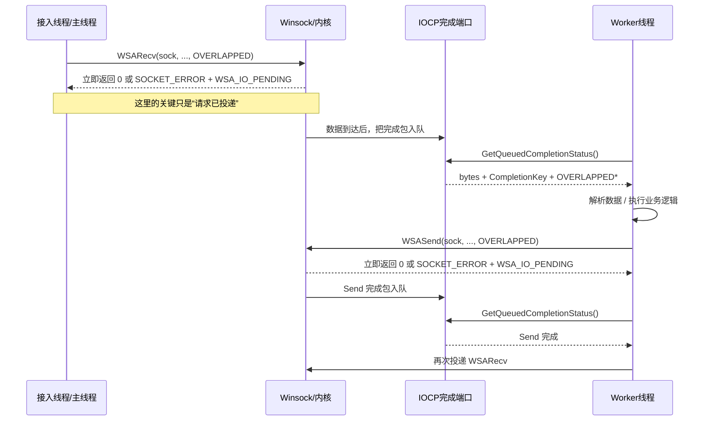
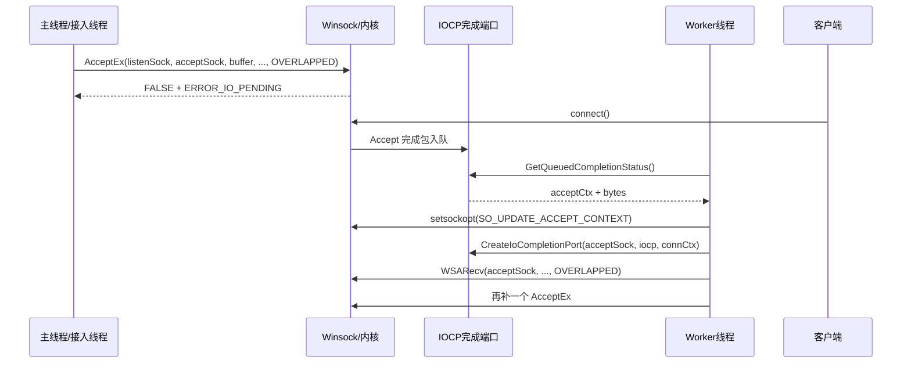

下面是按你要求重写的 **IOCP 学习笔记版**：**流程图/结构图用 SVG，线程调用图/时序图用 Mermaid**。内容以微软官方文档为准，并尽量按 C++ 学习者最容易建立心智模型的顺序来讲。([Microsoft Learn](https://learn.microsoft.com/en-us/windows/win32/fileio/i-o-completion-ports "I/O Completion Ports - Win32 apps | Microsoft Learn"))

# IOCP 笔记（重写版）

## 1. 先用一句话把 IOCP 讲明白

**IOCP（I/O Completion Port，I/O 完成端口）不是“我不停轮询哪个 socket 可读”，而是“我先把异步 I/O 请求投递给内核，等它真正完成后，系统把完成结果塞进一个完成队列，再由少量工作线程从队列里取结果处理”。** 微软把它定义为一种适合在多处理器系统上处理大量异步 I/O 请求的高效线程模型；多个支持 overlapped I/O 的句柄都可以关联到同一个完成端口。([Microsoft Learn](https://learn.microsoft.com/en-us/windows/win32/fileio/i-o-completion-ports "I/O Completion Ports - Win32 apps | Microsoft Learn"))

之所以它特别适合高并发服务器，是因为它把“**大量连接**”和“**少量工作线程**”解耦了。官方文档明确说，对于很多并发异步 I/O，请求配合**预先分配好的线程池**，通常比“收到请求再临时创建线程”更快、更高效。([Microsoft Learn](https://learn.microsoft.com/en-us/windows/win32/fileio/i-o-completion-ports "I/O Completion Ports - Win32 apps | Microsoft Learn"))

---

## 2. 总体结构图：IOCP 到底在系统里的哪一层

下面这张 SVG 把 IOCP 的整体结构画出来：应用负责**投递异步 I/O**，内核负责**执行和完成**，IOCP 负责**汇聚完成通知**，工作线程负责**取包并处理业务**。这正对应了微软文档里对 `CreateIoCompletionPort`、完成队列、`GetQueuedCompletionStatus` 和工作线程的描述。([Microsoft Learn](https://learn.microsoft.com/en-us/windows/win32/fileio/i-o-completion-ports "I/O Completion Ports - Win32 apps | Microsoft Learn"))

异步请求  
完成后入队  
GetQueuedCompletionStatus  

这张图对应的几个关键细节是：完成包按 **FIFO** 进入完成端口队列，但等待线程的释放顺序是 **LIFO**；线程通过 `GetQueuedCompletionStatus` 阻塞等待完成包；同时可运行的关联线程数受 completion port 的 **concurrency value** 限制。([Microsoft Learn](https://learn.microsoft.com/en-us/windows/win32/fileio/i-o-completion-ports "I/O Completion Ports - Win32 apps | Microsoft Learn"))

---

## 3. 先把 overlapped I/O 想清楚，否则 IOCP 学不明白

IOCP 是建立在 **overlapped I/O** 之上的。Winsock 文档说明：Windows Sockets 2 支持 overlapped I/O，既可以用于 `socket()` 创建的 socket，也可以用于 `WSASocket(..., WSA_FLAG_OVERLAPPED)` 创建的 socket；而 `WSASocket` 文档也说明，显式设置 `WSA_FLAG_OVERLAPPED` 会让 socket 明确支持 overlapped I/O，微软还说“大多数 socket 都应该以这个标志创建”。([Microsoft Learn](https://learn.microsoft.com/en-us/windows/win32/winsock/overlapped-i-o-and-event-objects-2 "Overlapped I/O and Event Objects - Win32 apps | Microsoft Learn"))

对 IOCP 来说，最核心的动作不是“等消息来了再读”，而是“**先投递一个读请求**”。官方对 `WSARecv` 的描述非常直接：对于 overlapped socket，`WSARecv` 是把一个或多个 buffer **先挂进去**，等网络数据到来时，系统把数据写进这些 buffer，然后再通过完成机制通知你。并且，如果你提前投递了接收 buffer，数据到来时甚至可能直接进入用户 buffer，从而避免一次额外拷贝。([Microsoft Learn](https://learn.microsoft.com/en-us/windows/win32/winsock/overlapped-i-o-and-event-objects-2 "Overlapped I/O and Event Objects - Win32 apps | Microsoft Learn"))

`WSARecv` 和 `WSASend` 在 overlapped 模式下的返回语义也一定要背下来：

- 返回 `0`：这次 I/O 立即完成；
    
- 返回 `SOCKET_ERROR` 且 `WSAGetLastError() == WSA_IO_PENDING`：**不是失败**，而是“异步请求已经成功发起，稍后完成”；
    
- 其他错误码：请求没有成功发起，也就不会再有完成通知。([Microsoft Learn](https://learn.microsoft.com/en-us/windows/win32/api/winsock2/nf-winsock2-wsarecv "WSARecv function (winsock2.h) - Win32 apps | Microsoft Learn"))
    

---

## 4. 你必须掌握的 6 个核心对象

### 4.1 Completion Port 本身

`CreateIoCompletionPort` 既可以**只创建一个完成端口**，也可以把某个句柄**关联到已存在的完成端口**，还可以在一次调用里“创建 + 关联”一起做。能关联的对象必须支持 overlapped I/O，文档明确提到：除了文件句柄，**socket 也可以关联到完成端口**。一个句柄在关联之后，只能归属于**一个**完成端口，并会一直保持这个关系，直到句柄被关闭。([Microsoft Learn](https://learn.microsoft.com/en-us/windows/win32/api/ioapiset/nf-ioapiset-createiocompletionport "CreateIoCompletionPort function (ioapiset.h) - Win32 apps | Microsoft Learn"))

### 4.2 CompletionKey

`CompletionKey` 是**句柄级 / 连接级**的自定义标识。微软文档明确说，它是“per-handle user-defined completion key”，会随着该句柄的每一个完成包一起返回给 `GetQueuedCompletionStatus`。工程里最常见的做法，就是把它放成“连接上下文指针”。([Microsoft Learn](https://learn.microsoft.com/en-us/windows/win32/api/ioapiset/nf-ioapiset-createiocompletionport "CreateIoCompletionPort function (ioapiset.h) - Win32 apps | Microsoft Learn"))

### 4.3 OVERLAPPED

`OVERLAPPED` 是**单次 I/O 请求级**的对象。一次异步读、一次异步写、一次 `AcceptEx`，都应该有自己独立的 `OVERLAPPED`。微软对这一点说得非常明确：**常见错误就是在上一次异步操作尚未完成前复用同一个 `OVERLAPPED` 结构；正确做法是每个请求一个独立结构。**([Microsoft Learn](https://learn.microsoft.com/en-us/windows/win32/api/minwinbase/ns-minwinbase-overlapped "OVERLAPPED (minwinbase.h) - Win32 apps | Microsoft Learn"))

### 4.4 GetQueuedCompletionStatus

`GetQueuedCompletionStatus` 做三件事：

1. 等待一个完成包；
    
2. 返回传输了多少字节；
    
3. 返回这是谁的完成包（`CompletionKey`）以及是哪一次请求完成了（`OVERLAPPED*`）。  
    还有一个初学者常踩的坑：它返回 `FALSE` 不一定意味着“没有完成包”。官方说明是：
    

- `lpOverlapped == NULL`：没有取到完成包；
    
- `lpOverlapped != NULL`：**取到了一个失败完成的 I/O 包**，这时应该看 `GetLastError()`。([Microsoft Learn](https://learn.microsoft.com/en-us/windows/win32/api/ioapiset/nf-ioapiset-getqueuedcompletionstatus "GetQueuedCompletionStatus function (ioapiset.h) - Win32 apps | Microsoft Learn"))
    

### 4.5 PostQueuedCompletionStatus

它可以**不发起任何真实 I/O**，而是手动往完成端口里塞一个自定义包。微软文档明确说，`GetQueuedCompletionStatus` 会原样取回你传进去的三个值，而且系统不会校验这些值，`lpOverlapped` 甚至不必真的指向一个 `OVERLAPPED`。这就是为什么很多 IOCP 程序用它来给 worker 发“退出包”。([Microsoft Learn](https://learn.microsoft.com/en-us/windows/win32/fileio/postqueuedcompletionstatus "PostQueuedCompletionStatus function (IoAPI.h) - Win32 apps | Microsoft Learn"))

### 4.6 Concurrency value

`CreateIoCompletionPort` 的 `NumberOfConcurrentThreads` 用来限制“**同时可运行**”的与该端口关联的线程数量。传 `0` 时，默认值是系统处理器数量。官方还特别说明：完成包按 FIFO 入队，但线程是按 LIFO 被释放；并发值选 CPU 数通常是一个合理起点。([Microsoft Learn](https://learn.microsoft.com/en-us/windows/win32/api/ioapiset/nf-ioapiset-createiocompletionport "CreateIoCompletionPort function (ioapiset.h) - Win32 apps | Microsoft Learn"))

---

## 5. 最重要的心智模型：两层上下文

学 IOCP 的时候，最容易乱的就是把“连接状态”和“这一次 I/O 的状态”混在一起。最稳的做法就是分成两层：

- **连接级上下文**：这个连接是谁、socket 是多少、当前协议状态是什么；
    
- **请求级上下文**：这一次操作是 Recv 还是 Send，buffer 在哪里，对应哪个 `OVERLAPPED`。
    

这正好也和 `CompletionKey` / `OVERLAPPED*` 的返回方式吻合：前者更适合定位“哪个连接”，后者更适合定位“哪一次请求”。([Microsoft Learn](https://learn.microsoft.com/en-us/windows/win32/api/ioapiset/nf-ioapiset-createiocompletionport "CreateIoCompletionPort function (ioapiset.h) - Win32 apps | Microsoft Learn"))

![[图片/SVG/4_4_IOCP_two_layer_context.svg|1051]]

把这层关系理解透以后，IOCP 就不会再像“黑魔法”了：**一个完成包回来时，你先靠 `CompletionKey` 找到连接，再靠 `OVERLAPPED*` 找到这次操作的类型和 buffer。**([Microsoft Learn](https://learn.microsoft.com/en-us/windows/win32/api/ioapiset/nf-ioapiset-createiocompletionport "CreateIoCompletionPort function (ioapiset.h) - Win32 apps | Microsoft Learn"))

---

## 6. 一次 Recv/Send 循环是怎么跑起来的

下面这个 Mermaid 时序图只画**一个连接的一次收发循环**。它对应的就是 IOCP 最经典的工作模式：**先投递 Recv，完成后处理，再投递 Send，Send 完成后再投递下一次 Recv。** `GetQueuedCompletionStatus` 只是取完成结果，它不是替你发起下一次 I/O 的。([Microsoft Learn](https://learn.microsoft.com/en-us/windows/win32/api/winsock2/nf-winsock2-wsarecv "WSARecv function (winsock2.h) - Win32 apps | Microsoft Learn"))



对于字节流 socket（例如 TCP 的 `SOCK_STREAM`），`WSARecv` 文档明确说明：**读到 0 字节且本次 I/O 是成功完成时，表示对端优雅关闭，后面不会再有更多字节。** 这就是为什么 IOCP Echo Server 里常见 `if (bytes == 0) { close }` 这种逻辑。([Microsoft Learn](https://learn.microsoft.com/en-us/windows/win32/api/winsock2/nf-winsock2-wsarecv "WSARecv function (winsock2.h) - Win32 apps | Microsoft Learn"))

---

## 7. 学习版代码骨架：先只理解“已连接 socket 如何进入 IOCP”

下面这份代码**故意不把 Accept 阶段揉进去**，只聚焦一个问题：  
**“一个已经建立好的 TCP 连接，怎样接入 IOCP 并完成 Recv/Send 循环？”**

这样更适合第一次学 IOCP，因为你不会同时被 `AcceptEx`、地址缓冲区、扩展函数指针这些细节分散注意力。下面的代码约定：**每个连接同一时刻只有一个未完成 I/O**，所以清理逻辑会简单很多；真实工程常常会有多个未完成发送、发送队列、引用计数等额外设计。这个“每连接一个 outstanding I/O”的简化是教学上的取舍。与之对应的官方约束是：每个 outstanding I/O 都必须有自己独立的 `OVERLAPPED`。([Microsoft Learn](https://learn.microsoft.com/en-us/windows/win32/api/minwinbase/ns-minwinbase-overlapped "OVERLAPPED (minwinbase.h) - Win32 apps | Microsoft Learn"))

### 7.1 上下文结构

```cpp
#include <winsock2.h>
#include <mswsock.h>
#include <windows.h>
#include <iostream>
#include <thread>
#include <vector>
#include <cstring>

#pragma comment(lib, "Ws2_32.lib")

constexpr size_t kBufferSize = 4096;

enum class IoType {
    Recv,
    Send
};

// 连接级上下文
struct ConnCtx {
    SOCKET s = INVALID_SOCKET;
};

// 单次 I/O 级上下文
struct IoCtx {
    OVERLAPPED ol{};
    WSABUF wsabuf{};
    char buffer[kBufferSize]{};
    IoType type = IoType::Recv;
};

inline IoCtx* ToIoCtx(OVERLAPPED* ol) {
    return reinterpret_cast<IoCtx*>(ol);
}
```

这段代码里最重要的不是语法，而是结构设计：`ConnCtx` 对应 `CompletionKey`，`IoCtx` 对应 `OVERLAPPED*`。这样 `GetQueuedCompletionStatus` 一返回，你就能同时知道“谁完成了”和“完成的是哪一种 I/O”。这和官方 API 的返回契约是完全一致的。([Microsoft Learn](https://learn.microsoft.com/en-us/windows/win32/api/ioapiset/nf-ioapiset-createiocompletionport "CreateIoCompletionPort function (ioapiset.h) - Win32 apps | Microsoft Learn"))

### 7.2 投递一次异步接收

```cpp
bool PostRecv(ConnCtx* conn) {
    auto* io = new IoCtx{};
    io->type = IoType::Recv;
    io->wsabuf.buf = io->buffer;
    io->wsabuf.len = static_cast<ULONG>(kBufferSize);

    DWORD flags = 0;

    int rc = WSARecv(
        conn->s,
        &io->wsabuf,
        1,
        nullptr,      // overlapped 模式下官方建议传 NULL
        &flags,
        &io->ol,
        nullptr
    );

    if (rc == SOCKET_ERROR) {
        int err = WSAGetLastError();
        if (err != WSA_IO_PENDING) {
            delete io;
            return false;
        }
    }
    return true;
}
```

这里有两个要点。第一，`WSA_IO_PENDING` 不是失败，而是“请求已经成功发起”；第二，微软在 `WSARecv` 参数说明里明确建议：在 overlapped 模式下，`lpNumberOfBytesRecvd` 传 `NULL`，真正的字节数从后续完成通知里拿。([Microsoft Learn](https://learn.microsoft.com/en-us/windows/win32/api/winsock2/nf-winsock2-wsarecv "WSARecv function (winsock2.h) - Win32 apps | Microsoft Learn"))

### 7.3 投递一次异步发送

```cpp
bool PostSend(ConnCtx* conn, const char* src, DWORD len) {
    auto* io = new IoCtx{};
    io->type = IoType::Send;

    if (len > kBufferSize) {
        len = static_cast<DWORD>(kBufferSize);
    }

    std::memcpy(io->buffer, src, len);
    io->wsabuf.buf = io->buffer;
    io->wsabuf.len = len;

    int rc = WSASend(
        conn->s,
        &io->wsabuf,
        1,
        nullptr,      // overlapped 模式下官方建议传 NULL
        0,
        &io->ol,
        nullptr
    );

    if (rc == SOCKET_ERROR) {
        int err = WSAGetLastError();
        if (err != WSA_IO_PENDING) {
            delete io;
            return false;
        }
    }
    return true;
}
```

`WSASend` 这边的规则和 `WSARecv` 完全平行：`WSA_IO_PENDING` 表示发送请求已经发起；`lpNumberOfBytesSent` 在 overlapped 模式下官方同样建议传 `NULL`。同时文档还提醒：发起 `WSASend` 后，这些发送 buffer 在本次发送真正完成前都不能被你随便改写。([Microsoft Learn](https://learn.microsoft.com/en-us/windows/win32/api/winsock2/nf-winsock2-wsasend "WSASend function (winsock2.h) - Win32 apps | Microsoft Learn"))

### 7.4 Worker 线程：真正处理完成包的地方

```cpp
void CloseConn(ConnCtx* conn) {
    if (!conn) return;
    if (conn->s != INVALID_SOCKET) {
        closesocket(conn->s);
        conn->s = INVALID_SOCKET;
    }
    delete conn;
}

void WorkerLoop(HANDLE iocp) {
    while (true) {
        DWORD bytesTransferred = 0;
        ULONG_PTR completionKey = 0;
        OVERLAPPED* ol = nullptr;

        BOOL ok = GetQueuedCompletionStatus(
            iocp,
            &bytesTransferred,
            &completionKey,
            &ol,
            INFINITE
        );

        // 自定义退出包
        if (completionKey == 0 && ol == nullptr) {
            break;
        }

        if (ol == nullptr) {
            // 没取到包：超时或端口已关闭等
            continue;
        }

        auto* conn = reinterpret_cast<ConnCtx*>(completionKey);
        auto* io = ToIoCtx(ol);

        if (!ok) {
            // 这是“取到了失败完成的 I/O 包”的情况
            delete io;
            CloseConn(conn);
            continue;
        }

        if (io->type == IoType::Recv) {
            if (bytesTransferred == 0) {
                delete io;
                CloseConn(conn);
                continue;
            }

            // Echo：收到什么就发回什么
            if (!PostSend(conn, io->buffer, bytesTransferred)) {
                delete io;
                CloseConn(conn);
                continue;
            }

            delete io;
        } else if (io->type == IoType::Send) {
            delete io;

            // Send 完成后再投递下一次 Recv
            if (!PostRecv(conn)) {
                CloseConn(conn);
                continue;
            }
        }
    }
}
```

这个循环几乎就是 IOCP 的灵魂：

- `GetQueuedCompletionStatus` 阻塞等结果；
    
- `CompletionKey` 找连接；
    
- `OVERLAPPED*` 找请求；
    
- 处理完成后，再补下一次 I/O。  
    而且这里顺便体现了一个特别重要的官方语义：`GetQueuedCompletionStatus` 返回 `FALSE` 时，只要 `lpOverlapped != NULL`，就说明这是一个**失败完成的 I/O 包**，不是“端口本身坏了”。([Microsoft Learn](https://learn.microsoft.com/en-us/windows/win32/api/ioapiset/nf-ioapiset-getqueuedcompletionstatus "GetQueuedCompletionStatus function (ioapiset.h) - Win32 apps | Microsoft Learn"))
    

### 7.5 把一个已连接 socket 接进 IOCP

```cpp
ConnCtx* AttachConnectedSocketToIocp(HANDLE iocp, SOCKET s) {
    auto* conn = new ConnCtx{};
    conn->s = s;

    HANDLE h = CreateIoCompletionPort(
        reinterpret_cast<HANDLE>(s),
        iocp,
        reinterpret_cast<ULONG_PTR>(conn),
        0
    );

    if (!h) {
        delete conn;
        return nullptr;
    }

    if (!PostRecv(conn)) {
        CloseConn(conn);
        return nullptr;
    }

    return conn;
}
```

`CreateIoCompletionPort` 文档明确说明：socket 也可以关联到完成端口，而且 `CompletionKey` 会跟着这个句柄的每个完成包一起返回。因此这里把 `ConnCtx*` 塞进 `CompletionKey` 是最经典也最自然的写法。([Microsoft Learn](https://learn.microsoft.com/en-us/windows/win32/api/ioapiset/nf-ioapiset-createiocompletionport "CreateIoCompletionPort function (ioapiset.h) - Win32 apps | Microsoft Learn"))

### 7.6 创建完成端口和 worker

```cpp
int main() {
    WSADATA wsa{};
    if (WSAStartup(MAKEWORD(2, 2), &wsa) != 0) {
        return 1;
    }

    HANDLE iocp = CreateIoCompletionPort(
        INVALID_HANDLE_VALUE,
        nullptr,
        0,
        0
    );
    if (!iocp) {
        WSACleanup();
        return 1;
    }

    SYSTEM_INFO si{};
    GetSystemInfo(&si);

    std::vector<std::thread> workers;
    for (DWORD i = 0; i < si.dwNumberOfProcessors; ++i) {
        workers.emplace_back([&]() { WorkerLoop(iocp); });
    }

    // 这里省略“如何拿到已连接 socket”
    // 真实项目里，它可能来自 AcceptEx，也可能来自别的接入层
    // SOCKET connSock = ...;
    // AttachConnectedSocketToIocp(iocp, connSock);

    // 退出时发送 worker 退出包
    for (size_t i = 0; i < workers.size(); ++i) {
        PostQueuedCompletionStatus(iocp, 0, 0, nullptr);
    }

    for (auto& t : workers) {
        t.join();
    }

    CloseHandle(iocp);
    WSACleanup();
    return 0;
}
```

这里用 `PostQueuedCompletionStatus(iocp, 0, 0, nullptr)` 做退出通知，是因为官方明确说过：`GetQueuedCompletionStatus` 会原样返回这三个值，而且系统并不会验证这些值。([Microsoft Learn](https://learn.microsoft.com/en-us/windows/win32/fileio/postqueuedcompletionstatus "PostQueuedCompletionStatus function (IoAPI.h) - Win32 apps | Microsoft Learn"))

---

## 8. 真正的高性能接入：为什么实战里常常还要用 AcceptEx

上面那版代码把 IOCP 的**收发闭环**讲清楚了，但真正高性能的 Winsock 服务器通常不会把 accept 阶段留在传统模式里，而是会把**接入阶段也异步化**。微软文档明确把 `AcceptEx` 描述为一个能把三件事合成一次 API / kernel transition 的扩展函数：

1. 接受一个新连接；
    
2. 返回本地和远端地址；
    
3. 可选地接收首包数据。([Microsoft Learn](https://learn.microsoft.com/en-us/windows/win32/api/mswsock/nf-mswsock-acceptex "AcceptEx function (mswsock.h) - Win32 apps | Microsoft Learn"))
    

`AcceptEx` 是 Microsoft 扩展函数，不是普通静态导出 API，所以你必须在运行时通过 `WSAIoctl(..., SIO_GET_EXTENSION_FUNCTION_POINTER, ...)` 拿到函数指针。官方文档也明确写了这一点。([Microsoft Learn](https://learn.microsoft.com/en-us/windows/win32/api/mswsock/nf-mswsock-acceptex "AcceptEx function (mswsock.h) - Win32 apps | Microsoft Learn"))

### 8.1 AcceptEx 的接入时序图



这个时序图体现了 `AcceptEx` 的常见套路：**预先投递多个 AcceptEx**，谁先完成就先拿谁；拿到新连接后立刻把 accepted socket 关联到 IOCP，然后马上补下一轮 AcceptEx。这样监听端不会因为“当前正在处理一个连接”而耽误后续连接进入。微软官方的 Winsock 示例里也专门给了 `iocpserverex` 这类例子。([Microsoft Learn](https://learn.microsoft.com/en-us/windows/win32/winsock/getting-started-with-winsock "Getting started with Winsock - Win32 apps | Microsoft Learn"))

### 8.2 AcceptEx 的关键代码骨架

```cpp
LPFN_ACCEPTEX LoadAcceptEx(SOCKET listenSock) {
    GUID guid = WSAID_ACCEPTEX;
    LPFN_ACCEPTEX fn = nullptr;
    DWORD bytes = 0;

    int rc = WSAIoctl(
        listenSock,
        SIO_GET_EXTENSION_FUNCTION_POINTER,
        &guid, sizeof(guid),
        &fn, sizeof(fn),
        &bytes,
        nullptr,
        nullptr
    );

    return (rc == 0) ? fn : nullptr;
}
```

这段代码唯一的知识点就是：`AcceptEx` 不是普通导出函数，要靠 `WSAIoctl` 动态获取。([Microsoft Learn](https://learn.microsoft.com/en-us/windows/win32/api/mswsock/nf-mswsock-acceptex "AcceptEx function (mswsock.h) - Win32 apps | Microsoft Learn"))

```cpp
struct AcceptCtx {
    OVERLAPPED ol{};
    SOCKET acceptSock = INVALID_SOCKET;

    // 这里只接地址，不顺带接首包数据
    char addrBuf[(sizeof(sockaddr_in) + 16) * 2]{};
};

bool PostAccept(SOCKET listenSock, LPFN_ACCEPTEX lpAcceptEx, AcceptCtx*& ctx) {
    ctx = new AcceptCtx{};

    ctx->acceptSock = WSASocket(
        AF_INET,
        SOCK_STREAM,
        IPPROTO_TCP,
        nullptr,
        0,
        WSA_FLAG_OVERLAPPED
    );

    if (ctx->acceptSock == INVALID_SOCKET) {
        delete ctx;
        return false;
    }

    BOOL ok = lpAcceptEx(
        listenSock,
        ctx->acceptSock,
        ctx->addrBuf,
        0,  // dwReceiveDataLength = 0，不等待首包
        sizeof(sockaddr_in) + 16,
        sizeof(sockaddr_in) + 16,
        nullptr,
        &ctx->ol
    );

    if (!ok && WSAGetLastError() != ERROR_IO_PENDING) {
        closesocket(ctx->acceptSock);
        delete ctx;
        return false;
    }

    return true;
}
```

这里几个细节都来自官方文档：

- `dwReceiveDataLength == 0` 时，`AcceptEx` 会在连接一到达时完成，而不是等首包；
    
- 本地地址和远端地址各自预留的空间都必须至少比对应 `sockaddr` 大 **16 字节**；
    
- accepted socket 应该是一个预先创建、尚未绑定也尚未连接的 socket。([Microsoft Learn](https://learn.microsoft.com/en-us/windows/win32/api/mswsock/nf-mswsock-acceptex "AcceptEx function (mswsock.h) - Win32 apps | Microsoft Learn"))
    

```cpp
void OnAcceptCompleted(
    HANDLE iocp,
    SOCKET listenSock,
    AcceptCtx* actx
) {
    // 让 accepted socket 继承 listening socket 的上下文属性
    setsockopt(
        actx->acceptSock,
        SOL_SOCKET,
        SO_UPDATE_ACCEPT_CONTEXT,
        reinterpret_cast<const char*>(&listenSock),
        sizeof(listenSock)
    );

    auto* conn = new ConnCtx{};
    conn->s = actx->acceptSock;

    if (!CreateIoCompletionPort(
            reinterpret_cast<HANDLE>(conn->s),
            iocp,
            reinterpret_cast<ULONG_PTR>(conn),
            0)) {
        closesocket(conn->s);
        delete conn;
        delete actx;
        return;
    }

    PostRecv(conn);
    delete actx;
}
```

`SO_UPDATE_ACCEPT_CONTEXT` 这一步非常重要。官方文档和 `SOL_SOCKET` 选项说明都写到：这个选项用于 `AcceptEx`，用来让 accepted socket 更新并继承 listening socket 的相关属性；如果后面要对 accepted socket 使用 `getpeername`、`getsockname`、`getsockopt` 或 `setsockopt`，就应该设置它。([Microsoft Learn](https://learn.microsoft.com/en-us/windows/win32/api/mswsock/nf-mswsock-acceptex?utm_source=chatgpt.com "AcceptEx function (mswsock.h) - Win32 apps"))

---

## 9. 再看一张“单连接生命周期”的 SVG 图

这张图适合你反复看，因为它把 IOCP 程序最容易写丢的动作画出来了：**完成一次，就要补下一次。**([Microsoft Learn](https://learn.microsoft.com/en-us/windows/win32/api/winsock2/nf-winsock2-wsarecv "WSARecv function (winsock2.h) - Win32 apps | Microsoft Learn"))

![[图片/SVG/4_4_IOCP_single_connection_lifecycle.svg|1048]]

你可以把 IOCP 程序想成一个持续循环：  
**“投递 Recv → 完成 → 处理 → 投递 Send → 完成 → 再投递 Recv”**。  
不是“注册一次事件然后永远自动触发”，而是“每完成一次，你自己决定下一次投什么”。([Microsoft Learn](https://learn.microsoft.com/en-us/windows/win32/api/winsock2/nf-winsock2-wsarecv "WSARecv function (winsock2.h) - Win32 apps | Microsoft Learn"))

---

## 10. 初学者最容易犯的 8 个错误

### 错误 1：把 `WSA_IO_PENDING` 当成失败

它表示“这次 overlapped I/O 已经成功发起，稍后完成”，不是失败。`WSARecv`、`WSASend`、`AcceptEx` 都是这个语义。([Microsoft Learn](https://learn.microsoft.com/en-us/windows/win32/api/winsock2/nf-winsock2-wsarecv "WSARecv function (winsock2.h) - Win32 apps | Microsoft Learn"))

### 错误 2：多个未完成 I/O 复用同一个 `OVERLAPPED`

这是官方点名的常见错误。必须每个 outstanding I/O 单独一个结构。([Microsoft Learn](https://learn.microsoft.com/en-us/windows/win32/api/minwinbase/ns-minwinbase-overlapped "OVERLAPPED (minwinbase.h) - Win32 apps | Microsoft Learn"))

### 错误 3：只投一次 `WSARecv`

IOCP 不会自动帮你永久持续接收。一次 Recv 完成后，通常要再投递下一次 Recv。([Microsoft Learn](https://learn.microsoft.com/en-us/windows/win32/api/winsock2/nf-winsock2-wsarecv "WSARecv function (winsock2.h) - Win32 apps | Microsoft Learn"))

### 错误 4：`GetQueuedCompletionStatus` 返回 `FALSE` 就以为“IOCP 坏了”

不对。只要 `lpOverlapped != NULL`，它很可能只是一个**失败完成的 I/O 包**。要进一步看 `GetLastError()`。([Microsoft Learn](https://learn.microsoft.com/en-us/windows/win32/api/ioapiset/nf-ioapiset-getqueuedcompletionstatus "GetQueuedCompletionStatus function (ioapiset.h) - Win32 apps | Microsoft Learn"))

### 错误 5：在 `closesocket()` 后立刻释放所有 I/O 相关资源

官方明确说：`closesocket()` 会发起对未完成 overlapped I/O 的取消，但你**不能假设**这些 I/O 在 `closesocket` 返回时就都已经彻底完成了；相关 `OVERLAPPED` / buffer 等资源应等它们真正完成后再清理。([Microsoft Learn](https://learn.microsoft.com/en-us/windows/win32/api/winsock/nf-winsock-closesocket "closesocket function (winsock.h) - Win32 apps | Microsoft Learn"))

### 错误 6：忘记 `SO_UPDATE_ACCEPT_CONTEXT`

使用 `AcceptEx` 后，如果你后面要用 `getpeername`、`getsockname`、`getsockopt`、`setsockopt` 等函数，就应该设置 `SO_UPDATE_ACCEPT_CONTEXT`。([Microsoft Learn](https://learn.microsoft.com/en-us/windows/win32/api/mswsock/nf-mswsock-acceptex?utm_source=chatgpt.com "AcceptEx function (mswsock.h) - Win32 apps"))

### 错误 7：在 overlapped 模式下还依赖 `lpNumberOfBytesRecvd/lpNumberOfBytesSent`

官方建议 overlapped 模式下把这些参数传 `NULL`，真正的传输字节数从完成通知里拿。([Microsoft Learn](https://learn.microsoft.com/en-us/windows/win32/api/winsock2/nf-winsock2-wsarecv "WSARecv function (winsock2.h) - Win32 apps | Microsoft Learn"))

### 错误 8：无意中阻止完成包进入 IOCP

`GetQueuedCompletionStatus` 文档里有个很细但很重要的点：如果你给 `OVERLAPPED.hEvent` 放了一个有效事件句柄，并且把它的**最低位设成 1**，那么这次 overlapped I/O 完成后**不会**入 IOCP 队列。([Microsoft Learn](https://learn.microsoft.com/en-us/windows/win32/api/ioapiset/nf-ioapiset-getqueuedcompletionstatus "GetQueuedCompletionStatus function (ioapiset.h) - Win32 apps | Microsoft Learn"))

---

## 11. 一个很容易被忽略，但非常关键的细节

当一个句柄已经关联到 IOCP 后，微软文档指出：**传给异步 I/O 的状态块在完成包被从完成端口取走之前，不会被更新**；唯一的例外是该操作同步地以错误返回。这个细节能帮助你理解为什么很多状态只有在 `GetQueuedCompletionStatus` 之后才“真正对应用可见”。([Microsoft Learn](https://learn.microsoft.com/en-us/windows/win32/fileio/i-o-completion-ports "I/O Completion Ports - Win32 apps | Microsoft Learn"))

另外，`GetQueuedCompletionStatus` 第一次被某个线程调用后，这个线程就会和该 completion port 建立关联；一个线程最多只能关联到一个 completion port。([Microsoft Learn](https://learn.microsoft.com/en-us/windows/win32/fileio/i-o-completion-ports "I/O Completion Ports - Win32 apps | Microsoft Learn"))

---

## 12. 最后给你一个学习顺序

最适合 C++ 学习者的顺序其实不是一上来就啃完整 `AcceptEx + IOCP` 工程，而是：

1. 先搞清楚 **同步 I/O / 非阻塞 I/O / overlapped I/O** 的区别。([Microsoft Learn](https://learn.microsoft.com/en-us/windows/win32/winsock/overlapped-i-o-and-event-objects-2 "Overlapped I/O and Event Objects - Win32 apps | Microsoft Learn"))
    
2. 再吃透 `CreateIoCompletionPort`、`GetQueuedCompletionStatus`、`PostQueuedCompletionStatus` 这三个 API 的职责分工。([Microsoft Learn](https://learn.microsoft.com/en-us/windows/win32/api/ioapiset/nf-ioapiset-createiocompletionport "CreateIoCompletionPort function (ioapiset.h) - Win32 apps | Microsoft Learn"))
    
3. 然后牢牢记住“**CompletionKey = 连接级**，**OVERLAPPED = 请求级**”。([Microsoft Learn](https://learn.microsoft.com/en-us/windows/win32/api/ioapiset/nf-ioapiset-createiocompletionport "CreateIoCompletionPort function (ioapiset.h) - Win32 apps | Microsoft Learn"))
    
4. 接着写一个最小 Echo Server，只做“Recv 完成 → Send 回去 → 再次 Recv”。([Microsoft Learn](https://learn.microsoft.com/en-us/windows/win32/api/winsock2/nf-winsock2-wsarecv "WSARecv function (winsock2.h) - Win32 apps | Microsoft Learn"))
    
5. 最后再升级到 `AcceptEx`、地址解析、发送队列、优雅关闭、多个 outstanding send。微软的 Winsock 入门文档里也点名给了 `iocpserver`、`iocpserverex` 和 `iocpclient` 这些样例方向。([Microsoft Learn](https://learn.microsoft.com/en-us/windows/win32/winsock/getting-started-with-winsock "Getting started with Winsock - Win32 apps | Microsoft Learn"))
    

---

## 13. 这一篇笔记最值得你记住的三句话

**第一句：IOCP 不是“哪个 socket 就绪了”，而是“哪一次异步 I/O 完成了”。** 这就是它和很多“就绪通知模型”的根本区别。([Microsoft Learn](https://learn.microsoft.com/en-us/windows/win32/fileio/i-o-completion-ports "I/O Completion Ports - Win32 apps | Microsoft Learn"))

**第二句：`CompletionKey` 找连接，`OVERLAPPED*` 找这次请求。** 只要这句没乱，你的代码结构通常也不会乱。([Microsoft Learn](https://learn.microsoft.com/en-us/windows/win32/api/ioapiset/nf-ioapiset-createiocompletionport "CreateIoCompletionPort function (ioapiset.h) - Win32 apps | Microsoft Learn"))

**第三句：每完成一次，都要想清楚“下一次我要投什么 I/O”。** `GetQueuedCompletionStatus` 只是帮你拿结果，程序真正“继续跑下去”的关键，在于你是否正确补投了下一次 `Recv` / `Send` / `AcceptEx`。([Microsoft Learn](https://learn.microsoft.com/en-us/windows/win32/fileio/i-o-completion-ports "I/O Completion Ports - Win32 apps | Microsoft Learn"))

下一步最合适的是把上面这份“学习版骨架”扩成一个**完整可编译的 Windows IOCP Echo Server 单文件示例**，并继续保持 **流程图用 SVG、线程时序图用 Mermaid**。
