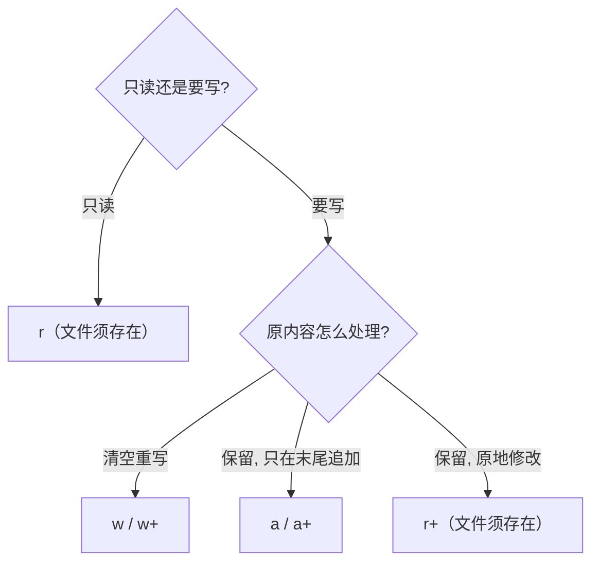

---
tags:
  - Linux
  - 文件与目录函数
阅读次数: 0
---

# 基本文件函数

本节介绍 C 标准库中的基本文件操作函数，包括文件打开模式、`fopen()` 和 `fclose()` 函数。

---

## 文件打开模式

在使用 `fopen()` 打开文件时，需要指定文件的访问模式（注意这与文件的权限位 rwx 是两回事：模式说的是"这次打开后允许做什么操作"，权限位由 chmod 管理）。以下是常用的模式：

| 模式 | 说明 |
|------|------|
| `r` | **只读模式**。文件必须存在，否则 `fopen()` 失败返回 NULL |
| `w` | **只写模式**。如果文件存在，内容会被清空；如果文件不存在，会创建一个新文件 |
| `a` | **追加模式**。如果文件存在，写入的内容会追加到文件末尾；如果文件不存在，会创建一个新文件 |
| `r+` | **读写模式**。文件必须存在 |
| `w+` | **读写模式**。如果文件存在，内容会被清空；如果文件不存在，会创建一个新文件 |
| `a+` | **读写追加模式**。如果文件存在，写入内容添加到末尾；如果文件不存在，会创建一个新文件 |
| `b` | **二进制模式**。与上述模式组合使用（如 `rb`、`wb`），用于处理二进制文件 |
| `t` | **文本模式**（默认）。处理文本文件时的默认模式 |

### 模式组合示例

| 组合 | 说明 |
|------|------|
| `rb` | 以二进制只读模式打开 |
| `wb` | 以二进制只写模式打开 |
| `ab` | 以二进制追加模式打开 |
| `r+b` 或 `rb+` | 以二进制读写模式打开 |
| `w+b` 或 `wb+` | 以二进制读写模式打开（清空内容） |

### 三个容易被忽略的规则

1. **`a` / `a+` 的写入位置锁死在文件末尾**：每次写入前流会自动定位到 EOF，`fseek()` 改变不了写入位置（在 `a+` 下 `fseek()` 只影响读的位置）。想在文件中间原地修改，必须用 `r+`。
2. **Linux 下 `b` 没有实际作用**：POSIX 系统不区分文本流和二进制流。`b` 的区别只在 Windows 上存在（文本模式会做 `\n` 与 `\r\n` 的转换）。跨平台代码处理二进制文件时仍应写上 `b`。
3. **C11 新增 `x` 后缀**（如 `"wx"`）：独占创建，文件已存在则打开失败。它避免了"先检查文件是否存在、再创建"两步之间被别的进程抢先创建文件的竞态。

### 模式选择流程



选定后按需追加：需要同时读就加 `+`，处理二进制文件加 `b`。

---

## fopen() - 打开文件

`fopen()` 函数用于打开一个文件，它会创建一个**文件流**（file stream），并将其与指定的文件名关联。如果成功，它返回一个指向该文件流的指针，也就是一个 `FILE*` 类型的指针。

### 函数原型

```c
#include <stdio.h>

FILE* fopen(const char *path, const char *mode);
```

### 参数说明

- **path**：文件的路径名，例如 `"data.txt"` 或 `"/home/user/document.txt"`
- **mode**：一个字符串，指定了文件的**打开模式**。不同的模式决定了你对文件可以进行的操作（读、写、追加等）

### 返回值

- 成功：返回一个 `FILE` 类型的指针
- 失败（例如文件不存在且模式为 `r`）：返回 `NULL`

### FILE 结构体

`FILE` 是 C 标准库定义的一个结构体，用于管理文件流的状态信息，包括：
- 文件缓冲区指针
- 当前读写位置
- 文件状态标志（错误、EOF 等）
- 底层[[4.1 打开、读取、写入、关闭#文件描述符（File Descriptor）|文件描述符]]

---

## fclose() - 关闭文件

`fclose()` 函数用于**关闭一个已打开的文件流**。它会释放文件流占用的所有系统资源，包括缓冲区、文件描述符等。在程序结束前，必须关闭所有已打开的文件，否则可能会导致数据丢失或资源泄漏。

### 函数原型

```c
#include <stdio.h>

int fclose(FILE *fp);
```

### 参数说明

- **fp**：一个指向要关闭的文件流的指针，这个指针通常由 `fopen()` 返回

### 返回值

- 成功：返回 0
- 失败：返回 `EOF`（通常为 -1）

### 关闭行为

1. 刷新缓冲区中未写入的数据到文件（等价于隐式调用一次 [[6.2 高级文件操作函数#fflush() - 刷新缓冲区|fflush()]]）
2. 释放与文件流关联的缓冲区
3. 关闭底层文件描述符
4. 释放 `FILE` 结构体占用的内存

> [!warning] fclose 的两个坑
> - **写模式下必须检查 fclose 的返回值**。最后一批缓冲数据是在 fclose 时才真正写出的，磁盘满、配额超限这类错误只会体现在 fclose 的返回值上；只检查 fprintf 的返回值发现不了。
> - **fclose 之后 fp 就是悬垂指针**。再使用它（包括再调一次 fclose）是未定义行为。习惯做法是关闭后立即 `fp = NULL;`。

---

## 示例代码

```c
#include <stdio.h>
#include <stdlib.h>  // for exit()

void handle_error(const char* message) {
    perror(message);
    exit(EXIT_FAILURE);
}

int main() {
    FILE *fp;
    char buffer[100];
    const char *initial_data = "Hello, this is the first line.\n";
    const char *append_data = "This is a new line.\n";

    // 1. 以只写模式 "w" 打开文件，如果文件存在则清空
    printf("Opening file in write mode ('w')...\n");
    fp = fopen("example.txt", "w");
    if (fp == NULL) {
        handle_error("fopen failed in write mode");
    }
    fprintf(fp, "%s", initial_data);
    printf("Wrote initial data to file.\n");
    fclose(fp);

    // 2. 以只读模式 "r" 打开文件并读取
    printf("\nOpening file in read mode ('r')...\n");
    fp = fopen("example.txt", "r");
    if (fp == NULL) {
        handle_error("fopen failed in read mode");
    }
    // 读取一行内容（fgets 到 EOF 或出错时返回 NULL，同样要检查）
    if (fgets(buffer, sizeof(buffer), fp) != NULL) {
        printf("Read from file: %s", buffer);
    }
    fclose(fp);

    // 3. 以追加模式 "a" 打开文件并写入
    printf("\nOpening file in append mode ('a')...\n");
    fp = fopen("example.txt", "a");
    if (fp == NULL) {
        handle_error("fopen failed in append mode");
    }
    fprintf(fp, "%s", append_data);
    printf("Appended new data to file.\n");
    fclose(fp);

    // 4. 再次以只读模式 "r" 打开文件并读取全部内容
    printf("\nOpening file again in read mode to see all content.\n");
    fp = fopen("example.txt", "r");
    if (fp == NULL) {
        handle_error("fopen failed in final read mode");
    }
    printf("Final content of the file:\n---\n");
    while (fgets(buffer, sizeof(buffer), fp) != NULL) {
        printf("%s", buffer);
    }
    printf("---\n");
    fclose(fp);

    return 0;
}
```

### 运行与分析

1. 程序首先以 `w` 模式打开 example.txt，如果文件已存在，其内容将被清空，程序写入 initial_data
2. 接着，程序以 `r` 模式打开文件并读取第一行，然后关闭
3. 然后，程序以 `a` 模式打开文件。这次，新的 append_data 会被添加到文件末尾，而不会覆盖原内容
4. 最后，程序再次以 `r` 模式打开文件，读取并打印所有内容，此时你会看到两行内容

注意每一步都检查了 `fopen()` 的返回值：`r` 模式打开一个不存在的文件是最常见的失败路径，`perror()` 会把 errno 翻译成 "No such file or directory" 这样的可读信息。

---

## 关键要点

- **fopen()**：打开文件并返回 `FILE*` 指针，失败返回 `NULL`
- **fclose()**：关闭文件流，释放资源，成功返回 0，失败返回 `EOF`
- **模式选择**：
  - 只读用 `r`，清空重写用 `w`，追加用 `a`；读写加 `+`，二进制加 `b`
  - `a`/`a+` 的写入位置锁死在文件末尾，`fseek()` 移不动；原地修改用 `r+`
  - Linux 下 `b` 无实际作用，区别只在 Windows 的换行符转换
- 始终检查 `fopen()` 返回值；写模式下 `fclose()` 的返回值同样要检查（最后一批数据在这里才落笔）
- `fclose()` 之后指针悬垂，不可再用，也不可重复关闭


