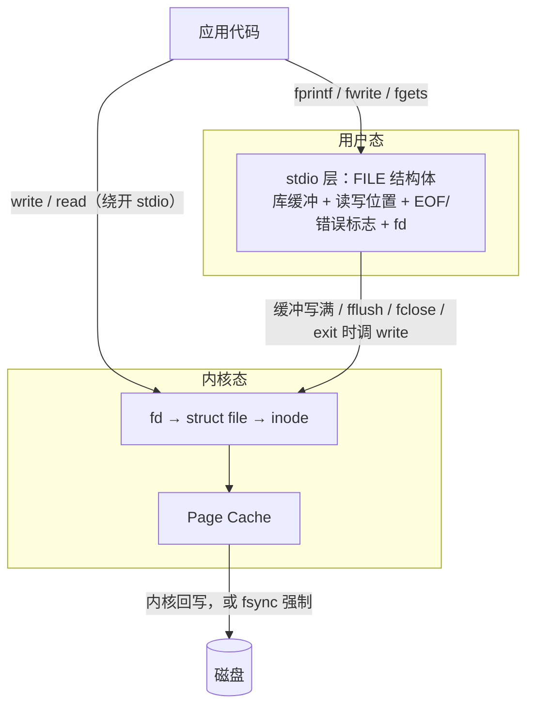
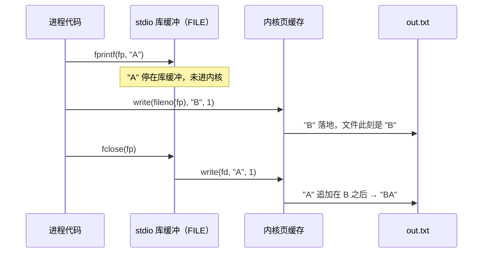
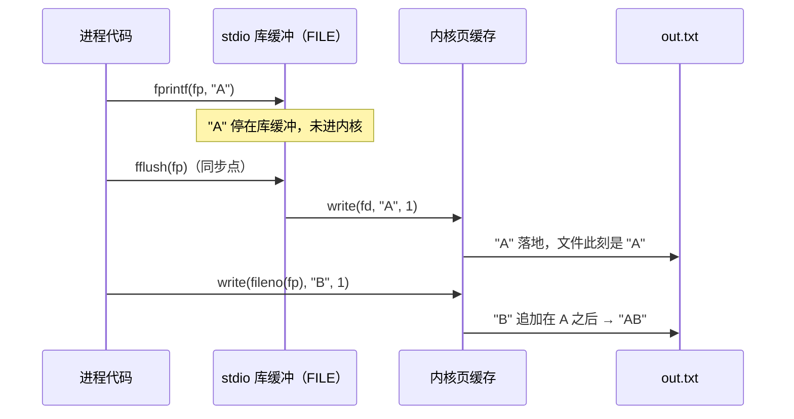
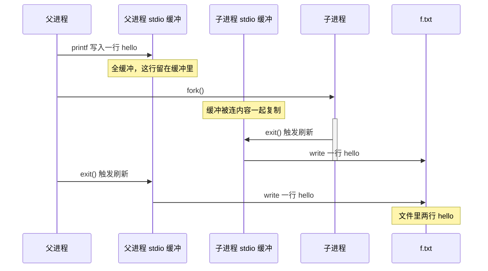
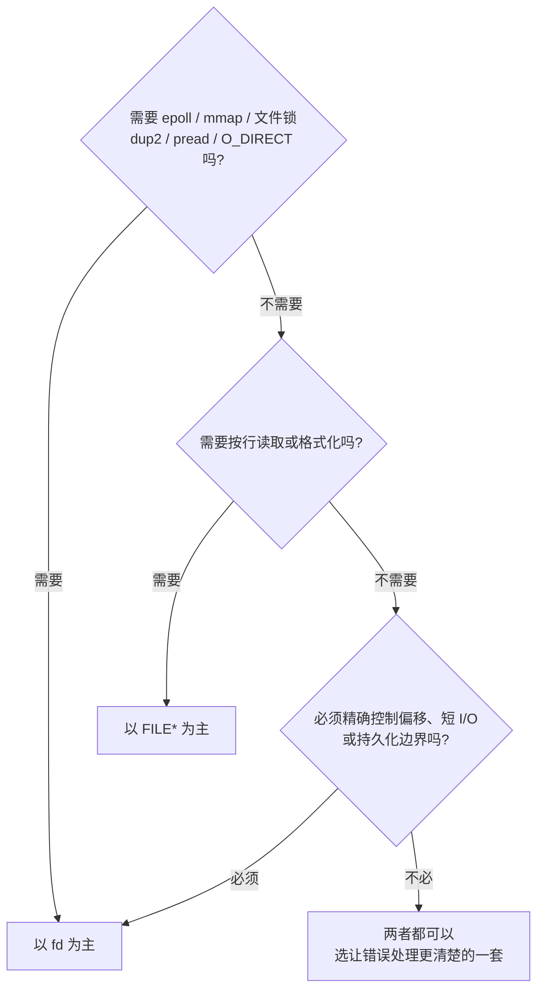

---
tags:
  - Linux
  - 文件与目录函数
阅读次数: 0
---

# 6.10 FILE 流与 fd 两套接口总结

Linux 上读写文件，常见的入口有两套：C 标准库的 `FILE*` 流（`fopen` / `fread` / `fprintf`），以及 POSIX 的文件描述符 fd（`open` / `read` / `write`）。它们不是两套互不相干的文件系统：`FILE*` 最终仍要借助底层 fd 进入内核。

这篇笔记把第 3、4、6 章串起来，但主线只有一条：**`FILE*` 比 fd 多了什么，这一层包装又会带来哪些边界。**

> [!tip] 交互式 HTML 讲解
> - [[Day01 — Linux 基础与文件 I-O 闭卷总结.html|Day01：Linux 基础与文件 I/O 闭卷总结]]——串联系统调用、缓冲、重定向、同步、文件锁与目录函数。
> - [[Linux 文件 I-O 四层模型讲解.html|Linux 文件 I/O 四层模型讲解]]——专门拆解 `FILE* → fd → struct file → inode / Page Cache` 对象链。

---

## 1. 先把三层对象分清



### 1.1 `FILE*`、fd、打开文件描述不是一回事

- **`FILE*`**：进程用户态里的 stdio 对象。它保存库缓冲、流的位置状态、EOF/错误标志和底层 fd。
- **fd**：当前进程 fd 表里的整数下标，例如 `0`、`1`、`2`。它不是文件本身。
- **open file description**：内核中一次 `open()` 产生的打开实例，保存共享文件偏移 `f_pos`、打开状态 `f_flags` 和引用计数。`dup()` 与 `fork()` 可以让多个 fd 指向同一个打开实例。
- **inode 与 Page Cache**：前者保存文件元数据，后者缓存文件数据页。不同进程各自 `open()` 同一文件，通常有不同打开实例，却仍可能访问同一个 inode 和同一份页缓存。

因此，准确的关系是：

> `FILE*` 持有一个 fd；fd 经进程 fd 表找到打开文件描述；打开文件描述再关联 inode 和 Page Cache。

`fileno(fp)` 只取出 `FILE` 内部已有的 fd，并不会创建新 fd；`fdopen(fd, mode)` 也不会复制 fd，只是给这个 fd 套上一层 stdio。详见 [[6.2 高级文件操作函数#2. fdopen() - 从文件描述符创建文件流|fdopen()]] 与 [[6.2 高级文件操作函数#5. fileno() - 获取文件描述符|fileno()]]。

这里讨论的是 `fopen`、`fdopen` 和标准输入输出这类 **fd-backed stream**。`fmemopen`、`open_memstream` 创建的内存流是少见的例外，它们没有可交给 `fileno` 的底层 fd。

最熟悉的三组对应就是 `stdin` ↔ fd 0、`stdout` ↔ fd 1、`stderr` ↔ fd 2。shell 的 `>`、`2>` 与程序里的 `dup2` 改的是 fd 表；`printf` 仍写 `stdout`，只是它的底层 fd 已经指向另一个文件。重定向前若 `stdout` 里已有数据，先 `fflush(stdout)`。

### 1.2 stdio 为什么要多包一层

这层包装主要解决三类问题：

1. **减少系统调用**：`fgetc()` 通常从库缓冲取一个字节；`read(fd, &c, 1)` 每次都要进入内核。
2. **提供文本和格式化能力**：`fgets`、`fprintf`、`fscanf` 直接处理行、字段和格式串。
3. **保存流状态**：stdio 记住 EOF、错误、字符回退以及自己的逻辑位置。

代价也来自同一层：数据可能滞留在库缓冲；`FILE` 看到的位置和内核 `f_pos` 可能暂时不同；混用 stdio 与 fd 接口时必须主动同步。

### 1.3 第 3、4、6 章分别处在哪

| 章节 | 在这条主线中的位置 | 重点 |
|---|---|---|
| 第 3 章 Linux 基础函数 | 字节进入或离开文件前后的处理 | `snprintf`/`fprintf` 负责格式化；`sscanf`/`strtol` 负责解析；`stat`/`umask` 处理元数据与创建权限 |
| 第 4 章 Linux I/O 函数 | fd 与内核 I/O | `open`、`read`、`write`、`lseek`、`dup2`、`fsync`、文件锁 |
| 第 6 章 文件与目录函数 | stdio 与文件/目录封装 | `FILE*` 的打开、读写、定位、错误；以及 `DIR*` 目录流 |

`snprintf()` 和 `sscanf()` 只处理内存中的字符串，本身不读写文件。可以把 `fprintf()` 理解成“格式化后写流”，把 `fscanf()` 理解成“从流读字节后解析”。这正是第 3 章与 `FILE*` 主线的连接点。

---

## 2. 函数对照表

| 要做的事 | fd 接口 | `FILE*` 接口 |
|---|---|---|
| 打开 | `open` | `fopen`、`fdopen`、`freopen` |
| 读 | `read`、`pread` | `fread`、`fgetc`、`fgets`、`fscanf` |
| 写 | `write`、`pwrite` | `fwrite`、`fputc`、`fputs`、`fprintf` |
| 定位 | `lseek` | `fseek`、`ftell`、`rewind`、`fgetpos`/`fsetpos` |
| 关闭 | `close` | `fclose` |
| 把数据交给内核 | `write` 本身就是 | `fflush` |
| 落盘 | `fsync`、`fdatasync` | 没有，只能 `fsync(fileno(fp))` |
| 判断出错 | 返回 `-1`，查 `errno` | 返回 `NULL`/`EOF`/短计数，查 `ferror`、`feof` |
| 截断文件 | `ftruncate` | 无 |
| 复制句柄 | `dup`、`dup2` | 无 |
| 控制缓冲 | 无（内核页缓存不归你管） | `setvbuf`、`setbuf` |
| 格式化/解析 | 先在内存处理，再 `read`/`write` | `fprintf`、`fscanf` |
| 元数据与权限 | `fstat`、`fchmod`、`umask` | 通常先 `fileno` 再调用 fd 接口 |
| 遍历目录 | `getdents64`（通常不直接用） | `opendir`、`readdir`、`closedir`，对象是 `DIR*` |

### 2.1 `fopen` mode 与 `open` flags 怎么对应

| `fopen` mode | 近似的 `open` flags | 文件不存在 | 文件已存在 |
|---|---|---|---|
| `"r"` | `O_RDONLY` | 失败 | 从头读 |
| `"w"` | `O_WRONLY \| O_CREAT \| O_TRUNC` | 创建 | 先截断为 0 |
| `"a"` | `O_WRONLY \| O_CREAT \| O_APPEND` | 创建 | 每次写到末尾 |
| `"r+"` | `O_RDWR` | 失败 | 从头读写，不截断 |
| `"w+"` | `O_RDWR \| O_CREAT \| O_TRUNC` | 创建 | 先截断为 0 |
| `"a+"` | `O_RDWR \| O_CREAT \| O_APPEND` | 创建 | 可读，写总在末尾 |

这是行为上的对应，不是说 `fopen` 能表达所有 `open` flags。`O_CLOEXEC`、`O_EXCL`、`O_NONBLOCK` 等没有通用的 mode 字符串；需要这些能力时，先 `open` 再 `fdopen`。

还有一个容易误会的点：`fdopen(fd, "w")` **不会像 `fopen(path, "w")` 那样重新打开并截断文件**。它只包装已经打开的 fd，mode 必须与 fd 的访问权限兼容。Linux 上的 `"b"` 不改变 I/O 行为，只为跨平台代码保留。

各函数的细节分别在：[[4.1 打开、读取、写入、关闭]]（fd 侧四件套）、[[4.2 重定向、同步]]、[[4.3 文件锁]]、[[6.1 基本文件函数]]（`fopen`/`fclose` 与打开模式）、[[6.3 读取文件]]、[[6.4 写入文件]]、[[6.5 移动文件指针]]、[[6.6 判断错误]]、[[3.3 格式化输出函数]]、[[3.4 格式化输入函数]]。

---

## 3. 八处真正的差异

「哪个快」不是重点。下面这些边界才会决定代码是否正确。

### 3.1 数据停在哪，什么时候会丢

`write()` 返回，只说明数据已进内核页缓存；进程随后崩溃、被 `kill -9`，数据都还在，因为它已经不归进程管了。要它上磁盘还得 `fsync()`。

`fwrite()` 返回，数据可能还躺在进程自己的库缓冲里。这时进程被 `kill -9` 或调了 `_exit()`，这批数据直接消失，文件里什么都没有。`exit()` 和 `fclose()` 会刷，`_exit()` 和信号杀死不会。

调试时「`printf` 的输出莫名丢了」几乎都是这个原因。数据从库缓冲到页缓存这一段的完整流转，见 [[4.2 重定向、同步#2.3 谁调用 write()：stdio 与系统调用的分工|4.2 谁调用 write()]]；页缓存到介质那一段见 [[1.4 fsync fdatasync 与持久化语义]]。

### 3.2 错误怎么报

fd 接口统一：失败返回 `-1`，原因在 `errno`，`perror()` 直接翻译成可读文字。

`FILE*` 接口分三种情况，且**错误和 EOF 是分开的两个粘性标志**：

- `fopen` 失败返回 `NULL`
- `fgetc` / `fputc` 失败返回 `EOF`，但 `EOF` 也可能是正常读完
- `fread` / `fwrite` 返回的是成功处理的**项数**；`fread` 短读可能是 EOF 或错误，`fwrite` 短写则要按错误处理

所以 `fread` 短读之后必须用 `feof(fp)` 和 `ferror(fp)` 再问一次。标志一旦置上就不会自己清，得 `clearerr()`。这部分的陷阱在 [[6.6 判断错误]] 里有完整例子。

### 3.3 短读短写谁来兜底

`write()` 可能只写了一部分就返回（写管道、socket 时常见），也可能被信号打断返回 `-1` 加 `EINTR`。**用 fd 就得自己写循环**：

```c
// 用 fd 时必须自己兜住部分写
ssize_t write_all(int fd, const char *buf, size_t n) {
    size_t done = 0;
    while (done < n) {
        ssize_t k = write(fd, buf + done, n - done);
        if (k < 0) {
            if (errno == EINTR) continue;   // 被信号打断，重试而不是当失败
            return -1;
        }
        if (k == 0) {                       // 防止无进展时死循环
            errno = EIO;
            return -1;
        }
        done += k;
    }
    return done;
}
```

判断依据是 `k < 0` 而不是 `k != n`：只要 `k` 是正数，就说明这一轮真写进去了 `k` 个字节，剩下的下一轮继续。`EINTR` 单独挑出来重试，是因为它表示「还没开始写就被信号中断」，不是真的失败。

`fwrite()` 把底层的分段写和缓冲细节藏在 stdio 内部，不要求调用者按每次 `write` 的返回值推进指针。但它仍可能返回短计数；错误还可能拖到 `fflush()` 或 `fclose()` 才暴露。写文件时，`fwrite`、`fflush`、`fclose` 的返回值都不能随手丢掉。

### 3.4 追加与并发的原子性

用 `O_APPEND` 打开的 fd，「定位到末尾」和「开始这次写入」由内核作为一个动作完成，避免两个进程先后 `lseek(..., SEEK_END)` 却覆盖同一位置。它保证的是**追加位置的竞争不会发生**，不是把多次 `write` 自动合成事务；网络文件系统的语义还要单独确认。

`FILE*` 的 `"a"` 模式底层也是 `O_APPEND`，但保证只覆盖到内核那一次 `write`。库缓冲攒的数据什么时候刷、刷成几次 `write`，由 glibc 决定：一条超过缓冲区大小的日志会被拆成多次 `write`，中间就可能插进别的进程的内容。

同进程内多线程另说：POSIX 要求 stdio 函数对同一个 `FILE*` 隐式加锁（`flockfile` 系列），内部状态不会被撕裂。但这把锁是进程内的，管不到别的进程。

需要保护“检查—修改—写回”这类复合操作，得用文件锁，见 [[4.3 文件锁]]。文件锁通常是建议性锁：不配合加锁的进程仍可能直接写。

如果锁住的是 `fileno(fp)`，临界区不能在 `fwrite` 后立刻解锁，因为数据可能仍在 `FILE` 缓冲里。正确边界是“加锁 → 读写 → 检查 `fflush` → 解锁”，确保真正的 `write` 发生在持锁期间。

### 3.5 谁能做什么

只认 fd 的机制（`FILE*` 必须先 `fileno` 才能参与）：

- `select` / `poll` / `epoll`，见 [[13.4 epoll模型]]
- `mmap` 内存映射
- `fcntl` 记录锁、`flock` 整文件锁
- `sendfile`、`splice` 这类零拷贝
- `O_DIRECT` 绕开页缓存，见 [[1.3 Buffered IO 与 O_DIRECT]]
- `pread` / `pwrite`（带偏移读写，不动文件位置，多线程共享 fd 时必需）
- `dup` / `dup2` 重定向，通过 Unix 域套接字传递 fd
- socket、管道、`eventfd`、`timerfd`——这些根本不是普通文件

只有 `FILE*` 有的：

- `fprintf` / `fscanf` 的格式化
- `fgets` 按行读、`ungetc` 回退一个字符
- `setvbuf` 自选缓冲策略
- 连终端时自动行缓冲，`\n` 一到就刷出去

最后一条是日常体感差异的来源：`stdout` 连着终端时通常是行缓冲，重定向到文件时通常是全缓冲；`stderr` 通常不缓冲。同一份代码，`./a.out` 和 `./a.out > log` 看到的输出时机可能完全不同。

### 3.6 一个文件为什么会有两个“当前位置”

fd 的位置在内核打开文件描述的 `f_pos` 中；`FILE*` 还要根据自己的读写缓冲维护一个**逻辑位置**。两者不保证随时相等。

例如，程序只调用了一次 `fgetc(fp)`，stdio 可能已经用一次 `read` 从内核预读了 4096 字节：

- `FILE*` 的逻辑位置：第 1 个字节之后
- 底层 fd 的 `f_pos`：第 4096 个字节之后

这时直接 `read(fileno(fp), ...)`，会从内核偏移继续读，跳过 stdio 缓冲里还没消费的字节。反过来，输出数据可能只进入 `FILE` 库缓冲，底层 `f_pos` 还没有移动。

所以 `fileno()` 只是“拿到 fd”，**不会顺便刷新缓冲，也不会同步位置**。通过 `FILE*` 定位用 `fseek`/`ftello`；准备切到 fd 接口时，输出先 `fflush`，输入则对可定位流用 `fseek(fp, 0, SEEK_CUR)` 让 stdio 重新对齐。管道和 socket 不可定位，不适合在两套接口之间反复切换。

### 3.7 数据操作与元数据操作不是一条线

`read`/`write`、`fread`/`fwrite` 操作文件内容；`stat`、`chmod`、`umask` 处理文件元数据和创建规则。两者会在“打开文件”处相遇：

- `open(path, O_CREAT, mode)` 的最终权限是 `mode & ~umask`
- `fopen(path, "w")` 隐藏了底层 flags 和创建 mode；需要精确控制时先 `open`，再 `fdopen`
- `chmod` 修改已有文件权限，不受 `umask` 再次过滤
- 已有 `FILE*` 时可以 `fstat(fileno(fp), &st)`，但 `fileno` 不会处理 stdio 缓冲

权限与元数据的完整规则见 [[3.5 权限控制函数]]、[[6.8 设置权限]]。

### 3.8 格式化很方便，严格解析要拆开做

`fprintf(fp, ...)` 把“格式化到字节”和“写入流”连成一步，适合受控输出。需要先检查长度或组装完整记录时，用 `snprintf` 写入内存缓冲，检查返回值后再 `fwrite`/`write`。

输入侧要更谨慎。`fscanf` 适合格式固定、错误可以立即终止的小工具；处理配置文件或外部输入时，通常更稳妥的做法是：

1. 用 `fgets` 限长读取一整行
2. 用 `strtol` 等函数解析字段
3. 检查 `endptr`、范围和 `errno`

这样能把“读到哪里”和“哪一段解析失败”分开处理。详见 [[3.2 数据转换函数]]、[[3.4 格式化输入函数]]。

---

## 4. 互转与混用

### 4.1 三个转换函数

| 方向 | 函数 | 说明 |
|---|---|---|
| fd → `FILE*` | `fdopen(fd, mode)` | 包装原 fd，不复制；成功后通常由 `FILE*` 接管关闭责任 |
| `FILE*` → fd | `fileno(fp)` | 借用底层 fd，交给 `fsync`、`flock` 等 fd 接口 |
| 换掉流背后的文件 | `freopen(path, mode, fp)` | 主要用来重定向 `stdout`/`stderr`，自带「先关旧的」语义 |

用法细节在 [[6.2 高级文件操作函数]]。

所有权只记两条：

1. `fdopen` 成功后不要再单独 `close(fd)`；最后用 `fclose(fp)`，它会刷新流并关闭同一个 fd。
2. `fileno` 返回的是借来的 fd。`FILE*` 还在使用时不要把它关掉；确实需要独立生命周期，先 `dup(fileno(fp))`，以后自行 `close` 复制出的 fd。

### 4.2 坑一：混用同一个文件，写入顺序会乱

```c
#include <stdio.h>
#include <unistd.h>
#include <string.h>

int main(void) {
    FILE *fp = fopen("out.txt", "w");
    if (fp == NULL) { perror("fopen"); return 1; }

    fprintf(fp, "A");                        // 只 memcpy 进库缓冲，内核不知情
    const char *b = "B";
    write(fileno(fp), b, strlen(b));         // 直接进页缓存，抢在 A 前面落地

    fclose(fp);                              // 到这里才把 A 交出去
    return 0;
}
```

文件里得到的是 `BA`。两条写入语句走了两条不同的路：`fprintf` 停在用户态的库缓冲，`write` 一步到内核。谁先到达文件，取决于谁先陷入内核，跟代码顺序无关。



图里能看出源码看不出的东西：两条语句到达内核的顺序被中间那层缓冲反转了。

规矩是：**在 `FILE*` 和它的 fd 之间切换前，先建立同步点。**输出方向用 `fflush(fp)` 把库缓冲交给内核；输入方向对可定位流用 `fseek(fp, 0, SEEK_CUR)` 丢弃预读造成的偏移差。上面的例子只要在 `write` 前检查 `fflush(fp)` 成功，结果就是 `AB`。

```c
// 同一个例子，只在 write 前补上同步点
#include <stdio.h>
#include <unistd.h>
#include <string.h>

int main(void) {
    FILE *fp = fopen("out.txt", "w");
    if (fp == NULL) { perror("fopen"); return 1; }

    fprintf(fp, "A");                        // 仍然先进库缓冲
    if (fflush(fp) == EOF) {                 // 同步点：A 交给内核后才允许 write
        perror("fflush");
        fclose(fp);
        return 1;
    }
    const char *b = "B";
    write(fileno(fp), b, strlen(b));         // A 已在内核，B 只能排在后面

    fclose(fp);
    return 0;
}
```

和 `fclose` 一样，`fflush` 的返回值也要查：返回 `EOF` 表示刷新失败，`A` 可能还滞留在库缓冲里，后面的 `write` 仍会抢在前面。检查通过，「`A` 已进内核」才成立，顺序才从 `BA` 变回 `AB`：



输入方向把同步点换成 `fseek`：

```c
FILE *fp = fopen("in.txt", "r");
if (fp == NULL) { perror("fopen"); return 1; }

int c = fgetc(fp);                       // 只消费 1 字节，stdio 可能已预读整页
if (c == EOF) { fclose(fp); return 1; }
if (fseek(fp, 0, SEEK_CUR) != 0) {       // 同步点：内核 f_pos 对回逻辑位置
    perror("fseek");
    fclose(fp);
    return 1;
}
char buf[64];
ssize_t n = read(fileno(fp), buf, sizeof buf);  // 从 fgetc 之后的位置继续读
```

`fgetc` 取 1 字节时，stdio 可能已经把一整页读进缓冲，内核 `f_pos` 走到 4096 字节之后。`fseek(fp, 0, SEEK_CUR)` 让 stdio 把内核位置对回它自己的逻辑位置（第 1 字节之后），并丢弃缓冲里没消费的字节；此后 `read(fileno(fp), ...)` 才从对的位置继续，不跳过预读内容。

不要把 `lseek(fileno(fp), ...)` 当成 `fseek(fp, ...)` 的平替。前者只改内核 `f_pos`，stdio 可能还握着旧缓冲；后者会让 `FILE` 自己处理缓冲和状态。

```c
// 同样的「回到开头」，两条路结果不同
FILE *fp = fopen("in.txt", "r");
int c = fgetc(fp);                     // stdio 已预读整页，c = 'a'

lseek(fileno(fp), 0, SEEK_SET);        // 只改内核 f_pos，缓冲和逻辑位置原样
int d = fgetc(fp);                     // 仍从旧缓冲取，d = 'b' 而非 'a'

fseek(fp, 0, SEEK_SET);                // FILE 自己处理缓冲和状态
int e = fgetc(fp);                     // 这次才真正回到开头，e = 'a'
```

`lseek(fileno(fp), ...)` 是对内核 fd 说话：它改 `f_pos`，stdio 的缓冲和逻辑位置都不受影响，缓冲里没消费的字节还在，下一次 `fgetc` 仍从旧缓冲取。要让 `FILE` 自己重新对齐，只能走 `fseek`。

### 4.3 坑二：`+` 模式不能随意切换读写方向

`r+`、`w+`、`a+` 允许读写同一个流，但不代表 `fread` 和 `fwrite` 可以直接交替：

- **写 → 读**：中间要有 `fflush` 或定位函数，实践中优先用 `fseek`
- **读 → 写**：中间要有定位函数；只有上一轮读取已经遇到 EOF 时可以直接转写

```c
FILE *fp = fopen("counter.txt", "r+");
if (fp == NULL) { perror("fopen"); return 1; }

int value;
if (fscanf(fp, "%d", &value) != 1) {
    fclose(fp);
    return 1;
}

if (fseek(fp, 0, SEEK_SET) != 0) {   // 合法切换：读 → 写
    perror("fseek");
    fclose(fp);
    return 1;
}
if (fprintf(fp, "%d\n", value + 1) < 0) {
    perror("fprintf");
}
if (fclose(fp) != 0) { perror("fclose"); }
```

这条规则属于 `FILE*` 的流状态管理，fd 接口没有“读模式/写模式切换”这一层；fd 只服从打开时的 `O_RDONLY`、`O_WRONLY`、`O_RDWR`。

### 4.4 坑三：fork 之前不刷缓冲，输出会重复

```c
#include <stdio.h>
#include <unistd.h>

int main(void) {
    printf("hello\n");   // 重定向到文件时是全缓冲，这行还在库缓冲里
    fork();              // 缓冲区连同里面的 "hello\n" 一起被复制进子进程
    return 0;            // 父子各自 exit，各刷一次
}
```

`./a.out` 在终端跑只输出一行，因为终端是行缓冲，`\n` 当场就刷掉了。`./a.out > f.txt` 一跑，文件里出现两行 `hello`。

区别在于 fd 和库缓冲的复制方式不同：`fork` 后父子共享同一个内核打开文件描述（连文件偏移都共享），但**库缓冲是进程内存的一部分，被复制成了两份**。两份缓冲里各有一个 `hello\n`，各刷各的。



这张图说明的是：重复输出不是 `printf` 被执行了两次，而是同一次 `printf` 的结果被复制成了两份、刷了两回。

两个修法：`fork()` 之前调 `fflush(NULL)`（刷掉所有输出流），或者这一段直接用 `write()`。`fork` 本身见 [[11.1 进程简介]]。

### 4.5 `DIR*` 像 `FILE*`，但不是 `FILE*`

第 6 章还有一套目录流接口：`opendir` / `readdir` / `closedir`。`DIR*` 与 `FILE*` 都是 libc 的用户态包装，也都可能一次从内核取一批数据，再让后续调用消费缓冲；但二者类型、数据格式和 API 完全不同，不能混用。

| 普通文件流 | 目录流 |
|---|---|
| `FILE*` | `DIR*` |
| `fopen` / `fread` / `fclose` | `opendir` / `readdir` / `closedir` |
| 底层通常调用 `read` / `write` | 底层通常调用 `getdents64` 批量取目录项 |
| `fileno(fp)` 借用 fd | `dirfd(dirp)` 借用目录 fd |

因此，一次 `readdir()` 不等于一次系统调用，和一次 `fgetc()` 不等于一次 `read()` 是同一个缓冲思路。`dirfd()` 返回的 fd 同样是借来的：在 `DIR*` 存活期间不要自行 `close`。详见 [[6.9 操作目录#3.5 一次 readdir 不等于一次系统调用|一次 readdir 不等于一次系统调用]]。

---

## 5. 怎么选



几条经验：

- **配置文件、报表、命令行文本**：`FILE*` 往往更直接，`fgets` 与 `fprintf` 能减少重复代码。
- **非阻塞网络、事件循环、管道编排、设备控制**：以 fd 为主。socket 可以 `fdopen`，但额外缓冲可能破坏请求—响应时序，也不适合和 `epoll` 随意混用。
- **必须控制偏移与写盘边界**：以 fd 为主，显式处理短 I/O、`pread`/`pwrite` 与 `fsync`。
- **普通阻塞文件的大块读写**：两者都可以。`fread`/`fwrite` 并不天然慢；是否选择 fd，取决于是否需要 stdio 之外的内核能力。
- **既想格式化，又要确保落盘**：可以用 `FILE*`，按顺序检查 `fflush(fp)`、`fsync(fileno(fp))`、`fclose(fp)`。不要把 `fsync` 放在 `fflush` 前面，否则仍在库缓冲里的数据根本没进内核。

---

## 6. 常见坑速查

| 现象 | 原因 | 处理 |
|---|---|---|
| `printf` 的输出丢了 | 数据还在库缓冲，进程被 `_exit()` 或信号终止 | `fflush`，或改用 `write` |
| 重定向到文件后输出顺序变了 | 终端是行缓冲，文件是全缓冲 | 关键位置显式 `fflush` |
| `fork` 后输出重复 | 库缓冲被复制成两份 | `fork` 前 `fflush(NULL)` |
| `fprintf` 和 `write` 混用后内容错位 | 两层缓冲各走各的 | 切换前 `fflush`，读方向用 `fseek` 同步 |
| `fgetc` 一次后直接 `read(fileno(fp), ...)` 跳过数据 | stdio 已经预读一批，fd 偏移走得更远 | 不混用；必须切换时先用定位函数同步 |
| `r+` 中读完马上写，结果不可靠 | 更新流切换方向时缺少同步点 | 读→写插入 `fseek`；写→读插入 `fseek` 或 `fflush` |
| `fclose` 返回值没查，数据悄悄丢了 | 最后一批数据在 `fclose` 时才落笔，磁盘满只体现在这里 | 写模式下必须检查 `fclose` 返回值 |
| `fdopen` 之后又 `close(fd)` | `fclose` 已经把 fd 关了 | 转换后只用 `fclose`，别再碰那个 fd |
| `fileno` 后关闭 fd，`FILE*` 随后报错 | `fileno` 返回的是借用句柄 | 需要独立 fd 时先 `dup` |
| 调了 `fflush` 以为已经落盘 | `fflush` 只到页缓存 | 要落盘用 `fsync(fileno(fp))` |
| 持锁 `fwrite` 后立刻解锁 | 实际 `write` 可能发生在解锁以后 | 在解锁前检查 `fflush` |
| 大文件上 `ftell` 返回负数 | `long` 装不下偏移 | 用 `ftello` / `fseeko`，见 [[6.5 移动文件指针]] |
| 多线程共用一个 fd 读写位置乱跳 | `read`/`write` 会移动共享的文件偏移 | 用 `pread` / `pwrite` |

---

## 7. 关键要点

- `FILE*` 是用户态 stdio 对象，内部持有 fd；fd 是进程表项，继续指向内核的打开文件描述
- `fileno` 借用 fd，`fdopen` 包装同一个 fd。两者都不复制句柄，也不会自动同步缓冲和位置
- `FILE*` 的逻辑位置可能和内核 `f_pos` 暂时不同，这是混用 `fgetc`/`read`、`fseek`/`lseek` 时最隐蔽的坑
- `fflush` 解决库缓冲可见性，`fsync` 解决持久化；要把 `FILE*` 数据落盘，顺序是 `fflush` → `fsync` → `fclose`
- fd 接口用 `-1` 与 `errno` 报错；stdio 还要检查短计数、`ferror`、`feof`，写入错误可能延迟到刷新或关闭
- `write` 可能短写或被 `EINTR` 打断；`fwrite` 隐藏了底层循环，但调用者仍须检查项数和最终刷新结果
- 文本格式化、按行读取优先考虑 `FILE*`；事件驱动、文件锁、精确偏移和持久化控制以 fd 为主
- `DIR*` 不是 `FILE*`，但同样是“底层 fd + libc 批量缓冲”的封装，所以一次 `readdir` 通常不等于一次系统调用

---

## 8. 手册索引

遇到实现细节时，以系统手册为准：

- stdio 总览与流状态：`man 3 stdio`、`man 3 fopen`、`man 3 fflush`、`man 3 fseek`
- fd 与打开实例：`man 2 open`、`man 2 read`、`man 2 write`、`man 2 lseek`、`man 2 dup`
- 可见性与持久化：`man 2 fsync`
- 两套接口转换：`man 3 fdopen`、`man 3 fileno`
- 目录流：`man 3 readdir`、`man 3 dirfd`、`man 2 getdents`
