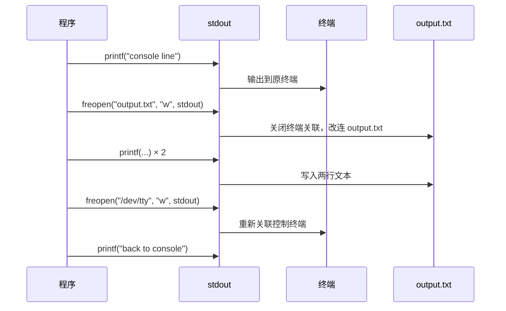
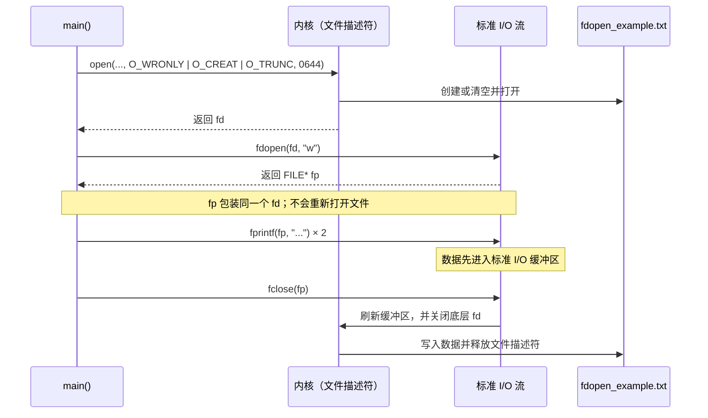
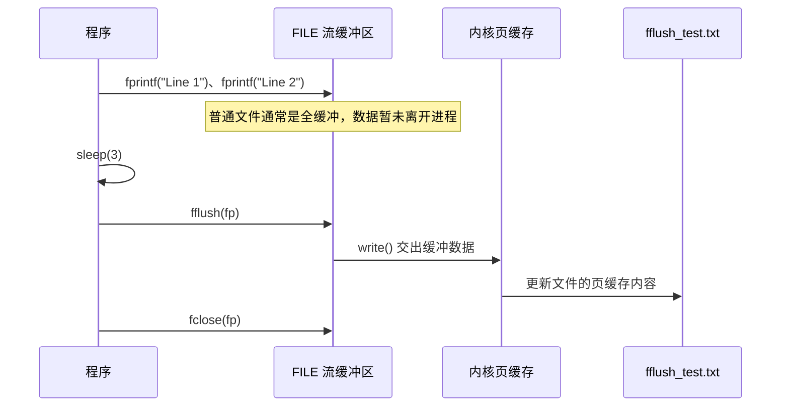
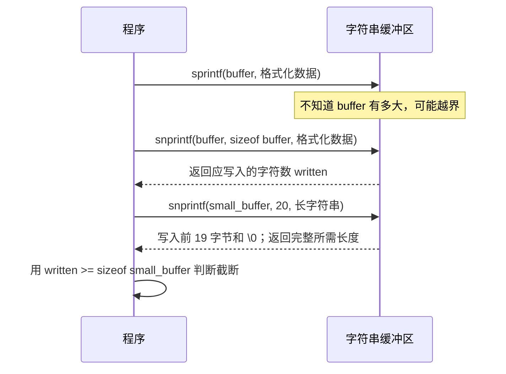
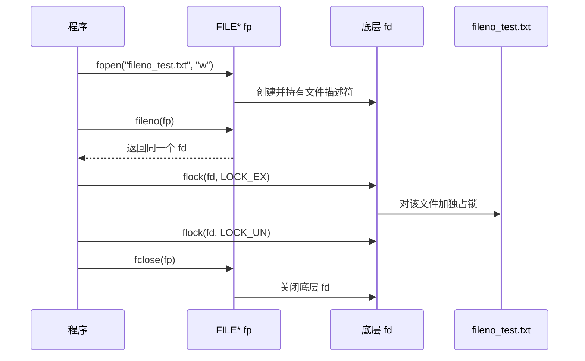

---
tags:
  - Linux
  - 文件与目录函数
阅读次数: 0
---

# 6.2 高级文件操作函数

本节介绍 C 标准库中的高级文件操作函数，包括 `freopen()`、`fdopen()`、`fflush()`、`sprintf()`/`snprintf()` 以及 `fileno()`。

---

## 1. freopen() - 重定向文件流

`freopen()` 函数用于**重新关联一个已打开的文件流**。它最常见的用途是将标准流（如 `stdout`、`stdin`、`stderr`）重定向到文件。

### 1.1 函数原型

```c
#include <stdio.h>

FILE *freopen(const char *filename, const char *mode, FILE *stream);
```

### 1.2 参数说明

- **filename**：新文件的路径
- **mode**：打开模式（如 `"r"`、`"w"`、`"a"` 等），与 [[6.1 基本文件函数#1. 文件打开模式|fopen 的模式]]相同
- **stream**：要重定向的现有文件流（如 `stdout`、`stdin`、`stderr`）

### 1.3 返回值

- 成功：返回 stream 参数
- 失败：返回 `NULL`

### 1.4 典型用途

1. **重定向标准输出到文件**：将 `printf()` 的输出写入文件而非控制台
2. **重定向标准输入**：从文件读取而非键盘
3. **重定向标准错误**：将错误信息记录到日志文件

### 1.5 示例：重定向 stdout 到文件

```c
#include <stdio.h>

int main() {
    // 此行会打印到控制台
    printf("This line will be printed to the console.\n");

    // 将 stdout 重定向到 output.txt 文件
    // freopen 内部会先关闭 stdout 原来关联的终端，再打开新文件
    if (freopen("output.txt", "w", stdout) == NULL) {
        perror("freopen failed");
        return 1;
    }

    // 此行现在会写入 output.txt，而不是控制台
    printf("This line is now redirected to output.txt!\n");
    printf("So is this line.\n");

    // 恢复到终端：ISO C 没有可移植的办法
    // Linux 下的惯用做法是重新打开控制终端 /dev/tty
    if (freopen("/dev/tty", "w", stdout) == NULL) {
        return 1;  // 没有控制终端可用（比如程序在后台跑），只能放弃
    }
    printf("We are back to printing on the console.\n");

    return 0;
}
```

### 1.6 执行时序



> [!warning] 不要先 fclose 再 freopen
> 常见错误写法是先 `fclose(stdout)`、再 `freopen("/dev/tty", "w", stdout)`。`fclose()` 之后这个 `FILE` 对象的生命周期已经结束，再把它传给任何函数都是未定义行为。`freopen()` 的语义就包含"先关闭旧流"这一步，不需要也不允许你自己先关。

---

## 2. fdopen() - 从文件描述符创建文件流

`fdopen()` 函数用于将一个现有的[[4.1 打开、读取、写入、关闭#1. 文件描述符（File Descriptor）|文件描述符]]（file descriptor，由 `open()` 返回的整数）与一个新的 `FILE` 文件流关联起来。

### 2.1 函数原型

```c
#include <stdio.h>

FILE *fdopen(int fd, const char *mode);
```

### 2.2 参数说明

- **fd**：一个有效的文件描述符，通常由 [[4.1 打开、读取、写入、关闭#2. open() - 打开文件|open()]] 系统调用返回
- **mode**：打开模式。**必须与文件描述符原有的访问权限兼容**（如 fd 是只读的，mode 就不能是 `"w"`）

### 2.3 返回值

- 成功：返回一个新的 `FILE*` 指针
- 失败：返回 `NULL`

### 2.4 为什么需要 fdopen？

在 Linux 和 Unix 系统中，有两套 I/O 接口：
- **低级 I/O**：`open()`、`read()`、`write()`、`close()`，使用文件描述符（fd）
- **标准 I/O**：`fopen()`、`fread()`、`fwrite()`、`fclose()`，使用 `FILE*` 流

`fdopen()` 的作用是**在两者之间架起桥梁**：当你已经通过 `open()` 打开了一个文件，但想使用标准 I/O 函数（如 `fprintf()`、`fgets()`）来操作时，就需要 `fdopen()`。

### 2.5 示例代码

```c
#include <stdio.h>
#include <stdlib.h>
#include <fcntl.h>    // for open()
#include <unistd.h>   // for close()

int main() {
    // 1. 使用 open() 系统调用打开文件
    int fd = open("fdopen_example.txt", O_WRONLY | O_CREAT | O_TRUNC, 0644);
    if (fd == -1) {
        perror("open failed");
        return 1;
    }

    // 2. 使用 fdopen() 将文件描述符转换为 FILE* 流
    FILE *fp = fdopen(fd, "w");
    if (fp == NULL) {
        perror("fdopen failed");
        close(fd);
        return 1;
    }

    // 3. 现在可以使用标准 I/O 函数了
    fprintf(fp, "This data was written using a FILE pointer (fp).\n");
    fprintf(fp, "The FILE pointer was created from a file descriptor.\n");

    // 4. 关闭文件
    // 注意：fclose(fp) 会同时关闭底层的文件描述符 fd
    fclose(fp);

    return 0;
}
```

### 2.6 执行时序



### 2.7 注意事项

1. `fclose(fp)` 会同时关闭底层的文件描述符 fd
2. mode 必须与文件描述符的打开模式兼容
3. 在调用 `fdopen()` 后，应该使用 `fclose()` 而不是 `close()` 来关闭文件

---

## 3. fflush() - 刷新缓冲区

`fflush()` 函数用于**强制刷新**输出流的缓冲区，确保缓冲区中的数据立即写入到实际的文件或设备中。

### 3.1 函数原型

```c
#include <stdio.h>

int fflush(FILE *stream);
```

### 3.2 参数说明

- **stream**：要刷新的文件流指针。如果传入 `NULL`，则刷新所有打开的输出流

### 3.3 返回值

- 成功：返回 0
- 失败：返回 `EOF`，并设置 errno

### 3.4 为什么需要 fflush？

C 标准库的 I/O 操作默认是**带缓冲的**（buffered）：
- **全缓冲**（`_IOFBF`）：缓冲区满了才写入（普通文件）
- **行缓冲**（`_IOLBF`）：遇到换行符才写入（连接到终端的 stdout）
- **无缓冲**（`_IONBF`）：立即写入（stderr）

缓冲模式可以在打开流之后、第一次读写之前用 `setvbuf(fp, NULL, _IONBF, 0)` 这样的调用改掉。在缓冲区未满或未遇到换行符时就想让数据写出，就需要 `fflush()`。

> [!warning] fflush 成功 ≠ 数据落盘
> `fflush()` 只完成一半的路程：把 stdio 用户态缓冲里的数据通过 `write()` 交给内核页缓存。此时断电数据照样会丢。要保证写到磁盘介质，还需要第二步 [[4.2 重定向、同步#2. fsync() - 文件同步|fsync()]]：先 `fflush(fp)`，再 `fsync(fileno(fp))`。`fclose()` 同理：它会自动 fflush，但不会 fsync。
>
> 另外，对**输入流**调用 `fflush()` 在 C 标准里是未定义行为（glibc 自行定义为丢弃已缓冲未读的数据），可移植代码不要依赖 `fflush(stdin)`。

### 3.5 示例代码

```c
#include <stdio.h>
#include <unistd.h>  // for sleep()

int main() {
    FILE *fp = fopen("fflush_test.txt", "w");
    if (fp == NULL) {
        perror("fopen failed");
        return 1;
    }

    fprintf(fp, "Line 1\n");
    fprintf(fp, "Line 2\n");

    // 此时数据可能还在缓冲区中，尚未写入文件
    printf("Data written to buffer. Check the file now - it might be empty.\n");
    sleep(3);

    // 强制刷新缓冲区，数据立即写入文件
    fflush(fp);
    printf("Buffer flushed. The file should now contain the data.\n");

    fclose(fp);
    return 0;
}
```

### 3.6 执行时序



### 3.7 常见用途

- 在 `printf()` 后立即显示输出（不带换行符时），典型如打印进度条
- 写日志后立即刷新，程序崩溃时缓冲里的最后几条日志才不会丢
- `fork()` 之前刷新所有输出流：否则父进程缓冲区里未写出的数据会被子进程复制一份，两个进程各自 flush 时同一段输出会出现两次

---

## 4. sprintf() 与 snprintf() - 格式化字符串

这两个函数用于将格式化的数据**写入字符串缓冲区**，而不是输出到文件或控制台。

### 4.1 函数原型

```c
#include <stdio.h>

int sprintf(char *str, const char *format, ...);
int snprintf(char *str, size_t size, const char *format, ...);
```

### 4.2 sprintf() 参数

- **str**：目标字符串缓冲区
- **format**：格式化字符串
- **...**：可变参数

### 4.3 snprintf() 参数

- **str**：目标字符串缓冲区
- **size**：缓冲区大小（最多写入 size-1 个字符 + '\0'）
- **format**：格式化字符串
- **...**：可变参数

### 4.4 返回值

- 成功：返回写入的字符数（不包括 '\0'）
- `snprintf()` 特别说明：如果输出被截断，返回的是**应该写入**的字符数

由此得出判断截断的惯用法：

```c
int n = snprintf(buf, sizeof(buf), "%s:%d", host, port);
if (n < 0 || (size_t)n >= sizeof(buf)) {
    // n < 0 是编码错误；n >= sizeof(buf) 说明输出被截断了
}
```

### 4.5 sprintf 与 snprintf 的区别

| 特性 | sprintf | snprintf |
|------|---------|----------|
| 缓冲区溢出检查 | 无 | 有 |
| 安全性 | 低（可能导致缓冲区溢出） | 高（推荐使用） |
| size 参数 | 无 | 必须指定 |

### 4.6 示例代码

```c
#include <stdio.h>
#include <string.h>

int main() {
    char buffer[50];
    int age = 25;
    const char *name = "Alice";
    double score = 95.5;

    // 使用 sprintf（不安全，可能溢出）
    sprintf(buffer, "Name: %s, Age: %d", name, age);
    printf("sprintf result: %s\n", buffer);

    // 使用 snprintf（安全，推荐）
    int written = snprintf(buffer, sizeof(buffer),
                           "Name: %s, Age: %d, Score: %.1f",
                           name, age, score);
    printf("snprintf result: %s\n", buffer);
    printf("Characters written: %d\n", written);

    // 演示截断
    char small_buffer[20];
    written = snprintf(small_buffer, sizeof(small_buffer),
                       "This is a very long string");
    printf("Truncated result: %s\n", small_buffer);
    printf("Would have written: %d characters\n", written);

    return 0;
}
```

### 4.7 执行时序



---

## 5. fileno() - 获取文件描述符

`fileno()` 函数用于从 `FILE*` 流中获取其底层的[[4.1 打开、读取、写入、关闭#1. 文件描述符（File Descriptor）|文件描述符]]。这是 `fdopen()` 的逆操作。

### 5.1 函数原型

```c
#include <stdio.h>

int fileno(FILE *stream);
```

### 5.2 参数说明

- **stream**：一个有效的 `FILE*` 指针

### 5.3 返回值

- 成功：返回与该流关联的文件描述符
- 失败：返回 -1，并设置 errno

### 5.4 为什么需要 fileno？

当你使用标准 I/O 打开了文件（`FILE*`），但需要调用只接受文件描述符的系统调用时（如 `flock()`、`fcntl()`、`fsync()`、`select()` 等），就需要用 `fileno()` 获取底层的 fd。

注意 `fileno()` 是 POSIX 函数，不在 ISO C 标准里；Windows 的 CRT 里对应的名字是 `_fileno()`。

### 5.5 示例代码

```c
#include <stdio.h>
#include <sys/file.h>  // for flock()

int main() {
    FILE *fp = fopen("fileno_test.txt", "w");
    if (fp == NULL) {
        perror("fopen failed");
        return 1;
    }

    // 获取文件描述符
    int fd = fileno(fp);
    printf("File descriptor for 'fp' opened file: %d\n", fd);

    // 使用文件描述符进行系统调用（如加锁）
    if (flock(fd, LOCK_EX) == 0) {
        printf("Successfully set LOCK_EX flag on file descriptor %d.\n", fd);
        // 进行文件操作...
        flock(fd, LOCK_UN);  // 解锁
    }

    fclose(fp);
    return 0;
}
```

### 5.6 执行时序



---

## 6. 总结：两层缓冲与 FILE*/fd 的转换

一次 `fprintf()` 写出的数据要经过两层缓冲、两次交接才真正到磁盘。`fflush()` 只负责第一次交接，`fdopen()`/`fileno()` 是在两层接口之间搭桥的一对函数：

![[图片/SVG/3_6_6_2_1.svg|1390]]

---

## 7. 关键要点

- **freopen()**：重定向标准流（stdout/stdin/stderr）到文件；它自带"先关旧流"语义，不要自己先 fclose
- **fdopen()**：将文件描述符（fd）转换为 FILE* 流，以便使用标准 I/O 函数；之后用 fclose 关闭，fd 会一起关掉
- **fflush()**：把 stdio 缓冲交给内核页缓存；要落盘还得 `fsync(fileno(fp))`
- **sprintf()/snprintf()**：格式化数据到字符串，**用 snprintf 并检查返回值 `n >= sizeof(buf)` 判断截断**
- **fileno()**：从 FILE* 流获取底层文件描述符（POSIX 函数），用于 flock/fsync 这类只认 fd 的调用
