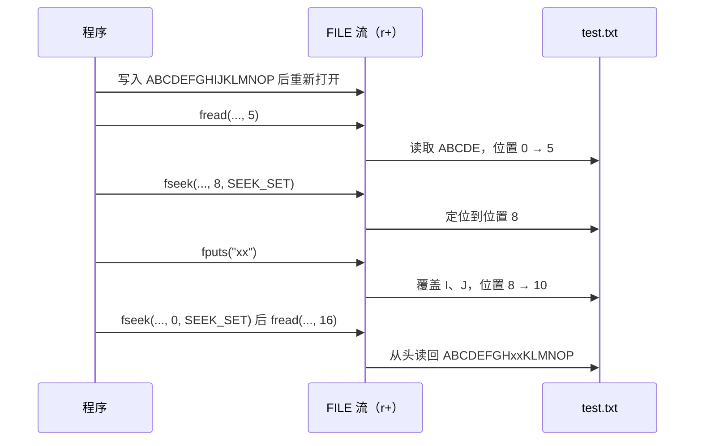
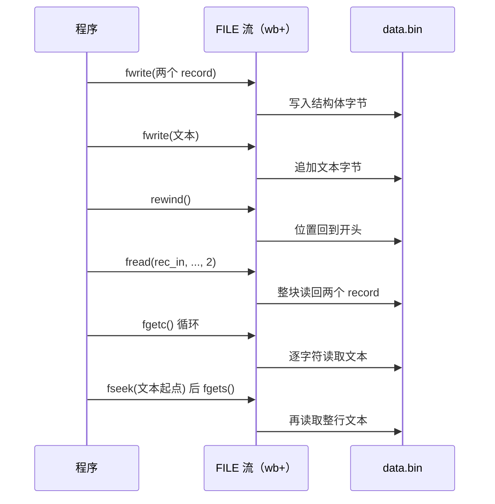
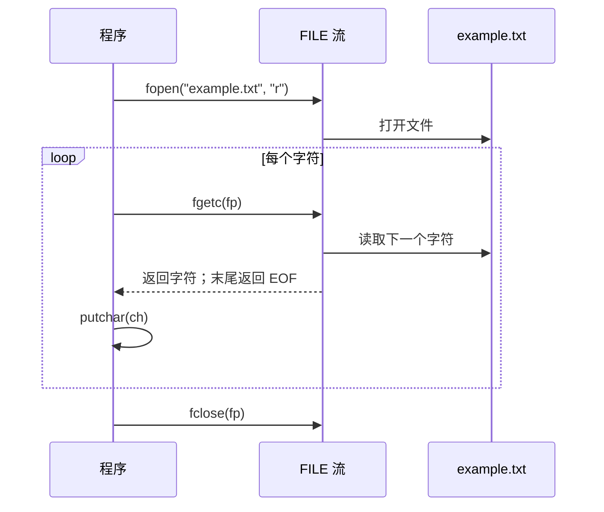
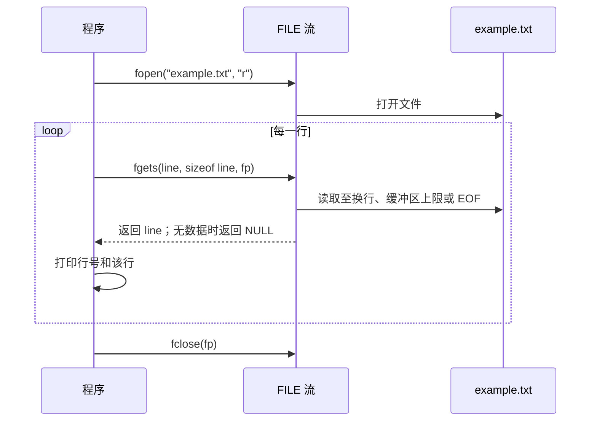

---
tags:
  - Linux
  - 文件与目录函数
阅读次数: 0
---

# 6.3 读取文件

本节介绍 C 标准库中的文件读取函数，包括 `fread()`、`fgetc()` 和 `fgets()`，以及文件内部指针的概念。

---

## 1. 文件内部指针

每个打开的文件流都维护一个**文件位置指示器**（file position indicator），也称为**文件内部指针**。

### 1.1 指针特性

- **一个流只有一个位置指示器，读和写共用**。`fread()` 读了 5 个字节，紧接着的 `fwrite()` 就从第 5 个字节开始覆盖，不存在"读指针"和"写指针"两个独立的位置
- 所有读写函数（`fread`/`fgets`/`fgetc`/`fwrite`/`fprintf`）都从当前位置开始操作，操作完成后位置向前推进相应的字节数
- `ftell()` 查询当前位置，`fseek()`/`rewind()` 移动位置，详见 [[6.5 移动文件指针]]
- 例外是追加模式：`a`/`a+` 打开的流，写入位置永远锁定在文件末尾，`fseek()` 只影响 `a+` 的读位置

> [!warning] "+" 模式下读写切换的硬规则（C 标准）
> - **写完要读**：中间必须调用 `fflush()` 或定位函数（`fseek`/`fsetpos`/`rewind`）
> - **读完要写**：中间必须调用定位函数，除非上一次读已经遇到 EOF
>
> 不插这一步就直接切换是未定义行为。glibc 下的典型症状是读到过期的缓冲数据，或写入落在意料之外的位置。

![[图片/SVG/3_6_6_3_1.svg|1390]]

### 1.2 指针行为示例

```c
FILE *fp;
char buffer[32];

// 准备一个内容确定的 16 字节文件
fp = fopen("test.txt", "w");
fputs("ABCDEFGHIJKLMNOP", fp);
fclose(fp);

// 以 "r+" 重新打开：可读可写、保留原内容，位置在 0
fp = fopen("test.txt", "r+");

// 1. 读 5 个字节：位置从 0 推进到 5
size_t n = fread(buffer, 1, 5, fp);
buffer[n] = '\0';
printf("read '%s', pos=%ld\n", buffer, ftell(fp));   // read 'ABCDE', pos=5

// 2. 读 -> 写切换：必须先经过一次定位函数（这里顺便跳到位置 8）
fseek(fp, 8, SEEK_SET);
fputs("xx", fp);                    // 覆盖位置 8、9 上的 'I'、'J'
printf("pos=%ld\n", ftell(fp));     // pos=10

// 3. 写 -> 读切换：必须先 fflush 或再定位（这里用 fseek 回到开头）
fseek(fp, 0, SEEK_SET);
n = fread(buffer, 1, 16, fp);
buffer[n] = '\0';
printf("final: '%s'\n", buffer);    // final: 'ABCDEFGHxxKLMNOP'

fclose(fp);
```

#### 1.2.1 执行时序



三步分别演示了：读操作推进位置（步骤 1）、读转写必须先定位（步骤 2）、写转读必须先 fflush 或定位（步骤 3）。步骤 2 里 `fputs` 只覆盖它写过的 2 个字节，位置 10 之后的内容原样保留，这就是 `r+` 和"清空重写"的 `w+` 的本质区别。

---

## 2. fread() - 二进制读取

`fread()` 是一个**二进制读取函数**。它用于从文件中读取指定大小和数量的数据块，适合读取二进制文件或结构化数据。

### 2.1 函数原型

```c
#include <stdio.h>

size_t fread(void *buffer, size_t size, size_t count, FILE *stream);
```

### 2.2 参数说明

- **buffer**：一个指向内存区域的指针，读取的数据将存储到这里
- **size**：要读取的每个数据块的字节大小
- **count**：要读取的数据块数量
- **stream**：一个指向已打开文件的 `FILE*` 指针

### 2.3 返回值

- 成功：返回实际读取的**完整数据块**数量（不是字节数）
- 到达 EOF 或错误：返回值小于 count

返回值小于 count 时，`fread()` 本身不告诉你是读完了还是出错了，要用 `feof()`/`ferror()` 区分，详见 [[6.6 判断错误]]：

```c
size_t got = fread(buf, sizeof(record), 10, fp);
if (got < 10) {
    if (ferror(fp)) { /* 读取出错 */ }
    else            { /* 正常读到文件末尾，got 是实际块数 */ }
}
```

### 2.4 fread 的特点

- `fread()` 适用于读取数据的**块状结构**（比如结构体数组）
- 一次调用搬运整块数据，省去逐字符循环；处理二进制文件时是首选
- 直接把结构体写入/读出文件时，字节序和结构体填充（padding）会随平台变化，这种文件不能跨平台交换

### 2.5 示例代码

```c
#include <stdio.h>
#include <stdlib.h>
#include <string.h>

// 假设我们有一个结构体来存储数据
typedef struct {
    int id;
    float value;
} record;

int main() {
    FILE *fp;
    const char *text_data = "This is a simple text line.\n";
    record rec_out[2] = {{1, 10.5}, {2, 20.25}};
    record rec_in[2];
    int ch;   // 必须是 int 而不是 char，否则无法可靠地和 EOF 比较
    char line_buffer[50];

    // 1. 创建并写入文件，以便后续读取
    fp = fopen("data.bin", "wb+");
    if (fp == NULL) {
        perror("fopen error");
        return 1;
    }

    // 写入结构体数据
    fwrite(rec_out, sizeof(record), 2, fp);
    // 写入文本数据
    fwrite(text_data, sizeof(char), strlen(text_data), fp);

    // 将文件指针移开头，以便读取
    rewind(fp);

    // 2. 使用 fread() 读取结构体数据
    if (fread(rec_in, sizeof(record), 2, fp) == 2) {
        printf("Record 1: ID=%d, Value=%.1f\n", rec_in[0].id, rec_in[0].value);
        printf("Record 2: ID=%d, Value=%.1f\n", rec_in[1].id, rec_in[1].value);
    } else {
        printf("fread failed to read all records.\n");
    }

    // 3. 使用 fgetc() 逐个字符读取
    printf("\n--- Using fgetc() to read text data char by char ---\n");
    printf("Reading the text line: ");
    while ((ch = fgetc(fp)) != EOF && ch != '\n') {
        printf("%c", ch);
    }
    printf("\n");

    // 将文件指针移回头，以便 fgets() 再次读取
    fseek(fp, sizeof(record) * 2, SEEK_SET);

    // 4. 使用 fgets() 读取整行
    printf("\n--- Using fgets() to read text line ---\n");
    if (fgets(line_buffer, sizeof(line_buffer), fp) != NULL) {
        printf("Line read by fgets(): %s", line_buffer);
    } else {
        printf("fgets failed.\n");
    }

    // 关闭文件
    fclose(fp);
    return 0;
}
```

#### 2.5.1 执行时序



### 2.6 运行与分析

1. 程序首先创建一个 data.bin 文件，并使用 `fwrite()` 写入两个 record 结构体和一段文本
2. `fread(rec_in, sizeof(record), 2, fp)` 一次调用读回 2 个 record，等价于 16 字节整块拷贝，不需要逐字段解析
3. `fgetc(fp)` 在 fread 之后开始逐字节读取剩余数据。注意接收变量声明为 `int ch`：`fgetc` 返回 `int`，如果用 `char` 接收，在 char 为无符号的平台上 `ch != EOF` 永远为真，循环会死在文件末尾
4. 为了演示 `fgets()`，我们使用 `fseek()` 将文件指针移到文本数据开头。`fgets(line_buffer, sizeof(line_buffer), fp)` 会读取一整行文本，并将其安全地存入 line_buffer，遇换行或达到缓冲区上限

---

## 3. fgetc() - 读取单个字符

`fgetc()` 是最基本的字符读取函数，它从文件中读取**一个字符**。

### 3.1 函数原型

```c
#include <stdio.h>

int fgetc(FILE *stream);
```

### 3.2 参数说明

- **stream**：一个指向已打开文件的 `FILE*` 指针

### 3.3 返回值

- 成功：返回读取的字符（作为 `unsigned char` 转换为 `int`）
- 到达文件末尾或错误：返回 `EOF`

### 3.4 fgetc 的特点

- `fgetc()` 每次只读取一个字符，通常用于逐字符处理文件内容（词法分析、按分隔符切分这类场景）
- 返回类型是 `int` 而非 `char`：返回值是"转成 `int` 的 `unsigned char`"或 `EOF`（通常为 -1）。字节 0xFF 转成 `unsigned char` 是 255，和 EOF 能区分开；若用 `char` 接收就混在一起了
- 逐字符读并不慢多少：字符来自 stdio 用户态缓冲，并非每次都陷入系统调用

### 3.5 示例：逐字符读取文件

```c
#include <stdio.h>

int main() {
    FILE *fp = fopen("example.txt", "r");
    if (fp == NULL) {
        perror("fopen failed");
        return 1;
    }

    int ch;
    printf("File content (char by char):\n");

    // 逐字符读取，直到 EOF
    while ((ch = fgetc(fp)) != EOF) {
        putchar(ch);  // 输出字符
    }

    fclose(fp);
    return 0;
}
```

#### 3.5.1 执行时序



---

## 4. fgets() - 读取一行文本

`fgets()` 是一个**行读取函数**，它从文件中读取一行字符或指定数量的字符。

### 4.1 函数原型

```c
#include <stdio.h>

char *fgets(char *str, int n, FILE *stream);
```

### 4.2 参数说明

- **str**：一个字符数组或字符指针，用于存储读取的字符串
- **n**：要读取的最大字符数（包括 `'\0'`）。`fgets()` 最多读取 n-1 个字符，并在末尾添加一个空字符 `'\0'`
- **stream**：一个指向已打开文件的 `FILE*` 指针

### 4.3 返回值

- 成功：返回 `str` 指针
- 到达文件末尾且未读取任何字符，或发生错误：返回 `NULL`

### 4.4 fgets 的行为

- 决定返回的条件
	- 读取直到遇到**换行符**（`'\n'`）
	- 读取直到遇到**EOF**
	- 读取了 **n-1** 个字符（这里的 `n - 1` 指的是目标数组 `line` 的容量限制，因为最后还要留一个位置存 `'\0'`）
- 如果读取到换行符，换行符**会被包含**在字符串中
- 始终在末尾添加 `'\0'`

去掉行尾换行符的惯用法（`strcspn` 返回第一个 `'\n'` 的下标，没有换行符时返回字符串长度，两种情况都正确）：

```c
line[strcspn(line, "\n")] = '\0';
```

### 4.5 示例：逐行读取文件

```c
#include <stdio.h>

int main() {
    FILE *fp = fopen("example.txt", "r");
    if (fp == NULL) {
        perror("fopen failed");
        return 1;
    }

    char line[256];
    int line_number = 1;

    printf("File content (line by line):\n");

    // 逐行读取
    while (fgets(line, sizeof(line), fp) != NULL) {
        printf("Line %d: %s", line_number++, line);
    }

    fclose(fp);
    return 0;
}
```

#### 4.5.1 执行时序



### 4.6 fgets 与 gets 的区别

| 特性 | fgets | gets（已废弃） |
|------|-------|----------------|
| 缓冲区大小 | 必须指定 | 不指定 |
| 安全性 | 安全（防止溢出） | 不安全（可能溢出） |
| 换行符 | 保留在字符串中 | 不保留 |
| 推荐度 | 推荐使用 | **不要使用**（C11 已移除） |

---

## 5. 三种读取函数对比

| 函数 | 读取单位 | 适用场景 | 特点 |
|------|---------|---------|------|
| `fread()` | 数据块 | 二进制文件、结构体数组 | 高效，适合批量读取 |
| `fgetc()` | 单个字符 | 逐字符处理、解析文本 | 灵活，适合字符级操作 |
| `fgets()` | 一行文本 | 读取文本文件、配置文件 | 安全，自动处理换行 |

---

## 6. 关键要点

- **文件内部指针**：一个流只有一个位置指示器，读写共用；`a`/`a+` 的写入位置例外，永远在末尾
- **"+" 模式切换规则**：读转写先定位（fseek/rewind），写转读先 fflush 或定位，否则是未定义行为
- **fread()**：按块读取，返回完整块数；短计数时用 `feof()`/`ferror()` 区分是读完了还是出错了
- **fgetc()**：逐字符读取，接收变量必须声明为 `int` 才能正确判断 EOF
- **fgets()**：逐行读取，保留换行符；用 `line[strcspn(line, "\n")] = '\0';` 去掉它
- 读取函数的返回值都要检查，写入函数见 [[6.4 写入文件]]
