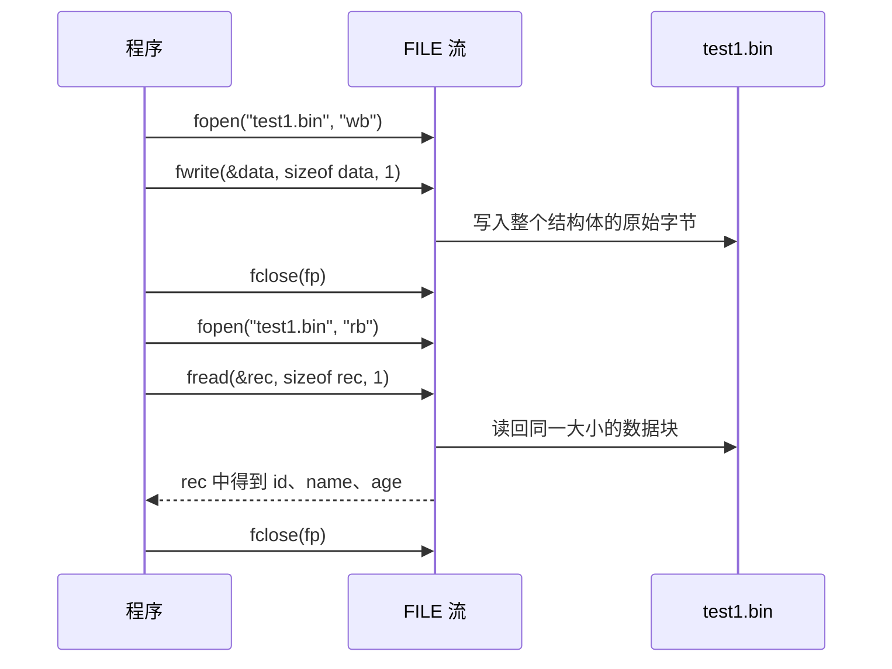
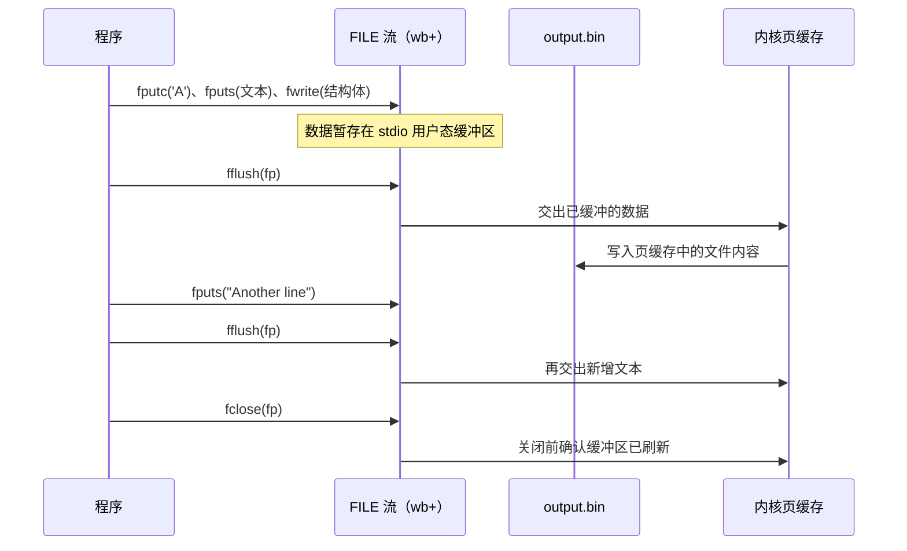

---
tags:
  - Linux
  - 文件与目录函数
阅读次数: 0
---

# 6.4 写入文件

本节介绍 C 标准库中的文件写入函数，包括 `fputc()`、`fputs()`、`fwrite()` 和 `fflush()`。这些函数与[[6.3 读取文件|读取函数]]相对应，用于将数据写入文件流。

---

## 1. fputc() - 写入单个字符

`fputc()` 函数将一个单字符写入指定的文件流中。

### 1.1 函数原型

```c
#include <stdio.h>

int fputc(int c, FILE *fp);
```

### 1.2 参数说明

- **c**：要写入的字符，类型为 int
- **fp**：一个指向已打开文件流的指针，数据将被写入这里

### 1.3 返回值

- 成功：返回写入的字符
- 失败：返回 `EOF`

### 1.4 特点

`fputc()` 是最基本的字符写入函数，适用于逐字符输出场景。

---

## 2. fputs() - 写入字符串

`fputs()` 函数将一个字符串写入指定的文件流。

### 2.1 函数原型

```c
#include <stdio.h>

int fputs(const char *str, FILE *stream);
```

### 2.2 参数说明

- **str**：一个指向要写入的字符串的指针
- **stream**：一个指向文件流的指针

### 2.3 返回值

- 成功：返回非负值
- 失败：返回 `EOF`

### 2.4 fputs 的特点

`fputs()` 的一个重要特点是，它在写入时会在 str 中的空字符 `\0` 处停止，但它**不会将这个空字符写入文件**，也**不会自动添加换行符**。因此，`fputs()` 只相当于写入标准的 C 语言字符串（以 `\0` 结尾的字符序列）。

---

## 3. fwrite() - 写入数据块（二进制写入）

`fwrite()` 是一个二进制文件写入函数，它用于将指定大小和数量的数据块写入文件。

### 3.1 函数原型

```c
#include <stdio.h>

size_t fwrite(const void *ptr, size_t size, size_t n_memb, FILE *stream);
```

### 3.2 参数说明

- **ptr**：一个指向要写入数据的指针
- **size**：要写入的每个数据块的字节大小
- **n_memb**：要写入的数据块的数量
- **stream**：一个指向文件流的指针

### 3.3 返回值

- 成功：返回实际写入的数据块数量
- 失败或部分写入：返回值小于 n_memb

### 3.4 fwrite 的特点

`fwrite()` 不会理会数据中的空字符，因为它只是简单地将内存中的一个数据块按字节写入文件。这使得它非常适合写入二进制数据，例如结构体或数组的序列化数据。

### 3.5 fread 与 fwrite 的对应关系

`fwrite()` 和 [[6.3 读取文件#2. fread() - 二进制读取|fread()]] 是一对：用 `fwrite()` 把结构体按内存字节原样写入文件，再用相同的 `size`/`count` 参数调用 `fread()` 就能把它读回内存。

### 3.6 示例代码

```c
#include <stdio.h>

struct Test {
    int  id;
    char name[16];
    int  age;
};

void write_then_read(void) {
    // 写入：二进制模式打开，整个结构体一次写出
    FILE *fp = fopen("./test1.bin", "wb");
    if (fp) {
        struct Test data = { 1000, "liner", 28 };
        size_t ret = fwrite(&data, sizeof(struct Test), 1, fp);
        printf("fwrite ret = %zu\n", ret);   // 1：写入了 1 个完整块
        fclose(fp);
    }

    // 读回：同样的 size/count，整块读入
    fp = fopen("./test1.bin", "rb");
    if (fp) {
        struct Test rec;
        if (fread(&rec, sizeof(struct Test), 1, fp) == 1) {
            printf("id=%d name=%s age=%d\n", rec.id, rec.name, rec.age);
        }
        fclose(fp);
    }
}
```

#### 3.6.1 执行时序



三个容易踩的点：写入和读取都要用**二进制模式**（`wb`/`rb`），保证字节不被转换；`size_t` 用 `%zu` 打印；这种"结构体直接落盘"的文件带着本机的字节序和结构体填充（padding），换个平台读可能就错位，只适合同平台的临时存储。

---

## 4. fflush() - 刷新缓冲区

`fflush()` 函数用于**立即更新文件流的缓冲区**。

### 4.1 函数原型

```c
#include <stdio.h>

int fflush(FILE *stream);
```

### 4.2 参数说明

- **stream**：一个指向文件流的指针

### 4.3 返回值

- 成功：返回 0
- 失败：返回 `EOF`

### 4.4 为什么需要 fflush？

C 标准库中的文件流通常都带有缓冲区。当使用 `fputc()`、`fputs()` 等函数写入数据时，数据会先被存储在用户态缓冲区中。当缓冲区满了、文件被关闭或程序正常退出时，数据才会通过 `write()` 交给内核。

`fflush()` 强制立即执行这次交接。注意它只把数据推到内核页缓存为止，不等于写入磁盘介质；掉电也不能丢的数据还要再调 `fsync(fileno(fp))`。

### 4.5 使用场景

在写入的关键节点调用 `fflush()`，可以保证这部分数据离开用户态缓冲：进程此后即使崩溃，数据也已在内核手里，不会随进程一起消失（真正怕的是掉电，那要靠 fsync）。

更多关于缓冲区分层和 `fflush()` 的内容，参见[[6.2 高级文件操作函数#3. fflush() - 刷新缓冲区|高级文件操作函数中的 fflush 介绍]]。

---

## 5. 综合示例

以下示例演示了 `fputc()`、`fputs()`、`fwrite()` 和 `fflush()` 的用法：

```c
#include <stdio.h>
#include <string.h>

int main() {
    FILE *fp;
    char text_line[] = "This is a line written by fputs.\n";
    char a_char = 'A';

    // 假设我们有一个结构体用于演示 fwrite
    typedef struct {
        int id;
        float value;
    } Record;

    Record my_record = {101, 99.9};

    // 以二进制写模式打开文件
    fp = fopen("output.bin", "wb+");
    if (fp == NULL) {
        perror("fopen error");
        return 1;
    }

    // 1. 使用 fputc 写入单个字符
    printf("Writing a single character with fputc...\n");
    fputc(a_char, fp);

    // 2. 使用 fputs 写入字符串
    printf("Writing a string with fputs...\n");
    fputs(text_line, fp);

    // 3. 使用 fwrite 写入结构体（二进制数据）
    printf("Writing a struct with fwrite...\n");
    fwrite(&my_record, sizeof(Record), 1, fp);

    // 4. 使用 fflush 强制将缓冲区数据写入文件
    printf("Forcing buffer flush with fflush...\n");
    fflush(fp);

    // 5. 再次写入一段字符串，并用 fflush 验证
    fputs("Another line\n", fp);
    fflush(fp);

    // 关闭文件
    fclose(fp);

    // 验证文件内容（注意：用文本编辑器打开 output.bin 可能会显示乱码）
    // 因为其中包含了 fwrite 写入的二进制数据
    printf("File 'output.bin' has been created.\n");

    return 0;
}
```

### 5.1 执行时序



### 5.2 运行分析

1. **fputc()**：将字符 'A' 写入文件流的缓冲区
2. **fputs()**：写入 text_line 里 `\0` 之前的全部字符（含末尾的 `\n`），`\0` 本身不写入
3. **fwrite()**：将 my_record 结构体的所有字节（`sizeof(Record)` 大小）原封不动地写入缓冲区，适合二进制数据
4. **fflush()**：把前面积累在用户态缓冲的数据立即交给内核。之后每次写完再调一次，就能保证"写一段、交一段"
5. **fclose()**：关闭文件时隐式执行一次缓冲区刷新，所以正常退出的程序不 fflush 也不丢数据；fflush 防的是中途崩溃

---

## 6. 关键要点

- **fputc()**：写入单个字符，失败返回 `EOF`
- **fputs()**：写入以 `\0` 结尾的 C 字符串，`\0` 不写入、也不自动加换行（`puts()` 才自动加换行，且只写 stdout）
- **fwrite()**：按字节写入任意数据块，二进制文件的首选；注意字节序和 padding 使这类文件不可跨平台
- **fflush()**：不关闭文件的前提下，把用户态缓冲交给内核；防进程崩溃丢数据，防掉电还需 fsync

### 6.1 函数对比

| 函数 | 写入单位 | 适用场景 | 特点 |
|------|---------|---------|------|
| `fputc()` | 单个字符 | 逐字符输出 | 简单直接 |
| `fputs()` | 字符串 | 文本文件写入 | 不写入 `\0`，不自动换行 |
| `fwrite()` | 数据块 | 二进制文件、结构体 | 精确控制写入字节数 |
| `fflush()` | - | 强制刷新缓冲区 | 交给内核，非落盘 |
