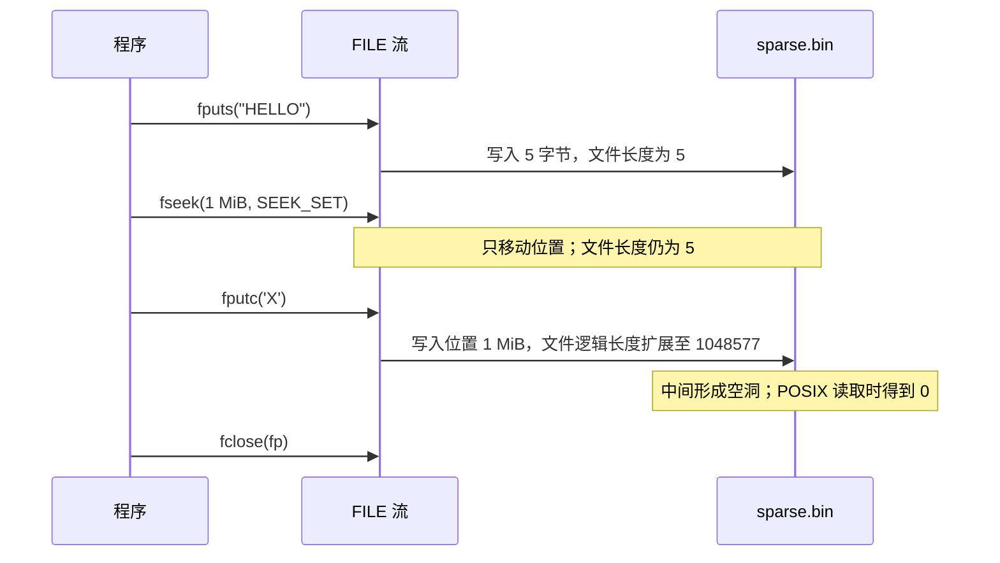
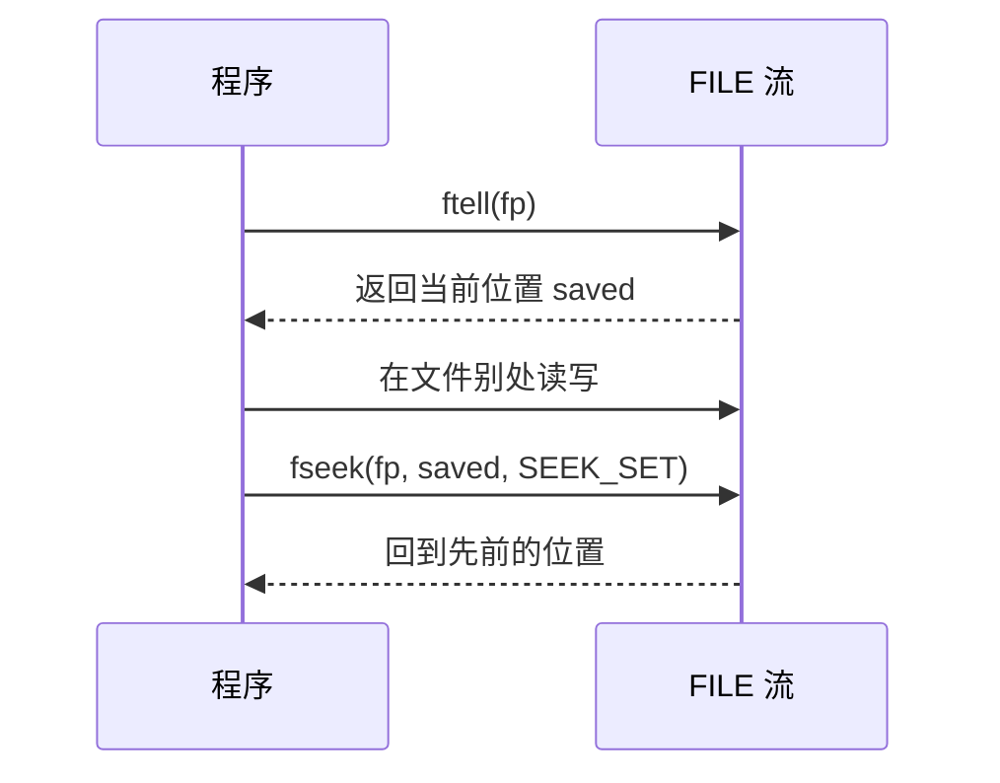
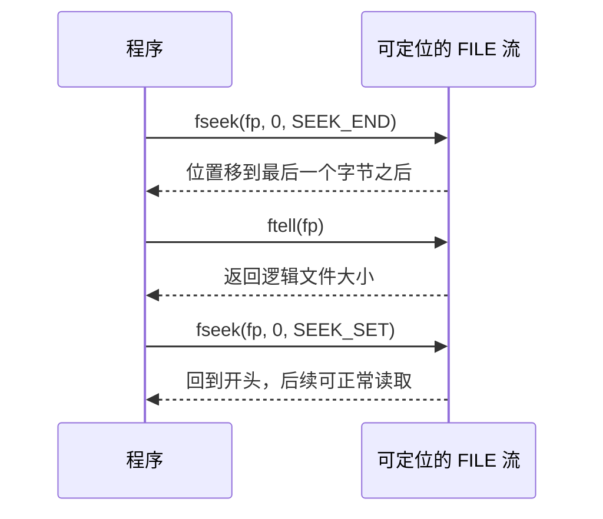
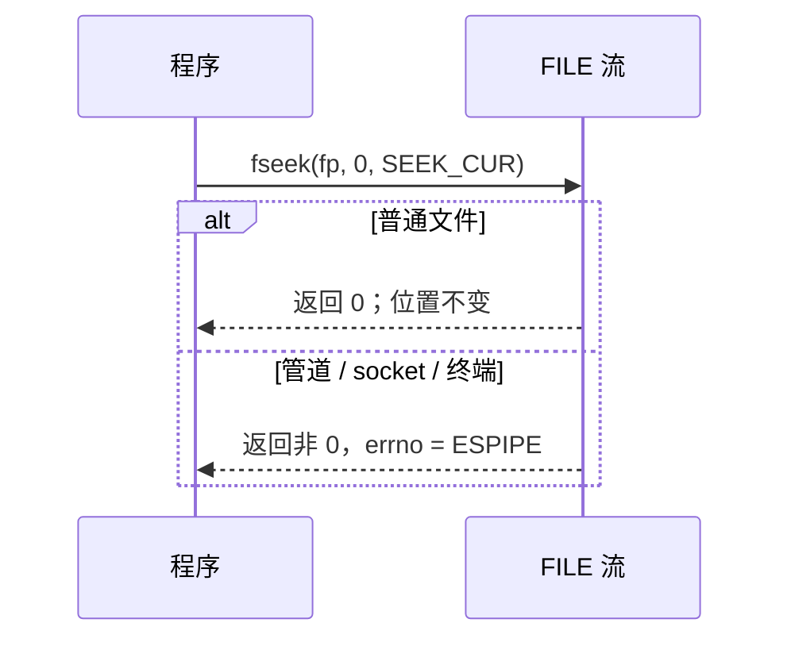
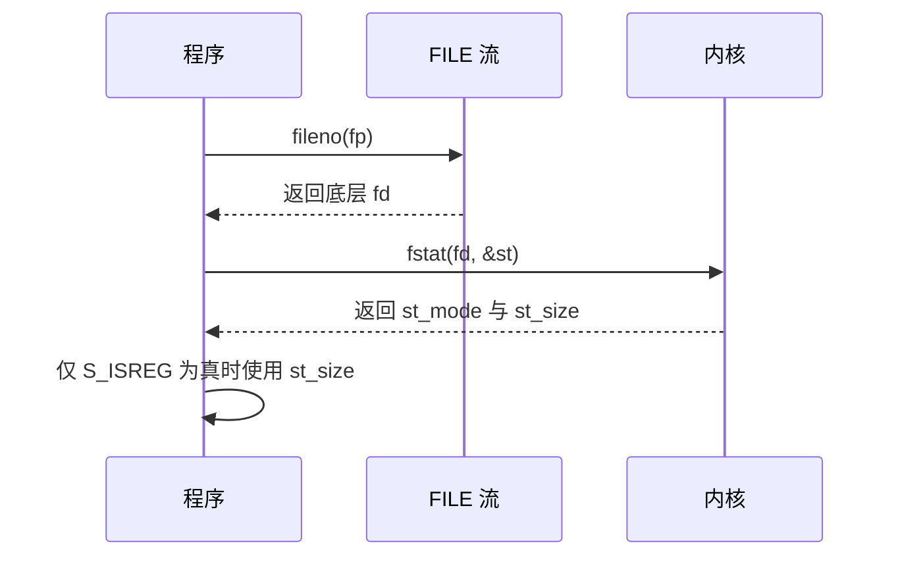
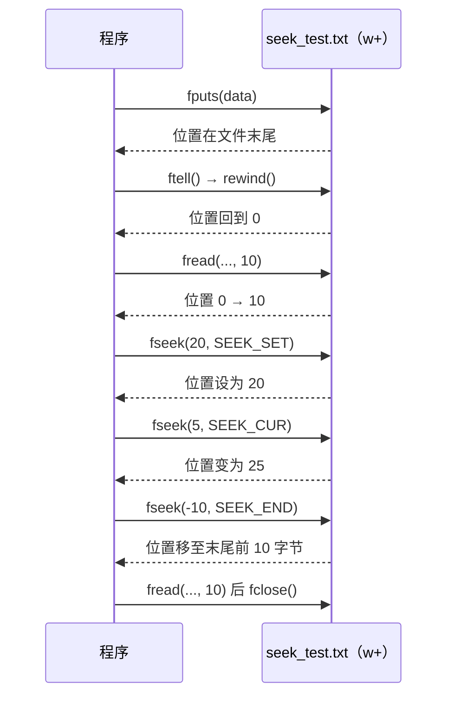
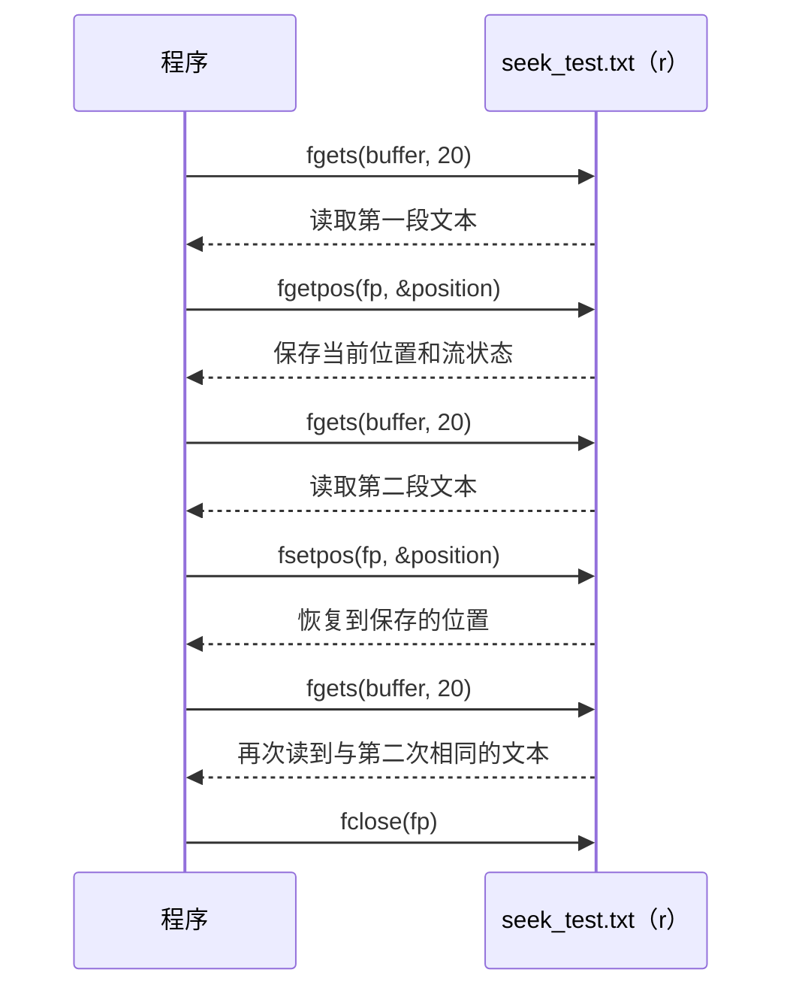

---
tags:
  - Linux
  - 文件与目录函数
阅读次数: 0
---

# 6.5 移动文件指针

本节介绍 C 标准库中用于操作[[6.3 读取文件#1. 文件内部指针|文件位置指示器]]的函数，包括 `fseek()`、`ftell()`、`rewind()`、`fgetpos()` 和 `fsetpos()`。

---

## 1. fseek() - 移动文件读写位置

`fseek()` 函数用于移动文件流的读写位置指针。

### 1.1 函数原型

```c
#include <stdio.h>

int fseek(FILE *stream, long offset, int fromwhere);
```

### 1.2 参数说明

- **stream**：一个指向已打开文件流的指针
- **offset**：一个整数，指定从 fromwhere 开始的偏移量，可以为正、负或 0
- **fromwhere**：指定偏移量的起始位置，可以是以下三个宏之一：

| 宏 | 值 | 说明 |
|----|----|------|
| `SEEK_SET` | 0 | 文件开头 |
| `SEEK_CUR` | 1 | 当前位置 |
| `SEEK_END` | 2 | 文件末尾 |

三个基准分别落在文件的什么位置，offset 取正取负又会走到哪里：

![[图片/SVG/3_6_6_5_1.svg|1390]]

图中 `SEEK_END` 的基准值得单独记一下：它指向**最后一个字节之后**，而不是最后一个字节。所以 `fseek(fp, 0, SEEK_END)` 之后 `ftell()` 拿到的正好是文件字节数；想读末尾 10 个字节，要写 `fseek(fp, -10, SEEK_END)`。

### 1.3 返回值

- 成功：返回 0
- 失败：返回非 0 值，并设置 errno

### 1.4 fseek 的行为

- `fseek()` 会清除 EOF 指示器：读到文件末尾之后调用一次 `fseek()`，`feof()` 就重新返回 false
- `fseek()` 是 [[6.3 读取文件#1. 文件内部指针|"+" 模式读写切换规则]]认可的"定位函数"：读转写、写转读之间插一次 `fseek()` 即合法，哪怕位置没变（`fseek(fp, 0, SEEK_CUR)`）
- 对于以追加模式（`a` 或 `a+`）打开的文件，`fseek()` **无法**改变写入位置（写入总是在末尾），但可以改变读取位置
- 允许 seek 到超过文件末尾的位置，在那里写入会把文件撑大，中间形成空洞（见下一节）；seek 到负位置则失败并设置 `EINVAL`
- 在文本模式下，offset 的含义可能因平台而异（Windows 有 `\r\n` 转换）。可移植的文本文件定位只有两种：`fseek(fp, 0, SEEK_SET/SEEK_END/SEEK_CUR)`，或 `fseek(fp, ftell_保存值, SEEK_SET)`。Linux 下文本流和二进制流相同，没有这个限制

### 1.5 越过 EOF 写入：空洞与稀疏文件

位置移到文件末尾之后的那一刻，文件没有任何变化——`fseek()` 只改位置，不产生 IO。真正把文件撑大的是随后的那次写入：

```c
#include <stdio.h>

int main(void) {
    FILE *fp = fopen("sparse.bin", "w+b");
    if (fp == NULL) {
        perror("fopen");
        return 1;
    }

    fputs("HELLO", fp);                 // 文件长度 5
    fseek(fp, 1024 * 1024, SEEK_SET);   // 位置 = 1 MiB，文件长度还是 5
    fputc('X', fp);                     // 到这一步文件长度才变成 1048577

    fclose(fp);
    return 0;
}
```

#### 1.5.1 执行时序



中间的字节 5 ~ 1048575 一次都没被写过。C 标准没有规定这段读出来是什么，POSIX 则明确要求读出全 0，Linux 上就是全 0。而在 ext4、XFS、Btrfs 这类支持**稀疏文件**的文件系统上，这段空洞不会真的去分配磁盘块，于是同一个文件有了两种"大小"：

```bash
$ ls -l sparse.bin        # 逻辑长度，把空洞算在内
-rw-r--r-- 1 user user 1048577 Jul 31 10:00 sparse.bin

$ du -h sparse.bin        # 实际占用的磁盘块
8.0K    sparse.bin
```

`du` 只报 8 KiB，是因为 ext4 按 4 KiB 的块分配，整个文件只有开头（装着 `HELLO`）和结尾（装着 `X`）两个块真正落了地。空洞是按块算的：0 号块因为装着 `HELLO`，整块都已分配，真正不占盘的是 4096 ~ 1048575 这一段。具体数值随文件系统和块大小变化；`du --apparent-size` 则改成报告逻辑长度，和 `ls -l` 一致。

> [!warning] 空洞不是可移植的省空间技巧
> - FAT32、exFAT 不支持稀疏文件，同样的代码会老老实实分配 1 MiB 并写满 0
> - 空洞很容易在复制、归档时被展开成实体 0。GNU `cp` 默认 `--sparse=auto` 会尽量保持，但 `tar` 要加 `-S`、`rsync` 要加 `-S`，否则那 1 MiB 会被当成真实数据搬一遍
> - 想知道一个文件哪里是空洞，用 [[4.2 重定向、同步#3. lseek() - 修改读写位置偏移量|lseek()]] 的 `SEEK_HOLE` / `SEEK_DATA`（Linux 3.1 起支持）

### 1.6 fseek 与 lseek 的对比

`fseek()` 是 C 标准库函数（操作 `FILE*` 流），而 [[4.2 重定向、同步#3. lseek() - 修改读写位置偏移量|lseek()]] 是 POSIX 系统调用（操作[[4.1 打开、读取、写入、关闭#1. 文件描述符（File Descriptor）|文件描述符]]）。

| 特性 | fseek() | lseek() |
|------|---------|---------|
| 所属 | C 标准库 | POSIX 系统调用 |
| 操作对象 | FILE* 流 | 文件描述符 fd |
| 返回值 | 0（成功）或非 0（失败） | 新的偏移量或 -1（失败） |
| 遇到管道/套接字 | 返回 -1，`errno = ESPIPE` | 同样返回 -1，`errno = ESPIPE` |

"不可定位"这件事是内核那一层的性质，所以换成 `lseek()` 也绕不过去，详见[[#4. 不可 seek 的流：管道、套接字、终端|后面一节]]。

---

## 2. ftell() - 获取当前文件位置

`ftell()` 函数用于获取文件流的当前读写位置，参数 `stream` 是一个已打开的文件流。

### 2.1 函数原型

```c
#include <stdio.h>

long ftell(FILE *stream);
```

### 2.2 返回值

- 成功：返回当前位置（从文件开头算起的字节偏移量）
- 失败：返回 -1L，并设置 errno

### 2.3 典型用法

`ftell()` 记下位置、`fseek()` 跳回去，这一对是随机访问的基本手法：

```c
long saved = ftell(fp);       // 记住现在读到哪
/* ... 中间跑去文件别处读写 ... */
fseek(fp, saved, SEEK_SET);   // 回到原处继续
```

#### 2.3.1 执行时序



### 2.4 惯用法：获取文件大小

```c
fseek(fp, 0, SEEK_END);      // 跳到末尾
long size = ftell(fp);       // 此时的偏移量就是文件字节数
fseek(fp, 0, SEEK_SET);      // 记得回到开头再开始读
```

#### 2.4.1 执行时序



三个前提：文件要以二进制模式打开（文本模式下 `ftell()` 的返回值只保证"能传回 `fseek()`"，不保证等于字节数）；文件大小不能超过 `long` 的表示范围，超了就用下面的 `ftello()`；流本身得能定位，管道和套接字上这套写法会失败，见[[#4. 不可 seek 的流：管道、套接字、终端|后面一节]]。

真要拿文件大小，`fstat()` 比这三行更稳，理由也在那一节。

---

## 3. rewind() - 重置文件位置到开头

`rewind()` 函数将文件位置指针重新设置到文件的开头，参数 `stream` 是一个已打开的文件流，没有返回值。

### 3.1 函数原型

```c
#include <stdio.h>

void rewind(FILE *stream);
```

### 3.2 rewind 的行为

`rewind(fp)` 等价于：

```c
fseek(fp, 0, SEEK_SET);
clearerr(fp);  // 同时清除错误和 EOF 标志
```

也就是说它不只把位置重置到开头，还会清掉该流的错误标志和 EOF 标志。方便，但代价是失败被吞掉了——下一节会看到这个坑。

---

## 4. 不可 seek 的流：管道、套接字、终端

上面几个函数都默认"文件有一个可以任意跳转的位置"。这个前提对普通文件成立，对[[11.9 管道通讯|管道]]、FIFO、套接字和终端都不成立：这些流只能顺着往下读，没有"第 100 个字节"这种概念。在它们上面调用定位函数会失败，`errno` 置为 `ESPIPE`（`Illegal seek`）：

| 函数 | 在管道上的表现 |
|------|---------------|
| `fseek()` | 返回 -1，`errno = ESPIPE` |
| `ftell()` | 返回 -1L，`errno = ESPIPE` |
| `rewind()` | 无返回值，**失败完全看不出来** |

`rewind()` 这一行最坑：它没有返回值，还会顺手清掉错误标志，所以事后连 `ferror()` 都查不出发生过什么。需要判断成败的场合别用它，改用 `fseek(fp, 0, SEEK_SET)` 并检查返回值。

### 4.1 它是怎么坑到人的

最常见的翻车现场，是把前面那个"获取文件大小"的惯用法用在了 `stdin` 上：

```bash
$ ./wordcount < poem.txt      # stdin 是普通文件的 fd，可以 seek，一切正常
$ cat poem.txt | ./wordcount  # stdin 是管道，fseek 失败，size 拿到 -1
```

同一个程序，只是换了个 shell 写法，行为就变了。如果代码没检查 `fseek()` 的返回值，`ftell()` 返回的 -1 会被当作"文件大小 -1"一路传下去，最后表现成一个莫名其妙的 `malloc` 失败或者空输出，从现象很难倒推回定位函数。

### 4.2 判断流能不能定位

做一次不改变位置的探测就够了：

```c
// 可定位返回 1；管道 / socket / 终端返回 0
int is_seekable(FILE *fp) {
    return fseek(fp, 0, SEEK_CUR) == 0;
}
```

#### 4.2.1 执行时序



位移取 0 是关键：对可定位的流，这一次调用不会改变位置，探测完照常读写即可（代价只是丢掉已经预读进缓冲区的数据）。

### 4.3 求文件大小的更好办法

与其 `fseek` + `ftell` 一来一回，不如直接问内核。[[4.1 打开、读取、写入、关闭#1. 文件描述符（File Descriptor）|文件描述符]]上的 `fstat()` 不移动位置，也不受 `long` 宽度限制：

```c
#include <stdio.h>
#include <sys/stat.h>

struct stat st;
// 查询这个 `fd` 对应对象的信息，写入 `struct stat st` && 检查 `st.st_mode`，判断对象是不是普通文件。
if (fstat(fileno(fp), &st) == 0 && S_ISREG(st.st_mode)) {
    off_t size = st.st_size;   // 只有普通文件的 st_size 才有意义
}
```

#### 4.3.1 执行时序



`S_ISREG` 这个判断不能省：管道和套接字的 `st_size` 没有意义，而 `/proc`、`/sys` 下的文件 `st_size` 恒为 0——这类文件两种办法都测不出大小，只能一路读到 EOF 为止。

另外注意 `st_size` 是逻辑长度，稀疏文件的空洞也算在内，和上面 `ls -l` 报的是同一个数。要占盘大小得看 `st_blocks`。

---

## 5. ftello() 与 fseeko() - 大文件定位（POSIX）

`ftell()` 返回 `long`。64 位 Linux 上 `long` 是 8 字节，足够表示任何实际文件；但 32 位平台上 `long` 只有 4 字节，超过 2GiB 的文件就会溢出。POSIX 为此提供了 `off_t` 版本：

```c
#include <stdio.h>

off_t ftello(FILE *stream);
int fseeko(FILE *stream, off_t offset, int whence);
```

用法和 `ftell()`/`fseek()` 完全一样，只是位置类型换成 `off_t`。在 32 位程序里要配合编译选项 `-D_FILE_OFFSET_BITS=64`，让 `off_t` 成为 64 位。处理大文件时优先用这一对，而不是下面的 `fgetpos()`。

---

## 6. fgetpos() 与 fsetpos() - 保存完整流状态

`fgetpos()` 和 `fsetpos()` 用 `fpos_t` 类型保存和恢复位置。和 `ftell()` 的区别在于：`fpos_t` 保存的不只是字节偏移量，还包括流的解析状态（比如多字节/宽字符流的转换状态），因此它是 ISO C 里**唯一保证对任何流都完整可恢复**的定位方式。代价是 `fpos_t` 不透明，不能做算术运算，只能"原地保存、原地恢复"。

### 6.1 函数原型

```c
#include <stdio.h>

int fgetpos(FILE *stream, fpos_t *pos);
int fsetpos(FILE *stream, const fpos_t *pos);
```

### 6.2 参数说明

| 参数 | 说明 |
|------|------|
| `stream` | 一个指向已打开文件流的指针 |
| `pos` | 指向 `fpos_t` 变量：`fgetpos()` 往里写当前位置，`fsetpos()` 从里面读出要恢复的位置 |

### 6.3 返回值

- 成功：返回 0
- 失败：返回非 0 值，并设置 errno

### 6.4 fpos_t 类型说明

`fpos_t` 是一个不透明类型（可能是结构体），其内部实现因平台而异。你**不应该**直接操作 `fpos_t` 的值，只能通过 `fgetpos()` 获取、通过 `fsetpos()` 设置。

---

## 7. 综合示例

把 `fseek()`、`ftell()`、`rewind()` 串起来跑一遍，观察位置指示器一路是怎么变的：

```c
#include <stdio.h>
#include <string.h>

int main() {
    FILE *fp;
    char buffer[100];
    const char *data = "This is a sample text file for fseek and ftell.";

    // 创建测试文件
    fp = fopen("seek_test.txt", "w+");
    if (fp == NULL) {
        perror("fopen");
        return 1;
    }

    // 写入数据
    fputs(data, fp);
    printf("File size: %ld bytes\n", (long)strlen(data));

    // 使用 ftell 获取当前位置（应该在文件末尾）
    long pos = ftell(fp);
    printf("Current file position after write: %ld\n", pos);

    // 使用 rewind 将位置重置到开头
    rewind(fp);
    printf("File position after rewind: %ld\n", ftell(fp));

    // 读取前 10 个字符
    fread(buffer, 1, 10, fp);
    buffer[10] = '\0';
    printf("First 10 chars: '%s'\n", buffer);
    printf("Position after reading 10 bytes: %ld\n", ftell(fp));

    // 使用 fseek 跳到文件中间（位置 20）
    fseek(fp, 20, SEEK_SET);
    printf("Position after fseek(20, SEEK_SET): %ld\n", ftell(fp));

    // 从当前位置再往后跳 5 个字节
    fseek(fp, 5, SEEK_CUR);
    printf("Position after fseek(5, SEEK_CUR): %ld\n", ftell(fp));

    // 跳到文件末尾前 10 个字节
    fseek(fp, -10, SEEK_END);
    printf("Position after fseek(-10, SEEK_END): %ld\n", ftell(fp));

    // 读取最后 10 个字符
    fread(buffer, 1, 10, fp);
    buffer[10] = '\0';
    printf("Last 10 chars: '%s'\n", buffer);

    fclose(fp);
    return 0;
}
```

### 7.1 执行时序



### 7.2 运行输出示例

```
File size: 47 bytes
Current file position after write: 47
File position after rewind: 0
First 10 chars: 'This is a '
Position after reading 10 bytes: 10
Position after fseek(20, SEEK_SET): 20
Position after fseek(5, SEEK_CUR): 25
Position after fseek(-10, SEEK_END): 37
Last 10 chars: 'and ftell.'
```

### 7.3 运行分析

1. 文件写入后，`ftell()` 返回 47，表示文件指针在末尾（字符串共 47 字节，不含 `\0`，`fputs` 不写入 `\0`）
2. `rewind()` 将位置重置为 0
3. 读取 10 字节后，位置变为 10
4. `fseek(fp, 20, SEEK_SET)` 将位置设为距文件开头 20 字节处
5. `fseek(fp, 5, SEEK_CUR)` 从当前位置（20）再前进 5 字节，变为 25
6. `fseek(fp, -10, SEEK_END)` 将位置设为距文件末尾（47）倒数 10 字节处，即 37，从这里读 10 字节正好是结尾的 "and ftell."

---

## 8. fgetpos/fsetpos 示例

```c
#include <stdio.h>

int main() {
    FILE *fp;
    fpos_t position;
    char buffer[50];

    fp = fopen("seek_test.txt", "r");
    if (fp == NULL) {
        perror("fopen");
        return 1;
    }

    // 读取一些数据
    fgets(buffer, 20, fp);
    printf("Read: %s\n", buffer);

    // 保存当前位置
    if (fgetpos(fp, &position) != 0) {
        perror("fgetpos");
        fclose(fp);
        return 1;
    }
    printf("Saved file position.\n");

    // 继续读取更多数据
    fgets(buffer, 20, fp);
    printf("Read more: %s\n", buffer);

    // 恢复到之前保存的位置
    if (fsetpos(fp, &position) != 0) {
        perror("fsetpos");
        fclose(fp);
        return 1;
    }
    printf("Restored file position.\n");

    // 再次读取（应该和第二次读取相同）
    fgets(buffer, 20, fp);
    printf("Read again: %s\n", buffer);

    fclose(fp);
    return 0;
}
```

### 8.1 执行时序



### 8.2 运行分析

1. 第一次 `fgets()` 读取文件前 19 个字符
2. `fgetpos()` 保存当前位置
3. 第二次 `fgets()` 继续读取接下来的内容
4. `fsetpos()` 恢复到保存的位置
5. 第三次 `fgets()` 重新读取，输出与第二次相同

---

## 9. 关键要点

- **fseek()**：移动文件位置指针，支持从开头、当前位置或末尾计算偏移；会清除 EOF 标志，也是 "+" 模式读写切换的合法分隔
- **SEEK_END 的基准是最后一个字节之后**，所以它的 offset 一般取 0 或负数
- **ftell()**：获取当前文件位置（字节偏移量）；配合 `fseek(0, SEEK_END)` 是获取文件大小的惯用法
- **rewind()**：将位置重置到文件开头，并清除错误和 EOF 标志；代价是失败被吞掉，看不出来
- **不可 seek 的流**：管道、FIFO、套接字、终端上定位函数一律失败并置 `ESPIPE`，`stdin` 到底可不可 seek 取决于调用方怎么写 shell
- **越过 EOF 写入**会把文件撑大，中间形成空洞：读出来是 0，但在 ext4 这类文件系统上不占磁盘块，于是 `ls -l` 和 `du` 报出两个数
- **ftello()/fseeko()**：POSIX 的 `off_t` 版本，32 位平台上处理超过 2GiB 的文件用它
- **fgetpos()/fsetpos()**：保存并恢复完整流状态（含转换状态），`fpos_t` 不透明、不能做算术

### 9.1 函数对比

| 函数 | 功能 | 返回值 | 适用场景 |
|------|------|--------|---------|
| `fseek()` | 移动位置 | 0 或非 0 | 随机访问文件 |
| `ftell()` | 获取位置 | 位置值或 -1 | 查询当前位置、算文件大小 |
| `rewind()` | 重置到开头 | 无 | 重新开始读取，且不关心成败 |
| `ftello()`/`fseeko()` | 同 ftell/fseek | `off_t` 版本 | 32 位平台上的大文件 |
| `fgetpos()`/`fsetpos()` | 保存/恢复位置 | 0 或非 0 | 需要完整流状态、跨平台 |
| `fstat()` | 查文件元信息 | 0 或 -1 | 求文件大小的首选，不动位置 |
