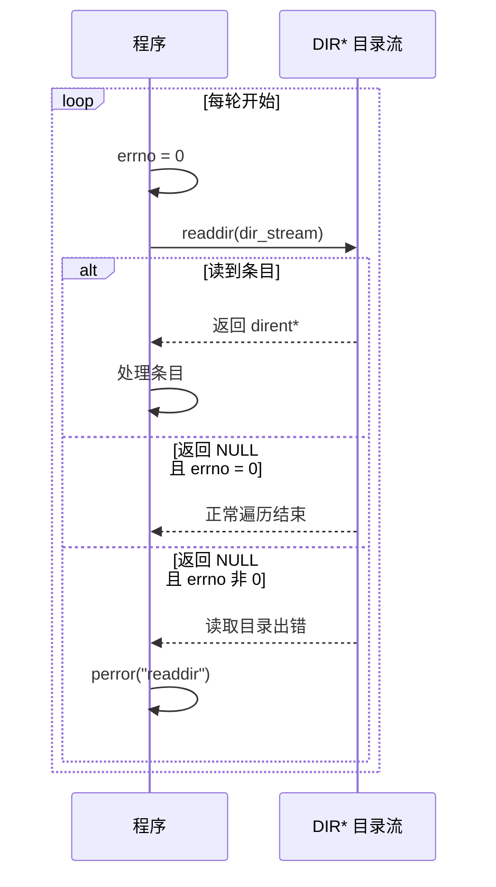
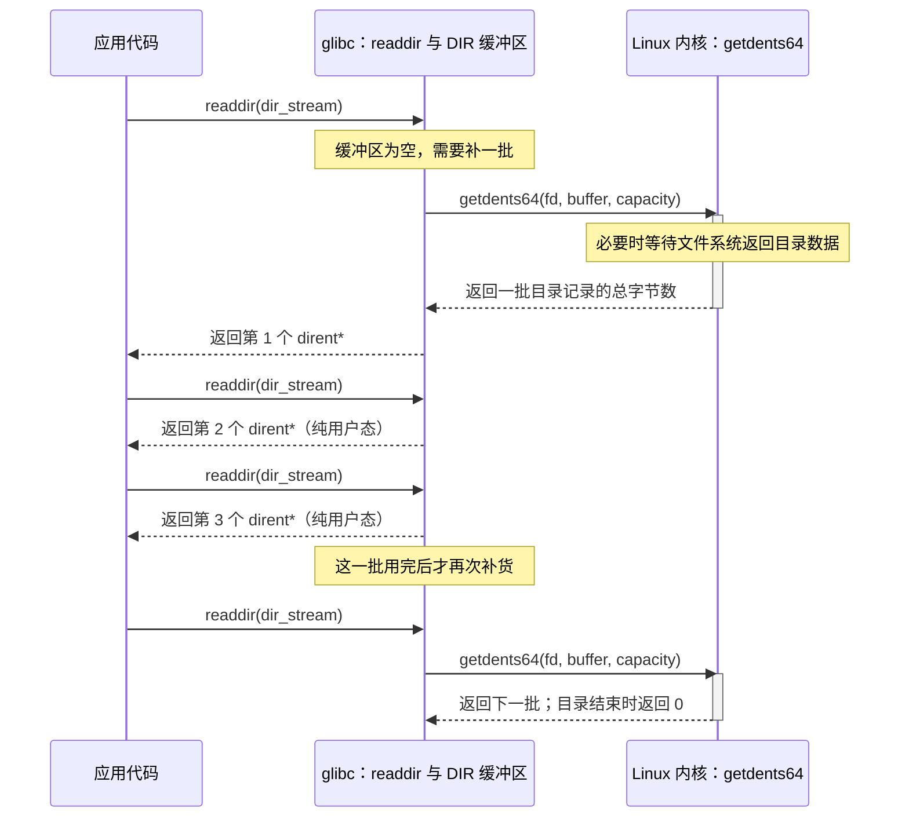
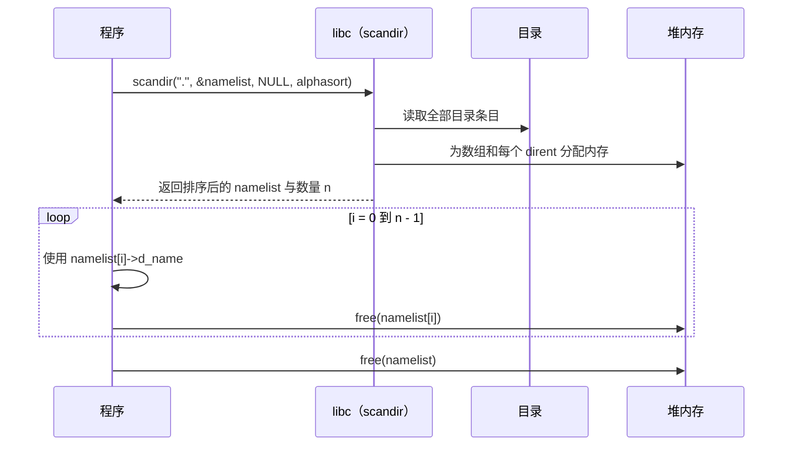
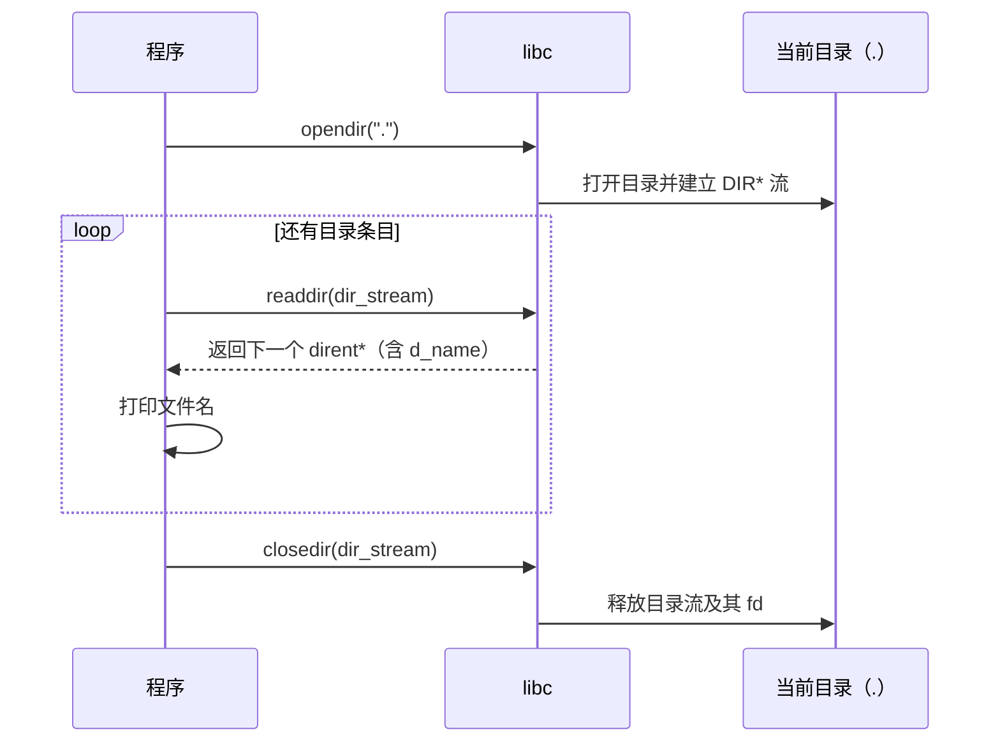
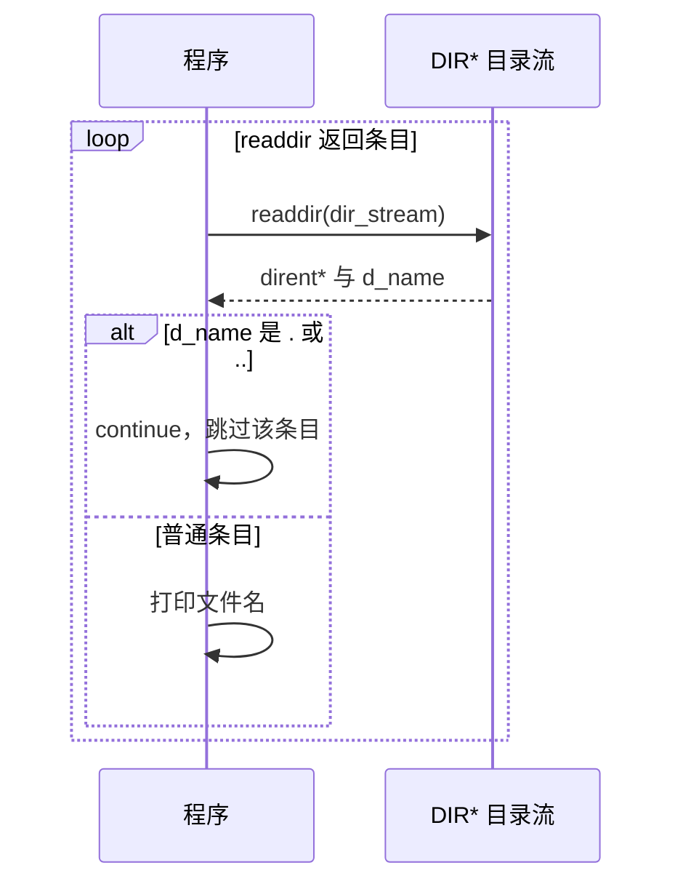
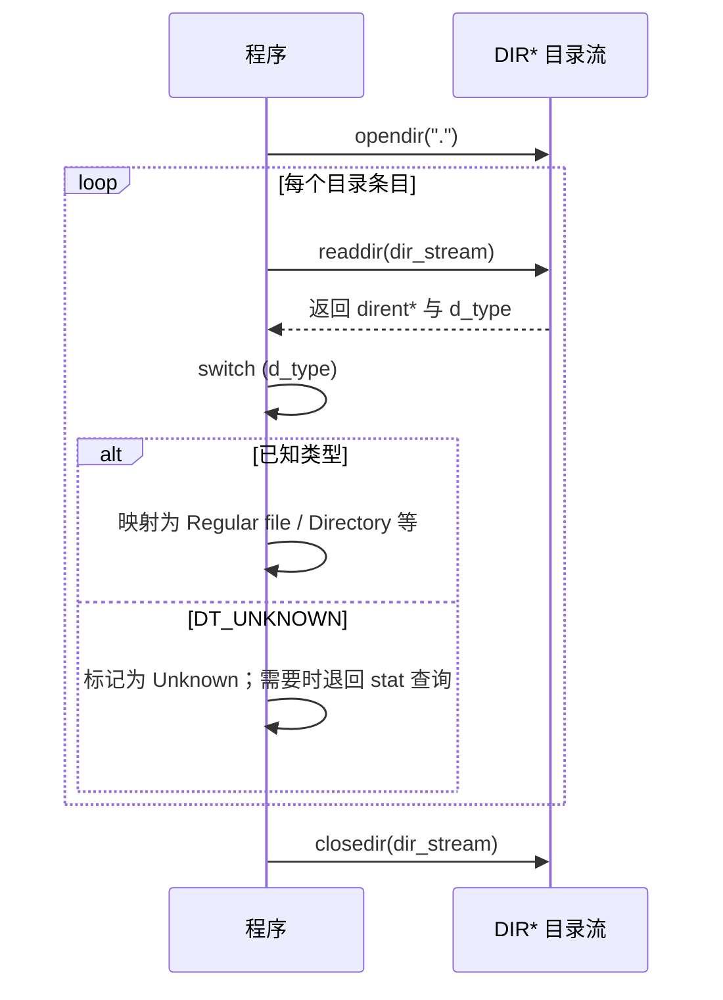
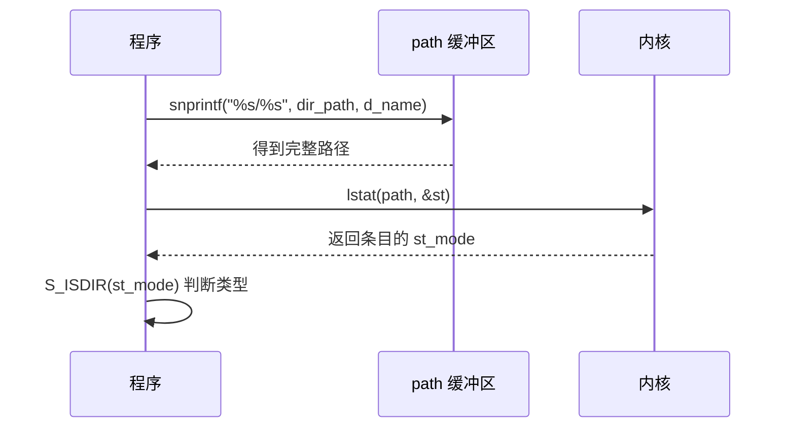
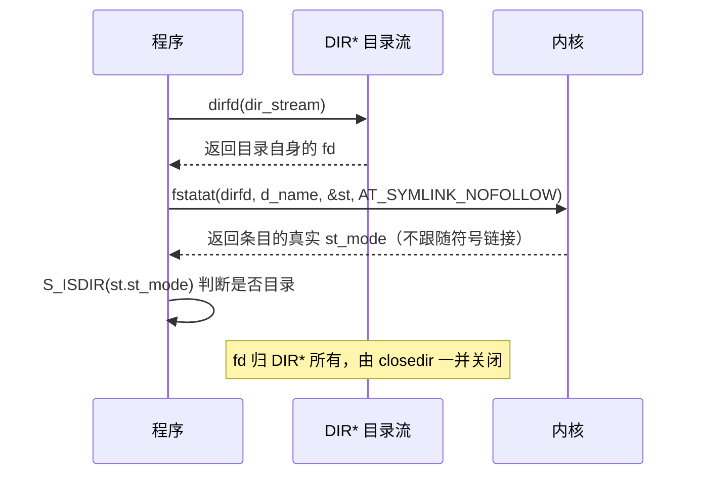

---
tags:
  - Linux
  - 文件与目录函数
阅读次数: 0
---

# 6.9 操作目录

本节介绍 Linux 系统中用于遍历目录的函数：`opendir()`、`readdir()` 和 `closedir()`。三者的关系和文件操作一一对应：打开得到一个目录流 `DIR*`，循环调用 `readdir()` 逐条取出目录条目（每条是一个 `struct dirent`），用完关闭。

---

## 1. dirent 结构体

`dirent` 是一个 C 语言中的结构体（struct），它在 Linux 系统中用于表示目录中的一个文件或子目录。

`dirent` 结构体通常在 `<dirent.h>` 头文件中定义，它的主要成员如下：

```c
struct dirent {
    ino_t          d_ino;       // 文件的 inode 编号
    off_t          d_off;       // 目录中下一个条目的偏移量
    unsigned short d_reclen;    // 目录条目的长度
    unsigned char  d_type;      // 文件类型（如目录、普通文件、符号链接等）
    char           d_name[256]; // 文件名
};
```

### 1.1 d_type 文件类型常量

| 常量 | 说明 |
|------|------|
| `DT_BLK` | 块设备 |
| `DT_CHR` | 字符设备 |
| `DT_DIR` | 目录 |
| `DT_LNK` | 软链接 |
| `DT_FIFO` | 管道 |
| `DT_REG` | 普通文件 |
| `DT_SOCK` | 套接字文件 |
| `DT_UNKNOWN` | 未知 |

### 1.2 dirent 的作用

在实际使用中，我们最常使用的就是 `d_name` 成员，它包含了目录条目的名称。

`dirent` 结构体是连接底层文件系统信息和 C 语言程序的重要桥梁。它的主要作用是封装目录条目的元数据，使得程序可以轻松地访问和处理目录中的每一个文件或子目录。

---

## 2. opendir() - 打开目录

`opendir()` 函数用于打开一个目录流，这就像打开一个文件一样，你需要先告诉操作系统你想访问哪个目录。

### 2.1 函数原型

```c
#include <sys/types.h>
#include <dirent.h>

DIR *opendir(const char *name);
```

### 2.2 参数说明

- **name**：要打开的目录路径名

### 2.3 返回值

- 成功：返回一个指向 `DIR` 类型的指针，这个指针代表了一个打开的目录流，如果失败，返回 `NULL`

### 2.4 DIR 类型

`DIR` 是一个不透明类型（opaque type），用于表示目录流。你不需要知道它的内部结构，只需要将它作为句柄传递给其他目录操作函数。它里面装着两样东西：一个指向该目录的文件描述符，以及一块用来放目录条目的缓冲（见下一节）。

### 2.5 opendir 要的是目录的 r 和 x

打开目录流需要两个权限位同时具备：路径解析要能穿过它（`x`），读条目要能列出名字（`r`）。少了 `r`，`opendir()` 返回 NULL 且 `errno` 为 `EACCES`，但按名字直接 `open("dir/known_file")` 照样成功——「能进不能看」的目录就是这么配出来的。目录上这三个位各管什么，见 [[6.8 设置权限#1. 权限位的结构与判定顺序|6.8 的权限位结构]]。

---

## 3. readdir() - 读取目录条目

`readdir()` 函数用于读取目录流中的下一个条目。你可以把它想象成一个迭代器，每次调用它，它都会返回一个指向下一个目录条目的指针，并自动将内部指针移动到下一个位置。

### 3.1 函数原型

```c
#include <dirent.h>

struct dirent *readdir(DIR *dir);
```

### 3.2 参数说明

- **dir**：`opendir()` 函数返回的目录流指针

### 3.3 返回值

- 成功：返回一个指向 `struct dirent` 结构体的指针，代表读到的这一个目录条目
- 没有更多条目（遍历完）：返回 `NULL`
- 失败：也返回 `NULL`，并设置 errno

### 3.4 NULL 的二义性：区分"读完了"和"出错了"

`readdir()` 用同一个 `NULL` 表示两种情况，区分方法和 [[6.6 判断错误]]里 `fgets()` 的套路类似，但这里靠 errno：**调用前把 errno 清零，返回 NULL 后检查 errno 是否还是 0**：

```c
errno = 0;
while ((dir_entry = readdir(dir_stream)) != NULL) {
    // 处理条目
    errno = 0;   // 每轮重置，防止条目处理代码污染 errno
}
if (errno != 0) {
    perror("readdir");   // NULL 是出错导致的
}
```

#### 3.4.1 执行时序



### 3.5 一次 readdir 不等于一次系统调用

> [!summary] 先记结论
> 程序调用一次 `readdir()`，只取一个目录条目；glibc 调用一次 `getdents64()`，会从内核批量取回多个目录条目。大多数 `readdir()` 只在用户态缓冲区里移动游标，不会进入内核。

> [!example] 把它想成搬箱子
> `getdents64()` 负责从仓库搬来一整箱货；`readdir()` 每次从箱子里拿出一件。箱子没空时，不需要再去仓库。

#### 3.5.1 三层关系

| 层次 | 对象或函数 | 做什么 |
|---|---|---|
| 应用代码 | `readdir(dir_stream)` | 每次向调用者交付一个 `dirent*` |
| glibc 用户态 | `DIR*` 的缓冲区和游标 | 保存一批目录条目，并记录下一条在什么位置 |
| Linux 内核 | `getdents64()` | 把一批目录条目从内核复制到 `DIR*` 的缓冲区 |

`readdir()` 是 glibc 库函数，`getdents64()` 才是真正的系统调用。应用通常不直接调用 `getdents64()`；glibc 在缓冲区用完时替应用调用。

#### 3.5.2 一批目录条目怎样被取完

假设第一次 `readdir()` 时，`DIR*` 的内部缓冲区是空的：

1. `readdir()` 发现缓冲区没有可用条目。
2. glibc 调用 `getdents64()`，一次取回一批目录条目。
3. 第一次 `readdir()` 返回这批数据里的第一个条目。后续调用依次返回第二个、第三个，直到这一批用完；这些调用都不进内核。
4. 缓冲区再次变空时，glibc 才调用下一次 `getdents64()`。
5. 最后一次 `getdents64()` 返回 0，表示目录已经读完；`readdir()` 随后返回 `NULL`。

内部逻辑可以近似理解为下面这段伪代码。`DIR` 的真实结构对应用是不透明的，这段代码只用来说明缓冲区和游标怎样配合：

```text
readdir_simplified(DIR* stream):
    if stream 的缓冲区已经用完:
        n = getdents64(stream 的 fd, stream 的缓冲区, 缓冲区容量)
        if n <= 0:
            return NULL
        把游标移回缓冲区开头

    entry = 游标指向的 dirent 记录
    游标向后移动 entry->d_reclen 字节
    return entry
```



图中第二、第三次 `readdir()` 没有通向内核的箭头，因为 glibc 直接从现有缓冲区返回条目。系统调用只出现在“缓冲区为空，需要补货”的位置。

![[图片/SVG/3_6_6_9_1.svg|1390]]

#### 3.5.3 怎样读懂 strace 输出

`strace` 可以只显示 `getdents64()`：

```bash
$ strace -e trace=getdents64 ls /usr/bin > /dev/null
getdents64(3, 0x5586ee23a0d0, 32768) = 32752
getdents64(3, 0x5586ee23a0d0, 32768) = 32760
getdents64(3, 0x5586ee23a0d0, 32768) = 0
```

这里的 `32752` 和 `32760` 是本次取回的**总字节数**，不是目录条目数量。一批数据里包含很多条变长的 `dirent` 记录，每条记录占多少字节看 `d_reclen`。三次系统调用读完了上千个条目，最后一次返回 0，表示目录已经读完。

因此，遍历一个上万条目的目录时，应用会调用上万次 `readdir()`，但系统调用次数只和“分成了多少批”有关。准确批数取决于缓冲区大小、文件名长度和每条记录的 `d_reclen`。

这一层缓冲也解释了下一节的两条限制：`readdir()` 返回的指针指向 glibc 内部缓冲，缓冲区以后会被重新填充；同一个 `DIR*` 也只有一套缓冲区和一个游标。

> [!info] 对照手册
> `readdir(3)` 说明库函数的返回值和缓冲区生命周期；`getdents(2)` 说明 Linux 内核批量返回目录记录的系统调用接口。

### 3.6 三个使用限制

前两条都是上面那块缓冲的直接后果：

- `readdir()` 返回的指针指向 glibc 内部缓冲，**下一批条目灌进来时会原地覆盖**。想留住某个条目的信息，要把 `d_name` 等字段复制出来，不能只保存指针
- 同一个 `DIR*` 上并发调用 `readdir()` 不是线程安全的——两个线程会抢同一个游标和同一块缓冲。多线程遍历的正确做法是每个线程 `opendir()` 自己的 `DIR*`（曾经的替代品 `readdir_r()` 已被 glibc 废弃，不要再用）
- `d_name` 声明成 `char d_name[256]` 有迷惑性。POSIX 不规定这个数组的大小，缓冲里的记录是**变长**的，真实长度看 `d_reclen`。不要用 `sizeof(struct dirent)` 去算一条记录占多少字节，也不要假定 `d_name` 后面一定有 256 字节可写

还有一条不来自缓冲，但同样要记：**遍历期间往目录里增删条目，行为是未定义的**。POSIX 不保证新建的条目会不会出现，也不保证已删的会不会还被返回。要边遍历边删，先把名字全收集起来，遍历结束后再动手。

### 3.7 遍历模式

`while ((dir_entry = readdir(dir_stream)) != NULL)` 是一个经典的循环模式：
- 每次循环，`readdir()` 都会返回一个指向下一个目录条目的指针
- 在循环内部，`dir_entry->d_name` 访问了目录条目的名称
- 当没有更多条目时，`readdir()` 返回 `NULL`，循环终止

---

## 4. closedir() - 关闭目录

`closedir()` 函数用于关闭一个目录流。这是在完成目录遍历后必不可少的一步，它会释放 `opendir()` 分配的所有系统资源。

### 4.1 函数原型

```c
#include <sys/types.h>
#include <dirent.h>

int closedir(DIR *dirp);
```

### 4.2 参数说明

- **dirp**：`opendir()` 函数返回的目录流指针

### 4.3 返回值

- 成功：返回 0
- 失败：返回 -1

---

## 5. 遍历顺序没有保证

`readdir()` 吐出条目的顺序既不是字母序，也不是创建顺序，而是文件系统内部的存储顺序（ext4 上是文件名哈希的 B 树序）。同一个目录换个文件系统、换个内核版本，顺序都可能变。所以那句 `ls` 看着有序，是 `ls` 自己排过，不是 `readdir` 给的。

依赖顺序的代码要自己排。要么收齐之后 `qsort`，要么直接用 `scandir()`：

```c
#include <dirent.h>
#include <stdlib.h>

struct dirent **namelist;
int n = scandir(".", &namelist, NULL, alphasort);
if (n < 0) {
    perror("scandir");
    return 1;
}

for (int i = 0; i < n; i++) {
    printf("%s\n", namelist[i]->d_name);
    free(namelist[i]);      // 每条都是单独 malloc 出来的
}
free(namelist);             // 数组本身也要释放
```

#### 5.0.1 执行时序



`scandir()` 一次读完整个目录、按 `filter` 过滤（传 NULL 表示全要）、按 `compar` 排序，结果是一个 `malloc` 出来的数组。条目之间互不覆盖，可以随便留着用——这一点正好补上了 `readdir()` 的短板。代价是整个目录都进内存，目录特别大时不合适。`alphasort` 是 libc 提供的按名字比较的函数，另有 `versionsort` 按版本号风格排（`a10` 排在 `a9` 后面）。

---

## 6. 示例代码

```c
#include <stdio.h>
#include <stdlib.h>
#include <dirent.h>

int main() {
    DIR *dir_stream;
    struct dirent *dir_entry;
    const char *dir_path = ".";  // . 代表当前目录

    // 1. 使用 opendir() 打开目录流
    dir_stream = opendir(dir_path);
    if (dir_stream == NULL) {
        perror("opendir");
        return 1;
    }

    printf("Listing contents of directory: %s\n", dir_path);
    printf("------------------------------------------\n");

    // 2. 使用 readdir() 循环读取目录中的每一个条目
    while ((dir_entry = readdir(dir_stream)) != NULL) {
        // dir_entry->d_name 包含了文件名
        printf("%s\n", dir_entry->d_name);
    }

    printf("------------------------------------------\n");

    // 3. 使用 closedir() 关闭目录流
    closedir(dir_stream);

    return 0;
}
```

### 6.1 执行时序



### 6.2 编译运行

```bash
gcc -o list_dir list_dir.c
./list_dir
```

### 6.3 运行结果示例

```
Listing contents of directory: .
------------------------------------------
.
..
a_file.txt
list_dir.c
------------------------------------------
```

### 6.4 分步解读

1. **打开目录**：`opendir(".")` 尝试打开当前目录。如果成功，`dir_stream` 将包含一个有效的目录流指针
2. **循环读取**：`while ((dir_entry = readdir(dir_stream)) != NULL)` 是一个经典的循环模式。每次循环，`readdir()` 都会返回一个指向下一个目录条目的指针。当没有更多条目时，`readdir()` 返回 `NULL`，循环终止
3. **关闭目录**：`closedir(dir_stream)` 关闭目录流，释放系统资源

### 6.5 关于 `.` 和 `..`

在输出中你会注意到 `.`（当前目录）和 `..`（父目录）。这是 Linux 文件系统中的两个特殊条目：
- `.` 代表当前目录本身
- `..` 代表当前目录的父目录

在遍历目录时，如果不需要处理这两个特殊条目，可以添加过滤逻辑：

```c
while ((dir_entry = readdir(dir_stream)) != NULL) {
    // 跳过 . 和 ..
    if (strcmp(dir_entry->d_name, ".") == 0 ||
        strcmp(dir_entry->d_name, "..") == 0) {
        continue;
    }
    printf("%s\n", dir_entry->d_name);
}
```

#### 6.5.1 执行时序



---

## 7. 进阶：获取文件类型

可以使用 `d_type` 字段来判断文件类型。但要注意：**`d_type` 不保证有效**。它是 Linux 的扩展字段，取决于底层文件系统是否在目录项里存了类型信息；ext4 通常有，某些文件系统或挂载配置下会拿到 `DT_UNKNOWN`。严谨的代码要在 `d_type == DT_UNKNOWN` 时退回 `stat()`/`lstat()` 查询真实类型（这正是下面 switch 里 default 分支存在的原因）：

```c
#include <stdio.h>
#include <stdlib.h>
#include <dirent.h>
#include <string.h>

int main() {
    DIR *dir_stream;
    struct dirent *dir_entry;
    const char *dir_path = ".";

    dir_stream = opendir(dir_path);
    if (dir_stream == NULL) {
        perror("opendir");
        return 1;
    }

    printf("%-30s %s\n", "Name", "Type");
    printf("------------------------------------------\n");

    while ((dir_entry = readdir(dir_stream)) != NULL) {
        const char *type_str;

        switch (dir_entry->d_type) {
            case DT_REG:  type_str = "Regular file"; break;
            case DT_DIR:  type_str = "Directory";    break;
            case DT_LNK:  type_str = "Symlink";      break;
            case DT_FIFO: type_str = "FIFO/Pipe";    break;
            case DT_SOCK: type_str = "Socket";       break;
            case DT_CHR:  type_str = "Char device";  break;
            case DT_BLK:  type_str = "Block device"; break;
            default:      type_str = "Unknown";      break;
        }

        printf("%-30s %s\n", dir_entry->d_name, type_str);
    }

    closedir(dir_stream);
    return 0;
}
```

### 7.1 执行时序



### 7.2 DT_UNKNOWN 时怎么退回 stat

上面 `default` 分支说要退回 `stat()`，但有个坑必须先说清楚：**`d_name` 里只有名字，不含路径**。直接写 `stat(dir_entry->d_name, &st)` 是错的——它相对的是**当前工作目录**，不是正在遍历的那个目录。遍历 `.` 时碰巧能跑通，换成遍历 `/etc` 就全军覆没。

两个办法。第一个是自己拼完整路径：

```c
char path[PATH_MAX];
snprintf(path, sizeof(path), "%s/%s", dir_path, dir_entry->d_name);

struct stat st;
if (lstat(path, &st) == 0 && S_ISDIR(st.st_mode)) {
    // 是目录
}
```

#### 7.2.1 执行时序



第二个是用 `dirfd()` 取出目录流底下的那个 fd，配 `fstatat()`：

```c
struct stat st;
if (fstatat(dirfd(dir_stream), dir_entry->d_name,
            &st, AT_SYMLINK_NOFOLLOW) == 0 && S_ISDIR(st.st_mode)) {
    // 是目录
}
```

#### 7.2.2 执行时序



第二种更好：不用操心路径长度，也不受遍历期间上层目录被改名的影响，理由和 [[6.8 设置权限#3.5 为什么使用 fchmodat？|fchmodat 相对目录 fd 操作]]完全一样。`AT_SYMLINK_NOFOLLOW` 对应 `lstat` 的语义，即看链接本身而不是它指向的文件。

注意 `dirfd()` 返回的 fd 归 `DIR*` 所有，`closedir()` 会把它一起关掉，不要自己 `close()`。

> [!tip] 递归遍历不要手写
> 手写 readdir 递归要自己处理符号链接成环、目录深度超限、fd 耗尽、路径超过 `PATH_MAX` 这几件事。标准库已经给了 `nftw()`（POSIX），BSD 系还有 `fts` 系列，优先用它们。

---

## 8. 与其他函数的关系

| 函数 | 作用 | 类比 |
|------|------|------|
| `opendir()` | 打开目录流 | 类似于 [[6.1 基本文件函数#2. fopen() - 打开文件\|fopen()]] |
| `readdir()` | 读取目录条目 | 类似于 [[6.3 读取文件\|fread()]] |
| `closedir()` | 关闭目录流 | 类似于 [[6.1 基本文件函数#3. fclose() - 关闭文件\|fclose()]] |

---

## 9. 关键要点

- **opendir()**：打开目录，返回 `DIR*` 指针
- **readdir()**：读取下一个目录条目，返回 `struct dirent*`；返回 NULL 时用"errno 先清零再检查"区分读完和出错
- **closedir()**：关闭目录流，释放资源，并关掉 `dirfd()` 那个 fd
- **一次 readdir 通常不进内核**：`getdents64()` 一次灌一批进 `DIR` 的内部缓冲，`readdir` 多数时候只是在缓冲里挪游标
- `dirent` 结构体的 `d_name` 成员包含文件名；返回的指针在下一批灌进来时被原地覆盖，要留信息先复制
- 记录是**变长**的，长度看 `d_reclen`，不要用 `sizeof(struct dirent)` 推算
- `d_type` 成员可用于判断文件类型，但可能是 `DT_UNKNOWN`，此时用 `fstatat(dirfd(dir), d_name, ...)` 退回查询；**不要直接 `stat(d_name)`**，那是相对当前工作目录的
- **遍历顺序没有保证**，既不是字母序也不是创建序；要有序用 `scandir()` 配 `alphasort`
- 遍历期间增删条目行为未定义；`opendir` 需要目录的 `r` 和 `x` 两个权限位
- 遍历目录时注意处理 `.` 和 `..` 特殊条目
- 多线程遍历：每个线程用自己的 `DIR*`，不共享
- 递归遍历用 `nftw()`，别手写
