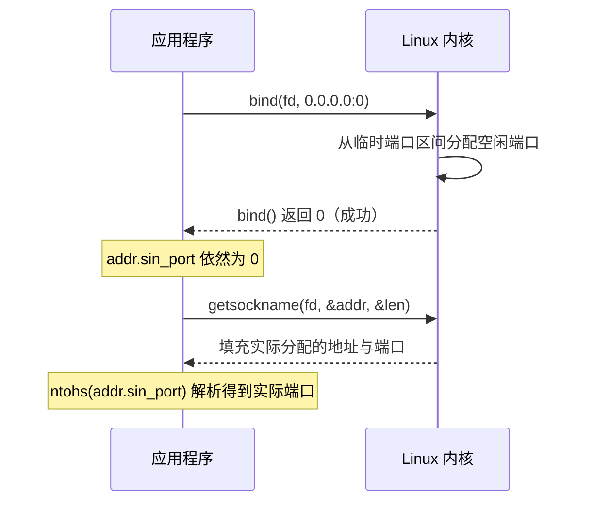

---
tags:
  - Linux
  - 网络编程基础
阅读次数: 0
---

# 7.3 端口与五元组

## 1. 端口解决的问题

数据包经由物理网络到达主机后，[[1.2 IP地址与CIDR|IP 地址]] 仅负责把数据包路由到目标机器。主机内部通常并发运行着多个网络程序（例如 Web 服务、SSH 守护进程、数据库），内核需要一套机制把收到的数据精准分发到对应的套接字。

传输层协议（TCP、UDP）在报头中定义了**端口号**（Port）。它是一个 16 位无符号整数，取值范围为 0 到 65535。TCP 与 UDP 报头各有 2 字节源端口和 2 字节目的端口字段。数据包进入内核后，协议栈依据目标 IP 确认本机接收，再根据目的端口号投递给绑定的套接字，这一过程称为**分用**（demultiplexing）；应用层进程发送数据时，内核依次为各套接字封装端口号与传输层报头，称为**复用**（multiplexing）。

端口并非连接独占的排他资源。单台服务器监听 80 端口，可同时维持数万条并发 TCP 连接，核心机制在于内核依据五元组区分连接。

---

## 2. 端口号空间划分

IANA 将 0 到 65535 划分为三个区间。工程排查中最容易产生端口冲突的，是内核在发起出站连接时自动选择的临时端口。

![[图片/SVG/3_7_7_3_1.svg|1390]]

### 2.1 知名端口（0 – 1023）

由 IANA 统一分配给常用网络服务，全局标准化。客户端发起访问时无需额外指定即可按默认约定连接对应端口。

| 端口号 | 服务 | 说明 |
|:---:|:---|:---|
| 20/21 | FTP | 20 传输数据，21 传输控制指令 |
| 22 | SSH | 安全外壳协议 |
| 23 | Telnet | 明文远程终端，不推荐在生产使用 |
| 25 | SMTP | 邮件服务器投递（客户端提交常用 587） |
| 53 | DNS | 域名解析，支持 UDP 与 TCP |
| 80 | HTTP | 超文本传输协议 |
| 110 | POP3 | 邮件拉取，客户端拉取后通常从服务端删除 |
| 143 | IMAP | 邮件同步，邮件保留在服务端 |
| 443 | HTTPS | 走 TLS 加密的 HTTP |

在 Linux 系统中，绑定 0 到 1023 范围内的端口需要 root 权限，或给进程可执行文件赋予 `CAP_NET_BIND_SERVICE` 能力。生产环境通常使用权能机制，让服务以非特权普通用户身份运行，仅授予绑定特权端口的能力：

```bash
# 为二进制文件授予绑定特权端口能力，之后普通用户亦可监听 80 端口
sudo setcap 'cap_net_bind_service=+ep' /usr/local/bin/myserver
```

### 2.2 注册端口（1024 – 49151）

用于向 IANA 登记的特定第三方服务，避免不同软件之间默认端口冲突。

| 端口号 | 服务 |
|:---:|:---|
| 3306 | MySQL |
| 5432 | PostgreSQL |
| 6379 | Redis |
| 8080 | HTTP 代理 / 备用 Web 服务 |
| 27017 | MongoDB |

### 2.3 动态端口与临时端口（Ephemeral Port）

当客户端调用 `connect()` 主动发起连接且未显式调用 `bind()` 时，内核会从动态端口区间中自动选取一个未占用的本地端口作为**源端口**，使对端能够正确响应回包。

IANA 规范推荐的动态端口区间为 49152 – 65535，但 Linux 内核的默认配置与规范并不一致：

```bash
$ sysctl net.ipv4.ip_local_port_range
net.ipv4.ip_local_port_range = 32768	60999
```

默认区间 32768 到 60999 覆盖了相当大一部分 IANA 注册端口范围。若在排查连接异常或端口冲突时直接假设端口按 49152 分割，容易得出错误推论。实际运行环境中应以系统 `sysctl` 输出的真实范围为准。

---

## 3. 连接复用与五元组

单个服务端端口可以同时处理多条连接，因为传输层连接在内核中不是单纯依靠本地端口区分的。

内核使用**五元组**唯一定位一条 TCP 连接：

```
{传输协议, 源 IP, 源端口, 目的 IP, 目的端口}
```

五个字段完全一致才属于同一条连接；只要其中任意一个字段不同，内核就会将其视为独立的连接。

![[图片/SVG/3_7_7_3_2.svg|1390]]

拆解连接共存的具体场景：

- 同一客户端发起的不同连接：源 IP 相同，但每次发起连接分配的源端口不同，对应不同的已连接套接字（`connfd`）。
- 不同客户端源端口重叠：两台客户端源端口恰好都是 51514，但因源 IP 不同，五元组依然完全隔离。
- 协议间端口独立：TCP 与 UDP 的端口空间在内核协议栈中各自独立管理。`TCP:80` 与 `UDP:80` 可分别由不同进程独立绑定与监听。

这也体现了监听套接字与已连接套接字的职责分工：`listenfd` 仅指定本地 IP 与本地端口，远端 IP 与远端端口为通配符，专门用于三次握手建连；`accept()` 返回的 `connfd` 则持有包含对端地址的完整五元组，专门负责该连接后续的数据收发。细节见 [[3.3 listen和accept函数]]。

### 3.1 单机并发连接上限的实际瓶颈

「65535 个端口」对客户端与服务端两端的限制机制完全不同：

**客户端主动建连的瓶颈**：向同一个目标（固定目的 IP 与目的端口）发起连接时，协议、源 IP、目的 IP、目的端口均固定，唯一可变的是本地源端口。因此最大并发连接数受限于临时端口范围的大小：

```
60999 − 32768 + 1 = 28232 条
```

压测机单节点建连受阻时，首要排查项是客户端源端口是否耗尽。只要改变目的 IP（例如为服务端增加辅助 IP）或增加目的监听端口，五元组组合数便会成倍扩容。

**服务端被动接收的瓶颈**：服务端仅占用 1 个本地监听端口，对端客户端的 IP 与端口组合极其庞大，不会受 65535 端口数量的约束。服务端的主要物理瓶颈在于：进程与系统的文件描述符上限（`ulimit -n` 与 `/proc/sys/fs/nr_open`），以及维持每个连接的套接字读写缓冲区所消耗的内核内存。

---

## 4. 服务端端口规划与分配

服务监听端口应尽量避开内核临时端口分配范围（`32768 – 60999`）。若服务端口配置在该区间内，一旦本机发起的外发请求先一步被内核随机分配到了该端口，服务在启动或重启时调用 `bind()` 便会抛出 `EADDRINUSE` 错误。这类冲突随网络外发流量随机发生，排查难度较高。

规避冲突的常用策略：

1. **端口选在 1024 – 32767**：无需特权用户，同时完全避开默认的临时端口分配段。
2. **调窄 `ip_local_port_range`**：缩小临时端口范围，预留出服务所需的高位端口。
3. **设置 `ip_local_reserved_ports` 显式预留**：指定内核分配临时端口时跳过特定端口或端口段。该设置仅作用于后续的临时端口分配，不影响现有连接，支持在线热配置。

```bash
# 让内核分配临时端口时避开 50000 以及 60000 到 60010
sudo sysctl -w net.ipv4.ip_local_reserved_ports="50000,60000-60010"
```

### 4.1 动态端口分配：bind 端口 0

若服务端无需固定端口（例如自动化测试中的临时服务或 RPC 动态注册），可向内核请求分配可用端口：将绑定的端口设为 0。

```c
struct sockaddr_in addr{};
addr.sin_family = AF_INET;
addr.sin_addr.s_addr = htonl(INADDR_ANY);
addr.sin_port = htons(0);            // 端口设为 0，由内核分配一个可用端口

bind(fd, reinterpret_cast<sockaddr*>(&addr), sizeof(addr));

// bind 不会修改原结构体，需通过 getsockname 读取实际分配的端口
socklen_t len = sizeof(addr);
getsockname(fd, reinterpret_cast<sockaddr*>(&addr), &len);
int port = ntohs(addr.sin_port);     // 内核实际分配的端口号
```



调用 `bind()` 时内核会从临时端口区间选择一个空闲端口，但不会把该端口写回传入的入参结构体。必须紧随其后调用 `getsockname()`，才能从内核读出实际生效的端口号。

---

## 5. bind 失败的常见成因

`bind()` 返回 `EADDRINUSE` 表示目标本地地址已被占用，主要对应三类排查场景：

| 现象 | 产生原因 | 处理方式 |
|:---|:---|:---|
| 服务刚终止，立刻重启绑定失败 | 前序连接处于 [[2.6 TIME_WAIT状态|TIME_WAIT]] 状态，需等待 2MSL 超时 | 在 `bind()` 前开启 `SO_REUSEADDR` 套接字选项 |
| 端口被其他进程长期占用 | 其他后台程序已在监听同一端口 | 使用 `ss -tlnp` 定位进程，调整端口或停止冲突服务 |
| 偶发性启动失败，重启后复现 | 冲突端口被本机出站连接临时占用 | 调整监听端口或配置 `ip_local_reserved_ports` |

其中由于未设置重用选项导致的失败最为多见。`SO_REUSEADDR` 允许套接字绑定处于 `TIME_WAIT` 状态的本地地址与端口，是网络服务端程序启动时的标准配置，必须在 `bind()` 之前设置生效：

```c
int on = 1;
setsockopt(fd, SOL_SOCKET, SO_REUSEADDR, &on, sizeof(on));  // 必须置于 bind 之前
bind(fd, reinterpret_cast<sockaddr*>(&addr), sizeof(addr));
```

与之名称相近的选项 `SO_REUSEPORT`（Linux 3.9+ 引入）允许多个进程或线程的套接字绑定完全相同的 IP 与端口，由内核根据连接四元组哈希自动做入站负载均衡，解决的是多进程监听时的惊群与并发分发问题，两者语义不同。详细对比见 [[3.2 套接字选项]]。

---

## 6. 查看端口占用情况

```bash
# 列出所有 TCP 监听套接字（-t: TCP, -l: LISTEN, -n: 数字显示, -p: 显示进程信息）
ss -tlnp

# 过滤指定监听端口
ss -tlnp 'sport = :8080'

# 统计特定端口上的总连接数（包括已建立的连接）
ss -tan 'sport = :80' | wc -l

# 查看占用特定端口的进程与打开的文件描述符
sudo lsof -i :80
```

排查细节说明：

- `ss` 查询效率显著高于已淘汰的 `netstat`。`netstat` 依赖遍历并解析 `/proc/net/tcp`，在系统连接数庞大时容易产生明显延迟；`ss` 通过 Netlink 套接字直接向内核查询状态，开销更低。
- 查看进程信息（`-p`）需要充足权限。以普通用户权限执行时，属于其他用户的套接字对应的进程字段将显示为空，排查时需注意避免误判为无进程监听。
- 建议始终添加 `-n` 参数。不加 `-n` 会尝试将端口号解析为对应协议名称（如把 80 显示为 `http`），并对 IP 触发反向 DNS 解析，既拖慢命令返回速度，也不利于日志与脚本匹配。

---

## 7. 传输层与协议交互常见疑难

### 7.1 网络字节序转换与字段差异

#### 端口号与 IP 地址在 API 中的类型映射
BSD 套接字 API 针对 32 位系统设计时，使用 `short` 与 `long` 分别区分端口与 IPv4 地址的大小：
- `short`（16 位无符号整数，对应 `uint16_t`）：对应端口号（0 – 65535）。
- `long`（32 位无符号整数，对应 `uint32_t`）：对应 IPv4 地址（4 字节）。

```c
uint16_t htons(uint16_t hostshort); // 主机序转网络序（端口号，16 位）
uint16_t ntohs(uint16_t netshort);  // 网络序转主机序（端口号，16 位）
uint32_t htonl(uint32_t hostlong);  // 主机序转网络序（IPv4 地址，32 位）
uint32_t ntohl(uint32_t netlong);   // 网络序转主机序（IPv4 地址，32 位）
```

#### 字节序错位的影响
x86 与常见 ARM 架构在内存中采用小端字节序（低字节存放在低地址），而 TCP/IP 协议族强制采用大端字节序（高字节存放在低地址）。

以端口 8080（十六进制 `0x1F90`）为例：在小端机器内存中，字节依次排布为 `0x90`、`0x1F`。如果未通过 `htons()` 转换而直接传入套接字结构体，内核将该内存镜像原封不动写入 TCP 报头。对端收到报文按网络大端序解析时，会将其解释为 `0x901F`（十进制 36895），导致服务监听与对端连接的端口完全不一致。

#### 为什么 `sin_family` 不需要转换字节序
结构体 `sockaddr_in` 中，`sin_port` 与 `sin_addr` 必须调用转换函数，而 `sin_family` 却保持主机原生字节序。其原因在于字段的消费位置不同：
- `sin_family` 仅作为系统调用（如 `bind`、`connect`）的本地入参传给本机操作系统内核，内核借此识别地址结构体类型（`AF_INET`、`AF_INET6` 或 `AF_UNIX`），该字段不会被封装到任何外发的网络数据包中。
- `sin_port` 与 `sin_addr` 则会被内核协议栈直接复制进 TCP 报头与 IP 报头中，通过物理网络发送给远端主机，因此必须保证符合网络大端规范。

---

### 7.2 网卡硬件过滤与广播风暴

![[图片/SVG/3_7_7_3_3.svg|1390]]

#### 网卡硬件过滤与 CPU 开销差异
- **单播帧**：网卡控制器芯片（ASIC）接收到数据帧后，在硬件电路上比对目的 MAC 地址。只要目的 MAC 非本机地址且网卡未处于混杂模式，数据帧直接在网卡硬件层被丢弃，不向 CPU 发起中断，消耗零 CPU 周期。
- **广播帧（`ff:ff:ff:ff:ff:ff`）**：网卡硬件判定广播为全网必收帧，必须触发硬件中断（IRQ），并通过 DMA 将报文拷贝到主机内存，通知内核网络栈处理。
- 当局域网内存在巨量广播流量时，网段内所有主机的 CPU 都会被迫频繁处理中断与报文解析，从而引发系统卡顿甚至瘫痪。

#### 广播风暴的成因
以太网二层帧头部没有类似 IP 层的 TTL（生存时间）字段。如果局域网拓扑中存在二层物理环路，交换机的广播泛洪机制（向除接收端口外的所有端口转发广播帧）会导致广播报文在环路中无限循环转发与指数级复制，瞬间耗尽物理链路带宽。

#### 交换机与网络层防御手段
1. **生成树协议（STP / RSTP）**：交换机之间交互 BPDU 报文检测网络拓扑环路，逻辑上主动阻塞冗余端口，消除物理环路。
2. **虚拟局域网（VLAN）**：将单一物理局域网划分为多个隔离的二层广播域，广播帧被限制在所属 VLAN 内部，不会跨 VLAN 泛洪。
3. **风暴控制（Storm Control）**：交换机端口芯片对进入的广播报文按包速率（pps）实行硬性阈值限速，超出限制的广播报文直接在端口丢弃，避免突发广播扩散。

---

### 7.3 子网划分与广播地址计算

根据 CIDR 计算网络号与广播地址时，关键在于由主机位数确定子网块大小（Block Size）。

以 `10.20.30.70/28` 为例：

1. **子网掩码**：前 28 位为 1，对应点分十进制 `255.255.255.240`。
2. **主机位与子网块大小**：
   - 主机位数 $h = 32 - 28 = 4$ 位。
   - 子网块步长为 $2^h = 2^4 = 16$ 个地址。
   - 末字节按 16 递增划分子网区间：`0~15`、`16~31`、`32~47`、`48~63`、`64~79`…… 目标 IP 尾数 70 落在 `64~79` 区间内。
3. **网络号（起始地址）**：主机位全为 0，即所在子网区间的起始地址 `10.20.30.64`。
4. **广播地址（末尾地址）**：主机位全为 1（4 位二进制全 1 即 $2^4 - 1 = 15$），广播地址为网络号基准加上 15，得到 `10.20.30.79`。
5. **可用主机地址数量**：扣除网络号与广播地址后，可用地址数为 $2^h - 2 = 14$ 个（范围为 `10.20.30.65` 至 `10.20.30.78`）。

计算公式总结：
- 广播地址 = 网络号 + $(2^{32-n} - 1)$
- 有效主机数 = $2^{32-n} - 2$

---

## 8. 关键要点

1. **端口是传输层报头中的 16 位整数**，作用是供内核将数据包分用至对应的套接字。
2. **端口不是连接的独占资源**。内核使用五元组识别连接，单端口可维持海量并发连接；客户端受本地临时端口数限制，服务端瓶颈主要在于系统文件描述符与内存。
3. **网络字节序为大端序**。写入数据报头的 `sin_port`（16 位）与 `sin_addr`（32 位）必须显式转换；本地内核专用的 `sin_family` 无需转换。
4. **TCP 与 UDP 端口空间相互独立**，同一端口号可在两协议下由不同进程分别监听。
5. **Linux 默认临时端口范围为 32768 – 60999**，常规服务建议选择 1024 – 32767，避免与出站连接端口产生偶发冲突。
6. **绑定 1024 以下端口需特权**，生产中推荐使用 `setcap` 授予 `CAP_NET_BIND_SERVICE` 替代直接使用 root 运行服务。
7. **`EADDRINUSE` 常见于 TIME_WAIT 状态**，服务端启动时在 `bind()` 前配置 `SO_REUSEADDR` 是标准做法。
8. **二层数据帧缺乏 TTL 字段**，网卡硬件对广播报文无法直接丢弃而会唤醒 CPU 中断，需依赖 STP、VLAN 与风暴控制抵御广播风暴。
9. **CIDR 计算以主机位为核心**：掩码 `/n` 对应块步长 $2^{32-n}$，广播地址为网络号基准加上 $2^{32-n} - 1$，可用主机数减 2。

---
