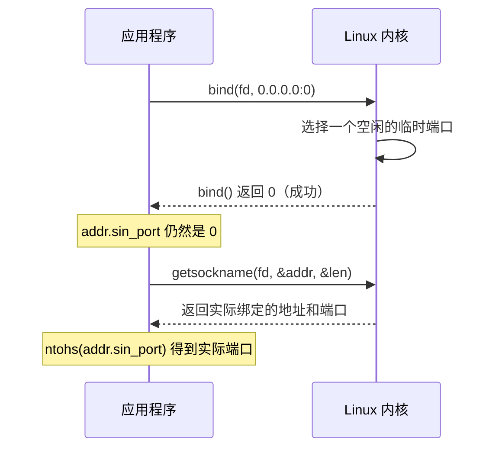

---
tags:
  - Linux
  - 网络编程基础
阅读次数: 0
---

# 7.3 端口与五元组

## 1. 端口解决的是什么问题

一个数据包到达网卡时，[[7.2 IP地址与CIDR|IP 地址]] 只能把它送到**这台机器**。但机器上同时跑着浏览器、SSH 客户端、数据库、游戏进程，内核凭什么知道这个包该交给谁？

端口就是答案。它是传输层头部里的一个 **16 位无符号整数**（TCP 和 UDP 头里各有源端口和目的端口两个字段，各占 2 字节），取值 0 到 65535。内核收到包后，先按 IP 送到本机，再按端口把它投递给对应的套接字。这个过程叫**分用**（demultiplexing）。

「IP 是楼号、端口是房间号」这个比喻能用，只有一处是假的：房间号是独占的，端口不是。五元组那节讲为什么。

---

## 2. 端口号空间怎么划分

IANA 把 0 到 65535 分成三段，但那是规范上的分法。实际会跟你抢端口的，是**内核的临时端口范围**，它的边界和规范对不上。

![[图片/SVG/3_7_7_3_1.svg|1390]]

### 2.1 知名端口（0 – 1023）

由 IANA 统一分配给常用服务，全球一致，所以客户端不用配置就知道该连哪个端口。

| 端口号 | 服务 | 说明 |
|:---:|:---|:---|
| 20/21 | FTP | 20 传数据，21 传控制命令 |
| 22 | SSH | 安全外壳协议 |
| 23 | Telnet | 明文远程登录，已不建议使用 |
| 25 | SMTP | 邮件服务器之间投递（客户端提交用 587） |
| 53 | DNS | 域名解析，UDP 和 TCP 都用 |
| 80 | HTTP | 超文本传输协议 |
| 110 | POP3 | 客户端收信，收完即从服务器删除 |
| 143 | IMAP | 客户端收信，邮件保留在服务器 |
| 443 | HTTPS | 走 TLS 的 HTTP |

在 Linux 上绑定这一段需要 root 权限，或者给进程加上 `CAP_NET_BIND_SERVICE` 能力。生产环境的常见做法是后者：让服务以普通用户运行，只授予绑定低端口的能力，不必整个进程跑在 root 下。

```bash
# 给二进制授予绑定特权端口的能力，之后普通用户也能监听 80
sudo setcap 'cap_net_bind_service=+ep' /usr/local/bin/myserver
```

### 2.2 注册端口（1024 – 49151）

给非标准但广为人知的服务用。开发者可以向 IANA 登记，避免和别人撞车。

| 端口号 | 服务 |
|:---:|:---|
| 3306 | MySQL |
| 5432 | PostgreSQL |
| 6379 | Redis |
| 8080 | HTTP 代理 / 备用 Web 服务 |
| 27017 | MongoDB |

### 2.3 动态端口 / 临时端口（ephemeral port）

客户端调用 `connect()` 时并不指定自己用哪个端口，内核会从一个预设范围里挑一个空闲的作为**源端口**，这样对端才知道回包该发到哪里。

IANA 规定这个范围是 49152 – 65535，但 **Linux 的默认值不是这个**：

```bash
$ sysctl net.ipv4.ip_local_port_range
net.ipv4.ip_local_port_range = 32768	60999
```

32768 到 60999 这一段，起点落在 IANA 的「注册端口」区间内，终点又没到 65535。内核会随机占用大量本该属于注册端口的号码，61000 以上反倒安全。排查端口冲突时，照抄规范里的 49152 会得出错误结论，要以本机 `sysctl` 的实际输出为准（容器镜像和云主机的默认值经常被改过）。

---

## 3. 一个端口能被多少条连接用：五元组

「端口是房间号」这个比喻在这里失效了。一台 Web 服务器只监听 80 一个端口，却能同时服务上万条连接，说明端口并没有被某条连接独占。

内核区分连接靠的是**五元组**：

```
（协议, 源 IP, 源端口, 目的 IP, 目的端口）
```

五个字段全部相同才算同一条连接，只要有一个不同就是两条互不干扰的连接。

![[图片/SVG/3_7_7_3_2.svg|1390]]

图里的表把这件事拆开了看：

- 第 2、3 行来自同一台客户机（源 IP 相同），只有源端口不同，内核照样分给两个不同的 `connfd`。
- 第 3、4 行的源端口撞在一起（都是 51514），但源 IP 不同，同样不冲突。
- 最后一行是 UDP 的 80 端口。**TCP 和 UDP 的端口空间是完全独立的**，`TCP:80` 和 `UDP:80` 可以由两个不相干的进程分别占用。

这也解释了监听套接字和已连接套接字的区别：`listenfd` 的五元组里源 IP 和源端口是通配的，只用来接收握手；`accept()` 返回的 `connfd` 才有完整的五元组。细节见 [[7.8 listen和accept函数]]。

### 3.1 「端口只有 65535 个」到底限制了谁

这句话只对了一半，分两侧看：

**客户端侧确实有上限。** 连向同一个「目的 IP + 目的端口」时，能变的只有源端口，可用数量就是临时端口范围的宽度：

```
60999 − 32768 + 1 = 28232 条
```

压测机连不上更多连接时，先查这个数，而不是先怀疑服务端。换一个目的 IP 或目的端口，五元组就变了，额度重新计算，所以给服务端加几个 IP 能直接把压测上限翻倍。

**服务端侧不受这个数限制。** 服务器全程只占 1 个端口，连接再多也不变。真正的天花板是文件描述符上限（`ulimit -n`、`/proc/sys/fs/nr_open`）和每条连接的内核内存开销。

---

## 4. 服务器该绑哪个端口

原则是**避开内核的临时端口范围**。如果服务监听在 32768 – 60999 之间，可能发生这样一幕：机器重启前，本机某个出站连接被内核随机分到了 50000；服务启动时想绑 50000，`bind()` 直接返回 `EADDRINUSE`。这种故障偶发、只在重启时复现，非常难查。

按优先级排的三种做法：

1. **服务端口选在 1024 – 32767**。不需要特权，也不会和临时端口撞车，最省心。
2. **调窄 `ip_local_port_range`**，把要用的端口让出来。
3. **用 `ip_local_reserved_ports` 精确预留**。它能在范围中间挖洞，不必整体让出一大段。

```bash
# 让内核在分配临时端口时跳过 50000 和 60000-60010
sudo sysctl -w net.ipv4.ip_local_reserved_ports="50000,60000-60010"
```

这条设置对已经建立的连接没有影响，只约束此后的临时端口分配，所以可以在线调整。

### 4.1 让内核分配端口：bind 端口 0

反过来，如果你不在乎用哪个端口，只要有一个能用的，就把端口填 0：

```c
struct sockaddr_in addr{};
addr.sin_family = AF_INET;
addr.sin_addr.s_addr = htonl(INADDR_ANY);
addr.sin_port = htons(0);            // 0 表示「内核你随便给一个」

bind(fd, reinterpret_cast<sockaddr*>(&addr), sizeof(addr));

// bind 之后才能读回实际端口，之前 addr 里还是 0
socklen_t len = sizeof(addr);
getsockname(fd, reinterpret_cast<sockaddr*>(&addr), &len);
int port = ntohs(addr.sin_port);     // 这才是真正绑上的端口
```



关键在最后两步：`bind()` 不会把选中的端口写回你传进去的结构体，必须再调一次 `getsockname()` 才能读到。单元测试里起临时服务常这么写，既保证端口可用，又不会和机器上别的服务冲突。

---

## 5. bind 失败的三种原因

`EADDRINUSE` 是最常见的报错，但它背后有三种完全不同的情况，处理方式也不同：

| 现象 | 真实原因 | 处理方式 |
|:---|:---|:---|
| 服务刚被 kill，立刻重启就绑不上 | 上一次的连接还在 [[10.2 TIME_WAIT状态\|TIME_WAIT]]，要等 2MSL | 设置 `SO_REUSEADDR` |
| 端口确实被另一个进程占着 | 有别的程序在监听 | `ss -tlnp` 查出来，换端口或停掉它 |
| 偶发，只在重启时出现 | 撞上了内核分配的临时端口 | 见上一节的三种做法 |

第一种是绝大多数情况。`SO_REUSEADDR` 允许在本地地址处于 TIME_WAIT 时重新绑定，这是服务端程序的标准写法，必须在 `bind()` **之前**设置：

```c
int on = 1;
setsockopt(fd, SOL_SOCKET, SO_REUSEADDR, &on, sizeof(on));  // 必须在 bind 之前
bind(fd, ...);
```

顺带提一个容易混淆的选项：`SO_REUSEPORT`（Linux 3.9 起）允许**多个套接字同时绑定同一个地址和端口**，内核按连接做负载均衡。它解决的是多进程共享监听端口的问题，和 `SO_REUSEADDR` 不是一回事。两者的完整语义见 [[10.1 套接字选项]]。

---

## 6. 查看端口占用情况

```bash
# 列出所有 TCP 监听端口。-t TCP，-l 只看 listen，-n 不做端口名解析，-p 显示进程
ss -tlnp

# 查某个端口是谁在监听
ss -tlnp 'sport = :8080'

# 看某个端口上的所有连接（含已建立的），确认连接数
ss -tan 'sport = :80' | wc -l

# 从进程角度看：哪个程序打开了 80 端口
sudo lsof -i :80
```

三点说明：

- **`ss` 已经取代了 `netstat`。** `netstat` 属于 net-tools 包，多数发行版不再默认安装；它每次都要遍历解析 `/proc/net/tcp`，连接数上万时明显变慢，而 `ss` 直接走 netlink 接口查询内核。旧命令 `netstat -tlnp` 对应新命令 `ss -tlnp`。
- **`-p` 要 root 才有效。** 普通用户执行时，属于其他用户的进程那一列会是空的，容易误以为「没有进程占用」。
- **`-n` 别省。** 不加 `-n` 时会把 80 显示成 `http`、22 显示成 `ssh`，还会触发反向 DNS 解析，输出慢且不便于 grep。

---

## 7. 核心疑难与高频避坑（深度归纳）

### 7.1 网络字节序（Network Short / Long）与为什么 `sin_family` 不转

#### ① Short 与 Long 的类型渊源
在 C/C++ 网络编程中，`short` 与 `long` 源于经典 32 位 Unix API 设计：
- **Short（16 位整数 / `uint16_t`）**：专门对应 **端口号（Port）**（范围 0 – 65535）。
- **Long（32 位整数 / `uint32_t`）**：专门对应 **IPv4 地址（IP）**（4 字节 32 位）。

```c
uint16_t htons(uint16_t hostshort); // Host to Network Short (转换端口号)
uint16_t ntohs(uint16_t netshort);  // Network to Host Short
uint32_t htonl(uint32_t hostlong);  // Host to Network Long (转换 IPv4)
uint32_t ntohl(uint32_t netlong);   // Network to Host Long
```

#### ② 大端序（网络序）vs 小端序（主机序）
- **主机字节序（x86 / ARM 常用小端）**：低位字节存放在低地址。
- **网络字节序（RFC 标准强制大端）**：高位字节存放在低地址（符合人类直觉）。

**未转字节序的典型灾难**：
若绑定端口 8080（十六进制 `0x1F90`），若未调 `htons()`，在 x86 机器内存中存为 `[0x90, 0x1F]`。发往网络后对端按大端解释为 `0x901F` = **36895**，导致服务绑定的端口完全漂移，外部永远连不上。

#### ③ 黄金判断准则：为什么 `sin_family` 不转，而 `sin_port` / `sin_addr` 必转？
> **「不上网线的不用转，要上网线的必须转！」**

- **`sin_family` 绝不上网线**：它仅作为本地参数传给**本机操作系统内核**（用于告知内核地址族是 `AF_INET` 还是 `AF_UNIX`），仅在本地 CPU 内存中流转，故保持主机原生字节序。
- **`sin_port` 与 `sin_addr` 必须上网线**：内核会把这两个字段**原封不动写入 TCP 报头与 IP 报头**中，经由物理介质发往对端，必须严格转为大端网络字节序。

---

### 7.2 网卡硬件过滤与广播风暴成因及防御

![[图片/SVG/3_7_7_3_3.svg|1390]]

#### ① 为什么广播会拖垮所有主机的 CPU？（网卡硬件层机制）
- **普通单播包**：网卡控制器（ASIC）硬件比对目的 MAC，发现不是本机且非混杂模式时，**直接在硬件电路中丢弃，消耗 0 CPU 周期**。
- **广播包（`ff:ff:ff:ff:ff:ff`）**：网卡硬件判定为人人必收，**强制向 CPU 触发硬件中断（IRQ）** 并通过 DMA 拷贝到内存。
- **致命后果**：局域网内广播泛滥时，全网**所有主机的 CPU** 都会被打断并 100% 消耗在处理中断和报文解析上。

#### ② 广播风暴的本质根源
以太网二层帧头**没有 TTL（生存时间）字段**！若网络拓扑存在交换机物理环路，交换机的泛洪规则（向除入口外的所有端口复制）会导致广播帧被**无限循环并指数级复制**，几毫秒内彻底打满物理带宽。

#### ③ 防御三板斧分工
1. **STP / RSTP（生成树协议 - 治本）**：交换机互发 BPDU 探测环路，**自动在逻辑上阻塞冗余端口**，彻底打破物理环路。
2. **VLAN（虚拟局域网 - 缩小范围）**：将一个大局域网划分为多个隔离的广播域，广播帧绝不跨 VLAN 转发。
3. **Storm Control（风暴控制 - 兜底止血）**：交换机端口芯片对广播包按 **pps（包每秒）** 硬性限速，超出阈值部分直接在端口硬件层丢弃。

---

### 7.3 CIDR 块步长与广播地址（+15 的本质）秒算法

以 `10.20.30.70/28` 为例剖析计算模型：

1. **子网掩码**：前 28 位为 1，即 `255.255.255.240`。
2. **主机位数与块大小**：
   - 主机位数 $h = 32 - 28 = 4$ 位。
   - **子网块步长（Block Size）** = $2^4 = 16$ 个地址。
   - 子网区间按 16 递增：`0~15`, `16~31`, `32~47`, `48~63`, **`64~79`** ...
   - `70` 落在 `64 ~ 79` 区间内。
3. **网络号（起始地址）**：主机位全 0 $\to$ `10.20.30.64`。
4. **广播地址（末尾地址，为什么是 $+15$？）**：
   - **二进制原理**：广播地址要求 4 位主机位**全为 1**（二进制 `1111` = $8+4+2+1 = 15$），故为基准网络号 $+ 15 \to$ `10.20.30.79`。
   - **总数计数**：一个块包含 16 个地址，从 64 开始计数（第 1 个是 $64+0$，第 16 个正是 $64 + 15 = 79$）。
5. **有效可用主机数**：$2^h - 2 = 16 - 2 = 14$ 台（范围 `10.20.30.65` ~ `10.20.30.78`）。
6. **通用速记公式**：
   $$\text{广播地址} = \text{网络号} + (2^{32-n} - 1)$$
   $$\text{有效主机数} = 2^{32-n} - 2$$

---

## 8. 关键要点

1. **端口是传输层头里的 16 位整数**，作用是让内核把包分给正确的套接字。
2. **端口不是被独占的资源**。内核用五元组区分连接，一个监听端口可以承载海量连接；客户端并发受临时端口数限制（~2.8 万），服务端并发瓶颈在 fd 和内存。
3. **网络字节序即大端序**。`sin_port`（short/16位）和 `sin_addr`（long/32位）会上网线必须转，`sin_family` 仅限本地内核读取不用转。
4. **TCP 和 UDP 的端口空间相互独立**，同号不冲突。
5. **Linux 的临时端口范围默认是 32768 – 60999**，服务端口选在 1024 – 32767 最安全。
6. **绑定 1024 以下需要特权**，用 `setcap` 授予 `CAP_NET_BIND_SERVICE` 比直接用 root 跑服务更好。
7. **`EADDRINUSE` 多数是 TIME_WAIT 造成的**，服务端在 `bind()` 前设 `SO_REUSEADDR` 是标准做法。
8. **广播无二层 TTL 易引发风暴**，网卡硬件无法过滤广播必须中断 CPU，依赖 STP 破环、VLAN 隔离、Storm Control 限速防御。
9. **CIDR 秒算看主机位**：掩码 `/n` 对应块步长 $2^{32-n}$，广播地址为网络号 $+ (2^{32-n} - 1)$，可用主机数减 2。

---
