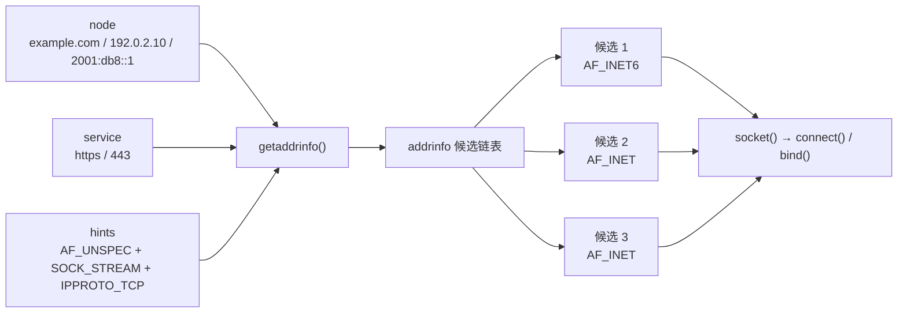
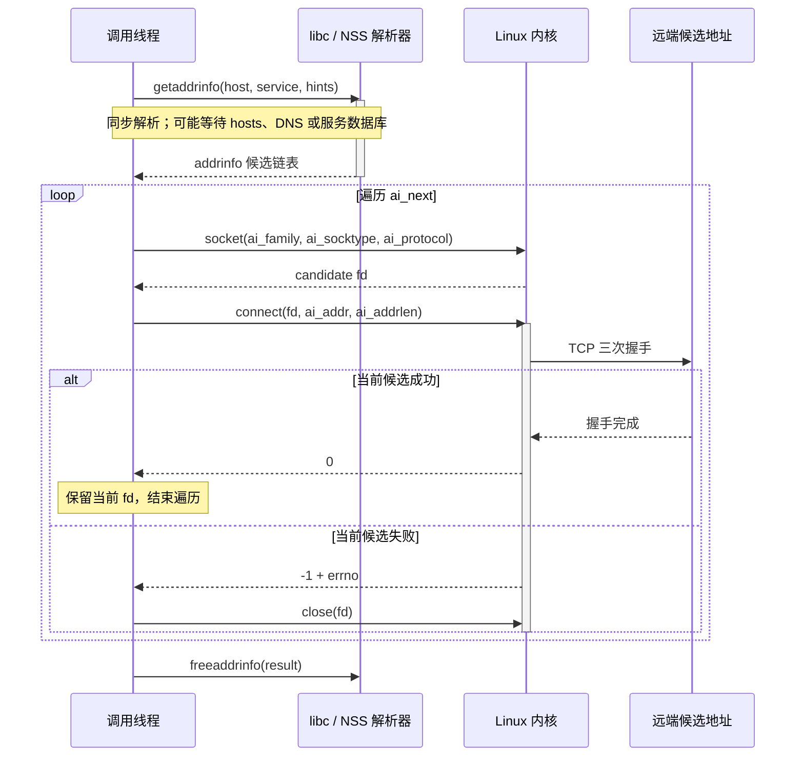
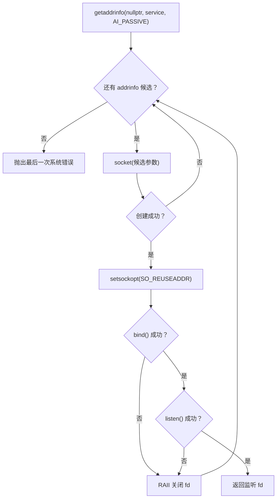
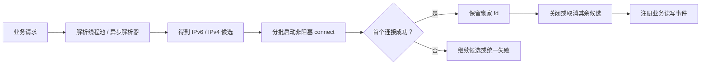

---
tags:
  - Linux
  - TCP-编程
  - Socket
  - DNS
aliases:
  - getaddrinfo
  - 协议无关地址解析
阅读次数: 0
---

# 8.16 getaddrinfo：协议无关地址解析与 TCP 建连

> [!info] 适用范围
> 本文示例使用 **C++17 + POSIX Socket**，面向 Linux。示例中的 `SOCK_CLOEXEC` 用于在创建套接字时原子设置 close-on-exec；若目标平台不支持该标志，需要改为 `socket()` 后再用 `fcntl()` 设置 `FD_CLOEXEC`。

在 [[7.7 套接字#3. 地址结构体|7.7 套接字]] 中手工填写 `sockaddr_in`，适合学习地址结构、网络字节序和 `bind()` / `connect()` 的底层接口；但它不适合作为新程序的默认地址构造方式：

- `sockaddr_in` 把代码固定在 IPv4；
- 域名、文本 IP、服务名和端口需要分别处理；
- 一个主机名可能对应多个 IPv4/IPv6 地址，不能只尝试一个；
- 客户端和服务端都容易把地址解析、资源释放和失败重试写散。

现代做法是把 **主机标识 `node`**、**服务标识 `service`** 和筛选条件 `hints` 交给 `getaddrinfo()`，由它返回一条可直接用于 `socket()`、`connect()` 或 `bind()` 的候选地址链表。

> [!abstract] 一句话模型
> `getaddrinfo()` **不建立连接，也不创建 socket**；它只把“我要访问谁、访问哪个服务”翻译成“可以逐个尝试的完整套接字地址”。



图中最重要的不是 IPv4/IPv6 的数量，而是**一个逻辑目标会被展开成多个候选端点**。解析器负责生成候选，应用程序仍然要决定如何遍历、并发尝试、超时和选择最终连接。

---

## 1. 接口与输入输出模型

```cpp
#include <netdb.h>

// 将主机名/服务名解析为套接字地址链表
// 成功返回 0，失败返回非 0 的 EAI_* 错误码
int getaddrinfo(const char* node,          // 主机名或 IP 文本（如 "example.com" / "127.0.0.1"），服务端通配时可传 nullptr
                const char* service,       // 服务名或端口文本（如 "https" / "8080"）
                const addrinfo* hints,     // 期望的地址类型与过滤条件（输入）
                addrinfo** result);        // 解析成功后返回的候选地址链表头指针（输出）

// 释放由 getaddrinfo 动态分配的 addrinfo 链表内存
void freeaddrinfo(addrinfo* result);

// 将 EAI_* 错误码转换为可读的错误描述字符串
const char* gai_strerror(int error_code);
```

| 参数 | 角色 | 常见取值 |
|---|---|---|
| `node` | 主机名、文本 IP 或空指针 | `"example.com"`、`"192.0.2.10"`、`"2001:db8::1"`；服务端配合 `AI_PASSIVE` 时可传 `nullptr` |
| `service` | 服务名或十进制端口字符串 | `"https"`、`"443"`、`"8080"` |
| `hints` | 输入筛选条件 | 地址族、socket 类型、协议、解析标志 |
| `result` | 输出链表头 | 成功后指向一个或多个 `addrinfo` 节点 |

`node` 和 `service` 至少有一个不能为 `nullptr`。对 TCP 客户端，通常两者都给出；对监听所有本地地址的 TCP 服务端，常见组合是 `node == nullptr`、`service == "8080"`、`AI_PASSIVE`。

### 1.1 `addrinfo` 哪些字段是输入，哪些是输出

```cpp
struct addrinfo {
    int              ai_flags;     // 行为控制标志（如 AI_PASSIVE, AI_NUMERICHOST 等）
    int              ai_family;    // 地址族（AF_INET, AF_INET6, AF_UNSPEC）
    int              ai_socktype;  // 套接字类型（SOCK_STREAM, SOCK_DGRAM 等）
    int              ai_protocol;  // 具体协议（如 IPPROTO_TCP，通常设为 0 或明确指定）
    socklen_t        ai_addrlen;   // ai_addr 指向的套接字地址结构体字节长度
    sockaddr*        ai_addr;      // 指向具体的套接字地址结构（如 sockaddr_in / sockaddr_in6）
    char*            ai_canonname; // 主机的规范官方名称（设置了 AI_CANONNAME 时有效）
    addrinfo*        ai_next;      // 指向链表中的下一个候选地址节点
};
```

当它作为 `hints` 使用时，只有前四个字段可以填写：

| 字段 | 用途 |
|---|---|
| `ai_flags` | 指定 `AI_PASSIVE`、`AI_NUMERICHOST` 等行为 |
| `ai_family` | `AF_INET`、`AF_INET6` 或 `AF_UNSPEC` |
| `ai_socktype` | TCP 使用 `SOCK_STREAM`，UDP 使用 `SOCK_DGRAM` |
| `ai_protocol` | TCP 可写 `IPPROTO_TCP`；也可在 `socktype` 已明确时写 0 |

其余字段必须保持为 0 或空指针。C++ 中直接值初始化：

```cpp
addrinfo hints{};  // 零初始化所有字段，防止垃圾值干扰解析
```

不要写成未初始化的 `addrinfo hints;`，也不要为了省几行直接把 `hints` 传 `nullptr`。glibc 在 `hints == nullptr` 时采用的默认 `ai_flags` 与 POSIX 规定并不完全相同；显式初始化能让行为和意图都更稳定。

成功后，每个返回节点都带有：

- 创建 socket 所需的 `ai_family`、`ai_socktype`、`ai_protocol`；
- 可直接传给 `connect()` / `bind()` 的 `ai_addr`；
- 与具体地址结构匹配的 `ai_addrlen`；
- 指向下一个候选的 `ai_next`。

因此后续代码应该使用**当前节点给出的参数**，而不是又硬编码回 `AF_INET` 或 `sizeof(sockaddr_in)`。

---

## 2. 它和其他地址转换函数是什么关系

| 函数 | 输入 | 输出 | 是否解析域名 | IPv4/IPv6 |
|---|---|---|---|---|
| `inet_pton()` | 一个数字地址字符串 | 一个二进制 IP 地址 | 否 | 调用者指定一种地址族 |
| `getaddrinfo()` | 主机名或数字地址 + 服务名或端口 | 一组完整 socket 地址候选 | 可能 | 可同时返回多种地址族 |
| `getnameinfo()` | 一个 `sockaddr` | 主机/服务字符串 | 可选反向解析 | 协议无关 |
| `gethostbyname()` | 主机名 | 旧式 `hostent` | 是 | 旧接口，不能作为新代码的默认选择 |

固定配置只允许数字 IP，且明确只需要一种地址族时，`inet_pton()` 仍然合理；只要需要域名、多地址回退或 IPv4/IPv6 无关代码，就应该优先使用 `getaddrinfo()`。

---

## 3. 返回链表为什么可能有多个节点

同一个调用可能得到多个候选，原因包括：

1. 域名同时存在 A 和 AAAA 记录；
2. 同一域名配置了多个地址，用于负载分担或容灾；
3. 主机具有多个网络接口；
4. `ai_socktype` 没有限定时，同一服务可能产生不同 socket 类型的结果。

基线写法是按返回顺序遍历，每个候选都重新执行：

```text
socket(candidate) → connect(candidate)
```

任何一次失败都只淘汰当前候选，不应立即终止整个解析结果的尝试。

> [!warning] 不能只复制一个 `addrinfo`
> `getaddrinfo()` 返回的节点、`ai_addr` 和规范名称等内存由 C 库统一分配。调用 `freeaddrinfo()` 后，节点内部指针全部失效。若需要长期保存某个地址，必须深拷贝它指向的地址字节，不能只浅拷贝 `addrinfo` 结构体。

---

## 4. 先用 RAII 收住两类资源

下面几段代码属于同一个实现文件，按顺序组合即可。资源所有权有两类：

- socket 文件描述符由 `UniqueFd` 独占；
- `addrinfo` 链表由带自定义删除器的 `std::unique_ptr` 独占。

### 4.1 socket 文件描述符

```cpp
#include <array>
#include <cerrno>
#include <memory>
#include <stdexcept>
#include <string>
#include <string_view>
#include <system_error>
#include <utility>

#include <netdb.h>
#include <netinet/in.h>
#include <sys/socket.h>
#include <unistd.h>

// 基于 RAII 管理 Linux 文件描述符的生命周期，确保离开作用域时自动关闭
class UniqueFd final {
public:
    // 构造函数：接管传入的 fd（默认 -1 表示无效描述符）
    explicit UniqueFd(int fd = -1) noexcept : fd_(fd) {}

    // 析构函数：自动关闭持有的有效 fd
    ~UniqueFd() { close_current(); }

    // 禁用拷贝语义（防止多个对象持有并重复关闭同一个 fd）
    UniqueFd(const UniqueFd&) = delete;
    UniqueFd& operator=(const UniqueFd&) = delete;

    // 移动构造函数：转移 fd 所有权，并将原对象重置为 -1
    UniqueFd(UniqueFd&& other) noexcept
        : fd_(std::exchange(other.fd_, -1)) {}

    // 移动赋值运算符：先释放当前持有的 fd，再接管新 fd 所有权
    UniqueFd& operator=(UniqueFd&& other) noexcept {
        if (this != &other) {
            close_current();
            fd_ = std::exchange(other.fd_, -1);
        }
        return *this;
    }

    // 获取底层原生文件描述符
    [[nodiscard]] int get() const noexcept { return fd_; }

    // 检查当前是否持有合法有效的文件描述符
    [[nodiscard]] explicit operator bool() const noexcept {
        return fd_ >= 0;
    }

private:
    // 安全关闭当前持有的描述符并重置为 -1
    void close_current() noexcept {
        if (fd_ >= 0) {
            (void)::close(fd_);
            fd_ = -1;
        }
    }

    int fd_;  // 托管的文件描述符
};
```

这里禁用拷贝，是因为两个对象不能同时认为自己拥有同一个 fd；移动操作标记为 `noexcept`，让所有权转移不会落入异常路径。析构函数只负责关闭，不尝试在 `close()` 失败后重试，因为 fd 数字可能已经被系统复用。

### 4.2 `addrinfo` 链表与错误码

```cpp
// 自定义删除器：适配 std::unique_ptr 自动调用 freeaddrinfo
struct AddrInfoDeleter final {
    void operator()(addrinfo* ptr) const noexcept {
        if (ptr != nullptr) {
            ::freeaddrinfo(ptr);
        }
    }
};

// 使用 RAII 智能指针管理 getaddrinfo 返回的链表内存
using AddrInfoList = std::unique_ptr<addrinfo, AddrInfoDeleter>;

// 统一处理 getaddrinfo 错误并抛出相应异常
[[noreturn]] void throw_gai_error(int error_code,
                                  std::string_view operation) {
    const int saved_errno = errno;  // 立即保存 errno，防止被后续操作覆盖

    // 若错误码为 EAI_SYSTEM，说明是系统底层调用失败，依据 errno 抛出 std::system_error
    if (error_code == EAI_SYSTEM) {
        throw std::system_error(saved_errno,
                                std::generic_category(),
                                std::string(operation));
    }

    // 其他 EAI_* 错误，使用 gai_strerror 获取标准错误描述
    throw std::runtime_error(
        std::string(operation) + ": " + ::gai_strerror(error_code));
}
```

`getaddrinfo()` 失败时返回 `EAI_*` 错误码，而不是 `-1`。通常应交给 `gai_strerror()`；只有返回 `EAI_SYSTEM` 时，`errno` 才描述底层系统错误，所以必须先保存它。

---

## 5. 客户端：解析全部候选并逐个连接

完整的 TCP 客户端流程见 [[8.3 TCP客户端]]。本节只封装“地址解析 + 建连”这一段。

### 5.1 解析 TCP 端点

```cpp
// 协议无关地将 host 和 service 解析为 TCP 候选地址链表
AddrInfoList resolve_tcp(std::string_view host,
                         std::string_view service) {
    // string_view 不保证以 '\0' 结尾，先复制成 C API 可用的以 null 结尾的字符串
    const std::string host_text(host);
    const std::string service_text(service);

    addrinfo hints{};
    hints.ai_family = AF_UNSPEC;       // 接受 IPv4 和 IPv6 地址
    hints.ai_socktype = SOCK_STREAM;   // 只返回 TCP 流式 socket
    hints.ai_protocol = IPPROTO_TCP;   // 明确限定 TCP 传输协议

    addrinfo* raw_result = nullptr;
    // 调用 getaddrinfo 进行地址解析
    const int rc = ::getaddrinfo(host_text.c_str(),
                                 service_text.c_str(),
                                 &hints,
                                 &raw_result);
    if (rc != 0) {
        throw_gai_error(rc, "getaddrinfo");
    }

    // 将原始链表指针交由 RAII 智能指针管理
    return AddrInfoList(raw_result);
}
```

这里没有默认打开 `AI_ADDRCONFIG`。它会根据本机是否配置了相应地址族来过滤结果，真实主机上可能减少无效候选，但在容器、独立网络命名空间或只有回环地址的测试环境中也可能产生意外过滤。应根据部署环境显式决定，而不是无条件照抄。

### 5.2 每个候选使用一个新的 socket

```cpp
// 遍历所有候选地址并尝试建立 TCP 连接，返回首个成功连接的 socket
UniqueFd connect_tcp(std::string_view host,
                     std::string_view service) {
    // 1. 获取候选地址链表
    AddrInfoList addresses = resolve_tcp(host, service);
    int last_error = EHOSTUNREACH;  // 默认错误码（主机不可达）

    // 2. 逐个遍历候选地址
    for (const addrinfo* ai = addresses.get();
         ai != nullptr;
         ai = ai->ai_next) {
        // 创建套接字：参数完全采用当前候选节点提供的信息
        // SOCK_CLOEXEC 保证在 exec 时自动关闭，防止 fd 泄漏给子进程
        UniqueFd candidate(::socket(ai->ai_family,
                                    ai->ai_socktype | SOCK_CLOEXEC,
                                    ai->ai_protocol));
        if (!candidate) {
            last_error = errno;
            continue;  // socket 创建失败，尝试下一个候选
        }

        // 尝试向该候选地址发起 TCP 三次握手
        if (::connect(candidate.get(),
                      ai->ai_addr,
                      ai->ai_addrlen) == 0) {
            return candidate;  // 连接成功，移交唯一所有权
        }

        last_error = errno;
        // 本轮循环结束时 candidate 析构并自动 close。
        // 下一个地址必须重新 socket()，不能复用失败的 fd。
    }

    // 所有候选均尝试失败，抛出最后的系统错误
    throw std::system_error(
        last_error,
        std::generic_category(),
        "connect_tcp: no address succeeded");
}
```

这段代码的关键不是循环，而是三条资源规则：

1. `socket()` 参数完全取自当前 `addrinfo` 节点；
2. 每次 `connect()` 失败都销毁当前 fd；
3. 无论成功、失败还是抛异常，地址链表都会自动 `freeaddrinfo()`。

`connect()` 失败后不复用同一个 fd，与 [[8.3 TCP客户端#4.6 connect 失败之后，这个 fd 不能再用|客户端失败重试规则]] 一致。



这张图揭示了源码里容易混在一起的两个等待点：`getaddrinfo()` 可能等待名称解析，阻塞式 `connect()` 又可能等待握手或超时。把前者换成 `getaddrinfo()` 并不会自动让整个客户端变成非阻塞。

---

## 6. 服务端：`AI_PASSIVE` 生成可绑定地址

TCP 服务端的完整生命周期见 [[8.2 TCP服务端]]。监听任意本地网卡时，不再手写 `INADDR_ANY` 或 `in6addr_any`，而是让 `getaddrinfo()` 生成通配地址。

### 6.1 获取监听候选

```cpp
// 服务端获取用于被动绑定的候选地址链表（通配地址 0.0.0.0 / ::）
AddrInfoList resolve_passive_tcp(std::string_view service) {
    const std::string service_text(service);

    addrinfo hints{};
    hints.ai_flags = AI_PASSIVE;       // 被动打开标志：node 为 nullptr 时生成本地通配地址用于 bind
    hints.ai_family = AF_UNSPEC;       // 支持 IPv4 和 IPv6 候选
    hints.ai_socktype = SOCK_STREAM;   // TCP 流式套接字
    hints.ai_protocol = IPPROTO_TCP;   // 明确限定 TCP 协议

    addrinfo* raw_result = nullptr;
    // 传入 nullptr 作为 node，结合 AI_PASSIVE 获取用于 bind 的本地通配地址
    const int rc = ::getaddrinfo(nullptr,
                                 service_text.c_str(),
                                 &hints,
                                 &raw_result);
    if (rc != 0) {
        throw_gai_error(rc, "getaddrinfo(AI_PASSIVE)");
    }

    return AddrInfoList(raw_result);
}
```

`node == nullptr` 且设置 `AI_PASSIVE` 时，返回地址适合 `bind()`：IPv4 候选通常是 `0.0.0.0`，IPv6 候选通常是 `::`。若不设置 `AI_PASSIVE`，空 `node` 的语义会变成回环地址，不能混用。

### 6.2 最小的单监听 fd 实现

```cpp
// 创建单个 TCP 监听套接字（遍历候选地址，绑定到第一个成功的地址）
UniqueFd make_one_tcp_listener(std::string_view service,
                               int backlog) {
    // 1. 获取用于监听的被动候选地址列表
    AddrInfoList addresses = resolve_passive_tcp(service);
    int last_error = EADDRNOTAVAIL;

    // 2. 遍历候选地址，寻找第一个能成功 bind 和 listen 的地址
    for (const addrinfo* ai = addresses.get();
         ai != nullptr;
         ai = ai->ai_next) {
        // 创建套接字
        UniqueFd listener(::socket(ai->ai_family,
                                   ai->ai_socktype | SOCK_CLOEXEC,
                                   ai->ai_protocol));
        if (!listener) {
            last_error = errno;
            continue;
        }

        // 开启 SO_REUSEADDR，允许重用处于 TIME_WAIT 状态的本地端口
        int enabled = 1;
        if (::setsockopt(listener.get(),
                         SOL_SOCKET,
                         SO_REUSEADDR,
                         &enabled,
                         sizeof(enabled)) == -1) {
            last_error = errno;
            continue;
        }

        // 绑定套接字到当前候选地址
        if (::bind(listener.get(),
                   ai->ai_addr,
                   ai->ai_addrlen) == -1) {
            last_error = errno;
            continue;
        }

        // 开启监听，设置全连接队列长度上限 backlog
        if (::listen(listener.get(), backlog) == -1) {
            last_error = errno;
            continue;
        }

        return listener;  // 监听成功，返回该套接字所有权
    }

    // 所有候选均绑定/监听失败，抛出异常
    throw std::system_error(
        last_error,
        std::generic_category(),
        "make_one_tcp_listener: no address succeeded");
}
```

`SO_REUSEADDR` 必须在 `bind()` 前设置；其详细语义见 [[10.1 套接字选项#3.2 SO_REUSEADDR|SO_REUSEADDR]]。每个失败候选都由 RAII 自动关闭，因此不会在循环中泄漏 fd。



这是**单监听 fd** 的最小实现，适合教学或明确只需要一个地址族的服务。

### 6.3 `AF_UNSPEC` 不等于自动完成双栈监听

> [!warning] 不要把“返回 IPv4 和 IPv6 候选”误读为“一个 fd 已同时监听两者”
> 上面的函数在第一个成功候选处返回，所以最终只保留一个监听 socket。IPv6 监听 socket 是否同时接收 IPv4-mapped 连接，取决于平台和 `IPV6_V6ONLY` 策略，不能依赖隐式默认值。

需要行为可预测的双栈服务时，应明确选择一种策略：

| 策略 | 做法 | 特点 |
|---|---|---|
| 两个监听 fd | 分别绑定 IPv6 和 IPv4；对 IPv6 fd 显式设置 `IPV6_V6ONLY`；两个 fd 一起注册到事件循环 | 行为最清楚，跨平台更容易推理 |
| 一个 IPv6 监听 fd | 明确配置允许 IPv4-mapped 连接，并验证目标系统行为 | fd 少，但平台差异和地址显示需要额外处理 |
| 单地址族 | `ai_family` 固定为 `AF_INET` 或 `AF_INET6` | 配置简单，但主动放弃另一地址族 |

“循环到第一个能绑定的地址”解决的是启动成功率，不自动解决双栈覆盖范围。

---

## 7. 常用 `ai_flags`：按目的使用，不要堆标志

| 标志 | 何时使用 | 关键效果 |
|---|---|---|
| `AI_PASSIVE` | 服务端生成 `bind()` 地址 | `node == nullptr` 时返回通配地址 |
| `AI_NUMERICHOST` | 配置明确要求数字 IP | 禁止主机名解析；输入不是数字地址就报错 |
| `AI_NUMERICSERV` | 配置明确要求十进制端口 | 禁止服务名查找；`"https"` 会报错，`"443"` 可用 |
| `AI_ADDRCONFIG` | 希望根据本机已配置地址族过滤候选 | 可能减少无效候选，也可能在容器/测试环境中过滤过头 |
| `AI_CANONNAME` | 确实需要规范名称作为展示信息 | 仅首个结果返回名称；不能把它当成身份认证 |
| `AI_V4MAPPED` / `AI_ALL` | 特定 IPv6 兼容策略 | 属于高级兼容选项，不应无条件开启 |

常见客户端不需要一次把这些标志全部打开。最稳定的起点通常是：

```cpp
addrinfo hints{};
hints.ai_family = AF_UNSPEC;       // 同时接受 IPv4 和 IPv6 候选
hints.ai_socktype = SOCK_STREAM;   // 限定为 TCP 流式套接字
hints.ai_protocol = IPPROTO_TCP;   // 明确限定 TCP 协议
```

然后只为明确需求增加一个标志。

---

## 8. 错误模型：`EAI_*` 与 `errno` 是两套体系

| 调用 | 失败表示 | 正确的错误文本 |
|---|---|---|
| `getaddrinfo()` / `getnameinfo()` | 返回非 0 的 `EAI_*` | `gai_strerror(rc)` |
| `socket()` / `connect()` / `bind()` / `listen()` | 返回 `-1` | `std::system_error(errno, ...)` 或 `strerror(errno)` |
| `getaddrinfo()` 返回 `EAI_SYSTEM` | 底层系统调用失败 | 此时再读取 `errno` |

几个常见解析错误：

- `EAI_AGAIN`：临时解析失败，是否重试由上层策略决定；
- `EAI_NONAME`：主机或服务未知，或输入组合无效；
- `EAI_SERVICE`：服务与指定的 socket 类型/协议不匹配；
- `EAI_FAMILY`：所请求地址族不受支持；
- `EAI_SYSTEM`：查看保存下来的 `errno`。

不要在 `getaddrinfo()` 返回任意错误后直接 `perror("getaddrinfo")`；那很可能打印出与本次错误无关的旧 `errno`。

---

## 9. `getnameinfo()`：协议无关地记录对端地址

`accept()` 得到的地址可能是 `sockaddr_in`，也可能是 `sockaddr_in6`。日志代码不应通过地址族分支分别调用 `inet_ntop()`；可以把地址和实际长度直接交给 `getnameinfo()`：

```cpp
// 将 sockaddr 地址结构格式化为人类可读的 "IP:端口" 或 "[IPv6]:端口" 字符串
std::string endpoint_to_text(const sockaddr* address,
                             socklen_t address_length) {
    // 缓冲区大小预设为系统标准常量 NI_MAXHOST (1025) 和 NI_MAXSERV (32)
    std::array<char, NI_MAXHOST> host{};
    std::array<char, NI_MAXSERV> service{};

    // getnameinfo 协议无关地将二进制套接字地址逆向转换为数字 IP 和端口字符串
    // NI_NUMERICHOST | NI_NUMERICSERV: 强制只返回数字形式，避免反向 DNS 解析产生网络阻塞
    const int rc = ::getnameinfo(
        address,
        address_length,
        host.data(),
        static_cast<socklen_t>(host.size()),
        service.data(),
        static_cast<socklen_t>(service.size()),
        NI_NUMERICHOST | NI_NUMERICSERV);
    if (rc != 0) {
        throw_gai_error(rc, "getnameinfo");
    }

    std::string host_text(host.data());
    // IPv6 地址包含冒号，用中括号包裹以区分端口号冒号（如 [2001:db8::1]:8080）
    if (host_text.find(':') != std::string::npos) {
        host_text = "[" + host_text + "]";
    }

    return host_text + ":" + service.data();
}
```

这里强制使用 `NI_NUMERICHOST | NI_NUMERICSERV`，是为了让日志路径只做格式化，不触发反向 DNS 或服务名查询。若把 `flags` 写成 0，日志打印本身就可能等待名称解析，并且同一地址在不同 DNS 状态下可能打印出不同文本。

---

## 10. 线程安全不等于异步：事件循环不能直接照搬

`getaddrinfo()` 是可重入的现代接口，但它仍是**同步调用**。根据系统的 NSS 配置，它可能访问本地文件、DNS、mDNS、LDAP 或其他名称服务；在事件循环线程里直接调用，会把同一线程管理的所有连接一起卡住。

对 [[8.12 非阻塞connect与健壮收发|非阻塞 connect]] 场景，推荐拆成两段：



解析和建连是两个不同的异步阶段：

1. 名称解析阶段不能占住 I/O 事件循环；
2. 建连阶段使用 `SOCK_NONBLOCK`、等待可写事件并检查 `SO_ERROR`；
3. 所有阶段都需要自己的超时、取消和生命周期管理。

### 10.1 多地址回退与 Happy Eyeballs

简单的阻塞工具可以按链表顺序串行尝试；面向用户、延迟敏感的双栈客户端不能把“第一个 IPv6 路径坏了”变成漫长等待，然后才尝试 IPv4。

RFC 8305 的 Happy Eyeballs v2 使用受控并发和错峰连接尝试，让不同地址族/地址候选竞争，保留最先成功的连接并取消其余连接。工程上应优先使用经过验证的网络库实现，而不是把上面的串行 `for` 循环误认为完整的生产级双栈策略。

---

## 11. 常见错误与修正

| 错误写法或认识 | 后果 | 修正 |
|---|---|---|
| `addrinfo hints;` 后只赋两个字段 | 其余垃圾值可能被当成标志或指针 | 使用 `addrinfo hints{};` |
| `hints == nullptr` 以为所有平台默认完全相同 | glibc 与 POSIX 默认标志存在差异 | 显式填写需要的字段 |
| 不设置 `ai_socktype` | 可能同时获得流式和数据报候选 | TCP 明确写 `SOCK_STREAM` |
| `getaddrinfo()` 失败后只看 `errno` | 错误信息与实际原因不匹配 | 先看 `EAI_*`；仅 `EAI_SYSTEM` 看 `errno` |
| 忘记 `freeaddrinfo()` | 地址链表泄漏 | 用 RAII 删除器 |
| 保存 `ai_addr` 指针后释放链表 | 悬空指针 | 在释放前深拷贝地址字节 |
| 只尝试链表第一个节点 | 首个地址不可达时无回退 | 遍历全部候选或实施 Happy Eyeballs |
| 多个候选复用同一个失败 fd | socket 状态不可可靠复用 | 每个候选重新 `socket()` |
| 认为 `AF_UNSPEC` 自动建立双栈监听 | 实际可能只监听一种地址族 | 明确创建一个或多个监听 fd |
| 在 epoll 线程中同步解析域名 | 整个事件循环被阻塞 | 解析线程池或异步 DNS |
| 日志里 `getnameinfo(..., 0)` | 可能触发反向 DNS | 使用数字主机和数字服务标志 |

---

## 12. 工程选型速查

| 场景 | 推荐方式 |
|---|---|
| 教学：理解地址结构和字节序 | 手工填写 `sockaddr_in` / `sockaddr_in6` |
| 固定数字地址、明确单地址族 | `inet_pton()`，或 `getaddrinfo()` + `AI_NUMERICHOST` |
| 普通阻塞 TCP 客户端 | `getaddrinfo()` → 每个候选新建 socket → 逐个 `connect()` |
| 延迟敏感的双栈客户端 | 异步解析 + Happy Eyeballs + 非阻塞 `connect()` |
| TCP 服务端监听任意本地地址 | `AI_PASSIVE` → 明确的单栈或双栈监听策略 |
| 打印 `accept()` 得到的对端地址 | `getnameinfo()` + `NI_NUMERICHOST | NI_NUMERICSERV` |

---

## 13. 关键结论

1. 手工地址结构是学习底层接口的工具，`getaddrinfo()` 才是新代码的默认地址构造入口。
2. `getaddrinfo()` 返回的是**候选链表**，不是“唯一正确地址”。
3. 每个候选都必须使用自己的 `ai_family`、`ai_socktype`、`ai_protocol`、`ai_addrlen`。
4. `addrinfo` 链表和 socket fd 都应由 RAII 管理。
5. `EAI_*` 与 `errno` 必须分开处理。
6. `AF_UNSPEC` 解决协议无关性，但不自动解决双栈监听策略或低延迟建连。
7. `getaddrinfo()` 可重入，但仍可能阻塞；事件循环需要异步解析与非阻塞建连。
8. 对端地址日志优先使用数字形式的 `getnameinfo()`，避免反向 DNS 进入热路径。

---

## 参考资料

- W. Richard Stevens, Bill Fenner, Andrew M. Rudoff, *UNIX Network Programming, Volume 1: The Sockets Networking API*, 3rd ed., Chapter 11, Sections 11.6–11.17.
- Michael Kerrisk, *The Linux Programming Interface*, Chapter 59, especially Sections 59.10–59.12.
- Linux man-pages 6.18: `getaddrinfo(3)`, `getnameinfo(3)`, `socket(2)`，访问日期：2026-09-01。
  - https://man7.org/linux/man-pages/man3/getaddrinfo.3.html
  - https://man7.org/linux/man-pages/man3/getnameinfo.3.html
  - https://man7.org/linux/man-pages/man2/socket.2.html
- RFC 8305, *Happy Eyeballs Version 2: Better Connectivity Using Concurrency*, December 2017.
  - https://www.rfc-editor.org/rfc/rfc8305.html
