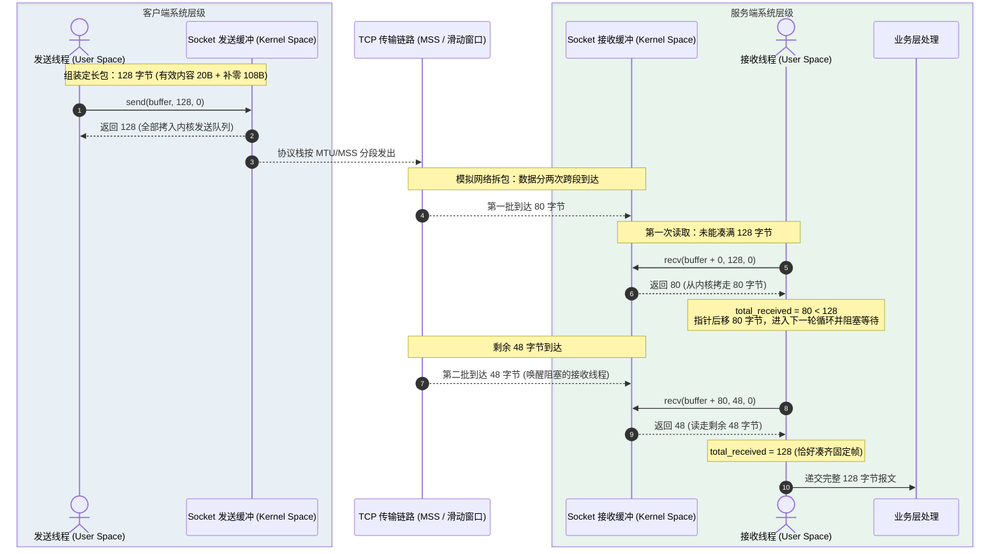
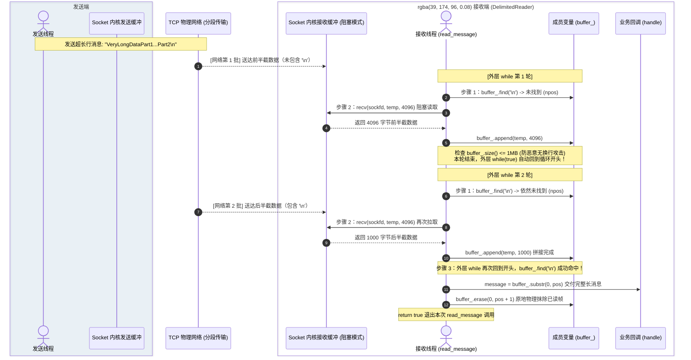
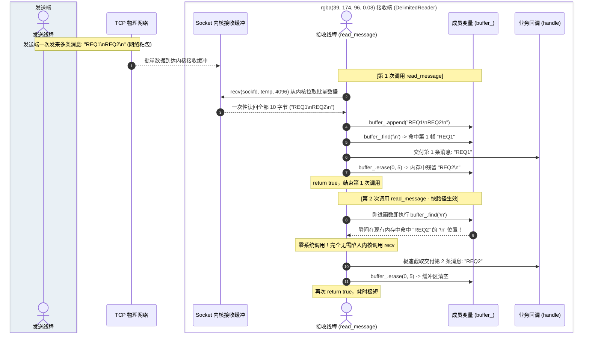
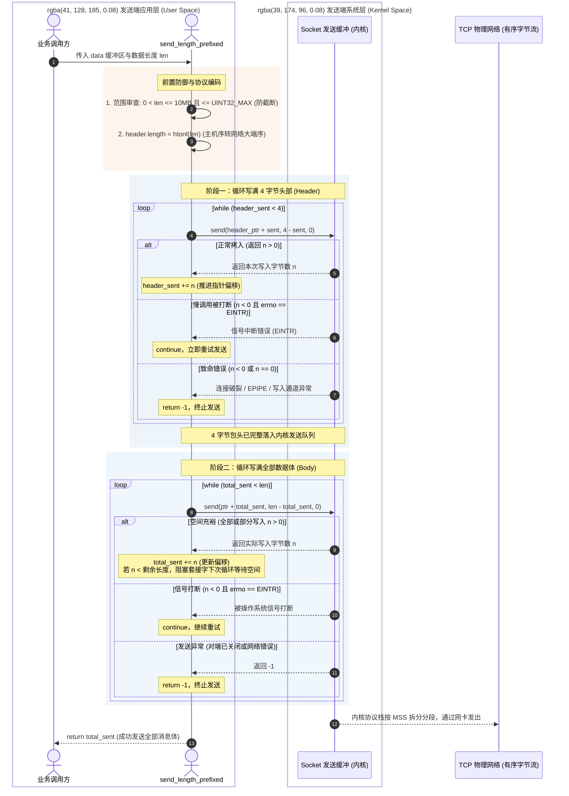
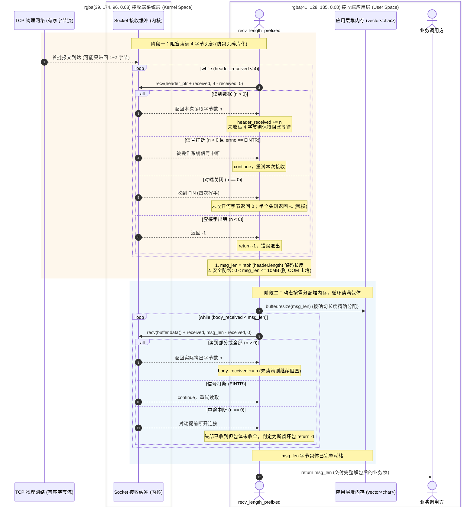
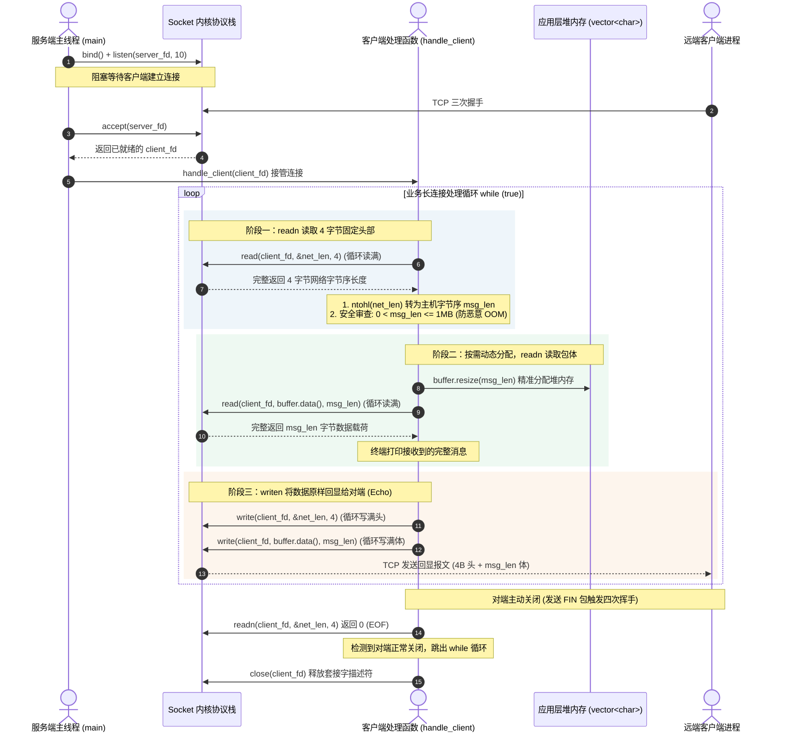
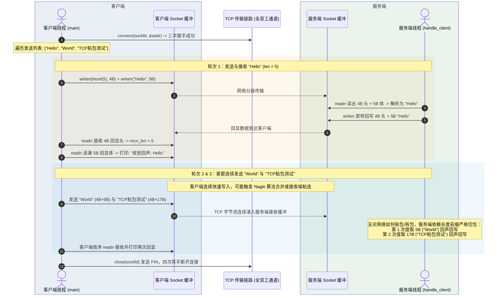

---
tags:
  - Linux
  - TCP-编程
阅读次数: 0
---

# 8.9 TCP 的粘包和拆包

> TCP 是基于字节流的协议，没有消息边界，应用层必须自己处理消息的分包与组包问题。

> [!tip] 交互动画
> 粘包/半包/拆包三种现象、边界方案对比、长度前缀解析状态机的过程可视化：
> [▶ 在浏览器中打开动画](<图片/HTML/3.Linux/8. TCP 编程/8.9.1 TCP粘包与拆包动画.html>)　·　更多见 [[网络编程·动画合集]]
> 也可直达单个场景：[粘包与拆包](<图片/HTML/3.Linux/8. TCP 编程/8.9.1 TCP粘包与拆包动画.html#scene=stick>) · [边界方案](<图片/HTML/3.Linux/8. TCP 编程/8.9.1 TCP粘包与拆包动画.html#scene=scheme>) · [解析状态机](<图片/HTML/3.Linux/8. TCP 编程/8.9.1 TCP粘包与拆包动画.html#scene=parser>)

---

## 1. 概念定义

**粘包（Sticky Packet）**：发送方发送的多个独立数据包，在接收方被合并成一个数据包接收。

**拆包（Packet Splitting）**：发送方发送的一个完整数据包，在接收方被拆分成多个数据包接收。

这两种现象的根本原因是 **TCP 是面向字节流的协议**，它不保留消息边界。TCP 只保证数据按顺序、可靠地到达，但不保证每次 `read()` 读取的数据恰好是一个完整的应用层消息。

---

## 2. 为什么会发生

### 2.1 TCP 的字节流特性

如 [[8.7 IO缓冲]] 所述，TCP 套接字的数据收发是**无边界**的。`send("Hello")` 和 `send("World")` 两次调用，到了对端可能一次 `recv()` 就全拿到，读出来是 `"HelloWorld"`——“这里原本是两条消息”这个信息，TCP 这一层压根没记录过。

### 2.2 发送端原因

| 原因 | 说明 |
|:---|:---|
| **Nagle 算法** | TCP 为提高网络利用率，会将小数据包合并后再发送 |
| **发送缓冲区** | 多次 `write()` 的数据可能在 [[8.7 IO缓冲#2.1 发送缓冲区（Send Buffer）\|发送缓冲区]] 中累积后一起发送 |

### 2.3 接收端原因

| 原因 | 说明 |
|:---|:---|
| **接收缓冲区** | 网络数据先存入 [[8.7 IO缓冲#2.2 接收缓冲区（Receive Buffer）\|接收缓冲区]]，应用层读取时机不确定 |
| **读取时机** | 应用程序调用 `read()` 时，缓冲区中可能有多个包或不完整的包 |

### 2.4 网络传输原因

| 原因         | 说明                                            |
| :--------- | :-------------------------------------------- |
| **MSS 分段** | 数据超过 MSS（Maximum Segment Size）时会被拆分           |
| **MTU 限制** | 数据超过 MTU（Maximum Transmission Unit）时会被 IP 层分片 |

---

## 3. 四种情况长什么样

三次 `send` 发出 `"AAAA"`、`"BBBBBB"`、`"CCC"` 共 13 字节，接收方能拿到哪几段，取决于它什么时候调用 `recv()`：

![[图片/SVG/3_8_8_9_1.svg|1360]]

四行的底层字节流一模一样，区别只在切点落在哪里。粘包和拆包因此是同一件事的两种表现：**TCP 这一层没有“包”这个东西，边界是应用层自己划出来的**。

也正因为如此，“怎么让 TCP 不粘包”是个伪问题——就算把 Nagle 关掉，接收端什么时候来取、一次取走多少，依然不受发送方控制。

---

## 4. 解决方案

### 4.1 方案对比

| 方案 | 优点 | 缺点 | 适用场景 |
|:---|:---|:---|:---|
| **固定长度** | 实现简单 | 浪费空间，不灵活 | 消息长度固定的场景 |
| **分隔符** | 实现简单，可变长度 | 消息内容不能包含分隔符 | 文本协议（如 HTTP） |
| **长度前缀** | 灵活，无限制 | 需要多次读取 | 二进制协议（推荐） |

---

### 4.2 方案一：固定长度

每个消息固定为相同长度，不足部分用填充字符补齐。

```cpp
#include <cerrno>
#include <cstring>
#include <sys/socket.h>

// 约定每条消息严格占用 128 字节
constexpr size_t FIXED_MSG_SIZE = 128;

// 发送固定长度消息
// send 仅负责将数据从用户态拷入内核发送缓冲区，遇到缓冲区满或信号打断可能发生部分写入，需循环写满
ssize_t send_fixed_message(int sockfd, const char* msg) {
    char buffer[FIXED_MSG_SIZE] = {0};
    // 拷贝消息内容，未填满的剩余空间自动保留为 0 填充
    std::strncpy(buffer, msg, FIXED_MSG_SIZE - 1);

    size_t total_sent = 0;
    // send 无法保证一次性把 FIXED_MSG_SIZE 长度的 buffer 都发送出去，因此需要通过 while 循环
    while (total_sent < FIXED_MSG_SIZE) {
        ssize_t n = send(sockfd, buffer + total_sent, FIXED_MSG_SIZE - total_sent, 0);
        if (n < 0) {
            if (errno == EINTR) continue; // 慢系统调用被信号打断，重试
            return -1;                    // 套接字发生不可恢复错误
        }
        if (n == 0) return -1;            // 写入通道异常
        total_sent += n;
    }
    return total_sent;
}

// 接收固定长度消息
// TCP 字节流无边界，单次 recv 可能只读取一部分字节，必须累加读取到 FIXED_MSG_SIZE 为止
ssize_t recv_fixed_message(int sockfd, char* buffer) {
    size_t total_received = 0;
    // recv 接收也是同理
    while (total_received < FIXED_MSG_SIZE) {
        ssize_t n = recv(sockfd, buffer + total_received,
                         FIXED_MSG_SIZE - total_received, 0);
        if (n < 0) {
            if (errno == EINTR) continue; // 信号中断，重试
            return -1;                    // 接收错误
        }
        if (n == 0) {
            // 对端正常关闭。若读了部分字节却没凑满一条，属于报文残缺异常
            return (total_received == 0) ? 0 : -1;
        }
        total_received += n;
    }
    return total_received;
}
```

#### 线程交互与执行时序（拆包分批到达场景）



**关键机制分析**：
- **拆包累加机制**：TCP 并不保证一次 `send(128)` 对应一次 `recv(128)`。上图清晰呈现了网络分段为 80 字节与 48 字节分批到达时，服务端接收线程如何在 `while (total_received < 128)` 驱动下累加偏移地址 `buffer + total_received`，最终拼凑出完整一帧。
- **空间填充开销**：有效载荷仅 20 字节时，仍需强行填充 108 字节的 `\0`。在小包密集的场景下，带宽浪费超过 80%。
- **异常保护逻辑**：
  - 若 `recv` 返回 `-1` 且 `errno == EINTR`，属于慢系统调用被操作系统信号打断，应继续循环（`continue`）；
  - 若 `recv` 返回 `0`（对端发送 FIN 正常关闭），且此时 `total_received > 0`，说明对端在一条消息发送中途断开，直接判定为报文残缺致命错误返回 `-1`。

---

### 4.3 方案二：分隔符

使用特殊字符（如 `\n`、`\r\n`）作为消息边界。HTTP/1.1 协议的头部就使用 `\r\n` 作为分隔符。

```cpp
#include <cerrno>
#include <string>
#include <sys/socket.h>

constexpr char DELIMITER = '\n';
constexpr size_t BUFFER_SIZE = 4096;
constexpr size_t MAX_BUFFER_SIZE = 1024 * 1024; // 限制单条消息最大 1MB，防恶意无换行攻击导致 OOM

// 发送带分隔符的消息
// 必须保证全部数据拷入内核发送缓冲区，防止部分写入破坏协议
bool send_delimited_message(int sockfd, const std::string& msg) {
    std::string data = msg + DELIMITER;
    size_t total_sent = 0;

    while (total_sent < data.size()) {
        ssize_t n = send(sockfd, data.c_str() + total_sent, data.size() - total_sent, 0);
        if (n < 0) {
            if (errno == EINTR) continue; // 信号中断重试
            return false;                 // 套接字出错（如 EPIPE / ECONNRESET）
        }
        if (n == 0) return false;         // 对端关闭连接
        total_sent += n;
    }
    return true;
}

/**
	// 外部调用它的业务代码，永远是写在一个 `while` 循环里的：
	DelimitedReader reader;
	std::string msg;
	
	// 循环调用：只要能读出一条完整的消息，就一直循环处理
	while (reader.read_message(sockfd, msg)) {
	    handle_message(msg); // 业务处理当前这条消息
	}
**/

// 接收带分隔符的消息
// 必须在应用层维护缓冲区状态：因为一次 recv 可能收到多条消息，也可能只收到半条
class DelimitedReader {
public:
    // 读取一条完整消息（不含定界符），返回是否成功
    // 成功返回 true，对端正常关闭或出错返回 false
    bool read_message(int sockfd, std::string& message) {
        while (true) {
		    // 快路径
            // 1. 优先检查本地缓冲区是否已包含定界符
            // 关键逻辑：一次网络 recv 可能捞回多条消息，后续调用先从内存消化完，不必每次都触发系统调用
            auto pos = buffer_.find(DELIMITER);
            if (pos != std::string::npos) {
                message = buffer_.substr(0, pos);
                buffer_.erase(0, pos + 1); // 弹出当前消息和定界符
                return true;
            }
			
			// 慢路径：当程序运行到这里时，说明上缓冲区可能是空的，或者只有半句残缺的消息如 `"GET /inde"`
			// 既然内存里的数据不够拼成一条完整消息，就必须陷入内核，向网络 Socket 索要新数据。
            // 2. 本地缓冲区不够拼成一条完整消息，从内核套接字补充数据
            char temp[BUFFER_SIZE];
            ssize_t n = recv(sockfd, temp, sizeof(temp), 0);
            if (n < 0) {
                if (errno == EINTR) continue; // 信号中断重试
                return false;                 // 接收出错
            }
            if (n == 0) {
                // 对端关闭连接。如果此时缓冲区残留有未带换行的数据，说明消息残损
                return false;
            }

            buffer_.append(temp, n);

            // 3. 安全防护：若对端一直发数据却从不发定界符，避免应用层缓冲区无限制膨胀撑爆内存
            if (buffer_.size() > MAX_BUFFER_SIZE) {
                buffer_.clear();
                return false;
            }
        }
    }

private:
    std::string buffer_; // 连接专属的应用层接收缓冲区（成员变量，生命周期跨越多次函数调用）
};
```

#### 时序一：慢路径（长消息拆包分批到达，外层 while 驱动拼接）



#### 时序二：快路径（网络粘包留存，内存零系统调用极速命中）



**关键机制分析**：

1. **索引 `pos` 的底层机制与类型安全**：
   - `pos` 的确切类型为 **`std::string::size_type`**（现代 64 位系统下通常是 `size_t`，即无符号 64 位整数）。
   - `std::string::npos` 定义为 `static const size_type npos = -1;`。因为是无符号类型，`-1` 环绕为最大正整数 $2^{64}-1$（`0xFFFFFFFFFFFFFFFF`），用作失败哨兵。
   - **严禁使用 `int` 接收 `pos`**：不仅会触发编译器符号比较警告，在面对超长报文时还会引发 32 位整型截断溢出，导致下标变为负数破坏逻辑。

2. **`buffer_.erase(0, pos + 1)` 语义与成员生命周期**：
   - **原地物理抹除**：数据在上一行通过 `substr(0, pos)` 已经交付给外部出参 `message`。`erase` 的作用是在内存中将已消费的旧数据（包括换行符）抹掉，并将剩余字节向前平移，避免下次重复搜索。
   - **跨调用生命周期**：`buffer_` 是 `DelimitedReader` 对象的**私有成员变量**，而不是函数栈局部变量。`read_message()` 返回 `true` 后，剩余的字节依然完好保留在 `buffer_` 中，等待外层循环下一次调用拾取。

3. **慢路径为什么没有内层 `while (recv)`？（阻塞模式的死锁陷阱）**：
   - **外层 `while (true)` 充当了循环驱动器**：当消息跨越多个网络分段（如 10KB 长文本）时，外层循环会推进多轮，每轮调用一次 `recv` 拼接一段，直到 `find` 检测到定界符。
   - **未知长度协议不能盲目内层排空**：固定长度与长度前缀协议由于预先知道确切字节数，可以安全地使用内层 `while (total < expected)`。但分隔符协议**在读到定界符之前无法预知包长**。
   - **致命死锁风险**：在阻塞套接字下，如果给 `recv` 写内层循环试图“抽干内核”——当客户端发来短消息 `"ping\n"` 并停下来等待服务端回显时，服务端的第二次阻塞 `recv` 将**永久卡死休眠**，造成两端僵死死锁。
   - **黄金准则**：**每从网络拉取一批数据，必须立即返回应用层检查定界符**，见定界符立刻交付，严禁盲目发起下一次阻塞 `recv`。

> [!warning] 注意
> 使用分隔符方案时，必须确保消息内容中不包含分隔符，否则会导致解析错误。对于二进制数据，此方案不适用。

---

### 4.4 方案三：长度前缀（推荐）

在每个消息前加一个固定长度的头部，写明消息体有多长。这是最通用、最可靠的方案。

![[图片/SVG/3_8_8_9_2.svg|1360]]

上半部分是报文在字节流上的排布：读到第 0 字节时还不知道这条消息多长，读满前 4 字节才知道要再读 5 字节；下一条消息的头就紧贴在第 9 字节上，中间没有任何间隔。因为长度是显式写出来的，body 里出现 `0x00`、换行、甚至完整的另一段协议报文都不会干扰解析——这正是它比分隔符方案通用的地方。

下半部分的状态机展示了解包的核心状态转移：先收满 4 字节头部拿到长度，再收满指定长度的消息体，处理完一条后继续解析下一条。

```cpp
#include <cstdint>
#include <cerrno>
#include <arpa/inet.h>  // htonl, ntohl
#include <sys/socket.h>
#include <vector>

constexpr uint32_t MAX_MESSAGE_LEN = 10 * 1024 * 1024; // 限制单包最大 10MB，防止恶意大包打满内存

// 消息头：固定 4 字节表示消息体长度
struct MessageHeader {
    uint32_t length;  // 网络字节序（大端）
};

// 发送带长度前缀的消息（阻塞套接字）
ssize_t send_length_prefixed(int sockfd, const void* data, size_t len) {
    // 发送端也必须限制长度；否则 uint32_t 转换可能截断，接收端会按错误长度解析
    if (len == 0 || len > MAX_MESSAGE_LEN || len > UINT32_MAX) return -1;

    // 1. 发送消息头：必须由主机字节序转为网络字节序（大端）
    MessageHeader header;
    header.length = htonl(static_cast<uint32_t>(len));

    // 循环发送头部，确保 4 字节完整写入内核发送缓冲区
    size_t header_sent = 0;
    // 结构体指针与 const char* 无继承关系，static_cast 会被编译器拒绝，必须用 reinterpret_cast
    const char* header_ptr = reinterpret_cast<const char*>(&header);
    while (header_sent < sizeof(header)) {
        ssize_t n = send(sockfd, header_ptr + header_sent, sizeof(header) - header_sent, 0);
        if (n < 0) {
            if (errno == EINTR) continue; // 慢系统调用被信号打断，重试
            return -1;                    // 发送失败
        }
        if (n == 0) return -1;            // 写入通道异常关闭
        header_sent += n;
    }

    // 2. 发送消息体：循环写满指定长度
    size_t total_sent = 0;
    // data 是 const void*，C++ 规定从 void* 还原为具体指针标准做法是 static_cast（遵循最小权限原则，见 [[13. 类型转换方式]]）
    const char* ptr = static_cast<const char*>(data);
    while (total_sent < len) {
        ssize_t n = send(sockfd, ptr + total_sent, len - total_sent, 0);
        if (n < 0) {
            if (errno == EINTR) continue; // 信号中断重试
            return -1;
        }
        if (n == 0) return -1;
        total_sent += n;
    }

    return total_sent;
}

// 接收带长度前缀的消息（阻塞套接字）
ssize_t recv_length_prefixed(int sockfd, std::vector<char>& buffer) {
    // 1. 阶段一：读满固定 4 字节的消息头
    MessageHeader header;
    size_t header_received = 0;
    char* header_ptr = reinterpret_cast<char*>(&header);
    while (header_received < sizeof(header)) {
        ssize_t n = recv(sockfd, header_ptr + header_received,
                         sizeof(header) - header_received, 0);
        if (n < 0) {
            if (errno == EINTR) continue; // 信号中断重试
            return -1;                    // 套接字出错
        }
        if (n == 0) {
            // 对端正常关闭。若未读任何字节返回 0，若只读了部分头部则属于报文残缺异常
            return (header_received == 0) ? 0 : -1;
        }
        header_received += n;
    }

    // 2. 解析长度：由网络字节序转换为主机字节序
    uint32_t msg_len = ntohl(header.length);

    // 安全检查：防止对端伪造超大长度触发 OOM 崩溃
    if (msg_len == 0 || msg_len > MAX_MESSAGE_LEN) {
        return -1;
    }

    // 3. 阶段二：根据解析出的确切长度预分配内存，循环读满消息体
    buffer.resize(msg_len);
    size_t body_received = 0;
    while (body_received < msg_len) {
        ssize_t n = recv(sockfd, buffer.data() + body_received,
                         msg_len - body_received, 0);
        if (n < 0) {
            if (errno == EINTR) continue; // 信号中断重试
            return -1;
        }
        if (n == 0) {
            // 消息头已收，但消息体没收全对端就关闭了，说明连接异常中断
            return -1;
        }
        body_received += n;
    }

    return msg_len;
}
```

#### 发送端线程时序与关键机制深度剖析（send_length_prefixed）



**发送端关键机制深度剖析**：
1. **长度前置审查与防截断机制**：
   - 入参 `len` 为 64 位 `size_t`，而协议头部的 `length` 字段为 32 位 `uint32_t`。
   - 代码首先执行 `len == 0 || len > MAX_MESSAGE_LEN || len > UINT32_MAX` 边界检查。若缺少此项，超过 4GB 的超长数据强转进 `uint32_t` 会发生高位截断（Truncation），导致接收端按照截断后的极小尺寸解析，造成严重的数据错乱与协议失步。
2. **网络大端序编码（`htonl`）的必要性**：
   - 主流 CPU 架构（x86-64、ARM64）内部均使用**小端序（Little-Endian）**存储数值（低位字节存放在低地址）。
   - TCP/IP 规范（RFC 1700）强制要求传输控制字段采用**大端序（Big-Endian，即网络字节序）**。
   - 若发送端未做 `htonl` 转换，以小端发出的数值 `5`（内存序列：`0x05 0x00 0x00 0x00`）在对端大端架构机器上会被误判为 `0x05000000`（即 83,886,080 字节），导致对端试图申请 80MB 堆内存，极易引发服务崩溃。
3. **部分写入（Partial Write）与双循环推进**：
   - `send()` 并不是“直接将数据发到网线上”，而只是**将用户态数据拷入内核 Socket 发送缓冲区**。
   - 当内核发送缓冲区剩余空间不足、TCP 滑动窗口收窄或慢系统调用被打断时，`send()` 仅将部分字节拷入内核就立即返回（即 $n < \text{请求长度}$）。
   - 代码严格划分两个独立循环：
     - 先通过 `while (header_sent < sizeof(header))` 确保 4 字节头部完全落入内核队列；
     - 再通过 `while (total_sent < len)` 推进数据体偏移指针（`ptr + total_sent`），直到剩余字节全部写完。
     - 若缺少 `while` 保护，剩余数据将静默遗失，导致接收端解析包体长度不足，永久破坏后续连接的所有报文流。
4. **信号中断（`EINTR`）与写入异常处理**：
   - 阻塞模式下，若当前线程正在等待内核发送缓冲区释放空间，此时收到操作系统信号（如 `SIGALRM`），系统调用会被唤醒并返回 `-1`，置 `errno = EINTR`。这并非网络物理故障，必须执行 `continue` 继续重试。
   - 若对端已粗暴断开（收到 RST），后续写入会引发 `EPIPE` / `ECONNRESET`，代码必须捕获并返回 `-1` 通知上层中断通信。
5. **类型转换的最佳实践**：
   - 结构体地址 `&header` 转换为 `const char*`：两类型无任何继承关联，C++ 规定 `static_cast` 会被编译器直接拒签，必须显式动用 `reinterpret_cast<const char*>`；
   - 泛型数据指针 `data`（`const void*`）转换为 `const char*`：从通用空指针还原具体对象指针属于 `static_cast` 的标准语义，遵循最小权限原则（参见 [[13. 类型转换方式]]）。

---

#### 接收端线程时序与关键机制深度剖析（recv_length_prefixed）



**接收端关键机制深度剖析**：
1. **双阶段阻塞状态机**：
   - **阶段一（定长头）**：通过第一个 `while` 循环严格收满 4 字节，收满后立即通过 `ntohl` 换算为主机字节序，并检查 `msg_len` 是否超过安全阈值（如 10MB）。
   - **阶段二（变长体）**：一旦包头确认，通过 `buffer.resize(msg_len)` 精确按需向操作系统申请堆内存，随后进入第二个 `while` 循环直到读满全部载荷。
2. **包头碎片化（Split Header）防御**：
   - TCP 拆包不仅发生在包体，极端网络抖动或发送端分段时，连 4 字节的定长包头本身也可能被拆成多个碎片分批到达（例如先收到 2 字节，片刻后再收到 2 字节）。
   - 代码中第一个 `while (header_received < sizeof(header))` 循环是防御包头碎片化的根本保证，避免未读满 4 字节就错误解析长度导致内存算错。
3. **按需精准分配与防 OOM 上限**：
   - 在不知道具体长度前，盲目预分配巨型缓冲区会导致严重的内存浪费。
   - 长度前缀协议先通过严格的卡扣校验（`len > 0 && len <= MAX_MESSAGE_LEN`），确认长度可信后，再通过 `buffer.resize(msg_len)` 精确按需分配，从根源上杜绝了畸形包攻击导致的 OOM 风险。
4. **协议异常感知与坏包快速失败**：
   - 在阶段二中若 `recv` 返回 `0`（对端正常或异常断开），说明头部已完整读取，但包体中途中断。代码直接返回 `-1`，防止将截断的半截脏数据交付上层业务引发业务层反序列化崩溃。

上面这份 `recv_length_prefixed` 有一个前提：套接字必须是**阻塞**的。两个 `while` 循环都在赌“读不够就原地等满”，只有阻塞模式才允许这么写。

### 4.5 进阶预警：为什么非阻塞下不能这么写？

在后续学习 [[13.4 epoll模型|13.4 epoll]] 与非阻塞 I/O 时，必须注意这种写法会带来严重问题：

1. **非阻塞套接字不会原地等待**：数据尚未收齐时，`recv()` 会立刻返回 `-1` 并置 `errno == EAGAIN`。若直接套用阻塞式的 `while` 循环，会导致线程陷入 100% 忙等烧死 CPU；若遇到 `EAGAIN` 误当错误退出，又会把只读了一半的残缺报文丢掉。
2. **整个事件循环被单条连接卡死**：在单线程 Reactor / epoll 模型中，一个线程同时管理成千上万个连接。如果某个连接因为网络分段只发来 2 字节包头，调用阻塞式 `readn` 的线程就会睡死在这个连接上，导致其他所有连接彻底饥饿。

> [!important] 非阻塞拆包的核心思想
> 在非阻塞与事件驱动模型下，分包逻辑必须从“**阻塞循环读满**”转变为“**应用层缓冲区 + 状态机**”：
> - **连接专有缓冲区**：每条连接挂一块独立的内存缓冲区（如 `std::vector<char>` 或环形缓冲），将多次 I/O 事件读到的字节依次追加进来。
> - **状态机驱动解包**：每次触发可读事件时，在应用层缓冲区内做长度校验。数据凑齐完整一帧就切出来交给业务层；数据不够一帧就保留在缓冲区并立即退出事件回调，等待内核下一次通知。
>
> 关于非阻塞环境下的完整拆包实战与代码实现，可在学完第 13 章后参考：
> - [[13.4 epoll模型#4. epoll 的两种触发模式|13.4 epoll 模型：ET 模式与非阻塞读]]
> - [[18.3 非阻塞 RPC：epoll + 状态机#2. 核心状态：帧层与状态机|18.3 非阻塞 RPC：epoll + 状态机拆包实战]]

---

## 5. 完整示例：使用长度前缀的回声服务器

下面这份是阻塞式的最小可运行版本，协议就是前面那张图里的 `4 字节长度 + 消息体`。

### 5.1 服务器端

```cpp
#include <iostream>
#include <cstring>
#include <vector>
#include <sys/socket.h>
#include <netinet/in.h>
#include <unistd.h>
#include <arpa/inet.h>
#include <cerrno>

constexpr int PORT = 8080;
constexpr int BACKLOG = 10;
constexpr uint32_t MAX_MSG_SIZE = 1024 * 1024; // 限制单包最大 1MB，防超大包打满内存

// 确保完整读取 n 字节（封装对 TCP 拆包与中断的处理）
// 返回值：成功读取 n 字节返回 n；对端关闭导致未读满返回实际读取数（< n）；出错返回 -1
ssize_t readn(int fd, void* buf, size_t n) {
    size_t nleft = n;
    char* ptr = static_cast<char*>(buf);

    while (nleft > 0) {
        ssize_t nread = read(fd, ptr, nleft);
        if (nread < 0) {
            if (errno == EINTR) continue; // 慢系统调用被信号打断，重试
            return -1;                    // 套接字发生不可恢复错误
        }
        if (nread == 0) break;            // 读到 EOF（对端关闭），提前跳出循环
        nleft -= nread;
        ptr += nread;
    }
    return n - nleft; // 正常读满返回 n，中途对端关闭返回已读字节数
}

// 确保完整写入 n 字节（封装对 TCP 发送缓冲区满与部分写入的处理）
// 返回值：写满 n 字节返回 n；出错返回 -1
ssize_t writen(int fd, const void* buf, size_t n) {
    size_t nleft = n;
    const char* ptr = static_cast<const char*>(buf);

    while (nleft > 0) {
        ssize_t nwritten = write(fd, ptr, nleft);
        if (nwritten < 0) {
            if (errno == EINTR) continue; // 慢系统调用被信号打断，重试
            return -1;                    // 套接字出错（如对端断开导致 EPIPE）
        }
        if (nwritten == 0) return -1;     // 写入 0 字节视为异常
        nleft -= nwritten;
        ptr += nwritten;
    }
    return n;
}

void handle_client(int client_fd) {
    while (true) {
        // 1. 读取固定 4 字节的消息长度头
        uint32_t net_len = 0;
        ssize_t n = readn(client_fd, &net_len, sizeof(net_len));
        if (n == 0) {
            // 对端正常完成四次挥手关闭连接
            break;
        }
        if (n != sizeof(net_len)) {
            // 未读满 4 字节说明连接异常中断或协议错乱
            break;
        }

        // 2. 转换网络字节序（大端）为主机字节序，并做安全上限校验
        uint32_t msg_len = ntohl(net_len);
        if (msg_len == 0 || msg_len > MAX_MSG_SIZE) {
            // 非法长度防注入：防止恶意构造超大长度撑爆服务端内存
            break;
        }

        // 3. 根据长度头确切分配内存，读满对应字节的消息体
        std::vector<char> buffer(msg_len);
        if (readn(client_fd, buffer.data(), msg_len) != static_cast<ssize_t>(msg_len)) {
            break; // 消息体未读完整，连接异常断开
        }

        std::cout << "收到消息: " << std::string(buffer.begin(), buffer.end()) << std::endl;

        // 4. 回声：将长度头与消息体原样回写给客户端
        if (writen(client_fd, &net_len, sizeof(net_len)) != sizeof(net_len)) {
            break;
        }
        if (writen(client_fd, buffer.data(), msg_len) != static_cast<ssize_t>(msg_len)) {
            break;
        }
    }

    close(client_fd);
}

int main() {
    int server_fd = socket(AF_INET, SOCK_STREAM, 0);

    int opt = 1;
    setsockopt(server_fd, SOL_SOCKET, SO_REUSEADDR, &opt, sizeof(opt));

    sockaddr_in addr{};
    addr.sin_family = AF_INET;
    addr.sin_addr.s_addr = INADDR_ANY;
    addr.sin_port = htons(PORT);

    bind(server_fd, reinterpret_cast<sockaddr*>(&addr), sizeof(addr));
    listen(server_fd, BACKLOG);

    std::cout << "服务器启动，监听端口 " << PORT << std::endl;

    while (true) {
        int client_fd = accept(server_fd, nullptr, nullptr);
        if (client_fd < 0) continue;

        std::cout << "新客户端连接" << std::endl;
        handle_client(client_fd);  // 简单起见，单线程处理
    }

    close(server_fd);
    return 0;
}
```

#### 服务端线程时序与执行链路



**服务端执行流转核心**：
- **`readn` 与 `writen` 的鲁棒性封装**：底层对 `read` / `write` 套用 `while (nleft > 0)` 循环，透明屏蔽了 TCP 分段导致的多次读写、发送缓冲区满导致的局部写入，以及慢系统调用被信号打断（`EINTR`）的情况。
- **安全卡口前置**：在分配堆内存前，先通过 `ntohl` 换算主机字节序并检查 `msg_len > MAX_MSG_SIZE`。非法包直接断开连接，杜绝了利用超大畸形报头撑爆内存的隐患。
- **优雅关闭判定**：只有当第一阶段读取包头时 `readn` 返回 `0`，才判定为客户端正常结束（`break` 正常退出）；若读取中途返回字节数小于预期，则视为连接异常中断。

### 5.2 客户端

```cpp
#include <iostream>
#include <string>
#include <vector>
#include <sys/socket.h>
#include <netinet/in.h>
#include <arpa/inet.h>
#include <unistd.h>

constexpr int PORT = 8080;

// readn 和 writen 函数同上...

int main() {
    int sockfd = socket(AF_INET, SOCK_STREAM, 0);

    sockaddr_in addr{};
    addr.sin_family = AF_INET;
    addr.sin_port = htons(PORT);
    inet_pton(AF_INET, "127.0.0.1", &addr.sin_addr);

    if (connect(sockfd, reinterpret_cast<sockaddr*>(&addr), sizeof(addr)) < 0) {
        std::cerr << "连接失败" << std::endl;
        return 1;
    }

    // 连续发送多条不同长度的消息
    // TCP 内核协议栈与 Nagle 算法通常会将紧密连续写入的数据在发送缓冲区合并成一个或几个 TCP 段发出
    std::vector<std::string> messages = {"Hello", "World", "TCP粘包测试"};

    for (const auto& msg : messages) {
        // 1. 发送 4 字节长度头（转为大端网络字节序）
        uint32_t net_len = htonl(msg.size());
        writen(sockfd, &net_len, sizeof(net_len));

        // 2. 发送实际的消息内容
        writen(sockfd, msg.c_str(), msg.size());

        // 3. 接收服务端原样回显的头部
        uint32_t recv_len;
        if (readn(sockfd, &recv_len, sizeof(recv_len)) != sizeof(recv_len)) {
            std::cerr << "接收头部失败" << std::endl;
            break;
        }
        recv_len = ntohl(recv_len);

        // 4. 根据回显头部指示的确切长度接收消息体
        std::vector<char> buffer(recv_len);
        if (readn(sockfd, buffer.data(), recv_len) != static_cast<ssize_t>(recv_len)) {
            std::cerr << "接收消息体失败" << std::endl;
            break;
        }

        std::cout << "收到回声: " << std::string(buffer.begin(), buffer.end()) << std::endl;
    }

    close(sockfd);
    return 0;
}
```

#### 客户端线程往返交互时序（请求-回显流转）



**端到端交互机制分析**：
- **粘包防线**：在连续快速发送多条短消息时，客户端的 TCP 协议栈可能会因 Nagle 算法将多个小包合并成一个 TCP 段发出，或者接收端因处理延迟将多帧数据堆叠在同一个内核接收队列中。
- **无状态切分**：每个请求由两段组成（固定 4 字节大端网络长度 + 变长数据体）。收发双方完全不需要猜测包边界，先收固定 4 字节解码出确定长度，再收对应字节的包体，从根本上免疫 TCP 粘包和拆包问题。

---

## 6. 陷阱与误区

下面五个是这个主题下最常踩的坑，几乎每个人都会犯一次。

### 6.1 假设一次 read 就能读完一条消息

```cpp
// ❌ 错误：假设一次 read/recv 刚好读出一帧完整的应用层报文
char buffer[1024];
int n = recv(sockfd, buffer, sizeof(buffer), 0);
process_message(buffer, n);  // TCP 发生拆包时，此消息只有前半段，解析必定出错！

// ✅ 正确：循环读取直到收到协议规定的完整字节数
while (total_read < expected_length) {
    int n = recv(sockfd, buffer + total_read, expected_length - total_read, 0);
    if (n < 0) {
        if (errno == EINTR) continue; // 慢系统调用信号中断
        break;
    }
    if (n == 0) break; // 对端关闭
    total_read += n;
}
```

### 6.2 假设一次 send 就能发完所有数据（发送端部分写）

```cpp
// ❌ 错误：假设 send/write 必然能将全部数据一次性填入内核
send(sockfd, data.c_str(), data.size(), 0);

// ✅ 正确：循环写满，处理部分写入和信号中断
size_t total_sent = 0;
while (total_sent < data.size()) {
    ssize_t n = send(sockfd, data.c_str() + total_sent, data.size() - total_sent, 0);
    if (n < 0) {
        if (errno == EINTR) continue;
        return -1;
    }
    if (n == 0) return -1;
    total_sent += n;
}
```

内核发送缓冲区已满、滑动窗口占满或被信号打断时，`send()` 仅将部分数据拷入内核就返回。如果发送端未循环补发，剩余字节直接丢失，导致对端协议错位。

### 6.3 忽略网络字节序

```cpp
// ❌ 错误：直接发送主机字节序的整数（如 x86 的小端序）
uint32_t len = msg.size();
send(sockfd, &len, sizeof(len), 0);  // 大端架构的对端机器收到后解析出巨型整数，导致内存分配崩溃！

// ✅ 正确：统一转换为网络字节序（大端序）再发送
uint32_t net_len = htonl(msg.size());
send(sockfd, &net_len, sizeof(net_len), 0);
```

### 6.4 未处理 EINTR 错误

```cpp
// ❌ 错误：信号中断时直接当作不可恢复错误退出
ssize_t n = read(fd, buf, len);
if (n < 0) return -1;

// ✅ 正确：慢系统调用被信号中断（errno == EINTR）时应当重启调用重试
ssize_t n;
do {
    n = read(fd, buf, len);
} while (n < 0 && errno == EINTR);
```

### 6.5 应用层缓冲：解析完一条就返回

在后续引入应用层缓冲区处理粘包时，最容易写出以下低级错误：

```cpp
// ❌ 错误：一次 recv 带回了多条消息，但只处理了第一条就退出了
if (buf_.size() >= 4 + peek_len()) {
    handle_message(...);
}

// ✅ 正确：用 while 循环把应用层缓冲区里所有已经收全的完整消息全部榨干
while (buf_.size() >= 4 + peek_len()) {
    handle_message(...);
}
```

这个 bug 不会报错，只会让消息延迟一拍。测试时一问一答看不出来，压测或者对端批量发送时才会暴露。

---

## 7. 禁用 Nagle 算法

在某些低延迟场景下，可以禁用 Nagle 算法来减少粘包：

```cpp
#include <netinet/tcp.h>

int flag = 1;
setsockopt(sockfd, IPPROTO_TCP, TCP_NODELAY, &flag, sizeof(flag));
```

> [!warning] 注意
> 禁用 Nagle 算法只能减少发送端的粘包，不能解决接收端的粘包问题。**应用层协议设计才是根本解决方案。**

---

## 8. 最佳实践

| 推荐 | 避免 |
|:---|:---|
| 使用长度前缀方案 | 依赖 TCP 保持消息边界 |
| 阻塞模式用 `readn`/`writen` 封装 | 假设一次读写就完成 |
| 非阻塞模式用应用层缓冲区 + 状态机 | 在 epoll 里调用会阻塞的 `readn` |
| 一次事件里循环榨干缓冲区 | 解析完一条就返回 |
| 使用网络字节序（`htonl`/`ntohl`） | 直接传输主机字节序 |
| 用 `memcpy` 从缓冲区取长度字段 | 把缓冲区指针强转后解引用 |
| 设置合理的消息长度上限 | 无限制地接收数据 |
| 处理 `EINTR` 错误 | 忽略信号中断情况 |

---

## 9. 应用层协议工程化

解决粘包拆包只是第一步，真实协议还要考虑版本、扩展、安全和异常输入。

### 9.1 长度字段必须有上限

长度前缀不能直接相信对端传来的值：

```cpp
constexpr uint32_t MAX_MESSAGE_SIZE = 4 * 1024 * 1024;

uint32_t len = ntohl(net_len);
if (len == 0 || len > MAX_MESSAGE_SIZE) {
    close(fd);  // 非法长度，直接断开
}
```

否则恶意客户端可以声明一个超大长度，让服务端分配大量内存。

### 9.2 协议头建议带版本和类型

一个更工程化的协议头通常会包含：

```cpp
struct MessageHeader {
    uint32_t magic;    // 魔数，快速识别协议
    uint16_t version;  // 协议版本
    uint16_t type;     // 消息类型
    uint32_t length;   // body 长度，网络字节序
};
```

注意：结构体不能直接跨机器裸发，字段要逐个转换字节序，并明确对齐和长度。

### 9.3 TLV

TLV 是 Type-Length-Value 的缩写，body 内部再按这个三元组一段段排下去：

| 字段 | 宽度（举例） | 作用 |
|:---|:---|:---|
| Type | 2 字节 | 这一段是什么字段 |
| Length | 2 字节 | 这一段的 Value 有多长 |
| Value | Length 字节 | 内容本身，可以再嵌套 TLV |

优点：

- 容易扩展字段
- 老版本读到不认识的 type，可以靠 Length 直接跳过，不至于解析崩掉
- 适合自定义二进制协议

注意它和外层长度前缀是同一个思路的递归应用：外层的 length 划出一条消息的边界，内层的 Length 划出一个字段的边界。

### 9.4 序列化

复杂业务不要手写大量结构体收发逻辑，可以使用成熟序列化方案：

- Protobuf
- FlatBuffers
- Cap'n Proto
- JSON / MessagePack

但无论用哪种序列化，TCP 外层仍然需要解决消息边界，常见做法依然是“长度前缀 + 序列化 body”。

---

## 10. 关键要点

1. **粘包/拆包是 TCP 特性**：TCP 是字节流协议，不保留消息边界
2. **同一条字节流，切法由接收方决定**：粘包和拆包是同一件事的两种表现，不存在“关掉某个选项就没有粘包”这回事
3. **应用层必须处理**：设计应用层协议来识别消息边界
4. **三种方案**：固定长度、分隔符、长度前缀
5. **推荐长度前缀**：最通用、最可靠，body 可以是任意二进制
6. **循环读写**：永远不要假设一次 `read()`/`write()` 能完成全部数据传输
7. **非阻塞下换状态机**：每条连接一块应用层缓冲区，一次事件里用 `while` 把所有完整消息榨干
8. **字节序转换**：跨网络传输整数时必须使用网络字节序
9. **协议字段要有上限和版本**：防止恶意长度和后续不兼容
10. **结构体不要直接裸发**：要处理字节序、对齐、版本和跨平台差异

---

## 11. 关联知识

- [[8.7 IO缓冲]] - 理解 TCP 缓冲区是理解粘包的基础
- [[8.8 流控制]] - 缓冲区满了之后，压力怎么反压回发送方
- [[8.1 TCP原理]] - TCP 字节流特性
- [[10.3 Nagle算法]] - 发送端为什么会把小包攒起来
- [[7.6 TCP协议基础]] - TCP 协议基础知识
- [[13. 类型转换方式]] - 指针转换中 static_cast 与 reinterpret_cast 的权限边界与工程选择

---

## 12. 参考

- 《Linux多线程服务端编程》第 7 章：muduo 编程示例 - TcpConnection 的消息分包
- 《TCP/IP Illustrated, Volume 1》Chapter 20: TCP Bulk Data Flow

---
