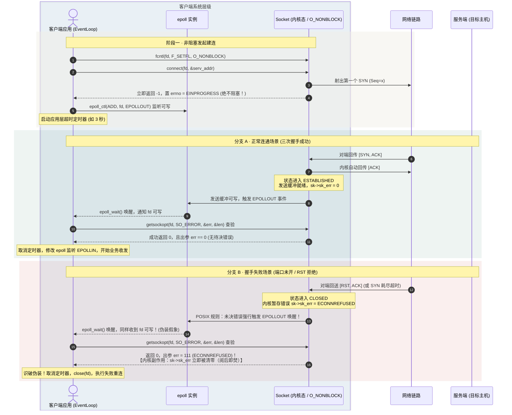
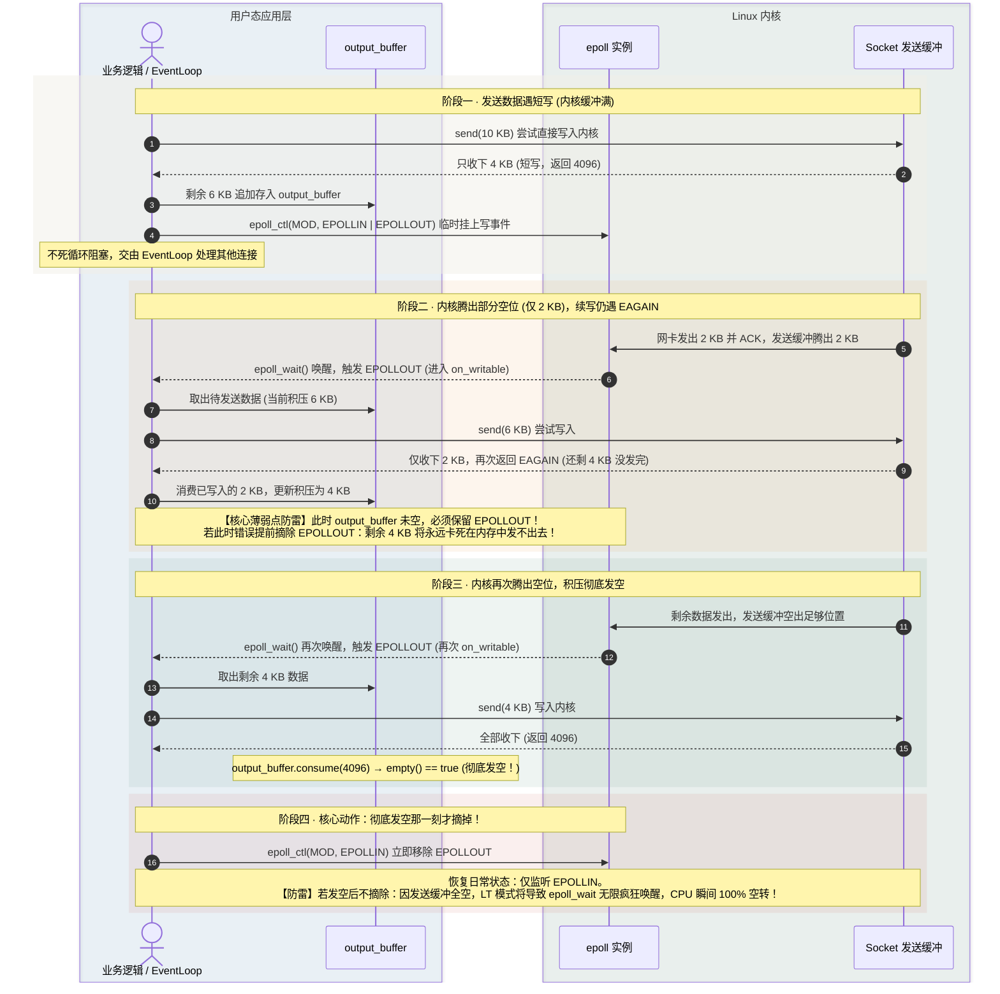

---
tags:
  - Linux
  - TCP-编程
---

# 8.12 非阻塞 connect 与健壮收发

## 1. 简介

阻塞 socket 适合教学，但真实服务通常使用非阻塞 socket 配合 [[3.Linux/7. 网络编程/06. I-O 模型与复用/13.4 epoll模型|epoll]]。非阻塞编程的核心不是“系统调用不阻塞”这么简单，而是要正确处理：

- `connect()` 返回 `EINPROGRESS`
- `read/write` 的短读、短写
- `EAGAIN` / `EWOULDBLOCK`
- 发送缓冲区积压和反压
- 对端关闭、错误事件和资源释放

> [!tip] 交互动画
> 本篇核心难点的过程可视化（EINPROGRESS→等可写→查 SO_ERROR 的成功/失败双路径 · 10KB vs 4KB 的短写与 output_buffer 续发 · 高低水位反压）：
> [▶ 在浏览器中打开动画](<图片/HTML/3.Linux/8. TCP 编程/8.12.1 非阻塞connect与健壮收发动画.html>)　·　更多见 [[网络编程·动画合集]]
> 也可直达单个场景：[非阻塞 connect](<图片/HTML/3.Linux/8. TCP 编程/8.12.1 非阻塞connect与健壮收发动画.html#scene=conn>) · [短写](<图片/HTML/3.Linux/8. TCP 编程/8.12.1 非阻塞connect与健壮收发动画.html#scene=sw>) · [反压](<图片/HTML/3.Linux/8. TCP 编程/8.12.1 非阻塞connect与健壮收发动画.html#scene=bp>)

![[图片/SVG/3_8_8_12_4.svg|1231]]

---

## 2. 设置非阻塞

```cpp
#include <fcntl.h> // 提供文件控制系统调用 fcntl 及标志位常量

int set_nonblock(int fd) {
    // 1. 获取（Get）当前 fd 原有的所有状态标志位
    int flags = fcntl(fd, F_GETFL, 0);
    if (flags < 0) return -1; // 获取失败（例如传入了非法或已关闭的 fd）

    // 2. 修改标志并设置（Set）回去
    return fcntl(fd, F_SETFL, flags | O_NONBLOCK);
}
```

面试里要注意：非阻塞通常应该在加入 epoll 前设置，尤其是 ET 模式必须配合非阻塞。

#### 补充：现代 Linux 的简化写法

在较新的 Linux（2.6.27+）中，如果想在一开始就得到非阻塞 socket，可以在创建时直接指定标志位，省去一次 `fcntl` 系统调用：

```cpp
// 创建时直接非阻塞
int fd = socket(AF_INET, SOCK_STREAM | SOCK_NONBLOCK, 0);

// 接受新连接时直接非阻塞
int client_fd = accept4(server_fd, nullptr, nullptr, SOCK_NONBLOCK);
```

不过在跨平台代码，或者需要动态切换套接字模式时，这段基于 `fcntl` 的经典函数仍然是不可或缺的基础设施。

---
## 3. 非阻塞 connect 流程

非阻塞 `connect()` 很少会立刻成功，常见返回是 `-1` 且 `errno == EINPROGRESS`，表示连接正在进行中。整个流程有四步，最容易被漏掉的是最后一步：

![[图片/SVG/3_8_8_12_1.svg|1231]]

```cpp
int ret = connect(fd, (sockaddr*)&addr, sizeof(addr));
if (ret == 0) {
    // 立即连接成功
} else if (errno == EINPROGRESS) {
    // 正在连接，等待 fd 可写
} else {
    // 立即失败
}
```

等待可写后，不能直接认为连接成功，必须用 `getsockopt(SO_ERROR)` 取最终结果：

```cpp
int err = 0;
socklen_t len = sizeof(err);

// 第一层校验：检查 getsockopt 系统调用本身是否成功
if (getsockopt(fd, SOL_SOCKET, SO_ERROR, &err, &len) < 0) {
    // 系统调用本身失败（例如传入了非法 fd 或野指针）
    perror("getsockopt 本身调用失败");
    close(fd);
    return -1;
}

// 第二层校验：检查套接字内部是否有挂起的待决错误
if (err == 0) {
    // 真正连接成功！
    // getsockopt 调用成功，同时 SO_ERROR 将套接字内部挂起的待决错误码提取写入 &err 中。
    // 读取到的错误码数值为 0，说明底层干干净净、没有错误码，三次握手顺利完成。
} else {
    // 连接彻底失败！
    // SO_ERROR 提取出了具体的错误原因（如 ECONNREFUSED、ETIMEDOUT）。
    errno = err; // 回填给全局 errno 方便统一报错与排障
    perror("connect 失败");
    close(fd);
    return -1;
}
```

### 3.1 深度拆解：getsockopt(SO_ERROR) 各参数含义

函数原型：
```cpp
int getsockopt(int sockfd, int level, int optname, void *optval, socklen_t *optlen);
```

| 参数 | 实参 | 职责与含义 |
| :--- | :--- | :--- |
| `sockfd` | `fd` | 需要查验的目标套接字文件描述符。 |
| `level` | `SOL_SOCKET` | 选项所在的协议层级。`SOL_SOCKET` 代表通用的**套接字层**，而非具体底层协议（如 IP/TCP）专属层。 |
| `optname` | `SO_ERROR` | **Socket Error**。指定获取该套接字内部当前暂存的**待决错误（Pending Error）**。 |
| `optval` | `&err` | 输出变量地址。内核负责把内部记录的待决错误码数值写入该指针指向的内存。 |
| `optlen` | `&len` | **值-结果参数**。调用前必须初始化为 `sizeof(err)`（告知内核缓冲区大小），函数返回后内核写回实际写入的字节大小。 |

### 3.2 必须区分的两层判断

1. **`getsockopt(...) < 0`（系统调用本身执行失败）**：
   表示向内核发起“查账”这个动作本身就失败了（返回 `-1`）。常见于传入了已关闭或未初始化的非法描述符（`EBADF`），或传入的指针指向了非法内存区域（`EFAULT`）。这是程序自身的基础 Bug，根本还没触及套接字的网络状态。
2. **`err == 0` vs `err != 0`（套接字真实网络状态）**：
   当 `getsockopt` 本身返回 `0` 证明查询成功后，真正的网络胜负由 `err` 决定：
   - **`err == 0`**：说明 `getsockopt` 成功调用，且 `SO_ERROR` 获取到的待决错误码为 `0`（无错误）。这证明三次握手期间链路完好无阻，对端正常回了 ACK，**连接真正建立成功**，后续可以安全收发数据；
   - **`err != 0`**：说明 `SO_ERROR` 提取到了真实的底层故障码。比如对端端口没开返回 RST 的 `ECONNREFUSED`、握手超时重传耗尽的 `ETIMEDOUT`、路由不可达的 `ENETUNREACH` 等，表明**连接已宣告失败**。

---

## 4. 为什么“可写”还不够（可写不等于成功）

三次握手完成后 socket 会变成可写。问题是**连接失败时它同样会被唤醒**——在 Berkeley 套接字规范和 Linux 实现中，一旦异步连接产生错误，内核为了防止上层事件循环无限挂起等待，也会**强行将该 socket 标记为可写（Linux 上甚至是可读可写一起报）**。

光看事件类型，成功和失败都表现为 `EPOLLOUT`。

![[图片/SVG/3_8_8_12_3.svg|1231]]

所以非阻塞 connect 的完整闭环流程是：

1. `connect()` 发起连接，返回 `-1` 且 `errno == EINPROGRESS`；
2. 用 `select` / `poll` / `epoll` 等待可写事件（`EPOLLOUT`）；
3. 唤醒后**立刻调用 `getsockopt(SO_ERROR)`** 提取待决错误；
4. 唯有 `err == 0` 才能正式确认连接就绪，进入业务逻辑。

漏掉第 3 步的后果很典型：失败的连接被当成建立成功，一路交给业务逻辑，直到第一次 `send()` 才报错——而那时错误信息已经和真正的原因（比如 `ECONNREFUSED`）对不上了。



> [!warning] SO_ERROR 具有“阅后即焚”特性
> 套接字内部的待决错误是**破坏性读取（Read-once and clear）**的。`getsockopt(..., SO_ERROR, ...)` 只要被调用一次，内核就会立即将套接字内部暂存的错误码清零。
>
> 如果代码在多处重复查询，只有第一次能拿到真正的错误原因（如 `ECONNREFUSED`），第二次读出来的 `err` 永远是 `0`。若用第二次读取的结果做分支判断，会致命地把一次早已失败的连接误判为连接成功！

### 4.1 超时得自己做

非阻塞 `connect()` 没有超时参数。内核自己的 SYN 重传能拖几十秒（受 `net.ipv4.tcp_syn_retries` 影响），对一个前台请求来说完全不可接受。

工程做法是把 fd 注册进 epoll 的同时挂一个定时器，到点还没拿到结果就 `close()` 掉重来：

```cpp
add_to_epoll(fd, EPOLLOUT);
timer_id = timer_queue.add(now + 3s, [fd] { close(fd); on_connect_timeout(); });
// 在 SO_ERROR 检查成功之后记得取消定时器
```

阻塞式 `connect()` 同样没有可移植的超时选项。Linux 上只能用 `TCP_SYNCNT` 粗略控制重试次数，真要精确控制就得改用非阻塞版本。

---

## 5. 健壮发送：处理短写

`send()` 返回成功，只表示一部分数据被拷贝进本机发送缓冲区，不表示全部业务消息已经发完，更不表示对端已经收到。

```cpp
ssize_t n = send(fd, buf + sent, total - sent, MSG_NOSIGNAL);
if (n > 0) {
    sent += n;
} else if (n < 0 && (errno == EAGAIN || errno == EWOULDBLOCK)) {
    // 发送缓冲区满，注册 EPOLLOUT，等下次可写
} else if (n < 0 && errno == EINTR) {
    // 被信号打断，重试
} else {
    // 连接出错，关闭
}
```

工程模型通常不是在一个函数里死循环把数据发完，而是给每条连接维护一块输出缓冲区：

![[图片/SVG/3_8_8_12_2.svg|1231]]

### 5.1 EPOLLOUT 必须用完就摘

这是短写处理与事件循环设计里最容易踩雷的一处。

在默认的水平触发（LT）模式下：
- **`EPOLLIN` 是常驻监听**：内核接收缓冲区里**有新数据到来**才会触发；平常没有新消息时，`epoll_wait()` 处于睡眠挂起状态，不消耗 CPU。
- **`EPOLLOUT` 只能是临时开关**：内核发送缓冲区里**只要有空闲空间**就会触发。

在正常的网络通信中，由于应用发完数据后内核迅速通过网卡将数据送出，内核发送缓冲区绝大部分时间都是**完全空闲（全是可写空位）**的。如果常驻挂着 `EPOLLOUT`，`epoll_wait()` 几乎不会发生任何阻塞，每秒钟被反复唤醒数百万次，导致事件循环瞬间跑满单核 CPU（100% 空转死循环）。

因此，网络框架中对 `EPOLLOUT` 的生命周期有着极其严格的纪律：

#### 两种挂载场景对比

1. **非阻塞建连时（[[#4. 为什么“可写”还不够（可写不等于成功）|第四节时序图]]）**：`connect()` 立即返回 `EINPROGRESS`，应用挂上 `EPOLLOUT` 作为“握手完成的通知哨”。握手结束（查验 `SO_ERROR` 确认成功或失败）后，它的信号弹使命即告终，必须改回 `EPOLLIN` 或关闭连接。
2. **数据发送短写时（本节）**：日常状态只监听 `EPOLLIN`。只有当业务调用 `send()` 一次性没塞完数据（发生短写），将剩余字节塞入用户态应用层 `output_buffer` 后，才向 epoll 临时挂上 `EPOLLOUT`；**一旦 `output_buffer` 全部发空，必须在发空的那一刻立刻将其从 epoll 中摘除**！

#### 动态生命周期时序



#### 配套代码实现（发送入口与可写回调）

日常数据发送由 `send_data()` 主动发起，未发完的才进入 `output_buffer`；后续由 `on_writable()` 负责在内核就绪时清空积压，并在清空瞬间摘掉 `EPOLLOUT`：

```cpp
// 1. 业务主动发送数据入口
// 参数：c 为连接对象，data 为应用层待发数据指针，len 为本次要发送的字节总数
void send_data(Connection* c, const void* data, size_t len) {
    ssize_t nwrote = 0;      // 记录本次系统调用实际写入内核缓冲区的字节数
    size_t remaining = len;  // 记录尚未写入内核、仍待处理的剩余字节数

    // 【核心原则 1：严格维护 FIFO 顺序性与 Fast Path（近道）】
    // 检查 output_buffer 是否为空：
    // - 它可以是刚建连后的第 1 次发送，也可以是第 10 次、第 10000 次发送；
    // - 只要此前没有未发完的积压数据（旧账全清），output_buffer 就是 empty() == true。
    //
    // 【为什么必须检查 empty()？】
    // 若前面还有数据没发完（!empty），新来的数据绝对不能直接调用 send() 写入内核！
    // 否则新数据会插队抢在旧数据尾巴之前进入内核发送缓冲区，导致 TCP 字节流乱序（对端协议解包直接崩溃）。
    // 只有在没有排队积压的前提下，新数据才能走 Fast Path，尝试直接写入内核。
    if (c->output_buffer.empty()) {
        // MSG_NOSIGNAL：防止对端已异常断开（收到 RST）时内核向本进程投递 SIGPIPE 信号导致进程闪退
        nwrote = send(c->fd, data, len, MSG_NOSIGNAL);

        if (nwrote >= 0) {
            remaining -= nwrote;
            if (remaining == 0) {
                // 【最理想分支：一次性全发完】
                // 100% 数据已直接交由内核接管，无需内存拷贝进 output_buffer，
                // 更无需做 epoll_ctl 系统调用去修改事件。这是网络库吞吐量最高的近道。
                return;
            }
            // 若 nwrote > 0 但 remaining > 0，说明遭遇“短写”，内核缓冲满了，剩下的进入下方积压逻辑
        } else {
            // 系统调用返回 -1
            nwrote = 0; // 重置为 0，确保下方计算剩余数据偏移量与长度准确无误
            if (errno != EAGAIN && errno != EWOULDBLOCK) {
                // 致命错误（如 ECONNRESET、EPIPE 等），对端已断开或网络异常
                close_connection(c);
                return;
            }
            // 若 errno 是 EAGAIN/EWOULDBLOCK，说明内核发送缓冲区此时连 1 字节空位都没有
            // 属于正常非阻塞暂时写满现象，不报错，继续往下走应用层积压排队逻辑
        }
    }

    // 【核心原则 2：短写保护与开启写事件监听】
    // 运行到此处存在两种可能：
    // 1. 原本 output_buffer 就有排队旧账，新数据不能插队，直接全量追加到队尾；
    // 2. 原本为空，但刚才 send() 遭遇短写，内核只吃下一部分（或 1 字节都没吃下），还有剩余数据。
    //
    // 将未写入内核的剩余字节追加到应用层 output_buffer 队尾（在内存中暂存，确保数据不丢失）
    c->output_buffer.append(static_cast<const char*>(data) + nwrote, remaining);

    // 关键系统调用：向 epoll 注册或修改该 fd 的监听事件，挂上 EPOLLOUT
    // 告诉内核：“等你把网络包发出、发送缓冲腾出可用空位时，通过 epoll_wait 唤醒我来续写”
    modify_epoll(c->fd, EPOLLIN | EPOLLOUT);
}

// 2. epoll_wait 唤醒并检测到 EPOLLOUT 事件时的回调处理
void on_writable(Connection* c) {
    // 【核心原则 3：循环尽力清空 output_buffer】
    // 只要应用层积压缓冲区里还有数据，就不断循环尝试写入内核
    while (!c->output_buffer.empty()) {
        ssize_t n = send(c->fd, c->output_buffer.data(),
                         c->output_buffer.size(), MSG_NOSIGNAL);

        if (n > 0) {
            // 成功向内核塞入 n 个字节，从应用层 output_buffer 中消费/平移这 n 个字节
            c->output_buffer.consume(n);
            continue; // 继续下一轮循环，尝试把 output_buffer 里的剩余数据也塞进去
        }

        if (n < 0 && (errno == EAGAIN || errno == EWOULDBLOCK)) {
            // 【核心薄弱点防雷：数据未发完，绝不能提前摘除 EPOLLOUT！】
            // 内核缓冲区再次写满了，但此时 output_buffer 里面依然有积压数据。
            // 必须【保持监听 EPOLLOUT】，直接 return 退出回调，等待内核下次腾出空位再次唤醒；
            // 若在此处错误地提前摘掉 EPOLLOUT，剩余数据将失去后续唤醒源，永远死锁在内存中发不出去！
            return;
        }

        if (n < 0 && errno == EINTR) {
            // 被系统慢信号（如 SIGALRM）打断，不是真正的网络错误，直接重试当前循环
            continue;
        }

        // 其它致命错误（如 EPIPE、ECONNRESET）
        close_connection(c);
        return;
    }

    // 【核心原则 4：发空的那一刻，必须立刻摘掉 EPOLLOUT！】
    // 跳出 while 循环意味着 output_buffer.empty() == true，所有积压数据已彻底写入内核！
    // 此时内核发送缓冲区全空，若继续挂着 EPOLLOUT，LT 模式下 epoll_wait 将以微秒级疯狂唤醒，
    // 导致事件循环瞬间陷入 100% CPU 满载空转。
    // 因此必须在发空的这一瞬间，将监听事件还原为仅监听可读：EPOLLIN
    modify_epoll(c->fd, EPOLLIN);

    // 【核心原则 5：优雅关闭（Graceful Shutdown）】
    // 如果业务层此前调用过 close()（置了 closing = true 标记），
    // 绝不能在还有数据未发完时强行 close(fd) 截断，必须等积压数据全部安全写入内核的这一刻，
    // 再调用 shutdown(SHUT_WR) 向对端发送 FIN 报文，启动 TCP 正常挥手。
    if (c->closing) {
        shutdown(c->fd, SHUT_WR);
    }
}
```

> [!note] ET 模式下是否需要摘除？
> 边缘触发（ET）模式只在状态由不可写变可写时通知一次，表面上不会像 LT 模式那样因空闲而死循环空转。但工程实践中同样必须摘除：如果不摘除，后续业务再次发送数据时，很难清晰判断当前套接字是否处于可写边缘，导致状态机混乱、容易漏发事件。无论 LT 还是 ET，“数据发空即摘除 `EPOLLOUT`” 都是最健壮的通用范式。

### 5.2 要写完再关

上面那段代码最后一行值得单独说：`output_buffer` 里还压着数据时直接 `close()`，剩下的数据就被丢掉了，对端看到的是一个突然截断的响应。

所以优雅关闭不能写成“业务处理完就 `close()`”，而要把连接标记成“待关闭”，等 `output_buffer` 发空之后再 `shutdown(SHUT_WR)`，最后才 `close()`。也就是说，**关闭动作要挂在写完成的回调里**。

---

## 6. 健壮接收：读到 EAGAIN

在 ET 模式下，一次事件只代表“状态从不可读变成可读”。如果只读一次就退出，缓冲区里剩余的数据可能再也不会触发新事件。

```cpp
while (true) {
    ssize_t n = recv(fd, buf, sizeof(buf), 0);
    if (n > 0) {
        // 追加到输入缓冲区，交给协议解析器
    } else if (n == 0) {
        // 对端正常关闭
        close(fd);
        break;
    } else if (errno == EAGAIN || errno == EWOULDBLOCK) {
        // 已经读空
        break;
    } else if (errno == EINTR) {
        continue;
    } else {
        close(fd);
        break;
    }
}
```

这也是 [[13.4 epoll模型#8.2 边缘触发（Edge Triggered, ET）|epoll ET]] 必须配合非阻塞循环读写的原因。

---

## 7. 反压

反压是指下游处理不过来时，上游不能无限发送。

TCP 服务器里常见反压点：

- 对端接收慢，本端发送缓冲区堆积
- 本端业务处理慢，输入缓冲区堆积
- 线程池任务堆积，事件循环仍不断读入新请求

基本策略：

| 场景 | 处理 |
|:---|:---|
| 输出缓冲区过大 | 暂停读取该连接，避免继续产生响应 |
| 输入缓冲区过大 | 关闭连接或限速 |
| 线程池队列过长 | 拒绝请求、降级或返回忙 |
| 长时间不可写 | 定时器关闭慢连接 |

具体做法是给 `output_buffer` 设一对**高低水位**（前面那张图的 C 部分）：涨过高水位就把这条连接的 `EPOLLIN` 摘掉，不再读新请求，也就不会再产生新响应；跌回低水位再加回来。用两条线而不是一条，是为了避免在阈值附近反复开关。

要注意反压最终会一路传导回对端：本端不读 → 接收缓冲区满 → `rwnd` 降到 0 → 对端 `send()` 被卡住。整条链路的机制见 [[8.8 流控制]]。这是好事——它把“我处理不动了”如实地告诉了上游，而不是把请求堆在内存里直到 OOM。

---

## 8. 常见 errno

| errno | 含义 | 常见处理 |
|:---|:---|:---|
| `EINPROGRESS` | 非阻塞 connect 正在进行 | 等待可写后查 `SO_ERROR` |
| `EAGAIN/EWOULDBLOCK` | 现在不能读/写 | 等下次事件 |
| `EINTR` | 被信号中断 | 通常重试 |
| `ECONNRESET` | 对端 RST | 关闭连接 |
| `EPIPE` | 对端已关闭还继续写 | 关闭连接，避免 `SIGPIPE` |
| `ETIMEDOUT` | 连接或发送超时 | 关闭或重试 |

---

## 9. 面试问法

| 问题 | 回答要点 |
|:---|:---|
| 非阻塞 connect 返回 `EINPROGRESS` 是失败吗 | 不是，表示连接进行中 |
| fd 可写是否代表 connect 成功 | 不一定，要查 `SO_ERROR` |
| send 成功是否表示对端收到 | 不是，只表示本机内核接收了部分数据 |
| ET 模式为什么要读到 EAGAIN | 否则剩余数据可能没有下一次通知 |
| 发送缓冲区满怎么办 | 保存未发送数据，关注 EPOLLOUT，做反压 |
| EPOLLOUT 可以一直注册着吗 | 不行，LT 下会把事件循环变成空转 |
| 非阻塞 connect 怎么控制超时 | 内核不提供，自己挂定时器 |

---

## 10. 关键要点

1. **非阻塞 connect 的成功判断必须依赖 `getsockopt(SO_ERROR)`**，可写事件本身分不出成功还是失败；这个错误取一次就被清零
2. **connect 的超时得自己挂定时器**，内核不给这个参数
3. **短读短写是正常现象，不是异常分支**
4. **`EAGAIN`/`EWOULDBLOCK` 表示当前不能继续，不代表连接坏了**
5. **ET 模式必须非阻塞，并循环读写到 `EAGAIN`**
6. **`EPOLLOUT` 用完就摘**，`output_buffer` 一发空立刻 `EPOLL_CTL_MOD` 去掉，否则 LT 模式下 CPU 空转
7. **优雅关闭挂在写完成回调里**，`output_buffer` 还有数据就直接 `close()` 会丢响应
8. **高性能服务要为每条连接维护输入/输出缓冲区，并用高低水位做反压**

---

## 11. 相关笔记

- [[3.6 常见 errno 错误码速查]] - 系统与网络编程常见 errno 全局速查与排障
- [[8.11 TCP连接关闭与异常状态]] - 关闭、RST、SIGPIPE、CLOSE_WAIT
- [[8.9 TCP的粘包和拆包]] - 输入缓冲区与应用层拆包状态机
- [[8.7 IO缓冲]] - TCP 发送缓冲区与接收缓冲区
- [[8.8 流控制]] - 反压最终怎么传导回对端
- [[13.4 epoll模型]] - epoll 工程陷阱与 ONESHOT
- [[12.7 条件变量与线程池]] - 线程池积压与反压

---

