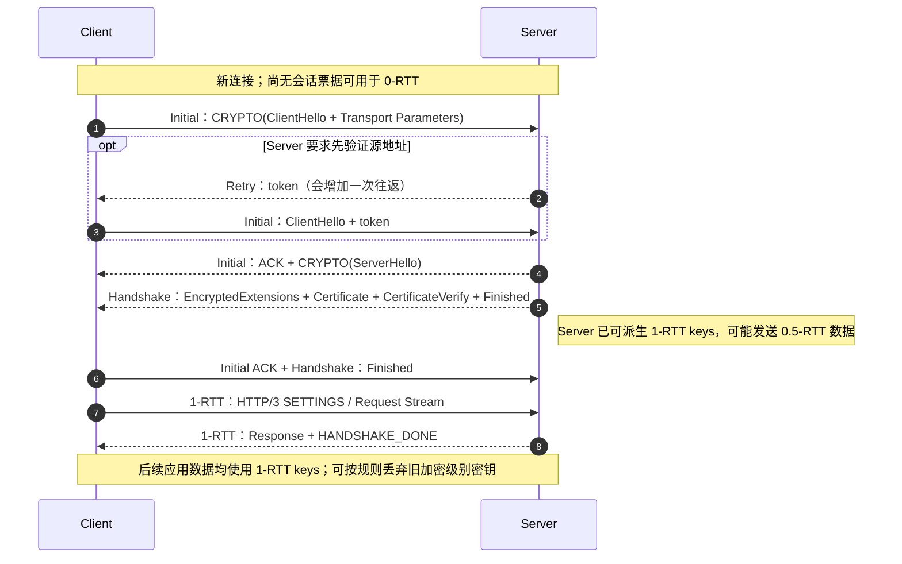
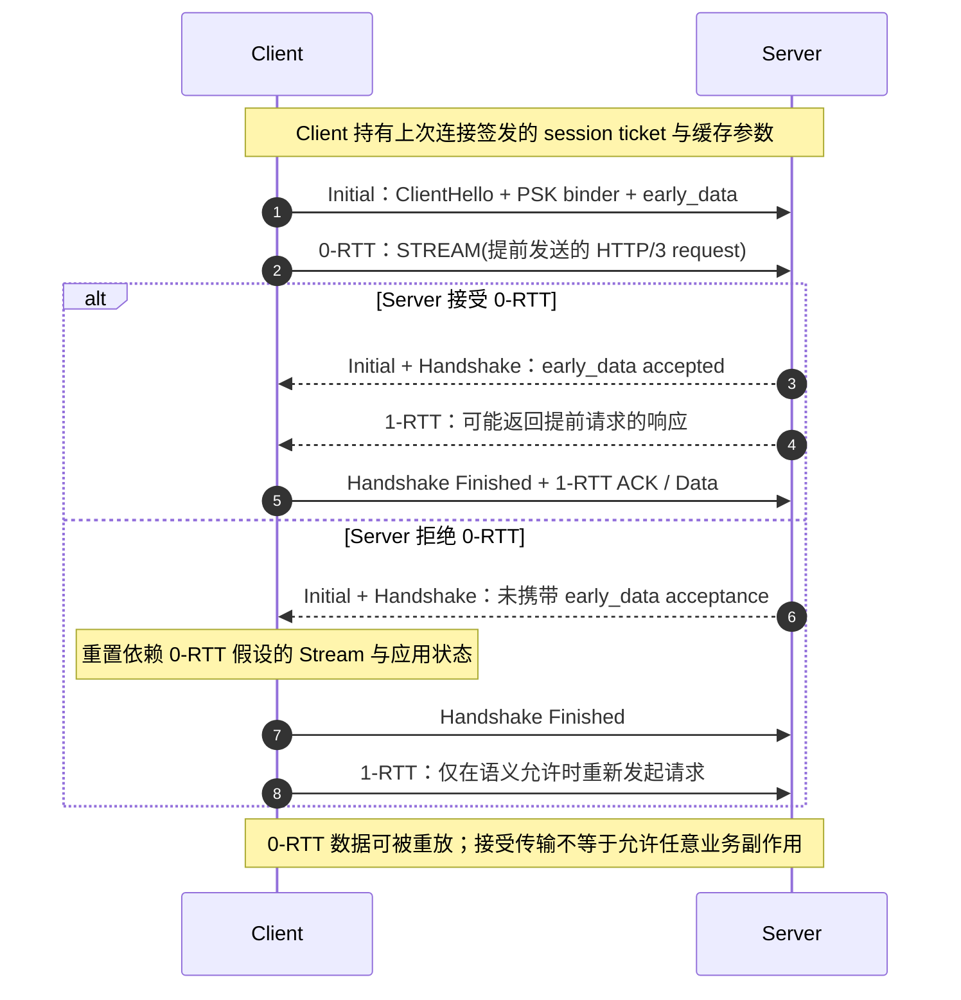
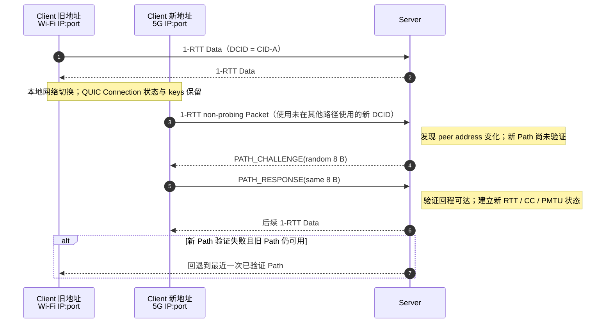
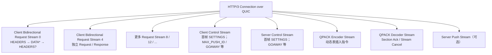
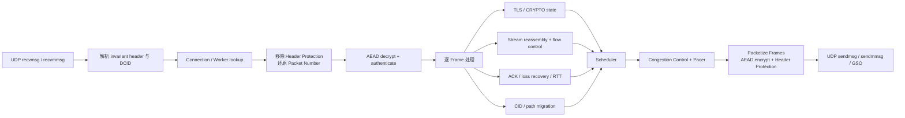

---
tags:
  - Linux
  - UDP-编程
  - QUIC
  - HTTP3
  - TLS1.3
  - 网络协议
aliases:
  - QUIC 与 HTTP/3
  - HTTP/3 深度解析
阅读次数: 0
---

# 9.5 QUIC 协议与 HTTP/3 深度解析

[[9.1 UDP原理]] 说明了 UDP 只提供报文边界与校验和，不负责连接、可靠交付、流量控制和拥塞控制。QUIC 的关键思想不是“把 TCP 原样搬到 UDP 上”，而是利用 UDP 提供的最小内核接口，在用户态重新组合：

- TLS 1.3 握手与密钥派生；
- 可靠传输、ACK、丢包检测和拥塞控制；
- 一条连接内的多条独立 Stream；
- Connection ID 驱动的连接标识和路径迁移；
- 可扩展的 Packet / Frame 线格式。

HTTP/3 再把 HTTP 语义映射到 QUIC Stream，并使用 QPACK 压缩字段。因此，二者的职责关系是：

```text
HTTP 语义（method / status / fields / content）
                    ↓
HTTP/3（HEADERS / DATA / SETTINGS / QPACK）
                    ↓
QUIC Stream + QUIC Frame + TLS 1.3
                    ↓
QUIC Packet
                    ↓
UDP Datagram
                    ↓
IP
```

> [!tip] 前置知识
> 阅读本篇前应能区分 [[7.5 传输层协议：TCP与UDP|TCP 与 UDP 的传输语义]]、理解 [[7.6 TCP协议基础|TCP 的可靠有序字节流]]，并知道 [[7.4 应用层协议#2.4 版本演进：文本行 → 二进制帧 → 自带传输层|HTTP 从 1.1 到 2/3 的演进目标]]。

> [!note] 标准与教材版本
> 本篇以 **IETF QUIC v1**（RFC 9000 / 9001 / 9002）、**HTTP/3**（RFC 9114）和 **QPACK**（RFC 9204）为线格式依据。项目 Sources 中《Computer Networks》第 6 版和《Systems Performance》第 2 版能够支撑 QUIC 的动机与整体模型，但书中仍保留了标准化阶段的历史措辞；协议状态、Packet 字段和安全边界以已发布 RFC 为准。QUIC v2（RFC 9369）与 v1 对应用暴露的能力基本相同，主要通过改变版本相关的线格式细节来对抗协议僵化。

---

## 1. 先建立五层对象模型

理解 QUIC 时最容易犯的错误，是把 Connection、Path、Stream、Packet 和 Frame 混为一谈。

| 对象 | 标识 / 边界 | 主要职责 | 丢失时发生什么 |
| --- | --- | --- | --- |
| **Connection** | 双方状态、密钥与 Connection ID 集合 | TLS、拥塞控制、流控、Stream 管理、迁移 | 整条连接失效或被关闭 |
| **Path** | 本地地址与远端地址形成的 UDP 网络路径 | 承载 Packet、维护路径 MTU / RTT / ECN 状态 | 可探测、回退或迁移到其他路径 |
| **Stream** | 62-bit Stream ID | 一条有序字节通道；可单向或双向 | 只阻塞该 Stream 的缺口之后数据 |
| **Packet** | 某 Packet Number Space 内的 Packet Number | 加密与 ACK 的基本单位，封装多个 Frame | Packet 本身不按原样重发 |
| **Frame** | Packet 内的类型与字段 | 携带 STREAM、ACK、CRYPTO、流控、迁移等信息 | 需要可靠性的语义会被重新装入新 Packet |

QUIC Connection 仍然通过 IP 和 UDP 路由；Connection ID 并没有取代 IP 地址和端口。它取代的是“把四元组或五元组当作连接唯一身份”的做法。传统连接标识见 [[7.3 端口与五元组|五元组]]。

> [!important] QUIC 不是缩写要求
> Google 早期文档曾使用 “Quick UDP Internet Connections” 这一展开；IETF QUIC 标准把 **QUIC 作为协议名称**，不要求把它继续解释成首字母缩写。

---

## 2. QUIC 为什么不继续使用 TCP + TLS + HTTP/2

传统 HTTPS 栈通常是三层独立状态机：

```text
TCP 建连 → TLS 握手 → HTTP/2 建立应用层多路复用
```

这种分层清楚，但也形成四个实际问题。

### 2.1 建连延迟被串联

全新连接需要先完成 TCP 三次握手，再交换 TLS 握手消息，应用请求通常必须等待前面的阶段推进。TCP Fast Open 和 TLS 1.3 已分别减少等待，但它们仍是跨层组合，部署和中间盒兼容性复杂。

QUIC 把 TLS 1.3 的握手数据装入 CRYPTO Frame，并由 QUIC 自己可靠传输。传输参数、加密级别和应用数据的可发送时机由同一条连接状态机协调，因此新连接可在约 1 RTT 后由客户端发送 1-RTT 应用数据；恢复连接还可尝试 0-RTT Early Data。

### 2.2 HTTP/2 的多路复用仍受 TCP 字节流约束

HTTP/2 能在一个 TCP Connection 上交错多条 HTTP Stream，但 TCP 只向上层交付一个全局有序字节流。任何 TCP Segment 缺失都会让缺口后的字节暂时不可见；这些字节即使属于别的 HTTP/2 Stream，也要一起等待。

### 2.3 四元组变化会让 TCP 连接失效

移动端从 Wi-Fi 切换到蜂窝网络、NAT 重绑定 UDP 端口、主机增加新 IP 时，旧 TCP 四元组不再成立。QUIC 让 Connection ID 作为逻辑连接身份，并对新路径做可达性验证。NAT 映射变化的背景可回看 [[9.4 UDP穿透|UDP 穿透与 NAT]]。

### 2.4 传输层演进容易被中间盒“固化”

TCP 线格式在内核和大量中间盒中实现，新增选项可能被删除、误判或阻断。QUIC 大部分头部与 Payload 受保护，协议逻辑通常在用户态库中升级；UDP 外壳也让新实现不必等待操作系统内核提供新的传输 API。

这并不表示 UDP 天然更可靠或更快。QUIC 的性能来自**重新设计并完整实现了 TCP 原本承担的许多机制**，不是来自“少写了几行系统调用”。

---

## 3. Stream：一条连接内的独立有序字节通道

### 3.1 Stream ID 同时编码发起方和方向

Stream ID 是一个 62-bit 整数，最低两位决定类型：

| 最低两位 | 发起方 | 方向 | 首个 Stream ID | 后续编号 |
| --- | --- | --- | ---: | --- |
| `00` | Client | Bidirectional | 0 | 4、8、12… |
| `01` | Server | Bidirectional | 1 | 5、9、13… |
| `10` | Client | Unidirectional | 2 | 6、10、14… |
| `11` | Server | Unidirectional | 3 | 7、11、15… |

Stream 不需要额外握手即可创建，但能打开多少条 Stream 受对端通过 `initial_max_streams_bidi` / `initial_max_streams_uni` 等 Transport Parameter 授予的额度限制。

### 3.2 Stream 的可靠性由 offset，而不是 Packet Number 表达

STREAM Frame 的核心字段可以抽象为：

```text
Stream ID + Offset + Length + FIN + Data
```

例如 Stream 4 的 `[0, 1000)` 字节装在 Packet 20 中，`[1000, 2000)` 装在 Packet 24 中。Packet 20 丢失而 Packet 24 到达时：

- Packet 24 可以被解密、ACK；
- Stream 4 已收到 `[1000, 2000)`，但应用仍需等待 `[0, 1000)`；
- 其他 Stream 的完整数据可以继续交付；
- 发送端把丢失的 Stream 4 字节重新装进一个使用**新 Packet Number** 的 Packet。

因此：

```text
Packet Number：描述发送次序、ACK 与丢包恢复
Stream Offset：描述一条 Stream 内字节的逻辑位置
```

二者绝不能混用。

### 3.3 每条 Stream 与整条 Connection 有两级流控

接收端通过以下 Frame 增加发送额度：

- `MAX_STREAM_DATA`：某一 Stream 可接收的累计字节上限；
- `MAX_DATA`：整条 Connection 所有 Stream 可接收的累计字节上限；
- `MAX_STREAMS`：允许新建的 Stream 数量。

发送端若耗尽额度，可以发送 `STREAM_DATA_BLOCKED`、`DATA_BLOCKED` 或 `STREAMS_BLOCKED` 作为诊断信号，但这些 Frame 本身不会创造额度。

> [!warning] 流量控制不等于拥塞控制
> 流量控制保护**接收端内存与消费能力**；拥塞控制保护**网络路径**。QUIC 的 Stream 流控可独立，但默认拥塞控制、RTT、Pacing 和 `bytes_in_flight` 仍属于 Connection / Path 级共享状态。

### 3.4 FIN、RESET_STREAM 与 STOP_SENDING

- `FIN`：发送方正常结束这一发送方向，最终 offset 随之确定；
- `RESET_STREAM`：发送方放弃继续发送，并给出 Application Error Code 与 Final Size；
- `STOP_SENDING`：接收方要求对端停止发送，通常促使对端返回 `RESET_STREAM`。

双向 Stream 的发送方向和接收方向是两个相对独立的生命周期。关闭请求方向不等于关闭响应方向，这与流式 RPC 中的 half-close 心智模型相同。

### 3.5 可选的 QUIC DATAGRAM

RFC 9221 额外定义了不可靠 `DATAGRAM` Frame：它不重传、不提供显式流控，但仍受连接拥塞控制。HTTP/3 的普通请求与响应仍使用可靠 Stream；实时媒体、游戏状态或 WebTransport 等场景才可能选择 DATAGRAM 扩展。

---

## 4. QUIC 怎样消除跨 Stream 的传输层 HOL

![[图片/SVG/3_9_9_5_2.svg|1100]]

### 4.1 TCP + HTTP/2：一个缺口阻塞所有上层 Stream

```text
HTTP/2 Stream A ┐
HTTP/2 Stream B ├─交错编码→ 单一 TCP byte stream → 内核按序交付
HTTP/2 Stream C ┘
```

即使 TCP Segment 3 只包含 Stream A 的一部分，Segment 4、5 中属于 B、C 的字节也不能越过全局 TCP 缺口交给 HTTP/2 解析器。

### 4.2 QUIC + HTTP/3：排序作用域缩小到每条 Stream

QUIC Packet 可以携带不同 Stream 的 STREAM Frame。接收端先按 Packet 独立解密，再依据 `Stream ID + Offset` 放入各自重组队列：

```text
Stream A 缺 [1000, 2000) → A 的后续字节等待
Stream B 数据完整          → B 继续交付
Stream C 数据完整          → C 继续交付
```

这消除的是 **transport-layer cross-stream HOL**，不是所有形式的等待。

### 4.3 仍然存在的阻塞

| 阻塞来源 | 是否仍存在 | 原因 |
| --- | --- | --- |
| 同一 Stream 内有序交付 | 是 | 缺失 offset 前后的字节不能颠倒交给应用 |
| Connection 级拥塞控制 | 是 | 丢包使 cwnd / pacing 降低，所有 Stream 的发送机会都受影响 |
| Connection 级 `MAX_DATA` | 是 | 总额度耗尽时，多条 Stream 都可能停住 |
| 一个丢失 Packet 同时装了多条 Stream 的数据 | 是 | 这些 Frame 的语义都需恢复，但已完整收到的其他 Packet 仍可推进 |
| QPACK 动态表依赖 | 可能 | 请求头引用尚未到达的动态表项时，仅相关请求 Stream 暂时 blocked |
| 应用依赖 | 是 | HTML 等待 CSS、RPC B 依赖 RPC A，与传输协议无关 |
| CPU、NIC、Socket 队列饱和 | 是 | 共享资源没有因 Stream 独立而消失 |

> [!important] 准确表述
> 不要说“QUIC 完全解决了 HOL”。应说：**QUIC 取消了 TCP 单一有序字节流造成的跨 Stream HOL，但保留同 Stream 有序性，并仍共享拥塞控制和底层资源。**

---

## 5. 1-RTT 握手：新连接怎样把 TLS 融入 QUIC

下面省略 ACK-only Packet、Packet 合并和重传，只展示关键加密级别。



### 5.1 Initial Packet 的保护不等于保密

Client 第一个 Initial 的密钥由版本固定 salt 与初始 Destination Connection ID 派生。任何能看到该 DCID 的观察者也能派生 Initial keys，因此 Initial Protection 的主要作用是形成统一受保护线格式、避免误解析和支撑握手，不应把 ClientHello 当作对旁路观察者保密的数据。

真正依赖 TLS 协商秘密的保护从 Handshake keys 与 1-RTT keys 开始。服务器身份由 TLS 1.3 证书或所选认证方式验证，而不是由 Connection ID 或 Retry token 验证。

### 5.2 “Handshake complete” 与 “Handshake confirmed” 不完全相同

- **TLS handshake complete**：本端已经处理所需 TLS Finished，并可正常使用 1-RTT keys；
- **Handshake confirmed**：Server 在本地 TLS Handshake Complete 时即确认，并尽快发送 `HANDSHAKE_DONE`；Client 通常在收到该 Frame 后确认，也可以在收到自己 1-RTT Packet 的 ACK 时按标准规则提前确认。

在确认之前，端点不能主动进行 Connection Migration，也不能过早丢弃仍可能用于重传的握手密钥。

### 5.3 Retry 解决什么，不解决什么

Retry 让 Server 在分配较多状态、发送证书链之前，要求 Client 证明自己能够接收发送到所声明源地址的数据。它主要缓解源地址伪造与放大攻击：

```text
Client Initial → Server Retry(token) → Client Initial(token) → 正常握手
```

代价是额外 RTT。Retry token 不是用户登录凭证，也不代替 TLS Server Authentication。

---

## 6. 0-RTT：恢复连接时把请求放进第一个 flight

0-RTT 只适用于此前已经通信并保存了恢复状态的 Client。典型状态包括 TLS Session Ticket / PSK，以及与该票据绑定、仍可安全沿用的 QUIC Transport Parameter 和应用配置。



### 6.1 0-RTT 减少了什么

它消除的是“Client 等待 Server flight 后才能发送恢复请求”的等待。它不保证：

- Server 在 0 个 RTT 内返回响应；
- Early Data 一定被接受；
- 网络没有丢包；
- 业务操作只执行一次；
- 恢复状态与当前 Server 配置仍兼容。

Server 的响应使用 1-RTT keys；Client 仍需处理 Server 的握手 flight 才能安全解密和确认连接。

### 6.2 为什么 0-RTT 有 Replay Risk

攻击者可能复制先前观察到的 0-RTT 数据并再次发送。TLS 的会话恢复和 Server 的 anti-replay 机制只能降低风险，不能为任意分布式部署提供绝对 exactly-once 保证。

HTTP 客户端在缺少更强业务知识时：

- 可以考虑在 0-RTT 中发送 safe method；
- 不应发送 unsafe method 或安全性未知的操作；
- 收到 `425 Too Early` 后，重试必须等到握手完成，并使用非 Early Data；
- 支付、下单、扣库存、生成不可撤销令牌等操作需要幂等键、去重表或直接禁用 0-RTT。

> [!warning] 幂等与“看起来是 GET”不是同一件事
> URI 使用 GET 并不能自动证明后端没有副作用。是否允许 0-RTT 必须由应用语义、鉴权流程、票据绑定范围和多实例 anti-replay 策略共同决定。

### 6.3 Transport 接受与 Application 接受是两层判断

Server 可以在 TLS / QUIC 层接受 0-RTT，但应用仍因权限、版本、缓存状态或 replay 风险返回错误；反之，若 TLS 层拒绝 0-RTT，Server 不得处理其中的应用数据。库应把 `early_data_attempted`、`accepted`、`rejected` 暴露给上层，不能把“发送成功”误当成“业务已执行”。

---

## 7. UDP Datagram、QUIC Packet 与 QUIC Frame 的线格式

![[图片/SVG/3_9_9_5_1.svg|1100]]

### 7.1 一个 UDP Datagram 可以合并多个 QUIC Packet

每个 QUIC Packet 都有独立的 Packet Number、加密级别和认证标签。握手时常把 Initial、Handshake 和 1-RTT Packet 合并进一个 UDP Datagram，减少系统调用与 flight 数量。

- Long Header Packet 有 `Length`，接收端可以定位下一个 Packet；
- Short Header Packet 没有显式 Length，因此只能放在该 UDP Datagram 的最后；
- Retry 和 Version Negotiation 也没有可供后续 Packet 定位的 Length，不能与其他 Packet 共同 coalesce；
- 同一 Datagram 中的 Packet 必须分别解密、处理和 ACK。

### 7.2 Long Header：建连和版本协商阶段

QUIC v1 Long Header 的公共骨架是：

```text
First Byte
Version (32 bit)
DCID Length + Destination Connection ID
SCID Length + Source Connection ID
Type-Specific Fields
```

v1 的 Long Packet Type：

| Type bits | Packet Type | 加密 / 用途 | Packet Number |
| --- | --- | --- | --- |
| `00` | Initial | ClientHello、ServerHello、Initial ACK | 有 |
| `01` | 0-RTT | Client Early Application Data | 有 |
| `10` | Handshake | TLS 后续握手消息 | 有 |
| `11` | Retry | 地址验证 token 与 Integrity Tag | 无 |

Initial 还包含 Token Length / Token；Initial、0-RTT、Handshake 包含 Length、1～4 B truncated Packet Number 和 Protected Payload。Retry 是特殊格式，不能按普通 Long Header Payload 解析。

### 7.3 Short Header：连接稳定后的 1-RTT 数据

Short Header 删去 Version、SCID 和显式 Length，以降低稳态开销：

```text
First Byte：Header Form / Fixed / Spin / Reserved / Key Phase / PN Length
Destination Connection ID（长度由连接上下文已知）
Packet Number（1～4 B，受 Header Protection）
1-RTT Protected Payload（Frame + AEAD Tag）
```

`Key Phase` 支持 1-RTT Key Update；`Spin Bit` 是可选的被动 RTT 测量信号，端点可以按隐私策略禁用，不能把它当作可靠的逐连接 RTT 遥测接口。

### 7.4 哪些字段可见，哪些字段受保护

- IP / UDP 头始终对网络可见；
- Header Form、Version、Connection ID 等路由所需字段通常可见；
- First Byte 的部分低位与 Packet Number 受 Header Protection；
- Payload 中的 Frame 和数据由 AEAD 加密认证；
- Packet Number 参与构造 nonce，所以同一 Packet Number Space 内绝不能重用。

---

## 8. Packet Number Space、ACK Frame 与丢包恢复

### 8.1 为什么有三个 Packet Number Space

| Packet Number Space | 包含的 Packet | ACK 从哪里返回 |
| --- | --- | --- |
| Initial | Initial | Initial Packet 中的 ACK |
| Handshake | Handshake | Handshake Packet 中的 ACK |
| Application Data | 0-RTT、所有使用 1-RTT key 的 Packet | 1-RTT ACK；0-RTT 自身不能携带 ACK |

每个 Space 都从 0 开始并独立递增，所以在线路上可能同时存在：

```text
Initial PN 0
Handshake PN 0
Application PN 0
```

ACK 的所在 Packet 隐式给出被确认的 Space。这样旧加密级别的 ACK / 丢包恢复不会与新加密级别混淆。RTT 与 Congestion Control 状态则跨 Space 统一维护。

### 8.2 Packet Number 为什么只发送 1～4 B

逻辑 Packet Number 范围是 `0 .. 2^62-1`，但头部只携带其低 8、16、24 或 32 bit。接收端依据“预计下一个 Packet Number”还原最接近的完整值。

Packet Number 严格递增但允许跳号，且重传必须使用新值。这消除了 TCP 中“相同 Sequence Number 的数据究竟是旧传输还是重传”的一部分歧义。

### 8.3 ACK Frame 用多个 Range 表达选择性确认

ACK Frame 的主要字段：

```text
Largest Acknowledged
ACK Delay
ACK Range Count
First ACK Range
[Gap + ACK Range]...
[ECN Counts]
```

假设接收端已有：

```text
0..5, 8..10, 15
```

它可以用 Largest Acknowledged 与多个 ACK Range 表达这些不连续区间，不必确认缺失的 6、7、11～14。ACK 是不可撤销的：一个 Packet 一旦被确认，后续 ACK 省略它也不能解释为“撤销确认”。

> [!important] ACK 只确认 Packet 被 QUIC 端点处理
> ACK 不表示 HTTP Response 已生成、数据库已提交、对端应用已读取，更不表示业务成功。业务层仍需要 HTTP Status、RPC Response、事务 Commit 或自己的 Application ACK。

### 8.4 ACK-eliciting 与 ACK-only

包含 ACK、PADDING、CONNECTION_CLOSE 以外 Frame 的 Packet 通常是 ACK-eliciting，会促使对端产生 ACK。只携带 ACK 的 Packet 不再要求对方确认，否则双方会形成无限 ACK-of-ACK。

### 8.5 丢包判定：Packet Threshold + Time Threshold

RFC 9002 的推荐起点可概括为：

```text
packet_threshold = 3
loss_delay = 9/8 × max(latest_rtt, smoothed_rtt)
```

一个未确认 Packet 在以下任一条件满足时可被声明 lost：

1. 已有至少 3 个更高 Packet Number 被确认；
2. 它的发送时间早于当前基于 RTT 计算的 time threshold。

真实实现还需考虑 timer granularity、reordering 和不同 Packet Number Space。

### 8.6 PTO：没有足够 ACK 线索时主动探测

Application Data Space 的基础 Probe Timeout 近似为：

```text
PTO = smoothed_rtt
    + max(4 × rttvar, timer_granularity)
    + max_ack_delay
```

Initial / Handshake Space 计算 PTO 时不加入 peer 的 `max_ack_delay`。PTO 到期会发送 Probe，推动 ACK 或握手继续前进；**PTO 本身不等于立即把所有未确认 Packet 判为 lost**。

### 8.7 QUIC 重发的是 Frame 语义，不是原 Packet

例如 Packet 50 包含：

```text
STREAM(stream=0, offset=0, len=800)
MAX_DATA(65536)
PING
```

Packet 50 丢失后，发送端可能把仍有价值的信息拆进 Packet 57、58；Packet Number、Frame 组合、Padding 和加密结果都可以变化。已经过时的流控 Frame 不必机械重发，ACK / PADDING 也不需要复制原样。

---

## 9. 常见 QUIC Frame 的职责

| Frame | 作用域 | 作用 |
| --- | --- | --- |
| `PADDING` | Packet | 填充 Initial 至最小 Datagram，或构造 PMTU Probe |
| `PING` | Connection | 制造 ACK-eliciting Packet、探测可达性 |
| `ACK` / `ACK_ECN` | Packet Number Space | 确认 Packet Range，可携带 ECN 计数 |
| `CRYPTO` | Encryption Level | 按 offset 可靠承载 TLS Handshake bytes，不属于普通 Stream |
| `STREAM` | Stream | 按 offset 携带应用字节，可带 FIN |
| `RESET_STREAM` | Stream 发送方向 | 异常终止发送，给出 Final Size 与错误码 |
| `STOP_SENDING` | Stream 接收方向 | 请求对端停止发送 |
| `MAX_DATA` | Connection | 增加 Connection 级接收额度 |
| `MAX_STREAM_DATA` | Stream | 增加单 Stream 接收额度 |
| `MAX_STREAMS` | Connection | 增加可创建的 Stream 数量 |
| `NEW_CONNECTION_ID` | Connection | 提供新 CID 与 Stateless Reset Token |
| `RETIRE_CONNECTION_ID` | Connection | 通知对端停止使用某 CID |
| `PATH_CHALLENGE` / `PATH_RESPONSE` | Path | 验证新地址可双向到达 |
| `NEW_TOKEN` | Connection | 为未来连接提供地址验证 token |
| `CONNECTION_CLOSE` | Connection | 关闭 Transport 或 Application Connection |
| `HANDSHAKE_DONE` | Connection | Server 通知 Client 握手已确认 |
| `DATAGRAM`（扩展） | Connection | 不可靠、拥塞受控的消息边界数据 |

Frame 是协议可扩展性的主要单位。接收端对未知 Frame Type 的处理规则取决于扩展设计；不能像忽略未知 HTTP Header 一样默认跳过所有未知 QUIC Frame。

---

## 10. Connection ID 与连接迁移

### 10.1 CID 的方向性

每个端点为“对方发给自己”的 Packet 选择 CID：

- Packet 的 **DCID** 由接收方提供，用于接收方查找 Connection / Worker；
- Long Header 的 **SCID** 告诉对端后续可把什么值放进 DCID；
- `NEW_CONNECTION_ID` 可以提前提供一组未使用 CID；
- `RETIRE_CONNECTION_ID` 回收不再使用的 CID。

CID 对 peer 是 opaque bytes。Server 可以在不向 Client 暴露含义的前提下，把 shard / worker 路由信息编码进 CID，但编码必须兼顾不可预测性、密钥轮换和隐私，不能直接泄露内部拓扑。

### 10.2 从 Wi-Fi 切到蜂窝网络



### 10.3 迁移时必须重建路径状态

新地址不代表旧 Path 的网络特性仍成立。迁移后通常需要：

- 重新验证 ECN；
- 重置或保守初始化 Congestion Controller；
- 重新估计 RTT / RTT variance；
- 重新探测 PMTU；
- 在验证前遵守 anti-amplification limit；
- 验证失败时回退到最近一次有效 Path，而不是立刻杀死 Connection。

### 10.4 NAT rebinding 与主动迁移

- **NAT rebinding**：Client 自己可能没有切网，但 NAT 分配了新外部 IP / UDP port；Server 仍需对新地址做 Path Validation；
- **主动迁移**：Client 有意从另一本地地址发送 non-probing Packet；只能在 Handshake Confirmed 后进行；
- Server 可通过 `disable_active_migration` 禁止 Client 主动迁移，但不能假设 NAT 永远不重绑定；
- QUIC v1 的核心迁移是“一次使用一条路径传输 non-probing data”，不是同时聚合带宽的 Multipath QUIC。

使用 zero-length CID 会失去基于 CID 在四元组变化后定位连接的能力，因此不适合需要主动迁移或后端无状态路由的部署。

### 10.5 为什么迁移要更换 CID

在多个网络路径上重复使用同一个 CID，会让旁路观察者把 Wi-Fi 流量与蜂窝流量关联起来。端点应在新本地地址 / 新远端地址上使用此前未在其他 Path 使用的 CID。

> [!note] CID 只降低可关联性，不提供匿名性
> TLS Session Ticket、登录 Cookie、IP 行为、流量大小和时序仍可能关联用户。Connection Migration 的隐私目标是避免额外暴露稳定的网络层标识，而不是创造完整匿名通道。

---

## 11. HTTP/3 怎样映射到 QUIC

HTTP/3 没有改变 HTTP 的 method、status、field 和 content 语义；改变的是 framing、header compression 和 transport mapping。



### 11.1 一次 Request / Response 占用一条双向 Stream

Client 发起的 Bidirectional Stream 全部作为 Request Stream：

```text
Client → Server：HEADERS(request fields) + DATA(request body) + trailers?
Server → Client：HEADERS(response fields) + DATA(response body) + trailers?
```

第一条请求使用 Stream 0，后续通常为 4、8、12……。Request 与 Response 天然由同一个 Stream 关联，不再需要 HTTP/2 那种在单一 TCP 字节流上额外解决跨 Frame 排序的问题。

HTTP/3 不使用 Server-initiated Bidirectional Stream；除非未来扩展明确协商，否则 Client 收到这类 Stream 应视为连接错误。

### 11.2 Control Stream 是 Critical Stream

每一端都必须创建且只能创建一条 Control Stream：

- 第一帧必须是 `SETTINGS`；
- 后续承载作用于整条 HTTP/3 Connection 的 `GOAWAY`、`MAX_PUSH_ID` 等 Frame；
- 发送方不得关闭它；
- Control Stream 意外关闭是 Connection Error，而不是只影响一个请求。

### 11.3 为什么 HTTP/3 使用 QPACK，而不是 HPACK

HPACK 假设所有 Header Block 在同一有序连接上到达；直接放到独立 QUIC Stream 后，某个请求头可能先到，而它依赖的动态表更新仍在另一条 Stream 的途中。

QPACK 将职责拆开：

- Encoded Field Section 放在各 Request / Push Stream；
- Dynamic Table 更新放在 QPACK Encoder Stream；
- Decoder 的确认和取消放在 QPACK Decoder Stream；
- Static Table 和 Literal 不依赖动态状态，不会因此 blocked；
- Dynamic Table 引用可以提高压缩率，但可能只让引用它的请求 Stream 暂时 blocked。

`SETTINGS_QPACK_BLOCKED_STREAMS` 给出允许同时 blocked 的上限。Encoder 可以选择只引用已确认表项来降低阻塞风险，但会牺牲压缩率。

> [!warning] QPACK 不是“零 HOL”
> QPACK 把 HPACK 的全局有序依赖改造成可控、可限制的动态表依赖。Encoder Stream 丢包仍可能阻塞引用新表项的 Request Stream；实现还必须避免 QPACK Stream 与 Connection Flow Control 之间形成死锁。

### 11.4 至少预留三条 Unidirectional Stream

双方 Transport Parameter 必须允许 peer 创建至少：

1. HTTP/3 Control Stream；
2. QPACK Encoder Stream；
3. QPACK Decoder Stream。

标准还建议为每条提供至少 1024 B 初始 Stream Flow-Control Credit。若应用把所有 Uni Stream Credit 提前耗尽，关键 Stream 无法创建，HTTP/3 Connection 可能直接失败。

### 11.5 HTTP/3 Discovery 与 ALPN

- TLS ALPN 标识使用 `h3`；
- Origin 可通过 `Alt-Svc` 或 HTTPS DNS Record 等机制告知 Client 可用 HTTP/3 Endpoint；
- 常见部署在 UDP 443，同时保留 TCP 443 上的 HTTP/2 / HTTP/1.1 fallback；
- UDP Path 被企业防火墙、NAT 或运营商阻断时，Client 应快速回退，而不是长期等待 QUIC Timeout。

---

## 12. 安全、放大限制与 MTU 边界

### 12.1 1200 B Initial Datagram

Client 携带 Initial Packet 的 UDP Payload 必须至少为 1200 B，不足时用 PADDING Frame 补齐。这样做同时：

- 验证路径至少支持 QUIC 所需的最小 Datagram；
- 让 Server 在 3× anti-amplification limit 下有更多字节预算返回握手数据；
- 降低攻击者只发送极小请求便诱导 Server 发送大证书链的放大比例。

Server 必须丢弃小于 1200 B UDP Payload 中的 Initial Packet。

### 12.2 3× Anti-Amplification Limit

在 Client Address 验证完成前，Server 向该地址发送的总字节不得超过从该地址收到字节的 3 倍。该限制同时适用于初次握手和新 Path 验证。

这也是大型证书链常与 Retry、Initial Padding、Handshake PTO 相互影响的原因：Server 不是“有数据就能无限发”，而是同时受地址验证预算和 Congestion Controller 约束。

### 12.3 避免依赖 IP Fragmentation

QUIC 实现应做 Datagram Packetization Layer PMTU Discovery，并限制 UDP Payload，使其适应当前 Path。依赖 IP Fragmentation 会增加黑洞、重组开销和丢一个分片导致整 Datagram 作废的风险。

### 12.4 Stateless Reset

Server 重启、负载均衡路由到无状态实例或连接状态被丢失后，接收端可能无法生成正常加密的 `CONNECTION_CLOSE`。Stateless Reset 使用与 CID 绑定的 token，让 peer 能快速结束本地连接状态。

- 它外观类似随机 Short Header Packet；
- peer 通过末尾 token 匹配识别；
- token 必须难以猜测并安全分发；
- 它是“状态丢失后的最后手段”，不是日常优雅关闭协议。

### 12.5 Version Negotiation 与 QUIC v2

Client 在 Initial 中声明版本；不支持该版本的 Server 可返回 Version Negotiation。该 Packet 本身没有 Packet Number，Client 必须防止降级攻击。

QUIC v2 不废弃 v1，也没有改变 HTTP/3 可获得的应用能力。它有意改变 version number、Initial salt 和 Long Header Type bits 等细节，用于验证实现与中间盒没有把 v1 偶然特征写死。

---

## 13. 一个 QUIC 实现内部通常怎样推进状态



### 13.1 UDP Socket 可读不代表状态机能继续等待

TCP 重传计时器在内核协议栈中；使用低层 QUIC 库时，应用或库还必须驱动：

- Initial / Handshake / Application PTO；
- Delayed ACK Timer；
- Idle Timeout；
- Pacing Deadline；
- Path Validation Timer；
- Key Discard / Key Update 状态；
- PMTU Probe Timer。

因此只在 `EPOLLIN` 到来时调用 QUIC 处理函数是不完整的。即使没有新 Datagram，Timer 到期也可能要求生成 Probe Packet。

### 13.2 收包解复用首先看 DCID

高性能 Server 常把 DCID 映射到：

```text
DCID → process / worker / connection object
```

用户态 Dispatcher、QUIC-aware Load Balancer，或能解析 DCID 的 eBPF / XDP `SO_REUSEPORT` 程序可以据此把 Packet 送到稳定 Worker。默认 RSS 与默认 `SO_REUSEPORT` 通常只按四元组散列，不能假设它们在迁移后仍自动选择原 Worker；迁移改变四元组后，接收路径仍需利用 DCID 找回或转交原 Connection State。

### 13.3 发送路径不是“每个 Stream 一个 UDP Socket”

多条 Stream 共享 Connection 的 UDP Socket、Packetizer、Congestion Controller 和 Pacer。Scheduler 根据：

- 哪些 Stream 有可发送 bytes；
- Stream / Connection Flow-Control Credit；
- Encryption Level；
- ACK、CRYPTO、Path Validation 的优先级；
- cwnd 与 Pacing Budget；
- 当前 Path 的 Max UDP Payload Size；

选择 Frame 并装入 Packet。Stream 数量增加并不会线性增加 Socket 数量。

### 13.4 Buffer 生命周期必须服从异步发送完成

QUIC 库可能只在回调或 `send()` 返回语义允许后，才不再引用应用 Buffer；而 UDP `sendmsg()` 返回又只表示 Datagram 被本机 Socket 接受。两者都不等于 peer ACK，更不等于 HTTP 请求完成。

实现时应分别记录：

```text
Application buffer reusable
QUIC Packet sent
QUIC Packet acknowledged / declared lost
HTTP Stream finished
Business operation committed
```

把这些完成点合并，是异步网络库中最常见的 Use-After-Free 与错误重试来源之一。

---

## 14. 开源实现：MsQuic、quiche 与其他库

> [!note] 实现状态
> 下表按 2026-09-02 的官方仓库与 README 整理。API、构建依赖和实验特性会变化，落地前应锁定具体 release / commit，并重新阅读对应版本文档。

| 实现 | 语言 / API 风格 | HTTP/3 | I/O 与 Timer 谁负责 | 适合的场景 |
| --- | --- | --- | --- | --- |
| **MsQuic** | 核心 C API；提供 C++ wrapper，并有 C# / Rust interop | 核心定位是通用 QUIC Transport，HTTP/3 需上层实现 | 库内部管理 UDP、Timer、Recovery；应用通过 Handle + Callback 驱动 | C/C++ 服务、Windows / Linux 跨平台、希望使用完整异步 Transport Runtime |
| **quiche** | Rust 核心，提供 thin C FFI | 仓库内提供 HTTP/3 module | 应用提供 UDP Socket、Event Loop 与 Timer，反复调用 `recv()` / `send()` / `timeout()` / `on_timeout()` | 需要把 QUIC 状态机嵌入现有 Reactor，或 Rust / C/C++ 混合集成 |
| **ngtcp2 + nghttp3** | C Transport + 独立 HTTP/3 C Library | 由 nghttp3 提供 | 应用集成 Event Loop、UDP I/O 与 TLS Backend Adapter | 希望明确拆分 Transport / HTTP/3 / TLS，并精细控制 Linux I/O |
| **XQUIC** | 跨平台 C、Callback 风格 | 仓库同时实现 QUIC 与 HTTP/3 | 由应用对接平台 I/O 和回调 | C 工程、移动端与服务端的跨平台接入 |
| **Quinn** | Async-friendly Rust QUIC | QUIC Transport 为主；HTTP/3 通常组合 Rust H3 层 | Tokio 等异步 Runtime 驱动 | Rust 原生异步服务与自定义 QUIC Application Protocol |

### 14.1 MsQuic 的 Handle / Callback 模型

MsQuic 的核心对象可按所有权层次理解：

```text
Registration
└── Configuration（ALPN、Credential、Settings）
    ├── Listener
    │   └── accepted Connection
    └── client Connection
        └── Stream(s)
```

应用收到 `NEW_CONNECTION`、`CONNECTED`、`PEER_STREAM_STARTED`、`RECEIVE`、`SEND_COMPLETE`、`SHUTDOWN_COMPLETE` 等事件，再调用 API 推进动作。关键边界：

- Callback 不是普通同步调用栈，Handle 生命周期要延续到最终 Shutdown / Close；
- `SEND_COMPLETE` 只表示应用可按 API 契约回收相应发送 Buffer，不代表 peer Application 已消费；
- MsQuic README 强调异步 I/O、RSS、UDP Send / Receive Coalescing，并可在特定平台使用 XDP 等旁路能力；这些是实现优化，不是 QUIC 协议要求；
- MsQuic 本身是通用 QUIC Transport，构建 HTTP/3 Server 还需要 HTTP/3 Framing、QPACK 和 HTTP Semantics 层。

### 14.2 quiche 的显式 Packet Pump

quiche 暴露较低层 Connection State API，应用典型循环是：

```text
UDP recv_from
→ conn.recv(datagram, local_addr, peer_addr)
→ 遍历 readable Stream / HTTP/3 event
→ conn.send(out_buffer) 生成待发 Datagram
→ UDP send_to
→ 根据 conn.timeout() 重新设置 Timer
→ Timer 到期调用 conn.on_timeout()
→ 再次 drain conn.send()
```

这使它容易嵌入自有 `epoll` / `io_uring` Reactor，但也意味着应用必须正确处理：

- Datagram Source / Destination Address；
- `EAGAIN`、批量收发与发送队列；
- Timer 重新编程；
- Pacing hint；
- Connection Table 与 DCID 路由；
- Stream / HTTP/3 事件反压；
- 关闭期间仍在途的状态。

quiche 的 C FFI 可生成独立 `libquiche.a` 供 C/C++ 链接，但 ABI、Rust Toolchain 和 BoringSSL 构建链应固定在项目依赖管理中。

### 14.3 选库时不要只看吞吐榜单

至少比较：

| 维度 | 需要回答的问题 |
| --- | --- |
| Protocol | QUIC v1 / v2、0-RTT、Migration、DATAGRAM、ECN、PMTU 支持到什么程度？ |
| HTTP/3 | 是否内置 H3 / QPACK，还是只提供 Transport？ |
| I/O ownership | 库拥有 Socket 和线程，还是应用负责 Datagram Pump？ |
| Concurrency | 一个 Connection 固定在哪个 Worker？Callback 是否串行？如何跨线程提交？ |
| TLS | 使用哪个 Backend？证书、Ticket、Key Log、FIPS 要求怎样满足？ |
| Performance | 是否支持 GSO / GRO、`recvmmsg`、Pacing、RSS、NUMA affinity？ |
| Observability | qlog、ETW / LTTng、metrics、packet trace、key log 是否可用？ |
| Lifecycle | Send Buffer、Receive Buffer、Connection / Stream Handle 何时可释放？ |
| Release | API 稳定性、Security Advisory、LTS / backport、interop 测试情况如何？ |
| Deployment | UDP 443、防火墙、Load Balancer、CID 路由、TCP fallback 是否已打通？ |

---

## 15. Linux 实验：抓包、丢包和迁移观察

### 15.1 先确认 Client 真正支持 HTTP/3

```bash
curl -V
```

输出必须列出 HTTP/3 相关能力；发行版自带 curl 可能没有编入 QUIC Backend。测试时：

```bash
curl --http3-only -v https://example.com/
```

`--http3-only` 用于验证 QUIC Path 是否真的可用；生产 Client 通常更适合允许 HTTP/2 fallback。

### 15.2 抓取 UDP 443

```bash
sudo tcpdump -ni any 'udp port 443' -w quic.pcap
```

在 Wireshark 中可直接识别 Long Header、Version、DCID / SCID 和部分 Initial 内容。Handshake / 1-RTT Payload 需要实现导出的 TLS secrets；具体 Key Log 开关由所用 QUIC / TLS Library 决定。

> [!note] `ss -u` 的边界
> `ss -u -a -n` 能观察 UDP Socket，但看不到 QUIC Stream、cwnd、PTO、QPACK blocked stream 或 Connection ID 生命周期。QUIC 的关键状态位于用户态 Library，必须依赖 Library Metrics、qlog、Tracepoint 或专用 API。

### 15.3 使用 netem 制造延迟与丢包

仅在隔离实验环境、确认网卡名后执行：

```bash
sudo tc qdisc add dev eth0 root netem delay 40ms loss 1%

# 实验结束必须清理
sudo tc qdisc del dev eth0 root
```

观察重点不是“页面是否还能打开”，而是：

- Packet Number 是否继续递增而不复用；
- ACK Range 是否出现 Gap；
- Packet Threshold / Time Threshold 何时声明 loss；
- PTO 是否发送 Probe；
- 一条 Request Stream 丢失时，其他 Stream 是否继续完成；
- cwnd 降低是否让所有 Stream 的吞吐一起下降。

### 15.4 迁移实验

使用支持 Migration 的测试 Client 建立长连接后切换本地接口或改变 NAT 映射，记录：

```text
旧 local_addr / peer_addr
新 local_addr / peer_addr
旧 / 新 DCID sequence
PATH_CHALLENGE sent time
PATH_RESPONSE received time
path_validated time
old path fallback / retirement
new smoothed_rtt / cwnd / PMTU
```

只看到 UDP 源端口变化不够；必须确认 Connection 没有重建、应用 Stream ID 和 TLS Session 仍属于同一 QUIC Connection。

### 15.5 0-RTT 实验

至少执行两次连接：第一次获取 Session Ticket，第二次启用 Library 的 0-RTT 选项。分别记录：

```text
0rtt_attempted
0rtt_accepted / 0rtt_rejected
request_method / idempotency_key
first_request_send_time
handshake_complete_time
first_response_byte_time
425_too_early_count
retry_as_1rtt_count
```

不能仅凭“第二次更快”断言走了 0-RTT；Session Resumption 的 1-RTT 握手、DNS Cache、连接池和应用缓存都可能造成类似现象。

---

## 16. 生产可观测性

### 16.1 Connection / Path 指标

| 指标 | 诊断目标 |
| --- | --- |
| `handshake_duration`、`handshake_confirmed_duration` | TLS / 地址验证 / 证书链是否拖慢建连 |
| `initial_rtt`、`latest_rtt`、`smoothed_rtt`、`rttvar` | Path 延迟与 PTO 依据 |
| `cwnd`、`bytes_in_flight`、`pacing_rate` | 拥塞窗口与发送受限原因 |
| `packets_sent/recv/lost`，按 PN Space 区分 | 握手 loss 与稳态 loss 是否来自同一阶段 |
| `pto_count`、`loss_timer_fired` | ACK 缺失、路径黑洞或 Timer 问题 |
| `ecn_ce_count` | 显式拥塞信号 |
| `max_udp_payload_size`、`pmtu_probe_*` | MTU 黑洞与分片风险 |
| `migration_attempted/succeeded/failed` | 切网和 NAT rebinding 质量 |
| `path_validation_duration` | 新 Path 验证是否成为长尾 |
| `cid_active/issued/retired` | CID 泄漏、耗尽和路由异常 |

### 16.2 Stream / HTTP/3 指标

| 指标 | 诊断目标 |
| --- | --- |
| `streams_open_bidi/uni`、`streams_blocked` | Stream Credit 是否不足 |
| `stream_data_blocked_seconds` | 单 Stream Flow Control 是否卡住 |
| `connection_data_blocked_seconds` | Connection `MAX_DATA` 是否卡住所有 Stream |
| `stream_reassembly_bytes` | 缺口和乱序占用的内存 |
| `request_ttfb`、`request_duration` | HTTP 用户可见延迟 |
| `qpack_blocked_streams`、`qpack_blocked_seconds` | 动态表依赖造成的阻塞 |
| `control_stream_error`、`critical_stream_closed` | HTTP/3 Connection 级协议错误 |
| `0rtt_attempted/accepted/rejected` | 恢复命中率与配置兼容性 |
| `425_too_early`、`0rtt_retry_1rtt` | Replay 防护是否触发 |
| `http3_fallback_http2` | UDP Path / Interop / Middlebox 问题 |

### 16.3 qlog 比只看 pcap 更接近内部状态

pcap 适合看 Datagram、Header 和网络时序；qlog 可记录 Packet、Frame、Recovery、Congestion、Stream 和 Connectivity Event。生产环境应控制：

- 采样比例；
- 敏感字段脱敏；
- 单 Connection Trace 大小；
- Ring Buffer 与异步落盘；
- 触发式保留，例如只保留 Handshake Failure、PTO Storm、Migration Failure 或 P99 请求。

---

## 17. 常见误区

### 17.1 “QUIC 就是可靠 UDP”

不完整。它还包括 TLS 集成、Stream、Flow Control、Congestion Control、CID、Migration、Packet Protection 和扩展机制。

### 17.2 “0-RTT 就是请求和响应都不花 RTT”

错误。Client 可以在第一个 flight 发送 Early Data，但 Server Response 使用 1-RTT keys，且 Early Data 可能被拒绝或重放。

### 17.3 “QUIC 消除了所有 HOL”

错误。它消除 TCP 造成的跨 Stream HOL；同 Stream 有序缺口、QPACK 依赖、Connection Congestion 和应用依赖仍存在。

### 17.4 “有 CID 后 IP 和端口就不重要了”

错误。IP / UDP 仍负责把 Packet 送到 Endpoint；CID 用于在 Endpoint / Load Balancer 内找到 Connection，并让连接身份跨 Path 变化保持连续。

### 17.5 “Packet Number 等于 TCP Sequence Number”

错误。Packet Number 标识一次 Packet Transmission；Stream Offset 才标识应用字节位置。重发 Frame 时使用新 Packet Number。

### 17.6 “收到 ACK 就可以提交业务成功”

错误。QUIC ACK 只确认 Packet；HTTP Status、RPC Reply、Storage Commit 和业务去重属于更上层。

### 17.7 “UDP 没有拥塞控制，所以 QUIC 也没有”

错误。UDP Header 没有拥塞控制，但标准 QUIC 必须维护 Congestion Controller、loss recovery 与 pacing 行为，不能以 UDP 为借口无限发包。

### 17.8 “HTTP/3 可以明文运行”

错误。HTTP/3 建立在集成 TLS 1.3 的 QUIC 上；不存在对应 HTTP/1.1 `http://` 的明文 H3 传输模式。

### 17.9 “用户态协议一定比内核 TCP 快”

错误。用户态便于迭代，但会增加加密、Packetization、Timer、Socket I/O 和调度成本。是否更快取决于 RTT、loss、并发 Stream、GSO/GRO、Pacing、CPU、NIC 与实现质量，必须基准验证。

---

## 18. 面试口述与工程结论

### 18.1 为什么 HTTP/3 不直接把 HTTP/2 Frame 放到 UDP

UDP 不提供可靠性、拥塞控制、连接状态和安全握手。QUIC 先提供安全、可靠、拥塞受控、可迁移的多 Stream Transport；HTTP/3 再定义 Request Stream、Control Stream、HTTP Frame 与 QPACK。

### 18.2 QUIC 如何解决 HTTP/2 的 HOL

HTTP/2 Stream 最终都进入一个 TCP 有序字节流，任一 Segment 缺失会阻塞全连接交付。QUIC 用 `Stream ID + Offset` 分别重组，某 Stream 缺失只阻塞该 Stream，其他完整 Stream 可继续推进；但 Connection 级拥塞控制仍共享。

### 18.3 0-RTT 与 1-RTT 的核心差异

1-RTT 新连接在收到 Server Handshake Flight 后发送受 1-RTT keys 保护的 Client Application Data；0-RTT 使用上次连接的 Session Ticket / PSK，在第一个 flight 提前发送数据。0-RTT 可拒绝、可重放，只适合应用明确允许的安全 / 幂等操作。

### 18.4 为什么有三个 Packet Number Space

Initial、Handshake 和 Application 使用不同加密级别。分离 PN Space 能避免一个级别的 ACK / loss 判断错误影响另一级别；0-RTT 与 1-RTT 共享 Application Space，便于 Early Data 向 1-RTT Recovery 过渡。

### 18.5 ACK Frame 如何表示乱序

ACK 以 Largest Acknowledged 和多个 Range 表示已收到的离散 Packet Number 区间。发送端结合 Packet Threshold、Time Threshold 和 PTO 检测丢包，再把丢失 Frame 的语义装进新 Packet；原 Packet Number 永不重用。

### 18.6 CID 为什么能支持迁移

Connection State 不再只由 IP / UDP Port 定位。Peer 在新地址发来带有效 DCID 和 1-RTT Protection 的 Packet 后，端点可找回原 Connection，并通过 PATH_CHALLENGE / PATH_RESPONSE 验证新 Path，再重建 RTT、Congestion、ECN 和 PMTU 状态。

### 18.7 最终检查表

- [ ] 区分 UDP Datagram、QUIC Packet 和 QUIC Frame；
- [ ] 区分 Connection、Path 与 Stream；
- [ ] 不把 QUIC 说成“没有拥塞控制的可靠 UDP”；
- [ ] 不把 Stream ID、Packet Number、Stream Offset 混用；
- [ ] 明确三个 Packet Number Space；
- [ ] ACK 只确认 Packet，不代表应用成功；
- [ ] 丢包后重发 Frame 语义，并使用新 Packet Number；
- [ ] 准确表述“消除跨 Stream HOL”，保留同 Stream / QPACK / CC 边界；
- [ ] 0-RTT 只用于明确允许 Replay Risk 的请求；
- [ ] 处理 0-RTT rejected 与 HTTP `425 Too Early`；
- [ ] Migration 前等待 Handshake Confirmed；
- [ ] 新 Path 执行 Path Validation，并重建 RTT / CC / PMTU；
- [ ] Initial UDP Payload 至少 1200 B；
- [ ] 地址验证前遵守 3× anti-amplification limit；
- [ ] HTTP/3 预留 Control + QPACK Encoder + QPACK Decoder 三条 Uni Stream；
- [ ] 监控 QPACK blocked、PTO、Flow-Control blocked 与 HTTP/2 fallback；
- [ ] 根据 Library 契约管理 Buffer、Stream、Connection 和 Callback 生命周期。

---

## 19. 参考资料

### 19.1 项目 Sources

1. Andrew S. Tanenbaum, Nick Feamster, David Wetherall, *Computer Networks*, 6th Edition, Pearson, 2021：
   - §6.6.1 “QUIC: Quick UDP Internet Connections”，p. 587；
   - §7.3.4 “HTTP and HTTPS” 中 HTTP/3，pp. 675–676。
2. Brendan Gregg, *Systems Performance: Enterprise and the Cloud*, 2nd Edition, Pearson, 2020，Chapter 10 “Network”：UDP、QUIC 与 HTTP/3 的性能动机及系统观测边界。
3. W. Richard Stevens, Bill Fenner, Andrew M. Rudoff, *UNIX Network Programming, Volume 1: The Sockets Networking API*, 3rd Edition, Chapters 8 and 22：UDP Socket、Datagram Loss、Flow-Control 缺失与可靠 UDP Application 的基础背景。

### 19.2 IETF 标准

1. RFC 9000, *QUIC: A UDP-Based Multiplexed and Secure Transport*  
   https://www.rfc-editor.org/rfc/rfc9000.html
2. RFC 9001, *Using TLS to Secure QUIC*  
   https://www.rfc-editor.org/rfc/rfc9001.html
3. RFC 9002, *QUIC Loss Detection and Congestion Control*  
   https://www.rfc-editor.org/rfc/rfc9002.html
4. RFC 9114, *HTTP/3*  
   https://www.rfc-editor.org/rfc/rfc9114.html
5. RFC 9204, *QPACK: Field Compression for HTTP/3*  
   https://www.rfc-editor.org/rfc/rfc9204.html
6. RFC 8470, *Using Early Data in HTTP*  
   https://www.rfc-editor.org/rfc/rfc8470.html
7. RFC 9221, *An Unreliable Datagram Extension to QUIC*  
   https://www.rfc-editor.org/rfc/rfc9221.html
8. RFC 9369, *QUIC Version 2*  
   https://www.rfc-editor.org/rfc/rfc9369.html

### 19.3 官方实现与文档（访问日期：2026-09-02）

1. Microsoft, *MsQuic*  
   https://github.com/microsoft/msquic  
   https://microsoft.github.io/msquic/msquicdocs/docs/API.html
2. Cloudflare, *quiche*  
   https://github.com/cloudflare/quiche  
   https://docs.quic.tech/quiche/
3. ngtcp2 Project, *ngtcp2* / *nghttp3*  
   https://github.com/ngtcp2/ngtcp2  
   https://github.com/ngtcp2/nghttp3
4. Alibaba, *XQUIC*  
   https://github.com/alibaba/xquic
5. Quinn Project, *Quinn*  
   https://github.com/quinn-rs/quinn
