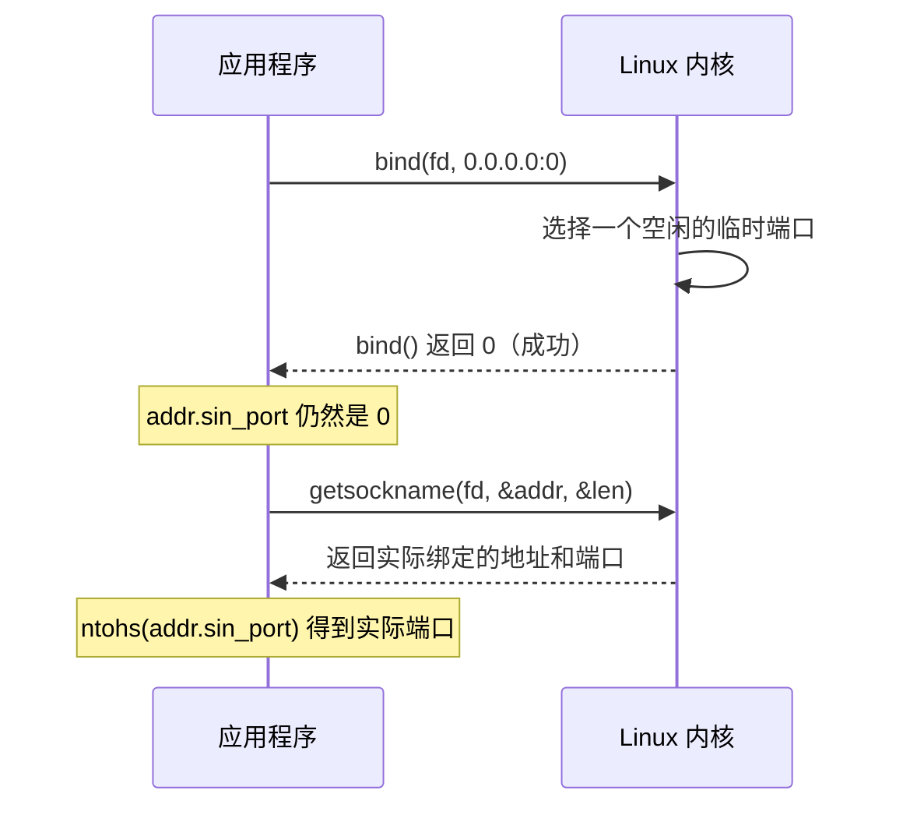

---
tags:
  - Linux
  - 网络编程基础
阅读次数: 0
---

# 7.3 端口与五元组

## 1. 端口解决的是什么问题

一个数据包到达网卡时，[[7.2 IP地址与CIDR|IP 地址]] 只能把它送到**这台机器**。但机器上同时跑着浏览器、SSH 客户端、数据库、游戏进程，内核凭什么知道这个包该交给谁？

端口就是答案。它是传输层头部里的一个 **16 位无符号整数**（TCP 和 UDP 头里各有源端口和目的端口两个字段，各占 2 字节），取值 0 到 65535。内核收到包后，先按 IP 送到本机，再按端口把它投递给对应的套接字。这个过程叫**分用**（demultiplexing）。

「IP 是楼号、端口是房间号」这个比喻能用，只有一处是假的：房间号是独占的，端口不是。五元组那节讲为什么。

---

## 2. 端口号空间怎么划分

IANA 把 0 到 65535 分成三段，但那是规范上的分法。实际会跟你抢端口的，是**内核的临时端口范围**，它的边界和规范对不上。

![[图片/SVG/3_7_7_3_1.svg|1390]]

### 2.1 知名端口（0 – 1023）

由 IANA 统一分配给常用服务，全球一致，所以客户端不用配置就知道该连哪个端口。

| 端口号 | 服务 | 说明 |
|:---:|:---|:---|
| 20/21 | FTP | 20 传数据，21 传控制命令 |
| 22 | SSH | 安全外壳协议 |
| 23 | Telnet | 明文远程登录，已不建议使用 |
| 25 | SMTP | 邮件服务器之间投递（客户端提交用 587） |
| 53 | DNS | 域名解析，UDP 和 TCP 都用 |
| 80 | HTTP | 超文本传输协议 |
| 110 | POP3 | 客户端收信，收完即从服务器删除 |
| 143 | IMAP | 客户端收信，邮件保留在服务器 |
| 443 | HTTPS | 走 TLS 的 HTTP |

在 Linux 上绑定这一段需要 root 权限，或者给进程加上 `CAP_NET_BIND_SERVICE` 能力。生产环境的常见做法是后者：让服务以普通用户运行，只授予绑定低端口的能力，不必整个进程跑在 root 下。

```bash
# 给二进制授予绑定特权端口的能力，之后普通用户也能监听 80
sudo setcap 'cap_net_bind_service=+ep' /usr/local/bin/myserver
```

### 2.2 注册端口（1024 – 49151）

给非标准但广为人知的服务用。开发者可以向 IANA 登记，避免和别人撞车。

| 端口号 | 服务 |
|:---:|:---|
| 3306 | MySQL |
| 5432 | PostgreSQL |
| 6379 | Redis |
| 8080 | HTTP 代理 / 备用 Web 服务 |
| 27017 | MongoDB |

### 2.3 动态端口 / 临时端口（ephemeral port）

客户端调用 `connect()` 时并不指定自己用哪个端口，内核会从一个预设范围里挑一个空闲的作为**源端口**，这样对端才知道回包该发到哪里。

IANA 规定这个范围是 49152 – 65535，但 **Linux 的默认值不是这个**：

```bash
$ sysctl net.ipv4.ip_local_port_range
net.ipv4.ip_local_port_range = 32768	60999
```

32768 到 60999 这一段，起点落在 IANA 的「注册端口」区间内，终点又没到 65535。内核会随机占用大量本该属于注册端口的号码，61000 以上反倒安全。排查端口冲突时，照抄规范里的 49152 会得出错误结论，要以本机 `sysctl` 的实际输出为准（容器镜像和云主机的默认值经常被改过）。

---

## 3. 一个端口能被多少条连接用：五元组

「端口是房间号」这个比喻在这里失效了。一台 Web 服务器只监听 80 一个端口，却能同时服务上万条连接，说明端口并没有被某条连接独占。

内核区分连接靠的是**五元组**：

```
（协议, 源 IP, 源端口, 目的 IP, 目的端口）
```

五个字段全部相同才算同一条连接，只要有一个不同就是两条互不干扰的连接。

![[图片/SVG/3_7_7_3_2.svg|1390]]

图里的表把这件事拆开了看：

- 第 2、3 行来自同一台客户机（源 IP 相同），只有源端口不同，内核照样分给两个不同的 `connfd`。
- 第 3、4 行的源端口撞在一起（都是 51514），但源 IP 不同，同样不冲突。
- 最后一行是 UDP 的 80 端口。**TCP 和 UDP 的端口空间是完全独立的**，`TCP:80` 和 `UDP:80` 可以由两个不相干的进程分别占用。

这也解释了监听套接字和已连接套接字的区别：`listenfd` 的五元组里源 IP 和源端口是通配的，只用来接收握手；`accept()` 返回的 `connfd` 才有完整的五元组。细节见 [[7.8 listen和accept函数]]。

### 3.1 「端口只有 65535 个」到底限制了谁

这句话只对了一半，分两侧看：

**客户端侧确实有上限。** 连向同一个「目的 IP + 目的端口」时，能变的只有源端口，可用数量就是临时端口范围的宽度：

```
60999 − 32768 + 1 = 28232 条
```

压测机连不上更多连接时，先查这个数，而不是先怀疑服务端。换一个目的 IP 或目的端口，五元组就变了，额度重新计算，所以给服务端加几个 IP 能直接把压测上限翻倍。

**服务端侧不受这个数限制。** 服务器全程只占 1 个端口，连接再多也不变。真正的天花板是文件描述符上限（`ulimit -n`、`/proc/sys/fs/nr_open`）和每条连接的内核内存开销。

---

## 4. 服务器该绑哪个端口

原则是**避开内核的临时端口范围**。如果服务监听在 32768 – 60999 之间，可能发生这样一幕：机器重启前，本机某个出站连接被内核随机分到了 50000；服务启动时想绑 50000，`bind()` 直接返回 `EADDRINUSE`。这种故障偶发、只在重启时复现，非常难查。

按优先级排的三种做法：

1. **服务端口选在 1024 – 32767**。不需要特权，也不会和临时端口撞车，最省心。
2. **调窄 `ip_local_port_range`**，把要用的端口让出来。
3. **用 `ip_local_reserved_ports` 精确预留**。它能在范围中间挖洞，不必整体让出一大段。

```bash
# 让内核在分配临时端口时跳过 50000 和 60000-60010
sudo sysctl -w net.ipv4.ip_local_reserved_ports="50000,60000-60010"
```

这条设置对已经建立的连接没有影响，只约束此后的临时端口分配，所以可以在线调整。

### 4.1 让内核分配端口：bind 端口 0

反过来，如果你不在乎用哪个端口，只要有一个能用的，就把端口填 0：

```c
struct sockaddr_in addr{};
addr.sin_family = AF_INET;
addr.sin_addr.s_addr = htonl(INADDR_ANY);
addr.sin_port = htons(0);            // 0 表示「内核你随便给一个」

bind(fd, reinterpret_cast<sockaddr*>(&addr), sizeof(addr));

// bind 之后才能读回实际端口，之前 addr 里还是 0
socklen_t len = sizeof(addr);
getsockname(fd, reinterpret_cast<sockaddr*>(&addr), &len);
int port = ntohs(addr.sin_port);     // 这才是真正绑上的端口
```



关键在最后两步：`bind()` 不会把选中的端口写回你传进去的结构体，必须再调一次 `getsockname()` 才能读到。单元测试里起临时服务常这么写，既保证端口可用，又不会和机器上别的服务冲突。

---

## 5. bind 失败的三种原因

`EADDRINUSE` 是最常见的报错，但它背后有三种完全不同的情况，处理方式也不同：

| 现象 | 真实原因 | 处理方式 |
|:---|:---|:---|
| 服务刚被 kill，立刻重启就绑不上 | 上一次的连接还在 [[10.2 TIME_WAIT状态\|TIME_WAIT]]，要等 2MSL | 设置 `SO_REUSEADDR` |
| 端口确实被另一个进程占着 | 有别的程序在监听 | `ss -tlnp` 查出来，换端口或停掉它 |
| 偶发，只在重启时出现 | 撞上了内核分配的临时端口 | 见上一节的三种做法 |

第一种是绝大多数情况。`SO_REUSEADDR` 允许在本地地址处于 TIME_WAIT 时重新绑定，这是服务端程序的标准写法，必须在 `bind()` **之前**设置：

```c
int on = 1;
setsockopt(fd, SOL_SOCKET, SO_REUSEADDR, &on, sizeof(on));  // 必须在 bind 之前
bind(fd, ...);
```

顺带提一个容易混淆的选项：`SO_REUSEPORT`（Linux 3.9 起）允许**多个套接字同时绑定同一个地址和端口**，内核按连接做负载均衡。它解决的是多进程共享监听端口的问题，和 `SO_REUSEADDR` 不是一回事。两者的完整语义见 [[10.1 套接字选项]]。

---

## 6. 查看端口占用情况

```bash
# 列出所有 TCP 监听端口。-t TCP，-l 只看 listen，-n 不做端口名解析，-p 显示进程
ss -tlnp

# 查某个端口是谁在监听
ss -tlnp 'sport = :8080'

# 看某个端口上的所有连接（含已建立的），确认连接数
ss -tan 'sport = :80' | wc -l

# 从进程角度看：哪个程序打开了 80 端口
sudo lsof -i :80
```

三点说明：

- **`ss` 已经取代了 `netstat`。** `netstat` 属于 net-tools 包，多数发行版不再默认安装；它每次都要遍历解析 `/proc/net/tcp`，连接数上万时明显变慢，而 `ss` 直接走 netlink 接口查询内核。旧命令 `netstat -tlnp` 对应新命令 `ss -tlnp`。
- **`-p` 要 root 才有效。** 普通用户执行时，属于其他用户的进程那一列会是空的，容易误以为「没有进程占用」。
- **`-n` 别省。** 不加 `-n` 时会把 80 显示成 `http`、22 显示成 `ssh`，还会触发反向 DNS 解析，输出慢且不便于 grep。

---

## 7. 关键要点

1. **端口是传输层头里的 16 位整数**，作用是让内核把包分给正确的套接字。
2. **端口不是被独占的资源**。内核用五元组区分连接，一个监听端口可以承载海量连接。
3. **TCP 和 UDP 的端口空间相互独立**，同号不冲突。
4. **Linux 的临时端口范围默认是 32768 – 60999**，不是规范里的 49152 – 65535。服务端口选在 1024 – 32767 最安全。
5. **绑定 1024 以下需要特权**，用 `setcap` 授予 `CAP_NET_BIND_SERVICE` 比直接用 root 跑服务更好。
6. **`EADDRINUSE` 多数是 TIME_WAIT 造成的**，服务端在 `bind()` 前设 `SO_REUSEADDR` 是标准做法。
7. **端口耗尽只发生在客户端侧**，上限是临时端口范围的宽度（默认 28232），服务端的瓶颈是 fd 数量。

---
