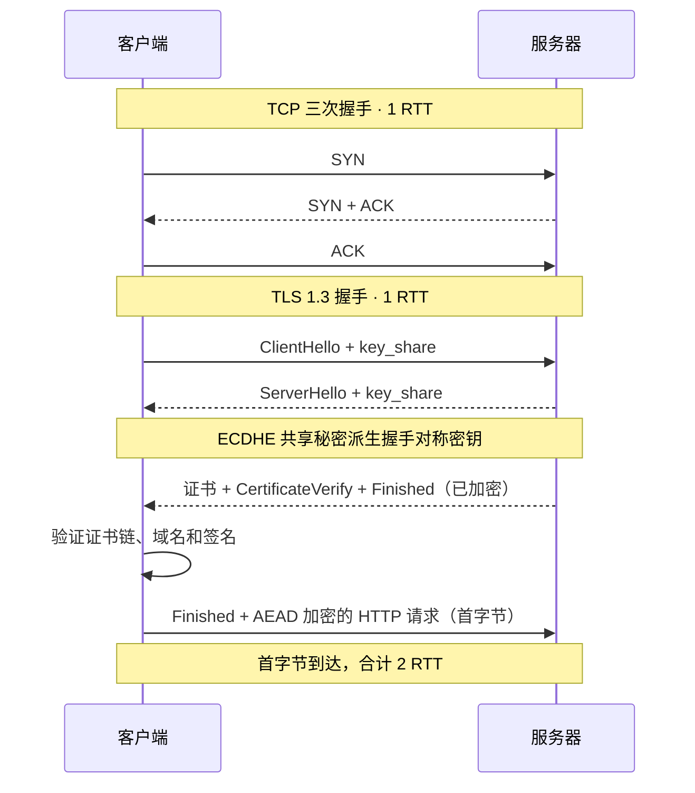
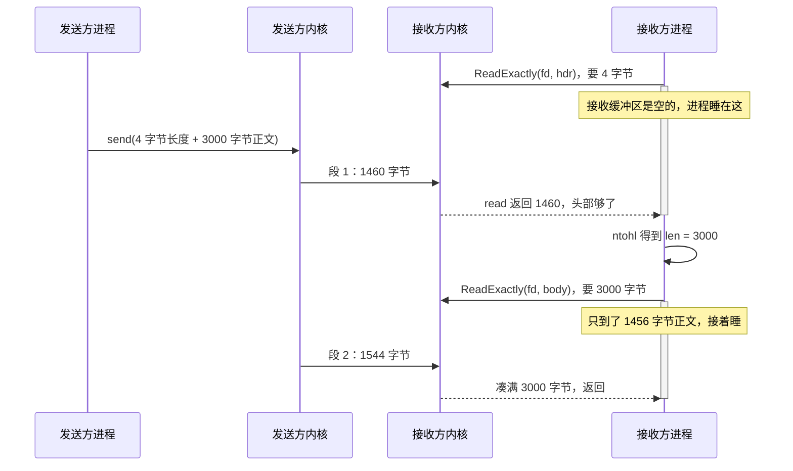

---
tags:
  - Linux
  - 网络编程基础
  - 应用层协议
aliases:
  - Application Layer Protocols
  - 应用层协议总览
阅读次数: 0
---

# 7.4 应用层协议

任何一个协议都要回答两个问题：一条消息从哪读到哪，每个字节分别是什么含义。这一篇把 HTTP、HTTPS、SSH、DNS、FTP、SMTP 六个协议拆开，看它们各自怎么回答第一个问题。

这两个问题为什么绕不开，以及自己动手定协议时会踩的坑，在下一篇 [[7.5 传输层协议：TCP与UDP]]。

> [!tip] 交互动画
> 用“协议解剖台”逐步观察 TCP 字节流怎样恢复消息边界、HTTP 双轨解析、TLS 1.3 混合加密、SSH 精确读帧、DNS 在 UDP/TCP 间切换，以及六大协议的边界选择：
> [▶ 在浏览器中打开动画](<../../图片/HTML/3.Linux/7. 网络编程基础/7.4.4 应用层协议与消息边界动画.html>)　·　更多见 [[网络编程·动画合集]]
> 也可直达单个场景：[边界三问](<../../图片/HTML/3.Linux/7. 网络编程基础/7.4.4 应用层协议与消息边界动画.html#scene=paradigms>) · [HTTP 双轨解析](<../../图片/HTML/3.Linux/7. 网络编程基础/7.4.4 应用层协议与消息边界动画.html#scene=http>) · [TLS 混合加密](<../../图片/HTML/3.Linux/7. 网络编程基础/7.4.4 应用层协议与消息边界动画.html#scene=https>) · [SSH 精确读帧](<../../图片/HTML/3.Linux/7. 网络编程基础/7.4.4 应用层协议与消息边界动画.html#scene=ssh>) · [DNS 传输分叉](<../../图片/HTML/3.Linux/7. 网络编程基础/7.4.4 应用层协议与消息边界动画.html#scene=dns>) · [六协议全景](<../../图片/HTML/3.Linux/7. 网络编程基础/7.4.4 应用层协议与消息边界动画.html#scene=matrix>)

## 1. 六个协议放在一起

![[图片/SVG/3_7_7_4_1.svg|1390]]

| 协议 | 端口 | 传输层 | 边界机制 |
|:---|:---:|:---|:---|
| HTTP | 80 | TCP | CRLF + 空行 + `Content-Length` |
| HTTPS | 443 | TCP | TLS 记录层自带 2 字节长度 |
| SSH | 22 | TCP | 4 字节长度前缀 |
| DNS | 53 | UDP 为主，大响应转 TCP | UDP 靠数据报边界，TCP 加 2 字节长度前缀 |
| FTP | 20 / 21 | TCP | 控制连接用 CRLF，数据连接靠关闭连接 |
| SMTP | 25 | TCP | CRLF，正文以单独一行的 `.` 结束 |

六种写法，归起来只有三类。（[[7.5 传输层协议：TCP与UDP]] 里列的是定长、分隔符、长度前缀，那是只看 TCP 字节流的分法；这里把 UDP 也算进来，所以第三类换成了数据报边界。）

- **分隔符**——扫到某个字节序列算一条结束。HTTP 头部、FTP 命令、SMTP 命令都是这样。代价是要逐字节扫，而且正文里不能出现分隔符，出现了就得转义。
- **长度前缀**——先写清后面有多少字节。SSH、TLS 记录层、DNS over TCP 走这条。读一次长度就能精确切分，正文可以是任意字节。
- **数据报天然边界**——一次 `sendto` 对应一次 `recvfrom`，协议什么都不用做。只有 UDP 上的协议能用，DNS 是典型。

这六个协议的服务端口全在 1024 以下，属于知名端口区间，普通用户进程绑不上，要么以 root 启动，要么给可执行文件加 `CAP_NET_BIND_SERVICE`。端口分段的规则见 [[7.3 端口与五元组]]。

---

## 2. HTTP：文本行协议

![[图片/SVG/3_7_7_4_2.svg|1390]]

```http
GET /search?q=socket HTTP/1.1
Host: example.com
Connection: keep-alive
Content-Length: 17

name=alice&age=30
```

HTTP 一个协议里塞了两套边界机制。头部用 `\r\n` 分行，用一个**空行**（也就是连续两个 CRLF）表示头部结束；实体的长度则由头字段声明，读满声明的字节数才算完。之所以要两套，是因为头部的条数事先不知道，实体的长度事先知道，两种情况用同一套办法都不划算。

文本形态的好处很实在：`telnet example.com 80` 就能手敲一个请求，抓包出来直接能读。代价是解析要逐字节找 `\r\n`，比读一个定长整数慢，而且 `Content-Length: 17` 这个数字得从文本转成整数再用。

### 2.1 一条报文分四段

请求和响应都是同一副骨架，四段：

| 段 | 请求里 | 响应里 |
|:---|:---|:---|
| 起始行 | `GET /search?q=socket HTTP/1.1` | `HTTP/1.1 200 OK` |
| 头部 | 若干 `名字: 值` 行 | 若干 `名字: 值` 行 |
| 空行 | 单独一个 CRLF | 单独一个 CRLF |
| 实体 | `name=alice&age=30` | `<html>…</html>` |

头部是元信息，实体才是真正要传的数据。网络上的字节长这样（`␍␊` 表示 `\r\n`，回车加换行两个字节；Linux 下 `"\n"` 只有换行一个字节，HTTP 规定行尾必须两个都在）：

```
GET /search?q=socket HTTP/1.1␍␊
Host: example.com␍␊
Connection: keep-alive␍␊
Content-Length: 17␍␊
␍␊
name=alice&age=30
```

接收方按这个顺序切：

1. 读到 `\r\n` 算一行。第一行是请求行，拆成方法、路径、版本三份。
2. 之后每行按冒号拆成字段名和值。
3. 读到**空行**——一行里只有 `\r\n`——头部到此结束。
4. 按 `Content-Length: 17` 读满 17 个字节，就是实体。数一遍：`name`(4) `=`(1) `alice`(5) `&`(1) `age`(3) `=`(1) `30`(2)，不多不少。

头部结束时是 `\r\n\r\n`：上一行的行尾一个，空行自己一个，连起来两对。

文本协议最实在的用途是能亲手试。用 `nc` 直接打一个请求，服务器回什么你看什么：

```bash
printf 'GET / HTTP/1.1\r\nHost: example.com\r\nConnection: close\r\n\r\n' | nc example.com 80
```

`Connection: close` 让服务器回完就断开，`nc` 把响应的字节原样吐出来：状态行、头字段、HTML 正文，全是能读的文本。

### 2.2 常见头字段

| 字段 | 说明 |
|:---|:---|
| `Host` | 目标主机名。一个 IP 上跑多个站点，靠它区分；HTTP/1.1 里唯一必需的请求头 |
| `Connection` | `keep-alive` 表示这条 TCP 连接传完还留着 |
| `Content-Length` | 实体的字节数，接收方据此判断读到哪算完 |
| `Content-Type` | 实体的格式，如 `application/json` |
| `Transfer-Encoding` | 值为 `chunked` 时表示分块传输，此时不给 `Content-Length` |
| `Accept-Encoding` | 客户端能解开哪些压缩格式 |

### 2.3 实体长度的三种给法

图里 Panel C 那三块是同一个问题的三个答案：

1. **`Content-Length: 42`**——头里写死字节数。前提是发之前就知道长度，静态文件和表单提交都满足。
2. **`Transfer-Encoding: chunked`**——每块前面写一个十六进制长度，长度为 0 的块表示结束。服务端边算边发时用它，比如一个流式生成的响应，开头根本不知道最终多长。
3. **两个都不给**——读到连接关闭为止。这是 HTTP/1.0 的兜底做法，问题在于接收方分不清「服务端发完了正常关」和「网络断了」，而且这条连接用完就废，没法复用。

> [!warning] 两个头字段同时出现是攻击面
> 如果一个请求既有 `Content-Length` 又有 `Transfer-Encoding: chunked`，前端代理和后端服务器可能按不同的字段切分边界，同一串字节在两边被解析成不同数量的请求。这类问题叫请求走私（HTTP request smuggling）。RFC 7230 规定这种情况下必须以 `Transfer-Encoding` 为准，并且中间设备应当直接拒绝这个请求。

### 2.4 版本演进：文本行 → 二进制帧 → 自带传输层

![[图片/SVG/3_7_7_4_8.svg|1390]]

| 版本 | 传输层 | 边界机制 | 关键变化 |
|:---|:---|:---|:---|
| HTTP/1.0 | TCP | 无长度就关连接 | 一个请求一条连接，用完就断 |
| HTTP/1.1 | TCP | CRLF + 空行 + `Content-Length` | keep-alive、`Host` 头、chunked |
| HTTP/2 | TCP | 二进制帧 + 流 ID | 多路复用、头压缩、服务端推送 |
| HTTP/3 | UDP（QUIC） | QUIC 帧 + 流 | 免队头阻塞、0-RTT、连接迁移 |

每一代换的都是边界办法：

- **1.0 → 1.1**：给 1.0 打补丁，不是重写。1.0 用起来暴露三个毛病，1.1 各补一个：

  | 1.0 的毛病 | 1.1 的补丁 |
  |:---|:---|
  | 一个请求一条 TCP 连接，用完就断，握手开销大 | keep-alive，连接传完留着复用 |
  | 请求里只有路径没有域名，一个 IP 跑多个站点分不清 | `Host` 头，带上目标主机名 |
  | 边算边发的内容，发之前不知道多长 | `chunked` 分块传输 |

  前两个补丁有连带关系。连接不关了，「读到连接关闭 = 实体结束」这个信号就没了，实体边界只能另定，于是才有 `Content-Length`（发之前知道长度）和 `chunked`（不知道长度，分块）。`Host` 独立于这条链，解决的是另一件事。边界还是文本行 + 空行，只是实体结束从「关连接」换成「空行定头部、`Content-Length` 定实体」两段配合。
- **1.1 → 2.0**：换掉边界。文本行逐字节扫太慢，改成二进制帧：消息拆成一串帧，每帧自带长度和流 ID，一个 TCP 连接上多个流并发跑。代价是不能再用 telnet 手敲。队头阻塞还在，TCP 丢一个包，后面整条连接全等。
- **2.0 → 3.0**：连传输层一起换。HTTP/3 跑在 QUIC 上，QUIC 是基于 UDP、自带边界和可靠性的传输协议，丢包重传只发生在那条流上，队头阻塞跟着消失；TLS 1.3 和 0-RTT 成了内置能力。

HTTP/1.1 用分隔符，HTTP/2 用二进制帧，HTTP/3 干脆自己造了个带边界的传输层。边界问题躲不掉，只能一层一层重新解决。

---

## 3. HTTPS：TLS 记录层给密文加长度前缀

![[图片/SVG/3_7_7_4_3.svg|1390]]

HTTPS 不是另一个协议，是 HTTP 报文原封不动地塞进 TLS。HTTP 那边一个字节都没改，只是在交给 TCP 之前多过了一层：TLS 把字节流切成一条条**记录**，每条前面加 5 字节头。

记录头的三个字段：

| 字段 | 长度 | 内容 |
|:---|:---:|:---|
| ContentType | 1 字节 | `0x16` 握手，`0x17` 应用数据，`0x15` 告警 |
| LegacyRecordVersion | 2 字节 | 固定 `0x0303`，为兼容中间设备而保留 |
| Length | 2 字节 | 本条记录密文的长度，上限 2¹⁴ + 256 字节 |

一条连接上跑的不只是网页数据，还有握手消息和告警，类型字段让接收方分清这条是哪个。三个常用值之外，`0x14`（ChangeCipherSpec）是 TLS 1.2 的遗留，1.3 里只发一个空记录，不必管它。

第二个字段容易踩坑。TLS 1.3 的实际版本号是在握手扩展里协商的，记录头这个 `0x0303` 是写死的兼容值，拿它判断对端版本会得到错误答案。

第三个字段就是长度前缀：接收方先读满 5 字节，从中取出 `Length`，再精确读那么多字节，一条记录就完整了。

`Length` 的上限 2¹⁴ + 256 是这么拆的：2¹⁴（16384）是一条记录明文的上限，限制接收方单次要缓冲的量；+256 留给加密开销，AEAD 认证标签加填充正好塞下。

抓一条真实连接，第一个应用数据记录的头往往是：

```
17 03 03 02 00 …
```

`17` 是应用数据，`03 03` 是那个写死的兼容版本，`02 00` 大端展开是 512，后面跟着 512 字节密文，读完这条记录就完整了。

TLS 自己也躲不掉边界问题，因为它下面是 [[7.6 TCP协议基础|TCP]] 字节流，字节流不带边界。边界问题不会因为上面多包一层就消失：HTTP 站在 TCP 上要自己定，TLS 夹在中间，下面还是那条没边界的 TCP，所以它也得自己定一遍。

### 3.1 加密要多付几个往返

首字节到达之前要付的往返，画成时序图就是两条接一条的等待：



TLS 1.2 的握手多一个往返：它要客户端再发一次 `ClientKeyExchange` 才算完密钥，所以握手要 2 个 RTT，首字节前合起来 3 个。1.3 把密钥协商并进一趟——客户端一个 `ClientHello`，服务端 `ServerHello` + 证书 + Finished 一趟全回，密钥就齐了。

会话复用能省掉 TLS 那一段。TLS 1.3 还有 0-RTT，允许把首个请求跟着 `ClientHello` 一起发出去，代价是这段数据可以被重放，所以只能用在不改变服务端状态的请求上——GET 可以，下单接口不行。

### 3.2 混合加密：非对称建立信任，对称传输数据

HTTPS 不是从头到尾只用一种算法。TLS 1.3 把任务拆开：**非对称密码解决“我连的是谁、双方怎样得到共同秘密”，对称密码解决“后续大量数据怎样高效加密”**。

| 任务 | 使用的机制 | 常见算法 | 为什么这样分工 |
|:---|:---|:---|:---|
| 身份认证 | 非对称数字签名 | RSA-PSS、ECDSA、EdDSA | 服务器用证书私钥签名握手记录，客户端用证书公钥验证 |
| 建立共享秘密 | 非对称密钥协商 | ECDHE（如 X25519、secp256r1） | 双方只交换临时公钥，也能各自算出同一个秘密 |
| 派生会话密钥 | 密钥派生函数 | HKDF-SHA256、HKDF-SHA384 | 从共享秘密和握手记录中派生出不同用途、不同方向的密钥 |
| 加密 HTTP 数据 | 对称 AEAD | AES-GCM、ChaCha20-Poly1305 | 速度快，同时提供机密性和完整性校验，适合大量记录 |

一次常见的完整证书握手按下面四步走：

1. 客户端和服务器在 `ClientHello`、`ServerHello` 的 `key_share` 中交换 ECDHE **临时公钥**。临时私钥始终留在各自机器上，共享秘密本身不会在线路上传输。
2. 双方各自用“自己的临时私钥 + 对方的临时公钥”算出相同的 ECDHE 共享秘密，再通过 HKDF 派生握手密钥。
3. 服务器发送证书，并用证书对应的私钥对握手记录做 `CertificateVerify` 签名。客户端检查 CA 证书链、有效期、域名和签名，确认收到的 `key_share` 确实来自目标服务器，而不是中间人替换的。
4. 握手完成后，双方继续用 HKDF 派生应用数据密钥；此后的 HTTP 请求和响应都由 AES-GCM 或 ChaCha20-Poly1305 这类对称 AEAD 算法保护。

> [!important] TLS 1.3 不是“RSA 加密一个会话密钥再发过去”
> TLS 1.3 已删除静态 RSA 密钥交换。服务器即使使用 RSA 证书，RSA 通常也只负责签名，密钥协商仍由 ECDHE 完成。临时私钥在会话结束后销毁，因此服务器证书私钥将来泄漏，也不能直接解开以前抓到的完整握手流量，这叫**前向保密**（forward secrecy）。会话恢复使用 PSK 时要另看具体密钥交换模式。

不全用非对称算法，是因为它计算慢、密文膨胀，无法高效处理网页、图片和视频；不全用对称算法，是因为第一次连接时双方还没有共同密钥，也无法仅靠一个共享密钥证明服务器身份。TLS 把两类算法接起来，正好让它们各自处理擅长的问题。

“会话密钥”也不是整条连接只用一把钥匙。TLS 1.3 至少会区分客户端发送密钥、服务器发送密钥、握手阶段密钥和应用数据阶段密钥；一把密钥出问题，不会直接拖垮所有方向和阶段。以上分工对应 RFC 8446 第 2、4.1.1、4.4.3 和 7.1 节。

### 3.3 公钥、私钥、签名与会话密钥：四样东西不要混

把**公钥比作可以公开分发的锁、私钥比作唯一的钥匙**，只适合解释“保密传信”这一种用途：甲用乙的公钥加密，只有乙的私钥能解开。公钥可以写进证书、发给陌生人；私钥必须只留在持有者手里。一旦私钥泄漏，攻击者就能冒充持有者，或解开本应只由持有者读取的旧式加密数据。

非对称密码还有另一种用途：**数字签名**。签名不是“把 HTTP 正文用私钥加密，再用公钥解密”。它的目标不是保密，而是让验证者确认两件事：消息确实由私钥持有者签发，且签名后内容没有被替换。概念上可以这样记：

```text
保密：对方用我的公钥加密  ->  我用自己的私钥解密
认证：我用自己的私钥签名  ->  对方用我的公钥验证
```

现代签名算法会先对握手内容做摘要，再按 RSA-PSS、ECDSA 或 EdDSA 等算法生成签名；验证过程也不是把签名“解密回原文”。所以“私钥加密、公钥解密”最多是帮助入门的简化比喻，不能据此推导 TLS 的真实数据流。

在一次 TLS 1.3 连接中，至少要区分下表这些材料：

| 名称 | 谁持有 | 出现在网络上吗 | 在 TLS 1.3 中的作用 |
|:---|:---|:---|:---|
| 证书公钥 | 任何客户端都可取得 | 是，随服务器证书发送 | 验证服务器的 `CertificateVerify` 签名，确认服务器身份 |
| 证书私钥 | 仅服务器保管 | 否 | 为握手记录签名；不用于加密每一段 HTTP 数据 |
| ECDHE 临时公钥 | 客户端、服务器各一份 | 是，放在 `key_share` 中交换 | 让双方协商同一个共享秘密 |
| ECDHE 临时私钥 | 客户端、服务器各一份 | 否 | 与对方临时公钥一起计算共享秘密；握手后应销毁 |
| 对称会话密钥 | 客户端、服务器各自派生相同副本 | 否 | 用 AES-GCM、ChaCha20-Poly1305 加密和认证 HTTP 请求、响应 |

把它们串起来看，实际过程是：

```text
1. 客户端取得服务器证书中的公钥。
2. 双方交换 ECDHE 临时公钥，各自算出相同的共享秘密。
3. 服务器用证书私钥签名，客户端用证书公钥验证：
   “刚才参与密钥协商的确实是这个证书对应的服务器。”
4. 双方把共享秘密和握手上下文交给 HKDF，派生出对称会话密钥。
5. 之后的 HTTP 请求和响应用对称 AEAD 加密；服务器证书私钥不再参与每条网页数据的加密。
```

> [!tip] 为什么还要两套密钥？
> 非对称密码解决第一次见面时的身份确认和共同秘密建立，但计算成本高；对称密码速度快，适合持续传输网页、图片和视频。TLS 用证书签名把服务器身份绑定到 ECDHE 密钥协商，再用派生出的对称密钥传输数据，兼顾安全与性能。

> [!warning] “看到公钥”不等于“可信任服务器”
> 攻击者也可以自己生成一对公私钥。客户端之所以信任服务器证书中的公钥，是因为它还会验证 CA 签发链、证书有效期和访问的域名是否匹配；这些检查任一失败，都不能把该公钥当作目标网站的身份凭据。

---

## 4. SSH：长度前缀的标准写法

![[图片/SVG/3_7_7_4_4.svg|1390]]

RFC 4253 定义的二进制包格式，五个部分：

```c
// 线路上的实际布局（不是可以直接 memcpy 的结构体，见下）
uint32  packet_length;    // 后面还有多少字节，不含本字段自己，也不含 MAC
byte    padding_length;   // 其中有多少是填充
byte[]  payload;          // 消息类型 + 消息体
byte[]  random_padding;   // 4–255 字节随机数据
byte[]  mac;              // 完整性校验码，长度由协商出的算法决定
```

`packet_length` 数的是 `padding_length + payload + random_padding` 这一段。**它不含自己那 4 个字节，也不含尾部的 MAC**，这是实现时最容易差一位的地方。

三个设计决定各有各的道理：

- **长度前缀**省掉了扫描。正文可以是任意字节序列，包括 `\r\n`，不需要转义。
- **随机填充**让密文长度不等于明文长度，攻击者从包大小推不出你敲了多少字符；顺带把总长补齐到分组密码的分组长度倍数。
- **长度上限**必须有。对端声明 4 GB 你就照着 `resize`，一个包就能把进程打垮。

### 4.1 按长度前缀切包的代码

下面这段是通用的长度前缀读法，SSH、DNS over TCP、自定义 RPC 协议都是这个骨架。把这个骨架扩成一个能跑的完整 RPC 协议——加上方法分发、请求响应配对和错误传递——见 [[7.4.1 RPC协议模板]]。

```cpp
#include <arpa/inet.h>
#include <unistd.h>
#include <array>
#include <cstring>
#include <optional>
#include <span>
#include <system_error>
#include <vector>

// 不信任对端给的长度，先定一个自己能承受的上限
inline constexpr std::uint32_t kMaxPacket = 256 * 1024;
```

第一段只有一个常量，但它是整段代码里最重要的一行。后面 `resize` 的大小完全来自对端，没有这个上限，一个 4 字节的字段就是一次内存耗尽。

```cpp
// 反复 read 直到凑满 buf.size() 字节
// 返回 false 表示对端正常关闭；出错抛异常
bool ReadExactly(int fd, std::span<std::byte> buf) {
    std::size_t got = 0;
    while (got < buf.size()) {
        const ssize_t n = ::read(fd, buf.data() + got, buf.size() - got);
        if (n == 0) return false;                       // 对端 close，读到 EOF
        if (n < 0) {
            if (errno == EINTR) continue;               // 被信号打断，重来一次
            throw std::system_error(errno, std::generic_category(), "read");
        }
        got += static_cast<std::size_t>(n);
    }
    return true;
}
```

这个循环不是防御性编程，是必需的。TCP 是字节流，一次 `read` 返回多少字节没有任何保证：你要 4 个字节，内核可能只给你 1 个，因为剩下 3 个还在路上。`EINTR` 那一行同理，进程装了信号处理函数时 `read` 会被打断返回 -1，这不是错误。完整的粘包讨论见 [[8.9 TCP的粘包和拆包]]。

```cpp
// 读出一个完整的帧，返回 payload
// 返回 std::nullopt 表示连接正常结束
std::optional<std::vector<std::byte>> ReadFrame(int fd) {
    std::array<std::byte, 4> hdr{};
    if (!ReadExactly(fd, hdr)) return std::nullopt;

    std::uint32_t len_be = 0;
    std::memcpy(&len_be, hdr.data(), sizeof(len_be));   // 不做类型双关，走 memcpy
    const std::uint32_t len = ::ntohl(len_be);          // 网络序转主机序

    if (len == 0 || len > kMaxPacket) {                 // 上限在这里生效
        throw std::runtime_error("packet_length out of range");
    }

    std::vector<std::byte> body(len);
    if (!ReadExactly(fd, body)) return std::nullopt;    // 读到一半对端断了
    return body;
}
```

三处细节值得说：

- **用 `std::memcpy` 而不是 `*reinterpret_cast<uint32_t*>(hdr.data())`**。后者违反严格别名规则，也可能触发非对齐访问，在开了优化的编译器上行为不可靠。`memcpy` 在这里会被编译成一条 load 指令，没有性能损失。
- **`ntohl` 不能省**。x86 是小端，网络字节序是大端，直接用会读出一个天文数字。字节序转换函数见 [[7.7 套接字]]。
- **头部读成功、正文读一半断了，返回 `nullopt` 而不是抛异常**是个取舍。这里把「对端提前挂了」当成正常的连接结束处理，如果协议要求区分「优雅关闭」和「传输中断」，这里应该分成两种返回值。



这张图补上了源码里看不出来的一件事：发送方一次 `send` 发出的 3004 字节，在接收方那边被切成了两次 `read`，而切点落在正文中间，跟帧边界毫无关系。切成几段由 MSS、拥塞窗口和 Nagle 决定，发送方管不了，接收方也预测不了。`ReadExactly` 里那个 `while` 循环处理的就是图中两段 `activate` 的等待。

---

## 5. DNS：定长头 + 计数字段

![[图片/SVG/3_7_7_4_5.svg|1390]]

DNS 的头部固定 12 字节，每行 16 位共 6 行。前两行是事务标识和标志位，后四行是四个计数字段。

接收方读满 12 字节就知道后面要解析几条记录，逐条读完即可。这算是长度前缀的一个变体：不直接给字节数，而是给条目数，每个条目自带长度。

### 5.1 标志位里要认得的几个

| 位 | 含义 |
|:---|:---|
| QR | 0 是查询，1 是响应 |
| AA | 应答来自权威服务器 |
| **TC** | 响应装不下被截断了 |
| RD | 客户端希望服务器递归查询 |
| RA | 服务器支持递归 |
| RCODE | 返回码，0 正常，3 是域名不存在 |

`TC` 位是理解 DNS 传输层选择的关键。RFC 1035 里 `Z` 是 3 个保留位，后来其中两位被 DNSSEC 拿去做了 `AD` 和 `CD`。

### 5.2 换了传输层就得换边界办法

DNS 是这一篇里最有意思的一个，因为它同一套报文格式要在两种传输层上跑：

- **UDP**（默认）：一个数据报就是一条完整消息，协议本身不需要任何长度字段。传统响应上限 512 字节，用 EDNS0 可以协商到更大。
- **TCP**：响应被截断（`TC=1`，客户端重新用 TCP 问一遍）、或者做区域传送时走这条。此时必须在报文前面补 2 字节长度前缀。

同一个协议，换到 [[9.1 UDP原理|UDP]] 上不需要长度字段，换到 TCP 上就得自己补一个。边界问题躲不掉，挪个位置还是要还。

DNS 走 TLS 或 HTTPS 的变体（DoT / DoH）见 [[16.1 CDN 与自建 DoH 全链路]]。

---

## 6. FTP：一个会话两条连接

![[图片/SVG/3_7_7_4_6.svg|1390]]

FTP 是这六个里唯一一个用两条 TCP 连接的：

- **控制连接**（端口 21）从登录开到退出，只走文本命令和三位数字应答，边界是 CRLF。
- **数据连接**每传一次文件开一条，传完就关。文件内容不带任何长度信息，**关闭连接本身就是结束标志**。

数据连接的建立方向分两种模式，这是 FTP 最出名的坑：

| | 主动模式 PORT | 被动模式 PASV |
|:---|:---|:---|
| 谁发起数据连接 | 服务端，从端口 20 出去 | 客户端 |
| 客户端在 NAT 后 | 连不进来，失败 | 正常 |
| 服务端要开的端口 | 只要 20 和 21 | 一整段高端口范围 |

主动模式里服务端反过来连客户端，这在 NAT 和有状态防火墙普及之前没问题，现在基本不能用了。端口 20 这个数字的来历就在这，今天你几乎见不到它。被动模式让两条连接都由客户端发起，方向一致，代价是服务端得放开一段高端口给数据连接用。

数据连接靠关闭连接定边界，还带来一个后果：客户端拿到的字节流断掉时，分不清是传完了还是网络出了问题。所以 FTP 要在控制连接上等一条 `226 Transfer complete` 才敢认这次传输成功。**一条连接管控制、一条连接管数据，用控制连接给数据连接补边界信息**，这是双连接设计的真正用处。

---

## 7. SMTP：一条连接上两套边界

![[图片/SVG/3_7_7_4_7.svg|1390]]

SMTP 的命令和应答都是一行一条，边界是 CRLF，跟 FTP 控制连接一样。特别的地方在 `DATA` 命令之后：协议切换到「正文模式」，边界规则整个换掉，从「一行一条」变成「读到 `<CRLF>.<CRLF>` 为止」。

换规则是因为正文里必然含有 CRLF，用它当边界就切不出完整的邮件。

应答码的首位定性质：

| 首位 | 含义 |
|:---:|:---|
| 2 | 成功 |
| 3 | 命令收到了，还等后续输入（比如 `354`） |
| 4 | 暂时失败，可以重试 |
| 5 | 永久失败，别重试了 |

### 7.1 点填充

新边界规则又制造了新问题：正文里如果有一行正好只有一个点，或者以点开头，就会被误认成结束符。SMTP 的解法叫点填充（dot-stuffing）：

- 发送端：正文里凡是以 `.` 开头的行，前面再补一个 `.`。
- 接收端：正文里凡是以 `.` 开头的行，删掉行首那一个 `.`。

```
应用给的原文：    .hidden 也会一并备份
线路上的字节：    ..hidden 也会一并备份
接收端还原后：    .hidden 也会一并备份
```

这是分隔符方案的通病：正文里出现分隔符就得转义，转义又要求收发两端严格对称。长度前缀完全没有这个麻烦，代价是报文不能用肉眼直接读。

---

## 8. 六个协议各自示范了什么

| 协议 | 边界办法 | 从它身上能学到的 |
|:---|:---|:---|
| HTTP | 分隔符 + 长度头字段 | 头部和实体的长度可知性不同，用两套边界更划算 |
| HTTPS | 长度前缀 | 加密层夹在中间，它自己也要解决边界问题 |
| SSH | 长度前缀 | 长度前缀必须配上限，否则长度字段就是攻击入口 |
| DNS | 数据报边界 / 长度前缀 | 换传输层就得换边界办法，躲不掉 |
| FTP | 分隔符 + 关闭连接 | 用关闭连接当边界，就得另找地方确认是否成功 |
| SMTP | 分隔符（两套） | 一条连接上可以中途切换边界规则，但会引出转义 |

自己设计协议时，这张表基本能覆盖会遇到的选择。具体到实现里的对齐填充和字节序陷阱，见 [[7.5 传输层协议：TCP与UDP]] 第 4 节。

---

## 9. 关键要点

1. **六种边界写法归三类**：分隔符、长度前缀、数据报天然边界。第三类只有 UDP 上的协议能用。
2. **文本协议好调试，二进制协议好解析**。HTTP 能 telnet 手敲，SSH 读一次长度就切完；选哪种取决于你更在意排障成本还是解析开销。
3. **长度前缀必须设上限**。`packet_length` 是对端说了算的数字，照着它分配内存就是把生死交给对方。
4. **分隔符方案一定要配转义**。SMTP 的点填充就是为此存在的，收发两端的规则必须严格对称。
5. **HTTPS 不是新协议**，HTTP 报文一字未改，只是被 TLS 记录层保护。TLS 采用混合加密：ECDHE 和证书签名负责建立共享秘密、验证身份，对称 AEAD 负责高效加密 HTTP 数据；记录层仍用长度前缀切分密文，加密的代价是首字节前多付 1 到 2 个 RTT。
6. **DNS 那一对最能说明问题**：同一套报文格式，在 UDP 上不需要长度字段，换到 TCP 上就必须补 2 字节。
7. **FTP 的双连接**说明用关闭连接定边界是有代价的：接收方分不清「传完了」和「断了」，只能靠另一条连接上的 `226` 来确认。

---
