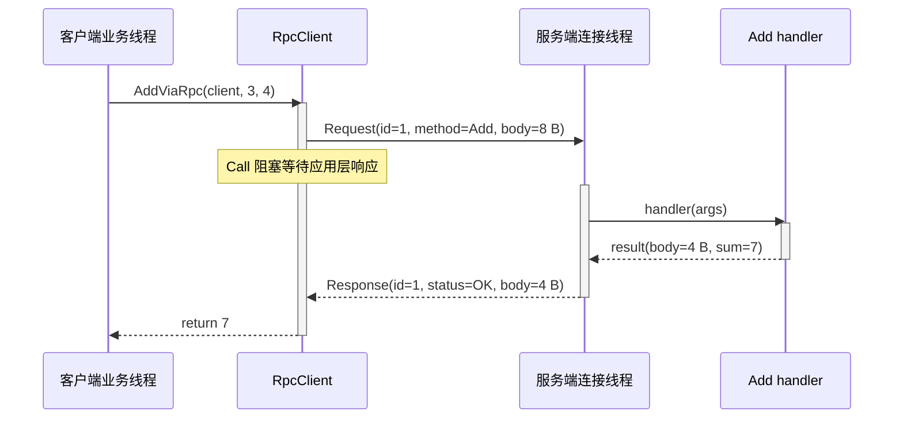
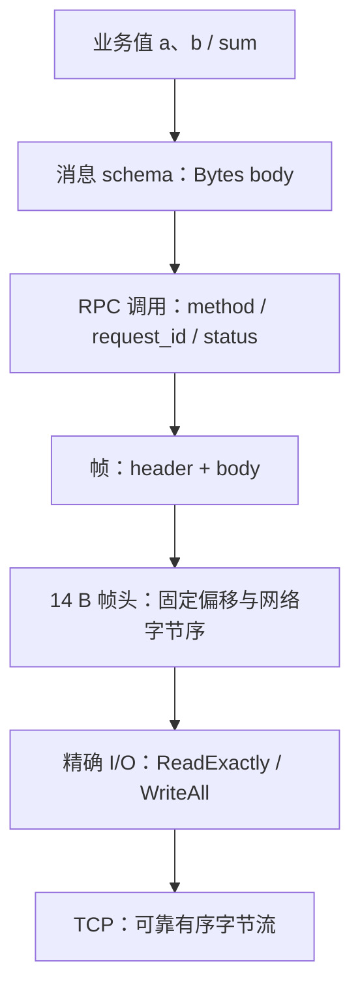

---
tags:
  - Linux
  - 网络编程基础
  - 应用层协议
  - RPC
aliases:
  - RPC Protocol Template
  - 自定义RPC协议
阅读次数: 0
---

# 7.4.1 RPC 协议模板

RPC（Remote Procedure Call，远程过程调用）希望把一次跨进程、跨机器的请求包装成类似本地函数调用的接口：客户端提供方法和参数，服务端执行后返回结果或错误。

“像本地函数”只是一层 API 外观。真正的数据必须依次经过消息编码、调用关联、帧定界、帧头编码、精确 I/O，最后才进入 TCP 字节流；服务端收到字节后，再沿相反方向逐层还原。

本文实现一个教学用的二进制 RPC：运行在已经建立的阻塞 TCP 连接上，每帧由 **14 字节固定头 + 变长消息体**组成，并以 `AddViaRpc(client, 3, 4)` 为例说明完整往返。示例使用 C++20，只支持单连接、串行调用，不包含认证、加密、取消、自动重试、多路复用和服务发现，不能直接照搬到生产环境。

> [!important] 本文的讲解顺序与源码声明顺序不同
> 本文严格按照 SVG 的封装路径，从业务层一路讲到 TCP 层。真正拆成 `.h/.cpp` 文件时，底层类型与函数通常要先声明，或者通过头文件提供给上层；不要因为代码片段在后文才出现，就误以为上层可以不依赖它。

## 1. 先看全图：一次 `AddViaRpc(3, 4)` 怎样穿过七层

![[图片/SVG/3_7_7_4_1_2.svg|1390]]

读图时只抓住一条主线：**左侧是客户端请求向下封装，右侧是服务端请求向上还原。** 每一层只理解一种对象，并把结果交给下一层。

| 层次 | 这一层理解的对象 | 客户端向下封装 | 服务端向上还原 | 这一层不应该关心什么 |
|:---:|:---|:---|:---|:---|
| ① 业务层 | `a`、`b`、`sum` | `AddViaRpc(client, a, b)` | `RegisterAdd` 注册的 handler | 字节偏移、短读、TCP 分节 |
| ② 消息层 | `Bytes body` | `AppendU32` 把参数编码为 8 B | `ReadU32` 把字节还原为整数 | `request_id`、连接状态 |
| ③ RPC 调用层 | `method + request_id + status + body` | `RpcClient::Call` 分配 ID 并等待响应 | `ServeConnection → Dispatch` | 帧头的具体偏移 |
| ④ 帧层 | `Frame = header + body` | `SendFrame` 生成一条完整应用层消息 | `ReadFrame` 依据长度恢复一帧 | `Add` 的参数含义 |
| ⑤ 帧头层 | `raw_header[14]` | `EncodeHeader` 固定偏移、转网络序 | `DecodeHeader` 转主机序并校验 | `read()` 一次返回多少字节 |
| ⑥ 精确 I/O 层 | 连续字节区间 | `WriteAll` 循环处理短写 | `ReadExactly` 循环处理短读与 EOF | 方法号和业务状态 |
| ⑦ TCP 层 | 无边界的可靠有序字节流 | 内核发送字节 | 内核按序交付字节 | 应用层消息边界与业务成功 |

可以把这七层记成一条类型变化链：

```text
业务值 a、b
    ↓  消息编码
Bytes 请求体
    ↓  加上 method / request_id
一次 RPC 调用
    ↓  加上固定头与 body_len
Frame
    ↓  固定偏移 + 网络字节序
线路字节
    ↓  WriteAll
TCP 字节流
```

服务端不是执行另一套协议，而是把同一条链反过来走：TCP 字节流 → 精确读取 → 解码帧头 → 恢复帧 → 按方法分发 → 解码消息 → 执行业务。

## 2. 第 ① 层：业务层只看 `a`、`b` 与 `sum`

业务调用者不应该手工填写 `request_id`，也不应该知道帧头有 14 字节。它只需要一个具有业务含义的函数：

```cpp
inline constexpr std::uint16_t kMethodAdd = 1;

std::uint32_t AddViaRpc(RpcClient& client,
                        std::uint32_t a,
                        std::uint32_t b) {
    Bytes args;
    args.reserve(8);
    AppendU32(args, a);
    AppendU32(args, b);

    const Bytes reply = client.Call(kMethodAdd, args);
    return ReadU32(reply);
}
```

`AddViaRpc` 做的不是加法，而是把“远端 Add 方法”包装成普通 C++ 接口：输入两个整数，返回一个整数。它把消息编码和 RPC 调用交给下层，自己不碰 socket。

服务端对应的业务入口是一个注册到方法表中的 handler：

```cpp
void RegisterAdd(RpcServer& server) {
    server.Register(kMethodAdd, [](std::span<const std::byte> args) {
        if (args.size() != 8) {
            throw std::invalid_argument("Add request must contain two uint32 values");
        }

        const std::uint32_t a = ReadU32(args.first(4));
        const std::uint32_t b = ReadU32(args.subspan(4, 4));
        if (b > std::numeric_limits<std::uint32_t>::max() - a) {
            throw std::invalid_argument("uint32 addition overflow");
        }

        Bytes result;
        result.reserve(4);
        AppendU32(result, a + b);
        return result;
    });
}
```

handler 只负责三件业务相关的事：检查 Add 的参数格式、检查无符号加法是否溢出、计算并编码结果。它不负责读 TCP，也不负责生成响应 ID。



这张图揭示了源码接口没有直接表现出的等待关系：客户端线程在 `Call` 中等待响应，服务端连接线程则在读取请求或执行 handler。

## 3. 第 ② 层：消息层定义参数和结果怎样变成 `body`

RPC 帧只规定 `body` 是一段字节，并不知道其中是整数、字符串还是结构化对象。**每个方法都必须另外定义自己的消息 schema。** 本例的约定如下：

| 方法号 | 方法 | 请求体 | 成功响应体 | 业务约束 |
|:---:|:---|:---|:---|:---|
| 1 | `Add` | 两个网络序 `uint32_t`，共 8 B | 一个网络序 `uint32_t`，共 4 B | 加法不得溢出 |

统一用 `std::byte` 表达“没有字符含义的原始字节”：

```cpp
using Bytes = std::vector<std::byte>;

void AppendU32(Bytes& out, std::uint32_t value) {
    const std::uint32_t wire = htonl(value);
    const std::size_t offset = out.size();
    out.resize(offset + sizeof(wire));
    std::memcpy(out.data() + offset, &wire, sizeof(wire));
}
```

`AppendU32` 先用 `htonl` 转成网络字节序，再把 4 个字节追加到拥有内存的 `Bytes` 中。它只定义“一个 `uint32_t` 怎样上线”，不理解 RPC 帧。

```cpp
std::uint32_t ReadU32(std::span<const std::byte> input) {
    if (input.size() != sizeof(std::uint32_t)) {
        throw std::invalid_argument("uint32 field must be 4 bytes");
    }

    std::uint32_t wire = 0;
    std::memcpy(&wire, input.data(), sizeof(wire));
    return ntohl(wire);
}
```

`ReadU32` 接收只读、不拥有内存的 `span`。输入只是当前 `Frame::body` 的一个窗口，因此没有必要复制；返回值则是已经恢复到主机字节序的整数。

对于 `Add(3, 4)`，消息层只产生下面两种对象：

```text
请求 body（8 B）: 00 00 00 03 | 00 00 00 04
响应 body（4 B）: 00 00 00 07
```

真实系统常用 Protobuf、FlatBuffers 或受约束的 JSON 定义消息。无论采用哪一种编码，都要把“帧头版本”和“方法消息版本”分开：帧头的 `version` 不能自动解决字段新增、删除和兼容性问题。

## 4. 第 ③ 层：RPC 调用层关联方法、请求与结果

消息层只得到一段 `body`；RPC 调用层还要回答三个问题：调用哪个方法、响应属于哪个请求、远端执行是否成功。

### 4.1 调用层的枚举与异常

```cpp
enum class FrameType : std::uint8_t {
    Request = 1,
    Response = 2,
};

enum class StatusCode : std::uint16_t {
    Ok = 0,
    NoSuchMethod = 1,
    InvalidArgument = 2,
    HandlerError = 3,
};
```

请求帧的 `code` 表示方法号；响应帧的同一字段表示状态码。字段位置相同，但解释取决于 `type`。

```cpp
class ProtocolError : public std::runtime_error {
public:
    using std::runtime_error::runtime_error;
};

class RemoteError : public std::runtime_error {
public:
    explicit RemoteError(std::uint16_t status)
        : std::runtime_error("RPC remote status=" + std::to_string(status)),
          status_(status) {}

    std::uint16_t status() const noexcept { return status_; }

private:
    std::uint16_t status_;
};
```

`ProtocolError` 表示当前连接中的字节已经不能再可信地解释；`RemoteError` 表示收到了一帧格式正确的失败响应。两者的故障域不同，后文会单独归纳。

### 4.2 客户端：`Call` 分配 `request_id` 并等待响应

```cpp
class RpcClient {
public:
    explicit RpcClient(int fd) : fd_(fd) {}
    Bytes Call(std::uint16_t method,
               std::span<const std::byte> args);

private:
    std::uint32_t NextRequestId();

    int fd_;
    std::uint32_t next_id_ = 1;
};
```

`Call` 的公开接口只接收方法号和已经编码好的参数体；帧的构造、发送和响应校验都封装在类内部。

```cpp
Bytes RpcClient::Call(std::uint16_t method,
                      std::span<const std::byte> args) {
    const std::uint32_t id = NextRequestId();
    SendFrame(fd_, FrameType::Request, id, method, args);

    auto frame = ReadFrame(fd_);
    if (!frame) throw ProtocolError("peer closed before response");
    if (frame->header.type != FrameType::Response) {
        throw ProtocolError("client received a non-response frame");
    }
    if (frame->header.request_id != id) {
        throw ProtocolError("response request_id mismatch");
    }
    if (frame->header.code != static_cast<std::uint16_t>(StatusCode::Ok)) {
        throw RemoteError(frame->header.code);
    }
    return std::move(frame->body);
}
```

上面的 `Call` 是同步、串行模型：请求发出后立刻阻塞读取一个响应。即使同一时刻只有一个请求在途，也必须校验 `request_id`，因为它可以发现错误响应、超时后的残留响应或对端实现错误。

```cpp
std::uint32_t RpcClient::NextRequestId() {
    std::uint32_t id = next_id_++;
    if (id == 0) id = next_id_++;
    return id;
}
```

`request_id == 0` 被保留，因此计数器回绕时跳过 0。这里没有并发保护，`RpcClient` 不能被多个线程同时调用。

### 4.3 服务端：`ServeConnection → Dispatch`

```cpp
class RpcServer {
public:
    using Handler = std::function<Bytes(std::span<const std::byte>)>;

    void Register(std::uint16_t method, Handler handler);
    void ServeConnection(int fd);

private:
    std::pair<StatusCode, Bytes>
    Dispatch(std::uint16_t method, std::span<const std::byte> args);

    std::unordered_map<std::uint16_t, Handler> handlers_;
};
```

注册表保存“方法号 → handler”的映射；连接循环和业务分发则分别实现：

```cpp
void RpcServer::Register(std::uint16_t method, Handler handler) {
    if (method == 0) {
        throw std::invalid_argument("method zero is reserved");
    }
    handlers_[method] = std::move(handler);
}

void RpcServer::ServeConnection(int fd) {
    while (auto frame = ReadFrame(fd)) {
        if (frame->header.type != FrameType::Request) {
            throw ProtocolError("server received a non-request frame");
        }

        auto [status, result] = Dispatch(frame->header.code, frame->body);
        SendFrame(fd, FrameType::Response, frame->header.request_id,
                  static_cast<std::uint16_t>(status), result);
    }
}
```

连接循环只做“读一帧、分发、回一帧”。它原样回送 `request_id`，从而让客户端把响应与请求关联起来。

```cpp
std::pair<StatusCode, Bytes>
RpcServer::Dispatch(std::uint16_t method,
                    std::span<const std::byte> args) {
    const auto it = handlers_.find(method);
    if (it == handlers_.end()) {
        return {StatusCode::NoSuchMethod, {}};
    }

    try {
        return {StatusCode::Ok, it->second(args)};
    } catch (const std::invalid_argument&) {
        return {StatusCode::InvalidArgument, {}};
    } catch (...) {
        return {StatusCode::HandlerError, {}};
    }
}
```

`Dispatch` 把可预期的业务失败转换为状态码，而不是让它们破坏连接。未知方法和参数错误都仍然属于一个合法 RPC 的结果。

## 5. 第 ④ 层：帧层用 `body_len` 恢复消息边界

调用层已经有 `type + request_id + code + body`，帧层把它们组织成一个完整的应用层消息。

```cpp
inline constexpr std::uint16_t kMagic = 0x5243;
inline constexpr std::uint8_t kVersion = 1;
inline constexpr std::size_t kHeaderLen = 14;
inline constexpr std::uint32_t kMaxBodyLen = 1024U * 1024U;

struct FrameHeader {
    std::uint16_t magic;
    std::uint8_t version;
    FrameType type;
    std::uint32_t request_id;
    std::uint16_t code;
    std::uint32_t body_len;
};

struct Frame {
    FrameHeader header;
    Bytes body;
};
```

`FrameHeader` 与 `Frame` 是**进程内模型**。它们方便上层访问字段，但绝不是可以直接 `send()` 的线路布局。

### 5.1 发送一帧

```cpp
void SendFrame(int fd, FrameType type, std::uint32_t request_id,
               std::uint16_t code, std::span<const std::byte> body) {
    if (request_id == 0) throw ProtocolError("zero request_id");
    if (body.size() > kMaxBodyLen) throw std::length_error("body too large");

    const FrameHeader header{
        .magic = kMagic,
        .version = kVersion,
        .type = type,
        .request_id = request_id,
        .code = code,
        .body_len = static_cast<std::uint32_t>(body.size()),
    };
    const auto raw_header = EncodeHeader(header);

    Bytes wire;
    wire.reserve(raw_header.size() + body.size());
    wire.insert(wire.end(), raw_header.begin(), raw_header.end());
    wire.insert(wire.end(), body.begin(), body.end());
    WriteAll(fd, wire);
}
```

把头和体拼进一个缓冲区是为了减少系统调用，不是为了制造消息边界。即使改成两次 `send()`，协议仍然正确；真正的边界来自头中的 `body_len`。

### 5.2 接收一帧

```cpp
std::optional<Frame> ReadFrame(int fd) {
    std::array<std::byte, kHeaderLen> raw_header{};
    const ReadState header_state = ReadExactly(fd, raw_header);
    if (header_state == ReadState::Eof) return std::nullopt;
    if (header_state == ReadState::Truncated) {
        throw ProtocolError("connection closed in header");
    }

    Frame frame{
        .header = DecodeHeader(raw_header),
        .body = {},
    };
    frame.body.resize(frame.header.body_len);

    const ReadState body_state = ReadExactly(fd, frame.body);
    if (body_state != ReadState::Complete) {
        throw ProtocolError("connection closed in body");
    }
    return frame;
}
```

接收端必须先精确读满固定头，解析出 `body_len` 并检查上限，然后再精确读取消息体。不能把某一次 `read()` 的返回值当作一帧的长度。

## 6. 第 ⑤ 层：帧头层把字段固定到 14 个线路字节

![[图片/SVG/3_7_7_4_1_1.svg|1240]]

### 6.1 固定线路格式

每一帧的线路布局如下。所有多字节整数均采用网络字节序（big-endian）：

| 偏移 | 字段 | 长度 | Request 中的含义 | Response 中的含义 |
|:---:|:---|:---:|:---|:---|
| 0 | `magic` | 2 B | 固定为 `0x5243` | 固定为 `0x5243` |
| 2 | `version` | 1 B | 固定为 `1` | 固定为 `1` |
| 3 | `type` | 1 B | `1`（Request） | `2`（Response） |
| 4 | `request_id` | 4 B | 客户端分配的非零 ID | 原样回送 |
| 8 | `code` | 2 B | 方法号 | 状态码 |
| 10 | `body_len` | 4 B | 请求体长度 | 响应体长度 |
| 14 | `body` | 变长 | 序列化参数 | 序列化结果或错误详情 |

> [!danger] 不要直接发送 `FrameHeader`
> `sizeof(FrameHeader)` 可能因为 padding 变成 16，整数还可能使用主机字节序。`#pragma pack` 只能影响部分对齐，不能替代固定偏移、字节序转换和字段校验。

### 6.2 安全地读写固定偏移

```cpp
void PutU16(std::span<std::byte> out, std::size_t offset,
            std::uint16_t value) {
    const std::uint16_t wire = htons(value);
    std::memcpy(out.data() + offset, &wire, sizeof(wire));
}

void PutU32(std::span<std::byte> out, std::size_t offset,
            std::uint32_t value) {
    const std::uint32_t wire = htonl(value);
    std::memcpy(out.data() + offset, &wire, sizeof(wire));
}
```

这里使用 `memcpy`，避免通过未对齐的整数指针写入，也避免违反 strict aliasing 规则。

```cpp
std::uint16_t GetU16(std::span<const std::byte> input,
                     std::size_t offset) {
    std::uint16_t wire = 0;
    std::memcpy(&wire, input.data() + offset, sizeof(wire));
    return ntohs(wire);
}

std::uint32_t GetU32(std::span<const std::byte> input,
                     std::size_t offset) {
    std::uint32_t wire = 0;
    std::memcpy(&wire, input.data() + offset, sizeof(wire));
    return ntohl(wire);
}
```

这些辅助函数只负责“固定偏移上的整数表示”，不做协议语义校验。

### 6.3 编码帧头

```cpp
std::array<std::byte, kHeaderLen>
EncodeHeader(const FrameHeader& header) {
    std::array<std::byte, kHeaderLen> out{};
    PutU16(out, 0, header.magic);
    out[2] = static_cast<std::byte>(header.version);
    out[3] = static_cast<std::byte>(header.type);
    PutU32(out, 4, header.request_id);
    PutU16(out, 8, header.code);
    PutU32(out, 10, header.body_len);
    return out;
}
```

编码过程逐字段写入 14 字节数组，因此线路布局不会受 C++ 结构体成员对齐影响。

### 6.4 解码并校验帧头

先把会影响后续解析的协议不变量集中在一个验证函数中：

```cpp
void ValidateHeader(const FrameHeader& header) {
    if (header.magic != kMagic) {
        throw ProtocolError("unexpected magic");
    }
    if (header.version != kVersion) {
        throw ProtocolError("unsupported version");
    }
    if (header.request_id == 0) {
        throw ProtocolError("zero request_id is reserved");
    }
    if (header.body_len > kMaxBodyLen) {
        throw ProtocolError("body_len exceeds limit");
    }
}
```

解码函数先检查原始头的长度和帧类型，再构造进程内对象并调用验证函数：

```cpp
FrameHeader DecodeHeader(std::span<const std::byte> input) {
    if (input.size() != kHeaderLen) {
        throw ProtocolError("invalid header size");
    }

    const auto type_value = std::to_integer<std::uint8_t>(input[3]);
    if (type_value != static_cast<std::uint8_t>(FrameType::Request) &&
        type_value != static_cast<std::uint8_t>(FrameType::Response)) {
        throw ProtocolError("unknown frame type");
    }

    FrameHeader header{
        .magic = GetU16(input, 0),
        .version = std::to_integer<std::uint8_t>(input[2]),
        .type = static_cast<FrameType>(type_value),
        .request_id = GetU32(input, 4),
        .code = GetU16(input, 8),
        .body_len = GetU32(input, 10),
    };
    ValidateHeader(header);
    return header;
}
```

`body_len` 必须在分配消息体之前检查。否则，对端可以伪造一个巨大长度，诱导接收端申请过量内存。

## 7. 第 ⑥ 层：精确 I/O 把“尽力读写”变成“读满或失败”

![[图片/SVG/3_7_7_4_1_3.svg|1240]]

TCP socket 上的一次 `read()` 或 `send()` 都可能只完成部分工作。因此帧层不能直接假设“调用一次就完成”，而要把这类系统调用封装成稳定接口。

### 7.1 `ReadExactly`：区分完整、正常 EOF 与帧内截断

```cpp
enum class ReadState {
    Complete,
    Eof,
    Truncated,
};

ReadState ReadExactly(int fd, std::span<std::byte> out) {
    std::size_t offset = 0;
    while (offset < out.size()) {
        const ssize_t n = ::read(fd, out.data() + offset,
                                 out.size() - offset);
        if (n == 0) {
            return offset == 0 ? ReadState::Eof : ReadState::Truncated;
        }
        if (n < 0) {
            if (errno == EINTR) continue;
            throw std::system_error(errno, std::generic_category(), "read");
        }
        offset += static_cast<std::size_t>(n);
    }
    return ReadState::Complete;
}
```

同一个 EOF 在不同位置代表不同语义：

| 结果 | 触发条件 | 协议解释 | 上层动作 |
|:---|:---|:---|:---|
| `Complete` | 目标区间全部读满 | 当前头或消息体完整 | 继续解析 |
| `Eof` | 读帧头时，一个字节都没收到便 `read()==0` | 对端在上一帧边界后正常关闭 | `ReadFrame` 返回 `nullopt` |
| `Truncated` | 已读到部分目标字节后遇到 EOF | 当前帧被截断，流状态损坏 | 抛 `ProtocolError` 并关闭连接 |

当帧头已经声明 `body_len > 0` 时，即使消息体第一个字节还没到就遇到 EOF，也不能把它当正常关闭：长度承诺尚未兑现，`ReadFrame` 会把任何非 `Complete` 的消息体结果视为截断。

### 7.2 `WriteAll`：处理短写、`EINTR` 与 `SIGPIPE`

```cpp
void WriteAll(int fd, std::span<const std::byte> input) {
    std::size_t offset = 0;
    while (offset < input.size()) {
        const ssize_t n = ::send(fd, input.data() + offset,
                                 input.size() - offset, MSG_NOSIGNAL);
        if (n < 0) {
            if (errno == EINTR) continue;
            throw std::system_error(errno, std::generic_category(), "send");
        }
        if (n == 0) {
            throw std::runtime_error("send returned zero");
        }
        offset += static_cast<std::size_t>(n);
    }
}
```

`EINTR` 表示系统调用被信号打断，连接本身通常没有坏，可以重试；`EPIPE`、`ECONNRESET` 等错误表示写入无法继续，必须停止循环并把错误交给连接所有者。

Linux 的 `MSG_NOSIGNAL` 会抑制 `SIGPIPE`，让向已关闭连接的写操作以错误返回，而不是按默认动作终止整个进程。macOS/BSD 的处理方式不同，移植时不能直接假设该标志可用。

| 情况 | 是否重试当前系统调用 | 原因 |
|:---|:---:|:---|
| `errno == EINTR` | 是 | 只是被无关信号打断 |
| `errno == EPIPE` / `ECONNRESET` | 否 | 连接已不可继续写入 |
| 非阻塞 fd 的 `EAGAIN` / `EWOULDBLOCK` | 不能在原地忙等 | 应保存偏移，等 `epoll` 再通知可读/可写 |

> [!warning] 当前封装只适用于阻塞 socket
> 非阻塞模式下，`ReadExactly`/`WriteAll` 不能在 `EAGAIN` 后原地循环，否则会形成 100% CPU 忙等。事件驱动版本应把“当前偏移”保存在连接状态中，并交给 [[13.6 Reactor模式与EventLoop]] 在下一次就绪事件到来时继续推进。

## 8. 第 ⑦ 层：TCP 只承诺字节流，不承诺 RPC 消息

到这一层，`Add`、`request_id`、帧头和 `body_len` 都已经退化为连续字节。TCP 能提供和不能提供的内容要分清：

| TCP 提供 | TCP 不提供 |
|:---|:---|
| 连接两端之间按序交付字节 | `send()` 与 `read()` 一一对应 |
| 通过重传等机制尽力保证可靠传输 | 应用层请求/响应边界 |
| 流量控制、拥塞控制 | 方法分发、参数格式、业务状态 |
| FIN/RST 等连接状态信号 | “远端业务已经执行成功”的证明 |

一次 `send()` 可能被对端多次 `read()` 取走，多次 `send()` 也可能被一次 `read()` 一起取走。因此：

```text
send 次数 ≠ 帧数
read 次数 ≠ 帧数
TCP 分节边界 ≠ RPC 消息边界
body_len 才是本协议恢复帧边界的依据
```

TCP ACK 只说明字节到达了对端 TCP 层的接收路径，不能证明服务端 handler 已经开始、完成或提交业务结果。本协议中的“成功”必须由 `Response + StatusCode::Ok` 表达。更多 TCP 语义见 [[7.6 TCP协议基础]]，粘包与拆包问题见 [[8.9 TCP的粘包和拆包]]。

> [!warning] 超时不等于没有执行
> 客户端超时、断线或进程崩溃时，仅凭网络状态通常无法判断服务端是否已经执行。创建订单、扣减库存等非幂等操作不能无条件自动重试；业务层需要持久化幂等键、去重记录或可查询的操作状态。

## 9. 沿原路返回：服务端如何把字节还原成 `sum = 7`

客户端的封装顺序是 ① → ⑦，服务端收到请求后按 ⑦ → ① 还原：

| 顺序 | 服务端动作 | 输出给上一层的对象 |
|:---:|:---|:---|
| ⑦ → ⑥ | TCP 交付可读字节，`ReadExactly` 读满目标区间 | 14 B 原始头、随后 8 B body |
| ⑥ → ⑤ | `DecodeHeader` 按固定偏移读取并转主机序 | `FrameHeader` |
| ⑤ → ④ | `ReadFrame` 根据 `body_len=8` 组合头与体 | `Frame` |
| ④ → ③ | `ServeConnection` 确认 Request，`Dispatch(code=1)` | Add handler 与本次 `request_id` |
| ③ → ② | handler 用 `ReadU32` 解码两个字段 | `a=3`、`b=4` |
| ② → ① | handler 检查溢出并执行加法 | `sum=7` |

随后响应沿相反方向再次封装：`sum=7` → 4 B 响应体 → `status=OK, request_id=1` → Response 帧 → 18 个线路字节 → TCP。

### 9.1 请求帧：22 字节

```text
52 43 | 01 | 01 | 00 00 00 01 | 00 01 | 00 00 00 08 | 00 00 00 03 | 00 00 00 04
magic   ver  type   request_id      method   body_len       a=3           b=4
```

| 字段 | 值 | 长度 |
|:---|:---|---:|
| `magic` | `0x5243` | 2 B |
| `version` | `1` | 1 B |
| `type` | `Request(1)` | 1 B |
| `request_id` | `1` | 4 B |
| `code` | `Add(1)` | 2 B |
| `body_len` | `8` | 4 B |
| `body` | `a=3, b=4` | 8 B |

### 9.2 响应帧：18 字节

```text
52 43 | 01 | 02 | 00 00 00 01 | 00 00 | 00 00 00 04 | 00 00 00 07
magic   ver  type   request_id      status   body_len       sum=7
```

| 字段 | 值 | 长度 |
|:---|:---|---:|
| `magic` | `0x5243` | 2 B |
| `version` | `1` | 1 B |
| `type` | `Response(2)` | 1 B |
| `request_id` | `1`，原样回送 | 4 B |
| `code` | `OK(0)` | 2 B |
| `body_len` | `4` | 4 B |
| `body` | `sum=7` | 4 B |

两帧共享同一份 14 字节头布局，真正需要牢牢记住的是三个协议不变量：

1. `body_len` 负责从 TCP 字节流中恢复消息边界；
2. `request_id` 负责把响应关联回请求；
3. `type + code` 共同区分“调用哪个方法”和“调用结果如何”。

## 10. 错误边界：哪些错误回响应，哪些错误关连接

不是所有异常都应该转换成状态码。判断标准是：**这个错误发生后，后续字节还能否按同一套协议可靠解释。**

| 故障域 | 例子 | 处理方式 | 连接能否继续使用 |
|:---|:---|:---|:---:|
| 业务错误 | 方法不存在、参数长度不符、加法溢出、handler 失败 | 返回合法 Response，`code` 为对应状态码 | 通常可以 |
| 协议错误 | `magic` 错、版本不支持、未知帧类型、长度超限、帧内截断、响应 ID 不匹配 | 抛 `ProtocolError`，连接所有者记录原因并关闭 | 不应继续 |
| 传输错误 | `ECONNRESET`、`EPIPE`、不可恢复的 `read/send` 错误 | 抛 `system_error`，清理连接 | 通常不可以 |
| 远端业务失败 | 客户端收到合法非 `OK` 响应 | 抛 `RemoteError(status)` 或返回显式结果类型 | 协议仍然可用 |

状态码定义：

| 数值 | 名称 | 含义 |
|:---:|:---|:---|
| 0 | `OK` | 方法成功执行 |
| 1 | `NO_SUCH_METHOD` | 方法号未注册 |
| 2 | `INVALID_ARGUMENT` | 消息体不符合该方法 schema，或参数不合法 |
| 3 | `HANDLER_ERROR` | handler 发生未预期错误 |

业务错误保持在本次调用内，协议错误隔离到整条连接，这样故障才具有局部性。

## 11. `request_id` 与并发调用的边界

当前客户端一次只允许一个请求在途，因此响应自然按发送顺序读取。这里保留 `request_id`，一方面用于严格校验，另一方面让线路格式可以平滑扩展到多路复用。

要在同一连接上并发多个调用，至少需要：

1. 发送前把 `request_id -> promise/callback/coroutine handle` 登记到待完成表；
2. 一个独立读取循环持续接收 Response；
3. 读取循环按 `request_id` 找到并完成对应等待者；
4. 多个发送者共享连接时，对写入进行串行化，防止不同帧的字节互相穿插；
5. 为每个等待项设置 deadline，并在连接失败时一次性唤醒全部等待者；
6. 对待完成表、发送队列和消息体总量设置上限，形成背压。

服务端也必须支持并发执行 handler、协调响应写入、传播取消并限制资源。只有一个 `request_id` 字段，并不会自动获得并发 RPC 能力。

## 12. 从教学模板到生产 RPC

| 本文模板 | 生产系统通常还需要 |
|:---|:---|
| 手写方法号与字段编码 | IDL、代码生成、schema 演进规则 |
| 单连接串行调用 | 连接池、多路复用、背压与流量控制 |
| 阻塞等待 | deadline、取消传播、异步/协程接口 |
| 固定少量状态码 | 结构化错误详情、日志、指标与 tracing |
| 明文 TCP | TLS、双向认证、授权和密钥轮换 |
| 不自动重试 | 基于幂等性、错误类型和重试预算的策略 |
| 固定服务地址 | 服务发现、负载均衡和健康检查 |
| 只限制单帧大小 | 每连接内存预算、速率限制和过载保护 |

以 gRPC 为例，`.proto` 定义服务和消息，工具生成编解码与桩代码，HTTP/2 提供多路复用与流控制。它没有消灭边界、关联、deadline 和失败语义，而是把这些机制标准化并封装起来。

## 13. 重写这份模板时的检查顺序

不要背整段代码。每次从零实现时，按下面的问题检查层次是否越权：

1. **业务层**：接口是否只暴露业务参数和结果？
2. **消息层**：每个字段的宽度、字节序、顺序和兼容规则是否明确？
3. **调用层**：方法、请求关联、状态与 deadline 怎样表达？
4. **帧层**：接收端怎样从任意短读组合出完整消息？
5. **帧头层**：是否逐字段编码，并在分配前校验长度？
6. **I/O 层**：是否处理短读、短写、`EINTR`、EOF 与 `SIGPIPE`？
7. **TCP 层**：是否错误地把系统调用次数或 TCP ACK 当作应用层边界与成功？
8. **错误边界**：当前错误会不会让后续字节失去意义？
9. **资源边界**：长度、在途请求、缓冲区、deadline 是否都有上限？

最终应形成稳定的职责链：



每一层只解决一个问题：业务层不理解字节，消息层不理解连接，帧层不理解 Add，I/O 层不理解 RPC，TCP 更不理解业务成功。

## 14. 把片段组合成源码

上述片段为了教学按“业务层 → TCP 层”排列；实际源码建议按依赖方向组织：公共类型 → 精确 I/O → 帧头编解码 → 帧收发 → RPC 客户端/服务端 → 方法消息 → 业务包装。

需要的头文件如下：

```cpp
#include <arpa/inet.h>
#include <sys/socket.h>
#include <unistd.h>

#include <array>
#include <cerrno>
#include <cstddef>
#include <cstdint>
#include <cstring>
#include <functional>
#include <limits>
#include <optional>
#include <span>
#include <stdexcept>
#include <string>
#include <system_error>
#include <unordered_map>
#include <utility>
#include <vector>
```

示例针对 Linux、C++20 和阻塞 socket。监听、`accept()` 与客户端 `connect()` 不属于协议模板本身，可接在 [[8.2 TCP服务端]] 的建连代码之后。建议至少使用下面的告警选项编译：

```bash
g++ -std=c++20 -Wall -Wextra -Wpedantic rpc_demo.cpp -o rpc_demo
```

## 参考资料

- W. Richard Stevens, Bill Fenner, Andrew M. Rudoff, *UNIX Network Programming, Volume 1: The Sockets Networking API*, 3rd ed., Chapters 3–6.
- Michael Kerrisk, *The Linux Programming Interface*, socket I/O、信号与文件描述符相关章节。
- RFC 9293, *Transmission Control Protocol (TCP)*.
- IEEE Std 1003.1-2024，`read()`、`send()` 与相关错误语义。
- Protocol Buffers Documentation，消息编码与 schema 演进相关文档。
