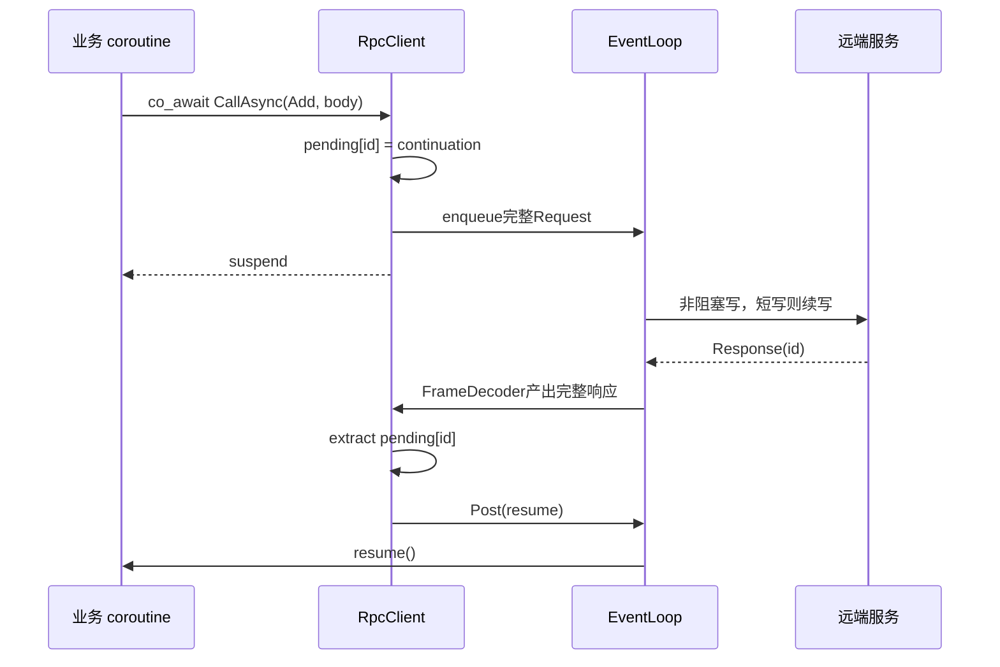

---
tags:
  - Linux
  - 网络编程基础
  - RPC
  - C++20
  - Coroutine
aliases:
  - C++ Coroutine RPC
  - 协程非阻塞RPC
  - co_await RPC
阅读次数: 0
---

# 7.4.1.3 C++ Coroutine：把非阻塞 RPC 写成顺序代码

[[7.4.1 RPC 协议模板(2)]] 已经用阻塞 socket 完成 `Add(3, 4)`：业务参数被编码为消息体，再加上 14 B 帧头进入 TCP 字节流。本篇**不修改线路协议**，只把：

```cpp
const Bytes reply = client.Call(kMethodAdd, args);
```

改写为：

```cpp
const Bytes reply = co_await client.CallAsync(kMethodAdd, args);
```

> [!important] coroutine 不是 I/O 引擎
> C++ coroutine 只负责保存局部状态、挂起和恢复。发现 socket 可读/可写的仍是事件循环、`epoll`、`io_uring` 或 RDMA CQ。没有非阻塞传输状态机，`co_await` 不会自动产生异步 I/O。

> [!abstract] 本篇约束
> C++20；TCP 已连接且为非阻塞模式；一条连接允许多个 RPC 在途；接收方向只有一个持续读状态机；发送方向用队列串行写完整帧；连接状态归一个 EventLoop 线程管理。

## 1. 不变的是 RPC 协议

请求和响应继续使用前一篇的固定头：

| 偏移 | 长度 | Request | Response |
|---:|---:|---|---|
| 0 | 2 B | `magic = 0x5243` | 同左 |
| 2 | 1 B | `version = 1` | 同左 |
| 3 | 1 B | `type = 1` | `type = 2` |
| 4 | 4 B | `request_id` | 原样回显 |
| 8 | 2 B | `method` | `status` |
| 10 | 4 B | `body_len` | `body_len` |

`Add` 请求体仍是两个网络序 `uint32_t`（8 B），成功响应体仍是一个网络序 `uint32_t`（4 B）。因此服务端无法知道客户端使用 callback、`future` 还是 coroutine；它只认识合法 Frame。

## 2. 全图：协议 ID 与本地句柄不能混用

![[图片/SVG/3_7_7_4_1_3_1.svg|1240]]

| 标识 | 所在层 | 是否上网 | 作用 |
|---|---|:---:|---|
| `request_id` | RPC 协议层 | 是 | 把 Response 关联回 Request |
| `std::coroutine_handle<>` | 本地调度层 | 否 | 指向要恢复的 coroutine frame |

客户端用 `pending[request_id]` 把两者关联。**绝不能把 coroutine 地址写进帧头**：地址只在当前进程和当前生命期内有效，也会泄露实现细节。

## 3. 业务层仍只看 `a`、`b` 与 `sum`

标准库定义 coroutine 协议，但不提供通用 `Task<T>` 或网络 runtime。下面假设项目已有调度感知的 `Task<T>`：

```cpp
Task<std::uint32_t> AddViaRpcAsync(RpcClient& client,
                                   std::uint32_t a,
                                   std::uint32_t b) {
    Bytes args;
    AppendU32(args, a);
    AppendU32(args, b);

    Bytes reply =
        co_await client.CallAsync(kMethodAdd, std::move(args));

    co_return ReadU32(reply);
}
```

业务层不知道 socket、帧头和发送偏移。等待响应期间 coroutine 挂起，但 EventLoop 所在线程继续处理其他连接。

## 4. awaiter 与待完成项

`co_await` 的三个步骤是：

```text
await_ready()   是否可以立即完成
await_suspend() 保存 continuation，把工作交给事件源
await_resume()  取得完成结果或重新抛出错误
```

一条调用需要显式共享状态：

```cpp
struct PendingCall {
    enum class State { Pending, Completed, Cancelled };

    std::uint32_t request_id{};
    std::coroutine_handle<> continuation{}; // 非拥有句柄
    std::optional<Bytes> reply;
    std::exception_ptr error;
    State state{State::Pending};
};

class RpcCallAwaiter {
public:
    bool await_ready() const noexcept { return false; }
    void await_suspend(std::coroutine_handle<> h);
    Bytes await_resume();

private:
    RpcClient& client_;
    std::uint16_t method_{};
    Bytes body_;
    std::shared_ptr<PendingCall> call_;
};
```

`await_resume()` 不再做网络 I/O，只读取完成路径已经写好的 `reply/error`。

> [!warning] `coroutine_handle` 不拥有 frame
> 保存句柄不会延长 coroutine 生命期。销毁上层 `Task` 前，必须先从 `pending` 表注销调用，并使后续完成事件无法再恢复该句柄。

## 5. 发起调用：先登记，后允许发送

```cpp
void RpcClient::StartCall(std::uint16_t method,
                          Bytes body,
                          std::shared_ptr<PendingCall> call) {
    loop_.AssertInLoopThread();

    const std::uint32_t id = NextRequestId();
    Bytes wire = EncodeFrame(MakeRequestFrame(id, method,
                                               std::move(body)));

    call->request_id = id;
    auto [it, inserted] = pending_.emplace(id, call);
    if (!inserted) throw std::logic_error("duplicate request_id");

    try {
        EnqueueFrame(std::move(wire));
    } catch (...) {
        pending_.erase(it);
        call->continuation = {};
        throw;
    }
}
```

顺序不能反过来。若请求已进入内核或网络，而 `pending` 还没登记，极快响应可能先被接收循环读到，随后只能被误判为未知 `request_id`。

awaiter 只保存 continuation 并启动调用：

```cpp
void RpcCallAwaiter::await_suspend(std::coroutine_handle<> h) {
    call_->continuation = h;
    client_.StartCall(method_, std::move(body_), call_);
}

Bytes RpcCallAwaiter::await_resume() {
    if (call_->error) std::rethrow_exception(call_->error);
    if (!call_->reply) throw std::logic_error("missing reply");
    return std::move(*call_->reply);
}
```

完成路径必须先取得并移除待完成项，再排队恢复：

```cpp
void RpcClient::Complete(Frame response) {
    auto node = pending_.extract(response.header.request_id);
    if (node.empty()) return;              // 晚到响应或未知 ID

    auto call = std::move(node.mapped());
    if (call->state != PendingCall::State::Pending) return;

    call->reply = std::move(response.body);
    call->state = PendingCall::State::Completed;
    auto h = std::exchange(call->continuation, {});
    loop_.Post([h] { if (h) h.resume(); });
}
```

“先移除，再恢复”可防止恢复后的业务代码立即发起新调用或销毁客户端时重入旧状态。

## 6. 接收与发送状态机仍然存在

coroutine 只隐藏业务层的等待，不隐藏 TCP 的短读、短写：

```text
接收：recv 到 EAGAIN
   → 追加输入缓冲
   → FrameDecoder 循环提取完整 Frame
   → Response.request_id 查 pending
   → Complete

发送：完整 Frame 入队
   → 从 front.offset 继续 send
   → 短写则保存 offset
   → EAGAIN 后等待下一次可写
   → 完整发送后弹出队首
```

多个 RPC 可以同时在途，但**同一 TCP 字节流的写入必须串行化**，否则不同 Frame 的字节会交叉。接收侧也只保留一个顺序解析器，因为 TCP 不提供多条独立消息通道。



## 7. deadline、取消和断线都要“一次完成”

响应、超时、主动取消和连接失败可能竞争同一调用。统一规则是：

```text
只有 Pending → Completed/Cancelled 的第一次转换生效
先从 pending 移除
再写 reply 或 error
清空 continuation
最后 Post(resume)
```

超时只表示客户端不再等待，**不证明服务端没有执行**。因此自动重试必须结合幂等性、去重键或业务事务设计。

连接失败时要一次性取出全部 `pending`，为每项写入同一个传输异常并恢复所有等待者；否则 coroutine 会永久挂起。

可使用短期 tombstone 集合记录最近超时或取消的 `request_id`：晚到响应命中 tombstone 时丢弃，真正未知 ID 才按协议错误处理。tombstone 必须有 TTL 和容量上限。

## 8. 背压与线程模型

挂起不占 OS 线程，但仍占用 coroutine frame、待完成项、发送字节和 deadline 节点。至少设置：

| 资源 | 建议上限 |
|---|---|
| 每连接在途调用数 | `max_pending_calls` |
| 发送队列总字节 | `write_high_watermark` |
| 单帧 body | `kMaxBodyLen` |
| 单轮读写/恢复数量 | fairness budget |

推荐连接状态只由一个 EventLoop 线程修改。其他线程通过 `Post()` 投递“发起调用/取消调用/关闭连接”命令。不要跨线程直接同时修改 `pending`、输入缓冲和发送队列。

> [!warning] 不要在恢复时持锁
> coroutine 恢复后可执行任意业务代码。若恢复路径仍持有客户端互斥锁，业务代码再次调用客户端便可能死锁。先完成状态转移并释放锁，再排队恢复。

## 9. `Add(3, 4)` 的标识轨迹

```text
业务值 3、4
→ Request Frame(request_id=42, method=Add, body_len=8)
→ pending[42] = coroutine_handle
→ coroutine 挂起
→ Response Frame(request_id=42, status=OK, body_len=4, sum=7)
→ extract pending[42]
→ Post(handle)
→ await_resume() 返回 body
→ AddViaRpcAsync co_return 7
```

TCP 不认识 coroutine；服务端也不保存客户端句柄。跨进程关联完全由帧头中的 `request_id` 完成。

## 10. 实现检查表

- [ ] 请求进入发送队列前已登记 `pending`；
- [ ] 每条连接只有一个输入解析器，发送按完整 Frame 串行；
- [ ] `EAGAIN` 后保存偏移并返回事件循环，不原地忙等；
- [ ] Response、超时、取消和断线只允许一次完成；
- [ ] 从 `pending` 移除并清空句柄后再 `Post(resume)`；
- [ ] 销毁 coroutine frame 前先注销句柄及已排队的恢复票据；
- [ ] `span`、引用和裸指针不会因挂起自动延寿；
- [ ] 在途数、发送字节、tombstone 和单轮工作量都有上限；
- [ ] 协议错误关闭连接，业务错误只完成当前调用。

## 11. 与后续两篇的关系

- 本篇解决：怎样把完成事件包装成 `co_await`；
- [[7.4.1.4 io_uring 非阻塞 RPC]] 解决：怎样由 SQE/CQE 产生 socket I/O 完成事件；
- [[7.4.1.5 RDMA Verbs 与 CQ 非阻塞 RPC]] 解决：怎样由 WR/WC、注册内存和 credit 承载同一 RPC。

三篇共享同一原则：**传输完成推进本地状态，`request_id` 完成远端调用；两者不是同一件事。**

## 参考资料

- [[7.4.1 RPC 协议模板(2)]]：14 B 帧头、`request_id`、错误边界与阻塞精确 I/O。
- W. Richard Stevens et al., *UNIX Network Programming, Volume 1*, 3rd ed., Chapter 16：非阻塞读写、短计数与 `EWOULDBLOCK`。
- Michael Kerrisk, *The Linux Programming Interface*, Chapter 63：非阻塞 fd 与事件驱动 I/O。
- 陈硕，《Linux 多线程服务端编程》，第 6～8 章：事件循环、应用层缓冲与 one loop per thread。
- C++ Working Draft: `[expr.await]`, `[coroutine.handle]`。
