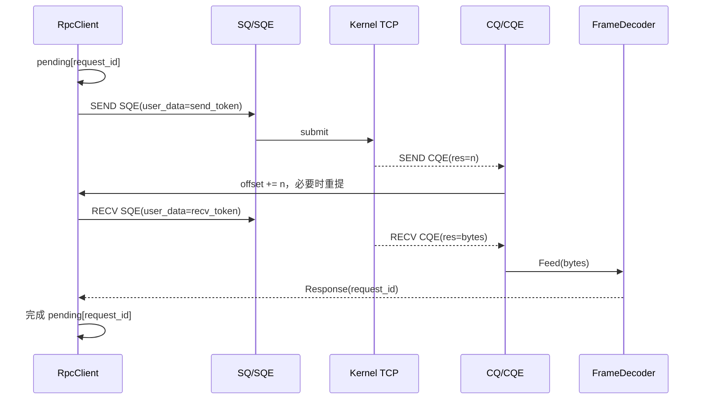

---
tags:
  - Linux
  - 网络编程基础
  - RPC
  - io_uring
  - C++
aliases:
  - io_uring RPC
  - io_uring非阻塞RPC
  - SQ CQ RPC
阅读次数: 0
---

# 7.4.1.4 io_uring：用 SQE/CQE 推进非阻塞 RPC

[[7.4.1 RPC 协议模板(2)]] 已经定义 14 B 帧头、`request_id`、`Add` 的请求/响应消息体和错误边界；[[7.4.1.3 C++ Coroutine 非阻塞 RPC]] 又把“等待响应”包装为 `co_await`。本篇继续保留同一 RPC 协议，只把 socket I/O 的驱动方式换成 `io_uring`。

> [!important] CQE 不是 RPC 响应
> CQE 只说明一项**本地 I/O 请求**完成：例如本次发送了多少字节、本次接收了多少字节。只有接收字节经过 `FrameDecoder` 组成完整 Response，并按 `request_id` 找到待完成调用后，一次 RPC 才完成。

> [!abstract] 本篇约束
> 一条已连接 TCP socket；普通 `IORING_OP_SEND/RECV` 基线；每个方向最多一个普通 I/O op 在途；完整 Frame 进入发送队列；输入字节进入同一个 FrameDecoder；省略 TLS、固定文件和高级零拷贝。

## 1. 不变的是线路协议

| 字段 | 长度 | Request | Response |
|---|---:|---|---|
| `magic` | 2 B | `0x5243` | 同左 |
| `version` | 1 B | `1` | 同左 |
| `type` | 1 B | `1` | `2` |
| `request_id` | 4 B | 客户端生成 | 原样回显 |
| `code` | 2 B | `method` | `status` |
| `body_len` | 4 B | body 长度 | body 长度 |

`Add(3, 4)` 仍发送 22 B，请求响应仍为 18 B。`io_uring` 不改变定界、字节序、方法分发和错误语义。

## 2. 全图：两套完成标识

![[图片/SVG/3_7_7_4_1_4_1.svg|1240]]

| 标识 | 关联对象 | 生命周期 | 是否上网 |
|---|---|---|:---:|
| SQE/CQE `user_data` | 一项本地 `UringOp` | 提交到消费 CQE | 否 |
| RPC `request_id` | 一次远端 Request/Response | 发起到响应/超时 | 是 |

典型关系是：

```text
CQE.user_data → SendOp/RecvOp
RecvOp.buffer → FrameDecoder → Response.request_id
Response.request_id → pending RPC/coroutine
```

不能直接令 `user_data == request_id`。一次 RPC 可能经历多次短发送；一个 RECV CQE 也可能含半帧、多帧或跨多个 RPC 的字节。

## 3. 四个核心对象

```text
Submission Queue Entry（SQE）  描述要做的 I/O
Submission Queue（SQ）        用户态提交队列
Completion Queue Entry（CQE） 返回 res、flags、user_data
Completion Queue（CQ）        内核发布完成结果
```

`io_uring_get_sqe()` 只是在 SQ 中取得一个可填写槽位；返回 `nullptr` 说明当前没有可用 SQE。必须把它当作正常容量信号：先 `submit`、收割 CQ 或把上层写入纳入背压，而不是解引用空指针。

## 4. 本地 op 必须先拥有全部资源

```cpp
struct UringOp {
    enum class Kind { Send, Recv };
    virtual ~UringOp() = default;
    Kind kind;
};

struct SendOp final : UringOp {
    explicit SendOp(std::shared_ptr<OutFrame> f)
        : UringOp{Kind::Send}, frame(std::move(f)) {}
    std::shared_ptr<OutFrame> frame;
};

struct RecvOp final : UringOp {
    explicit RecvOp(std::size_t capacity)
        : UringOp{Kind::Recv}, buffer(capacity) {}
    Bytes buffer;
};
```

提交前先把 op 放进本地所有权表，再把稳定 token 写入 `user_data`：

```cpp
std::uint64_t token = ops_.Insert(std::move(op));
io_uring_sqe* sqe = io_uring_get_sqe(&ring_);
if (!sqe) {
    ops_.Erase(token);
    return SubmitResult::SqFull;
}

io_uring_prep_send(sqe, fd,
                   frame.data() + frame.offset,
                   frame.size() - frame.offset, MSG_NOSIGNAL);
io_uring_sqe_set_data64(sqe, token);
```

> [!warning] buffer 要活到 CQE
> `io_uring_prep_send/recv` 只把地址和长度写入 SQE，不复制应用缓冲区。直到对应 CQE 被消费前，不得移动、缩容或释放该内存。`std::vector` 扩容导致地址变化同样危险。

生产代码还要处理“op 已登记但 SQE 填写/提交失败”的回滚，保证 token 不泄漏。

## 5. 发送方向：短发送后继续同一 Frame

CQE 的 `res` 对 SEND 是本次发送的字节数，不保证覆盖请求长度：

```cpp
void Connection::OnSendCqe(SendOp& op, int res) {
    send_active_ = false;

    if (res < 0) {
        if (res == -EAGAIN) {
            ScheduleSendAgain(op.frame); // 可配合 POLL_FIRST
            return;
        }
        FailConnection(-res);
        return;
    }
    if (res == 0) {
        FailConnection(EPIPE);
        return;
    }

    op.frame->offset += static_cast<std::size_t>(res);
    if (op.frame->offset < op.frame->wire.size()) {
        SubmitSend(op.frame);             // 只发 remaining
        return;
    }

    write_queue_.pop_front();
    SubmitNextSend();
}
```

推荐每条 TCP 连接只有一个普通 SEND op 在途：完整 Frame 按发送队列顺序推进，既保持字节顺序，也简化缓冲生命期。`res > 0` 只说明字节进入本地发送路径，**不表示远端服务已执行，更不表示 RPC 成功**。

若某 socket 经常先得到 `-EAGAIN`，可在重提时使用 `IORING_RECVSEND_POLL_FIRST`，让内核先等待就绪再尝试收发；它是调度优化，不改变短计数处理。

## 6. 接收方向：CQE 交付的是 TCP 字节片段

```cpp
void Connection::OnRecvCqe(RecvOp& op, int res) {
    recv_active_ = false;

    if (res == 0) {
        FailAllPending(make_error_code(RpcErrc::PeerClosed));
        return;
    }
    if (res < 0) {
        if (res == -EAGAIN) {
            SubmitRecv();
            return;
        }
        FailConnection(-res);
        return;
    }

    decoder_.Feed(std::span(op.buffer.data(),
                            static_cast<std::size_t>(res)));

    while (auto frame = decoder_.TryPop()) {
        OnFrame(std::move(*frame));
    }
    SubmitRecv();
}
```

一次 CQE 可能得到：

```text
半个 14 B 头
完整头 + 半个 body
一个完整 Frame
多个完整 Frame
前一帧尾部 + 后一帧头部
```

因此 RECV CQE 不能直接对应某个 `request_id`。只有 `FrameDecoder` 产出完整 Frame 后，才验证 `magic/version/type/body_len`，再按 `request_id` 完成调用。

## 7. 正确收割 CQ

```cpp
void UringLoop::DrainCompletions() {
    io_uring_cqe* cqe = nullptr;

    while (io_uring_peek_cqe(&ring_, &cqe) == 0) {
        const std::uint64_t token = io_uring_cqe_get_data64(cqe);
        const int res = cqe->res;
        const unsigned flags = cqe->flags;
        io_uring_cqe_seen(&ring_, cqe); // 先复制字段，再归还 CQ 槽

        auto op = ops_.Extract(token);  // 普通单次 op 只消费一次
        if (!op) {
            HandleUnknownToken(token);
            continue;
        }
        Dispatch(std::move(op), res, flags);
    }
}
```

普通 SEND/RECV 的 op 在最终 CQE 到来前必须存在；CQE 被消费后才可释放 op 和缓冲。事件循环每轮应限制 CQE 数量，避免一个繁忙连接饿死定时器和其他 fd。



## 8. deadline 与取消分两层

RPC deadline 管的是“等待远端 Response 的时间”；异步取消管的是“本地某个 io_uring op”。二者不能混为一谈：

- 单个 RPC 超时：从 `pending` 移除并恢复该调用，但通常**不要取消共享 RecvOp**；
- 连接关闭：取消该连接的 SEND/RECV op，并等待它们各自的终结 CQE 后释放缓冲；
- 取消请求成功提交，不代表目标 op 已经停止引用内存；仍要以 CQE 为回收点；
- 晚到 Response 用有界 tombstone 识别，不能再次恢复已超时 coroutine。

链接超时或 `IORING_OP_LINK_TIMEOUT` 可约束一组本地 I/O，但仍不等同于端到端 RPC deadline，也不证明服务端未执行。

## 9. 五层背压

| 层 | 容量信号 | 动作 |
|---|---|---|
| SQ | `get_sqe() == nullptr` | submit/drain，暂停继续造 op |
| CQ | 收割速度不足 | 增大 drain budget、降低提交速率 |
| 发送队列 | 字节超过高水位 | 拒绝/挂起新调用 |
| RPC pending | 在途调用过多 | admission control |
| 协议 | body 过大 | 协议错误并关闭连接 |

ring 深度不是业务并发上限。即使 SQ 还有位置，也不能无限创建 Frame、coroutine 和 pending 项。

## 10. 高级能力放在正确层

- multishot recv：一个 SQE 可产生多个带 `IORING_CQE_F_MORE` 的 CQE；op 与接收缓冲池必须活到最后一个不带 `F_MORE` 的 CQE；
- provided buffer / buffer ring：内核选择接收缓冲，CQE flags 标识 buffer ID；消费后才能归还；
- send/recv bundle：减少提交/完成开销，但 FrameDecoder 和 `request_id` 关联仍不可删除；
- SQPOLL：改变提交路径和 CPU 成本，不改变协议、缓冲生命期或短发送语义。

`io_uring` 也不等于自动 zero-copy，更不等于 RDMA。普通 SEND/RECV 仍走内核 TCP 栈；是否复制取决于所选 opcode、内核和 NIC 能力。

## 11. `Add(3, 4)` 的状态轨迹

```text
Request(id=42, 22 B) 入发送队列
→ SendOp(token=1001) 提交
→ CQE(token=1001, res=9)
→ offset=9，重提 remaining 13 B
→ CQE(res=13)，本地发送完成
→ RecvOp(token=2001) 得到若干 TCP 字节
→ FrameDecoder 产出 Response(id=42, sum=7)
→ extract pending[42]
→ coroutine/callback 完成
```

注意：两个 SEND CQE 都不是 RPC 完成；最后一步由 Response 的 `request_id` 决定。

## 12. 实现检查表

- [ ] `user_data` 只关联本地 op，`request_id` 只关联 RPC；
- [ ] op 在提交前进入所有权表，buffer 活到最终 CQE；
- [ ] SQ 满、短发送、`-EAGAIN`、EOF 和负 errno 都被显式处理；
- [ ] 同一连接普通 SEND 串行，同一方向只保留一个普通 RECV；
- [ ] CQE 字段先复制，再 `cqe_seen`，再按 token 提取 op；
- [ ] RECV 字节必须经过 FrameDecoder，不能把一次 CQE 当一帧；
- [ ] 单 RPC 超时不取消共享接收 op；
- [ ] 取消后仍等待终结 CQE 才释放被内核引用的资源；
- [ ] SQ、CQ、发送字节、pending 和单轮工作量都有上限。

## 参考资料

- [[7.4.1 RPC 协议模板(2)]]；[[7.4.1.3 C++ Coroutine 非阻塞 RPC]]。
- *Systems Performance*, 2nd ed.：Linux I/O、延迟和 `io_uring` 的 SQ/CQ 模型。
- `io_uring(7)`；liburing manual：`io_uring_get_sqe(3)`、`io_uring_prep_send(3)`、`io_uring_prep_recv(3)`、`io_uring_prep_cancel(3)`。
