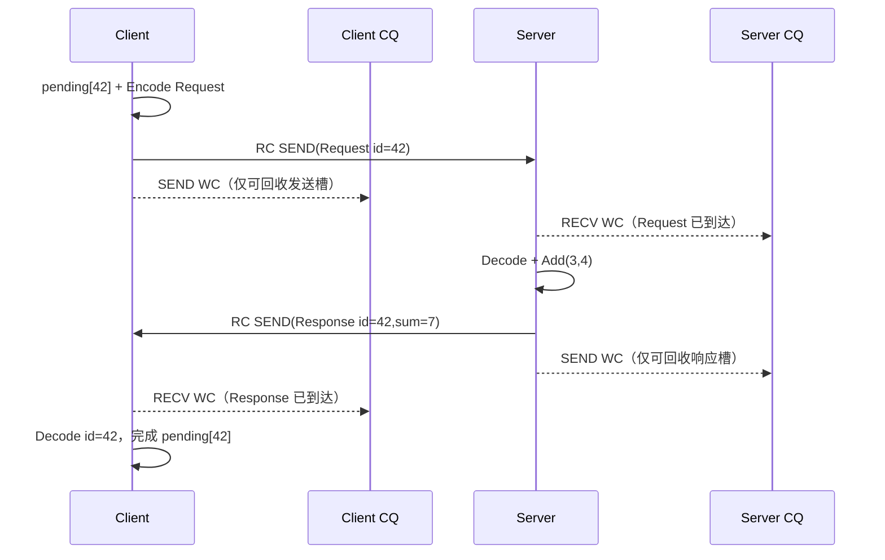

---
tags:
  - Linux
  - 网络编程基础
  - RPC
  - RDMA
  - libibverbs
  - CompletionQueue
aliases:
  - RDMA RPC
  - Verbs CQ RPC
  - RDMA非阻塞RPC
阅读次数: 0
---

# 7.4.1.5 RDMA Verbs 与 CQ：用 WR/WC 承载非阻塞 RPC

[[7.4.1 RPC 协议模板(2)]] 定义的 `Frame`、`request_id`、方法号和状态码与 TCP 无关；它们同样可以放进 RDMA 消息。本篇先采用最容易与原案例对应的 **RC QP + SEND/RECV**：一条 SEND 携带一条完整 RPC Frame，接收端预贴 RECV，CQ 交付 Work Completion（WC）。

> [!important] 本地 WC 不等于远端 RPC 完成
> SEND WC 只允许本地回收该发送缓冲；RECV WC 只说明一条消息已落入本地接收槽。客户端必须真正收到并解析 `Response(request_id=...)`，才能完成一次 RPC。

> [!abstract] 本篇约束
> 两端已通过控制面建立 RC QP；消息不大于预设 slot；每个 SEND/RECV buffer 已注册；一个 WR 对应一个完整 Frame；CQ 由一个 I/O 线程轮询或“事件唤醒后批量轮询”；省略 CM、RoCE 拥塞配置和多路径。

## 1. 线路协议仍是 14 B 头

| 字段 | 长度 | Request | Response |
|---|---:|---|---|
| `magic` | 2 B | `0x5243` | 同左 |
| `version` | 1 B | `1` | 同左 |
| `type` | 1 B | `1` | `2` |
| `request_id` | 4 B | 客户端生成 | 原样回显 |
| `code` | 2 B | `method` | `status` |
| `body_len` | 4 B | body 长度 | body 长度 |

`Add(3, 4)` 请求是 22 B，成功响应是 18 B。与 TCP 的区别是：SEND/RECV 保留消息边界，因此基线方案不需要从字节流中处理半个头；但仍要验证 `byte_len >= 14`、`body_len`、消息类型和总长度。

## 2. 全图：WR/WC 与 `request_id` 分层

![[图片/SVG/3_7_7_4_1_5_1.svg|1240]]

至少有三类标识：

| 标识 | 作用域 | 是否上网 | 作用 |
|---|---|:---:|---|
| `wr_id` | 本地 QP/CQ | 否 | WC 找回本地 WR 上下文和 buffer |
| `request_id` | RPC 协议 | 是 | Response 找回原远端调用 |
| QP number | RDMA 传输 | 控制面交换 | 标识通信端点 |

典型完成链：

```text
WC.wr_id → SendSlot/RecvSlot
RecvSlot bytes → Decode Frame
Frame.request_id → pending RPC/coroutine
```

不要把指针直接作为跨进程 ID；即使把本地指针强转为 `wr_id`，也必须保证对象直到最终 WC 都存在，并处理 ABA/重用风险。更稳妥的是 generation + slot index 或本地 token 表。

## 3. verbs 资源图与控制面

```text
ibv_context
  └─ Protection Domain（PD）
       ├─ Memory Region（MR：addr/length/lkey/rkey）
       └─ Queue Pair（QP：Send Queue + Receive Queue）
Completion Queue（CQ）← QP 产生 WC
Completion Channel（可选）← CQ 事件通知
```

RC QP 通常经历：

```text
RESET → INIT → RTR → RTS
```

两端需通过 TCP、RDMA CM 或其他控制面交换 QPN、PSN、LID/GID、路径 MTU 等连接参数。**SEND/RECV 的数据 SGE 使用本地 `lkey`；远端 `rkey` 主要用于 RDMA READ/WRITE，不应为消息模式强行暴露。**

控制面失败、QP 进入 error 或链路重建时，要把该连接全部 `pending` 统一失败，不能让等待者永久挂起。

## 4. 注册内存：地址在 WC 前必须稳定

```cpp
struct Slot {
    std::byte* data{};
    std::uint32_t capacity{};
    std::uint32_t length{};
    std::uint32_t lkey{};
    std::uint32_t generation{};
};
```

slot 通常来自固定大小 arena；arena 注册一次，slot 只记录偏移和 `lkey`。提交 WR 后直到相应 WC：

- buffer 地址、长度覆盖范围和 MR 必须有效；
- 不得让 `std::vector` 扩容移动底层地址；
- 不得注销 MR、释放 arena 或复用 slot；
- `ibv_send_wr`/`ibv_sge` 描述符可在 `ibv_post_send()` 成功返回后离开栈，但它们指向的注册数据缓冲仍必须存活。

`ibv_dereg_mr()` 不是普通 RPC 完成路径上的频繁操作；热路径应复用注册内存池。

## 5. 先预贴 RECV，再允许对端发送

SEND/RECV 模式要求接收队列已经有可消费的 Receive WR：

```cpp
bool PostRecv(QueuePair& qp, Slot& slot, std::uint64_t token) {
    ibv_sge sge{
        .addr   = reinterpret_cast<std::uintptr_t>(slot.data),
        .length = slot.capacity,
        .lkey   = slot.lkey,
    };
    ibv_recv_wr wr{
        .wr_id   = token,
        .next    = nullptr,
        .sg_list = &sge,
        .num_sge = 1,
    };
    ibv_recv_wr* bad = nullptr;
    return ibv_post_recv(qp.get(), &wr, &bad) == 0;
}
```

启动时预贴 N 个 RecvSlot；每消费一个成功 RECV WC，先解析/复制需要的数据，再清空并立即 repost。若远端发送时没有可用 Receive WR，RC 会进入 RNR 重试，重试耗尽可使 QP 失败。

因此接收槽是显式信用。常见做法：

```text
local_rq_depth  表示本端已预贴多少槽
remote_credit   表示估计对端还能接收多少条消息
remote_credit == 0 时停止发新 RPC
完成接收并 repost 后，通过响应或控制消息归还 credit
```

仅靠“我本地还能 post send”无法证明对端 RQ 有空间。

## 6. 提交 SEND：一条 WR 携带一条完整 Frame

```cpp
bool PostSend(QueuePair& qp,
              Slot& slot,
              std::uint64_t token,
              bool signaled) {
    ibv_sge sge{
        .addr   = reinterpret_cast<std::uintptr_t>(slot.data),
        .length = slot.length,
        .lkey   = slot.lkey,
    };

    ibv_send_wr wr{};
    wr.wr_id = token;
    wr.sg_list = &sge;
    wr.num_sge = 1;
    wr.opcode = IBV_WR_SEND;
    wr.send_flags = signaled ? IBV_SEND_SIGNALED : 0;

    ibv_send_wr* bad = nullptr;
    return ibv_post_send(qp.get(), &wr, &bad) == 0;
}
```

提交前必须完成：

```text
分配 request_id
→ pending[request_id] 登记调用
→ 编码完整 Frame 到 SendSlot
→ SendSlot 进入本地所有权表
→ 检查 remote_credit 与 SQ 容量
→ ibv_post_send
```

若 `ibv_post_send` 失败，`bad_wr` 指向未成功提交的起点；生产代码必须按“已提交/未提交”边界回滚，不能既丢 slot 又重复发送。

SEND WC 的成功语义是本地 NIC 已完成该 WR，发送 slot 可以按策略回收；它不是远端业务确认。客户端仍等待 Response。

## 7. CQ：批量轮询并按 `wr_id` 分发

```cpp
void PollCq(ibv_cq* cq) {
    std::array<ibv_wc, 32> wc{};

    for (;;) {
        int n = ibv_poll_cq(cq, static_cast<int>(wc.size()), wc.data());
        if (n < 0) {
            FailTransport("ibv_poll_cq failed");
            return;
        }
        if (n == 0) return;

        for (int i = 0; i < n; ++i) {
            if (wc[i].status != IBV_WC_SUCCESS) {
                FailQueuePair(wc[i]);
                continue;
            }
            DispatchCompletion(wc[i]);
        }
    }
}
```

接收完成路径：

```cpp
void OnRecvWc(const ibv_wc& wc, RecvSlot& slot) {
    if (wc.opcode != IBV_WC_RECV || wc.byte_len < kWireHeaderSize) {
        FailProtocol();
        return;
    }

    Frame frame = DecodeMessage(slot.data, wc.byte_len);
    if (frame.header.type == MessageType::Response) {
        CompletePending(std::move(frame));
    } else {
        DispatchRequest(std::move(frame));
    }

    slot.Reset();
    PostRecvAgain(slot);
}
```

CQ 可能同时交付多个 QP、SEND 与 RECV 的 WC，因此 `wr_id` 必须编码 kind/slot/generation 或查本地表。CQ overrun 会丢失完成语义，通常应视为传输级严重故障；要保证足够 CQ 深度并持续 drain。



## 8. busy poll、事件通知与混合模式

| 模式 | 延迟 | CPU | 适合 |
|---|---|---|---|
| 持续 `ibv_poll_cq` | 最低 | 高 | 专用核、极低延迟 |
| completion channel | 较高 | 低 | 低负载或共享核 |
| 混合 | 折中 | 可控 | 先自旋一段时间，无 WC 再睡眠 |

使用 completion channel 时，事件只是“CQ 可能有完成”，不是一个事件对应一个 WC。典型循环要 ack 事件、重新 `ibv_req_notify_cq()`，然后再次 drain CQ，避免重新武装窗口丢掉已到达完成。

无论哪种模式，都应批量处理 WC 并设置单轮 budget，避免一个热点 QP 饿死定时器和其他连接。

## 9. signaled 与 unsignaled SEND

每个 SEND 都 `IBV_SEND_SIGNALED` 最容易保证正确，但会增加 CQ 压力。选择性 signaling 时：

```text
每 K 个 SEND 设置一个 signaled
未 signaled WR 不会各自产生 WC
后续 signaled WC 到达后，才按 SQ 有序完成关系批量回收之前的 WR
```

因此所有权表必须按批次记录“一个 signaled fence 覆盖哪些未 signaled slot”。不能等待一个永远不会出现的 unsignaled WC，也不能在 fence 完成前复用其缓冲。QP 出错时还要处理 flush/error WC，并统一释放未完成批次。

## 10. deadline、取消与错误

RPC 超时只表示调用者不再等待，不代表已 post 的 SEND/RECV WR 不再引用内存。verbs 没有“按 `request_id` 撤回已发送消息”的通用操作：

- 单 RPC 超时：从 `pending` 移除，保留有界 tombstone；对应 WR/slot 仍按 WC 回收；
- 连接级取消：使 QP 进入 error/关闭，继续 drain flush completion，再销毁 QP、CQ、MR 和 arena；
- 任意 WC 失败：记录 `status/opcode/vendor_err/wr_id/QP`，通常升级为 QP/连接故障并失败全部 pending；
- 不能先释放 MR/slot 再等待 error WC。

超时自动重试还必须考虑服务端可能已经执行；与 TCP RPC 一样，需要幂等或去重设计。

## 11. one-sided RDMA 不是自动 RPC

普通 RDMA WRITE 只把字节搬到远端地址，不会自动：

```text
分配远端 slot
通知远端 CPU
验证完整性
调用 Add handler
生成 Response
处理超时与重用
```

若改用 RDMA WRITE/READ，必须另外定义 slot ownership、generation、生产者/消费者索引、内存可见性和通知协议。通知可用 SEND、Write with Immediate 或共享队列机制；但本地 write completion 仍只说明本地操作完成，**不等于远端业务响应**。

大消息常见拆分是：小型 RPC Frame 走 SEND/RECV 控制面，Frame 中携带远端地址、长度、rkey 和操作类型；大块数据走 RDMA READ/WRITE 数据面；最后仍用 `Response(request_id)` 确认业务语义。

## 12. `Add(3, 4)` 的 slot 轨迹

```text
Client pending[42]
→ Client SendSlot[5] = Request(id=42, 22 B)
→ post_send(wr_id=SendReq/5/gen)
→ Server RecvSlot[9] 的 RECV WC(byte_len=22)
→ Decode Add(3,4)，sum=7
→ Server SendSlot[2] = Response(id=42, 18 B)
→ Client RecvSlot[7] 的 RECV WC(byte_len=18)
→ Decode id=42，extract pending[42]
→ coroutine/callback 返回 7
```

客户端 SEND WC 只回收 `SendSlot[5]`；真正完成调用的是客户端收到 Response 的 RECV WC。

## 13. 实现检查表

- [ ] QP 在允许业务发送前已到 RTS，控制面参数校验完整；
- [ ] 所有 SGE 指向注册且地址稳定的内存，MR/slot 活到最终 WC；
- [ ] 启动时预贴足够 RECV，消费后及时 repost；
- [ ] `wr_id`、`request_id` 与 QPN 不混用；
- [ ] 请求先登记 pending，再 post SEND；
- [ ] SEND WC 只回收本地资源，RECV WC + 合法 Response 才完成 RPC；
- [ ] remote credit、SQ 深度、CQ 深度、slot 数和 pending 都有限；
- [ ] selective signaling 有明确 fence 与批量回收账本；
- [ ] CQ 持续 drain，处理 overrun、flush 和所有非成功 WC；
- [ ] 超时不提前释放仍被 HCA 引用的内存；
- [ ] 关闭顺序是停止新请求、使 QP 终止、收割完成、再销毁资源。

## 14. 与 coroutine 的组合

[[7.4.1.3 C++ Coroutine 非阻塞 RPC]] 中的 awaiter 不需要认识 verbs：

```text
await_suspend → pending[request_id] + post_send
CQ thread     → RECV WC + Decode Response
完成路径      → extract pending + Post(coroutine_handle)
await_resume  → 返回 body 或抛出传输错误
```

coroutine 解决顺序表达；verbs/CQ 解决低延迟传输完成；`request_id` 仍负责端到端 RPC 关联。

## 参考资料

- [[7.4.1 RPC 协议模板(2)]]；[[7.4.1.3 C++ Coroutine 非阻塞 RPC]]；[[7.4.1.4 io_uring 非阻塞 RPC]]。
- *Computer Architecture: A Quantitative Approach*, 6th ed., Appendix F：InfiniBand/RDMA 通信与远端内存访问。
- rdma-core/libibverbs manual：`ibv_post_send(3)`、`ibv_post_recv(3)`、`ibv_poll_cq(3)`、`ibv_req_notify_cq(3)`、`ibv_get_cq_event(3)`。
