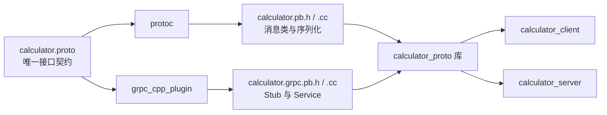
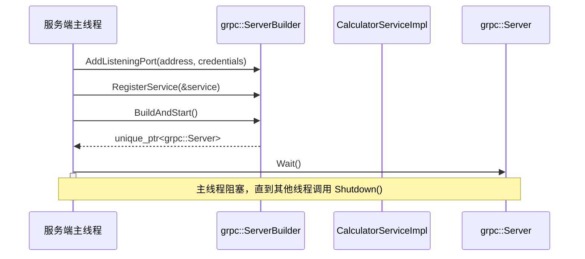
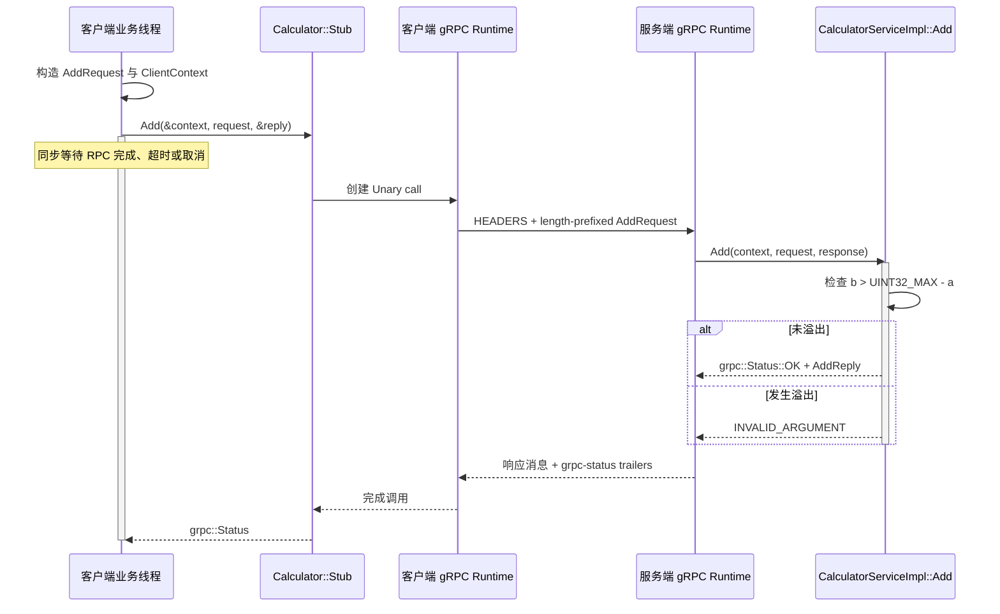
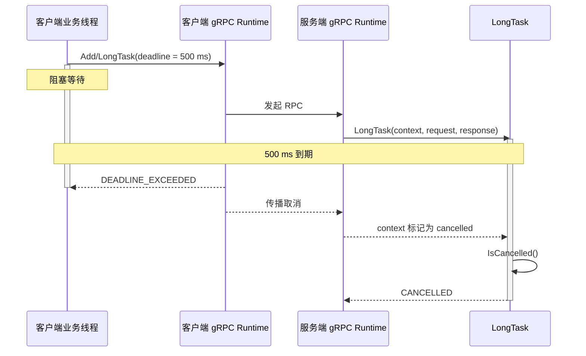

---
tags:
  - Linux
  - 网络编程基础
  - 应用层协议
  - RPC
  - gRPC
aliases:
  - gRPC
  - gRPC C++基础
  - gRPC RPC框架
  - gRPC Unary RPC
  - gRPC Add完整示例
阅读次数: 0
---

# 7.4.2 gRPC：用代码生成重写 7.4.1 的 Add RPC

[[7.4.1 RPC协议模板]] 已经手工完成了一次远程调用：

```cpp
const std::uint32_t sum = AddViaRpc(client, 3, 4);  // 返回 7
```

为了让这行代码跨进程工作，前一篇亲手实现了帧头、消息体编码、精确读写、方法分发、状态码和 `request_id` 校验。本篇不再从另一个无关的 Hello World 开始，而是用 **gRPC C++ 完整重写同一个 `Add` 案例**，借此回答三个问题：

1. `.proto` 到底替代了手写协议中的哪些约定？
2. 生成的 `Stub` 和 `Service` 怎样替代 `RpcClient::Call()` 与 `RpcServer::Dispatch()`？
3. gRPC 帮我们处理了哪些线路细节，又有哪些分布式系统问题仍然必须由业务决定？

> [!abstract] 本篇产物
> 完成后会得到一个可运行的 C++17 项目：
>
> - `calculator.proto`：服务接口与消息 schema；
> - `calculator_server`：同步 Unary 服务端；
> - `calculator_client`：带 deadline 的客户端；
> - 两条可验证路径：`3 + 4 = 7`，以及无符号加法溢出返回 `INVALID_ARGUMENT`。

---

## 1. 先把 7.4.1 的协议案例钉死

前一篇不是笼统地“传一段字节”，而是把 `Add` 的契约精确到了线路布局：

| 项目 | 7.4.1 的约定 |
|---|---|
| 方法号 | `kMethodAdd = 1` |
| 请求体 | 两个网络序 `uint32_t`，固定 8 B |
| 成功响应体 | 一个网络序 `uint32_t`，固定 4 B |
| 成功状态 | `StatusCode::Ok` |
| 溢出 | `StatusCode::InvalidArgument` |
| 调用关联 | 响应原样回送 `request_id` |
| 外层帧 | 14 B 固定头 + `body_len` 字节消息体 |

一次 `AddViaRpc(client, 3, 4)` 的自定义协议数据量是：

```text
请求：14 B 帧头 + 8 B 请求体 = 22 B
响应：14 B 帧头 + 4 B 响应体 = 18 B
合计：40 B（尚未计算 TCP/IP 等下层开销）
```

gRPC 版本必须保持**相同的业务语义**：

```text
输入：两个 uint32
输出：一个 uint32
溢出：明确失败，不能回绕
调用方式：客户端像调用一个类型安全的 C++ 方法
```

变化的是实现这些语义的方式，而不是业务契约本身。

---

## 2. 手写 RPC 与 gRPC 的逐项映射

| 7.4.1 手写实现 | gRPC 中的对应物 | 谁负责 |
|---|---|---|
| `kMethodAdd = 1` | `rpc Add(...) returns (...);` | `.proto` + 代码生成 |
| 8 B 请求体布局 | `AddRequest` | Protocol Buffers schema |
| 4 B 响应体布局 | `AddReply` | Protocol Buffers schema |
| `AppendU32()` / `ReadU32()` | `set_a()` / `a()` 等生成接口 | protobuf 生成代码 |
| `FrameHeader` / `body_len` | gRPC 消息前缀与 HTTP/2 帧 | gRPC runtime |
| `request_id` | HTTP/2 stream 与内部调用状态 | gRPC runtime |
| `RpcClient::Call()` | 生成的 `Calculator::Stub::Add()` | gRPC 生成代码与 runtime |
| `RpcServer::Dispatch()` | 生成的 `Calculator::Service` | gRPC 生成代码与 runtime |
| 自定义 `StatusCode` | `grpc::Status` / `grpc::StatusCode` | gRPC API |
| `ReadExactly()` / `WriteAll()` | 底层流式收发与重新组帧 | gRPC / HTTP/2 / TCP |
| 连接级协议错误 | stream reset 或连接错误 | gRPC runtime |
| deadline、取消 | `ClientContext` / `ServerContext` | 应用配置 + runtime 协作 |

最重要的变化是：**方法和消息不再靠分散在客户端、服务端代码里的常量与手写偏移量保持一致，而是集中写进一份 IDL 文件。**



这张图强调：人手维护的是 `.proto` 和业务实现，`*.pb.*`、`*.grpc.pb.*` 都是可重复生成的构建产物，不应直接修改。

---

## 3. 完整项目结构

本篇采用下面的目录：

```text
grpc-add/
├── CMakeLists.txt
├── proto/
│   └── calculator.proto
└── src/
    ├── calculator_server.cpp
    └── calculator_client.cpp
```

生成文件放在构建目录，而不是源码目录：

```text
build/generated/
├── calculator.pb.h
├── calculator.pb.cc
├── calculator.grpc.pb.h
└── calculator.grpc.pb.cc
```

这样做有两个原因：

1. 生成文件不是手写源码，不应该和真正的接口定义混在一起；
2. 删除 `build/` 后可以从 `.proto` 完整重建，能够验证项目没有偷偷依赖过期生成物。

---

## 4. 用 `.proto` 表达 Add 的服务契约

创建 `proto/calculator.proto`：

```proto
syntax = "proto3";

package rpcdemo;

service Calculator {
  rpc Add(AddRequest) returns (AddReply);
}

message AddRequest {
  uint32 a = 1;
  uint32 b = 2;
}

message AddReply {
  uint32 sum = 1;
}
```

这份文件同时定义了两层契约：

- `service Calculator` 定义**能调用什么远程操作**；
- `message` 定义**请求和响应中的数据怎样表示**。

生成 C++ 代码后，业务代码主要接触这些类型：

```cpp
rpcdemo::AddRequest
rpcdemo::AddReply
rpcdemo::Calculator::Stub
rpcdemo::Calculator::Service
```

### 4.1 `rpc Add` 替代的不是一个普通函数声明

```proto
rpc Add(AddRequest) returns (AddReply);
```

它会同时影响：

```text
客户端：生成同步/异步调用入口
服务端：生成待实现的虚函数接口
线路上：形成 /rpcdemo.Calculator/Add 方法路径
运行时：建立一次 Unary RPC 的请求、响应和状态生命周期
```

因此，修改 `package`、`service` 或方法名，不只是“重命名 C++ 标识符”，还会改变远程方法的身份。

### 4.2 字段编号才是长期线路契约

```proto
uint32 a = 1;
uint32 b = 2;
```

`1` 和 `2` 不是默认值，而是 field number。protobuf 在线路上用它识别字段，所以已经发布后：

- 不能把 `a = 1` 改成 `a = 7`；
- 删除字段后不能把编号分给别的含义；
- 删除字段时应使用 `reserved` 保留旧编号和必要的旧名字。

例如：

```proto
message AddRequest {
  uint32 a = 1;
  uint32 b = 2;

  reserved 3;
  reserved "old_precision";
}
```

> [!danger] 不要为了“排列整齐”重新编号
> C++ 成员顺序可以重构，protobuf field number 不可以。它属于外部协议，不属于进程内实现。

### 4.3 protobuf 的 `uint32` 不是固定 4 字节网络序整数

[[7.4.1 RPC协议模板]] 中的 `AppendU32()` 总是写出 4 B。protobuf 的 `uint32` 默认使用 **varint** 编码，小数值通常只占 1 B；字段本身还会带一个由“字段编号 + wire type”组成的 tag。

因此：

```text
C++ 类型相同
≠
线路编码相同
```

这也是为什么不能拿"手写请求体 8 B"直接推导"protobuf 请求体也一定 8 B"。协议编解码相关的现代 C++ 基础（如 `std::byte`、`std::span`、`constexpr`）见 [[15.13 std::span|15.13 std::span 连续内存视图]]。

### 4.4 “字段不存在”和“字段值为 0”是否要区分

在当前 proto3 写法中，普通标量字段读取不到时会得到默认值 `0`。对 `Add` 来说，缺失的 `a` 与显式发送 `a = 0` 可以视为同一个业务输入，因此足够使用。

如果将来业务必须区分“没有提供”与“明确提供 0”，应显式使用 presence：

```proto
message AddRequest {
  optional uint32 a = 1;
  optional uint32 b = 2;
}
```

生成代码后可以通过 `has_a()`、`has_b()` 判断字段是否出现。是否需要 presence 是**业务语义选择**，不是代码风格选择。

---

## 5. 用 CMake 自动生成并编译代码

下面的 `CMakeLists.txt` 假设 gRPC 与 protobuf 已经以 CMake package 的方式安装，项目使用 C++17：

```cmake
cmake_minimum_required(VERSION 3.22)

project(grpc_add_demo LANGUAGES CXX)

set(CMAKE_CXX_STANDARD 17)
set(CMAKE_CXX_STANDARD_REQUIRED ON)
set(CMAKE_CXX_EXTENSIONS OFF)

find_package(Protobuf CONFIG REQUIRED)
find_package(gRPC CONFIG REQUIRED)
```

先锁定语言标准并查找两项依赖。`CONFIG` 要求 CMake 使用依赖安装时导出的 package 配置，后面才能引用 `protobuf::protoc`、`gRPC::grpc++` 等 imported target。

在同一个 `CMakeLists.txt` 中继续声明接口文件和生成目录：

```cmake
set(PROTO_DIR "${CMAKE_CURRENT_SOURCE_DIR}/proto")
set(PROTO_FILE "${PROTO_DIR}/calculator.proto")
set(GENERATED_DIR "${CMAKE_CURRENT_BINARY_DIR}/generated")

file(MAKE_DIRECTORY "${GENERATED_DIR}")

set(PROTO_SRCS "${GENERATED_DIR}/calculator.pb.cc")
set(PROTO_HDRS "${GENERATED_DIR}/calculator.pb.h")
set(GRPC_SRCS "${GENERATED_DIR}/calculator.grpc.pb.cc")
set(GRPC_HDRS "${GENERATED_DIR}/calculator.grpc.pb.h")
```

这些变量只描述“输入在哪里、预期输出在哪里”。真正建立生成依赖的是下面的 `add_custom_command()`：

```cmake
add_custom_command(
    OUTPUT
        "${PROTO_SRCS}"
        "${PROTO_HDRS}"
        "${GRPC_SRCS}"
        "${GRPC_HDRS}"
    COMMAND $<TARGET_FILE:protobuf::protoc>
    ARGS
        --cpp_out "${GENERATED_DIR}"
        --grpc_out "${GENERATED_DIR}"
        -I "${PROTO_DIR}"
        "--plugin=protoc-gen-grpc=$<TARGET_FILE:gRPC::grpc_cpp_plugin>"
        "${PROTO_FILE}"
    DEPENDS "${PROTO_FILE}"
    VERBATIM
)
```

`OUTPUT` 与 `DEPENDS` 告诉 CMake：当 `.proto` 改变或生成物不存在时，必须先运行代码生成器，之后才能编译依赖这些文件的 target。

把四个生成文件封装成公共库：

```cmake
add_library(calculator_proto STATIC
    "${PROTO_SRCS}"
    "${PROTO_HDRS}"
    "${GRPC_SRCS}"
    "${GRPC_HDRS}"
)

target_include_directories(calculator_proto
    PUBLIC
        "${GENERATED_DIR}"
)

target_link_libraries(calculator_proto
    PUBLIC
        gRPC::grpc++
        protobuf::libprotobuf
)
```

使用 `PUBLIC` 是因为客户端和服务端包含生成头文件，而且生成接口本身依赖 gRPC/protobuf 类型；这些使用要求需要沿链接关系传递。

最后声明两个可执行文件：

```cmake
add_executable(calculator_server
    src/calculator_server.cpp
)

target_link_libraries(calculator_server
    PRIVATE
        calculator_proto
)

add_executable(calculator_client
    src/calculator_client.cpp
)

target_link_libraries(calculator_client
    PRIVATE
        calculator_proto
)
```

这份构建脚本分成四层：

1. `find_package()` 找到已安装的 protobuf 与 gRPC；
2. `add_custom_command()` 把 `.proto` 转成四个 C++ 生成文件；
3. `calculator_proto` 把消息代码与 RPC 代码封装为一个库；
4. 客户端、服务端都链接同一份生成库，避免各自维护一套接口定义。

> [!note] 为什么使用 imported target
> `$<TARGET_FILE:protobuf::protoc>` 与 `$<TARGET_FILE:gRPC::grpc_cpp_plugin>` 由 CMake 从已找到的 package 中解析，不依赖当前 shell 的 `PATH` 恰好指向同一套安装。这比硬编码 `/usr/local/bin/protoc` 更不容易混用版本。

如果 gRPC 安装在自定义前缀，配置时把前缀告诉 CMake：

```bash
cmake -S . -B build \
  -DCMAKE_PREFIX_PATH="$MY_INSTALL_DIR"
```

这里的 `$MY_INSTALL_DIR` 是示意变量，应替换为本机实际安装前缀。系统包能被 CMake 直接找到时，不需要传它。

---

## 6. 服务端：实现生成的 `Calculator::Service`

### 6.1 业务处理函数

创建 `src/calculator_server.cpp`，先写服务实现：

```cpp
#include <cstdint>
#include <iostream>
#include <limits>
#include <memory>
#include <string>

#include <grpcpp/grpcpp.h>

#include "calculator.grpc.pb.h"
```

标准库负责数值边界、所有权和输出；`grpcpp/grpcpp.h` 提供运行时 API；生成头文件则提供本项目专属的消息、`Stub` 与 `Service` 类型。

接着实现生成的服务接口：

```cpp
class CalculatorServiceImpl final
    : public rpcdemo::Calculator::Service {
public:
    grpc::Status Add(
        grpc::ServerContext* context,
        const rpcdemo::AddRequest* request,
        rpcdemo::AddReply* response) override {
        (void)context;

        const std::uint32_t a = request->a();
        const std::uint32_t b = request->b();

        if (b > std::numeric_limits<std::uint32_t>::max() - a) {
            return grpc::Status(
                grpc::StatusCode::INVALID_ARGUMENT,
                "uint32 addition overflow");
        }

        response->set_sum(a + b);
        return grpc::Status::OK;
    }
};
```

它和前一篇 `RegisterAdd()` 中的 handler 承担完全相同的业务责任：

```text
读取两个参数
→ 检查无符号加法溢出
→ 填充结果
→ 返回成功或参数错误
```

区别在于：

- 不再检查 `args.size() == 8`，protobuf runtime 已经按 schema 解析消息；
- 不再调用 `ReadU32()` 与 `AppendU32()`；
- 不再登记 `kMethodAdd`，生成的 `Service` 已经把方法绑定到 `Add()`；
- 不再把业务状态塞进自定义帧头，而是返回 `grpc::Status`。

`request` 与 `response` 是框架在本次调用期间提供的对象。这里的裸指针不表示所有权，服务实现**不能把它们保存到调用结束之后**。

### 6.2 启动并阻塞等待服务

在同一文件中继续加入：

```cpp
int main() {
    const std::string address{"0.0.0.0:50051"};

    CalculatorServiceImpl service;
    grpc::ServerBuilder builder;

    builder.AddListeningPort(
        address,
        grpc::InsecureServerCredentials());

    builder.RegisterService(&service);

    std::unique_ptr<grpc::Server> server =
        builder.BuildAndStart();

    if (!server) {
        std::cerr << "failed to start gRPC server\n";
        return 1;
    }

    std::cout << "calculator server listening on "
              << address << '\n';

    server->Wait();
    return 0;
}
```

`service` 是栈对象，但它的生命周期覆盖阻塞的 `server->Wait()`，因此注册其地址是安全的。`BuildAndStart()` 失败时显式退出，避免随后解引用空的 `server`。



这张图揭示了源码中容易忽略的生命周期约束：`service` 必须一直活到 server 停止，而 `Wait()` 本身不会主动返回。

> [!warning] `InsecureServerCredentials()` 只用于教学或受控测试
> 它表示该端口没有 TLS 身份保护。生产服务需要根据部署边界配置 TLS、双向认证或服务网格身份，并另外设计方法级授权。

---

## 7. 客户端：Channel、Stub 与每次调用的 Context

创建 `src/calculator_client.cpp`。

### 7.1 把生成的 Stub 包成业务客户端

```cpp
#include <chrono>
#include <cstdint>
#include <iostream>
#include <limits>
#include <memory>
#include <string>

#include <grpcpp/grpcpp.h>

#include "calculator.grpc.pb.h"
```

与服务端一样，客户端只依赖生成接口，不读取 `.proto` 文件本身。下面的包装类把框架 API 收敛成业务可用的 `Add()`：

```cpp
class CalculatorClient {
public:
    explicit CalculatorClient(std::shared_ptr<grpc::Channel> channel)
        : stub_(rpcdemo::Calculator::NewStub(channel)) {}

    grpc::Status Add(
        std::uint32_t a,
        std::uint32_t b,
        std::uint32_t& sum) {
        rpcdemo::AddRequest request;
        request.set_a(a);
        request.set_b(b);

        rpcdemo::AddReply reply;
        grpc::ClientContext context;
        context.set_deadline(
            std::chrono::system_clock::now() +
            std::chrono::milliseconds{500});

        const grpc::Status status =
            stub_->Add(&context, request, &reply);
        if (status.ok()) {
            sum = reply.sum();
        }
        return status;
    }

private:
    std::unique_ptr<rpcdemo::Calculator::Stub> stub_;
};
```

这一层恢复了前一篇 `AddViaRpc()` 的使用体验，但接口更明确：

```text
输入：两个 uint32_t
输出：sum
失败：完整 grpc::Status
```

为什么不简单返回 `std::uint32_t`？

因为远程调用有两类结果：

```text
业务结果：7
调用状态：OK / INVALID_ARGUMENT / DEADLINE_EXCEEDED / UNAVAILABLE / ...
```

只返回整数会把网络失败、远端拒绝和合法的结果值混在一起。这里让函数返回 `grpc::Status`，只有 `status.ok()` 时才读取 `sum`。

`ClientContext` 必须按**每次 RPC 调用**创建，不能跨调用复用。它承载本次调用的 deadline、metadata、认证信息、取消状态等。

### 7.2 发起成功调用与错误调用

在同一文件中继续加入：

```cpp
void PrintAdd(
    CalculatorClient& client,
    std::uint32_t a,
    std::uint32_t b) {
    std::uint32_t sum = 0;
    const grpc::Status status = client.Add(a, b, sum);

    if (status.ok()) {
        std::cout << "Add(" << a << ", " << b
                  << ") = " << sum << '\n';
        return;
    }

    std::cerr
        << "Add(" << a << ", " << b << ") failed"
        << ": code="
        << static_cast<int>(status.error_code())
        << ", message=" << status.error_message()
        << '\n';
}
```

`PrintAdd()` 同时展示成功值和完整错误状态，避免把失败默默压成一个伪造的数字结果。

最后创建 channel，并复用同一个 `Stub` 发起两次独立 RPC：

```cpp
int main() {
    auto channel = grpc::CreateChannel(
        "localhost:50051",
        grpc::InsecureChannelCredentials());

    CalculatorClient client{channel};

    PrintAdd(client, 3, 4);
    PrintAdd(
        client,
        std::numeric_limits<std::uint32_t>::max(),
        1);

    return 0;
}
```

第一次调用验证正常路径，第二次调用验证服务端没有发生无符号回绕，而是把 `INVALID_ARGUMENT` 送回客户端。



代码表面只有一次 `stub_->Add()`，图中则能看到：客户端线程在同步等待，真正的调用要穿过两个 runtime、一个 HTTP/2 stream 和服务实现。

---

## 8. 构建与运行

### 8.1 构建

在项目根目录执行：

```bash
cmake -S . -B build
cmake --build build -j
```

如果依赖位于自定义安装前缀：

```bash
cmake -S . -B build \
  -DCMAKE_PREFIX_PATH="$MY_INSTALL_DIR"

cmake --build build -j
```

构建过程中应先生成：

```text
build/generated/calculator.pb.*
build/generated/calculator.grpc.pb.*
```

随后才会编译 `calculator_proto`、客户端和服务端。这能验证 CMake 的依赖关系正确，而不是依赖手工提前执行过 `protoc`。

### 8.2 启动服务端

终端 A：

```bash
./build/calculator_server
```

预期输出：

```text
calculator server listening on 0.0.0.0:50051
```

`50051` 是示例端口，不是 gRPC 协议强制端口。端口在连接中的作用见 [[7.3 端口与五元组]]。

### 8.3 运行客户端

终端 B：

```bash
./build/calculator_client
```

预期输出类似：

```text
Add(3, 4) = 7
Add(4294967295, 1) failed: code=3, message=uint32 addition overflow
```

其中数值 `3` 是 gRPC 的 `INVALID_ARGUMENT` 状态码。业务代码更应该依据枚举语义处理错误，而不是在源码里硬编码数字 `3`。

---

## 9. `Add(3, 4)` 在线路上到底变成了什么

gRPC 没有消灭消息边界，只是把边界交给标准化协议层处理。

### 9.1 protobuf payload

`AddRequest{a = 3, b = 4}` 的 protobuf payload 可以表示为：

```text
08 03 10 04
```

逐字段解释：

| 字节 | 含义 |
|---|---|
| `08` | 字段 1、wire type 0（varint）的 tag |
| `03` | `a = 3` |
| `10` | 字段 2、wire type 0（varint）的 tag |
| `04` | `b = 4` |

`AddReply{sum = 7}` 的 payload 是：

```text
08 07
```

这说明 protobuf 的请求体不是前一篇固定的 8 B，而是本例中的 4 B；响应体也不是固定 4 B，而是本例中的 2 B。数值变大时，varint 可能占用更多字节。

### 9.2 gRPC 的 5 字节消息前缀

标准 gRPC over HTTP/2 在每个 protobuf message 前再加：

```text
1 B compressed flag
4 B message length（big-endian）
```

因此本例正常请求的 gRPC message 是：

```text
00 00 00 00 04  08 03 10 04
│  └───────┬──┘  └────┬────┘
│          │           └─ 4 B protobuf payload
│          └─ payload 长度 4
└─ 0：本条消息未压缩
```

正常响应是：

```text
00 00 00 00 02  08 07
```

> [!important] HTTP/2 DATA frame 不是 gRPC 消息边界
> 一条 gRPC message 可以跨多个 DATA frame，一个 DATA frame 也不应被应用代码当成一条完整业务消息。runtime 必须按这 5 B 前缀重新组装消息。这和 [[7.4.1 RPC协议模板]] 中“不能把一次 `read()` 当成一帧”是同一个原则。

### 9.3 方法身份与调用关联

这次调用通常使用方法路径：

```text
/rpcdemo.Calculator/Add
```

同一条 HTTP/2 连接可以同时承载多个 stream。每个 RPC 由其 stream 与 runtime 中的调用状态关联，应用层通常不再自己维护 `request_id -> waiter` 表。

但二者不能完全画等号：

| 自定义 `request_id` | HTTP/2 stream ID |
|---|---|
| 格式和生命周期由自己的协议决定 | 格式和生命周期由 HTTP/2 决定 |
| 可设计为跨连接的业务幂等键 | 只在当前 HTTP/2 连接上下文中标识 stream |
| 应用直接读写 | 通常由 gRPC runtime 管理 |
| 可持久化用于去重 | 不能当作全局唯一业务 ID |

需要防止重复扣款、重复下单时，仍然要在 `.proto` 中设计独立的业务幂等键，不能借用 runtime 的 stream ID。

### 9.4 响应状态不在 protobuf body 里

成功调用的 gRPC 状态最终通过响应 trailers 传递，例如：

```text
grpc-status: 0
```

溢出路径则对应：

```text
grpc-status: 3
grpc-message: uint32 addition overflow
```

这与前一篇“响应帧的 `code` 解释为状态码”作用相似，但状态的线路表示由 gRPC 统一定义。


这张图把三个不同边界分开：protobuf 定义字段，gRPC 定义消息，HTTP/2 定义 stream 和传输帧。

---

## 10. `grpc::Status`：业务失败、调用失败和协议失败

前一篇把错误分为：

```text
业务错误 → 回状态码，连接可继续用
协议错误 → 字节流不可信，关闭连接
```

gRPC 仍然需要类似的分层，只是 runtime 承担了更多底层判断。

| 情况 | 建议状态 | 说明 |
|---|---|---|
| 加法溢出 | `INVALID_ARGUMENT` | 请求值不满足方法约束 |
| 资源不存在 | `NOT_FOUND` | 请求合法，但目标不存在 |
| 未提供有效身份 | `UNAUTHENTICATED` | 还没有建立可信身份 |
| 已认证但无权限 | `PERMISSION_DENIED` | 身份存在，授权失败 |
| 客户端 deadline 到期 | `DEADLINE_EXCEEDED` | 调用者不再愿意等待 |
| 调用被取消 | `CANCELLED` | 调用生命周期被终止 |
| 服务暂时不可达 | `UNAVAILABLE` | 常见于连接或服务故障 |
| 方法不存在 | `UNIMPLEMENTED` | 服务端没有实现该 RPC |
| 未预期的服务端内部失败 | `INTERNAL` | 不应把内部敏感细节直接回给客户端 |

> [!warning] 不要把所有异常都变成 `UNAVAILABLE`
> `UNAVAILABLE` 常被视为瞬时故障，调用方可能据此重试。参数错误、权限错误和确定性的业务拒绝不应伪装成可重试的连接故障。

服务端也不要让任意 C++ 异常穿过框架回调边界。实际业务可以在边界处记录完整内部错误，再向客户端返回稳定、无敏感信息的状态：

```cpp
grpc::Status HandleBusinessOperation() {
    try {
        DoBusinessOperation();
        return grpc::Status::OK;
    } catch (const std::invalid_argument& ex) {
        return grpc::Status(
            grpc::StatusCode::INVALID_ARGUMENT,
            ex.what());
    } catch (const std::exception& ex) {
        LogInternalError(ex);
        return grpc::Status(
            grpc::StatusCode::INTERNAL,
            "internal server error");
    }
}
```

这里区分两种信息：

- 日志中保存能排查问题的内部细节；
- RPC 状态只暴露客户端需要且可以安全处理的错误契约。

---

## 11. deadline 与取消：框架能通知，业务必须配合

前一篇的阻塞 `RpcClient::Call()` 如果没有超时，对端不回响应就可能永久等待。gRPC 调用也不应依赖“以后总会返回”，因此客户端示例显式设置了 500 ms deadline：

```cpp
grpc::ClientContext context;

context.set_deadline(
    std::chrono::system_clock::now() +
    std::chrono::milliseconds{500});
```

deadline 是**整次 RPC 的时间预算**，不是单纯的 TCP 建连超时。它可能覆盖：

```text
排队
连接建立
发送请求
服务端调度
业务执行
返回响应
```

客户端到期后会停止等待，但服务端的任意业务函数不会被 C++ runtime 强行中断。长任务应定期检查取消：

```cpp
grpc::Status LongTask(
    grpc::ServerContext* context,
    const rpcdemo::AddRequest* request,
    rpcdemo::AddReply* response) override {
    for (std::uint32_t i = 0; i < request->a(); ++i) {
        if (context->IsCancelled()) {
            return grpc::Status(
                grpc::StatusCode::CANCELLED,
                "caller no longer waits for the result");
        }

        DoOneStep();
    }

    response->set_sum(request->b());
    return grpc::Status::OK;
}
```



这张图揭示了“客户端已经返回”和“服务端已经停止”不是同一时刻。取消是协作式的；不检查 `IsCancelled()` 的 CPU 密集任务仍可能继续浪费资源。

如果服务端还要调用下游服务，应把剩余 deadline 与取消语义继续传播，而不是重新给下游一个无限等待的调用。

---

## 12. 重试与幂等性：gRPC 不会替业务证明安全

[[7.4.1 RPC协议模板]] 的核心警告仍然成立：

> 客户端超时，只能说明它没有及时拿到结果，不能证明服务端没有执行。

例如：

```text
客户端发送 CreateOrder
服务端已经写入数据库
响应返回途中连接断开
客户端看到 UNAVAILABLE
```

此时直接重试，可能创建两份订单。

所以是否重试至少取决于：

| 问题 | 必须由谁回答 |
|---|---|
| 方法是否幂等 | 业务接口设计 |
| 是否有持久化幂等键 | `.proto` 与服务端存储 |
| 哪些状态可重试 | 客户端策略 / service config |
| 最大尝试次数 | 重试预算 |
| 退避与抖动 | 客户端策略 |
| 服务端是否过载 | 限流、熔断和可观测性 |

一个需要去重的请求可以显式携带业务键：

```proto
message CreateOrderRequest {
  string idempotency_key = 1;
  string product_id = 2;
  uint32 quantity = 3;
}
```

服务端必须把 `idempotency_key` 与执行结果一起持久化，才能在重试时返回同一次业务操作的结果。HTTP/2 stream ID、protobuf 字段编号和客户端进程内计数器都不能替代它。

---

## 13. schema 演进：接口可以扩展，但不能随意改写历史

### 13.1 安全的新增

可以给请求增加新的字段编号：

```proto
message AddRequest {
  uint32 a = 1;
  uint32 b = 2;
  optional uint32 precision = 3;
}
```

旧客户端不会发送字段 3；新服务端必须为“字段缺失”定义稳定语义。旧服务端通常可以跳过自己不认识的新字段。

### 13.2 删除字段要保留编号

```proto
message AddRequest {
  uint32 a = 1;
  uint32 b = 2;

  reserved 3;
  reserved "precision";
}
```

不要把编号 3 重新赋给另一个完全不同的含义，否则旧数据和新程序可能对同一段字节产生冲突解释。

### 13.3 改类型不一定兼容

即使某些 protobuf 类型在线路上使用相同 wire type，修改字段类型仍可能导致：

```text
数值截断
符号解释变化
精度丢失
生成语言中的类型变化
业务默认值变化
```

线路上“还能解析”不等于业务上“保持兼容”。

### 13.4 方法名也是接口契约

下面这些变化都会改变调用路径或生成 API：

```text
package rpcdemo
service Calculator
rpc Add
```

已经有独立部署的客户端后，重命名它们相当于发布新接口，而不是简单重构。需要大改语义时，通常应新增方法或新版本 service，逐步迁移调用方。

---

## 14. 四种 RPC 形态：先学透 Unary，再扩展流

本篇的 `Add` 是 Unary RPC：

```proto
rpc Add(AddRequest) returns (AddReply);
```

gRPC 还支持三种流式形态：

| 类型 | `.proto` 形式 | 典型场景 |
|---|---|---|
| Unary | `Req -> Resp` | 查询、命令、普通业务调用 |
| 服务端流 | `Req -> stream Resp` | 分页结果、日志流、分片下载 |
| 客户端流 | `stream Req -> Resp` | 分片上传、批量汇总 |
| 双向流 | `stream Req -> stream Resp` | 聊天、遥测、交互式控制 |

流式 RPC 不是“自动获得任意并发”。应用仍要定义：

```text
谁先写
谁负责结束写方向
一条消息与另一条消息怎样关联
接收方处理不过来时怎样背压
取消后怎样释放资源
是否允许一个线程同时读写
```

在 C++ 同步 API 中，流式方法使用不同的运行时对象：

| 类型 | 服务端常见对象 | 客户端常见对象 | 主要操作 |
|---|---|---|---|
| 服务端流 | `grpc::ServerWriter<Response>` | `grpc::ClientReader<Response>` | `Write(response)` / `Read(&response)` |
| 客户端流 | `grpc::ServerReader<Request>` | `grpc::ClientWriter<Request>` | `Read(&request)` / `Write(request)` |
| 双向流 | `grpc::ServerReaderWriter<Response, Request>` | `grpc::ClientReaderWriter<Request, Response>` | 同时 `Read` 和 `Write` |

C++ gRPC 还存在不同编程模型：

| API | 核心对象 | 特点 |
|---|---|---|
| 同步 API | 阻塞方法调用 | 最适合先理解接口和错误语义 |
| CompletionQueue 异步 API | `CompletionQueue` + tag + 状态机 | 控制力强，生命周期管理复杂 |
| Callback API | reactor / callback | 事件驱动表达更直接 |

本篇只使用同步 Unary API，目的是把它和前一篇串行阻塞 RPC 一一对照。不要把同步、CompletionQueue 和 Callback 示例中的对象生命周期规则混在一起。

---

## 15. Metadata、TLS 与业务消息的边界

gRPC metadata 是调用旁路的键值信息，适合承载：

```text
认证 token
trace ID
租户 ID
灰度标签
自定义调用标签
```

正式业务参数仍应进入 protobuf message。判断标准是：

```text
这个值是否属于“Add 这个业务操作本身”？
是  → 放进 AddRequest
否，但属于认证、追踪、路由等调用上下文 → metadata
```

> [!warning] metadata 不是可信身份本身
> 客户端能写入一个 `user-id` header，不代表服务端就应相信它。可信身份必须来自经过验证的凭据和认证链路，授权则决定该身份能否调用当前方法。

教学示例中的：

```cpp
grpc::InsecureChannelCredentials()
grpc::InsecureServerCredentials()
```

只为了省略证书配置。生产部署至少要明确：

```text
传输是否加密
客户端怎样验证服务端身份
服务端是否验证客户端身份
证书如何轮换
metadata 中的 token 怎样校验
每个 RPC 方法的授权规则
```

---

## 16. gRPC 没有替代 TCP 基础，只是把它封装在 runtime 下面

从应用代码看，我们不再调用：

```cpp
read()
send()
ReadExactly()
WriteAll()
```

但底层仍然要面对 [[7.6 TCP协议基础]] 中的事实：

```text
TCP 是字节流
一次 write 不对应一次 read
连接会关闭或重置
拥塞会改变延迟
一条连接上的丢包会影响后续字节
```

标准 gRPC over HTTP/2 在这些事实之上继续建立：

```text
HTTP/2 frame
→ HTTP/2 stream
→ gRPC length-prefixed message
→ protobuf fields
→ C++ 请求/响应对象
```

学习手写 RPC 的价值就在这里：看到 `stub_->Add()` 时，你知道“像本地函数”只是接口表象，下面仍然是分层协议和失败状态机。

---

## 17. 与 RDMA / 高性能数据面的边界

gRPC 和 RDMA 解决的不是同一层问题：

| gRPC | RDMA |
|---|---|
| 定义服务、方法、消息、状态与调用生命周期 | 定义低延迟数据搬运与远程内存访问机制 |
| 关注“远端执行什么操作” | 关注“数据怎样高效到达远端内存” |
| 标准传输通常是 HTTP/2 over TCP/TLS | 使用 verbs、QP、CQ、MR 等对象 |
| runtime 管理 RPC stream | 应用需要管理注册内存、完成事件和流控 |

不能把普通 gRPC C++ 程序中的 TCP “直接替换成 RDMA verbs”就认为完成迁移。常见设计是：

```text
gRPC 控制面：创建任务、交换元数据、协商缓冲区
专用数据面：RDMA / 共享内存 / 对象存储传输大块数据
```

这也是为什么图片、视频、模型权重、训练矩阵等大对象不一定适合全部塞进单个 protobuf message。RPC 可以传描述符、位置和校验信息，真正的大块数据走更合适的数据通道。

---

## 18. 常见误区

### 18.1 仍把 gRPC 当成真正的本地函数调用

`stub_->Add()` 仍然可能遇到：

```text
连接失败
远端进程崩溃
deadline 到期
响应丢失
服务端已执行但客户端没收到
版本不兼容
```

本地函数的“返回或抛异常”模型不足以描述这些状态。

### 18.2 不设置 deadline

gRPC 不会替每个业务方法自动选择正确的延迟预算。没有 deadline 的同步调用可能等待很久，最终拖住线程、连接和上游请求。

### 18.3 复用 `ClientContext`

`ClientContext` 表示一次调用，不是整个客户端的共享配置对象。每次 RPC 都应创建新的 context。

### 18.4 修改生成文件

不要修改：

```text
calculator.pb.h
calculator.pb.cc
calculator.grpc.pb.h
calculator.grpc.pb.cc
```

下一次代码生成会覆盖它们。接口改 `.proto`，行为改服务实现或客户端封装。

### 18.5 认为 protobuf `uint32` 永远占 4 B

默认 `uint32` 是 varint。需要固定 4 B 线路表示时，应明确选择 `fixed32`，但是否使用它应由数据分布和兼容契约决定，而不是为了模仿 C++ 内存布局。

### 18.6 把 HTTP/2 DATA frame 当业务消息

DATA frame 与 gRPC message 不保证对齐。应用应使用 gRPC API 读取 message，不能绕过 runtime 后假设“一帧就是一条 protobuf”。

### 18.7 对所有 `UNAVAILABLE` 立即重试

调用可能已经到达服务端。重试非幂等操作前必须有业务幂等键、重试预算和退避策略。

### 18.8 在 handler 结束后保存请求裸指针

`request`、`response` 和 `ServerContext` 的生命周期属于当前 RPC。异步保存这些地址会产生悬垂引用或越过框架生命周期。

### 18.9 把 `Insecure*Credentials` 搬进生产

它们只适合教学和受控测试。生产环境需要明确身份、加密、授权和证书轮换。

### 18.10 认为框架已经解决可观测性

至少还应记录或度量：

```text
方法名
状态码
延迟
请求/响应大小
deadline 与取消
重试次数
下游调用
服务实例与 trace ID
```

但日志中不能直接泄露 token、密码和敏感业务字段。

---

## 19. 从 7.4.1 到 7.4.2，真正应该掌握什么

![[图片/SVG/3_7_7_4_2_1.svg|1240]]

读图顺序是从上到下：先完成四组一一映射，再确认框架边界，最后用三条自测标准检查自己是否真正掌握。

可以把两篇笔记的关系概括为：

> [[7.4.1 RPC协议模板]] 教你为什么 RPC 框架必须存在；本篇教你怎样正确使用框架，而不是因为有了框架就忘掉那些问题。

---

## 20. 关键要点

1. 本篇的 gRPC `Add` 与前一篇保持同一业务语义：两个 `uint32` 输入，一个 `uint32` 输出，溢出返回参数错误。
2. `.proto` 同时定义服务方法和消息 schema，是客户端与服务端共享的唯一接口契约。
3. `protoc` 生成消息类，`grpc_cpp_plugin` 生成 `Stub` 与 `Service`；生成文件不应手改。
4. protobuf 字段编号属于线路协议，发布后不能重新编号或复用。
5. protobuf `uint32` 默认使用 varint，不等于固定 4 B 的 C++ 整数内存表示。
6. gRPC message 仍然有边界：1 B 压缩标志 + 4 B 大端长度 + payload。
7. HTTP/2 DATA frame 与 gRPC message 不保证对齐，正如一次 TCP `read()` 不等于一帧。
8. 同步 `Stub::Add()` 会阻塞调用线程；每次调用应创建新的 `ClientContext` 并设置合理 deadline。
9. 取消是协作式的，长任务必须检查 `ServerContext::IsCancelled()` 并尽快释放资源。
10. `grpc::Status` 表达远程调用结果，不能只看一个 `bool`，更不能把所有错误都伪装成 `UNAVAILABLE`。
11. runtime 的 stream ID 不是业务幂等键；非幂等操作的安全重试仍需业务持久化去重。
12. gRPC 解决通用 RPC 机制，不替业务解决认证、授权、兼容语义、资源治理和可观测性。

---

## 21. 参考资料

### 本仓库前置笔记

- [[7.4.1 RPC协议模板]]：手写 14 B 帧头、精确读写、方法分发、`request_id` 与 `AddViaRpc`。
- [[7.4 应用层协议]]：应用层协议如何在字节流上建立消息边界。
- [[7.6 TCP协议基础]]：TCP 字节流、连接状态与传输语义。
- [[7.3 端口与五元组]]：服务端口和连接标识。

### 教材

- Martin Kleppmann, *Designing Data-Intensive Applications*, Chapter 4:
  - “Thrift and Protocol Buffers”
  - “Dataflow Through Services: REST and RPC”
- Andrew S. Tanenbaum, Nick Feamster, David Wetherall, *Computer Networks*, 6th ed., Section 6.4.2 “Remote Procedure Call”。

### 官方文档与实现

- [gRPC C++ Basics Tutorial](https://grpc.io/docs/languages/cpp/basics/)
- [gRPC C++ Quick Start](https://grpc.io/docs/languages/cpp/quickstart/)
- [gRPC Core concepts, architecture and lifecycle](https://grpc.io/docs/what-is-grpc/core-concepts/)
- [gRPC over HTTP/2 protocol](https://github.com/grpc/grpc/blob/master/doc/PROTOCOL-HTTP2.md)
- [gRPC Status codes](https://grpc.io/docs/guides/status-codes/)
- [gRPC Deadlines](https://grpc.io/docs/guides/deadlines/)
- [gRPC Cancellation](https://grpc.io/docs/guides/cancellation/)
- [gRPC Metadata](https://grpc.io/docs/guides/metadata/)
- [gRPC Retry](https://grpc.io/docs/guides/retry/)
- [Protocol Buffers Encoding](https://protobuf.dev/programming-guides/encoding/)
- [Protocol Buffers Field Presence](https://protobuf.dev/programming-guides/field_presence/)
- [Protocol Buffers Updating a Message Type](https://protobuf.dev/programming-guides/proto3/#updating)
- [gRPC 官方 C++ Hello World CMake 示例](https://github.com/grpc/grpc/tree/master/examples/cpp/helloworld)
