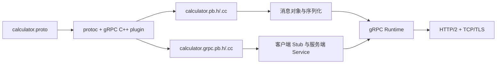
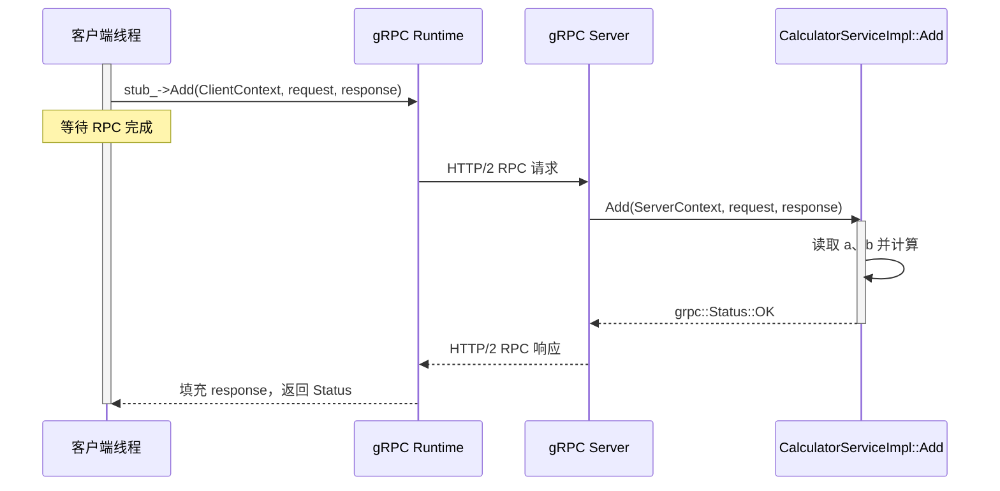
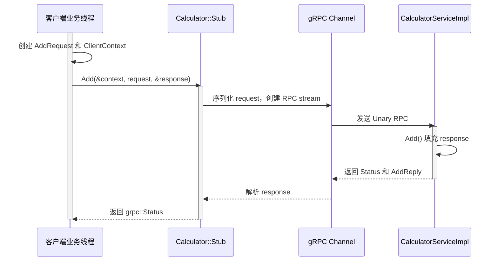

---
tags:
  - Linux
  - 网络编程基础
  - 应用层协议
  - RPC
  - gRPC
aliases:
  - gRPC
  - gRPC C++基础
  - gRPC RPC框架
阅读次数: 0
---

# 7.4.3 gRPC：用 `.proto` 定义服务并生成 RPC 代码

在 [[7.4.1 RPC协议模板]] 中，我们手动定义了：

- 帧头有哪些字段；
- 方法号和状态码如何分配；
- 请求体和响应体如何编码；
- TCP 字节流如何切成一帧；
- 客户端如何等待响应。

前一篇的 C++ 基础补充见 [[7.4.2 std::span]]，其中解释了 `std::byte`、`std::span`、`using`、`constexpr` 等写法。

gRPC 把其中大量重复工作交给框架和代码生成器。我们先写一份 `.proto` 服务定义，再由 `protoc` 和 gRPC 插件生成：

```text
客户端桩代码
服务端抽象接口
请求/响应消息类
序列化与反序列化代码
```

业务代码因此可以围绕“调用哪个方法、传入什么消息、返回什么状态”编写，而不用手写 `memcpy`、长度前缀和方法分发表。

不过，gRPC 没有消灭 RPC 的本质问题。deadline、取消、错误分类、幂等性、认证和版本兼容仍然需要认真设计。

> [!note] 先建立分层认识
> gRPC 是 RPC 框架，Protocol Buffers 是默认的接口定义语言和消息编码方式，HTTP/2 是常见的传输基础。三者解决的是不同层的问题。

## 1. gRPC 和手写 RPC 的对应关系

可以把前一篇手写协议和 gRPC 对照起来：

| 手写 RPC 模板 | gRPC 中的对应物 |
|---|---|
| `method` 方法号 | `.proto` 中的 `rpc` 方法，生成客户端和服务端 API |
| `Bytes body` | 生成的 Protocol Buffers 消息对象 |
| `AppendU32`、`ReadU32` | protobuf 生成的字段访问和序列化代码 |
| `FrameHeader` | gRPC/HTTP2 运行时负责的消息封装和传输 |
| `request_id` | 运行时的调用和 HTTP/2 stream 关联，应用通常不直接管理 |
| `StatusCode` | `grpc::Status` 和 `grpc::StatusCode` |
| `RpcClient::Call` | 生成的 `Stub` 方法 |
| `RpcServer::Dispatch` | 生成的 `Service` 接口和运行时分发 |
| `ReadExactly` / `WriteAll` | gRPC 运行时和底层 HTTP/2 处理 |

这也是使用 gRPC 的主要价值：应用仍然拥有明确的服务接口，但不必在每个方法里重复实现线路协议。

整体关系可以画成：



## 2. 用 `.proto` 定义服务

下面定义一个计算服务：

```proto
syntax = "proto3";

package demo;

service Calculator {
  rpc Add(AddRequest) returns (AddReply);
  rpc ListParts(AddRequest) returns (stream AddReply);
  rpc Sum(stream Number) returns (SumReply);
  rpc Chat(stream AddRequest) returns (stream AddReply);
}

message AddRequest {
  uint32 a = 1;
  uint32 b = 2;
}

message AddReply {
  uint32 sum = 1;
}

message Number {
  uint32 value = 1;
}

message SumReply {
  uint64 sum = 1;
}
```

这个文件同时描述了两件事：

1. `message` 定义请求和响应的字段；
2. `service` 定义客户端可以调用哪些远程方法。

### 2.1 `syntax` 和 `package`

```proto
syntax = "proto3";
package demo;
```

`syntax` 声明 `.proto` 文件使用的语法版本。本笔记采用 gRPC 官方 C++ 基础教程中常见的 proto3 写法。

`package demo` 是 protobuf 的逻辑命名空间。生成 C++ 代码后，消息和服务通常会位于：

```cpp
demo::AddRequest
demo::AddReply
demo::Calculator::Stub
demo::Calculator::Service
```

它和 C++ 的 `namespace demo` 不是同一个语法系统，但生成代码会用 C++ 命名空间表达这个包名。

### 2.2 message 字段和字段编号

```proto
message AddRequest {
  uint32 a = 1;
  uint32 b = 2;
}
```

这里的 `1`、`2` 不是默认值，而是字段编号，也叫 field number 或 tag number。protobuf 的二进制编码会使用字段编号识别字段，所以它属于线路协议的一部分。

字段编号必须遵守几个规则：

- 同一个 message 内不能重复；
- 已经发布使用的字段编号不能更改；
- 删除字段后不要把原编号分配给新字段；
- 删除字段时可以写进 `reserved`，防止以后误用。

例如：

```proto
message AddRequest {
  uint32 a = 1;
  uint32 b = 2;

  reserved 3;
  reserved "old_name";
}
```

新增字段通常比修改已有字段安全，因为旧代码可以忽略自己不认识的新字段。字段编号一旦进入生产协议，就应该把它当成不可随意改动的契约。

### 2.3 protobuf 类型不是 C++ 内存布局

```proto
uint32 a = 1;
```

并不意味着网络上直接发送一个 C++ `uint32_t` 的内存表示。protobuf 有自己的二进制编码规则，生成代码负责：

```text
C++ 字段
    ↓
protobuf wire format
    ↓
另一端的 C++ / Go / Java / Python 字段
```

这和前一篇手写 `AppendU32()` 的思路相同：不能把进程内对象的内存布局直接当成线路协议。区别在于，gRPC/protobuf 已经把编码规则和代码生成器封装起来了。

## 3. 四种 RPC 调用类型

gRPC 支持四种方法形态：

| 类型 | `.proto` 写法 | 数据方向 |
|---|---|---|
| Unary | `rpc Add(AddRequest) returns (AddReply);` | 一个请求，一个响应 |
| 服务端流 | `rpc ListParts(AddRequest) returns (stream AddReply);` | 一个请求，多个响应 |
| 客户端流 | `rpc Sum(stream Number) returns (SumReply);` | 多个请求，一个响应 |
| 双向流 | `rpc Chat(stream AddRequest) returns (stream AddReply);` | 双方都可以发送多个消息 |

### 3.1 Unary RPC

Unary RPC 最像前一篇的 `AddViaRpc`：

```text
客户端发送 AddRequest
服务端执行 Add
服务端返回 AddReply
```

客户端通常调用一次生成的 stub 方法，然后等待 `grpc::Status` 和响应消息。

### 3.2 服务端流

服务端流适合“请求一次，逐条返回很多结果”的场景，例如查询目录、拉取日志、遍历数据库结果或下载分片。

客户端发送一个请求，服务端通过同一个 RPC stream 多次写响应。客户端读到流结束，才知道这一批响应已经结束。

### 3.3 客户端流

客户端流适合把多个输入逐步交给服务端，例如上传多个数据块、批量提交样本或客户端持续上报指标。

客户端写完消息后关闭写方向，服务端再返回一个汇总响应。

### 3.4 双向流

双向流允许客户端和服务端同时读写，例如实时聊天、设备遥测和交互式命令流。

“双向”不等于每个请求都必须严格对应一个响应。应用需要自己定义消息类型、结束条件、错误处理和并发读写规则。

在 C++ 同步 API 中，流式方法会使用不同的运行时对象：

| 类型 | 服务端常见对象 | 主要操作 |
|---|---|---|
| 服务端流 | `grpc::ServerWriter<Response>` | `Write(response)` |
| 客户端流 | `grpc::ServerReader<Request>` | `Read(&request)` |
| 双向流 | `grpc::ServerReaderWriter<Response, Request>` | 同时 `Read` 和 `Write` |

客户端侧对应的是 `ClientReader`、`ClientWriter` 和 `ClientReaderWriter`。当前笔记先讲同步 Unary API；异步 API 会引入 `CompletionQueue`、请求状态机和更严格的生命周期管理，不要把两套 API 的代码混在一起。

## 4. 代码生成：`.proto` 如何变成 C++ 类

假设文件名为 `calculator.proto`，可以使用：

```bash
protoc -I . \
  --cpp_out=generated \
  --grpc_out=generated \
  --plugin=protoc-gen-grpc=$(which grpc_cpp_plugin) \
  calculator.proto
```

通常会得到四个文件：

```text
generated/calculator.pb.h
generated/calculator.pb.cc
generated/calculator.grpc.pb.h
generated/calculator.grpc.pb.cc
```

它们的职责不同：

| 文件 | 内容 |
|---|---|
| `calculator.pb.h` | 请求/响应消息类的声明 |
| `calculator.pb.cc` | 消息类的实现和 protobuf 编码支持 |
| `calculator.grpc.pb.h` | `Stub`、`Service` 等 gRPC 类的声明 |
| `calculator.grpc.pb.cc` | gRPC 生成类的实现 |

这些文件属于生成产物，不应该手动修改。修改服务接口时，应修改 `.proto`，重新运行生成步骤，再编译人手编写的客户端和服务端代码。

官方 C++ 基础教程使用 `protoc` 和 `grpc_cpp_plugin` 生成这些文件，并由 CMake 将生成步骤接入构建过程。具体 CMake target 名称可能随 gRPC 安装方式变化，所以不要把某个项目的构建脚本当成所有环境的固定模板。

## 5. C++ 服务端：实现生成的 `Service`

`.proto` 中的：

```proto
service Calculator {
  rpc Add(AddRequest) returns (AddReply);
}
```

会生成一个服务端抽象接口。业务代码继承它并实现 `Add`：

```cpp
#include <cstdint>
#include <limits>
#include <memory>
#include <grpcpp/grpcpp.h>

#include "calculator.grpc.pb.h"

class CalculatorServiceImpl final : public demo::Calculator::Service {
public:
    grpc::Status Add(
        grpc::ServerContext* context,
        const demo::AddRequest* request,
        demo::AddReply* response) override {
        (void)context;

        const std::uint32_t a = request->a();
        const std::uint32_t b = request->b();
        if (b > std::numeric_limits<std::uint32_t>::max() - a) {
            return {grpc::StatusCode::INVALID_ARGUMENT,
                    "uint32 addition overflow"};
        }

        response->set_sum(a + b);
        return grpc::Status::OK;
    }
};
```

这段代码和手写 RPC 的 `RegisterAdd` 有相同的业务责任：

- 读取请求字段；
- 验证参数；
- 执行计算；
- 填充响应；
- 返回成功或错误状态。

差别在于，`request->a()`、`response->set_sum()` 和方法分发代码都是生成的；业务代码不再需要手动切割 `body`。

启动 gRPC server：

```cpp
void RunServer() {
    CalculatorServiceImpl service;
    grpc::ServerBuilder builder;

    builder.AddListeningPort(
        "0.0.0.0:50051",
        grpc::InsecureServerCredentials());
    builder.RegisterService(&service);

    std::unique_ptr<grpc::Server> server = builder.BuildAndStart();
    server->Wait();
}
```



`RegisterService(&service)` 注册的是服务对象的地址。`service` 位于 `RunServer` 的栈上，但它的生命周期覆盖了阻塞的 `server->Wait()`，因此这里是安全的。`InsecureServerCredentials()` 只适合本机或教学示例，生产环境应配置 TLS 凭据。

这张图揭示了 `stub_->Add()` 下面仍然有运行时、传输和服务对象三层协作；它只是把这些步骤封装起来，不是把远程调用变成了真正的本地函数调用。

## 6. C++ 客户端：Channel、Stub 和 `ClientContext`

客户端先创建 channel，再用生成的 `NewStub()` 创建本地桩对象：

```cpp
#include <chrono>
#include <cstdint>
#include <memory>

auto channel = grpc::CreateChannel(
    "localhost:50051",
    grpc::InsecureChannelCredentials());

std::unique_ptr<demo::Calculator::Stub> stub =
    demo::Calculator::NewStub(channel);
```

这里的 `stub` 不是服务端对象的副本。它只是一个客户端代理，负责把：

```text
Add(request)
```

转换成发往服务端的 gRPC 调用。

一个带 deadline 的 Unary 客户端调用可以写成：

```cpp
grpc::Status CallAdd(
    demo::Calculator::Stub& stub,
    std::uint32_t a,
    std::uint32_t b,
    std::uint32_t& sum) {
    demo::AddRequest request;
    request.set_a(a);
    request.set_b(b);

    demo::AddReply response;
    grpc::ClientContext context;
    context.set_deadline(
        std::chrono::system_clock::now() +
        std::chrono::milliseconds(500));

    const grpc::Status status =
        stub.Add(&context, request, &response);
    if (status.ok()) {
        sum = response.sum();
    }
    return status;
}
```

客户端调用的时序是：



`ClientContext` 保存这一次调用的配置和状态。它应该按调用创建，不能在多个 RPC 之间复用。除了 deadline，还可以在 context 上设置 metadata、认证相关信息和其他调用选项。

## 7. `grpc::Status`：不要只看返回值

gRPC 调用的结果不应该只用一个 `bool` 表示：

```cpp
const grpc::Status status = stub.Add(/* ... */);

if (status.ok()) {
    // 读取 response
} else {
    const grpc::StatusCode code = status.error_code();
    const std::string message = status.error_message();
}
```

`grpc::Status` 至少包含：

```text
是否成功
状态码
错误消息
可选的错误详情
```

常用状态码包括：

| 状态码 | 常见含义 |
|---|---|
| `OK` | 调用成功 |
| `INVALID_ARGUMENT` | 请求参数不合法 |
| `NOT_FOUND` | 请求的资源不存在 |
| `UNAUTHENTICATED` | 没有有效身份凭据 |
| `PERMISSION_DENIED` | 身份存在，但没有权限 |
| `DEADLINE_EXCEEDED` | deadline 到期 |
| `CANCELLED` | 调用方取消了调用 |
| `UNIMPLEMENTED` | 服务端没有实现该方法 |
| `UNAVAILABLE` | 服务暂时不可用，可能是连接或服务故障 |
| `INTERNAL` | 服务端内部错误 |

`INVALID_ARGUMENT`、`NOT_FOUND` 这类业务状态通常由服务实现返回；`DEADLINE_EXCEEDED`、`UNAVAILABLE` 等也可能由 gRPC 运行时根据连接和调用状态产生。

不要把所有错误都当成 `UNAVAILABLE` 重试。是否能重试，取决于操作是否幂等、错误是否暂时、重试预算和服务端负载。

## 8. deadline 和取消

前一篇手写 RPC 的 `Call()` 如果不加超时，服务端不回响应时客户端可能永久阻塞。gRPC 默认也不自动给每个调用设置 deadline，所以客户端仍然应该主动设置：

```cpp
grpc::ClientContext context;
context.set_deadline(
    std::chrono::system_clock::now() +
    std::chrono::milliseconds(500));
```

deadline 表示“客户端最晚愿意等到什么时候”，不是简单的 TCP 连接超时。到期后，客户端会得到 `DEADLINE_EXCEEDED`，服务端也会收到调用被取消的信号。

服务端的处理函数不能假设 gRPC 会替它中断任意业务代码。如果 handler 会执行很久，就需要定期检查：

```cpp
grpc::Status LongTask(
    grpc::ServerContext* context,
    const demo::AddRequest* request,
    demo::AddReply* response) override {
    for (std::uint32_t i = 0; i < request->a(); ++i) {
        if (context->IsCancelled()) {
            return {grpc::StatusCode::CANCELLED,
                    "client no longer waits for the result"};
        }

        DoOneStep();
    }

    response->set_sum(request->b());
    return grpc::Status::OK;
}
```

取消的本质是协作式的：

```text
客户端不再等待
        ↓
gRPC Runtime 通知服务端
        ↓
服务端业务代码检查 IsCancelled()
        ↓
停止计算、释放资源、结束 RPC
```

如果服务端还要调用其他服务，最好把原始 deadline 和取消语义继续传递下去，否则上游已经放弃，内部调用仍可能继续消耗资源。

## 9. Metadata、认证和 TLS

请求和响应除了 protobuf body，还可以带 metadata。它适合放：

```text
认证凭据
追踪 ID
租户信息
灰度标签
```

metadata 不应该替代正式的业务字段。业务数据应该进入 `.proto` 的 message，跨请求的认证和追踪信息才适合放 metadata。

教学代码中的：

```cpp
grpc::InsecureChannelCredentials()
grpc::InsecureServerCredentials()
```

表示不启用 TLS。生产服务通常要使用 TLS credentials，并进一步设计：

- 服务端身份校验；
- 客户端身份认证；
- 证书轮换；
- metadata 中的授权信息；
- 服务之间的最小权限。

gRPC 提供的是调用框架，不会替业务决定“谁能调用哪个方法”。

## 10. gRPC 和 Protocol Buffers 的版本兼容

`.proto` 是长期接口契约，不能只把它当成“生成 C++ 代码的临时输入”。

安全的演进方向通常包括：

```proto
message AddRequest {
  uint32 a = 1;
  uint32 b = 2;
  uint32 precision = 3;
}
```

旧客户端没有 `precision` 字段时，旧代码仍可以解析自己认识的字段。删除字段时保留编号：

```proto
message AddRequest {
  uint32 a = 1;
  uint32 b = 2;

  reserved 3;
  reserved "old_precision";
}
```

不要为了“重新排序好看”而给已有字段重新编号。protobuf 二进制数据依靠字段编号解码，复用或修改编号会让同一段字节在新旧程序中产生歧义。

还要注意：

- 新增字段不等于业务行为自动兼容；
- 必须明确旧客户端缺少字段时的默认语义；
- 不要随意改变已有字段类型；
- `oneof`、`map`、`repeated` 和嵌套 message 都有自己的兼容性规则；
- 删除字段时同时保留 field number 和必要的 field name。


## 11. gRPC 和前面手写 RPC 的根本差别

手写 RPC 让你看清协议是怎样工作的；gRPC 让这些通用工作变成可复用的框架能力。

| 关注点 | 手写模板 | gRPC |
|---|---|---|
| 接口定义 | C++ 常量和约定 | `.proto` |
| 消息 schema | 自己写 body 布局 | protobuf message |
| 编解码 | `htonl`、`memcpy` | 生成的 protobuf 代码 |
| 客户端调用 | `RpcClient::Call` | `Stub` |
| 服务端分发 | `unordered_map` | 生成的 `Service` |
| 错误返回 | 自定义状态码 | `grpc::Status` |
| 超时 | 自己设计 deadline | `ClientContext` |
| 多路并发 | 自己维护 request map | gRPC runtime 管理 stream |
| 流式传输 | 自己设计帧序列 | 四种 RPC 类型 |
| 版本演进 | 自己约定字段兼容 | protobuf field number 规则 |

所以学习顺序最好是：

```text
先理解 7.4.1 的手写 RPC
        ↓
再学习 7.4.2 的 span、byte、constexpr 等 C++基础
        ↓
最后用 7.4.3 理解 gRPC 如何把这些机制封装起来
```

## 12. gRPC 和 RDMA 的关系

gRPC 和 RDMA 不在同一层：

| gRPC | RDMA |
|---|---|
| 服务接口、消息 schema、stub、状态、deadline | 低延迟数据搬运和远程内存访问 |
| 关注“调用哪个远程操作” | 关注“如何高效移动数据” |
| 常规 gRPC 栈通常使用 HTTP/2 传输 | 通过 RDMA verbs、Send/Receive、Read/Write 等操作工作 |

普通 gRPC 应用不能只把 TCP 换成 RDMA verbs 就完成迁移。RDMA 的接收缓冲区、内存注册、完成队列、流控和单边操作语义都需要专门适配。

在 RDMA 系统中，可以使用类似 gRPC 的 RPC 抽象，也可以使用轻量自定义 RPC；两者分别属于上层接口语义和底层传输实现。

## 13. 常见误区

### 13.1 以为 gRPC 就是本地函数调用

生成的 `Stub` 让调用形式像本地函数，但调用仍然会经历：

```text
序列化
网络传输
服务端调度
业务处理
响应解析
```

网络断开、deadline、取消和重复执行仍然可能发生。

### 13.2 不设置 deadline

没有 deadline 的调用可能一直等待。客户端应该根据业务延迟预算显式设置 deadline，并在服务端及时响应取消。

### 13.3 只判断 `status.ok()`

`status.ok()` 只能说明成功或失败。失败时还要根据 `error_code()` 决定：

```text
返回参数错误
提示未认证
等待服务恢复
执行受控重试
```

### 13.4 手动修改生成文件

不要直接修改：

```text
*.pb.h
*.pb.cc
*.grpc.pb.h
*.grpc.pb.cc
```

这些文件会在下一次生成时被覆盖。修改 `.proto` 和人手编写的服务实现。

### 13.5 看到 `Insecure*Credentials` 就用于生产

它们只代表示例中跳过 TLS。生产环境需要配置证书、身份验证和授权策略。

### 13.6 把 protobuf 当成万能数据格式

protobuf 很适合结构化消息和服务接口，但不适合所有大块数据。视频、图片、科学计算矩阵等内容可能应该走对象存储、文件服务或专门的数据通道，RPC 只传元数据和引用。

## 14. 关键要点

1. gRPC 通过 `.proto` 同时定义服务方法和消息 schema。
2. `protoc` 与 gRPC 插件会生成消息类、客户端 `Stub` 和服务端 `Service`。
3. gRPC 支持 Unary、服务端流、客户端流和双向流四种调用类型。
4. `grpc::Status` 同时表达成功、错误码和错误消息，不能只返回 `bool`。
5. `ClientContext` 是一次调用的上下文，应设置 deadline，不能跨调用复用。
6. 服务端取消处理是协作式的，长任务要定期检查 `ServerContext::IsCancelled()`。
7. protobuf 字段编号属于线路协议，已有编号不能修改或复用。
8. gRPC 封装了帧、序列化和分发，但没有替你解决幂等性、认证、版本兼容和资源治理。
9. gRPC 是 RPC 框架，RDMA 是底层数据搬运机制；两者可以组合，但不能混为一谈。

## 15. 参考资料

- [gRPC：Core concepts, architecture and lifecycle](https://grpc.io/docs/what-is-grpc/core-concepts/)
- [gRPC：C++ Basics tutorial](https://grpc.io/docs/languages/cpp/basics/)
- [gRPC：C++ Quick start](https://grpc.io/docs/languages/cpp/quickstart/)
- [gRPC：Status codes](https://grpc.io/docs/guides/status-codes/)
- [gRPC：Deadlines](https://grpc.io/docs/guides/deadlines/)
- [gRPC：Cancellation](https://grpc.io/docs/guides/cancellation/)
- [Protocol Buffers：Overview](https://protobuf.dev/overview/)
- [Protocol Buffers：Updating a message type](https://protobuf.dev/programming-guides/proto3/#updating)
- [Protocol Buffers：Encoding](https://protobuf.dev/programming-guides/encoding/)
