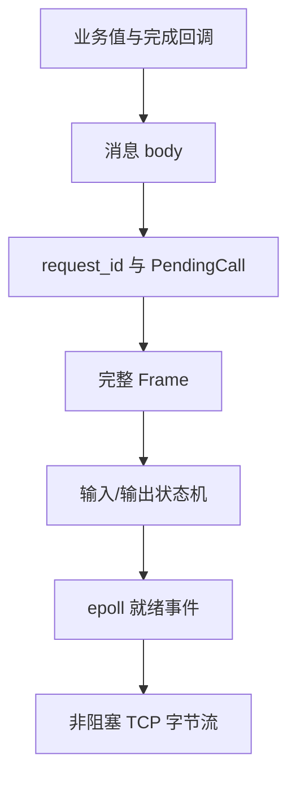

---
tags:
  - Linux
  - 网络编程基础
  - 应用层协议
  - RPC
  - epoll
  - 非阻塞IO
  - 状态机
aliases:
  - 非阻塞 RPC epoll 状态机
  - Event-driven RPC
  - RPC Reactor
阅读次数: 0
---

# 7.4.3 非阻塞 RPC：epoll + 状态机

[[7.4.1 RPC 协议模板(2)|7.4.1 RPC 协议模板]] 已经把 `AddViaRpc(client, 3, 4)` 从业务值一路封装成 22 B 请求帧，再用阻塞式 `ReadExactly()` / `WriteAll()` 完成一次请求—响应。那份实现适合看清协议，但它有一个明显边界：**调用线程和服务端连接线程都会睡在某次具体的网络操作上。**

本篇不改 14 B 固定头、不改 `Add` 的 8 B 请求体与 4 B 响应体，也不改 `request_id`、状态码和错误边界；只把控制流改成：

> **非阻塞 socket 保存“做到一半”的现场，`epoll` 只在 fd 可以继续推进时唤醒 EventLoop，连接状态机再从上次停下的位置继续。**

这条路线与 [[7.4.2 gRPC]] 不同：gRPC 把消息编码、HTTP/2 与异步 I/O 都交给 runtime；本篇仍然亲手维护自定义帧、输入缓冲区、输出队列、调用关联和 deadline，目的是把“异步 RPC 到底需要哪些状态”彻底看清。

> [!important] 讲解顺序与源码依赖顺序不同
> 本文继续沿用 7.4.1 的自顶向下顺序：业务调用 → 消息 → RPC 调用 → 帧 → 连接状态机 → `epoll` → TCP。真正组织 `.h/.cpp` 时，应先声明公共类型与底层组件，再实现上层包装。

## 1. 先看全图：同一个 `Add(3, 4)` 如何变成事件驱动调用

![[图片/SVG/3_7_7_4_3_1.svg|1390]]

非阻塞版本仍然是逐层封装，只是“同步等待”被拆成了可恢复状态：

| 层次 | 这一层理解的对象 | 发起阶段 | 完成阶段 | 不应该关心什么 |
|:---:|:---|:---|:---|:---|
| ① 业务层 | `a`、`b`、`sum` | `AddViaRpcAsync(3, 4, callback)` | callback 收到 `7` 或失败 | fd、帧偏移 |
| ② 消息层 | `Bytes body` | `AppendU32()` 生成 8 B 请求体 | `ReadU32()` 解出 4 B 结果 | `epoll` 事件 |
| ③ 调用层 | `request_id + PendingCall` | 登记 deadline 与完成回调 | 响应按 ID 找到等待者 | TCP 半包 |
| ④ 帧层 | `Frame` / 线路字节 | 构造 14 B 头 + body | 从输入缓冲区恢复完整帧 | Add 的业务含义 |
| ⑤ 连接状态机 | 读到哪、写到哪 | 帧进入输出队列 | 半头、半体、短写继续推进 | 业务成功与否 |
| ⑥ EventLoop | 就绪 fd 与兴趣集 | 必要时监听 `EPOLLOUT` | `EPOLLIN/OUT` 驱动状态机 | 消息字段语义 |
| ⑦ TCP | 无边界字节流 | 内核接收待发送字节 | 内核交付已到达字节 | RPC 请求边界 |

对象变化链可以写成：

```text
业务值 a、b
    ↓ AppendU32
8 B 请求 body
    ↓ 分配 request_id、登记 PendingCall
一次异步 RPC 调用
    ↓ BuildWireFrame
22 B 请求帧
    ↓ 进入 output_queue，保存 write_offset
连接写状态
    ↓ epoll_wait 返回 EPOLLOUT
非阻塞 send() 推进
    ↓
TCP 字节流
```

响应沿相反方向恢复，但不会回到一个阻塞中的 `Call()` 栈帧，而是通过 `request_id` 找到 `PendingCall`，再触发 callback。

---

## 2. 从阻塞模板迁移时，什么不变，什么必须重写

| 维度 | 7.4.1 阻塞版本 | 本篇非阻塞版本 |
|:---|:---|:---|
| `Add` schema | 两个网络序 `uint32_t` → 一个 `uint32_t` | **不变** |
| 帧头 | 14 B：`magic/version/type/id/code/body_len` | **不变** |
| 错误边界 | 业务错误回状态码；协议失步关连接 | **不变** |
| 读写接口 | `ReadExactly()` / `WriteAll()` 在调用栈里循环 | 改为缓冲区 + offset + 下次事件继续 |
| 等待位置 | 每个 RPC 调用阻塞 | EventLoop 统一阻塞在 `epoll_wait()` |
| 调用关联 | 串行模型主要用于校验 | 并发模型用 `request_id` 查 `PendingCall` |
| 超时 | 某个同步调用外层计时 | deadline 进入待完成表与定时器结构 |
| 背压 | `send()` 阻塞调用线程 | 输出队列设置高水位并拒绝继续排队 |

最关键的变化不是把 `read()` 换成 `epoll_wait()`，而是把原先藏在调用栈里的局部变量提升为长期状态：

```text
ReadExactly 的 offset      → Connection::input_buffer / parse_state
WriteAll 的 offset         → OutboundFrame::sent
Call 当前等待哪个响应       → pending_calls[request_id]
Call 还愿意等多久           → PendingCall::deadline
当前是否需要可写通知         → output_queue 是否为空
```

---

## 3. 第 ①～② 层：业务接口和消息 schema 都不应该看到 `epoll`

### 3.1 异步结果要显式表达“成功或失败”

C++20 没有标准化的 `std::expected`，这里用 `std::variant` 表达结果：

```cpp
struct RpcFailure {
    enum class Kind {
        Remote,
        Protocol,
        Transport,
        Deadline,
        Backpressure,
    };

    Kind kind;
    std::uint16_t code = 0;
    std::string message;
};

using Bytes = std::vector<std::byte>;
using RpcResult = std::variant<Bytes, RpcFailure>;
using RpcCompletion = std::function<void(RpcResult)>;
```

`Remote` 表示收到合法的非 `OK` 响应；`Protocol` 表示连接中的字节已经不能继续可信解释；`Deadline` 和 `Backpressure` 则是本地异步运行时新增的失败域。把它们合成一个 `bool` 会丢失调用方真正需要的决策信息。

### 3.2 `AddViaRpcAsync` 仍然只暴露业务值

```cpp
using AddResult = std::variant<std::uint32_t, RpcFailure>;
using AddCompletion = std::function<void(AddResult)>;

void AddViaRpcAsync(AsyncRpcClient& client,
                    std::uint32_t a,
                    std::uint32_t b,
                    std::chrono::steady_clock::time_point deadline,
                    AddCompletion completion) {
    Bytes args;
    args.reserve(8);
    AppendU32(args, a);
    AppendU32(args, b);

    client.CallAsync(
        kMethodAdd,
        std::move(args),
        deadline,
        [completion = std::move(completion)](RpcResult result) mutable {
            if (auto* body = std::get_if<Bytes>(&result)) {
                try {
                    completion(ReadU32(*body));
                } catch (const std::exception& error) {
                    completion(RpcFailure{
                        RpcFailure::Kind::Protocol, 0, error.what()});
                }
                return;
            }
            completion(std::get<RpcFailure>(std::move(result)));
        });
}
```

`AddViaRpcAsync()` 仍然完成 7.4.1 中相同的两次消息转换：`a,b → 8 B body`，以及 `4 B body → sum`。不同之处只有一点：它注册完成函数后立即返回，结果稍后由 EventLoop 线程送回。

```mermaid
sequenceDiagram
    participant App as 业务调用线程
    participant Client as AsyncRpcClient
    participant Loop as EventLoop线程
    participant Peer as 服务端连接

    App->>Client: AddViaRpcAsync(3, 4, deadline, callback)
    Client->>Loop: CallAsync(method=Add, body=8B)
    Loop->>Loop: 登记 pending_calls[id]
    Loop-->>App: 立即返回

    Note over Loop: epoll_wait 中等待网络事件
    Peer-->>Loop: Response(id, OK, body=4B)
    Loop->>Loop: ReadU32(body) = 7
    Loop-->>App: callback(AddResult{7})
```

图中真正消失的是“业务线程卡在网络调用上”的区间；EventLoop 仍会等待，但它统一等待所有连接，而不是被某一个 RPC 独占。

> [!warning] callback 的执行线程属于接口契约
> 本文约定 callback 在 EventLoop 线程执行，因此 callback 只能做很短的状态更新。耗时计算、磁盘 I/O 或同步数据库访问必须交给业务线程池，否则一个慢 callback 会阻塞整条 EventLoop。

---

## 4. 第 ③ 层：`request_id` 从校验字段变成并发关联键

### 4.1 待完成表保存一次调用的全部恢复信息

```cpp
struct PendingCall {
    std::chrono::steady_clock::time_point deadline;
    RpcCompletion completion;
};

class AsyncRpcClient {
public:
    explicit AsyncRpcClient(Connection& connection)
        : connection_(connection) {}

    void CallAsync(std::uint16_t method,
                   Bytes body,
                   std::chrono::steady_clock::time_point deadline,
                   RpcCompletion completion);

    void OnFrame(Frame frame);
    void ExpireCalls(std::chrono::steady_clock::time_point now);
    void FailAll(RpcFailure failure);

private:
    std::uint32_t NextRequestId();

    Connection& connection_;
    std::uint32_t next_id_ = 1;
    std::unordered_map<std::uint32_t, PendingCall> pending_calls_;
    std::unordered_set<std::uint32_t> retired_ids_;
};
```

`pending_calls_` 是异步客户端的核心状态：调用栈已经返回，只有这张表还知道“响应到来时应该通知谁”。`retired_ids_` 用来识别本地超时后迟到的合法响应，后文解释它为什么不能省。

请求 ID 回绕时不能覆盖仍在途或仍处于迟到响应保护期的 ID：

```cpp
std::uint32_t AsyncRpcClient::NextRequestId() {
    constexpr std::uint64_t kUsableIds =
        std::numeric_limits<std::uint32_t>::max();

    for (std::uint64_t attempt = 0; attempt < kUsableIds; ++attempt) {
        std::uint32_t id = next_id_++;
        if (id == 0) {
            id = next_id_++;
        }
        if (!pending_calls_.contains(id) && !retired_ids_.contains(id)) {
            return id;
        }
    }
    throw std::length_error("no request_id is currently available");
}
```

串行版只需跳过 0；并发版还必须避免与 `pending_calls_` 和 tombstone 冲突。否则 ID 回绕可能把迟到响应错误地交给一条新调用。

### 4.2 发起调用：先登记，再把帧交给连接层

```cpp
void AsyncRpcClient::CallAsync(
    std::uint16_t method,
    Bytes body,
    std::chrono::steady_clock::time_point deadline,
    RpcCompletion completion) {
    const std::uint32_t id = NextRequestId();
    pending_calls_.emplace(
        id, PendingCall{deadline, std::move(completion)});

    if (!connection_.QueueFrame(
            FrameType::Request, id, method, std::move(body))) {
        auto pending = pending_calls_.extract(id);
        pending.mapped().completion(RpcFailure{
            RpcFailure::Kind::Backpressure,
            0,
            "connection output queue exceeds high-water mark"});
    }
}
```

顺序必须是“先登记，再排队”。如果先把帧交给连接，极快的本地对端可能在待完成项尚未建立时就把响应送回来。`QueueFrame()` 返回 `false` 表示连接输出队列已经越过资源上限，此时调用根本没有进入发送队列，应立即从待完成表撤回。

### 4.3 收到响应：移动回调、删除表项、最后通知上层

```cpp
void AsyncRpcClient::OnFrame(Frame frame) {
    if (frame.header.type != FrameType::Response) {
        throw ProtocolError("client received a non-response frame");
    }

    const std::uint32_t id = frame.header.request_id;
    if (retired_ids_.erase(id) != 0) {
        return; // 本地已超时，丢弃迟到响应
    }

    auto pending = pending_calls_.extract(id);
    if (pending.empty()) {
        throw ProtocolError("response has unknown request_id");
    }

    RpcCompletion completion = std::move(pending.mapped().completion);
    if (frame.header.code != static_cast<std::uint16_t>(StatusCode::Ok)) {
        completion(RpcFailure{
            RpcFailure::Kind::Remote,
            frame.header.code,
            "remote RPC returned a non-OK status"});
        return;
    }
    completion(std::move(frame.body));
}
```

先把节点从 map 中提取出来，再执行 callback，可以避免 callback 递归发起新 RPC 时与当前迭代器、当前表项发生重入冲突。未知 ID 与“已知但超时”的 ID 必须区分：前者说明协议实现失步，后者是异步系统的正常迟到现象。

---

## 5. 第 ④～⑤ 层：帧不再“读完或写完”，而是进入连接状态机

![[图片/SVG/3_7_7_4_3_2.svg|1240]]

### 5.1 状态机保存阻塞版调用栈曾经保存的局部状态

```cpp
struct OutboundFrame {
    Bytes wire;
    std::size_t sent = 0;
};

enum class ParseState {
    ReadingHeader,
    ReadingBody,
};

inline constexpr std::size_t kOutputHighWaterMark =
    4U * 1024U * 1024U;

class Connection {
public:
    using FrameHandler = std::function<void(Frame)>;
    using CloseHandler = std::function<void(RpcFailure)>;

    bool QueueFrame(FrameType type,
                    std::uint32_t request_id,
                    std::uint16_t code,
                    Bytes body);
    void HandleEvents(std::uint32_t events);

private:
    void OnReadable();
    void OnWritable();
    void TryParseFrames();
    void UpdateInterest();
    void CompactInput();

    int fd_ = -1;
    int epoll_fd_ = -1;
    Bytes input_buffer_;
    std::size_t input_pos_ = 0;
    ParseState parse_state_ = ParseState::ReadingHeader;
    std::optional<FrameHeader> current_header_;
    std::deque<OutboundFrame> output_queue_;
    std::size_t queued_bytes_ = 0;
    bool peer_eof_ = false;
    FrameHandler on_frame_;
    CloseHandler on_close_;
};
```

这组字段共同表达四个恢复点：

| 恢复点 | 对应字段 | 不变量 |
|:---|:---|:---|
| 输入已经消费到哪里 | `input_pos_` | `[0, input_pos_)` 不再参与解析 |
| 当前在等头还是等体 | `parse_state_` | `ReadingBody` 时 `current_header_` 必须有值 |
| 当前帧还差多少 body | `current_header_->body_len` | 未收齐时保留输入字节，等待下一次 `EPOLLIN` |
| 当前输出帧写到哪里 | `output_queue_.front().sent` | 已发送前缀绝不能再次发送 |

> [!important] 线程归属也是状态机不变量
> 本文约定一个 `Connection` 的全部字段只由所属 EventLoop 线程修改。其他线程若要发请求，应通过线程安全任务队列加 `eventfd` 唤醒 EventLoop，而不是直接并发修改 `output_queue_` 和 `pending_calls_`。

### 5.2 把阻塞版 `SendFrame()` 拆成“纯编码 + 排队”

```cpp
Bytes BuildWireFrame(FrameType type,
                     std::uint32_t request_id,
                     std::uint16_t code,
                     std::span<const std::byte> body) {
    if (request_id == 0) {
        throw ProtocolError("zero request_id is reserved");
    }
    if (body.size() > kMaxBodyLen) {
        throw std::length_error("body exceeds protocol limit");
    }

    const FrameHeader header{
        .magic = kMagic,
        .version = kVersion,
        .type = type,
        .request_id = request_id,
        .code = code,
        .body_len = static_cast<std::uint32_t>(body.size()),
    };

    const auto raw_header = EncodeHeader(header);
    Bytes wire;
    wire.reserve(raw_header.size() + body.size());
    wire.insert(wire.end(), raw_header.begin(), raw_header.end());
    wire.insert(wire.end(), body.begin(), body.end());
    return wire;
}
```

帧编码与 7.4.1 完全相同，但函数不再调用 `send()`。把“构造线路字节”和“何时能写入 socket”分开后，线路格式可以单元测试，写状态机也可以独立处理短写与 `EAGAIN`。

```cpp
bool Connection::QueueFrame(FrameType type,
                            std::uint32_t request_id,
                            std::uint16_t code,
                            Bytes body) {
    Bytes wire = BuildWireFrame(type, request_id, code, body);
    if (wire.size() > kOutputHighWaterMark - queued_bytes_) {
        return false;
    }

    queued_bytes_ += wire.size();
    output_queue_.push_back(OutboundFrame{std::move(wire), 0});
    UpdateInterest();
    return true;
}
```

`kOutputHighWaterMark` 是连接级内存预算。没有这道门时，慢对端可以让本端不断积压响应或请求，最终把“非阻塞”变成“无限内存增长”。

---

## 6. 第 ⑥ 层：`epoll` 只报告就绪，不替你完成 RPC

### 6.1 先使用 LT，掌握状态机后再考虑 ET

本文默认 **level-triggered（LT）**：只要 fd 仍然可读或可写，后续 `epoll_wait()` 还会继续报告它。LT 更适合第一次实现，因为可以给单次事件设置 I/O 预算，避免一个热点连接长期霸占 EventLoop。

使用 edge-triggered（`EPOLLET`）时，fd 必须是非阻塞的，并且收到事件后通常要一直处理到系统调用返回 `EAGAIN/EWOULDBLOCK`；否则剩余数据没有新的“边沿”，可能长期得不到通知。

### 6.2 fd 必须真正设置为非阻塞

```cpp
void SetNonBlocking(int fd) {
    const int flags = ::fcntl(fd, F_GETFL, 0);
    if (flags == -1) {
        throw std::system_error(errno, std::generic_category(), "fcntl F_GETFL");
    }
    if (::fcntl(fd, F_SETFL, flags | O_NONBLOCK) == -1) {
        throw std::system_error(errno, std::generic_category(), "fcntl F_SETFL");
    }
}
```

只把 fd 放进 `epoll` 并不会自动获得非阻塞语义。若 socket 仍是阻塞模式，事件处理函数中的第二次 `read()` 或 `send()` 仍可能把整个 EventLoop 卡住。

### 6.3 兴趣集是输出状态的派生值

```cpp
void Connection::UpdateInterest() {
    epoll_event event{};
    event.data.ptr = this;
    event.events = EPOLLIN | EPOLLRDHUP;
    if (!output_queue_.empty()) {
        event.events |= EPOLLOUT;
    }

    if (::epoll_ctl(epoll_fd_, EPOLL_CTL_MOD, fd_, &event) == -1) {
        throw std::system_error(errno, std::generic_category(), "epoll_ctl MOD");
    }
}
```

健康 TCP 连接大多数时间都可写，因此不能永久监听 `EPOLLOUT`。正确规则是：

```text
output_queue 为空      → 只关心 EPOLLIN / EPOLLRDHUP
output_queue 非空      → 再加 EPOLLOUT
队列重新清空           → 立即撤掉 EPOLLOUT
```

### 6.4 EventLoop 的唯一阻塞点是 `epoll_wait()`

```cpp
void EventLoop::Run() {
    std::array<epoll_event, 128> events{};

    while (!stopping_) {
        const int count = ::epoll_wait(
            epoll_fd_, events.data(), static_cast<int>(events.size()), timeout_ms_);
        if (count < 0) {
            if (errno == EINTR) continue;
            throw std::system_error(errno, std::generic_category(), "epoll_wait");
        }

        for (int index = 0; index < count; ++index) {
            auto* connection = static_cast<Connection*>(events[index].data.ptr);
            connection->HandleEvents(events[index].events);
        }
        ExpireRpcDeadlines();
        RunQueuedTasks();
    }
}
```

```mermaid
sequenceDiagram
    participant Loop as EventLoop线程
    participant EP as epoll内核对象
    participant Sock as socket内核缓冲区
    participant Conn as Connection状态机

    Loop->>EP: epoll_wait(...)
    activate Loop
    Note over Loop: 没有事件时睡眠
    Sock-->>EP: fd 状态变化
    EP-->>Loop: EPOLLIN / EPOLLOUT / RDHUP
    Loop->>Conn: HandleEvents(events)
    deactivate Loop
    Conn->>Sock: read()/send() 推进有限字节
    Conn->>EP: epoll_ctl MOD 调整兴趣集
```

这张图揭示了非阻塞模型真正的等待位置：线程仍然会睡眠，但它睡在统一的事件分发点，而不是睡在某条连接的“读满 14 B”或“写完一帧”中。

---

## 7. 读状态机：`EPOLLIN` 只意味着“现在至少可以推进一次”

### 7.1 先把内核当前能交付的字节搬进输入缓冲区

```cpp
void Connection::OnReadable() {
    std::array<std::byte, 4096> chunk{};
    std::size_t budget = 64U * 1024U;

    while (budget != 0) {
        const std::size_t wanted = std::min(chunk.size(), budget);
        const ssize_t count = ::read(fd_, chunk.data(), wanted);
        if (count > 0) {
            input_buffer_.insert(
                input_buffer_.end(),
                chunk.begin(),
                chunk.begin() + static_cast<std::ptrdiff_t>(count));
            budget -= static_cast<std::size_t>(count);
            continue;
        }
        if (count == 0) {
            peer_eof_ = true;
            break;
        }
        if (errno == EINTR) continue;
        if (errno == EAGAIN || errno == EWOULDBLOCK) break;
        throw std::system_error(errno, std::generic_category(), "read");
    }
    TryParseFrames();
}
```

这里选择 LT，因此单次最多读取 64 KiB：即使某条连接持续有数据，EventLoop 也会回去照顾其他 fd；剩余字节仍然可读，下一轮 `epoll_wait()` 会再次报告。若改成 ET，就不能在预算耗尽时简单返回，而要额外维护 ready 队列或继续读到 `EAGAIN`。

### 7.2 先解码完整头，再按 `body_len` 等待完整 body

```cpp
void Connection::TryParseFrames() {
    while (true) {
        const std::size_t available = input_buffer_.size() - input_pos_;

        if (parse_state_ == ParseState::ReadingHeader) {
            if (available < kHeaderLen) return;
            const std::span<const std::byte> header_bytes{
                input_buffer_.data() + input_pos_, kHeaderLen};
            current_header_ = DecodeHeader(header_bytes);
            input_pos_ += kHeaderLen;
            parse_state_ = ParseState::ReadingBody;
        }

        const std::size_t body_available = input_buffer_.size() - input_pos_;
        if (body_available < current_header_->body_len) return;

        const auto body_begin = input_buffer_.begin() +
            static_cast<std::ptrdiff_t>(input_pos_);
        Bytes body(body_begin,
                   body_begin + static_cast<std::ptrdiff_t>(current_header_->body_len));
        input_pos_ += current_header_->body_len;

        Frame frame{*current_header_, std::move(body)};
        current_header_.reset();
        parse_state_ = ParseState::ReadingHeader;
        CompactInput();
        on_frame_(std::move(frame));
    }
}
```

这就是阻塞版 `ReadFrame()` 的状态化展开：

```text
头不够 14 B        → 保存 input_buffer，返回 EventLoop
头完整、body 未收齐 → 保存 current_header，返回 EventLoop
一帧完整            → 交给上层，然后继续尝试解析下一帧
一次收到多帧         → while 连续产出多次 on_frame
```

`DecodeHeader()` 必须复用 7.4.1 的完整校验，而不是只偷读偏移 10 的 `body_len`。否则非法 `magic`、版本、类型或超限长度会绕过协议边界进入业务层。

已消费前缀不能每解析一帧就立刻 `erase()`，否则连续消息会频繁搬移内存。可以在“全部消费”或“前缀已经足够大”时再压缩：

```cpp
void Connection::CompactInput() {
    if (input_pos_ == 0) return;
    if (input_pos_ == input_buffer_.size()) {
        input_buffer_.clear();
        input_pos_ = 0;
        return;
    }

    constexpr std::size_t kCompactThreshold = 64U * 1024U;
    if (input_pos_ >= kCompactThreshold &&
        input_pos_ * 2 >= input_buffer_.size()) {
        input_buffer_.erase(
            input_buffer_.begin(),
            input_buffer_.begin() +
                static_cast<std::ptrdiff_t>(input_pos_));
        input_pos_ = 0;
    }
}
```

这里的 `input_pos_` 相当于逻辑读指针：多数时候只移动整数，不移动字节；只有已消费空间足以抵消搬移成本时才整理底层 `vector`。

### 7.3 EOF 必须结合解析状态判断

当 `read()` 返回 0：

| 当前状态 | 输入缓冲区 | 含义 |
|:---|:---|:---|
| `ReadingHeader` | 无未消费字节 | 对端在帧边界关闭 |
| `ReadingHeader` | 留有不足 14 B | 帧头被截断，协议错误 |
| `ReadingBody` | body 未收齐 | 长度承诺未兑现，协议错误 |
| 客户端仍有 `pending_calls` | 不论是否在边界 | 所有未完成调用都必须失败 |

TCP 的 FIN 只结束字节流，不会替 RPC runtime 自动完成等待者。连接关闭路径必须一次性通知所有 `pending_calls`，否则业务对象会永久悬挂。

---

## 8. 写状态机：`EPOLLOUT` 只负责从保存的 offset 继续

```cpp
void Connection::OnWritable() {
    std::size_t budget = 64U * 1024U;

    while (!output_queue_.empty() && budget != 0) {
        OutboundFrame& current = output_queue_.front();
        const std::size_t remaining = current.wire.size() - current.sent;
        const std::size_t wanted = std::min(remaining, budget);

        const ssize_t count = ::send(
            fd_, current.wire.data() + current.sent, wanted, MSG_NOSIGNAL);
        if (count > 0) {
            current.sent += static_cast<std::size_t>(count);
            queued_bytes_ -= static_cast<std::size_t>(count);
            budget -= static_cast<std::size_t>(count);
            if (current.sent == current.wire.size()) {
                output_queue_.pop_front();
            }
            continue;
        }
        if (count == 0) {
            throw std::runtime_error("send returned zero");
        }
        if (errno == EINTR) continue;
        if (errno == EAGAIN || errno == EWOULDBLOCK) break;
        throw std::system_error(errno, std::generic_category(), "send");
    }
    UpdateInterest();
}
```

三个不变量不能破坏：

1. `sent` 只单调增加，已经交给内核的前缀不能重发；
2. 当前帧没有写完之前，不能开始写下一帧，否则两帧字节会穿插；
3. 队列清空后必须撤销 `EPOLLOUT`，否则 EventLoop 会被持续可写事件空转唤醒。

`MSG_NOSIGNAL` 仍然承担 7.4.1 中相同的职责：连接已经断开时让 `send()` 返回 `EPIPE`，而不是用 `SIGPIPE` 终止整个进程。

---

## 9. 服务端也是同一条状态机，只是完整帧交给 `Dispatch`

连接层产出完整 `Frame` 后，服务端会话层才解释方法号：

```cpp
void RpcServerSession::OnFrame(Frame frame) {
    if (frame.header.type != FrameType::Request) {
        throw ProtocolError("server received a non-request frame");
    }

    auto [status, result] = server_.Dispatch(
        frame.header.code, frame.body);

    if (!connection_.QueueFrame(
            FrameType::Response,
            frame.header.request_id,
            static_cast<std::uint16_t>(status),
            std::move(result))) {
        throw std::runtime_error(
            "response queue exceeds high-water mark");
    }
}
```

示例中的 `Add` handler 很短，可以直接在 EventLoop 线程执行。真实服务若包含文件、数据库或长计算，应把业务工作提交到线程池；工作完成后再通过 EventLoop 的任务队列把响应重新放回所属连接。**工作线程不能直接并发操作连接输出队列。**

多个 handler 可以乱序完成，响应仍不会“串话”：

- `request_id` 负责把响应关联到调用；
- `output_queue_` 负责把多条响应的线路字节串行写入同一 TCP 流；
- 二者解决的是不同层的问题。

---

## 10. deadline：超时后为什么还要记住 `retired_ids`

```cpp
void AsyncRpcClient::ExpireCalls(
    std::chrono::steady_clock::time_point now) {
    for (auto it = pending_calls_.begin(); it != pending_calls_.end();) {
        if (it->second.deadline > now) {
            ++it;
            continue;
        }

        const std::uint32_t id = it->first;
        RpcCompletion completion = std::move(it->second.completion);
        it = pending_calls_.erase(it);
        retired_ids_.insert(id);
        completion(RpcFailure{
            RpcFailure::Kind::Deadline, 0, "RPC deadline exceeded"});
    }
}
```

超时只说明“客户端不再等待”，不能证明服务端没执行。当前 14 B 协议没有 Cancel 帧，因此服务端可能稍后仍返回合法响应。若客户端已经删除 `pending_calls[id]`，这条迟到响应不能被当成“未知 ID 协议攻击”；它应该命中有上限、有过期时间的 `retired_ids_` 后被丢弃。

生产实现不能让 `retired_ids_` 无限增长，常见做法是：

- 以 deadline + grace period 为过期时间；
- 使用时间轮或小根堆清理；
- 对数量设置硬上限；
- 请求 ID 回绕前确保旧墓碑已经过期。

若要真正通知服务端停止工作，协议必须新增取消语义，并明确“取消已收到”和“业务副作用已回滚”不是同一件事。

---

## 11. 事件批次中的关闭顺序

`EPOLLIN`、`EPOLLOUT`、`EPOLLRDHUP`、`EPOLLERR` 可能同时出现。推荐顺序是：

1. 先处理当前可读数据，把已经到达的完整帧交给上层；
2. 再处理可写事件，推进已排队响应；
3. 用 `getsockopt(SO_ERROR)` 读取挂起错误；
4. 最后根据 EOF、HUP、协议状态决定关闭；
5. 关闭时从 `epoll` 移除 fd，并失败全部未完成调用。

服务端收到 FIN 只表示对端不再发送新字节；若 FIN 前已有完整请求且本端仍有响应待写，可以进入“只排空输出、不再读新请求”的 closing 状态，写完后再 `close()`。

如果看到 `EPOLLRDHUP` 就立刻丢弃输入缓冲区，可能会把“FIN 之前已经到达的最后一个完整响应”一并扔掉。

---

## 12. 一次完整的非阻塞 `Add(3, 4)` 往返

![[图片/SVG/3_7_7_4_3_3.svg|1390]]

完整路径如下：

1. 业务层调用 `AddViaRpcAsync(3, 4, callback)`；
2. 消息层生成 8 B 请求体；
3. 客户端分配 `request_id=42`，登记 callback 与 deadline；
4. 22 B 请求帧进入客户端 `output_queue_`，连接开始监听 `EPOLLOUT`；
5. `OnWritable()` 可能分多次把帧送入 TCP；
6. 服务端 `OnReadable()` 把任意分块的字节追加到输入缓冲区；
7. `TryParseFrames()` 在凑齐 `14 + body_len` 后产出 Request；
8. `Dispatch(Add)` 解码 `3`、`4`，计算 `7`；
9. 18 B Response 进入服务端输出队列并被写出；
10. 客户端解析出 `request_id=42`，从待完成表提取 callback；
11. callback 得到 `sum=7`，待完成项生命周期结束。

整个过程没有任何线程睡在“等 id=42 的响应”这件事上。EventLoop 睡在 `epoll_wait()`，醒来后可以同时推进许多连接与许多 RPC。

---

## 13. LT、ET 与 one loop per thread

| 方案 | 优点 | 额外约束 |
|:---|:---|:---|
| LT + 单 EventLoop | 语义直观，预算用完后仍会再次通知 | 热 fd 事件较多，但通常易于写对 |
| ET + 单 EventLoop | 减少重复就绪通知 | 必须非阻塞并处理到 `EAGAIN`；还要防热点连接饿死其他 fd |
| one loop per thread | 每条连接固定归属一个 loop，减少共享锁 | 跨线程发消息必须排队并唤醒所属 loop |
| 多线程同时操作同一连接 | 看似灵活 | pending 表、输出序列、关闭状态都需要复杂同步，不推荐作为起点 |

`epoll` 解决的是“如何等待很多 fd”，one loop per thread 解决的是“哪个线程拥有某条连接状态”。两者合起来，才能让状态机大部分时候保持单线程推演。

---

## 14. 错误与资源边界

| 故障域 | 例子 | 处理方式 |
|:---|:---|:---|
| 业务错误 | 方法不存在、参数非法、加法溢出 | 合法 Response + 状态码，连接可继续 |
| 协议错误 | 头非法、长度超限、半帧 EOF、真正未知的响应 ID | 关闭连接，失败全部在途调用 |
| 传输错误 | `ECONNRESET`、`EPIPE`、`SO_ERROR != 0` | 清理 fd，失败全部在途调用 |
| deadline | 本地等待预算到期 | 删除 PendingCall、记录 tombstone；不能声称服务端未执行 |
| 背压 | 输出字节、在途调用或单帧超过上限 | 拒绝新调用，必要时关闭持续违规连接 |
| EventLoop 过载 | callback 或 handler 长时间占用 loop | 移交工作线程池，并限制返回队列 |

至少要为下面五项设置上限：

```text
单帧 body_len
单连接 output_queue 字节数
单连接 pending_calls 数量
单次事件 I/O 预算
一次 RPC 的 deadline
```

非阻塞并不等于无限承载；没有资源边界的事件驱动系统，只是把“线程阻塞”换成“内存与延迟失控”。

---

## 15. 从零重写时的检查顺序

1. **业务层**：调用是否立即返回，完成线程是否有明确约定？
2. **消息层**：是否继续遵守 7.4.1 的 Add schema？
3. **调用层**：是否先登记 `request_id`，再允许响应到达？
4. **帧层**：是否复用完整 `DecodeHeader()` 校验？
5. **读状态机**：半头、半体、多帧、EOF 四种情况是否都可恢复？
6. **写状态机**：短写后是否从准确 offset 继续？
7. **兴趣集**：输出队列为空时是否撤销 `EPOLLOUT`？
8. **线程归属**：谁可以修改连接和待完成表？跨线程如何唤醒？
9. **deadline**：迟到响应如何识别，墓碑如何回收？
10. **关闭路径**：一条连接失败时，是否完成了全部 PendingCall？
11. **背压**：帧大小、在途数、队列字节数和单轮预算是否有限？

最终应形成这条稳定关系：



`epoll` 不是 RPC 框架；**帧协议 + 连接状态机 + 调用关联 + timer + 背压 + 关闭语义**合在一起，才构成一套最小的非阻塞 RPC runtime。

## 参考资料

- [[7.4.1 RPC 协议模板(2)|7.4.1 RPC 协议模板]]：本文复用的 Add schema、14 B 帧头与错误边界。
- [[7.6 TCP协议基础]]：TCP 字节流、连接终止与传输语义。
- W. Richard Stevens, Bill Fenner, Andrew M. Rudoff, *UNIX Network Programming, Volume 1*, 3rd ed., Chapter 6（I/O Multiplexing）与 Chapter 16（Nonblocking I/O）。
- Michael Kerrisk, *The Linux Programming Interface*, Chapter 63（Alternative I/O Models）。
- 陈硕，《Linux 多线程服务端编程：使用 muduo C++ 网络库》，第 7.4 节（应用层 Buffer）与第 8 章（Reactor、TcpConnection、epoll）。
- Linux man-pages，`epoll(7)`、`epoll_ctl(2)`、`fcntl(2)`、`recv(2)`、`send(2)`。
