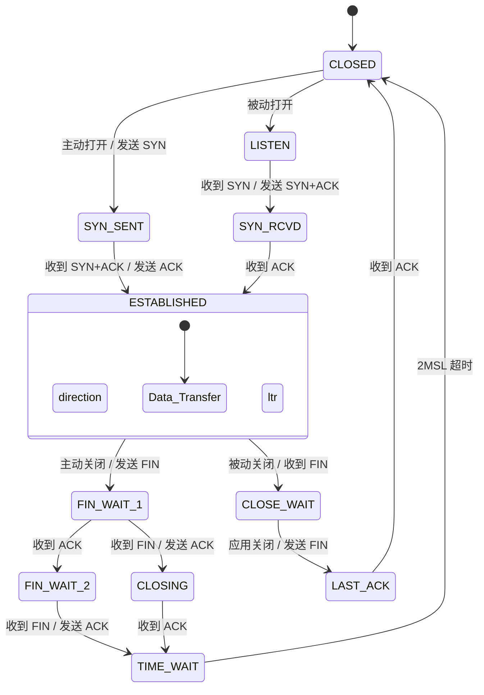

---
tags:
  - 平台/linux
  - 网络编程
阅读次数: 0
---

# TCP 协议基础

## 概述

TCP（Transmission Control Protocol，传输控制协议）是互联网协议栈中最重要的传输层协议之一。它提供了**面向连接**的、**可靠**的字节流传输服务。

与 [[7.4 协议#TCP 与 UDP 对比|UDP]] 不同，TCP 通过一系列复杂的机制来保证数据的可靠传输，包括三次握手建立连接、序列号与确认机制、流量控制、拥塞控制等。

---

## TCP 的核心特性

| 特性 | 说明 |
|:---|:---|
| **面向连接** | 通信前必须先建立连接（三次握手） |
| **可靠传输** | 通过确认、重传、序列号保证数据不丢失、不重复、不乱序 |
| **全双工** | 连接双方可以同时发送和接收数据 |
| **字节流** | TCP 把数据看作无结构的字节流，不保留消息边界 |
| **流量控制** | 通过滑动窗口机制，避免发送方发送过快 |
| **拥塞控制** | 根据网络状况动态调整发送速率 |

---

## TCP 三次握手（建立连接）

TCP 使用三次握手（Three-Way Handshake）来建立可靠的连接。这个过程确保双方都具备发送和接收数据的能力。

### 握手流程

```
       客户端                                    服务器
          │                                        │
   [CLOSED]│                              [LISTEN] │
          │                                        │
          │    ─────── SYN (seq=x) ───────→        │
   [SYN_SENT]                              [SYN_RCVD]
          │                                        │
          │    ←── SYN+ACK (seq=y, ack=x+1) ───    │
          │                                        │
   [ESTABLISHED]                                   │
          │    ─────── ACK (ack=y+1) ───────→      │
          │                              [ESTABLISHED]
          │                                        │
          │    ←────────── 数据传输 ──────────→     │
```

![[848fb028-94a7-45f1-b2b5-c410e105cb97.png]]
### 三次握手详解

^21f29a

| 步骤 | 方向 | 报文内容 | 说明 |
|:---:|:---|:---|:---|
| 第一次 | 客户端 → 服务器 | SYN=1, seq=x | 客户端发送连接请求，进入 SYN_SENT 状态 |
| 第二次 | 服务器 → 客户端 | SYN=1, ACK=1, seq=y, ack=x+1 | 服务器确认请求并发送自己的连接请求 |
| 第三次 | 客户端 → 服务器 | ACK=1, ack=y+1 | 客户端确认服务器的请求，连接建立 |

### 为什么需要三次握手？

1. **确认双向通信能力**：三次握手可以确保双方的发送和接收功能都正常
2. **同步序列号**：双方交换初始序列号（ISN），用于后续数据传输
3. **防止旧连接干扰**：避免已失效的连接请求突然到达服务器，导致错误

> **两次握手的问题**：如果只有两次握手，当一个延迟的 SYN 请求到达服务器时，服务器会认为是新连接，从而建立一个无效连接，浪费资源。

---

## TCP 四次挥手（断开连接）

TCP 使用四次挥手（Four-Way Handshake）来优雅地断开连接。由于 TCP 是全双工的，每个方向的连接需要单独关闭。

### 挥手流程

```
       客户端                                    服务器
          │                                        │
   [ESTABLISHED]                          [ESTABLISHED]
          │                                        │
          │    ─────── FIN (seq=u) ───────→        │
   [FIN_WAIT_1]                           [CLOSE_WAIT]
          │                                        │
          │    ←────── ACK (ack=u+1) ──────        │
   [FIN_WAIT_2]                                    │
          │                                        │
          │        （服务器继续发送剩余数据）          │
          │                                        │
          │    ←────── FIN (seq=w) ────────        │
          │                               [LAST_ACK]
   [TIME_WAIT]                                     │
          │    ─────── ACK (ack=w+1) ──────→       │
          │                               [CLOSED] │
          │                                        │
      2MSL 等待                                     │
          │                                        │
   [CLOSED]│                                       │
```

### 四次挥手详解

| 步骤 | 方向 | 报文内容 | 说明 |
|:---:|:---|:---|:---|
| 第一次 | 主动方 → 被动方 | FIN=1, seq=u | 主动方请求关闭连接 |
| 第二次 | 被动方 → 主动方 | ACK=1, ack=u+1 | 被动方确认收到关闭请求 |
| 第三次 | 被动方 → 主动方 | FIN=1, seq=w | 被动方也请求关闭连接 |
| 第四次 | 主动方 → 被动方 | ACK=1, ack=w+1 | 主动方确认，进入 TIME_WAIT |

### 为什么需要四次挥手？

TCP 是全双工的，一方发送 FIN 只表示"我没有数据要发了"，但仍可以接收对方的数据。因此需要双方各自发送 FIN 来关闭各自方向的数据传输。

### TIME_WAIT 状态

主动关闭方在发送最后一个 ACK 后会进入 **TIME_WAIT** 状态，持续 **2MSL**（Maximum Segment Lifetime，报文最大生存时间）。

**TIME_WAIT 的作用**：
1. **确保最后的 ACK 到达**：如果最后的 ACK 丢失，被动方会重发 FIN，主动方可以重发 ACK
2. **让旧连接的报文消失**：确保本次连接的所有报文都从网络中消失，避免影响新连接

> 关于 TIME_WAIT 状态在服务器编程中带来的问题及解决方案，详见 [[10.2 TIME_WAIT状态]]。

---

## TCP 状态转换图



---

## TCP 可靠性机制

### 1. 序列号与确认号

- **序列号（seq）**：标识发送的数据字节流中的第一个字节
- **确认号（ack）**：期望收到的下一个字节的序列号

```
发送方: seq=1000, 发送 100 字节数据
接收方: ack=1100 (表示已收到 1099 之前的数据，期望下一个字节是 1100)
```

### 2. 超时重传

如果发送方在超时时间内没有收到确认，会重新发送数据：

```
发送方                                     接收方
   │                                          │
   │  ──────── 数据包 (seq=1000) ─────→ ✗     │ 数据包丢失
   │                                          │
   │  [超时]                                   │
   │                                          │
   │  ──────── 数据包 (seq=1000) ─────→        │ 重传
   │  ←──────── ACK (ack=1100) ───────        │
```

### 3. 滑动窗口

TCP 使用滑动窗口实现流量控制，接收方通过**窗口大小（win）**字段告知发送方自己的接收能力：

```
┌──────────────────────────────────────────────────────┐
│ 已确认 │    发送未确认     │   可发送   │   不可发送    │
│       │                   │           │              │
└──────────────────────────────────────────────────────┘
        ↑                   ↑           ↑
     发送基准            下一个发送    窗口边界
```

---

## TCP 与 [[7.6 套接字|Socket]] 编程

在网络编程中，TCP 连接的建立和管理主要通过以下步骤完成：

### 服务器端

```c
socket()    // 创建套接字
bind()      // 绑定地址和端口
listen()    // 开始监听，创建连接队列
accept()    // 接受连接（完成三次握手的最后确认）
read()/write()  // 数据传输
close()     // 关闭连接（触发四次挥手）
```

### 客户端

```c
socket()    // 创建套接字
connect()   // 发起连接（触发三次握手）
read()/write()  // 数据传输
close()     // 关闭连接
```

详细的 Socket 编程内容请参见：
- [[7.6 套接字]]
- [[7.7 listen和accept函数]]

---

## 关键要点

1. **三次握手**：确保双向通信能力和序列号同步
   - SYN → SYN+ACK → ACK

2. **四次挥手**：优雅关闭全双工连接
   - FIN → ACK → FIN → ACK

3. **TIME_WAIT**：持续 2MSL，确保连接可靠关闭

4. **可靠性保证**：
   - 序列号和确认号
   - 超时重传
   - 滑动窗口（流量控制）

5. **与 [[7.4 协议|协议]] 的关系**：TCP 是传输层协议，位于 [[7.1 基础知识|网络模型]] 的第四层

---

## 参考资料

- [[7.1 基础知识|网络分层模型]]
- [[7.2 IP地址|IP 地址]]
- [[7.3 端口|端口]]
- [[7.4 协议|网络协议]]

#网络/TCP #平台/Linux #跨平台
