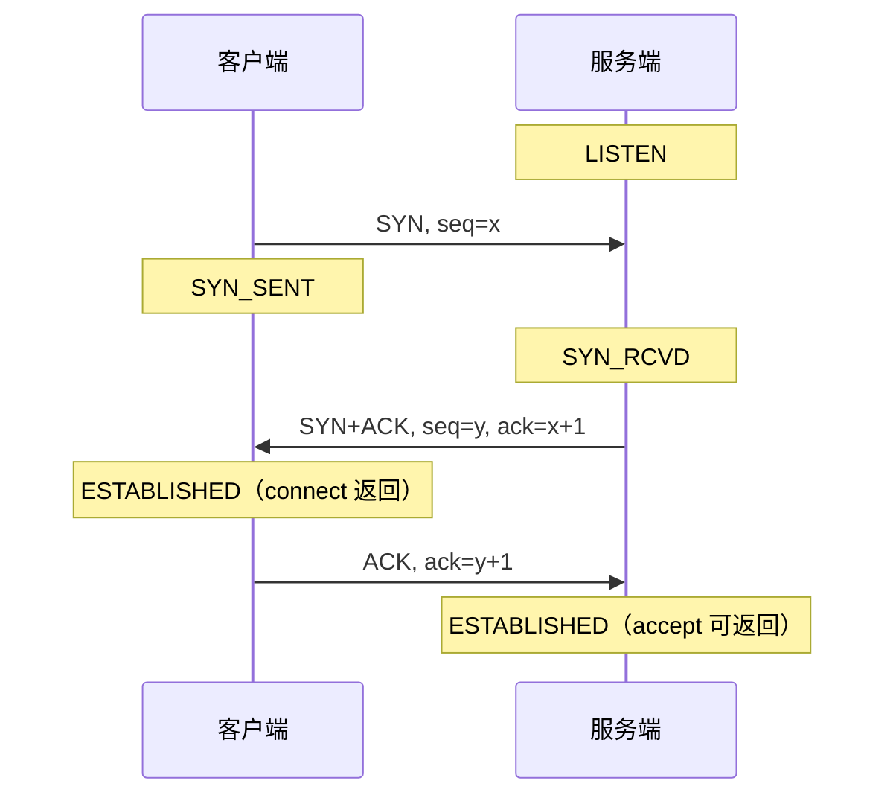
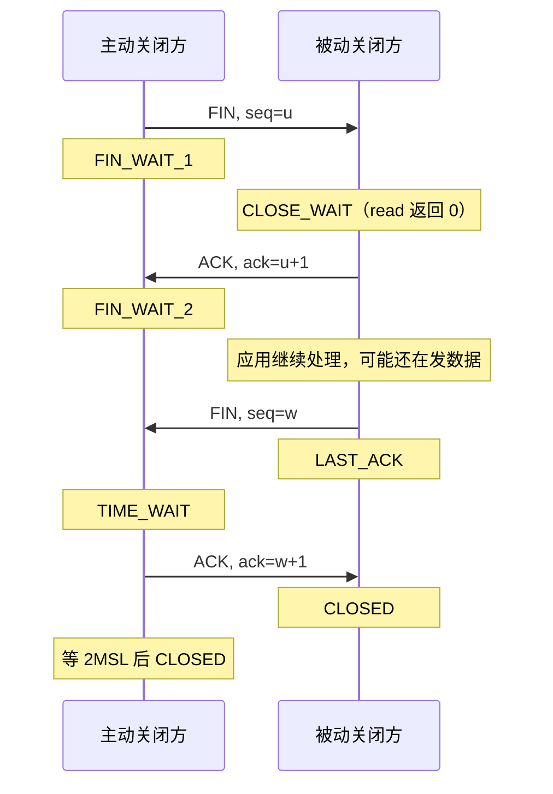
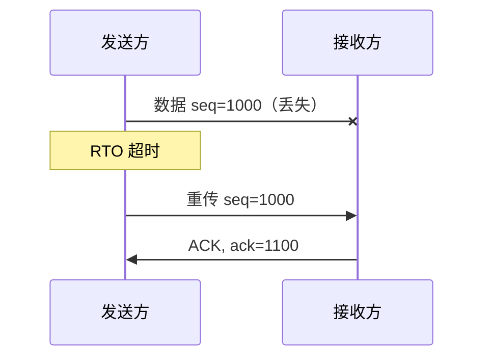

---
tags:
  - Linux
  - 网络编程基础
阅读次数: 0
---

# 7.5 TCP 协议基础

## 1. 概述

TCP（Transmission Control Protocol，传输控制协议）提供**面向连接**的、**可靠**的**字节流**传输服务。这三个词各自有明确所指：

- **面向连接**：通信前要握手，双方各自在内核里建一个控制块，记住序号、窗口、对端地址这些状态。
- **可靠**：不丢、不重、不乱序。靠序号、确认号、超时重传三件套实现。
- **字节流**：TCP 把你写进去的数据看成一串没有结构的字节。你 `write()` 三次，对方可能一次 `read()` 全拿到，也可能分五次拿到。这就是 [[8.9 TCP的粘包和拆包|粘包]] 问题的来源，也是每个 TCP 应用都必须自己定消息边界的原因。

> [!tip] 交互动画
> 连接建立与释放的过程可视化（三次握手包序与双端状态变化 · 四次挥手时序与 TIME_WAIT 2MSL · 完整状态转换图路径漫游）：
> [▶ 在浏览器中打开动画](<../../图片/HTML/3.Linux/7. 网络编程基础/7.5.1 TCP连接建立与释放动画.html>)　·　更多见 [[网络编程·动画合集]]
> 也可直达单个场景：[三次握手](<../../图片/HTML/3.Linux/7. 网络编程基础/7.5.1 TCP连接建立与释放动画.html#scene=handshake>) · [四次挥手](<../../图片/HTML/3.Linux/7. 网络编程基础/7.5.1 TCP连接建立与释放动画.html#scene=wave>) · [状态转换图](<../../图片/HTML/3.Linux/7. 网络编程基础/7.5.1 TCP连接建立与释放动画.html#scene=state>)

---

## 2. 核心特性

| 特性 | 说明 |
|:---|:---|
| **面向连接** | 通信前必须先握手，内核为每条连接维护一个控制块 |
| **可靠传输** | 序号 + 确认 + 重传，保证不丢、不重、不乱序 |
| **全双工** | 两个方向各自独立，可以同时收发，也可以只关一个方向 |
| **字节流** | 不保留消息边界，消息切分是应用自己的事 |
| **流量控制** | 靠窗口字段，防止压垮接收方 |
| **拥塞控制** | 靠 cwnd，防止压垮中间网络 |

---

## 3. 你调的函数、内核的状态、网线上的报文

先看一张全景图。它把三件事对在一起：应用调用了哪个函数、内核处于哪个状态、网线上此刻传的是什么报文。后面所有细节都可以回到这张图上定位。

![[图片/SVG/3_7_7_5_3.svg|900]]

图里有个容易忽略的细节：**`connect()` 和 `accept()` 返回的时刻不一样**。客户端收到 SYN+ACK 就认为连接建好了，`connect()` 立刻返回；服务端要等第三次 ACK 到达、连接被移进全连接队列，`accept()` 才可能返回。所以客户端发出的第一批数据，有可能比服务端的 `accept()` 更早到达。

---

## 4. 三次握手

### 4.1 报文时序


```mermaid
sequenceDiagram
    participant C as 客户端
    participant S as 服务端
    Note over S: LISTEN
    C->>S: SYN, seq=x
    Note over C: SYN_SENT
    Note over S: SYN_RCVD
    S->>C: SYN+ACK, seq=y, ack=x+1
    Note over C: ESTABLISHED（connect 返回）
    C->>S: ACK, ack=y+1
    Note over S: ESTABLISHED（accept 可返回）
```

^21f29a

| 步骤 | 方向 | 报文 | 这一步确认了什么 |
|:---:|:---|:---|:---|
| 第一次 | 客户端 → 服务端 | SYN=1, seq=x | 客户端**能发** |
| 第二次 | 服务端 → 客户端 | SYN=1, ACK=1, seq=y, ack=x+1 | 服务端**能收**也**能发** |
| 第三次 | 客户端 → 服务端 | ACK=1, ack=y+1 | 客户端**能收** |

### 4.2 为什么是三次，不是两次

两次握手时，服务端发完 SYN+ACK 就认为连接建立，但它没有任何证据证明客户端收到了这个包。由此引出的实际问题是：

一个早已超时、被客户端放弃的 SYN，在网络里绕了很久之后才到达服务端。服务端回一个 SYN+ACK 就把连接建起来了，并为它分配缓冲区，而客户端早就不认这条连接，不会有任何数据过来。这条连接会一直占着资源直到超时。三次握手中客户端的第三个 ACK，正好排除了这种情况：客户端不认的连接，它不会发 ACK。

### 4.3 为什么不是四次

按「确认双向能力」的逻辑，本该是四步：SYN → ACK → SYN → ACK。但服务端的 ACK 和 SYN 可以放在同一个报文里发出去，合并之后就是三次。

### 4.4 序号为什么要随机

初始序号 ISN 不是从 0 开始，而是根据四元组和一个内核密钥算出来的（RFC 6528）。两个原因：

- **防止旧连接的报文串进新连接**。同一个四元组的连接关闭后又重建，如果 ISN 相同，网络里残留的旧报文序号正好落在新连接的窗口里，就会被当成合法数据接收。
- **防止连接被伪造**。ISN 可预测时，攻击者不需要看到握手报文就能拼出合法的 TCP 段插进连接里。

### 4.5 SYN flood

攻击者伪造源 IP 疯狂发 SYN，却从不回第三次 ACK。服务端为每个 SYN 在半连接队列里留一个条目并回 SYN+ACK，队列很快占满，正常客户端的 SYN 被丢弃。

Linux 的应对是 **SYN cookies**：队列溢出时，不再保存半连接条目，而是把连接信息编码进 SYN+ACK 的 ISN 里发出去。客户端回 ACK 时，内核从 ack 号里把信息解回来，直接建连接。这样半连接队列不再是瓶颈。

```bash
# 1 表示「仅在半连接队列溢出时启用」，是多数发行版的默认值
sysctl net.ipv4.tcp_syncookies
```

代价是 SYN 里携带的选项（窗口扩大、SACK、时间戳）没地方存，只能丢掉一部分，所以它是应急手段而不是常开优化。队列长度的调整见 [[8.13 TCP内核队列与参数调优]]。

---

## 5. 四次挥手

### 5.1 报文时序


```mermaid
sequenceDiagram
    participant A as 主动关闭方
    participant B as 被动关闭方
    A->>B: FIN, seq=u
    Note over A: FIN_WAIT_1
    Note over B: CLOSE_WAIT（read 返回 0）
    B->>A: ACK, ack=u+1
    Note over A: FIN_WAIT_2
    Note over B: 应用继续处理，可能还在发数据
    B->>A: FIN, seq=w
    Note over B: LAST_ACK
    Note over A: TIME_WAIT
    A->>B: ACK, ack=w+1
    Note over B: CLOSED
    Note over A: 等 2MSL 后 CLOSED
```

| 步骤 | 方向 | 报文 | 触发者 |
|:---:|:---|:---|:---|
| 第一次 | 主动方 → 被动方 | FIN, seq=u | 应用调 `close()` |
| 第二次 | 被动方 → 主动方 | ACK, ack=u+1 | **内核自动回**，不需要应用参与 |
| 第三次 | 被动方 → 主动方 | FIN, seq=w | 被动方的应用调 `close()` |
| 第四次 | 主动方 → 被动方 | ACK, ack=w+1 | 内核自动回 |

### 5.2 为什么关闭要四次，握手却只要三次

关键在第二列的「触发者」：握手时服务端的 ACK 和 SYN 都由内核自动发出，可以合并；挥手时被动方的 ACK 是内核立刻回的，而 FIN 要等它的应用调用 `close()`。这两件事之间隔着不确定长度的业务处理时间，没法合并。

这段间隔就是 **CLOSE_WAIT** 状态存在的意义：它表示「对方不发了，但我这边还没说完」。TCP 是全双工的，一方发 FIN 只意味着「我没有数据要发了」，它仍然可以继续接收，也可以继续发送尚未发完的数据。

> [!note] 挥手也可能只有三次
> 如果被动方的应用在收到 FIN 后立刻 `close()`，内核会把 ACK 和 FIN 合并成一个包发出去，四次就变成了三次。延迟确认机制给了内核这个合并窗口。抓包看到三次挥手不是异常。

### 5.3 TIME_WAIT

主动关闭方发出最后一个 ACK 后进入 TIME_WAIT，等待 **2MSL**（MSL = Maximum Segment Lifetime，报文最大生存时间）。它做两件事：

1. **兜底最后那个 ACK**。如果 ACK 丢了，被动方会超时重发 FIN。此时主动方如果已经 CLOSED，只能回一个 RST，被动方就永远走不到 CLOSED。停在 TIME_WAIT 才能重发 ACK。
2. **让旧连接的残留报文自然消亡**。等满 2MSL 后，这个四元组上不会再有任何属于旧连接的报文，新连接可以安全复用。

> [!warning] Linux 的 TIME_WAIT 是写死的 60 秒
> 内核里 `TCP_TIMEWAIT_LEN` 定义为 60 秒（对应 MSL 取 30 秒），**没有 sysctl 可以调它**，改这个值需要改源码重新编译。网上流传的「调小 TIME_WAIT 时间」多半指的是别的参数，或者是 BSD 上的做法。
>
> 真正能用的手段是 `SO_REUSEADDR`（允许在 TIME_WAIT 期间重新 bind）和减少连接建立次数（改用长连接）。详见 [[10.2 TIME_WAIT状态]]。

---

## 6. 状态机全图

十一个状态，两条关闭路径。看图时先分清自己在哪一列：**谁先调 `close()`，谁就走左边**。这跟客户端还是服务端无关，服务端主动断开时它走的也是左边。

![[图片/SVG/3_7_7_5_1.svg|900]]

右侧那栏是这张图最实用的部分。线上排障时，先用一条命令看状态分布：

```bash
ss -tan | awk '{print $1}' | sort | uniq -c | sort -rn
```

- **TIME_WAIT 很多**：出现在主动关闭方，短连接高频时属于正常。想根治就改长连接，别急着调内核参数。
- **CLOSE_WAIT 很多**：出现在被动关闭方，**这一定是代码 bug**。它表示内核已经收到了对端的 FIN（`read()` 返回 0），但你的程序没有调 `close(fd)`。通常藏在某个异常分支里：解析失败直接 `continue`、抛异常后没有 RAII 兜底。看到它去查代码，不要去查网络。
- **SYN_RCVD 很多**：半连接队列积压，对方发了 SYN 却不回 ACK，是 SYN flood 的典型特征。
- **FIN_WAIT_2 很多**：自己的 FIN 已被确认，但对端迟迟不发它的 FIN。问题在对端应用，它那边多半正堆着 CLOSE_WAIT。

---

## 7. 可靠性机制

### 7.1 序号与确认号

- **序号 seq**：本报文段第一个字节在整条字节流中的位置。
- **确认号 ack**：期望收到的下一个字节的序号。TCP 用的是**累积确认**，ack=1100 表示 1099 **及之前**的所有字节都已收到。

```
发送方：seq=1000，携带 100 字节数据（覆盖 1000 ~ 1099）
接收方：ack=1100  ← 1099 及之前全部收妥，下一个请从 1100 开始
```

累积确认有个副作用：中间丢了一段，后面的段即使全收到了，ack 也只能停在缺口处。**SACK 选项**（选择性确认）就是为此加的，它能额外告诉发送方「我还收到了 1200~1300 这一段」，避免把缺口之后的数据全部重传。

### 7.2 超时重传

发送方发出数据后启动计时器，超时未收到确认就重传：


```mermaid
sequenceDiagram
    participant S as 发送方
    participant R as 接收方
    S-XR: 数据 seq=1000（丢失）
    Note over S: RTO 超时
    S->>R: 重传 seq=1000
    R->>S: ACK, ack=1100
```

超时时间 RTO 不是固定值，而是根据实测的往返时间 RTT 动态算出来的。每次重传失败后 RTO 翻倍（指数退避），避免在网络已经拥塞时雪上加霜。

单纯等超时太慢，所以还有**快速重传**：接收方每收到一个失序的段就立刻重发一次当前的 ack，发送方连续收到 3 个重复 ack 就不等超时，直接重传缺失的那一段。

### 7.3 滑动窗口与流量控制

![[图片/SVG/3_7_7_5_2.svg|900]]

窗口把发送方的字节流切成四段。真正需要记住的是那条约束：

```
在途未确认字节数 = SND.NXT − SND.UNA ≤ win
```

`win` 由接收方在每个 ACK 里通告，发送方不能自作主张。接收方的应用读得慢，`win` 就变小；缓冲区读满了，`win` 变成 0，发送方立刻停发，靠**持续计时器**定期发一个 1 字节的 window probe 试探，直到对方通告出非零窗口。

> [!note] 流量控制不是拥塞控制
> 两者都在限制发送速率，但防的东西不同：流量控制怕压垮**接收方的缓冲区**，依据是对端明确写在头里的 `win`；拥塞控制怕压垮**中间路由器的队列**，依据是自己根据丢包和延迟推测出来的 `cwnd`。
>
> 实际能发多少取决于两者的最小值。吞吐上不去时先分清是哪个卡住：`win` 抓包能直接读到，`cwnd` 要用 `ss -i` 观察。

16 位的窗口字段最大只能表示 65535 字节，在高带宽长延迟的链路上远远不够，所以有**窗口扩大选项**，在握手时协商一个左移位数（最多 14 位）。这个选项只在 SYN 报文里出现，握手时丢了就整条连接都用不上。

---

## 8. 与 socket 编程的对应

### 8.1 服务端

```c
int listenfd = socket(AF_INET, SOCK_STREAM, 0);
bind(listenfd, ...);        // 绑定地址和端口
listen(listenfd, backlog);  // 转为被动套接字，建两个队列，状态进入 LISTEN
int connfd = accept(listenfd, ...);  // 从全连接队列取一条已建好的连接
read(connfd, ...); write(connfd, ...);
close(connfd);              // 发出 FIN，进入 FIN_WAIT_1
```

要留意的是 `accept()` **不参与**三次握手。握手全程由内核完成，`accept()` 只是把已经建好的连接从队列里取出来交给应用。所以 `accept()` 慢不会导致握手失败，只会让全连接队列积压。细节见 [[7.7 listen和accept函数]]。

### 8.2 客户端

```c
int fd = socket(AF_INET, SOCK_STREAM, 0);
connect(fd, ...);           // 发出 SYN，收到 SYN+ACK 后返回
write(fd, ...); read(fd, ...);
close(fd);
```

`connect()` 阻塞时长至少是一个 RTT。这也是短连接慢的根本原因：每次请求都要多付一个往返，加上 TLS 还要再付一到两个。

> [!warning] `write()` 返回不代表对方收到了
> `write()` 只是把数据拷进了内核的发送缓冲区就返回，此时数据可能还没发出去，更没有被确认。同理，`close()` 返回也不代表四次挥手走完了。要确认对方真的收到，只能靠应用层的响应。

---

## 9. 关键要点

1. **字节流没有消息边界**。TCP 保证顺序和不丢，但消息怎么切是应用自己的事。
2. **三次握手的第三个 ACK 用来排除失效的旧连接请求**，不是为了「客气」。
3. **挥手比握手多一次，是因为被动方的 ACK 和 FIN 之间隔着应用的处理时间**。这段间隔就是 CLOSE_WAIT。
4. **TIME_WAIT 在 Linux 上固定 60 秒，改不了**。能调的是 `SO_REUSEADDR` 和连接复用策略。
5. **CLOSE_WAIT 堆积一定是代码没调 `close()`**，跟内核参数无关。
6. **累积确认导致丢一段就要重传后面所有段**，SACK 选项用来避免这种浪费。
7. **在途数据量受 `min(win, cwnd)` 约束**，前者防接收方被压垮，后者防网络被压垮。

---
