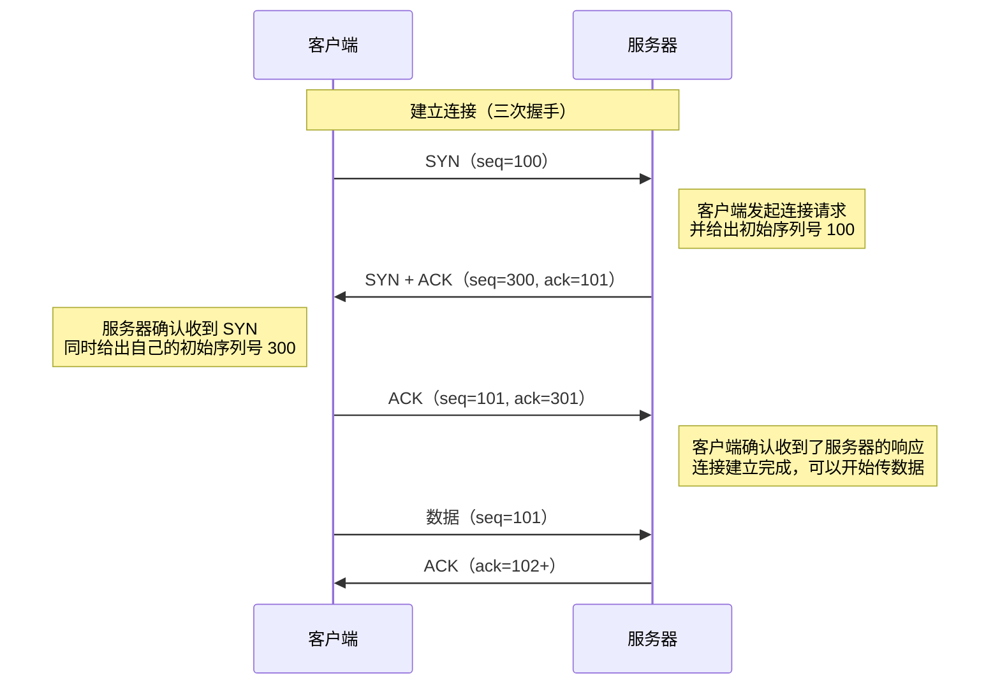
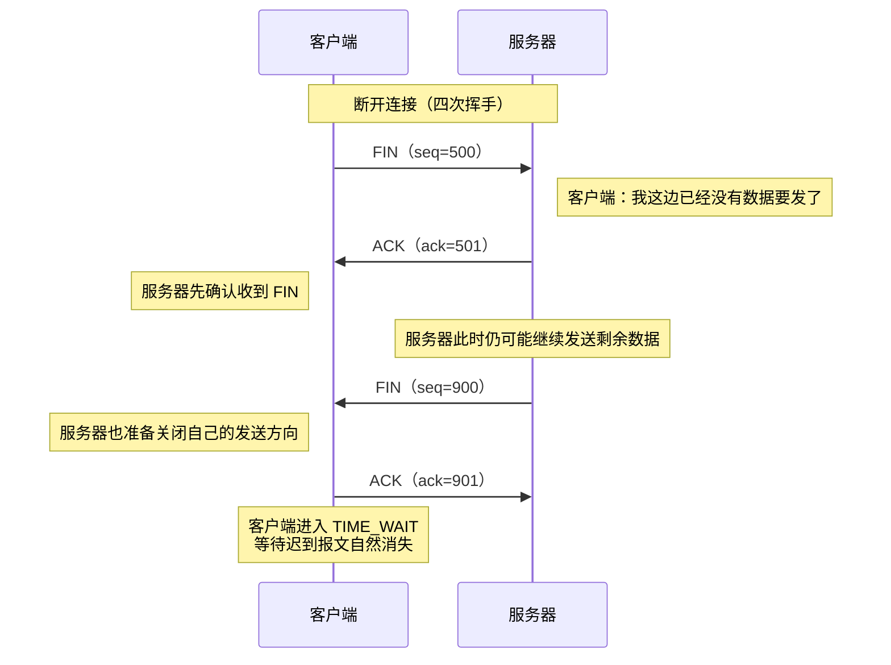

---
tags:
  - 平台/linux
  - 网络编程
  - 网络编程/TCP
---

# TCP 原理

## 概述

TCP（Transmission Control Protocol，**传输控制协议**）是一种**面向连接**的、**可靠的**、基于**字节流**的传输层通信协议。它是互联网协议栈中最核心的协议之一，被广泛应用于 HTTP、SMTP、FTP 等上层协议。

> 关于 TCP 协议的详细原理（三次握手、四次挥手、状态转换等），请参见 [[7.5 TCP协议基础]]。

---

## TCP/IP 网络模型

TCP/IP 协议栈采用分层设计，每一层都有其特定的职责：

![[图片/SVG/3_8_1_1.svg]]

| 层次 | 协议示例 | 主要功能 |
|:---|:---|:---|
| 应用层 | HTTP、SMTP、FTP、DNS | 为用户提供网络服务接口 |
| 传输层 | TCP、UDP | 提供端到端的数据传输服务 |
| 网络层 | IP | 负责数据包的路由和转发 |
| 链路层 | 以太网、WiFi | 在相邻节点间传输数据帧 |
| 物理层 | 双绞线、光纤 | 传输原始比特流 |

---

## TCP 与 UDP 对比

TCP 和 UDP 是传输层的两种主要协议，各有特点：

| 特性 | TCP | UDP |
|:---|:---|:---|
| **连接性** | 面向连接（需要三次握手） | 无连接 |
| **可靠性** | 可靠传输（确认、重传、序号） | 不可靠（尽最大努力交付） |
| **传输方式** | 字节流 | 数据报 |
| **拥塞控制** | 有 | 无 |
| **传输效率** | 较低（开销大） | 较高（开销小） |
| **适用场景** | 文件传输、网页、邮件 | 实时音视频、DNS 查询、游戏 |

### TCP 的核心特性

1. **面向连接**：通信前必须先建立连接（[[7.5 TCP协议基础#TCP 三次握手（建立连接）|三次握手]]）
2. **可靠传输**：通过确认机制、序列号、超时重传等保证数据不丢失、不重复、不乱序
3. **全双工通信**：连接双方可以同时发送和接收数据
4. **流量控制**：通过滑动窗口机制控制发送速率
5. **拥塞控制**：根据网络状况动态调整发送速率

---

## TCP 报文段结构

在代码里，我们更常看到的是 `read()`、`write()`、`connect()`、`accept()` 这些接口，但真正在线上传输的并不是“函数调用”，而是 **TCP 报文段**。先抓住四个最关键的字段即可：

- **序列号（Seq）**：标记本报文段中第一个字节的位置
- **确认号（Ack）**：告诉对方“我下一步希望收到哪个字节”
- **标志位（SYN / ACK / FIN）**：驱动建连、确认和断连
- **窗口大小**：限制在途数据量，避免接收方缓存被压垮

![[图片/SVG/3_8_1_2.svg]]

---

## TCP 通信流程

TCP 通信涉及服务器和客户端两个角色，它们的典型交互流程如下：

### 三次握手：连接如何建立

`connect()` 和 `accept()` 背后，本质上是在完成一次“双向可达性确认”。TCP 不会因为你调用了 `connect()` 就立刻认为连接已建立，而是要先确认双方都具备发送和接收能力。



### 为什么必须三次握手

一句话说，客户端第一次发 `SYN`，只能证明“**我能发**”；服务器回 `SYN + ACK`，证明“**我能收，也能发**”；客户端最后回 `ACK`，才真正证明“**我也能收到你的响应**”。  
所以三次握手不是凑数，而是在补齐双向通信成立所需的最小确认链路。

![[图片/SVG/3_8_1_3.svg|797]]

### 数据传输：序号与确认号如何配合

连接建立后，TCP 会把应用层数据看成一条连续的字节流。它之所以能做到“不丢、不乱、不重”，靠的就是 **字节编号 + 确认 + 重传 + 窗口** 这套机制。

![[图片/SVG/3_8_1_4.svg|799]]

可以把上图理解成：TCP 里的 `seq` 不是“第几个包”，而是“**这段数据从哪个字节开始**”。也正因为如此，TCP 才能正确处理拆包、粘包、乱序和重传。

![[图片/SVG/3_8_1_5.svg|825]]

确认号 `ack` 表示“**我下一个期待收到的字节号**”，因此它本质上是**累计确认**，不是简单地说“我收到了一个包”。

![[图片/SVG/3_8_1_6.svg|777]]

如果某段数据发出去后迟迟等不到对应的确认，TCP 就会认为它可能丢失，并在超时后自动重传。这正是 TCP 可靠性的核心来源之一。

![[图片/SVG/3_8_1_7.svg]]

当接收方处理不过来时，还会通过窗口大小限制“在路上的数据量”。这就是流量控制的基础，它解决的是“别把接收方淹没”的问题。

### 四次挥手：连接如何断开

断开连接比建立连接更谨慎，因为 TCP 是**全双工**的。双方的发送方向要分别关闭，所以常见情况是 `FIN -> ACK -> FIN -> ACK` 这四个动作。



之所以通常是四次挥手，而不是三次，是因为一方说“我不发了”以后，另一方可能还有数据没发完，不能把“确认收到 FIN”和“我也要关闭发送”强行合并。

![[图片/SVG/3_8_1_8.svg|849]]

### TCP 生命周期总览

一个典型的 TCP 连接，可以概括为下面这条主线：

1. **三次握手**：确认双方具备双向收发能力
2. **数据传输**：按字节编号，通过 ACK 进行累计确认
3. **可靠性维护**：丢包重传、滑动窗口、拥塞控制持续生效
4. **四次挥手**：两个方向分别关闭，最后进入完全断开状态

![[3_8_1_14.svg|763]]

### 服务器端流程

服务器端需要执行以下步骤来建立 TCP 服务：

| 步骤 | 函数 | 说明 |
|:---:|:---|:---|
| 1 | [[7.6 套接字#socket 函数\|socket()]] | 创建套接字 |
| 2 | [[7.6 套接字#bind 函数\|bind()]] | 绑定 [[7.2 IP地址\|IP地址]] 和 [[7.3 端口\|端口号]] |
| 3 | [[7.7 listen和accept函数#listen 函数\|listen()]] | 将套接字设为监听状态 |
| 4 | [[7.7 listen和accept函数#accept 函数\|accept()]] | 等待并接受客户端连接 |
| 5 | read()/write() | 数据收发 |
| 6 | close() | 关闭连接 |

### 客户端流程

客户端的流程相对简单：

| 步骤 | 函数 | 说明 |
|:---:|:---|:---|
| 1 | [[7.6 套接字#socket 函数\|socket()]] | 创建套接字 |
| 2 | connect() | 连接服务器（触发三次握手） |
| 3 | write()/read() | 数据收发 |
| 4 | close() | 关闭连接 |

---

## TCP 服务器编程要点

### 1. 端口选择

- 服务器通常绑定到 [[7.3 端口#1. 知名端口（Well-known Ports）：0-1023|知名端口]]（0-1023）或注册端口（1024-49151）
- 避免使用动态端口（49152-65535），以防止与客户端临时端口冲突

### 2. 地址复用

```c
int opt = 1;
setsockopt(sockfd, SOL_SOCKET, SO_REUSEADDR, &opt, sizeof(opt));
```

设置地址复用可以避免服务器重启时出现 "Address already in use" 错误。

### 3. 监听队列

`listen()` 的 `backlog` 参数决定了等待连接队列的长度，高并发场景下应设置较大值。

---

## TCP 可靠性的关键机制

下面这些机制一起工作，才让 TCP 具备了“可靠传输”的能力，而 UDP 则有意省略了这些成本更高的能力：

| 机制 | 作用 |
|:---|:---|
| **序列号（Sequence Number）** | 为每个字节标号，用来检测乱序与缺口 |
| **确认号（Acknowledgment）** | 接收方持续告诉发送方“我已经顺利收到哪里了” |
| **超时重传（Retransmission）** | 长时间收不到确认，就自动重发可疑丢失的数据 |
| **流量控制（Flow Control）** | 利用窗口大小限制在途数据量，防止接收方被压垮 |
| **拥塞控制（Congestion Control）** | 根据网络拥堵程度动态降速，例如慢启动、AIMD 等 |

---

## 关键要点

1. **TCP 是可靠协议**：通过三次握手建立连接，四次挥手断开连接
2. **分层模型**：TCP 工作在传输层，依赖 IP 层进行数据包路由
3. **Socket 是编程接口**：应用程序通过 [[7.6 套接字|Socket]] 接口使用 TCP 协议
4. **服务器-客户端模式**：服务器被动等待连接，客户端主动发起连接
5. **ACK 不是“收到第几个包”**：它表示“下一个期待收到的字节号”
6. **窗口不是可有可无的参数**：它决定了最多允许多少数据同时在路上

---


### 一句话理解 TCP

> **可以把 TCP 想成一次讲究礼节的电话通话。** 先通过三次握手确认双方都能听、都能说；传输过程中持续确认哪些字节已经收到；最后再通过四次挥手分别关闭两个方向的通信。

**最值得记住的数字：**

- 建立连接通常需要 **3** 个报文
- 断开连接通常需要 **4** 个报文
- `Seq` 和 `Ack` 跟踪的是**字节流**，不是“第几个包”

## 相关笔记

- [[7.5 TCP协议基础]] - TCP 三次握手、四次挥手详解
- [[7.6 套接字]] - Socket 编程接口
- [[7.7 listen和accept函数]] - 监听和接受连接

---

#网络/TCP #平台/Linux #跨平台
