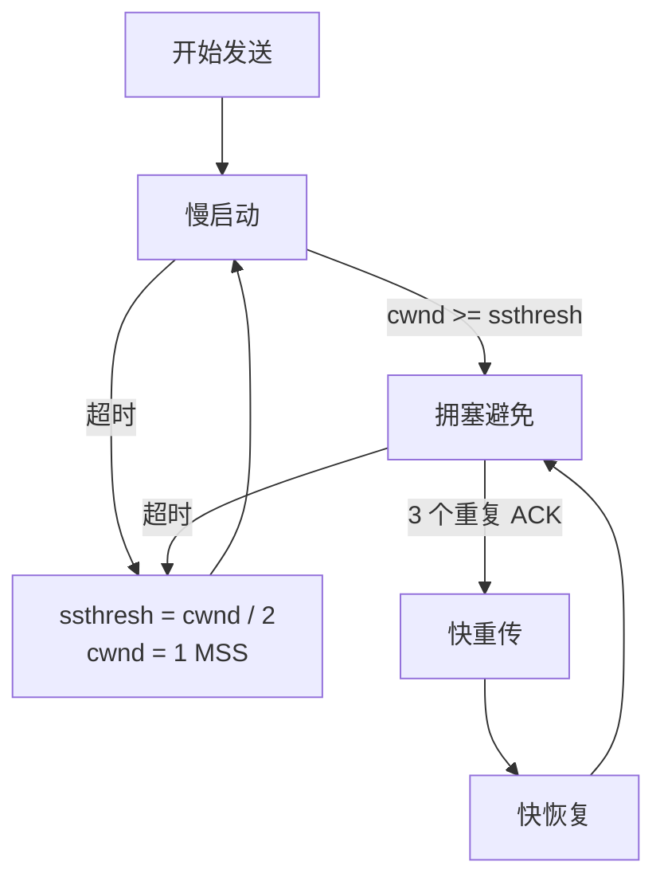

---
tags:
  - 平台/linux
  - 网络编程
  - 网络编程/TCP
---

# 拥塞控制

> [!note]
> 本文以经典 TCP 拥塞控制（Tahoe / Reno 的核心思路）为主，帮助理解 `cwnd`、`ssthresh`、慢启动、拥塞避免、快重传和快恢复。现代系统中还可能使用 CUBIC、BBR 等更复杂的算法，但基础思想仍然是：**根据网络状态动态调整发送速率，避免把网络压垮**。

## 简介

拥塞控制（Congestion Control）是 TCP 中非常核心的一套机制，它解决的不是“接收方来不及收”的问题，而是“**网络中间的路径扛不住了**”的问题。

如果一条网络路径上的主机都拼命发送数据，路由器和交换机中的队列就会越来越长，最终出现：

- 排队时延急剧增加
- 中间设备缓存溢出
- 报文段丢失
- 重传变多，进一步加剧拥塞

这会形成一种恶性循环：

```text
发送过快
   ↓
网络设备队列积压
   ↓
时延升高 / 丢包增加
   ↓
发送方重传更多数据
   ↓
网络更拥堵
```

所以，TCP 不能只顾着“能发就发”，而必须根据网络反馈主动降速、缓慢探测可用带宽，再逐步提高发送速率。

---

## 为什么需要拥塞控制

可以把网络想象成一条高速公路：

- **接收方窗口 `rwnd`** 像“终点停车场还有多少空位”
- **拥塞窗口 `cwnd`** 像“这条路当前最多还能承受多少车”

即使接收方还有能力接收，如果中间的“路”已经堵了，发送方也必须慢下来。

如果没有拥塞控制，会出现以下问题：

| 问题 | 说明 |
|:---|:---|
| **路由器队列膨胀** | 数据包不断堆积，时延越来越大 |
| **缓存溢出丢包** | 队列满了以后，新的报文直接被丢弃 |
| **无效重传** | 发送方把丢包当成“需要补发”，反而让网络更忙 |
| **吞吐量下降** | 看起来发得很多，实际上有效送达的数据变少了 |

TCP 的拥塞控制，本质上是在做两件事：

1. **探测网络还能承受多少发送速率**
2. **一旦怀疑出现拥塞，立即收缩发送窗口**

---

## 拥塞控制 vs 流控制

[[8.8 流控制|流控制]] 和拥塞控制很容易混淆，但两者不是一回事：

| 机制 | 解决的问题 | 关注对象 | 谁来决定 |
|:---|:---|:---|:---|
| **流控制** | 接收方处理不过来 | 接收方缓冲区 | 接收方通告窗口 `rwnd` |
| **拥塞控制** | 网络路径扛不住 | 路由器、交换机、链路 | 发送方维护拥塞窗口 `cwnd` |

TCP 真正能发送的数据量，受两者共同约束：

```text
实际发送窗口 = min(rwnd, cwnd)
```

也就是说：

- `rwnd` 小，说明接收方吃不下
- `cwnd` 小，说明网络路上太堵
- 发送方只能按更小的那个窗口来发

> [!tip]
> 一句话记忆：
> **流控制防止“把对方淹没”，拥塞控制防止“把网络淹没”。**

---

## 核心概念

### 1. 拥塞窗口 `cwnd`

`cwnd`（Congestion Window）是**发送方自己维护的窗口**，表示当前它认为“网络还能承受多少未确认数据”。

它不是 TCP 首部里的固定字段，而是 TCP 协议栈内部根据网络反馈动态调整出来的值。

`cwnd` 的几个关键特点：

- 它反映的是发送方对网络承载能力的估计
- 网络越顺畅，`cwnd` 越大
- 一旦怀疑发生拥塞，`cwnd` 会立刻缩小

在教材或面试题里，`cwnd` 常用 **MSS**（Maximum Segment Size）作为单位来理解。例如：

- `cwnd = 1 MSS`：一次大致只能发一个报文段
- `cwnd = 8 MSS`：一次大致可以有 8 个 MSS 的数据在路上

---

### 2. 慢启动门限 `ssthresh`

`ssthresh`（Slow Start Threshold，慢启动门限）用来决定当前应该采用哪种增长方式：

- 当 `cwnd < ssthresh` 时，进入**慢启动**
- 当 `cwnd >= ssthresh` 时，进入**拥塞避免**

可以把它理解成：

- 在较小窗口阶段，TCP 会快速试探网络能力
- 达到某个阈值后，就改成更保守的线性增长

---

### 3. 接收窗口 `rwnd`

`rwnd` 是接收方在 ACK 中通告的窗口大小，表示接收缓冲区还能接纳多少数据。它属于 [[8.8 流控制|流控制]] 的范畴。

因此：

- `rwnd` 决定“接收方能不能吃下”
- `cwnd` 决定“网络中间能不能扛住”

---

### 4. 实际发送窗口

发送方真正能发出去的数据量，并不是只看 `cwnd`，而是：

```text
发送窗口 = min(rwnd, cwnd)
```

例如：

| `rwnd` | `cwnd` | 实际发送窗口 | 含义 |
|:---|:---|:---|:---|
| 16 KB | 8 KB | 8 KB | 网络更紧张，受拥塞控制限制 |
| 4 KB | 10 KB | 4 KB | 接收方更慢，受流控制限制 |

---

### 5. TCP 如何感知“可能拥塞了”

经典 TCP 通常根据以下信号来判断网络可能出了问题：

| 信号 | 含义 | TCP 的典型反应 |
|:---|:---|:---|
| **超时（RTO）** | 长时间等不到 ACK，怀疑网络拥塞较严重 | 大幅降低 `cwnd`，重新进入慢启动 |
| **3 个重复 ACK** | 某个报文段可能丢了，但后面的报文还在陆续到达 | 快重传 + 快恢复 |

这里要注意一点：

> **丢包不一定 100% 等于网络拥塞。**
> 在无线网络等场景里，也可能是误码或链路波动造成丢包。
> 但经典 TCP 在设计上，通常把“丢包”当作拥塞信号处理。

---

## 四大经典算法

TCP 经典拥塞控制通常围绕四个算法展开：

1. 慢启动（Slow Start）
2. 拥塞避免（Congestion Avoidance）
3. 快重传（Fast Retransmit）
4. 快恢复（Fast Recovery）

它们之间的关系可以先用这张图抓整体：



---

### 1. 慢启动（Slow Start）

慢启动这个名字很容易让人误会，它其实**一点也不慢**。它的特点是：

- 初始 `cwnd` 较小
- 每收到一些 ACK，就继续增大 `cwnd`
- 从“按 RTT 看”的效果上，它接近**指数增长**

教材里通常这样理解慢启动：

| 轮次（RTT） | `cwnd` 变化 |
|:---|:---|
| 第 1 轮 | 1 MSS |
| 第 2 轮 | 2 MSS |
| 第 3 轮 | 4 MSS |
| 第 4 轮 | 8 MSS |

也就是说，`cwnd` 大致会每过一个 RTT 翻倍。这么做的目的不是鲁莽，而是：

- 刚开始不知道网络容量
- 先从小窗口起步
- 如果一路都能收到 ACK，说明网络还扛得住，可以迅速放大

慢启动会在以下情况下结束：

- `cwnd` 增长到 `ssthresh`
- 发生超时
- 或收到 3 个重复 ACK

---

### 2. 拥塞避免（Congestion Avoidance）

当 `cwnd` 达到 `ssthresh` 后，TCP 不再继续“翻倍式”增长，而是进入更保守的**拥塞避免**阶段。

这一阶段的核心思想是 **AIMD** 中的“加性增大”（Additive Increase）：

- 每经过一个 RTT，`cwnd` 大约只增加 **1 MSS**
- 不再指数膨胀，而是线性增长

可以把它理解成：

- 慢启动像“发现路挺空，先快速加速”
- 拥塞避免像“车已经多起来了，继续加速，但要一点点加”

从 ACK 级别更细一点看，很多教材会写成近似规则：

```text
每收到一个 ACK：
    cwnd += MSS * MSS / cwnd
```

这个公式累积起来，效果大致就是“每过一个 RTT，`cwnd` 增加 1 MSS”。

---

### 3. 快重传（Fast Retransmit）

如果发送方连续收到 **3 个重复 ACK（Duplicate ACK）**，通常说明：

- 某个较早的数据段可能丢了
- 但后续数据段已经到达接收方
- 因此接收方不断重复确认“我还在等那个缺失的数据段”

这时，发送方不必傻等超时，而可以**立即重传可疑丢失的数据段**，这就是快重传。

例如：

```text
发送方发出：1 2 3 4 5
接收方收到了：1 2 4 5

因为 3 丢了，接收方只能反复回 ACK=3
当发送方连续看到 3 个 ACK=3，就会立刻重传 3
```

> [!question] 为什么是 3 个重复 ACK？
> 因为 1 个、2 个重复 ACK 还有可能只是正常乱序；
> 连续 3 个重复 ACK 更像是“某个报文段真的丢了”的强信号。

---

### 4. 快恢复（Fast Recovery）

快恢复通常和快重传配套使用。它的核心目标是：

> **既然还能持续收到重复 ACK，说明网络并没有完全堵死，就没必要像超时那样把 `cwnd` 直接打回起点。**

经典教材里的简化理解通常是：

1. 出现 3 个重复 ACK
2. 立即重传丢失报文段
3. 设置 `ssthresh = cwnd / 2`
4. 将 `cwnd` 缩小到较低水平
5. 进入拥塞避免，继续线性增长

如果按 **TCP Reno** 更精细地说，流程通常是：

1. 收到 3 个重复 ACK
2. `ssthresh = max(cwnd / 2, 2 MSS)`
3. 立刻重传丢失的数据段
4. 暂时把 `cwnd` 调整到 `ssthresh + 3 MSS`
5. 每收到额外的重复 ACK，再把 `cwnd` 增大 1 MSS
6. 当收到针对新数据的 ACK 后，把 `cwnd` 设回 `ssthresh`，转入拥塞避免

所以：

- **超时**：说明拥塞更严重，反应更激烈
- **3 个重复 ACK**：说明还有数据在流动，反应可以相对温和

---

## 超时与 3 个重复 ACK 的区别

这两种情况都可能意味着丢包，但 TCP 对它们的判断严重程度不同：

| 事件 | TCP 的判断 | 典型处理 |
|:---|:---|:---|
| **超时** | 网络可能非常拥堵，ACK 几乎回不来 | `cwnd` 大幅下降，重新慢启动 |
| **3 个重复 ACK** | 连接还在流动，更像局部丢包 | 快重传 + 快恢复，通常只减半 |

可以把它们理解成：

- **超时**：像“整条路都堵住了”
- **3 个重复 ACK**：像“前面掉了一个包，但后面的车还在动”

---

## 一个完整的窗口变化示例

假设：

- 初始 `cwnd = 1 MSS`
- `ssthresh = 8 MSS`

那么 `cwnd` 的变化过程可以这样理解：

```text
开始：cwnd=1，ssthresh=8

慢启动阶段：
RTT1: 1
RTT2: 2
RTT3: 4
RTT4: 8   -> 达到门限，进入拥塞避免

拥塞避免阶段：
RTT5: 9
RTT6: 10
RTT7: 11

此时出现 3 个重复 ACK：
ssthresh = 11 / 2 ≈ 5
执行快重传 + 快恢复
调整后继续线性增长

RTT8: 5
RTT9: 6
RTT10: 7

后来又出现超时：
ssthresh = 7 / 2 ≈ 3
cwnd = 1
重新进入慢启动
```

这个例子体现了两条最核心的规律：

1. **网络顺畅时，逐步增大 `cwnd`**
2. **怀疑拥塞时，迅速减小 `cwnd`**

---

## 教学版规则总结

如果把经典 TCP 拥塞控制写成“方便记忆的伪代码”，可以简化为：

```c
if (timeout) {
    ssthresh = max(cwnd / 2, 2 * MSS);
    cwnd = 1 * MSS;
    state = SLOW_START;
} else if (dup_ack == 3) {
    retransmit_lost_segment();
    ssthresh = max(cwnd / 2, 2 * MSS);
    cwnd = ssthresh;   // 教学上的简化理解
    state = CONGESTION_AVOIDANCE;
} else if (state == SLOW_START) {
    // 效果上约等于每个 RTT 翻倍
    grow_cwnd_exponentially();
} else if (state == CONGESTION_AVOIDANCE) {
    // 效果上约等于每个 RTT 增加 1 MSS
    grow_cwnd_linearly();
}
```

> [!warning]
> 上面的伪代码是为了帮助理解主线逻辑，便于记忆。
> 真正的内核实现会更复杂，不同拥塞控制算法（Reno、CUBIC、BBR 等）的细节也并不相同。

---

## 与实际编程的关系

理解拥塞控制后，再看 [[8.2 TCP服务端]]、[[8.3 TCP客户端]]、[[8.7 IO缓冲]] 这些内容，会更容易明白下面几点：

### 1. `send()` 返回，不等于数据已经立刻到达对方

应用层把数据写入发送缓冲区后，真正什么时候发、一次发多少，还会受到：

- 接收方窗口 `rwnd`
- 拥塞窗口 `cwnd`
- MSS、延迟确认、[[10.3 Nagle算法|Nagle 算法]] 等因素

的共同影响。

---

### 2. 吞吐量不是“代码里想发多快就能发多快”

即使你的程序不断调用 `write()` / `send()`，真正的发送速率也会被 TCP 根据网络状态动态调节。

所以当你发现：

- 跨机房传输速度不稳定
- 丢包后吞吐量突然下降
- RTT 上升时传输明显变慢

背后很可能都和拥塞控制有关。

---

### 3. 拥塞控制和 Nagle 算法不是一回事

它们都会影响“数据怎么发出去”，但目标不同：

| 机制 | 主要目标 |
|:---|:---|
| **拥塞控制** | 避免网络被压垮 |
| **Nagle 算法** | 减少小包数量，提高发送效率 |

Nagle 更关注“小包合并”，拥塞控制更关注“整体网络负载”。

---

## 关键要点

1. **拥塞控制解决的是网络路径拥堵问题**，不是接收方处理能力问题
2. **发送方通过 `cwnd` 估计网络还能承受多少在途数据**
3. **`ssthresh` 决定当前更适合快速探测，还是保守增长**
4. **慢启动是指数增长，拥塞避免是线性增长**
5. **3 个重复 ACK 通常触发快重传 / 快恢复，超时则反应更激烈**
6. **真正可发送的数据量由 `min(rwnd, cwnd)` 决定**

---

## 相关笔记

- [[8.1 TCP原理]] - TCP 的核心特性与整体通信流程
- [[8.8 流控制]] - 接收方窗口与滑动窗口机制
- [[8.7 IO缓冲]] - 发送缓冲区、接收缓冲区与数据收发过程
- [[7.5 TCP协议基础#3. 滑动窗口|7.5 TCP协议基础 - 滑动窗口]] - TCP 基础中的窗口概念
- [[10.3 Nagle算法]] - 小包合并与传输效率优化

---

#网络/TCP #平台/Linux #跨平台
