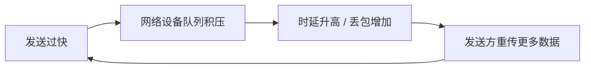
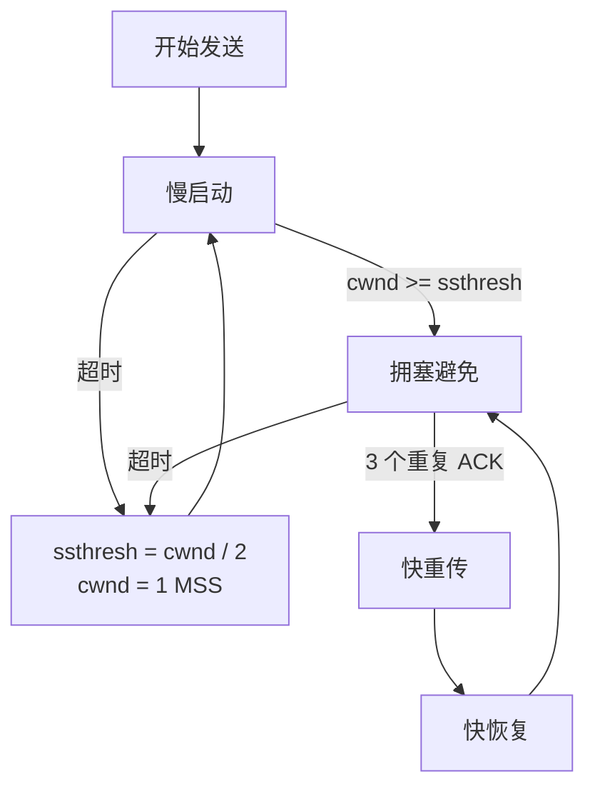

---
tags:
  - Linux
  - TCP-编程
---

# 8.10 拥塞控制

> [!note]
> 本文以经典 TCP 拥塞控制（Tahoe / Reno 的核心思路）为主，帮助理解 `cwnd`、`ssthresh`、慢启动、拥塞避免、快重传和快恢复。现代系统中还可能使用 CUBIC、BBR 等更复杂的算法，但基础思想仍然是：**根据网络状态动态调整发送速率，避免把网络压垮**。

> [!tip] 交互动画
> 拥塞控制四阶段的过程可视化（慢启动指数增长 · 拥塞避免线性增长 · 3 dup ACK 快重传快恢复 vs 超时 · cwnd/ssthresh 全程锯齿曲线）：
> [▶ 在浏览器中打开动画](<../../图片/HTML/3.Linux/8. TCP 编程/8.10.1 拥塞控制动画.html>)　·　更多见 [[网络编程·动画合集]]
> 也可直达单个场景：[慢启动](<../../图片/HTML/3.Linux/8. TCP 编程/8.10.1 拥塞控制动画.html#scene=slowstart>) · [拥塞避免](<../../图片/HTML/3.Linux/8. TCP 编程/8.10.1 拥塞控制动画.html#scene=avoid>) · [快重传·快恢复](<../../图片/HTML/3.Linux/8. TCP 编程/8.10.1 拥塞控制动画.html#scene=recovery>) · [完整曲线](<../../图片/HTML/3.Linux/8. TCP 编程/8.10.1 拥塞控制动画.html#scene=curve>)

## 1. 简介

拥塞控制（Congestion Control）是 TCP 中非常核心的一套机制，它解决的不是“接收方来不及收”的问题，而是“**网络中间的路径扛不住了**”的问题。

如果一条网络路径上的主机都拼命发送数据，路由器和交换机中的队列就会越来越长，最终出现：

- 排队时延急剧增加
- 中间设备缓存溢出
- 报文段丢失
- 重传变多，进一步加剧拥塞

这会形成一个自我强化的循环，越堵越发、越发越堵：


```mermaid
flowchart LR
    A["发送过快"] --> B["网络设备队列积压"]
    B --> C["时延升高 / 丢包增加"]
    C --> D["发送方重传更多数据"]
    D --> A
```

所以 TCP 不能只顾着“能发就发”，而必须根据网络反馈主动降速、缓慢探测可用带宽，再逐步提高发送速率。

---

## 2. 为什么需要拥塞控制

可以把网络想象成一条高速公路：

- **接收方窗口 `rwnd`** 像“终点停车场还有多少空位”
- **拥塞窗口 `cwnd`** 像“这条路当前最多还能承受多少车”

即使接收方还有能力接收，如果中间的“路”已经堵了，发送方也必须慢下来。

如果没有拥塞控制，会出现以下问题：

| 问题 | 说明 |
|:---|:---|
| **路由器队列膨胀** | 数据包不断堆积，时延越来越大 |
| **缓存溢出丢包** | 队列满了以后，新的报文直接被丢弃 |
| **无效重传** | 发送方把丢包当成“需要补发”，反而让网络更忙 |
| **吞吐量下降** | 看起来发得很多，实际上有效送达的数据变少了 |

TCP 的拥塞控制，本质上是在做两件事：

1. **探测网络还能承受多少发送速率**
2. **一旦怀疑出现拥塞，立即收缩发送窗口**

---

## 3. 拥塞控制 vs 流控制

[[8.8 流控制|流控制]] 和拥塞控制很容易混淆，但两者不是一回事：

| 机制 | 解决的问题 | 关注对象 | 谁来决定 |
|:---|:---|:---|:---|
| **流控制** | 接收方处理不过来 | 接收方缓冲区 | 接收方通告窗口 `rwnd` |
| **拥塞控制** | 网络路径扛不住 | 路由器、交换机、链路 | 发送方维护拥塞窗口 `cwnd` |

TCP 真正能发送的数据量受两者共同约束：**实际发送窗口 = `min(rwnd, cwnd)`**。也就是说：

- `rwnd` 小，说明接收方吃不下
- `cwnd` 小，说明网络路上太堵
- 发送方只能按更小的那个窗口来发

> [!tip]
> 一句话记忆：
> **流控制防止“把对方淹没”，拥塞控制防止“把网络淹没”。**

---

## 4. 核心概念

### 4.1 拥塞窗口 `cwnd`

`cwnd`（Congestion Window）是**发送方自己维护的窗口**，表示当前它认为“网络还能承受多少未确认数据”。

它不是 TCP 首部里的固定字段，而是 TCP 协议栈内部根据网络反馈动态调整出来的值。

`cwnd` 的几个关键特点：

- 它反映的是发送方对网络承载能力的估计
- 网络越顺畅，`cwnd` 越大
- 一旦怀疑发生拥塞，`cwnd` 会立刻缩小

在教材或面试题里，`cwnd` 常用 **MSS**（Maximum Segment Size）作为单位来理解。例如：

- `cwnd = 1 MSS`：一次大致只能发一个报文段
- `cwnd = 8 MSS`：一次大致可以有 8 个 MSS 的数据在路上

---

### 4.2 慢启动门限 `ssthresh`

`ssthresh`（Slow Start Threshold，慢启动门限）用来决定当前应该采用哪种增长方式：

- 当 `cwnd < ssthresh` 时，进入**慢启动**
- 当 `cwnd >= ssthresh` 时，进入**拥塞避免**

可以把它理解成：

- 在较小窗口阶段，TCP 会快速试探网络能力
- 达到某个阈值后，就改成更保守的线性增长

---

### 4.3 接收窗口 `rwnd`

`rwnd` 是接收方在 ACK 中通告的窗口大小，表示接收缓冲区还能接纳多少数据。它属于 [[8.8 流控制|流控制]] 的范畴。

因此：

- `rwnd` 决定“接收方能不能吃下”
- `cwnd` 决定“网络中间能不能扛住”

---

### 4.4 实际发送窗口

发送方真正能发出去的数据量并不是只看 `cwnd`，而是 `min(rwnd, cwnd)`。例如：

| `rwnd` | `cwnd` | 实际发送窗口 | 含义 |
|:---|:---|:---|:---|
| 16 KB | 8 KB | 8 KB | 网络更紧张，受拥塞控制限制 |
| 4 KB | 10 KB | 4 KB | 接收方更慢，受流控制限制 |

---

### 4.5 TCP 如何感知“可能拥塞了”

经典 TCP 通常根据以下信号来判断网络可能出了问题：

| 信号 | 含义 | TCP 的典型反应 |
|:---|:---|:---|
| **超时（RTO）** | 长时间等不到 ACK，怀疑网络拥塞较严重 | 大幅降低 `cwnd`，重新进入慢启动 |
| **3 个重复 ACK** | 某个报文段可能丢了，但后面的报文还在陆续到达 | 快重传 + 快恢复 |

这里要注意一点：

> **丢包不一定 100% 等于网络拥塞。**
> 在无线网络等场景里，也可能是误码或链路波动造成丢包。
> 但经典 TCP 在设计上，通常把“丢包”当作拥塞信号处理。

---

## 5. 四大经典算法

TCP 经典拥塞控制通常围绕四个算法展开：

1. 慢启动（Slow Start）
2. 拥塞避免（Congestion Avoidance）
3. 快重传（Fast Retransmit）
4. 快恢复（Fast Recovery）

它们之间的关系可以先用这张图抓整体：


```mermaid
flowchart TD
    A["开始发送"] --> B["慢启动"]
    B -->|cwnd >= ssthresh| C["拥塞避免"]
    B -->|超时| D["ssthresh = cwnd / 2<br/>cwnd = 1 MSS"]
    C -->|超时| D
    D --> B
    C -->|3 个重复 ACK| E["快重传"]
    E --> F["快恢复"]
    F --> C
```

---

### 5.1 慢启动（Slow Start）

慢启动这个名字很容易让人误会，它其实**一点也不慢**。它的特点是：

- 初始 `cwnd` 较小
- 每收到一些 ACK，就继续增大 `cwnd`
- 从“按 RTT 看”的效果上，它接近**指数增长**

教材里通常这样理解慢启动：

| 轮次（RTT） | `cwnd` 变化 |
|:---|:---|
| 第 1 轮 | 1 MSS |
| 第 2 轮 | 2 MSS |
| 第 3 轮 | 4 MSS |
| 第 4 轮 | 8 MSS |

也就是说，`cwnd` 大致会每过一个 RTT 翻倍。这么做的目的不是鲁莽，而是：

- 刚开始不知道网络容量
- 先从小窗口起步
- 如果一路都能收到 ACK，说明网络还扛得住，可以迅速放大

慢启动会在以下情况下结束：

- `cwnd` 增长到 `ssthresh`
- 发生超时
- 或收到 3 个重复 ACK

---

### 5.2 拥塞避免（Congestion Avoidance）

当 `cwnd` 达到 `ssthresh` 后，TCP 不再继续“翻倍式”增长，而是进入更保守的**拥塞避免**阶段。

这一阶段的核心思想是 **AIMD** 中的“加性增大”（Additive Increase）：

- 每经过一个 RTT，`cwnd` 大约只增加 **1 MSS**
- 不再指数膨胀，而是线性增长

可以把它理解成：

- 慢启动像“发现路挺空，先快速加速”
- 拥塞避免像“车已经多起来了，继续加速，但要一点点加”

从 ACK 级别更细一点看，很多教材会写成近似规则：

```text
每收到一个 ACK：
    cwnd += MSS * MSS / cwnd
```

这个公式累积起来，效果大致就是“每过一个 RTT，`cwnd` 增加 1 MSS”。

---

### 5.3 快重传（Fast Retransmit）

如果发送方连续收到 **3 个重复 ACK（Duplicate ACK）**，通常说明：

- 某个较早的数据段可能丢了
- 但后续数据段已经到达接收方
- 因此接收方不断重复确认“我还在等那个缺失的数据段”

这时，发送方不必傻等超时，而可以**立即重传可疑丢失的数据段**，这就是快重传。

数重复 ACK 的个数最容易搞错，关键是**第一个 ACK = 3 不算重复**，它是对 1、2 的正常确认：

| 接收方收到 | 回复 | 算第几个重复 ACK |
|:---|:---|:---|
| 1、2 | ACK = 3 | 不算，这是正常确认 |
| 3 | —— | 丢了，没到 |
| 4 | ACK = 3 | 重复 ① |
| 5 | ACK = 3 | 重复 ② |
| 6 | ACK = 3 | 重复 ③ → 触发快重传 |

所以要凑齐 3 个重复 ACK，得有 **3 个失序报文段成功到达**。发送方一看到第 3 个重复 ACK 就立刻重传报文段 3，不等 RTO 到期。

> [!question] 为什么是 3 个重复 ACK？
> 1 个、2 个重复 ACK 还可能只是网络把包送乱了序——乱序在真实网络里很常见，为它触发重传太浪费。
> 连续 3 个重复 ACK 就更像“某个报文段真的丢了”的强信号，这是在**误判重传**和**反应太慢**之间选的一个经验值。

---

### 5.4 快恢复（Fast Recovery）

快恢复通常和快重传配套使用。它的核心目标是：

> **既然还能持续收到重复 ACK，说明网络并没有完全堵死，就没必要像超时那样把 `cwnd` 直接打回起点。**

经典教材里的简化理解通常是：

1. 出现 3 个重复 ACK
2. 立即重传丢失报文段
3. 设置 `ssthresh = cwnd / 2`
4. 将 `cwnd` 缩小到较低水平
5. 进入拥塞避免，继续线性增长

如果按 **TCP Reno** 更精细地说，流程通常是：

1. 收到 3 个重复 ACK
2. `ssthresh = max(cwnd / 2, 2 MSS)`
3. 立刻重传丢失的数据段
4. 暂时把 `cwnd` 调整到 `ssthresh + 3 MSS`
5. 每收到额外的重复 ACK，再把 `cwnd` 增大 1 MSS
6. 当收到针对新数据的 ACK 后，把 `cwnd` 设回 `ssthresh`，转入拥塞避免

所以：

- **超时**：说明拥塞更严重，反应更激烈
- **3 个重复 ACK**：说明还有数据在流动，反应可以相对温和

---

## 6. 超时与 3 个重复 ACK 的区别

这两种情况都可能意味着丢包，但 TCP 对它们的判断严重程度不同：

| 事件 | TCP 的判断 | 典型处理 |
|:---|:---|:---|
| **超时** | 网络可能非常拥堵，ACK 几乎回不来 | `cwnd` 大幅下降，重新慢启动 |
| **3 个重复 ACK** | 连接还在流动，更像局部丢包 | 快重传 + 快恢复，通常只减半 |

把两种情况的报文往返画在一起，差别就很直观了：

![[图片/SVG/3_8_8_10_2.svg|1390]]

判断依据其实是“**还有没有 ACK 在回来**”：

- 有 ACK 回来，说明链路仍在工作，只是掉了个别包，减半就够了——像“前面掉了一个包，但后面的车还在动”
- 一个 ACK 都收不到，发送方甚至分不出是数据丢了还是 ACK 丢了，只能按最坏情况处理——像“整条路都堵住了”

---

## 7. 一个完整的窗口变化示例

假设初始 `cwnd = 1 MSS`、`ssthresh = 8 MSS`，把 14 个 RTT 轮次连起来画，就是拥塞控制最经典的那条锯齿曲线：

![[图片/SVG/3_8_8_10_1.svg|1390]]

对应的数值和事件：

| RTT 轮次 | `cwnd` | 阶段 | 发生了什么 |
|:---|:---|:---|:---|
| 1 – 4 | 1 → 2 → 4 → 8 | 慢启动 | 每轮翻倍，第 4 轮撞上 `ssthresh = 8` |
| 5 – 7 | 9 → 10 → 11 | 拥塞避免 | 每轮 +1 |
| — | — | — | 出现 3 个重复 ACK：`ssthresh = 11 / 2 ≈ 5` |
| 8 – 10 | 5 → 6 → 7 | 快恢复后转拥塞避免 | 从 5 开始直接线性爬，**不回慢启动** |
| — | — | — | 出现超时：`ssthresh = 7 / 2 ≈ 3`，`cwnd = 1` |
| 11 – 13 | 1 → 2 → 3 | 慢启动 | 从头指数爬，第 13 轮撞上新的 `ssthresh = 3` |
| 14 | 4 | 拥塞避免 | 又回到线性 |

图上有两处值得多看一眼：

- **两次下跌的深度完全不同。** 第一次从 11 掉到 5，第二次从 7 直接掉到 1。前者还能接着线性爬，后者要从头指数试探
- **`ssthresh` 是一条会往下走的阶梯。** 每次拥塞事件都把它砍半，于是 TCP 对“这条路到底能跑多快”的估计被一步步下调，也就越来越保守

归结起来还是两条规律：网络顺畅时逐步增大 `cwnd`，怀疑拥塞时迅速减小 `cwnd`——而且减多减少，取决于收到的是哪种信号。

---

## 8. 教学版规则总结

如果把经典 TCP 拥塞控制写成“方便记忆的伪代码”，可以简化为：

```c
if (timeout) {
    ssthresh = max(cwnd / 2, 2 * MSS);
    cwnd = 1 * MSS;
    state = SLOW_START;
} else if (dup_ack == 3) {
    retransmit_lost_segment();
    ssthresh = max(cwnd / 2, 2 * MSS);
    cwnd = ssthresh;   // 教学上的简化理解
    state = CONGESTION_AVOIDANCE;
} else if (state == SLOW_START) {
    // 效果上约等于每个 RTT 翻倍
    grow_cwnd_exponentially();
} else if (state == CONGESTION_AVOIDANCE) {
    // 效果上约等于每个 RTT 增加 1 MSS
    grow_cwnd_linearly();
}
```

> [!warning]
> 上面的伪代码是为了帮助理解主线逻辑，便于记忆。
> 真正的内核实现会更复杂，不同拥塞控制算法（Reno、CUBIC、BBR 等）的细节也并不相同。

---

## 9. 与实际编程的关系

理解拥塞控制后，再看 [[8.2 TCP服务端]]、[[8.3 TCP客户端]]、[[8.7 IO缓冲]] 这些内容，会更容易明白下面几点：

### 9.1 `send()` 返回，不等于数据已经立刻到达对方

应用层把数据写入发送缓冲区后，真正什么时候发、一次发多少，还会受到：

- 接收方窗口 `rwnd`
- 拥塞窗口 `cwnd`
- MSS、延迟确认、[[10.3 Nagle算法|Nagle 算法]] 等因素

的共同影响。

---

### 9.2 吞吐量不是“代码里想发多快就能发多快”

即使你的程序不断调用 `write()` / `send()`，真正的发送速率也会被 TCP 根据网络状态动态调节。

所以当你发现：

- 跨机房传输速度不稳定
- 丢包后吞吐量突然下降
- RTT 上升时传输明显变慢

背后很可能都和拥塞控制有关。

---

### 9.3 拥塞控制和 Nagle 算法不是一回事

它们都会影响“数据怎么发出去”，但目标不同：

| 机制 | 主要目标 |
|:---|:---|
| **拥塞控制** | 避免网络被压垮 |
| **Nagle 算法** | 减少小包数量，提高发送效率 |

Nagle 更关注“小包合并”，拥塞控制更关注“整体网络负载”。

---

### 9.4 在线上怎么看 cwnd

`cwnd` 是内核里的变量，应用层看不到，但 `ss -ti` 会把它打出来：

```bash
$ ss -ti state established '( dport = :8080 )'
     cubic wscale:7,7 rto:204 rtt:3.5/1.75 mss:1448 cwnd:10 ssthresh:7 ...
```

- 开头的 `cubic` 是这条连接用的拥塞控制算法，`sysctl net.ipv4.tcp_congestion_control` 能看到系统默认值
- `cwnd` 长期停在个位数、同时 `ssthresh` 也很小，说明这条路上一直在丢包，`cwnd` 反复被砍
- 没有 `ssthresh` 字段，通常意味着这条连接还没经历过拥塞事件，`ssthresh` 仍是初始的无穷大

排障手法见 [[8.14 高性能发送与线上排障]]。

---

## 10. 关键要点

1. **拥塞控制解决的是网络路径拥堵问题**，不是接收方处理能力问题
2. **发送方通过 `cwnd` 估计网络还能承受多少在途数据**
3. **`ssthresh` 决定当前更适合快速探测，还是保守增长**
4. **慢启动是指数增长，拥塞避免是线性增长**
5. **3 个重复 ACK 要靠 3 个失序报文段到达才凑得齐**，第一个 ACK 不算重复
6. **两种信号反应不同**：重复 ACK 减半后转拥塞避免，超时直接打回 1 MSS 重新慢启动
7. **真正可发送的数据量由 `min(rwnd, cwnd)` 决定**

---

## 11. 相关笔记

- [[8.1 TCP原理]] - TCP 的核心特性与整体通信流程
- [[8.8 流控制]] - 另一半：接收方窗口 `rwnd` 与滑动窗口机制
- [[8.7 IO缓冲]] - 发送缓冲区、接收缓冲区与数据收发过程
- [[8.14 高性能发送与线上排障]] - `ss -ti` 与线上现象的对应
- [[7.5 TCP协议基础#7.3 滑动窗口与流量控制]] - TCP 基础中的窗口概念
- [[10.3 Nagle算法]] - 小包合并与传输效率优化

---
