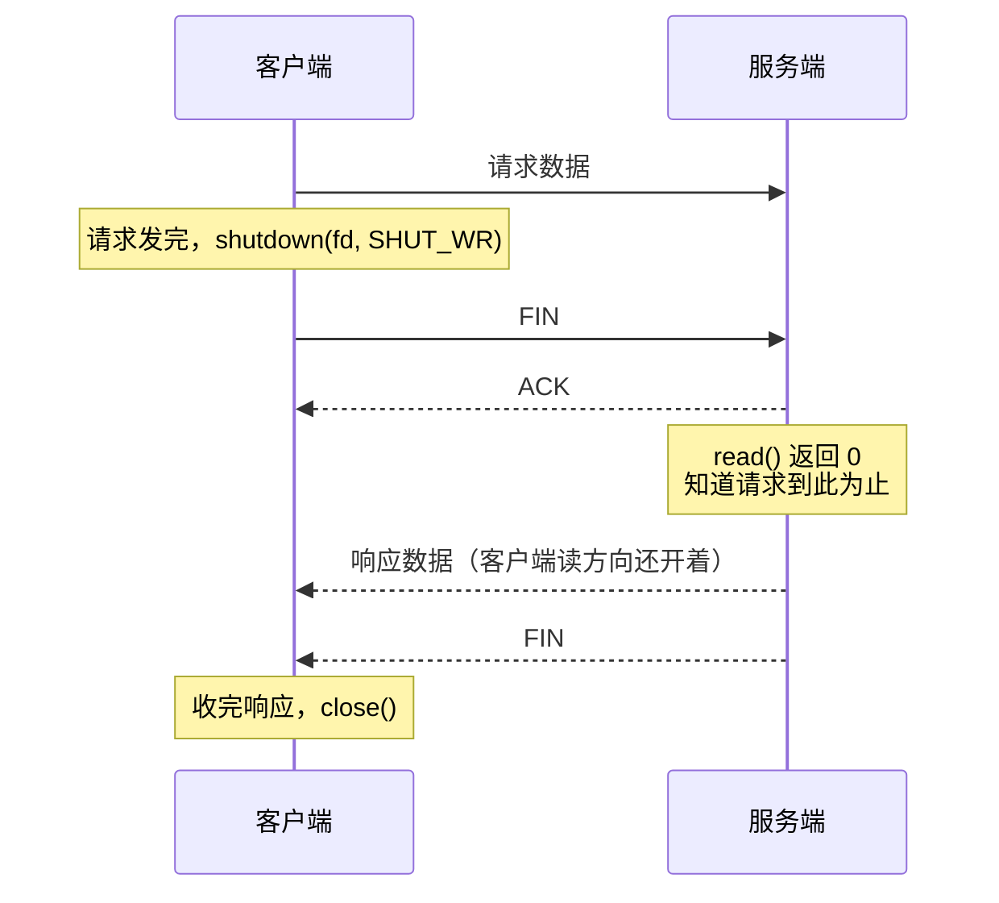

---
tags:
  - Linux
  - TCP-编程
---

# TCP 连接关闭与异常状态

## 简介

TCP 关闭连接不是简单地调用一次 `close()`。面试里常问的 `TIME_WAIT`、`CLOSE_WAIT`、RST、半关闭、`SIGPIPE`，本质都和“谁先关闭、关闭哪个方向、内核还要不要发完缓冲区数据”有关。

这篇笔记补充 [[7.5 TCP协议基础#四次挥手|TCP 四次挥手]] 和 [[10.2 TIME_WAIT状态]] 没有展开的工程细节。

---

## 先看全景：两个状态各落在哪一端

`CLOSE_WAIT` 和 `TIME_WAIT` 常常被一起提起，但它们出现在挥手过程的不同位置、属于不同的一端，排查方向也完全相反：

![[图片/SVG/3_8_8_11_1.svg|900]]

| 状态 | 出现在 | 成因 | 怎么修 |
|:---|:---|:---|:---|
| `CLOSE_WAIT` | 被动关闭方 | 收到 FIN 之后应用没调 `close()` | 改代码 |
| `TIME_WAIT` | 主动关闭方 | 协议要求等 2MSL，Linux 固定 60 秒 | 改设计（让对端先关） |

记住这张图的位置关系，后面几节讲的都是从这条主线上长出来的枝节。

---

## close 和 shutdown 的区别

两个函数看着都能“关连接”，但它们动的根本不是同一个东西：

![[图片/SVG/3_8_8_11_2.svg|900]]

### close()

`close(fd)` 的语义是：**当前进程不再使用这个文件描述符**。它先把这个文件描述的引用计数减一，只有减到 0，内核才会真正去关闭这条 TCP 连接：

- 计数归零时，发送缓冲区还有数据的话通常会尽量发完，再走 FIN 正常关闭
- 计数没归零，什么都不会发生——连接照常，对端毫无感觉
- 它表达不了“只关读”或“只关写”

引用计数这件事在两个地方最容易翻车：

```cpp
// 场景一：fork
int fd = accept(...);
if (fork() == 0) {
    handle(fd);
    close(fd);          // 子进程关了，但父进程那份引用还在
    _exit(0);
}
// 父进程如果忘了这一行，连接就一直不会断
close(fd);

// 场景二：dup / 传给别的对象
int fd2 = dup(fd);      // 现在有两个 fd 指着同一条连接
close(fd);              // 不发 FIN
close(fd2);             // 到这里才发
```

这是 `CLOSE_WAIT` 和 fd 泄漏里最隐蔽的一类成因：代码里明明写了 `close()`，`ss` 上连接就是不消失。

### shutdown()

`shutdown(fd, how)` 直接关闭 socket 的某个通信方向，**不看引用计数**。

```cpp
#include <sys/socket.h>

shutdown(fd, SHUT_RD);    // 关闭读方向
shutdown(fd, SHUT_WR);    // 关闭写方向，立刻发送 FIN
shutdown(fd, SHUT_RDWR);  // 读写都关闭
```

最常用的是 `shutdown(fd, SHUT_WR)`：告诉对端“我不会再发数据了”，但本端仍然可以继续 `read()` 把对端剩下的数据收完。

> [!warning] `shutdown(fd, SHUT_RD)` 基本没有用
> 它不会在线路上产生任何 TCP 报文，对端完全不知道你关了读方向，效果只是本端之后的 `read()` 直接返回 0。之后再到达的数据怎么处理，各平台行为并不一致，POSIX 也没有明确规定。想表达“我不收了”，TCP 层没有这种语义，只能靠应用层协议约定。

另外注意 `shutdown()` 不回收 fd，之后还得再 `close()` 一次，否则照样是 fd 泄漏。

| 对比点 | close | shutdown |
|:---|:---|:---|
| 作用对象 | 文件描述符引用 | TCP 连接的读/写方向 |
| 是否受引用计数影响 | 是，减到 0 才动连接 | 否，立刻生效 |
| 影响范围 | 只是这一个 fd | 同一 socket 上的所有 fd |
| 是否回收 fd | 是 | 否，还要再 close |
| 是否支持半关闭 | 不直接支持 | 支持 |

---

## 半关闭

半关闭指 TCP 的一个方向已经关闭，另一个方向仍然可用：



关键在于客户端只关了写方向，读方向还开着，所以能完整收到服务端的响应。要是这里图省事直接 `close()`，服务端后续发来的响应会撞上一个已经关闭的连接，换来一个 RST。

半关闭适合“请求体结束后还要等待响应”的协议——`shutdown(SHUT_WR)` 本身就成了“请求结束”的信号，这样协议里可以不带长度字段。经典例子是 HTTP/1.0 的连接关闭定界、`nc` 之类的管道工具，以及各种一问一答的简单 RPC。

---

## FIN 和 RST

### FIN：正常关闭

FIN 表示“我这个方向的数据已经发完”。收到 FIN 后，应用层继续 `read()` 会返回 0，表示对端有序关闭写方向。

```cpp
ssize_t n = read(fd, buf, sizeof(buf));
if (n == 0) {
    // 对端发送 FIN，本端读到 EOF
    close(fd);
}
```

### RST：异常复位

RST 表示连接被异常复位。常见原因：

- 向已经关闭的连接继续发送数据
- 对端进程崩溃或强制关闭
- `SO_LINGER` 设置为 0 后关闭 socket
- 防火墙、内核协议栈发现连接状态非法

应用层常见表现：

- `read()` 返回 `-1`，`errno == ECONNRESET`
- `write()` 返回 `-1`，可能出现 `EPIPE`
- 默认情况下，向已关闭连接写数据可能触发 `SIGPIPE`

---

## SIGPIPE 与 MSG_NOSIGNAL

当进程向一个已经被对端关闭的 TCP 连接写数据时，Linux 默认会给进程发送 `SIGPIPE`。这个信号的默认处理动作是终止进程——一个只想写数据的服务，就这么静悄悄地没了。

### 为什么是“写两次才死”

这里有个反直觉的细节：对端已经 `close()` 之后，本端**第一次** `write()` 通常是成功的。

1. 对端 `close()`，发来 FIN，本端回 ACK。此时本端只知道“对方不再发数据了”，不知道对方也不收了
2. 本端 `write()` —— 数据照常发出去，返回值正常
3. 对端收到发给一个已关闭 socket 的数据，回一个 **RST**
4. 本端**第二次** `write()` —— 这次才撞上 RST 之后的连接，触发 `SIGPIPE`，或者返回 `EPIPE`

所以现象是“程序跑着跑着突然没了，日志里最后一条写操作还是成功的”。真正的原因发生在上一次写。

### 两种处理方式

```cpp
#include <signal.h>

signal(SIGPIPE, SIG_IGN);  // 全局忽略，之后 write 会正常返回 -1 / EPIPE
```

或者在单次发送时指定标志位：

```cpp
send(fd, data, len, MSG_NOSIGNAL);   // 只对这一次调用生效
```

服务端程序基本都会在启动时无条件写上 `signal(SIGPIPE, SIG_IGN)`。`MSG_NOSIGNAL` 更适合库代码——库不该替调用方改全局信号处理。

要说清楚的是：这两个都不是在“解决发送失败”，只是避免失败时进程被信号杀掉。发送到底成没成，还是得看 `send()` 的返回值和 `errno`。

---

## CLOSE_WAIT 为什么会很多

`CLOSE_WAIT` 表示：本端已经收到对端 FIN，并且已经回复 ACK，但本端应用还没有调用 `close()`。

换句话说，连接卡在 `CLOSE_WAIT`，通常不是网络问题，而是应用层没有正确关闭 fd。

常见原因：

- `read()` 返回 0 后没有 `close(fd)`
- 业务异常分支忘记释放连接
- 连接对象被引用住，析构没有发生
- 线程阻塞或死锁，无法执行关闭逻辑

排查命令：

```bash
ss -tanp state close-wait
lsof -p <pid>
```

处理思路：

1. 找到对应进程和 fd
2. 检查读循环中 `read/recv == 0` 的分支
3. 检查异常路径是否统一释放连接
4. 检查连接对象生命周期是否被 shared_ptr 或回调持有

---

## SO_LINGER

`SO_LINGER` 控制 `close()` 时内核如何处理未发送完的数据。

```cpp
#include <sys/socket.h>

struct linger opt{};
opt.l_onoff = 1;
opt.l_linger = 0;
setsockopt(fd, SOL_SOCKET, SO_LINGER, &opt, sizeof(opt));
```

常见语义：

| 设置 | close 行为 |
|:---|:---|
| 关闭 linger（默认） | `close()` 立刻返回，内核在后台尽量把缓冲区发完，再走正常 FIN |
| `l_onoff=1, l_linger>0` | `close()` 最多阻塞指定秒数，等数据发完并被对端 ACK；超时就返回 |
| `l_onoff=1, l_linger=0` | 丢弃未发数据，直接发 RST |

三点容易被误解的地方：

- **第二种不等于“确认对方收到了”。** 它等的是数据被对端 TCP 确认，也就是进了对端的接收缓冲区，跟对端应用有没有 `read()` 走完全无关。想确认业务层收到，只能靠应用层的确认消息
- **第二种会让 `close()` 阻塞**，在事件循环里用会卡住整个线程，所以高性能服务基本不用它
- **`l_linger=0` 会破坏正常挥手**：对端读到的是 RST 而不是 FIN，缓冲区里没读完的数据会被丢掉，`read()` 拿到的是 `ECONNRESET` 而不是 0

`SO_LINGER=0` 主要用于两种场合：故意构造异常关闭来测试对端的健壮性，以及服务端主动踢掉恶意连接时跳过 `TIME_WAIT`。正常业务里不要拿它当“快速关闭”用。

---

## 优雅关闭的基本模板

```cpp
void close_connection(int fd) {
    if (fd < 0) return;

    // 如果协议要求先告诉对端“我写完了”，可以先半关闭写方向
    shutdown(fd, SHUT_WR);

    // 真实工程中通常会从事件循环中移除 fd，再 close
    close(fd);
}
```

在 epoll 服务器里，关闭连接前还要先从 epoll 中删除：

```cpp
epoll_ctl(epfd, EPOLL_CTL_DEL, fd, nullptr);
close(fd);
```

---

## 面试问法

| 问题 | 回答要点 |
|:---|:---|
| `read()` 返回 0 表示什么 | 对端正常关闭写方向，本端读到 EOF |
| `CLOSE_WAIT` 很多说明什么 | 应用收到 FIN 后没有及时 `close()` |
| `TIME_WAIT` 多是谁的问题 | 主动关闭方进入，详见 [[10.2 TIME_WAIT状态]] |
| `close` 和 `shutdown` 区别 | 前者释放 fd 引用，后者关闭连接方向 |
| RST 和 FIN 区别 | FIN 是有序关闭，RST 是异常复位 |
| 如何避免 SIGPIPE 杀进程 | 忽略 `SIGPIPE` 或使用 `MSG_NOSIGNAL` |
| 为什么写第一次没事，第二次才崩 | 第一次的数据换回对端一个 RST，第二次才撞上 |
| 代码里 close 了为什么连接还在 | fork / dup 导致引用计数没归零 |

---

## 关键要点

1. **`close()` 减的是 fd 引用计数，`shutdown()` 直接动连接方向**。fork / dup 之后漏掉一次 `close()`，连接就一直不断
2. **半关闭可以只关写方向，同时继续读对端数据**。直接 `close()` 会让对端后续的响应撞上 RST
3. **`read() == 0` 表示对端 FIN，不是普通错误**
4. **大量 `CLOSE_WAIT` 在被动关闭方，是应用没调 `close()`；大量 `TIME_WAIT` 在主动关闭方，是协议要求**
5. **向已关闭连接写数据，第一次往往成功，第二次才触发 `SIGPIPE`**，服务端要在启动时就忽略这个信号
6. **`SO_LINGER=0` 会发 RST 而不是 FIN**，会丢数据、会让对端读到 `ECONNRESET`，不能当作普通的优雅关闭方案

---

## 相关笔记

- [[7.5 TCP协议基础#四次挥手]] - 四次挥手的报文时序与状态转换
- [[10.2 TIME_WAIT状态]] - 主动关闭方进入 TIME_WAIT 的原因与优化
- [[8.12 非阻塞connect与健壮收发]] - 非阻塞收发中的错误处理与优雅关闭时机
- [[13.4 epoll模型]] - epoll 中关闭连接的工程细节

---


