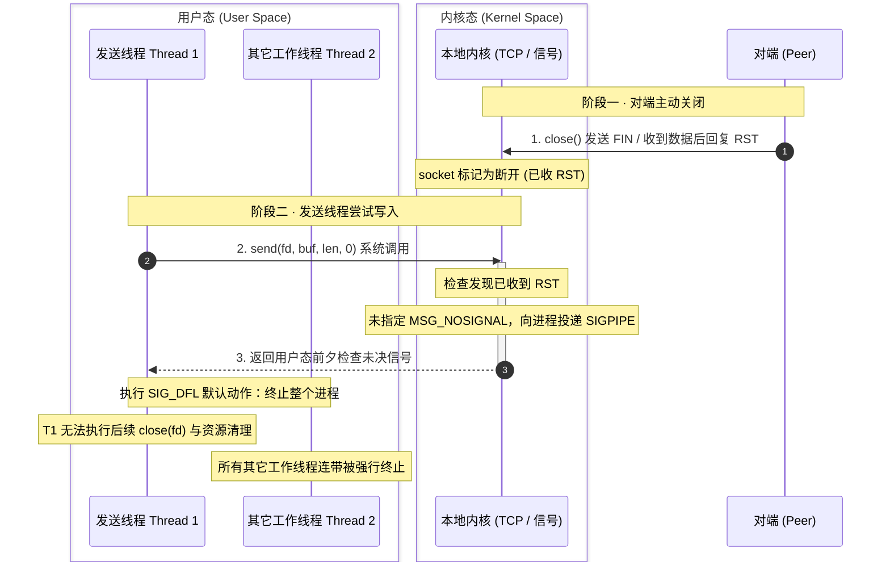
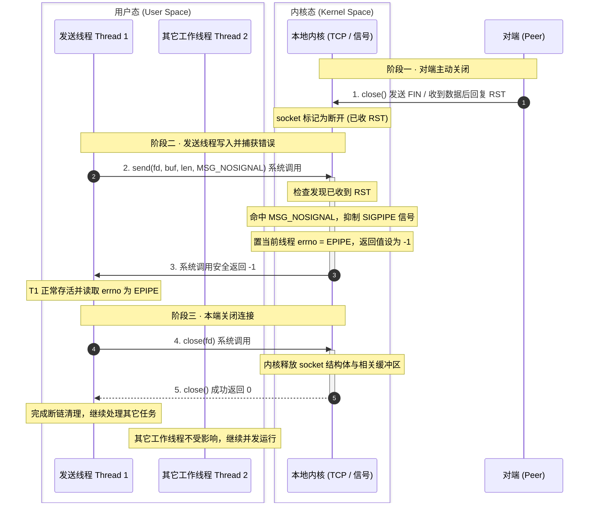
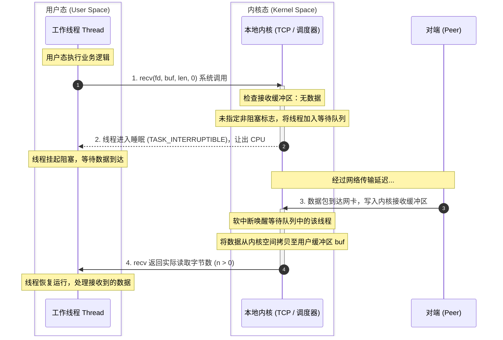
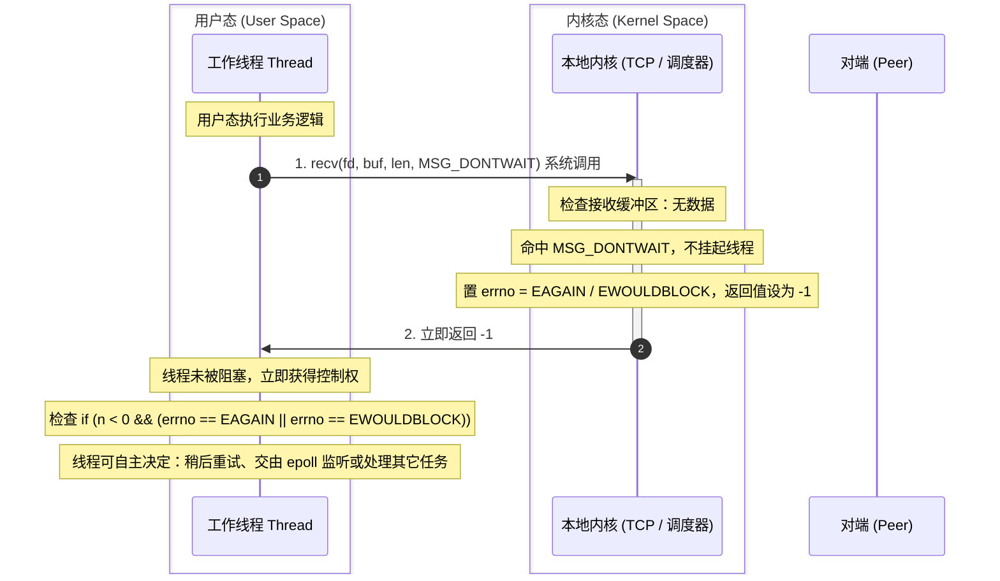

---
tags:
  - Linux
  - TCP-编程
阅读次数: 0
---

# 8.3 TCP 客户端

## 1. 概述

TCP 客户端是网络通信中的"主动方"，它主动向服务器发起连接请求。客户端的编程流程比服务端简单，主要步骤包括：
1. 创建套接字
2. 连接到服务器（触发 [[7.6 TCP协议基础#4. 三次握手|三次握手]]）
3. 与服务器进行数据交换
4. 关闭连接

---

## 2. 客户端与服务端流程对比

![[图片/SVG/3_8_8_3_1.svg|1062]]

两列按时间对齐来读：服务端先起来，一路走到 `accept()` 停住等；客户端起来之后只做一件事——`connect()`。

**关键区别**只有三处：
- 服务端需要 `bind()` 绑定地址，客户端通常不需要（内核自动分配，但这不等于没有端口，见下文）
- 服务端需要 `listen()` 把套接字从主动转成被动
- 服务端使用 `accept()` 接受连接，客户端使用 `connect()` 发起连接

从 `read`/`write` 那一行往下，两边的代码几乎可以互换——这时候双方手里都是一个普通的已连接套接字，TCP 本身是全双工且对称的。

图中那条琥珀色横线还纠正了一个常见误解：**三次握手不是 `accept()` 做的**。`listen()` 之后内核就已经在替你握手了，握完的连接排进[[7.8 listen和accept函数#2. 两个队列|全连接队列]]；`accept()` 只是从队列里取一条出来配个 fd。所以队列里有货时 `accept` 立刻返回，队列空了才阻塞。

---

## 3. 客户端编程流程

把上图右边那一列单独拎出来，就是客户端的全部：

| 步骤 | 函数 | 说明 |
|:---:|:---|:---|
| 1 | [[7.7 套接字1#2. socket 函数\|socket()]] | 创建套接字 |
| 2 | connect() | 连接到服务器 |
| 3 | write()/read() | 数据收发 |
| 4 | close() | 关闭连接 |

---

## 4. connect 函数

`connect()` 函数用于客户端主动向服务器发起连接，它会触发 TCP 的三次握手过程。

### 4.1 函数原型

```c
#include <sys/socket.h>

int connect(int sockfd, const struct sockaddr *addr, socklen_t addrlen);
```

### 4.2 参数说明

| 参数 | 说明 |
|:---|:---|
| `sockfd` | 由 [[7.7 套接字1#2. socket 函数\|socket()]] 创建的套接字描述符 |
| `addr` | 指向服务器地址结构体的指针，包含服务器的 [[7.2 IP地址与CIDR\|IP地址]] 和 [[7.3 端口与五元组\|端口号]] |
| `addrlen` | 地址结构体的大小 |

### 4.3 返回值

- **成功**：返回 0，表示连接建立成功
- **失败**：返回 -1，并设置 `errno`

### 4.4 connect 的阻塞行为

默认情况下，`connect()` 是**阻塞**的：

1. 发送 SYN 报文给服务器
2. 等待服务器返回 SYN+ACK
3. 发送 ACK 完成三次握手
4. 握手成功后返回

如果服务器不可达或拒绝连接，`connect()` 会阻塞一段时间后返回错误。

### 4.5 常见错误

| errno | 说明 |
|:---|:---|
| `ECONNREFUSED` | 连接被拒绝（服务器未监听该端口） |
| `ETIMEDOUT` | 连接超时（服务器无响应） |
| `ENETUNREACH` | 网络不可达 |
| `EADDRINUSE` | 地址已被使用 |

前两个值得单独看，因为它们对应的等待时间差了四个数量级：

![[图片/SVG/3_8_8_3_2.svg|1062]]

- **ECONNREFUSED**：目标主机在，但那个端口上没有进程 `listen`。对端内核直接回一个 RST，`connect` 毫秒级就返回。开发时最常见的「服务没启动」就是这一种
- **ETIMEDOUT**：SYN 发出去石沉大海——被防火墙 DROP 了，或者主机根本不在。内核不会立刻放弃，而是按 1、2、4、8、16、32 秒的间隔重传 SYN，`net.ipv4.tcp_syn_retries` 默认 6 次，最后再等 64 秒，**加起来约 127 秒**才返回

第二种是阻塞式 `connect` 最难受的地方：这两分钟里线程什么也做不了，而且这个超时**不受 `SO_SNDTIMEO` 控制**。要缩短它，要么调内核参数，要么用非阻塞 connect 配 `select`/`poll` 自己计时，见 [[8.12 非阻塞connect与健壮收发]]。

### 4.6 connect 失败之后，这个 fd 不能再用

```c
// 错的：抓着同一个 fd 重试
if (connect(fd, (struct sockaddr*)&addr, sizeof(addr)) < 0) {
    sleep(1);
    connect(fd, (struct sockaddr*)&addr, sizeof(addr));   // 多半直接失败
}

// 对的：失败就关掉重建
while (retry--) {
    int fd = socket(AF_INET, SOCK_STREAM, 0);
    if (connect(fd, (struct sockaddr*)&addr, sizeof(addr)) == 0)
        break;                    // 连上了
    close(fd);                    // 失败就丢掉，下一轮重新 socket()
    sleep(1);
}
```

POSIX 规定 `connect` 失败后套接字的状态是未指定的。TCP 套接字在内核里带着一个状态机，一次失败的 connect 会把它推进一个无法重新发起连接的状态，只能销毁重建。

### 4.7 客户端不用 bind，但一样占端口

「客户端无需 bind」这句话只说了一半。`connect()` 的时候内核会从**临时端口范围**里挑一个空闲的分给它：

```bash
$ cat /proc/sys/net/ipv4/ip_local_port_range
32768   60999
```

默认约 28000 个。朝**同一个目标 IP:Port** 发起的并发连接数就被这个宽度卡住，用尽后 `connect` 返回 `EADDRNOTAVAIL`；再叠加大量 TIME_WAIT 占着端口不放就更早撞线（见 [[10.2 TIME_WAIT状态]]）。压测机连不上更多连接时先查这个数，别急着怀疑服务端——算法见 [[7.3 端口与五元组#3.1 「端口只有 65535 个」到底限制了谁|7.3]]。

需要指定源端口或源 IP 时（多网卡机器上常见），客户端也可以主动 `bind()`，只要在 `connect()` 之前调用。

---

## 5. 完整客户端代码示例

```c
#include <stdio.h>
#include <stdlib.h>
#include <string.h>
#include <unistd.h>
#include <sys/socket.h>
#include <netinet/in.h>
#include <arpa/inet.h>

#define BUFFER_SIZE 1024

int main() {
    int client;
    struct sockaddr_in server_addr;
    char buffer[BUFFER_SIZE];

    // ========== 1. 创建套接字 ==========
    client = socket(AF_INET, SOCK_STREAM, 0);
    if (client < 0) {
        perror("create socket failed");
        exit(1);
    }

    // ========== 2. 设置服务器地址 ==========
    memset(&server_addr, 0, sizeof(server_addr));
    server_addr.sin_family = AF_INET;
    server_addr.sin_port = htons(8080);                    // 服务器端口
    server_addr.sin_addr.s_addr = inet_addr("127.0.0.1");  // 服务器 IP

    // ========== 3. 连接服务器 ==========
    printf("正在连接服务器 %s:%d...\n", "127.0.0.1", 8080);

    if (connect(client, (struct sockaddr*)&server_addr, sizeof(server_addr)) < 0) {
        perror("connect failed");
        exit(1);
    }

    printf("连接成功！\n");

    // ========== 4. 接收数据 ==========
    ssize_t len = read(client, buffer, BUFFER_SIZE - 1);
    if (len < 0) {
        perror("read failed");
    } else if (len == 0) {
        printf("服务器关闭了连接\n");
    } else {
        buffer[len] = '\0';
        printf("收到服务器消息: %s", buffer);
    }

    // ========== 5. 关闭连接 ==========
    close(client);

    return 0;
}
```

示例里 `read()` 只调了一次，够用是因为服务端只发了一行短消息。TCP 是**字节流**：一次 `read` 返回的字节数可能少于对端一次 `write` 发出的量，也可能一次就带回对端好几次 `write` 的内容。按「消息」处理数据时必须自己划边界，见 [[8.9 TCP的粘包和拆包]]。

`read` 返回 0 的含义也值得记住：它表示对端发来了 FIN，即**对方关闭了发送方向**，不是出错。这时候本端仍然可以继续 `write`（半关闭），只是通常也该收尾了。

---

## 6. send 和 recv 函数

`send()` 与 `recv()` 是专门用于套接字的 I/O 系统调用。当 `flags` 设为 0 时，两者的行为分别与通用的 `write()` 和 `read()` 完全一致。换用这两个接口的核心目的，就是通过 `flags` 实现底层收发行为的精细控制。

### 6.1 send 函数

```c
#include <sys/socket.h>

ssize_t send(int sockfd, const void *buf, size_t len, int flags);
```

| 参数 | 说明 |
|:---|:---|
| `sockfd` | 套接字描述符 |
| `buf` | 待发送数据的缓冲区 |
| `len` | 发送字节数 |
| `flags` | 发送控制标志，设为 0 时等同于 `write()` |

常用 `flags`：
- `0`：默认阻塞写入，等同于 `write()`
- `MSG_DONTWAIT`：仅对本次调用开启非阻塞
- `MSG_NOSIGNAL`：向断开的连接写入时不向进程投递 `SIGPIPE` 信号

### 6.2 recv 函数

```c
#include <sys/socket.h>

ssize_t recv(int sockfd, void *buf, size_t len, int flags);
```

| 参数 | 说明 |
|:---|:---|
| `sockfd` | 套接字描述符 |
| `buf` | 存放接收数据的缓冲区 |
| `len` | 缓冲区最大容量 |
| `flags` | 接收控制标志，设为 0 时等同于 `read()` |

常用 `flags`：
- `0`：默认阻塞读取，等同于 `read()`
- `MSG_PEEK`：窥视数据，读取后不将其移出内核接收队列
- `MSG_WAITALL`：要求读满 `len` 字节再返回（遇到信号中断或对端断开仍会提前返回）
- `MSG_DONTWAIT`：仅对本次调用开启非阻塞

### 6.3 避免 SIGPIPE 导致进程崩溃：MSG_NOSIGNAL

当对端关闭连接后，若本端继续写入数据，首次写入通常能写入本地发送缓冲区，随后收到对端回复的 RST；若此时再次调用写入函数，内核会向当前进程投递 `SIGPIPE` 信号。该信号的默认动作是直接终止进程，且不会留下任何应用层错误日志。

生产环境中服务端进程如果未留痕迹地异常退出，多半是因为未处理 `SIGPIPE`。

#### 默认行为（未设置 MSG_NOSIGNAL）

对端关闭后，发送线程继续写入导致内核产生 `SIGPIPE`。从内核态返回用户态前夕执行默认终止动作，整个进程直接退出。当前线程来不及执行 `close(fd)`，其它工作线程也会一并被杀：



#### 传入 MSG_NOSIGNAL

设置 `MSG_NOSIGNAL` 后，内核会抑制 `SIGPIPE` 信号，系统调用直接返回 `-1` 并将 `errno` 置为 `EPIPE`。发送线程可以捕获错误并关闭连接，其它线程不受任何影响：



#### 三种防御方式

```c
// 1. 调用级别：仅本次生效，开销小（推荐在 Linux 下使用）
send(fd, buf, len, MSG_NOSIGNAL);

// 2. 套接字级别：修改套接字属性（macOS / BSD 无 MSG_NOSIGNAL 时使用）
int on = 1;
setsockopt(fd, SOL_SOCKET, SO_NOSIGPIPE, &on, sizeof(on));

// 3. 进程级别：忽略该信号，所有套接字和 write() 通用（服务初始化标配）
signal(SIGPIPE, SIG_IGN);
```

屏蔽信号后，向已断开的连接写入会统一转为 `send` 返回 `-1`、`errno` 为 `EPIPE`，交给常规错误分支处理。因为 `write()` 没有 `flags` 参数，使用 `write()` 时必须依靠方式 2 或方式 3 防御。

### 6.4 单次非阻塞：MSG_DONTWAIT

默认情况下，当接收缓冲区为空时调用 `recv()` 会让线程挂起等待数据；发送缓冲区打满时调用 `send()` 同样会挂起线程。

传入 `MSG_DONTWAIT` 可以在不改变套接字本身阻塞属性的前提下，强制本次调用以非阻塞方式运行。若缓冲区未就绪，内核直接返回 `-1` 并将 `errno` 置为 `EAGAIN`（或 `EWOULDBLOCK`），线程不会让出 CPU。

#### 1. 默认阻塞调用（flags = 0）

内核发现无数据可读时，将线程挂入 socket 的等待队列并让出 CPU，直到网络数据到达或超时才唤醒：



#### 2. 传入 MSG_DONTWAIT（单次非阻塞）

内核发现缓冲区为空后，检测到 `MSG_DONTWAIT` 标志，立即返回错误码，线程无需等待：



#### 与 fcntl(O_NONBLOCK) 的区别

- `fcntl(fd, F_SETFL, flags | O_NONBLOCK)`：**描述符级别**。修改套接字的文件状态标志，此后该 fd 上所有的 `read`、`write`、`recv`、`send` 全部变为非阻塞。
- `MSG_DONTWAIT`：**单次调用级别**。仅对当前单次系统调用生效，套接字本身的阻塞属性不受影响，适合在阻塞套接字上做临时探测。

### 6.5 send/recv 与 write/read 的区别

| 维度 | `write()` / `read()` | `send()` / `recv()` |
|:---|:---|:---|
| 适用对象 | 任意文件描述符（文件、管道、套接字、字符设备等） | 仅限套接字描述符 |
| 控制参数 | 无 `flags` 控制标志 | 支持 `flags` 参数（如 `MSG_NOSIGNAL`、`MSG_DONTWAIT`、`MSG_PEEK` 等） |

当 `flags = 0` 时，`send`/`recv` 与 `write`/`read` 在底层行为一致。之所以换用 `send` 和 `recv`，核心就是为了使用特定的 `flags`：
- `MSG_NOSIGNAL`：写入断开连接时不触发 `SIGPIPE` 终止进程
- `MSG_DONTWAIT`：在阻塞套接字上临时执行单次非阻塞探测
- `MSG_PEEK`：读取缓冲区数据但不将其移出队列，多用于预检数据包协议头

---

## 7. 阻塞与非阻塞

### 7.1 阻塞模式（默认）

在阻塞模式下，I/O 操作会挂起进程直到完成：

- `connect()`：等待三次握手完成
- `read()`/`recv()`：等待数据到达
- `write()`/`send()`：等待发送缓冲区有空间

```c
// 阻塞模式下，read 会等待直到有数据可读
ssize_t n = read(sockfd, buffer, sizeof(buffer));
// 程序在这里暂停，直到：
// 1. 有数据到达
// 2. 连接关闭（返回 0）
// 3. 发生错误（返回 -1）
```

### 7.2 非阻塞模式

设置非阻塞模式后，I/O 操作会立即返回：

```c
#include <fcntl.h>

// 设置为非阻塞
int flags = fcntl(sockfd, F_GETFL, 0);
fcntl(sockfd, F_SETFL, flags | O_NONBLOCK);

// 非阻塞 read，如果没有数据立即返回 -1
ssize_t n = read(sockfd, buffer, sizeof(buffer));
if (n < 0 && (errno == EAGAIN || errno == EWOULDBLOCK)) {
    // 没有数据可读，稍后重试
}
```

---

## 8. 常见的关键知识点

### 8.1 Socket API 概述

- `socket()`：创建 [[7.7 套接字1|套接字]]，用于建立网络通信的端点
- `bind()`：绑定 [[7.2 IP地址与CIDR|IP地址]] 和 [[7.3 端口与五元组|端口]]，服务端必须调用
- `listen()`：将套接字转为 [[7.8 listen和accept函数#3. listen 函数|监听]] 状态
- `accept()`：[[7.8 listen和accept函数#4. accept 函数|接受]] 客户端连接
- `connect()`：客户端连接服务器

### 8.2 TCP/IP 协议栈

- **TCP**：传输层协议，提供可靠的字节流传输
- **UDP**：传输层协议，提供不可靠的数据报传输
- 详见 [[7.6 TCP协议基础]]

### 8.3 字节序转换

网络通信统一使用大端字节序（网络字节序）：

```c
htons()  // 主机 → 网络（16位）
htonl()  // 主机 → 网络（32位）
ntohs()  // 网络 → 主机（16位）
ntohl()  // 网络 → 主机（32位）
```

### 8.4 地址转换

```c
// 老接口，新代码不要再用
inet_addr("192.168.1.1")   // 失败返回 INADDR_NONE，与 255.255.255.255 无法区分
inet_ntoa(addr.sin_addr)   // 用静态缓冲，不可重入

// 推荐：IPv4 / IPv6 通吃，错误可区分
char ip[INET_ADDRSTRLEN];
inet_pton(AF_INET, "192.168.1.1", &addr.sin_addr);   // 返回 1 才是成功
inet_ntop(AF_INET, &addr.sin_addr, ip, sizeof(ip));
```

本节完整示例里用的还是 `inet_addr()`，实际写代码时按上面第二组来。

---

## 9. 关键要点

1. **客户端流程**：socket → connect → read/write → close；与服务端的差别只有「不 bind、不 listen、用 connect 代替 accept」三处
2. **握手不是 accept 做的**：`listen()` 之后内核就自己握手了，`accept()` 只是从[[7.8 listen和accept函数#2. 两个队列|全连接队列]]取一条
3. **connect 的三种结局**：成功约 1 个 RTT；`ECONNREFUSED` 是收到 RST，毫秒级返回；`ETIMEDOUT` 要等 SYN 重传打满，约 127 秒，且不受 `SO_SNDTIMEO` 控制
4. **connect 失败后 fd 必须重建**，不能拿同一个 fd 再 connect
5. **客户端无需 bind，但一样占端口**：内核从 `ip_local_port_range` 里分配，用尽会 `EADDRNOTAVAIL`
6. **写已关闭的连接会收到 `SIGPIPE`，默认动作是杀进程**；用 `MSG_NOSIGNAL` / `SO_NOSIGPIPE` / `SIG_IGN` 任选一种堵住
7. **一次 read 读不全是常态**，`read` 返回 0 表示收到 FIN；按消息处理要自己划边界
8. **阻塞 I/O**：默认情况下，connect、read、write 都是阻塞的

---

## 10. 相关笔记

- [[7.8 listen和accept函数#2. 两个队列]] - 半连接队列与全连接队列工作机制
- [[3.Linux/8. TCP 编程/8.1 TCP原理]] - TCP 通信原理概述
- [[8.2 TCP服务端]] - 服务端编程
- [[7.6 TCP协议基础]] - 三次握手、四次挥手详解
- [[7.7 套接字1]] - Socket 函数详解

---

