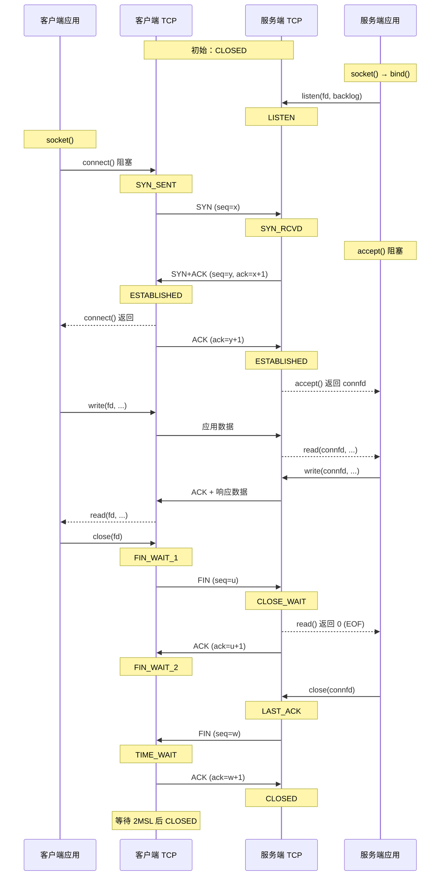

---
tags:
  - Linux
  - TCP-编程
阅读次数: 0
---

# 8.4 迭代服务器

## 1. 概述

迭代服务器（Iterative Server）一次仅服务一个客户端：通过 `accept()` 获取一条连接后，完整处理并关闭该连接，随后才回到主循环 `accept()` 下一条。

这种模型在生产环境中极少直接使用，但它是理解并发模型的基准对照：它直观展示了单点阻塞对系统整体可用性的影响。



![[图片/SVG/3_8_8_4_1.svg|1340]]

在图 1 的排队示意中，客户端 B 和 C 的 `connect()` 此时已经成功返回。TCP 三次握手由内核协议栈异步完成，与用户态进程是否调用 `accept()` 无关：握手未完成的连接暂存于[[7.8 listen和accept函数#2. 两个队列|半连接队列]]，握手完成即移入[[7.8 listen和accept函数#2. 两个队列|全连接队列]]。排队的客户端并没有卡在连接握手阶段，而是在全连接队列中等待被取出。

### 1.1 特点

| 特点 | 说明 |
|:---|:---|
| **串行处理** | 单线程单连接服务，其余就绪连接在内核[[7.8 listen和accept函数#2. 两个队列|全连接队列]]中排队 |
| **实现简单** | 无并发状态，不涉及多进程多线程同步、数据竞态或僵尸进程回收 |
| **等待时延线性累加** | 第 N 个客户端的等待耗时等于前 N−1 个客户端处理时长的总和 |
| **单点阻塞风险** | 任一连接因慢客户端、大文件传输或逻辑阻塞卡住，整个服务即停止响应 |

`listen(fd, 5)` 中的 backlog 仅控制[[7.8 listen和accept函数#2. 两个队列|全连接队列]]的长度上限，并不影响服务端的处理速率。要降低请求排队等待时间，必须引入并发模型，调整 backlog 无法改善吞吐。

---

## 2. 服务端代码

```c
#include <stdio.h>
#include <string.h>
#include <errno.h>
#include <unistd.h>
#include <sys/socket.h>
#include <netinet/in.h>
#include <arpa/inet.h>

void init_listen(void) {
    // 1. 创建监听套接字。该 fd 专用于接收新连接，不用于收发业务数据
    int listenfd = socket(AF_INET, SOCK_STREAM, 0);
    if (listenfd == -1) {
        perror("socket");
        return;
    }

    // 2. 初始化服务器地址。结构体内的 sin_zero 填充字段必须清零，避免将栈随机值传入内核
    struct sockaddr_in serveraddr;
    memset(&serveraddr, 0, sizeof(serveraddr));
    serveraddr.sin_family = AF_INET;
    serveraddr.sin_port = htons(9527);              // 端口转换为网络字节序
    serveraddr.sin_addr.s_addr = inet_addr("127.0.0.1");

    // 3. 绑定地址。绑定 127.0.0.1 仅允许本机回环访问，外部网卡流量无法进入
    if (bind(listenfd, (struct sockaddr *)&serveraddr, sizeof(serveraddr)) == -1) {
        perror("bind");
        close(listenfd);
        return;
    }

    // 4. 将套接字转为被动监听状态，内核开始维护连接队列并异步处理握手
    if (listen(listenfd, 5) == -1) {
        perror("listen");
        close(listenfd);
        return;
    }
    printf("server is listening on 127.0.0.1:9527...\n");

    // 5. 迭代主循环：获取连接 -> 串行处理 -> 关闭连接 -> 获取下一条
    char buffer[256];
    while (1) {
        struct sockaddr_in clientaddr;
        socklen_t clientlen = sizeof(clientaddr);

        // accept 在此阻塞睡眠，直到全连接队列中有已就绪的连接
        int connfd = accept(listenfd, (struct sockaddr *)&clientaddr, &clientlen);
        if (connfd == -1) {
            if (errno == EINTR) continue;   // 被信号中断属于正常唤醒，重新调用
            perror("accept");
            continue;
        }

        printf("client connected: %s:%d\n",
               inet_ntoa(clientaddr.sin_addr),
               ntohs(clientaddr.sin_port));

        // 6. 业务数据读写通过已连接套接字 connfd 完成
        memset(buffer, 0, sizeof(buffer));
        ssize_t len = recv(connfd, buffer, sizeof(buffer) - 1, 0);
        if (len > 0) {
            printf("recv %zd bytes: %s\n", len, buffer);
            send(connfd, buffer, len, 0);
        }

        // 7. 关闭当前连接的 connfd；若误关 listenfd 会导致监听终止
        close(connfd);
        printf("client disconnected\n");
    }

    close(listenfd);
}

int main(void) {
    init_listen();
    return 0;
}
```

> [!warning] 关键实现细节
> - **套接字变量命名**：明确区分监听描述符（`listenfd`）与已连接描述符（`connfd`），避免将监听套接字误命名为 `client`（详见 [[8.2 TCP服务端]]）。
> - **接收缓冲区留位**：`recv()` 的长度参数传入 `sizeof(buffer) - 1`。若后续使用 `printf("%s")` 将缓冲区当做 C 字符串输出，必须预留一位放 `\0`，防止越界读内存。

---

## 3. 客户端代码

```c
void send_msg(int sockfd) {
    struct sockaddr_in serveraddr;
    memset(&serveraddr, 0, sizeof(serveraddr));
    serveraddr.sin_family = AF_INET;
    serveraddr.sin_port = htons(9527);
    serveraddr.sin_addr.s_addr = inet_addr("127.0.0.1");

    // 客户端无需显式 bind：connect() 时内核会从临时端口范围分配源端口
    if (connect(sockfd, (struct sockaddr *)&serveraddr, sizeof(serveraddr)) == -1) {
        perror("connect");
        return;
    }

    const char *msg = "hello, this is client";
    send(sockfd, msg, strlen(msg), 0);   // 发送字节数为 strlen(msg)，不包含末尾 '\0'

    char buffer[256];
    memset(buffer, 0, sizeof(buffer));
    ssize_t len = recv(sockfd, buffer, sizeof(buffer) - 1, 0);
    if (len > 0) {
        printf("server reply: %s\n", buffer);
    }
}

int send_client(void) {
    int sockfd = socket(AF_INET, SOCK_STREAM, 0);
    if (sockfd == -1) {
        perror("socket");
        return -1;
    }

    send_msg(sockfd);
    close(sockfd);
    return 0;
}
```

上述客户端代码假定了单次 `recv()` 即可读到完整的响应数据。在短消息（如本例 21 字节）场景下该假设容易碰巧满足，但 TCP 是流式协议，面对较大数据或网络分片时必须由应用层界定消息边界并循环读取，详见 [[8.5 回声服务器]]。

---

## 4. 一次完整会话

![[图片/SVG/3_8_8_4_2.svg|1340]]

### 4.1 服务端流程

服务端遵循标准的 [[7.8 listen和accept函数|TCP 服务器编程流程]]：

1. **[[7.7 套接字1#2. socket 函数|socket()]]**：创建 TCP [[7.7 套接字1|套接字]]
2. **[[7.7 套接字1#4. bind 函数|bind()]]**：绑定服务器地址与端口（IP + [[7.3 端口与五元组|端口]]）
3. **[[7.8 listen和accept函数#3. listen 函数|listen()]]**：转换为被动套接字并设置队列容量
4. 迭代循环：
   - **[[7.8 listen和accept函数#4. accept 函数|accept()]]**：从[[7.8 listen和accept函数#2. 两个队列|全连接队列]]取出一条已完成 [[7.6 TCP协议基础#4. 三次握手|三次握手]] 的连接描述符
   - **recv()** / **send()**：通过 `connfd` 收发数据
   - **close(connfd)**：触发 [[7.6 TCP协议基础#5. 四次挥手|四次挥手]] 断开连接，随后进入下一轮迭代

### 4.2 客户端流程

客户端生命周期为：`socket()` → `connect()` → `send()` → `recv()` → `close()`。客户端无需调用 `bind()`，内核在 `connect()` 阶段自动从本地可用临时端口池分配源端口。

### 4.3 阻塞调用与返回值语义

`accept()` 和 `recv()` 在无数据就绪时会让进程进入睡眠态，让出 CPU。图 2 下半部分列出了四个调用阻塞点的返回值语义：

- `accept()` 返回 `-1` 且 `errno == EINTR`：被系统信号中断，属于可恢复事件，直接重新调用。
- `recv()` 返回 0：收到对端发送的 FIN 报文，代表对端关闭了写入方向（非读到空数据）。
- `send()` 返回值小于请求长度 `len`：内核发送缓冲区空间不足，仅写入部分数据，未发完的字节需要循环续发。
- `connect()` 阻塞超时：目标端无响应时内核按指数退避重传 SYN，最终超时返回 `ETIMEDOUT`（详见 [[8.3 TCP客户端]]）。

---

## 5. buffer 的传递机制

![[图片/SVG/3_8_8_4_3.svg|1340]]

`send()` 的本质是内存数据复制：它将用户态缓冲区中的数据拷贝至内核 TCP 发送缓冲区后即刻返回。数据包何时封装上网卡，由 TCP 状态机、MSS 大小、拥塞窗口与滑动窗口协商决定。

同理，`recv()` 负责将内核接收缓冲区中**当前已就绪的数据**拷入用户态内存，不会主动等待凑满用户指定的接收长度。

由此衍生三条编程规则：

- `send()` 成功仅代表数据已写入本机内核缓冲区，不代表对端已接收或对端应用已读取。端到端送达确认必须依赖应用层协议设计。
- 必须基于 `recv()` 的实际返回值确定本次读入的字节数，严禁假定返回的数据长度。
- 调用 `close()` 关闭套接字时，发送缓冲区中未发出的数据内核会尝试发送完毕，而接收缓冲区中若仍有未读取的数据，会被直接丢弃并可能向对端发送 RST 报文。

关于缓冲区参数配置、套接字选项及流量控制机制，见 [[8.7 IO缓冲]]。

---

## 6. 从迭代到并发

迭代服务器的吞吐量上限完全受限于单个请求的处理耗时。例如单请求处理耗时 2 秒时，系统吞吐上限被限制在 0.5 QPS。要支撑高并发访问，必须改用并发架构：

| 模型 | 实现机制 | 代价与约束 |
|:---|:---|:---|
| **多进程（fork）** | 为每条新连接 fork 一个独立子进程处理 | 进程创建销毁开销大，主进程需处理并回收 [[11.5 僵尸进程\|僵尸进程]] |
| **线程池** | 连接就绪后由线程池分配工作线程处理 | 需处理多线程共享数据的同步与竞态，线程容量有上限 |
| **I/O 多路复用** | 单线程通过 [[13.1 IO复用简介\|select/poll/epoll]] 统一监听多个描述符 | 业务逻辑需拆解为基于事件驱动的非阻塞处理回调 |

三种模型的共同目标，是避免单个连接在阻塞或耗时操作时拖死其他就绪连接的处理。利用 [[11.2 进程创建与程序替换#2. fork() - 创建子进程|fork()]] 改写为并发服务端的具体实现见 [[8.5 回声服务器#5. 回声服务器的变体|8.5]]。

---

## 7. 关键要点

1. **串行处理特性**：迭代服务器严格遵循“单连接完整处理完再接收下一条”，后序客户端的排队等待时间是前面所有请求处理耗时的累加。
2. **连接建立与业务处理解耦**：TCP 三次握手由内核异步处理（历经[[7.8 listen和accept函数#2. 两个队列|半连接队列]]并最终移入[[7.8 listen和accept函数#2. 两个队列|全连接队列]]），`accept()` 仅负责取出连接。客户端 `connect()` 成功并不代表服务端已开始执行其请求逻辑。
3. **backlog 参数的作用边界**：`listen()` 的 backlog 只约束内核[[7.8 listen和accept函数#2. 两个队列|全连接队列]]的容量上限，无法改善单线程串行处理的吞吐瓶颈。
4. **严格区分两类描述符**：`listenfd` 仅用于监听连接，`connfd` 专用于单次连接的业务数据交互；主循环每次关闭的是 `connfd`。
5. **系统调用为内存拷贝语义**：`send()` 与 `recv()` 仅在用户内存与内核缓冲区之间搬运数据，网络收发节奏由协议栈掌控；必须显式依赖返回值确认实际读取/写入的字节数。

---

## 8. 相关笔记

- [[7.8 listen和accept函数#2. 两个队列]] - 半连接队列（SYN queue）与全连接队列（accept queue）的工作机制
- [[8.2 TCP服务端]] - 监听套接字与已连接套接字的分工
- [[8.5 回声服务器]] - 迭代模型 + 循环读取，解决单次 `recv` 读不全的问题
- [[8.7 IO缓冲]] - 内核收发缓冲区的作用与配置
- [[8.13 TCP内核队列与参数调优]] - 半连接/全连接队列、`somaxconn` 与队列溢出排查
