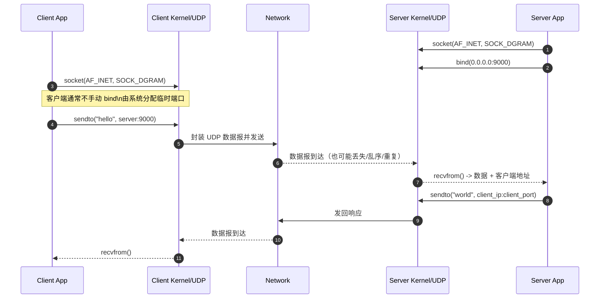
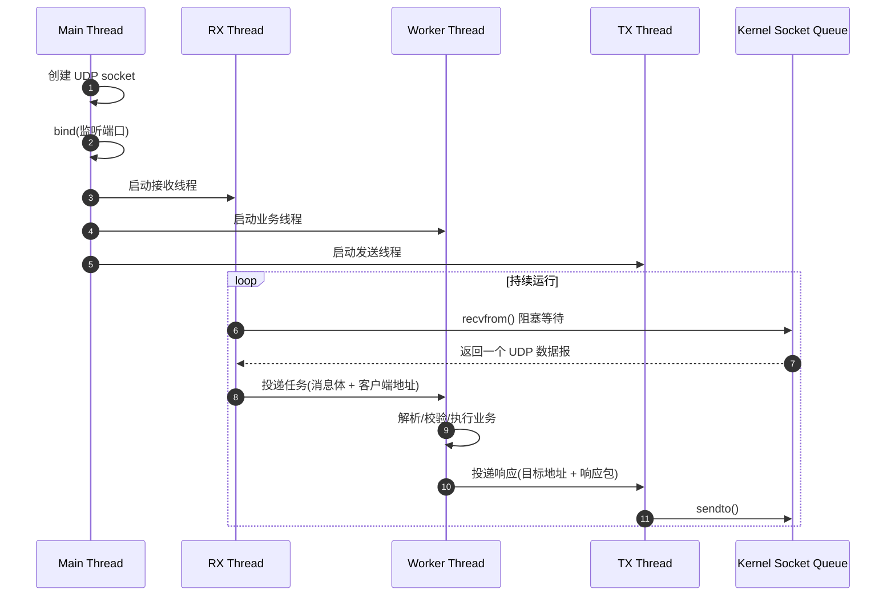

---
tags:
  - 平台/linux
  - 网络编程
  - 网络编程/UDP
阅读次数: 0
---

# UDP 原理

## 简介

UDP，全称 **User Datagram Protocol**，中文是**用户数据报协议**。它和 [[7.5 TCP协议基础|TCP]] 一样，都是互联网 [[7.4 协议|协议]] 栈里的传输层协议，但设计思路完全不同。

UDP 的核心风格可以概括成一句话：

**快、轻量、面向报文，但不保证可靠。**

它不会像 TCP 那样先做 [[7.5 TCP协议基础#TCP 三次握手（建立连接）|三次握手]]，而是直接把一个个数据报发出去。也正因为这样，UDP 非常适合实时性高、允许少量丢包的场景。

![[ec04b363-0c7d-445e-8021-10627573d6fe.png]]

---

## 基本原理

UDP 的工作方式可以类比成**寄信**：

| 步骤 | 说明 |
|:---:|:---|
| **打包** | 你把一段应用数据装进一个数据报里，并写上目标 [[7.2 IP地址]] 和 [[7.3 端口]] |
| **发送** | 操作系统把这个数据报交给 IP 层，再发到网络里 |
| **投递** | 目标主机收到后，内核根据目标端口，把数据报交给对应的 socket |
| **结束** | 协议层不保证一定送达，也不保证顺序，更不保证对方一定回复 |

这也是为什么说 UDP 是**无连接、面向报文**的协议：

- **无连接**：协议层没有握手、没有连接状态机，知道对方地址就能直接发。
- **面向报文**：一次 `sendto()` 对应一个独立数据报，一次 `recvfrom()` 通常接收一个完整数据报。
- **靠地址通信**：UDP 能通信，依赖的是 **IP 地址 + 端口号 + socket** 的配合，而不是先建立一条像 TCP 那样有状态的连接。

很多人会把“UDP 连接”理解错。更准确地说：

- **协议层意义上**：UDP 没有 TCP 那种“先连上再发”的过程。
- **API 意义上**：UDP socket 也能调用 `connect()`，但这里只是给 socket 绑定一个默认对端，方便后续用 `send()` / `recv()`，它不是三次握手。

---

## UDP 在网络栈中的位置

![[图片/SVG/9_1_6.svg|907]]

这张图想表达的重点是：

- 应用真正打交道的是 **socket**。
- UDP 负责按**端口号**区分不同应用。
- IP 负责把数据报从一台主机转发到另一台主机。
- 服务器通常绑定固定端口，客户端通常使用系统分配的临时端口。

---

## UDP 报文格式

UDP 的头部非常小，固定只有 **8 字节**，这也是它开销低的重要原因。

![[图片/SVG/9_1_7.svg|891]]

其中 4 个核心字段分别是：

- **源端口**：发送方应用对应的端口。
- **目标端口**：接收方应用对应的端口。
- **长度**：整个 UDP 数据报长度，包含“UDP 头 + 数据”。
- **校验和**：用于检测传输中的差错。

和 TCP 相比，UDP 的头部更小、逻辑更简单，但也因此少了确认、重传、流量控制、拥塞控制这些机制。

---

## 特点

### 1. 无连接（Connectionless）

- **原理**：发送前不需要像 [[7.5 TCP协议基础#TCP 三次握手（建立连接）|TCP 那样握手建连]]。
- **优点**：省掉建立和断开连接的开销，首包更快。
- **代价**：协议层不知道“当前会话是否还活着”，每个数据报都是独立处理的。

### 2. 不可靠（Unreliable）

- **原理**：UDP 不保证送达，不保证对方一定收到，也不会自动重传。
- **优点**：没有 ACK、重传等复杂机制，协议很轻。
- **代价**：如果业务要求可靠，就得在应用层自己补机制。

### 3. 无序（Out of Order Possible）

- **原因**：不同数据报可能走不同路径，也可能因为网络状态不同而先后到达。
- **表现**：接收顺序可能和发送顺序不一致。
- **对策**：需要顺序时，应用层自己加序号、重排逻辑。

### 4. 高效（Efficient）

- **原因**：头部小，不需要连接维护，也没有内建拥塞控制和流量控制。
- **优点**：延迟低，适合实时场景。
- **代价**：不适合直接拿来做强一致、强可靠的传输。

### 5. 保留消息边界

- **特点**：UDP 是面向报文的，一次发送就是一个包。
- **好处**：适合“一条消息就是一个包”的业务。
- **注意**：如果接收缓冲区太小，数据报可能被截断。

---

## 如何进行通信

### 最常见的方式：`sendto / recvfrom`

这是最典型的 UDP 编程方式。

**服务器端流程：**

1. 创建 UDP socket
2. `bind()` 到固定端口
3. `recvfrom()` 接收客户端数据
4. 通过 `recvfrom()` 拿到客户端地址
5. `sendto()` 按来源地址回复

**客户端流程：**

1. 创建 UDP socket
2. 一般不需要手动 `bind()`
3. `sendto()` 发给服务器地址
4. `recvfrom()` 等待服务器响应

下面这张时序图能把流程看得更直观一些：



### 为什么服务器需要 `bind()`？

服务器需要 [[7.6 套接字#bind 函数|bind]] 的核心原因是：

**它必须提供一个固定入口，让客户端知道该往哪个端口发数据。**

| 要点 | 说明 |
|:---|:---|
| **固定入口** | 服务器绑定到确定的 IP 和端口后，客户端才能稳定找到它 |
| **唯一标识** | 对外提供服务时，端口就像“门牌号” |
| **接收前提** | 不绑定固定端口，别人就不知道该把数据发到哪里 |

### 为什么客户端通常不用 `bind()`？

客户端一般只负责“主动发起请求”，它通常不需要一个长期固定的本地端口。

| 要点 | 说明 |
|:---|:---|
| **无需固定端口** | 客户端只要能把数据发出去即可 |
| **自动分配** | 第一次发送时，操作系统通常会自动分配一个临时端口 |
| **临时性质** | 这个端口更像一次通信过程中的“回信地址” |

### `connect()` 风格的 UDP

UDP 也可以写成下面这种形式：

```cpp
int fd = socket(AF_INET, SOCK_DGRAM, 0);

sockaddr_in serverAddr{};
serverAddr.sin_family = AF_INET;
serverAddr.sin_port = htons(9000);
inet_pton(AF_INET, "127.0.0.1", &serverAddr.sin_addr);

// 注意：这里不是 TCP 三次握手
connect(fd, (sockaddr*)&serverAddr, sizeof(serverAddr));

send(fd, "ping", 4, 0);

char buf[1024];
int n = recv(fd, buf, sizeof(buf), 0);
```

它的本质仍然是 UDP，只不过：

- 给这个 socket 设置了一个默认目标地址
- 后续可以不用每次都写 `sendto()`
- 一般也只接收这个默认对端发来的数据

---

## 工程上的 UDP

协议层的 UDP 很简单，但一到工程里，事情往往就没那么简单了。

实际项目里，UDP 程序经常会拆成“收包线程 + 业务线程 + 发包线程”：



再往前走一步，很多工程里的 UDP 服务端实际上会长成下面这样：

![[图片/SVG/9_1_8.svg|1050]]

这时你会发现，真正复杂的地方已经不在“怎么发一个包”，而在于怎么补下面这些能力：

- **ACK / 超时重传**
- **序号 / 去重 / 重排**
- **心跳 / 保活**
- **限速 / 拥塞控制**
- **会话表 / 状态管理**

也就是说：

**UDP 协议本身很薄，但 UDP 工程未必简单。**

---

## 适用场景

基于这些特点，UDP 更适合下面这些场景：

| 场景 | 说明 |
|:---|:---|
| **实时音视频** | 偶尔丢几个包通常比重传带来的延迟更容易接受 |
| **在线游戏** | 更重视时延而不是每个包都绝对可靠 |
| **DNS 查询** | 请求和响应通常较小，UDP 更轻量 |
| **广播 / 多播** | UDP 更适合一对多分发 |
| **遥测 / 状态上报** | 数据频繁、包小、实时性优先 |

---

## 最小可用代码示例

下面用 **C++/BSD Socket 风格** 写一个最小可用的 UDP 请求-响应例子。

### UDP 服务器

```cpp
#include <arpa/inet.h>
#include <cstring>
#include <iostream>
#include <sys/socket.h>
#include <unistd.h>

int main() {
    int fd = socket(AF_INET, SOCK_DGRAM, 0);
    if (fd < 0) {
        perror("socket");
        return 1;
    }

    sockaddr_in serverAddr{};
    serverAddr.sin_family = AF_INET;
    serverAddr.sin_addr.s_addr = htonl(INADDR_ANY);
    serverAddr.sin_port = htons(9000);

    if (bind(fd, (sockaddr*)&serverAddr, sizeof(serverAddr)) < 0) {
        perror("bind");
        close(fd);
        return 1;
    }

    std::cout << "UDP server listening on 9000...\n";

    while (true) {
        char buf[1024] = {0};
        sockaddr_in clientAddr{};
        socklen_t clientLen = sizeof(clientAddr);

        ssize_t n = recvfrom(fd, buf, sizeof(buf) - 1, 0,
                             (sockaddr*)&clientAddr, &clientLen);
        if (n < 0) {
            perror("recvfrom");
            continue;
        }

        buf[n] = '\0';

        char ip[INET_ADDRSTRLEN] = {0};
        inet_ntop(AF_INET, &clientAddr.sin_addr, ip, sizeof(ip));
        uint16_t port = ntohs(clientAddr.sin_port);

        std::cout << "recv from " << ip << ":" << port
                  << " -> " << buf << "\n";

        const char* reply = "hello client";
        sendto(fd, reply, std::strlen(reply), 0,
               (sockaddr*)&clientAddr, clientLen);
    }

    close(fd);
    return 0;
}
```

### UDP 客户端

```cpp
#include <arpa/inet.h>
#include <cstring>
#include <iostream>
#include <sys/socket.h>
#include <unistd.h>

int main() {
    int fd = socket(AF_INET, SOCK_DGRAM, 0);
    if (fd < 0) {
        perror("socket");
        return 1;
    }

    sockaddr_in serverAddr{};
    serverAddr.sin_family = AF_INET;
    serverAddr.sin_port = htons(9000);
    inet_pton(AF_INET, "127.0.0.1", &serverAddr.sin_addr);

    const char* msg = "hello server";
    if (sendto(fd, msg, std::strlen(msg), 0,
               (sockaddr*)&serverAddr, sizeof(serverAddr)) < 0) {
        perror("sendto");
        close(fd);
        return 1;
    }

    char buf[1024] = {0};
    sockaddr_in fromAddr{};
    socklen_t fromLen = sizeof(fromAddr);

    ssize_t n = recvfrom(fd, buf, sizeof(buf) - 1, 0,
                         (sockaddr*)&fromAddr, &fromLen);
    if (n < 0) {
        perror("recvfrom");
        close(fd);
        return 1;
    }

    buf[n] = '\0';
    std::cout << "server reply: " << buf << "\n";

    close(fd);
    return 0;
}
```

这套代码体现的正是 UDP 的典型流程：

- 服务器绑定固定端口
- 客户端直接把数据报发过去
- 服务器通过 `recvfrom()` 拿到来源地址
- 再通过 `sendto()` 回给那个客户端

如果你想继续看拆分实现，可以接着读 [[9.2 UDP服务端代码|UDP 服务端代码]] 和 [[9.3 UDP客户端代码|UDP 客户端代码]]。

---

## 工程上最容易踩的坑

### 1. 把 UDP 当成“简化版 TCP”

UDP 不是“少了握手的 TCP”，而是完全不同的传输模型。需要可靠性、顺序、去重、重传，都要应用自己设计。

### 2. 报文发太大

UDP 数据报过大时，底层可能发生 IP 分片。分片后的任何一片丢失，整个数据报都可能失效，所以工程上通常会尽量控制单包大小。

### 3. 以为“发出去就一定能收到”

UDP 可能丢包、重复、乱序，发送成功只表示“本机内核接受了这次发送请求”，不表示对方一定收到了。

### 4. 忽略拥塞控制

UDP 没有内建拥塞控制，发得太猛可能不仅伤网络，也会伤自己的服务。

### 5. 缓冲区开太小

UDP 是按报文接收的，缓冲区不够大时，一个数据报可能被截断。

---

## 关键要点

1. **UDP 是无连接协议**：协议层没有握手和连接状态。
2. **UDP 依赖地址通信**：本质是 `IP + 端口 + socket` 的配合。
3. **UDP 头部只有 8 字节**：开销低、延迟低。
4. **UDP 保留消息边界**：一发一收都按数据报处理。
5. **服务器通常要 `bind()`**：因为它需要一个固定入口。
6. **客户端通常不用 `bind()`**：系统会分配临时端口。
7. **UDP 的 `connect()` 不是建连**：只是设置默认对端。
8. **复杂度往往在应用层**：可靠性、顺序、重传、保活都要自己补。

---

## 一句话总结

**UDP = 无连接 + 面向报文 + 低开销 + 不可靠 + 应用层按需补机制。**

#网络/UDP #平台/Linux #跨平台
