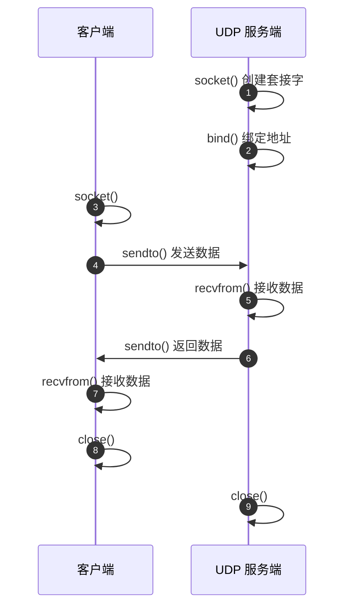

---
tags:
  - 平台/linux
  - 网络编程
  - 网络编程/UDP
阅读次数: 0
---

# UDP 服务端代码

## 概述

UDP 服务器是一种无连接的服务器架构，与 [[8.2 TCP服务端|TCP 服务端]] 相比更加简洁。由于 [[9.1 UDP原理|UDP 协议]] 的无连接特性，服务器不需要调用 `listen()` 和 `accept()` 函数来监听和接受连接。



![[Pasted image 20251218085248.png]]
---

## 参数详解

### 1. `int sock`

- 这是一个套接字描述符，用于标识 UDP 服务端的 [[7.6 套接字|套接字]]
- 通过 `socket()` 函数创建

### 2. `void *buff_snd` / `ssize_t snd_len` / `int flags`

- 这是一组用于发送数据的参数
- 用于 UDP 服务端向客户端发送数据时使用

### 3. `size_t buff_len`

- 这是一个 size 参数，让 sendto/recvfrom 知道了缓冲区的最大长度，以免内存越界
- 主要用于 `sendto()` 和 `recvfrom()` 函数

### 4. `socklen_t`

- 这种类型用于表示套接字地址结构的长度
- 注意在调用 `recvfrom()` 时需要传递它的指针，函数会更新它的值

---

## 代码流程

UDP 服务端的基本流程如下：

```
┌─────────────────────────────────────────┐
│           socket() 创建套接字            │
└─────────────────┬───────────────────────┘
                  │
                  ↓
┌─────────────────────────────────────────┐
│           bind() 绑定地址和端口          │
└─────────────────┬───────────────────────┘
                  │
                  ↓
┌─────────────────────────────────────────┐
│   recvfrom() 接收数据（阻塞等待）         │
└─────────────────┬───────────────────────┘
                  │
                  ↓
┌─────────────────────────────────────────┐
│           处理数据                       │
└─────────────────┬───────────────────────┘
                  │
                  ↓
┌─────────────────────────────────────────┐
│    sendto() 发送响应（可选）             │
└─────────────────┬───────────────────────┘
                  │
                  ↓
┌─────────────────────────────────────────┐
│           close() 关闭套接字            │
└─────────────────────────────────────────┘
```

---

## 关键函数

### socket() - 创建套接字

```c
int server_sock = socket(PF_INET, SOCK_DGRAM, 0);  // UDP
```

- 第二个参数使用 `SOCK_DGRAM` 表示创建 UDP 类型的 [[7.6 套接字#type（套接字类型）常用值|套接字]]
- 与 TCP 的 `SOCK_STREAM` 不同

### recvfrom() - 接收数据

```c
ssize_t recvfrom(int sockfd, void *buf, size_t len, int flags,
                 struct sockaddr *src_addr, socklen_t *addrlen);
```

| 参数 | 说明 |
|:---|:---|
| `sockfd` | 套接字文件描述符 |
| `buf` | 接收数据的缓冲区 |
| `len` | 缓冲区大小 |
| `flags` | 标志位，通常为 0 |
| `src_addr` | 输出参数，存储发送方的地址信息 |
| `addrlen` | 输入/输出参数，地址结构的长度 |

**返回值**：成功返回接收到的字节数，失败返回 -1

### sendto() - 发送数据

```c
ssize_t sendto(int sockfd, const void *buf, size_t len, int flags,
               const struct sockaddr *dest_addr, socklen_t addrlen);
```

| 参数 | 说明 |
|:---|:---|
| `sockfd` | 套接字文件描述符 |
| `buf` | 要发送的数据 |
| `len` | 数据长度 |
| `flags` | 标志位，通常为 0 |
| `dest_addr` | 目标地址 |
| `addrlen` | 地址结构的长度 |

**返回值**：成功返回发送的字节数，失败返回 -1

---

## 总结

| 对比项 | UDP 服务端 | TCP 服务端 |
|:---|:---|:---|
| 建立连接 | 无需连接 | 需要三次握手 |
| 监听 | 不需要 `listen()` | 需要 `listen()` |
| 接受连接 | 不需要 `accept()` | 需要 `accept()` |
| 数据收发 | `recvfrom()` / `sendto()` | `read()` / `write()` |
| 客户端地址 | 从 `recvfrom()` 获取 | 从 `accept()` 获取 |

---

## 示例代码

以下是一个完整的 UDP 服务端回声（Echo）服务器示例：

```c
#include <stdio.h>
#include <stdlib.h>
#include <string.h>
#include <unistd.h>
#include <arpa/inet.h>
#include <sys/socket.h>

#define BUFFER_SIZE 1024

void handle_error(const char* msg) {
    perror(msg);
    exit(1);
}

int main(int argc, char* argv[])
{
    int server_sock;
    struct sockaddr_in server_addr, client_addr;
    socklen_t client_addr_len = sizeof(client_addr);
    char buffer[BUFFER_SIZE] = {0};

    // 1. 校验参数
    if (argc != 2) {
        printf("usage: %s <port>\n", argv[0]);
        handle_error("argument error!");
    }

    // 2. 创建套接字（UDP）
    server_sock = socket(PF_INET, SOCK_DGRAM, 0);  // SOCK_DGRAM 表示 UDP
    if (server_sock == -1) {
        handle_error("socket create failed.");
    }

    // 3. 设置服务器地址
    memset(&server_addr, 0, sizeof(server_addr));
    server_addr.sin_family = AF_INET;
    server_addr.sin_addr.s_addr = htonl(INADDR_ANY);  // 监听所有接口
    server_addr.sin_port = htons(atoi(argv[1]));       // 端口号

    // 4. 绑定地址
    if (bind(server_sock, (struct sockaddr*)&server_addr, sizeof(server_addr)) == -1) {
        handle_error("bind failed.");
    }

    printf("UDP Server listening on port %s...\n", argv[1]);

    // 5. 循环接收和发送数据
    while (1) {
        // 接收客户端数据
        ssize_t bytes_received = recvfrom(server_sock, buffer, sizeof(buffer), 0,
                                          (struct sockaddr*)&client_addr, &client_addr_len);
        if (bytes_received == -1) {
            perror("recvfrom failed");
            continue;
        }

        printf("Received message from client: %s\n", buffer);

        // 检查是否收到退出命令
        char check_msg[] = "Hello, client! I received your message.";
        ssize_t bytes_sent = sendto(server_sock, check_msg, strlen(check_msg), 0,
                                    (struct sockaddr*)&client_addr, client_addr_len);
        if (bytes_sent == -1) {
            perror("sendto failed");
        }

        printf("Message: %s | Sent back to client.\n", buffer);
        memset(buffer, 0, sizeof(buffer));
    }

    close(server_sock);
    return 0;
}
```

### 编译和运行

```bash
# 编译
gcc -o udp_server udp_server.c

# 运行（监听端口 8888）
./udp_server 8888
```

---

## 关键要点

1. **UDP 套接字创建**：使用 `SOCK_DGRAM` 而非 `SOCK_STREAM`
2. **无需监听和接受**：UDP 服务端不调用 `listen()` 和 `accept()`
3. **recvfrom 获取客户端地址**：通过 `recvfrom()` 的输出参数获取发送方 [[7.2 IP地址|地址]] 和 [[7.3 端口|端口]]
4. **sendto 指定目标地址**：每次发送都需要指定目标地址
5. **配套客户端**：参见 [[9.3 UDP客户端代码|UDP 客户端代码]]

---

#网络/UDP #平台/Linux #跨平台
