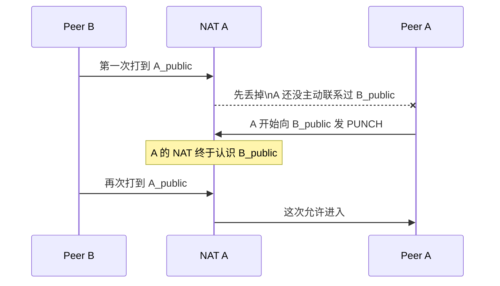

---
tags:
  - 平台/linux
  - 网络编程
  - 网络编程/UDP
date: 2026-04-19
rating: 5
阅读次数: 0
---

# 9.3 UDP穿透

> [!abstract] 一句话先记住
> UDP 穿透不是“强行打开 NAT”，而是让通信双方先各自向外发包，在各自 NAT 上留下可回流的状态，然后再从同一个 UDP socket 几乎同时朝对方的公网地址发包，把直连路径“碰”出来。

这篇笔记把 `9.1 UDP穿透原理` 和 `9.2 claude版UDP穿透` 合并为一篇中文整理稿。阅读时可以抓住一条主线：

- NAT 让外部不能直接主动打进来。
- 引介服务器负责交换双方当前的公网端点。
- 双方必须复用同一个本地 UDP socket，并几乎同时向对方发包。
- 能直连就直连，打不通就退回 TURN 中继。

# 1. UDP 穿透到底在解决什么问题

在远控场景里，控制端和被控端通常都在各自路由器后面。路由器做的是 **NAT（网络地址转换）**：

- 内网多台机器共用一个公网 IP。
- 内网设备主动发出的包可以出去。
- 外部主动打进来的包，如果 NAT 没有现成的映射记录，通常会被直接丢弃。

所以两端想绕过服务器直接通信，难点不是“知不知道对方 IP”，而是：

**对端 NAT 是否愿意把这个包放进来。**

![[9_1_11.svg|847]]

从结果上看，UDP 穿透做的是一件很朴素的事：**先让双方都主动向外发送数据，再利用 NAT 已经建立的状态，让回包能够穿回来。**

# 2. 全流程先看懂：打洞时实际发生了什么

把 UDP 穿透先粗看成 4 步：

1. A 和 B 都先用自己的 UDP socket 去联系一个公网引介服务器。
2. 服务器分别看到 A、B 当前在公网侧对应的 `IP:port`，然后把双方的地址交换给彼此。
3. A 和 B 再从 **同一个本地 socket** 几乎同时朝对方公网地址发 `PUNCH` 包。
4. 两边 NAT 都被“碰开”以后，后续数据就直接 A `<->` B 走，不再经过服务器。

![[9_1_2.svg]]

你可以把这件事压缩成一句话：

**先交换公网地址，再让双方同时主动发包，谁也别等谁先来找自己。**

# 3. 为什么一定要复用同一个 UDP socket

真正决定能不能打通的，不只是“有没有发包”，还包括你是不是一直在复用同一个本地端点。

![[9_1_1.svg]]

当你的程序第一次向公网发 UDP 包时，NAT 会记录一条映射：

- 内网真实端点：例如 `192.168.1.10:50000`
- NAT 映射后的公网端点：例如 `198.51.100.8:62000`

这意味着：

- 你用这个 socket 去联系服务器时，服务器看到的是 `198.51.100.8:62000`。
- 服务器把这个地址告诉对端。
- 你后续去打洞时，必须继续用**同一个本地 socket** 发包，这样 NAT 才会沿用同一条映射。

如果你中途换了本地端口，对 NAT 来说就像是另一条全新的会话：

- 服务器告诉出去的公网地址会失效。
- 对端会继续朝旧地址发包。
- 结果就是“看起来流程都对，但怎么打都打不通”。

所以这里不是代码风格问题，而是打洞成立的前提条件。

# 4. 引介服务器在里面扮演什么角色

两端在最开始还不能直接互相通信，所以需要一个公网可达的引介服务器（rendezvous / signaling server）做三件事：

1. 观察每个 peer 当前暴露在公网侧的 `IP:port`
2. 把双方的公网端点交换给彼此
3. 通知双方开始打洞

![[9_1_12.svg|766]]

这里特别容易误解的一点是：

**引介服务器只是“介绍你们认识”，真正把路打通的是双方自己后续发出的 UDP 包。**

# 5. NAT 为什么有时能打通，有时完全打不通

地址交换成功，不等于一定能直连。因为 NAT 实际上有两套行为：

- **映射（Mapping）**：我从公网看起来是谁？
- **过滤（Filtering）**：谁有资格从公网回来找我？

## 5.1 映射：公网号码牌稳不稳定

![[9_1_4.svg]]

常见映射行为可以粗分成三类：

- **Endpoint-Independent Mapping（EIM）**：同一个内部 socket，无论去找谁，公网端口尽量保持不变。最利于打洞。
- **Address-Dependent Mapping（ADM）**：只要目标 IP 变了，公网端口就可能变。
- **Address and Port-Dependent Mapping（APDM）**：目标 IP 或端口任一变化，公网端口都可能变化。最难打。

这解释了为什么有些 NAT 很友好，有些 NAT 则非常折磨人：

- 如果映射稳定，服务器告诉出去的地址在后续打洞时仍然有效。
- 如果映射不稳定，你联系服务器时的公网端口，和你真正去找对端时的公网端口，可能根本不是同一个。

## 5.2 过滤：谁能从公网打回来

![[9_1_5.svg]]

过滤行为常见也有三档：

- **Endpoint-Independent Filtering（EIF）**：你只要向外发过包，别的公网地址更容易被放进来。
- **Address-Dependent Filtering（ADF）**：只有你联系过的那个外部 IP 更容易回来找你。
- **Address and Port-Dependent Filtering（APDF）**：只有你之前联系过的精确 `IP:port` 才会被放进来。

所以“知道对方地址”并不够，NAT 还要先认可这个地址。

这也是为什么真正的打洞实现里，常常会看到：

- 双方拿到地址后立刻开打
- 而且不是发一包就停，而是连续发多包

因为前几包被对端 NAT 丢掉，本来就是正常现象。

# 6. 为什么双方要几乎同时发 PUNCH

下面这段时序可以帮助理解“同时”的必要性：



继续结合下面这组分步图来看，会更直观：

![[9_1_13.svg|761]]

![[9_1_14.svg|737]]

![[9_1_15.svg|702]]

![[9_1_16.svg|704]]

![[9_1_17.svg|689]]

这几张图想表达的核心只有一个：

**UDP 打洞不是等对方来找你，而是双方都要主动先朝外发包，让各自 NAT 先为对方建立可回流状态。**

所以工程实现里通常会这样做：

- 拿到对端公网地址后立即开始发 `PUNCH`
- 每隔一小段时间重发一次，持续几秒
- 一旦真正收到对端的包，就把“实际收到的源地址”当成后续通信地址

如果两个 peer 刚好在同一个 NAT 后面，还会遇到一个额外概念：**hairpinning（回环）**。也就是 NAT 是否支持把“发往自己公网地址的包”再绕回到内网另一台机器。支持得好，同一路由器后面的两个 peer 也能通过公网映射地址互通；不支持就可能失败。

# 7. Keepalive：洞为什么打通后还会自己关上

即便直连已经建立，NAT 映射也不是永久存在的。多数家用路由器会在一段时间不见流量后回收 UDP 映射，常见超时范围大约是几十秒到几分钟。

![[9_1_18.svg|855]]

这就带来一个工程上的基本动作：

- 双方要定期发小包保活（keepalive）
- 否则 NAT 会把这条映射状态清掉
- 后续如果再次通信失败，就需要重新打洞

实战里常见的保活策略是每隔十几秒到二十几秒发一个轻量心跳。

# 8. STUN、ICE、TURN 分别做什么

到这里可以把相关术语一次理清：

![[9_1_3.svg]]

- **NAT**：制造问题的那一层。它让内网端点不能天然被公网直接访问。
- **STUN**：帮你“照镜子”，告诉你当前对外暴露出来的公网 `IP:port`。
- **ICE**：做候选地址管理和连通性检查，负责尝试哪条链路真正能通。
- **TURN**：直连失败时的中继兜底，所有数据改走服务器转发。

一句话记忆：

**NAT 制造问题，STUN 帮你看清自己，ICE 负责试路，TURN 负责兜底。**

这也顺手澄清两个误区：

- **误区 1：STUN 就等于 UDP 穿透。** 不是。STUN 只是发现公网映射地址的一部分工具。
- **误区 2：地址交换完就算结束。** 也不是。真正难的是映射稳定性、过滤策略，以及打洞时机的配合。

# 9. 什么时候 UDP 打洞会失败

下面这些情况，都会让裸打洞的成功率明显下降，甚至直接失败：

- **Symmetric NAT（对称 NAT）**：面向不同目标时分配不同公网端口，服务器看到的端口不一定适用于 peer-to-peer 通信。
- **双层 NAT / CGNAT**：家用路由器外面还有运营商级 NAT，再多一层不确定性。
- **过滤规则过严**：双方即便都知道地址，也很难在时间窗口内互相放通。
- **保活中断**：例如应用休眠或网络抖动，已有映射超时被清掉。

所以真实系统通常不会只赌一次裸打洞，而是采用：

- 能直连就直连
- 直连失败就自动退回 TURN

这也是 WebRTC、实时通信、P2P 组网里最常见的思路。

# 10. 看代码前先记住这 5 个观察点

> [!tip]
> 下面的代码是“学习版引介 + 裸打洞”骨架，不是完整商用方案。先抓住这 5 个观察点，再去看代码，思路会非常清楚。

1. **注册、打洞、通信必须共用同一个本地 UDP socket。**
2. **拿到对端地址后，不要只发一包，要连续发一串 `PUNCH`。**
3. **一旦真正收到对端的包，后续最好以实际收到的源地址为准。**
4. **打通以后要做 keepalive，否则 NAT 映射会超时。**
5. **真实工程还要考虑鉴权、重传、超时、失败回退 TURN。**

# 11. 学习版代码骨架

## 11.1 引介服务器做什么

引介服务器最核心的一件事，是**不相信客户端自己汇报“我公网地址是多少”，而是直接以 `recvfrom()` 看到的源地址和端口为准。**

```cpp
// ===== 学习版 UDP 引介服务器 =====
// 协议：
//   Peer -> Server : "REG <room> <peer_id>"
//   Server -> Peer : "PEER <ip> <port> <peer_id>"
//
// 说明：
// 1) 这里只做“引介 / 交换公网端点”，不是标准 STUN 服务器。
// 2) 真实系统还要做鉴权、过期清理、重传、TURN fallback 等。

#include <arpa/inet.h>
#include <netinet/in.h>
#include <sys/socket.h>
#include <unistd.h>

#include <cstring>
#include <iostream>
#include <sstream>
#include <string>
#include <unordered_map>
#include <vector>

struct PeerInfo {
    std::string peer_id;
    sockaddr_in observed_addr{}; // 服务器看到的公网地址
};

static std::string to_ip(const sockaddr_in& addr) {
    char buf[INET_ADDRSTRLEN] = {0};
    inet_ntop(AF_INET, &addr.sin_addr, buf, sizeof(buf));
    return buf;
}

static void send_text(int sock, const sockaddr_in& to, const std::string& s) {
    sendto(sock, s.data(), s.size(), 0,
           reinterpret_cast<const sockaddr*>(&to), sizeof(to));
}

int main() {
    int sock = socket(AF_INET, SOCK_DGRAM, 0);
    if (sock < 0) {
        std::cerr << "socket() failed\n";
        return 1;
    }

    sockaddr_in bind_addr{};
    bind_addr.sin_family = AF_INET;
    bind_addr.sin_addr.s_addr = htonl(INADDR_ANY);
    bind_addr.sin_port = htons(40000);

    if (bind(sock, reinterpret_cast<sockaddr*>(&bind_addr), sizeof(bind_addr)) < 0) {
        std::cerr << "bind() failed\n";
        return 1;
    }

    std::unordered_map<std::string, std::vector<PeerInfo>> rooms;

    char buf[1024];
    while (true) {
        sockaddr_in from{};
        socklen_t from_len = sizeof(from);
        ssize_t n = recvfrom(sock, buf, sizeof(buf) - 1, 0,
                             reinterpret_cast<sockaddr*>(&from), &from_len);
        if (n <= 0) continue;
        buf[n] = '\0';

        std::istringstream iss(buf);
        std::string cmd, room, peer_id;
        iss >> cmd >> room >> peer_id;

        if (cmd != "REG" || room.empty() || peer_id.empty()) {
            continue;
        }

        auto& peers = rooms[room];
        bool updated = false;
        for (auto& p : peers) {
            if (p.peer_id == peer_id) {
                p.observed_addr = from;
                updated = true;
                break;
            }
        }
        if (!updated) {
            peers.push_back(PeerInfo{peer_id, from});
        }

        if (peers.size() == 2) {
            const auto& a = peers[0];
            const auto& b = peers[1];

            std::string msg_to_a = "PEER " + to_ip(b.observed_addr) + " " +
                                   std::to_string(ntohs(b.observed_addr.sin_port)) +
                                   " " + b.peer_id;

            std::string msg_to_b = "PEER " + to_ip(a.observed_addr) + " " +
                                   std::to_string(ntohs(a.observed_addr.sin_port)) +
                                   " " + a.peer_id;

            send_text(sock, a.observed_addr, msg_to_a);
            send_text(sock, b.observed_addr, msg_to_b);
        }
    }

    close(sock);
    return 0;
}
```

## 11.2 Peer 为什么必须复用同一个 socket

这个学习版 peer 代码对应的是“同一个 socket 先注册，再打洞，再通信”的最小闭环。

```cpp
// ===== 学习版 UDP 打洞 Peer =====
// 协议：
//   Peer -> Server : "REG <room> <my_id>"
//   Server -> Peer : "PEER <ip> <port> <peer_id>"
//   Peer <-> Peer  : "PUNCH <room> <my_id>"
//   Peer <-> Peer  : "PUNCH_ACK <room> <my_id>"
//   Peer <-> Peer  : "DATA <my_id> <text...>"
//
// 重点：整个流程都复用“同一个本地 UDP socket”。

#include <arpa/inet.h>
#include <netinet/in.h>
#include <sys/socket.h>
#include <unistd.h>

#include <atomic>
#include <chrono>
#include <cstring>
#include <iostream>
#include <sstream>
#include <string>
#include <thread>

static void send_text(int sock, const sockaddr_in& to, const std::string& s) {
    sendto(sock, s.data(), s.size(), 0,
           reinterpret_cast<const sockaddr*>(&to), sizeof(to));
}

static std::string endpoint_to_string(const sockaddr_in& addr) {
    char ip[INET_ADDRSTRLEN] = {0};
    inet_ntop(AF_INET, &addr.sin_addr, ip, sizeof(ip));
    return std::string(ip) + ":" + std::to_string(ntohs(addr.sin_port));
}

int main() {
    std::string server_ip = "203.0.113.10";
    uint16_t server_port = 40000;
    std::string room = "room1";
    std::string my_id = "A";
    uint16_t local_port = 50000;

    int sock = socket(AF_INET, SOCK_DGRAM, 0);
    if (sock < 0) {
        std::cerr << "socket() failed\n";
        return 1;
    }

    sockaddr_in local{};
    local.sin_family = AF_INET;
    local.sin_addr.s_addr = htonl(INADDR_ANY);
    local.sin_port = htons(local_port);
    if (bind(sock, reinterpret_cast<sockaddr*>(&local), sizeof(local)) < 0) {
        std::cerr << "bind() failed\n";
        return 1;
    }

    sockaddr_in server{};
    server.sin_family = AF_INET;
    server.sin_port = htons(server_port);
    inet_pton(AF_INET, server_ip.c_str(), &server.sin_addr);

    send_text(sock, server, "REG " + room + " " + my_id);

    sockaddr_in peer_addr{};
    std::atomic<bool> connected{false};
    char buf[2048];
    std::thread punch_thread;

    while (true) {
        sockaddr_in from{};
        socklen_t from_len = sizeof(from);
        ssize_t n = recvfrom(sock, buf, sizeof(buf) - 1, 0,
                             reinterpret_cast<sockaddr*>(&from), &from_len);
        if (n <= 0) continue;
        buf[n] = '\0';

        std::string msg(buf);
        std::istringstream iss(msg);
        std::string cmd;
        iss >> cmd;

        if (cmd == "PEER") {
            std::string ip, peer_id;
            uint16_t port = 0;
            iss >> ip >> port >> peer_id;

            peer_addr = {};
            peer_addr.sin_family = AF_INET;
            peer_addr.sin_port = htons(port);
            inet_pton(AF_INET, ip.c_str(), &peer_addr.sin_addr);

            punch_thread = std::thread([&]() {
                for (int i = 0; i < 40 && !connected.load(); ++i) {
                    send_text(sock, peer_addr, "PUNCH " + room + " " + my_id);
                    std::this_thread::sleep_for(std::chrono::milliseconds(200));
                }
            });
        }
        else if (cmd == "PUNCH") {
            std::string recv_room, peer_id;
            iss >> recv_room >> peer_id;

            if (recv_room == room) {
                send_text(sock, from, "PUNCH_ACK " + room + " " + my_id);
                connected = true;
                peer_addr = from;
            }
        }
        else if (cmd == "PUNCH_ACK") {
            std::string recv_room, peer_id;
            iss >> recv_room >> peer_id;

            if (recv_room == room) {
                connected = true;
                peer_addr = from;
            }
        }
        else if (cmd == "DATA") {
            std::string peer_id;
            iss >> peer_id;
            std::string text;
            std::getline(iss, text);
            std::cout << "[" << peer_id << "]" << text << "\n";
        }

        if (connected.load()) {
            if (punch_thread.joinable()) {
                punch_thread.join();
            }
            break;
        }
    }

    close(sock);
    return 0;
}
```

读代码时，对照第 10 节去看：

- 服务器是不是直接使用 `recvfrom()` 观察到的公网端点？
- peer 有没有始终复用同一个本地 socket？
- 为什么 `PUNCH` 要连续发，而不是发一次就等？
- 为什么连接建立后要把实际收到的源地址当成最终通信地址？
- 为什么这套代码仍然不能替代完整的 ICE / TURN 方案？

# 12. 实战记忆点

如果你想把整篇内容最后压缩成几句话，可以记成下面这组判断：

- **先注册，后交换地址，再同时发包。**
- **只知道对方公网地址，不等于一定能直连。**
- **同一个本地 socket 是前提，不是编码风格。**
- **前几包被丢掉很正常，所以要连续发 `PUNCH`。**
- **能直连就直连，直连不稳或打不通就退回 TURN。**

最后再压缩成一句工程化的话：

**同一个本地 UDP socket 先向外注册，拿到彼此的公网端点；双方再几乎同时朝对方发包，让 NAT 为对端建立可回流状态；能直连就直连，不行就 TURN 中继。**

# 13. 典型应用场景

理解完这篇后，再去看下面这些技术会轻松很多：

- **WebRTC**：浏览器实时音视频，本质上也在做 ICE / STUN / TURN 协调。
- **P2P 远控或组网**：比如节点直连、低延迟控制链路建立。
- **多人联机游戏**：为了降低中继延迟，会优先尝试 peer-to-peer 直连。
- **VPN Mesh / 覆盖网络**：协调服务器负责发现路径，失败时再中继兜底。

所以 UDP 穿透不只是一个面试概念，它是很多实时系统里“尽量直连、必要时回退”的基础能力。
