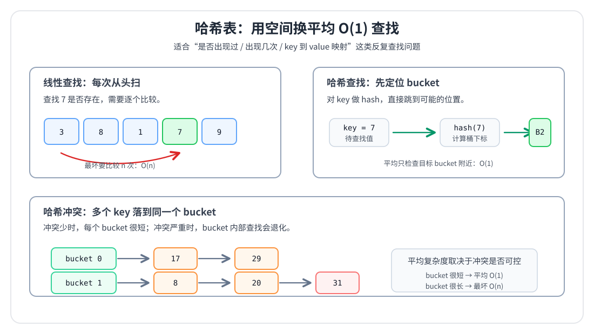

---
tags:
  - 算法/哈希表
  - 数据结构/hash
  - STL
  - 算法
阅读次数: 0
---

# 5.2.8 哈希表与计数

> 哈希表用于把“反复查找某个值是否出现过”的线性扫描，优化为平均 `O(1)` 的查找。

---

## 哈希表解决什么问题

很多数组、字符串题的朴素写法是：

1. 枚举当前元素
2. 再到前面或后面查找某个目标值
3. 每次查找都要扫一遍数组

这样很容易得到 `O(n²)`：

```text
for 每个 nums[i]:
    for 每个 nums[j]:
        判断 nums[j] 是否是我要找的值
```

哈希表的核心思想是：**用额外空间记录已经见过的信息，让查找从 `O(n)` 变成平均 `O(1)`**。



图中左侧表示线性查找：每次查询都可能从头扫到尾；右侧表示哈希查找：先通过 `hash(key)` 定位到 bucket，再在 bucket 内检查元素。下面的 bucket 链说明了哈希冲突：多个 key 落到同一个 bucket 时，bucket 内部仍然需要继续比较。

```text
原始问题：查找一个值是否存在

数组线性查找：
[3, 8, 1, 7, 9]  找 7  →  可能扫很多个元素  O(n)

哈希表查找：
key -> bucket -> value          →  平均 O(1)
```

适合使用哈希表的典型信号：

| 信号 | 哈希表记录什么 |
|------|----------------|
| 判断元素是否出现过 | `unordered_set<T>` |
| 统计出现次数 | `unordered_map<T, int>` |
| 查找某个值的下标 | `unordered_map<T, int>` |
| 按特征分组 | `unordered_map<Key, vector<T>>` |
| 值域很大，不能开数组 | 用哈希表代替计数数组 |

> [!tip]
> 如果题目反复出现“是否存在”“出现几次”“上一次出现位置”“按某个特征归类”，优先考虑哈希表。

---

## unordered_map 与 unordered_set

C++ 中常用两类无序关联容器：

| 容器 | 作用 | 典型场景 |
|------|------|----------|
| `std::unordered_set<T>` | 只关心 key 是否存在 | 去重、查重、集合判断 |
| `std::unordered_map<K, V>` | key 映射到 value | 计数、记录下标、分组 |

它们和 [[5.1.4 set]]、[[5.1.5 map]] 最大的区别是：

| 容器 | 底层思想 | 是否有序 | 查找复杂度 |
|------|----------|----------|------------|
| `set/map` | 红黑树 | 有序 | `O(logn)` |
| `unordered_set/unordered_map` | 哈希表 | 无序 | 平均 `O(1)`，最坏 `O(n)` |

### 基本用法

下面代码展示哈希集合和哈希映射最常见的操作。

```cpp
#include <string>
#include <unordered_map>
#include <unordered_set>
#include <vector>

void basicUsage(const std::vector<std::string>& words) {
    std::unordered_set<std::string> seen;
    std::unordered_map<std::string, int> freq;

    for (const auto& word : words) {
        seen.insert(word);
        ++freq[word];
    }

    if (seen.count("cpp") > 0) {
        // "cpp" 出现过
    }

    auto it = freq.find("hash");
    if (it != freq.end()) {
        int count = it->second;
    }
}
```

**关键点**：

- `unordered_set` 只保存 key，本质是“出现过 / 没出现过”
- `unordered_map` 保存 `key -> value`，适合计数和记录位置
- `count(key)` 返回 key 是否存在；对这两类容器来说结果通常是 `0` 或 `1`
- `find(key)` 不会插入新元素，适合只查询
- `operator[]` 如果 key 不存在，会自动插入一个默认 value

---

## 底层原理：哈希冲突

哈希表不是直接用 key 当下标，而是先通过哈希函数把 key 映射到桶（bucket）：

```text
key  ──hash(key)──>  hash value  ──取模/映射──>  bucket index
```

不同 key 可能落到同一个 bucket，这叫 **哈希冲突（hash collision）**。

```text
bucket 0:  17 -> 29
bucket 1:  42
bucket 2:  8 -> 20 -> 31
bucket 3:  空
```

如果冲突很少，每个 bucket 里元素很少，查找就是平均 `O(1)`；如果大量 key 都挤在同一个 bucket，查找会退化成在链表或等价结构中线性扫描，最坏是 `O(n)`。

### load_factor 与 rehash

`load_factor` 表示元素数量和桶数量的比例：

```cpp
#include <unordered_map>

void prepareTable(int n) {
    std::unordered_map<int, int> freq;
    freq.max_load_factor(0.7f);
    freq.reserve(n);
}
```

**关键点**：

- `reserve(n)` 预留空间，减少插入过程中的 rehash
- `max_load_factor` 越小，桶更稀疏，冲突可能更少，但占用内存更多
- rehash 会重新分配桶，已有迭代器可能失效
- 面试题一般关注平均复杂度；工程中要知道哈希表不是严格 `O(1)`

---

## 场景一：计数

计数是 `unordered_map` 最基础的用法：把元素当 key，把出现次数当 value。

```cpp
#include <string>
#include <unordered_map>
#include <vector>

std::unordered_map<std::string, int> countWords(const std::vector<std::string>& words) {
    std::unordered_map<std::string, int> freq;

    for (const auto& word : words) {
        ++freq[word];
    }

    return freq;
}
```

**为什么这样写**：

- `freq[word]` 表示 word 对应的次数
- 如果 word 第一次出现，`freq[word]` 会插入 `word -> 0`
- 然后 `++freq[word]` 把次数变成 1

这种写法简洁，适合“读到就计数”的场景。

> [!warning]
> 如果只是判断 key 是否存在，不要随手写 `mp[key]`，因为它会插入新 key。只查询时用 `find` 或 `count`。

---

## 场景二：去重与查重

去重只需要记录元素是否出现过，所以使用 `unordered_set` 比 `unordered_map<T, bool>` 更直接。

```cpp
#include <unordered_set>
#include <vector>

std::vector<int> uniqueValues(const std::vector<int>& nums) {
    std::unordered_set<int> seen;
    std::vector<int> result;

    for (int x : nums) {
        if (seen.count(x) == 0) {
            seen.insert(x);
            result.push_back(x);
        }
    }

    return result;
}
```

**关键点**：

- `seen` 负责判断某个数是否已经出现
- `result` 保留第一次出现的顺序
- 如果不关心顺序，也可以直接用 `unordered_set<int>(nums.begin(), nums.end())`

和 [[5.1.1 vector]] 相比，`vector` 查找一个值需要线性扫描；`unordered_set` 用额外空间换取平均 `O(1)` 查找。

---

## 场景三：两数之和

### 问题思路

“两数之和”的朴素做法是枚举 `i` 和 `j`，复杂度 `O(n²)`。哈希表优化的关键是：

> 枚举当前数 `x` 时，只需要判断 `target - x` 是否在前面出现过。

```cpp
#include <unordered_map>
#include <vector>

std::vector<int> twoSum(const std::vector<int>& nums, int target) {
    std::unordered_map<int, int> indexByValue;

    for (int i = 0; i < static_cast<int>(nums.size()); ++i) {
        int need = target - nums[i];
        auto it = indexByValue.find(need);
        if (it != indexByValue.end()) {
            return {it->second, i};
        }
        indexByValue[nums[i]] = i;
    }

    return {};
}
```

**关键点**：

- `indexByValue` 记录“某个值最后一次出现的下标”
- 先查 `need`，再插入当前 `nums[i]`，可以避免同一个元素被使用两次
- 查找 `need` 的成本从线性扫描降为平均 `O(1)`
- 总时间复杂度从 `O(n²)` 降为平均 `O(n)`

---

## 场景四：最长连续序列

### 问题思路

给定一个无序数组，求最长连续数字序列长度。例如：

```text
[100, 4, 200, 1, 3, 2]
最长连续序列是 [1, 2, 3, 4]，长度为 4
```

如果先排序，可以做到 `O(nlogn)`。哈希表的做法是把所有数字放进集合，然后只从“连续段起点”开始扩展。

```cpp
#include <algorithm>
#include <unordered_set>
#include <vector>

int longestConsecutive(const std::vector<int>& nums) {
    std::unordered_set<int> values(nums.begin(), nums.end());
    int best = 0;

    for (int x : values) {
        if (values.count(x - 1) > 0) {
            continue;
        }

        int current = x;
        int length = 1;
        while (values.count(current + 1) > 0) {
            ++current;
            ++length;
        }

        best = std::max(best, length);
    }

    return best;
}
```

**为什么只从起点扩展**：

- 如果 `x - 1` 存在，说明 `x` 不是连续段起点
- 只从 `1` 这种起点扩展到 `2, 3, 4`
- `2, 3, 4` 不会重复作为起点再扩展

平均时间复杂度是 `O(n)`，因为每个连续段只会从起点完整扫描一次。

> [!warning]
> 不要对数组中每个元素都向右扩展，否则 `[1,2,3,4,5]` 会被重复扫描，退化成 `O(n²)`。

---

## 场景五：字母异位词分组

### 问题思路

字母异位词的本质是：字符组成相同，但顺序不同。

```text
"eat", "tea", "ate"  →  都由 a/e/t 组成
```

要分组，就需要为每个字符串构造一个“标准 key”。常见做法有两种：

| key 构造方式 | 适合场景 | 复杂度 |
|--------------|----------|--------|
| 排序字符串 | 简洁通用 | 每个单词 `O(klogk)` |
| 统计 26 个字母频率 | 只含小写字母 | 每个单词 `O(k)` |

### 写法一：排序作为 key

排序后，异位词会得到相同的 key。

```cpp
#include <algorithm>
#include <string>
#include <unordered_map>
#include <utility>
#include <vector>

std::vector<std::vector<std::string>> groupAnagrams(std::vector<std::string> words) {
    std::unordered_map<std::string, std::vector<std::string>> groups;

    for (auto& word : words) {
        std::string key = word;
        std::sort(key.begin(), key.end());
        groups[key].push_back(std::move(word));
    }

    std::vector<std::vector<std::string>> result;
    result.reserve(groups.size());
    for (auto& [key, group] : groups) {
        result.push_back(std::move(group));
    }

    return result;
}
```

**关键点**：

- `key` 是排序后的字符串，用来表示字符组成
- `groups[key]` 是这个组成对应的所有原始单词
- 返回结果不要求组之间有序时，`unordered_map` 很适合
- 如果题目要求输出顺序，需要额外维护顺序，不能依赖 `unordered_map` 遍历顺序

### 写法二：计数签名作为 key

如果字符串只包含小写字母，可以用 26 个计数构造 key。

```cpp
#include <array>
#include <string>

std::string buildLowercaseSignature(const std::string& word) {
    std::array<int, 26> count{};

    for (char ch : word) {
        ++count[ch - 'a'];
    }

    std::string key;
    for (int value : count) {
        key += '#';
        key += std::to_string(value);
    }

    return key;
}
```

**为什么要加分隔符**：

- 不加分隔符时，`[1, 11]` 和 `[11, 1]` 拼接后可能都变成类似 `111`
- 加 `#` 后可以区分成 `#1#11` 和 `#11#1`
- 计数 key 避免了排序，适合字符串很长且字符集固定的情况

---

## unordered_map 使用坑点

### 1. `operator[]` 会插入默认值

```cpp
#include <unordered_map>

void lookupOnly() {
    std::unordered_map<int, int> freq;

    if (freq[10] == 0) {
        // 这里已经把 10 插入到 freq 中
    }
}
```

只查询时应该写：

```cpp
if (freq.find(10) == freq.end()) {
    // 10 不存在，且不会插入新元素
}
```

### 2. 遍历顺序不稳定

`unordered_map` 只保证能存储和查找 key，不保证遍历顺序。

```cpp
for (const auto& [key, value] : freq) {
    // 不要假设 key 会从小到大出现
}
```

如果题目要求有序输出，使用 [[5.1.5 map]]，或者先把 key 放进数组再排序。

### 3. 自定义 key 需要 hash 和相等判断

标准类型如 `int`、`std::string` 已经有默认 hash；如果 key 是自定义结构体，需要提供哈希函数和相等判断。

```cpp
#include <functional>
#include <unordered_map>

struct Point {
    int x = 0;
    int y = 0;

    bool operator==(const Point& other) const {
        return x == other.x && y == other.y;
    }
};

struct PointHash {
    std::size_t operator()(const Point& p) const {
        std::size_t h1 = std::hash<int>{}(p.x);
        std::size_t h2 = std::hash<int>{}(p.y);
        return h1 ^ (h2 << 1);
    }
};

void usePointAsKey() {
    std::unordered_map<Point, int, PointHash> count;
    ++count[Point{1, 2}];
}
```

**关键点**：

- `operator==` 决定两个 key 是否相等
- `PointHash` 决定 key 落到哪个 bucket
- 相等的 key 必须产生相同的 hash 值

### 4. 迭代器可能因为 rehash 失效

插入大量元素时，容器可能扩容并 rehash，旧迭代器可能失效。

```cpp
std::unordered_map<int, int> mp;
mp.reserve(1000);

for (int i = 0; i < 1000; ++i) {
    mp[i] = i;
}
```

如果预估元素数量，提前 `reserve` 可以减少 rehash 次数。

### 5. 小固定值域不一定要用哈希表

如果 key 是小范围整数或小写字母，数组通常更快、更简单。

```cpp
#include <array>
#include <string>

std::array<int, 26> countLowercaseLetters(const std::string& s) {
    std::array<int, 26> count{};
    for (char ch : s) {
        ++count[ch - 'a'];
    }
    return count;
}
```

**选择原则**：

| 场景 | 推荐结构 |
|------|----------|
| 小写字母计数 | `std::array<int, 26>` |
| ASCII 字符计数 | `std::array<int, 128>` 或 `std::array<int, 256>` |
| 值域小且连续 | `std::vector<int>` 计数 |
| 值域大或 key 是字符串 | `std::unordered_map` |
| 需要有序遍历 | `std::map` / `std::set` |

---

## 常见题型总结

| 题型 | 核心模式 | 推荐容器 | 复杂度 |
|------|----------|----------|--------|
| 判断重复元素 | 见过就返回 | `unordered_set` | 平均 `O(n)` |
| 统计频率 | `++freq[x]` | `unordered_map<T, int>` | 平均 `O(n)` |
| 两数之和 | 查 `target - x` | `unordered_map<int, int>` | 平均 `O(n)` |
| 最长连续序列 | 只从段起点扩展 | `unordered_set<int>` | 平均 `O(n)` |
| 字母异位词分组 | 标准 key 分组 | `unordered_map<string, vector<string>>` | 取决于 key 构造 |
| 数组交集 | 一个集合查另一个数组 | `unordered_set` | 平均 `O(n + m)` |

---

## 最佳实践

| 推荐 | 避免 | 原因 |
|------|------|------|
| 只查找时使用 `find` / `count` | 用 `mp[key]` 判断存在 | `operator[]` 会插入默认值 |
| 预估规模时调用 `reserve` | 大量插入时完全不预留 | 减少 rehash 和迭代器失效 |
| 不依赖遍历顺序 | 假设输出自动有序 | `unordered_map` 无序 |
| 小固定值域用数组 | 所有计数都用哈希表 | 数组更快且无哈希开销 |
| 自定义 key 同时定义 hash 和 `==` | 只写 hash 不写相等判断 | 哈希表需要判断 key 是否真正相等 |

---

## 关键要点

1. 哈希表适合把“反复查找”从 `O(n)` 优化到平均 `O(1)`。
2. `unordered_set` 解决“是否出现过”，`unordered_map` 解决“key 对应 value”。
3. 哈希表平均很快，但哈希冲突严重时最坏会退化到 `O(n)`。
4. `operator[]` 会自动插入默认值，只查询时优先用 `find` 或 `count`。
5. 如果需要有序结果，不要使用 `unordered_map` 的遍历顺序。
6. 小范围计数优先用数组，大范围或字符串 key 再用哈希表。

---

## 截图题目练习分配

| 题目 | 对应模式 | 备注 |
|---|---|---|
| 1. 两数之和 | 哈希查找 | 扫描时查找 `target - nums[i]` |
| 41. 缺失的第一个正数 | 原地哈希 | 把数字放到对应下标位置 |
| 560. 和为 K 的子数组 | 前缀和 + 哈希计数 | 查找历史前缀和 `prefix - k` |
| 442. 数组中重复的数据 | 原地哈希 / 标记 | 利用数值和下标映射找重复元素 |
| 剑指 Offer 50. 第一个只出现一次的字符 | 哈希计数 | 先统计频次再按原序找第一个唯一字符 |
| 287. 寻找重复数 | 原地映射 / 快慢指针 | 可看作值到下标的环 |
| 128. 最长连续序列 | 哈希集合 | 只从序列起点开始扩展 |
| 1004. 最大连续 1 的个数 III | 滑动窗口计数 | 窗口内最多允许 `k` 个 0 |
| 395. 至少有 K 个重复字符的最长子串 | 分治 / 计数 | 按出现次数不足 `k` 的字符切分 |
| 136. 只出现一次的数字 | 异或 / 计数 | 异或抵消重复数字 |
| 316. 去除重复字母 | 单调栈 + 计数 | 保证字典序最小且每个字符出现一次 |
| 692. 前 K 个高频单词 | 哈希计数 + 堆/排序 | 统计词频后按频率和字典序排序 |
| 18. 四数之和 | 排序 + 双指针 + 去重 | 固定两个数后做两数和 |
| 剑指 Offer 39. 数组中出现次数超过一半的数字 | 哈希计数 / 投票 | 统计频次或 Boyer-Moore |
| 459. 重复的子字符串 | 字符串周期 | 判断是否由某个子串重复构成 |
| 260. 只出现一次的数字 III | 位运算分组 | 用最低位 1 把两个唯一数分组 |
| 剑指 Offer 03. 数组中重复的数字 | 原地哈希 | 把数字交换到对应下标 |
| 242. 有效的字母异位词 | 字符计数 | 比较两个字符串字符频次 |
| 80. 删除排序数组中的重复项 II | 计数 / 原地去重 | 每个值最多保留两次 |
| 49. 字母异位词分组 | 哈希分组 | 排序字符串或频次数组作为键 |
| 706. 设计哈希映射 | 哈希表 | 自实现键值映射 |
| 204. 计数质数 | 素数筛 | 埃氏筛统计小于 n 的质数 |
| 532. 数组中的 K-diff 数对 | 哈希计数 | 按 k=0 和 k>0 分情况计数 |
| 697. 数组的度 | 哈希记录 | 记录频次、首次和末次位置 |
| 268. 丢失数字 | 哈希 / 数学 / 异或 | 找出 `0..n` 中缺失的数 |
| 540. 有序数组中的单一元素 | 二分 / 异或 | 成对元素下标规律 |
| 961. 重复 N 次的元素 | 哈希集合 | 找第一个重复出现元素 |
| 509. 斐波那契数 | 记忆化 / DP | 基础递推 |
| 438. 找到字符串中所有字母异位词 | 频次窗口 | 字符计数匹配 |

| 169. 多数元素 | Boyer-Moore 投票 | 候选值与计数抵消，最终剩余多数元素 |
## 相关链接

- [[5.1.4 set]] - 有序集合，适合需要顺序的集合问题
- [[5.1.5 map]] - 有序映射，适合需要按 key 排序的映射问题
- [[5.1.1 vector]] - 小值域计数时常用数组式存储
- [[5.1.6 string]] - 字符串哈希分组和字符计数的基础
- [[5.2.5 常见排序算法与STL排序]] - 异位词分组中可用排序构造 key

---

## 参考

- C++ Standard Library：Unordered associative containers
- 《Effective STL》：关联容器选择、查找与插入的使用原则
