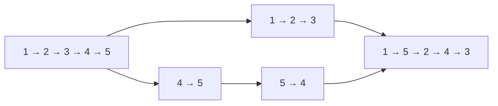

---
tags:
  - 算法
  - 力扣
  - 链表
  - 双指针
  - 题解
aliases:
  - Reorder List
  - 链表交错重排
题号: "143"
难度: 中等
阅读次数: 0
---

# 143. 重排链表

> 给定单链表 `L0 → L1 → … → Ln-1 → Ln`，将它重排为 `L0 → Ln → L1 → Ln-1 → L2 → …`。

本题要求原地调整节点连接关系，不能只交换节点中的 `val`，也不能使用数组保存所有节点。

> [!success] Trellis Day 2 进度
> 2026-08-26 已独立完成 143. 重排链表。本题串联了快慢指针、链表反转和交替合并三个基本操作。

---

## 1. 解题思路

### 1.1 三步拆解

把原链表拆成前后两段：

```text
原链表：1 → 2 → 3 → 4 → 5
前半段：1 → 2 → 3
后半段：4 → 5
```

然后依次完成：

1. **找前半段最后一个节点**：使用快慢指针。
2. **反转后半段**：使用 `prev / second / nextPtr` 三指针。
3. **交替合并**：从前半段和反转后的后半段各取一个节点。

合并后得到：

```text
1 → 5 → 2 → 4 → 3
```

### 1.2 为什么这样做

重排后的顺序本质上是：

```text
前半段从左到右：1 → 2 → 3
后半段从右到左：5 → 4
```

把后半段先反转，就可以把“从右到左取节点”变成普通的“从左到右取节点”，最后用两个同向指针交替拼接即可。

> [!tip] 核心洞察
> 这道题不是一个新奇的链表操作，而是三个已知模板的组合：找中点、反转链表、合并链表。遇到复杂链表题时，可以先拆成这些基本动作。

---

## 2. 快慢指针定位前半段尾节点

算法笔记中的通用快慢指针说明在以下位置：

- [[5.算法/5.2 算法/5.2.7 双指针与滑动窗口#链表中点|双指针与滑动窗口：链表中点]]
- [[5.算法/5.2 算法/5.2.9 链表常见技巧#找中点|链表常见技巧：找中点]]

这两处的通用写法通常是 `fast = head`，用于返回链表的中点；143 使用的是一个稍有不同的目标：**找到前半段的最后一个节点**。

```cpp
ListNode* slow = head;
ListNode* fast = head;

while (fast->next != nullptr && fast->next->next != nullptr) {
    slow = slow->next;
    fast = fast->next->next;
}
```

循环条件提前检查 `fast->next` 和 `fast->next->next`，因此 `slow` 的位置是：

| 链表长度 | `slow` 最终位置 | 后半段起点 |
|----------|-----------------|------------|
| 偶数，例如 `1 → 2 → 3 → 4` | `2`，前半段尾节点 | `3` |
| 奇数，例如 `1 → 2 → 3 → 4 → 5` | `3`，中间节点也归前半段 | `4` |

注意：这里的 `slow` 不是“必须单独取出的中点”，而是**切分前半段的尾节点**。因此找到它后要保存并断开：

```cpp
ListNode* second = slow->next;
slow->next = nullptr;
```

---

## 3. 图解过程

以 `1 → 2 → 3 → 4 → 5` 为例：



详细状态：

| 阶段 | 前半段 | 后半段 | 说明 |
|------|--------|--------|------|
| 切分后 | `1 → 2 → 3` | `4 → 5` | `slow` 停在 `3`，并断开连接 |
| 反转后 | `1 → 2 → 3` | `5 → 4` | 后半段变成从尾到头的顺序 |
| 合并第 1 轮 | `1 → 2 → 3` | `5 → 4` | 接入 `1`、`5` |
| 合并第 2 轮 | `2 → 3` | `4` | 接入 `2`、`4` |
| 合并结束 | `3` | 空 | 保留中间节点 `3` |

---

## 4. 代码实现

```cpp
class Solution {
public:
    void reorderList(ListNode* head) {
        if (head == nullptr || head->next == nullptr) {
            return;
        }

        // 1. 找到前半段最后一个节点
        ListNode* slow = head;
        ListNode* fast = head;
        while (fast->next != nullptr && fast->next->next != nullptr) {
            fast = fast->next->next;
            slow = slow->next;
        }

        // 2. 切断前后两段
        ListNode* second = slow->next;
        slow->next = nullptr;

        // 3. 反转后半段
        ListNode* prev = nullptr;
        while (second != nullptr) {
            ListNode* nextPtr = second->next;
            second->next = prev;
            prev = second;
            second = nextPtr;
        }

        // 4. 交替合并前半段和反转后的后半段
        ListNode* first = head;
        while (prev != nullptr) {
            ListNode* nextHead = first->next;
            ListNode* nextPrev = prev->next;

            first->next = prev;
            prev->next = nextHead;

            first = nextHead;
            prev = nextPrev;
        }
    }
};
```

---

## 5. 代码详解

### 5.1 为什么 `fast` 检查两个后继节点

普通找中点常写成：

```cpp
while (fast != nullptr && fast->next != nullptr)
```

它的目标是让 `slow` 停在中点，偶数长度时通常返回第二个中点。

本题要的是“前半段尾节点”，所以改成：

```cpp
while (fast->next != nullptr && fast->next->next != nullptr)
```

这样：

- 偶数长度链表中，`slow` 停在左半段最后一个节点；
- 奇数长度链表中，`slow` 停在中间节点，把中间节点留在前半段；
- 循环访问 `fast->next` 前，`fast` 已经由前置条件保证非空，因为初始链表至少有两个节点。

### 5.2 切断链表

```cpp
ListNode* second = slow->next;
slow->next = nullptr;
```

必须先保存 `slow->next`，再把 `slow->next` 设为空。否则右半段入口丢失，后面的反转就无法开始。

切断还有另一个作用：保证反转后半段时不会把前半段一起反转，也避免合并阶段形成环。

### 5.3 反转后半段

反转部分与 [[5.算法/5.3 力扣/206. 反转链表|206. 反转链表]] 相同：

```cpp
ListNode* nextPtr = second->next;
second->next = prev;
prev = second;
second = nextPtr;
```

四步顺序是：

1. 保存后继节点，避免剩余链表丢失。
2. 当前节点指向已反转部分。
3. `prev` 向前扩展。
4. `second` 移到尚未处理的节点。

### 5.4 交替合并时要保存两个后继

合并前：

```text
first  -> nextHead -> ...
prev   -> nextPrev -> ...
```

当前轮要把它们改成：

```text
first -> prev -> nextHead -> ...
```

因此必须先保存：

```cpp
ListNode* nextHead = first->next;
ListNode* nextPrev = prev->next;
```

再执行两次改指针：

```cpp
first->next = prev;
prev->next = nextHead;
```

最后分别移动 `first` 和 `prev`，继续下一轮。

### 5.5 为什么循环条件只判断 `prev`

切分后，后半段长度不会大于前半段：

- 偶数长度：两段等长；
- 奇数长度：前半段多一个中间节点。

所以只要 `prev` 还有节点，就一定有对应的 `first` 节点可供插入。后半段耗尽后，前半段剩余的节点自然留在末尾。

### 5.6 为什么不需要 `dummy`

重排后第一个节点仍然是原来的 `head`，头节点没有变化，因此不需要虚拟头节点。`dummy` 更适合“头节点可能被替换”的操作，例如合并链表或 K 个一组翻转。

---

## 6. 正确性说明

设切分后的前半段为 `A`，后半段为 `B`：

1. 快慢指针只改变 `slow->next`，所以每个原节点仍然存在，且 `A`、`B` 不重叠、覆盖全部节点。
2. 反转 `B` 只改变节点连接方向，不增删节点，得到的顺序正是原后半段从尾到头的顺序。
3. 合并时依次接入 `A` 的一个节点、反转后 `B` 的一个节点，因此输出顺序为 `L0、Ln、L1、Ln-1...`。
4. 后半段耗尽后，前半段至多剩下一个中间节点，它应当位于结果末尾。

因此算法得到的链表正是题目要求的重排结果。

---

## 7. 复杂度分析

- 时间复杂度：`O(n)`。
  - 找中点、反转后半段和交替合并都只遍历链表常数次。
- 额外空间复杂度：`O(1)`。
  - 只使用若干个链表指针，没有数组或递归栈。

---

## 8. 易错点

| 易错点 | 后果 / 修正 |
|--------|-------------|
| 把函数签名写成 `void reorderList(ListNode** head)` | 本题参数是单链表头指针，正确签名是 `void reorderList(ListNode* head)`。若只是粘贴时的 Markdown 转义，以单指针版本为准。 |
| 把 `fast` 声明成 `ListNode**` | `fast->next` 会类型错误；应为 `ListNode* fast`。 |
| 使用普通找中点循环而不调整目标 | 偶数长度时可能让 `slow` 停在第二个中点，切分不符合当前合并边界；本题使用 `fast->next` 与 `fast->next->next` 的前置检查。 |
| 找到 `second` 后不切断 | 前后两段仍相连，反转或合并时可能形成环。 |
| 修改 `second->next` 前没有保存 `nextPtr` | 后半段剩余节点丢失。 |
| 合并时只保存 `first->next` | 修改 `prev->next` 后会丢失反转后半段的剩余节点；必须同时保存 `nextHead` 和 `nextPrev`。 |
| 写成 `while (first != nullptr)` | 奇数长度时可能多访问一次；后半段长度不大于前半段，使用 `while (prev != nullptr)` 更直接。 |
| 只交换节点的 `val` | 没有按要求重排节点连接，面试题中也可能破坏节点附带数据。 |

---

## 9. 关联笔记

- [[5.算法/5.2 算法/5.2.7 双指针与滑动窗口#链表中点|双指针与滑动窗口：链表中点]] — 快慢指针定位中点的通用写法
- [[5.算法/5.2 算法/5.2.9 链表常见技巧#找中点|链表常见技巧：找中点]] — 找中点及切分链表
- [[5.算法/5.2 算法/5.2.9 链表常见技巧#反转链表|链表常见技巧：反转链表]] — 后半段反转模板
- [[5.算法/5.3 力扣/206. 反转链表|206. 反转链表]] — 三指针反转基础题
- [[5.算法/5.3 力扣/5.3.9 链表/148. 排序链表|148. 排序链表]] — 快慢指针切分与有序合并

题目链接：[LeetCode 143. 重排链表](https://leetcode.cn/problems/reorder-list/)
