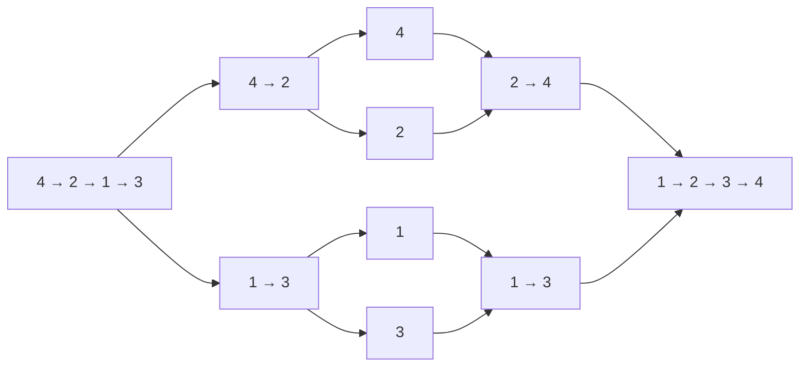

---
tags:
  - 算法
  - 力扣
  - 链表
  - 排序
  - 题解
aliases:
  - Sort List
  - 链表归并排序
题号: "148"
难度: 中等
阅读次数: 0
---

# 148. 排序链表

> 给定单链表的头节点 `head`，将链表按升序排列并返回新的头节点。

本题的核心是：**链表不适合随机访问，但适合用指针切分和合并**。因此采用归并排序。

> [!success] Trellis Day 2 进度
> 2026-08-26 已独立完成 148. 排序链表。本题使用“快慢指针切分 + 递归归并 + 双指针合并”的链表排序模板。

---

## 1. 解题思路

### 1.1 为什么使用归并排序

数组归并排序通常需要借助下标找到中点；单链表没有随机访问能力，不能直接通过 `mid` 下标定位。但链表可以用一次快慢指针遍历找到中点，也可以在合并时直接改变 `next` 指针，不需要搬运节点数据。

归并排序正好符合链表的特点：

1. 用快慢指针把链表切成左右两段。
2. 递归地把每一段继续切分，直到只剩 0 个或 1 个节点。
3. 合并两个已经有序的链表。

### 1.2 整体流程

```text
排序链表
├── 找中点并断开
├── 排序左半段
├── 排序右半段
└── 合并两个有序链表
```

> [!tip] 核心洞察
> `sortList` 负责“拆”和“递归”，`merge` 负责“合”。只要切分后左右两段都严格变短，递归就能结束；只要 `merge` 每次接入较小的头节点，结果就保持有序。

---

## 2. 图解过程

以 `4 -> 2 -> 1 -> 3` 为例：



### 2.1 快慢指针如何切分

代码使用：

```cpp
ListNode* slow = head;
ListNode* fast = head->next;
```

对 `4 -> 2 -> 1 -> 3` 执行循环后：

| 指针 | 所在节点 | 作用 |
|------|----------|------|
| `slow` | `2` | 左半段的尾节点 |
| `fast` | `nullptr` | 已经走到链表末尾 |
| `rightHead` | `1` | 右半段的头节点 |

随后执行 `slow->next = nullptr`，链表被真正切成：

```text
左半段：4 -> 2 -> nullptr
右半段：1 -> 3 -> nullptr
```

### 2.2 合并两个有序链表

假设左边已经排好为 `2 -> 4`，右边已经排好为 `1 -> 3`：

| 比较 | 接入节点 | 合并结果 |
|------|----------|----------|
| `2` 与 `1` | `1` | `1` |
| `2` 与 `3` | `2` | `1 -> 2` |
| `4` 与 `3` | `3` | `1 -> 2 -> 3` |
| 右链表耗尽 | 接上 `4` | `1 -> 2 -> 3 -> 4` |

---

## 3. 代码实现

```cpp
class Solution {
public:
    ListNode* sortList(ListNode* head) {
        // 空链表或单节点链表本身就是有序的
        if (head == nullptr || head->next == nullptr) {
            return head;
        }

        // fast 从 head->next 开始，让 slow 停在左半段尾部
        ListNode* slow = head;
        ListNode* fast = head->next;
        while (fast != nullptr && fast->next != nullptr) {
            slow = slow->next;
            fast = fast->next->next;
        }

        // 断开左右两段
        ListNode* rightHead = slow->next;
        slow->next = nullptr;

        // 分别排序左右两段
        ListNode* left = sortList(head);
        ListNode* right = sortList(rightHead);

        // 合并两个有序链表
        return merge(left, right);
    }

private:
    ListNode* merge(ListNode* left, ListNode* right) {
        ListNode dummy(0);
        ListNode* cur = &dummy;

        while (left != nullptr && right != nullptr) {
            if (left->val <= right->val) {
                cur->next = left;
                left = left->next;
            } else {
                cur->next = right;
                right = right->next;
            }
            cur = cur->next;
        }

        // 某一条链表耗尽后，剩余部分已经有序，可以整体接上
        cur->next = (left != nullptr) ? left : right;
        return dummy.next;
    }
};
```

---

## 4. 代码详解

### 4.1 递归终止条件

```cpp
if (head == nullptr || head->next == nullptr) {
    return head;
}
```

空链表和单节点链表不需要排序，直接返回即可。这也是保证递归最终停止的出口。

### 4.2 为什么 `fast` 要从 `head->next` 开始

这里不是随便选择初始化位置。对于两个节点：

```text
1 -> 2
```

若 `fast = head->next`，循环不会进入，`slow` 停在 `1`，切分结果是：

```text
左：1       右：2
```

若错误地写成 `fast = head`，`slow` 会移动到 `2`，然后把 `2` 的 `next` 断开。此时左半段仍然是完整的 `1 -> 2`，递归调用 `sortList(head)` 不会变短，可能造成无限递归。

因此，本题的快指针写法：

```cpp
ListNode* fast = head->next;
```

既能让偶数长度链表较均衡地切分，也能保证每次递归都会缩小问题规模。

### 4.3 为什么必须断链

```cpp
ListNode* rightHead = slow->next;
slow->next = nullptr;
```

第一行保存右半段入口，第二行切断左半段尾节点与右半段的连接。如果不写第二行：

- `sortList(head)` 仍然能访问右半段；
- 左递归可能继续处理原来的整条链表；
- 问题规模没有缩小，最终导致无限递归。

### 4.4 `merge` 的不变量

在合并过程中始终维护：

> `dummy.next` 到 `cur` 是已经合并好的有序链表；`left` 和 `right` 分别指向两条链表中尚未处理的最小节点。

每一轮选择 `left`、`right` 的较小者接到 `cur->next`，因此不会破坏有序性。某一边耗尽后，另一边剩下的节点本身已经有序，可以一次性接到末尾。

### 4.5 为什么使用 `dummy`

`dummy` 只是一个栈上的虚拟节点，用来统一处理“第一个节点应该来自左链表还是右链表”的情况。最终返回的是 `dummy.next`，真正的链表节点仍然是输入链表中的节点，不会返回 `dummy` 本身。

### 4.6 `<=` 带来的稳定性

```cpp
if (left->val <= right->val)
```

当两个节点的值相等时优先取左边节点，因此如果节点还携带其他信息，可以保持相等元素的原始相对顺序，这使得该归并过程具有稳定性。

---

## 5. 正确性说明

用归纳法说明 `sortList(head)` 能返回有序链表：

1. **基础情况**：链表长度为 0 或 1 时，直接返回，链表已经有序。
2. **归纳假设**：假设长度小于 `n` 的链表都能被正确排序。
3. **归纳步骤**：长度为 `n` 的链表经过快慢指针切分后，得到两个长度都小于 `n` 的链表。根据归纳假设，递归结果 `left` 和 `right` 都有序；`merge` 每次取两条链表头部的较小节点，因此合并结果仍然有序。

所以，长度为 `n` 的链表也能被正确排序，结论对所有长度成立。

---

## 6. 复杂度分析

- 时间复杂度：`O(nlogn)`。
  - 每一层切分和合并合计处理 `O(n)` 个节点。
  - 链表被切分约 `log n` 层。
- 额外空间复杂度：`O(logn)`。
  - `merge` 只使用常数个指针，额外空间是 `O(1)`。
  - 递归调用栈深度约为 `log n`。

> [!warning] 关于题目要求的 `O(1)` 空间
> 这份是自顶向下的递归归并排序，严格来说空间复杂度是 `O(logn)`，不是 `O(1)`。如果题目追问严格 `O(1)` 额外空间，需要改写成自底向上的迭代归并排序。

---

## 7. 易错点

| 易错点 | 后果 / 修正 |
|--------|-------------|
| 把函数签名写成 `ListNode** sortList(ListNode** head)` | 本题输入和返回都是单链表头指针，正确签名应是 `ListNode* sortList(ListNode* head)`。如果原代码中确实有两个 `*`，会与函数体的单指针用法不匹配；若只是粘贴时的 Markdown 转义，则以单指针版本为准。 |
| `fast` 从 `head` 开始 | 两节点时可能切分不变，递归无法结束；本写法使用 `head->next`。 |
| 找到 `rightHead` 后忘记 `slow->next = nullptr` | 左右链表没有真正分开，可能无限递归。 |
| 修改 `cur->next` 后不移动 `cur` | 下一轮仍覆盖同一位置，合并链表连接错误。 |
| 合并结束后逐节点重新处理剩余链表 | 没必要；剩余部分已排好序，直接整体接上。 |
| 交换节点的 `val`，不调整 `next` | 没有真正按链表节点完成排序；本题应复用节点并修改连接。 |
| 把递归版空间写成 `O(1)` | 忽略了递归栈；本实现应记为 `O(logn)`。 |

---

## 8. 变体与关联

### 8.1 自底向上的迭代归并

若需要严格 `O(1)` 额外空间，可以从长度为 1 的有序小段开始，两两合并长度为 2、4、8……的链表段，直到覆盖整条链表。它不使用递归栈，但需要额外维护链表长度、分段尾节点和合并后的新尾节点，手写边界更复杂。

### 8.2 与数组归并排序的区别

数组归并排序通常在合并阶段创建临时数组，再把结果拷回原数组；本题直接调整节点的 `next` 指针，不需要复制节点，也不需要随机访问。

---

## 9. 关联笔记

- [[5.算法/5.2 算法/5.2.9 链表常见技巧#排序链表|链表常见技巧：排序链表]] — 快慢指针切分与归并合并的通用模板
- [[5.算法/5.2 算法/5.2.5 常见排序算法与STL排序|常见排序算法与 STL 排序]] — 归并排序与其他排序方法对比
- [[5.算法/5.3 力扣/206. 反转链表|206. 反转链表]] — 链表指针操作基础
- [[5.算法/5.3 力扣/25. K 个一组翻转链表|25. K 个一组翻转链表]] — 链表分段操作的进阶题

题目链接：[LeetCode 148. 排序链表](https://leetcode.cn/problems/sort-list/)
