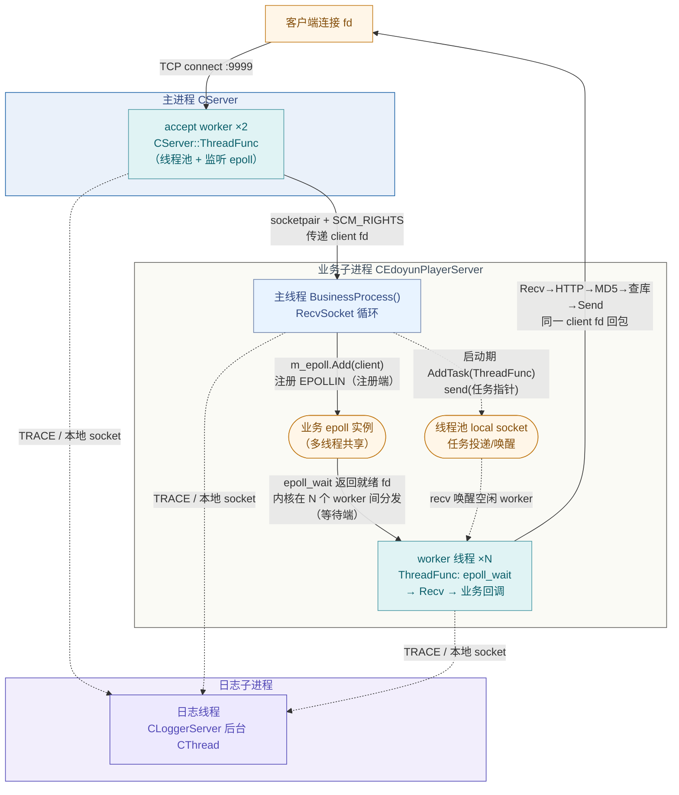
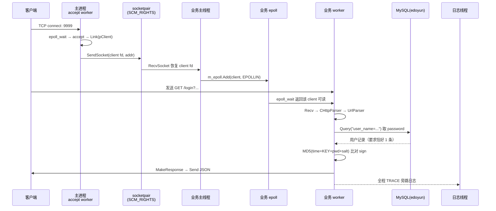

# 易播服务器项目总结

> [!abstract]
> 这一页是 `04 Linux播放器服务器` 专题的**总览与收口**笔记，把已经完成的四个分专题——[[4.1.1 易播服务器线程体系详解|线程]]、[[4.2.1 Linux播放器服务器网络模板设计|网络]]、[[4.3.1 易播服务器数据库设计|数据库]]、[[4.4.1 易播服务器加密与业务模块设计|加密与业务]]——拼回成一台完整的服务器。
> 读完本文应该能回答三个问题：这台服务器由哪些**进程/线程**组成、四个专题分别落在架构的哪个位置、一条 `/login` 请求如何穿过进程边界和线程池被处理完。
> 各模块的细节仍在分专题里，本文只负责把它们**串成一条主线**。

## 专题索引

| 专题 | 笔记 | 在架构中的位置 |
|---|---|---|
| 4.1 线程 | [[4.1.1 易播服务器线程体系详解]] | `CThreadPool` / `CThread`，为主进程与业务进程提供 worker |
| 4.2 网络 | [[4.2.1 Linux播放器服务器网络模板设计]] | `CServer` / `CEpoll` / `CSocket`，Reactor 事件循环 |
| 4.3 数据库 | [[4.3.1 易播服务器数据库设计]] | `CDatabaseClient` / `CMysqlClient` + 表对象 SQL 生成 |
| 4.4 加密与业务 | [[4.4.1 易播服务器加密与业务模块设计]] | `CHttpParser` / `Crypto::MD5` / `CEdoyunPlayerServer` |

---

## 1. 全系统架构

这台服务器最容易被误解的一点是：它**不是一个单进程程序**，而是 `main()` 启动后 `fork` 出来的**三进程协作体**——主进程负责 accept，业务子进程负责处理请求，日志子进程负责异步落盘。四个专题就分布在这三个进程里。

![[图片/SVG/4_0_1_1.svg|1100]]

按数据流向看这张图：

1. **客户端** 向 `0.0.0.0:9999` 发起 `GET /login?time&salt&user&sign`。
2. **主进程 `CServer`**（蓝/青）用 `CEpoll` 监听 listen fd，2 个线程池 worker 在 `CServer::ThreadFunc` 里 `accept` 新连接，再用 `SendSocket()` 把已连接的 `client fd` 交给业务子进程。
3. **进程边界**（紫）：主进程与业务子进程在 `fork` 前用 `socketpair` 打通，借助 `SCM_RIGHTS` 辅助数据把 fd 本身（而非数据）传过去。
4. **业务子进程 `CEdoyunPlayerServer`**：主线程在 `RecvSocket` 循环里把 fd 加入业务 `CEpoll`；N 个线程池 worker 在 `ThreadFunc` 里 `epoll_wait`，可读时触发 `Received()` 回调，完成 **HTTP 解析 → MD5 校验 → 数据库查询 → 响应构造**。
5. **数据库层**（绿）：`CMysqlClient` 按 `user_name` 查询 `edoyunLogin_user_mysql` 取出密码。
6. **日志子进程**（紫，右侧常驻）：三个进程的所有线程都通过 `TRACE/DUMP/LOG` 宏经本地 socket 把日志投递给它，由它异步落盘。

> [!note]
> 图里有意把 **4.1 线程（青）** 和 **4.2 网络（蓝）** 分色：因为同一个 `ThreadFunc` 既是「线程池里的一个 worker」（线程专题），又在「跑 epoll 事件循环」（网络专题）。这两层职责叠在同一段代码上，是这套架构最需要分清的地方。

---

## 2. 四专题如何拼成一台服务器

单独看每个专题，很容易以为它们是平行的知识点。实际上它们是**自底向上层层依赖**的：

| 层 | 专题 | 提供的能力 | 依赖谁 |
|---|---|---|---|
| 执行底座 | 4.1 线程 | 把任意函数对象化（`CFunction`）、跑到线程上（`CThread`）、用 local socket+epoll 调度（`CThreadPool`） | 无（最底层） |
| 事件主线 | 4.2 网络 | `CServer`+`CEpoll` 把连接事件分发为回调；`CSocket` 封装收发 | 依赖 4.1 提供 worker |
| 数据访问 | 4.3 数据库 | `CDatabaseClient` 统一连接/执行；表对象生成 SQL | 运行在 4.1/4.2 的回调线程里 |
| 业务收口 | 4.4 加密与业务 | HTTP 解析路由、MD5 签名校验、登录业务、响应构造 | 依赖 4.2 触发、4.3 取数据 |

一句话串起来：

```text
线程池提供 worker
  → 网络层用 worker 跑 epoll 事件循环、accept、收发
    → 业务层在事件回调里解析 HTTP、做 MD5 校验
      → 数据库层按 user_name 查出密码供校验
        → 业务层构造 JSON 响应，网络层发回客户端
```

> [!important]
> 这套项目的「教学价值」不在任何单一模块，而在于它演示了**一个请求如何跨越「进程隔离 → 线程调度 → 事件驱动 → 业务处理 → 数据访问」五个层次**。理解这条贯穿线，比单独背 epoll 或线程池更重要。

---

## 3. 进程与线程模型（线程间通讯图）

这是整个项目最关键、也最容易讲错的部分。这台服务器一共有**三个进程、若干线程**，它们之间靠四种通道协作：`socketpair`（跨进程传 fd）、**共享 epoll 实例**（注册端 vs 等待端）、**线程池 local socket**（任务投递与唤醒）、**日志 local socket**（日志汇聚）。



这张图要重点抓住四条通讯通道，它们对应四种不同的「线程怎么说上话」：

| 通道 | 谁和谁 | 机制 | 解决什么 |
|---|---|---|---|
| **跨进程 fd 传递** | 主进程 accept 线程 → 业务主线程 | `socketpair` + `sendmsg(SCM_RIGHTS)` | 把 accept 出来的连接交给独立业务进程处理 |
| **共享 epoll** | 业务主线程（注册端）↔ N 个 worker（等待端） | 同一个 `CEpoll` 实例 | 主线程只管登记 fd，worker 抢就绪事件，天然负载均衡 |
| **线程池 local socket** | 业务主线程 → 空闲 worker | `send/recv` 任务指针的字节 | 用 socket 可读事件代替条件变量唤醒（见 [[4.1.3 传统线程池 vs 易播线程池]]） |
| **日志 local socket** | 所有线程 → 日志线程 | `TRACE` 宏经本地 socket | 把磁盘 I/O 移出业务线程，异步落盘 |

> [!tip]
> 最容易混淆的是「worker 线程到底在等什么」。答案是：业务 worker 在**启动期**通过线程池 local socket 拿到 `ThreadFunc` 这个长循环任务，之后就一直阻塞在**共享业务 epoll** 的 `epoll_wait` 上。也就是说，线程池 local socket 只在启动时投递一次任务，运行期真正驱动 worker 的是 epoll 网络事件——这正是 4.1（线程）和 4.2（网络）在同一段代码里交汇的地方。

> [!warning]
> N 个 worker 共享同一个 epoll 实例同时 `epoll_wait`，而代码使用的是 LT 模式且每个 fd 只在一个 worker 中被处理，本质上依赖内核把就绪 fd 分发给某个等待者。这种模型简单，但要注意：若改成 ET 或多 worker 同时唤醒，可能出现惊群与同一连接被并发处理的问题。并发数据库访问也因此存在风险（见 [[4.3.1 易播服务器数据库设计]] §10.1：所有 worker 共用一个 `m_db`，无连接池、无并发保护）。

---

## 4. 一条 /login 请求的完整生命线

把三个进程、四种通道合起来，一次登录请求的端到端路径如下：



各步对应的返回码语义（来自 `HttpParser()`）：

| 步骤 | 失败返回码 | 含义 |
|---|---:|---|
| HTTP/URL 解析失败 | `-1` / `-2` | 报文或 URL 非法 |
| SQL 执行失败 | `-3` | 数据库执行层错误 |
| 查无此人 | `-4` | `result.size()==0` |
| 命中多条 | `-5` | `user_name` 未唯一，`result.size()!=1` |
| 签名不匹配 | `-6` | 用户存在但 MD5≠sign |
| 校验通过 | `0` | 登录成功，`MakeResponse` 回 `status:0` |

详细字段含义与代码见 [[4.4.1 易播服务器加密与业务模块设计]] §6、[[4.3.1 易播服务器数据库设计]] §6。

---

## 5. 关键设计抉择

这套项目里有几个「为什么这么写」的决定，是面试和复盘时最值得说清楚的：

| 设计 | 选择 | 动机 | 代价 |
|---|---|---|---|
| 进程隔离 | accept、业务、日志各自独立进程 | 业务崩溃不影响 accept；日志 I/O 不阻塞业务 | 需要 `socketpair`+`SCM_RIGHTS` 传 fd，复杂度上升 |
| 线程池调度 | local socket + epoll 代替队列+条件变量 | 与 epoll 事件循环天然融合，减少锁竞争 | 任务即「指针的字节」，可读性和类型安全弱 |
| 多 worker 共享 epoll | N 个线程 `epoll_wait` 同一实例 | 实现简单，内核帮忙分发负载 | 惊群、并发处理同连接、并发访问 `m_db` 风险 |
| 回调解耦 | `CBusiness` 注册 `connected/recv` 回调 | 网络层不感知业务，新增端点只加分支 | 回调用模板+`std::bind` 包装，调试栈较深 |
| 表对象生成 SQL | `_Table_`/`_Field_` + 宏声明字段 | 业务层不写裸 SQL，MySQL/SQLite 可切换 | 结果装载依赖字段顺序，缺少迁移版本管理 |
| MD5 签名 | 共享密钥 + 参数拼接哈希 | 轻量防篡改，类似教学版 HMAC | MD5 已不安全、密钥硬编码、无重放/TLS |

---

## 6. 风险点与改进清单

当前阶段是**集成测试**性质，下面这些不一定要立刻改，但必须能说清楚：

- [ ] **数据库并发**：N 个 worker 共用单个 `m_db`，`CMysqlClient` 无锁、无连接池 → 引入每线程连接或连接池。
- [ ] **`user_name` 未唯一**：表仅 `NOT_NULL`，业务却要求命中 1 条 → 加 `UNIQUE` 或改用唯一账号字段。
- [ ] **SQL 拼接**：`user_name="`+user+`"` 直接拼接 → 参数化查询或转义，防注入。
- [ ] **传输明文**：仅 MD5 防篡改，无 TLS → 加 OpenSSL `SSL_CTX`。
- [ ] **密码明文存储 + 固定密钥**：→ 加盐哈希（bcrypt/scrypt/Argon2），密钥协商或下发临时 token。
- [ ] **无重放/限流**：`time`/`salt` 不校验过期 → 加有效期窗口 + nonce + 失败计数限流。
- [ ] **配置硬编码**：MySQL host/账号/密码写死在代码 → 配置文件或环境变量。
- [ ] **epoll 模型**：多 worker 共享 LT epoll 的惊群与并发处理 → 明确每连接归属或改用边界清晰的分发。

更细的清单见各分专题：[[4.2.1 Linux播放器服务器网络模板设计]] §7、[[4.3.1 易播服务器数据库设计]] §7、[[4.4.1 易播服务器加密与业务模块设计]] §8。

---

## 7. 面试表达

> 「这是一个 Linux 下的多进程播放器服务器。`main()` 启动后 fork 出三个进程：主进程用 epoll + 2 个线程池 worker 负责 accept，accept 到的连接通过 `socketpair` 的 `SCM_RIGHTS` 把 fd 传给业务子进程；业务子进程主线程把 fd 加进一个共享 epoll，N 个 worker 线程在这个 epoll 上 `epoll_wait`，可读时回调进入业务处理；还有一个日志子进程，所有线程通过本地 socket 把日志投递给它异步落盘。
> 业务侧用回调机制解耦：`CBusiness` 基类注册连接和数据到达两个回调，`CEdoyunPlayerServer` 实现具体逻辑。`/login` 请求会用 `CHttpParser`+`UrlParser` 取出 `time/salt/user/sign`，按 `user_name` 查 MySQL 取密码，再用 `MD5(time+密钥+password+salt)` 重算与 `sign` 比对。
> 这套架构的核心是把『进程隔离、线程池调度、epoll 事件驱动、业务回调、数据库访问』五层串成一条稳定主线。它的取舍也很清楚：线程池用 local socket 代替条件变量与 epoll 融合，代价是多 worker 共享 epoll 带来的并发风险和单连接数据库访问没有保护，这些是我能指出的下一步优化方向。」

---

## 8. 一句话总结

> 易播服务器的精髓不是某一个模块，而是**一条贯穿三进程、四通道、五层次的请求主线**：线程池提供执行底座，epoll 提供事件主线，回调解耦网络与业务，表对象收口数据访问，MD5 签名收口身份校验——四个专题各管一段，拼起来才是一台能跑通 `/login` 的服务器。

---

## 关联笔记

- [[4.1.1 易播服务器线程体系详解]] — 线程池 / CThread / Function 任务抽象，本项目的执行底座。
- [[4.1.3 传统线程池 vs 易播线程池]] — 解释 local socket + epoll 调度模型，对应本文第 3 节的线程池通道。
- [[4.2.1 Linux播放器服务器网络模板设计]] — CServer / CEpoll / Reactor 事件循环，对应架构图的网络层。
- [[4.3.1 易播服务器数据库设计]] — CDatabaseClient / 表对象 SQL 生成 / 登录查询链路。
- [[4.4.1 易播服务器加密与业务模块设计]] — HTTP 解析路由 / MD5 校验 / 跨进程业务链路。
- [[13.6 Reactor模式与EventLoop]] — 理解 epoll 之上的事件分发主线。
- [[13.4 epoll模型]] — LT/ET、惊群、`EPOLLOUT` 等底层基础。

---

## 参考资料

- 《Linux多线程服务端编程》（陈硕）— 多进程/多线程并发服务器模型、Reactor、连接生命周期。
- 《UNIX Network Programming》— `socketpair`、`SCM_RIGHTS` 传 fd、并发服务器设计。
- 《The Linux Programming Interface》— `epoll`、`sendmsg/recvmsg` 辅助数据、信号与线程。
- `unix(7)`、`epoll(7)`、`cmsg(3)`、`MD5_Init(3)` 等手册页。
